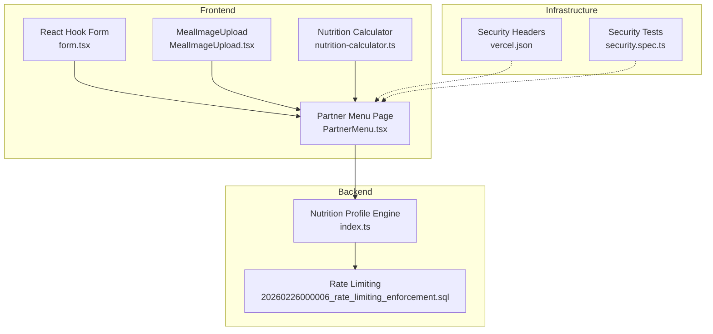
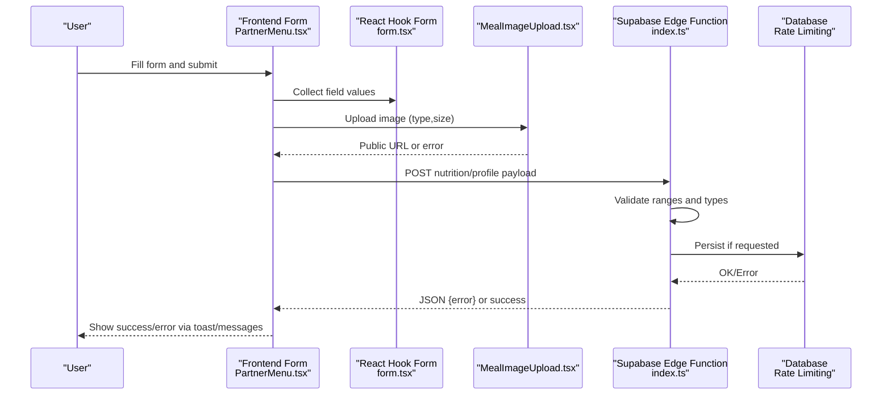
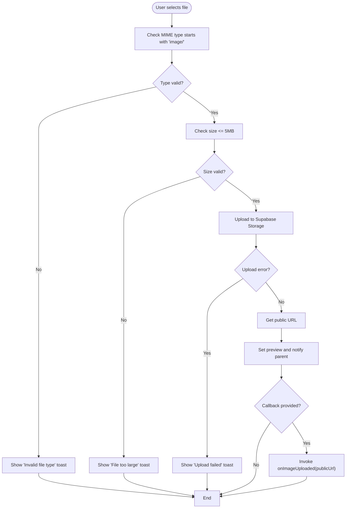
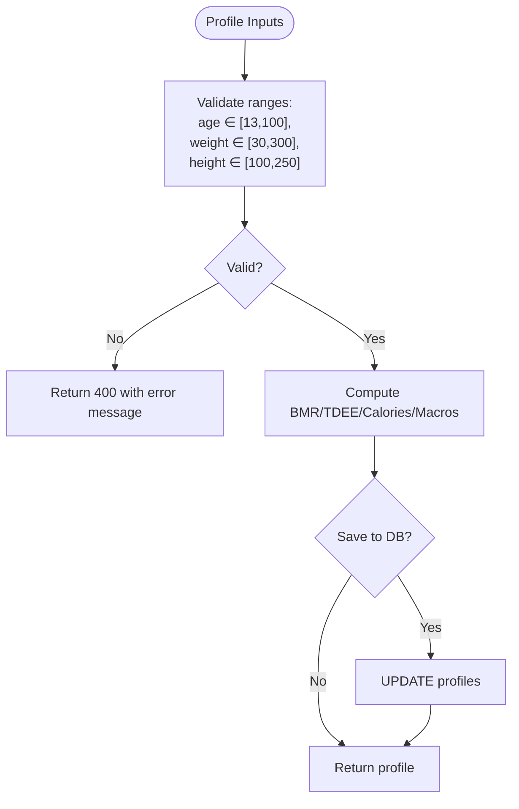
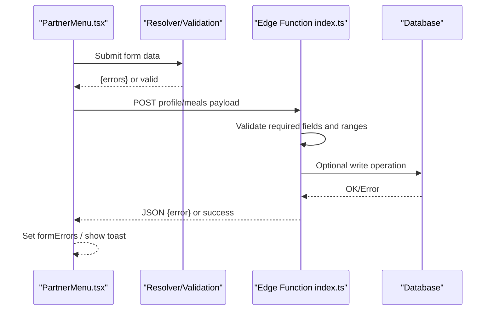
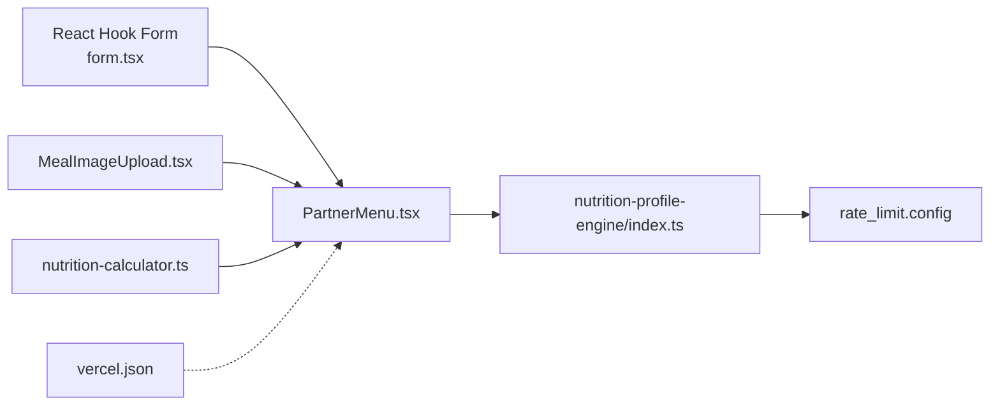

# Input Validation & Sanitization

<cite>
**Referenced Files in This Document**
- [form.tsx](file://src/components/ui/form.tsx)
- [MealImageUpload.tsx](file://src/components/MealImageUpload.tsx)
- [meal-images.ts](file://src/lib/meal-images.ts)
- [nutrition-calculator.ts](file://src/lib/nutrition-calculator.ts)
- [PartnerMenu.tsx](file://src/pages/partner/PartnerMenu.tsx)
- [index.ts](file://supabase/functions/nutrition-profile-engine/index.ts)
- [security.spec.ts](file://e2e/system/security.spec.ts)
- [vercel.json](file://vercel.json)
- [20260226000006_rate_limiting_enforcement.sql](file://supabase/migrations/20260226000006_rate_limiting_enforcement.sql)
- [PRODUCTION_HARDENING_FINAL_SUMMARY.md](file://PRODUCTION_HARDENING_FINAL_SUMMARY.md)
</cite>

## Table of Contents
1. [Introduction](#introduction)
2. [Project Structure](#project-structure)
3. [Core Components](#core-components)
4. [Architecture Overview](#architecture-overview)
5. [Detailed Component Analysis](#detailed-component-analysis)
6. [Dependency Analysis](#dependency-analysis)
7. [Performance Considerations](#performance-considerations)
8. [Troubleshooting Guide](#troubleshooting-guide)
9. [Conclusion](#conclusion)
10. [Appendices](#appendices)

## Introduction
This document provides comprehensive input validation and sanitization guidance for the Nutrio application. It covers frontend and backend validation strategies for user inputs (meal orders, nutritional data, and profile information), image upload validation for meal image processing, API request validation, and error handling patterns. It also documents existing security controls such as rate limiting, CSP headers, and access control, and outlines practical approaches to prevent SQL injection, XSS, and data corruption.

## Project Structure
The validation and sanitization surface spans several layers:
- Frontend form infrastructure and components
- Image upload and preview logic
- Nutrition calculation utilities
- Supabase Edge Functions for profile and nutrition calculations
- End-to-end security tests
- Platform-level security headers and rate limiting

**Diagram sources**
- [form.tsx:1-130](file://src/components/ui/form.tsx#L1-L130)
- [MealImageUpload.tsx:1-178](file://src/components/MealImageUpload.tsx#L1-L178)
- [nutrition-calculator.ts:1-103](file://src/lib/nutrition-calculator.ts#L1-L103)
- [PartnerMenu.tsx:457-493](file://src/pages/partner/PartnerMenu.tsx#L457-L493)
- [index.ts:235-270](file://supabase/functions/nutrition-profile-engine/index.ts#L235-L270)
- [20260226000006_rate_limiting_enforcement.sql:1-30](file://supabase/migrations/20260226000006_rate_limiting_enforcement.sql#L1-L30)
- [vercel.json:1-37](file://vercel.json#L1-L37)
- [security.spec.ts](file://e2e/system/security.spec.ts)

**Section sources**
- [form.tsx:1-130](file://src/components/ui/form.tsx#L1-L130)
- [MealImageUpload.tsx:1-178](file://src/components/MealImageUpload.tsx#L1-L178)
- [nutrition-calculator.ts:1-103](file://src/lib/nutrition-calculator.ts#L1-L103)
- [PartnerMenu.tsx:457-493](file://src/pages/partner/PartnerMenu.tsx#L457-L493)
- [index.ts:235-270](file://supabase/functions/nutrition-profile-engine/index.ts#L235-L270)
- [vercel.json:1-37](file://vercel.json#L1-L37)
- [20260226000006_rate_limiting_enforcement.sql:1-30](file://supabase/migrations/20260226000006_rate_limiting_enforcement.sql#L1-L30)
- [security.spec.ts](file://e2e/system/security.spec.ts)

## Core Components
- React Hook Form base components provide accessible, screen-reader-friendly form state and error propagation.
- MealImageUpload validates file type and size, constructs safe storage paths, and surfaces upload errors via toast feedback.
- Nutrition utilities encapsulate numeric calculations with explicit types and rounding.
- Supabase Edge Function validates profile inputs and returns structured 400 responses for invalid ranges.
- Rate limiting and platform headers provide additional defense-in-depth controls.

**Section sources**
- [form.tsx:1-130](file://src/components/ui/form.tsx#L1-L130)
- [MealImageUpload.tsx:22-96](file://src/components/MealImageUpload.tsx#L22-L96)
- [nutrition-calculator.ts:1-103](file://src/lib/nutrition-calculator.ts#L1-L103)
- [index.ts:235-270](file://supabase/functions/nutrition-profile-engine/index.ts#L235-L270)
- [20260226000006_rate_limiting_enforcement.sql:1-30](file://supabase/migrations/20260226000006_rate_limiting_enforcement.sql#L1-L30)
- [vercel.json:1-37](file://vercel.json#L1-L37)

## Architecture Overview
The validation pipeline integrates frontend, backend, and infrastructure safeguards:

**Diagram sources**
- [PartnerMenu.tsx:457-493](file://src/pages/partner/PartnerMenu.tsx#L457-L493)
- [form.tsx:1-130](file://src/components/ui/form.tsx#L1-L130)
- [MealImageUpload.tsx:22-96](file://src/components/MealImageUpload.tsx#L22-L96)
- [index.ts:235-270](file://supabase/functions/nutrition-profile-engine/index.ts#L235-L270)

## Detailed Component Analysis

### React Hook Form Infrastructure
- Provides accessible labeling, error propagation, and ARIA attributes for screen readers.
- Centralized useFormField extracts field state and ids for consistent UX.
- FormControl sets aria-invalid and aria-describedby based on field errors.

Practical guidance:
- Always wrap inputs in FormField/FormLabel/FormControl/FormMessage.
- Use resolver-driven validation for complex forms; keep error messages concise and actionable.

**Section sources**
- [form.tsx:33-127](file://src/components/ui/form.tsx#L33-L127)

### Meal Image Upload Validation
- File type validation ensures only image/* MIME types are accepted.
- Size validation enforces a 5MB cap.
- Safe filename construction uses a unique suffix derived from mealId and timestamp.
- Public URL retrieval and preview rendering with error fallback.
- Toast-based user feedback for success and failure.

**Diagram sources**
- [MealImageUpload.tsx:22-96](file://src/components/MealImageUpload.tsx#L22-L96)

**Section sources**
- [MealImageUpload.tsx:22-96](file://src/components/MealImageUpload.tsx#L22-L96)

### Nutrition Data Validation and Calculation
- Explicit types for gender, activity level, and goals ensure compile-time safety.
- Numeric ranges and rounding produce predictable outputs.
- The Edge Function validates age, weight, and height bounds and returns structured 400 responses.

**Diagram sources**
- [index.ts:235-270](file://supabase/functions/nutrition-profile-engine/index.ts#L235-L270)
- [nutrition-calculator.ts:1-103](file://src/lib/nutrition-calculator.ts#L1-L103)

**Section sources**
- [index.ts:235-270](file://supabase/functions/nutrition-profile-engine/index.ts#L235-L270)
- [nutrition-calculator.ts:1-103](file://src/lib/nutrition-calculator.ts#L1-L103)

### API Request Validation Patterns
- Frontend validation: PartnerMenu form validation aggregates resolver errors into a keyed object for display.
- Backend validation: Edge Function checks presence and range constraints, returning structured JSON errors.
- Error handling: Toasts and FormMessage present user-friendly feedback.

**Diagram sources**
- [PartnerMenu.tsx:457-463](file://src/pages/partner/PartnerMenu.tsx#L457-L463)
- [index.ts:235-270](file://supabase/functions/nutrition-profile-engine/index.ts#L235-L270)

**Section sources**
- [PartnerMenu.tsx:457-463](file://src/pages/partner/PartnerMenu.tsx#L457-L463)
- [index.ts:235-270](file://supabase/functions/nutrition-profile-engine/index.ts#L235-L270)

### Image Fallback and Deterministic Selection
- When no image URL is provided, deterministic selection is available based on mealId or meal type.
- This reduces reliance on external URLs and avoids potential XSS from untrusted sources.

**Section sources**
- [meal-images.ts:83-168](file://src/lib/meal-images.ts#L83-L168)

## Dependency Analysis
- Frontend depends on Radix UI and React Hook Form for accessible, validated inputs.
- Image upload depends on Supabase Storage for secure file handling and URL generation.
- Backend validation depends on Edge Functions and database constraints.
- Infrastructure headers and rate limiting provide network-level protections.

**Diagram sources**
- [form.tsx:1-130](file://src/components/ui/form.tsx#L1-L130)
- [MealImageUpload.tsx:1-178](file://src/components/MealImageUpload.tsx#L1-L178)
- [nutrition-calculator.ts:1-103](file://src/lib/nutrition-calculator.ts#L1-L103)
- [PartnerMenu.tsx:457-493](file://src/pages/partner/PartnerMenu.tsx#L457-L493)
- [index.ts:235-270](file://supabase/functions/nutrition-profile-engine/index.ts#L235-L270)
- [20260226000006_rate_limiting_enforcement.sql:10-19](file://supabase/migrations/20260226000006_rate_limiting_enforcement.sql#L10-L19)
- [vercel.json:1-37](file://vercel.json#L1-L37)

**Section sources**
- [form.tsx:1-130](file://src/components/ui/form.tsx#L1-L130)
- [MealImageUpload.tsx:1-178](file://src/components/MealImageUpload.tsx#L1-L178)
- [nutrition-calculator.ts:1-103](file://src/lib/nutrition-calculator.ts#L1-L103)
- [PartnerMenu.tsx:457-493](file://src/pages/partner/PartnerMenu.tsx#L457-L493)
- [index.ts:235-270](file://supabase/functions/nutrition-profile-engine/index.ts#L235-L270)
- [20260226000006_rate_limiting_enforcement.sql:1-30](file://supabase/migrations/20260226000006_rate_limiting_enforcement.sql#L1-L30)
- [vercel.json:1-37](file://vercel.json#L1-L37)

## Performance Considerations
- Image validation occurs client-side to reduce unnecessary uploads.
- Numeric calculations are lightweight and deterministic; avoid repeated recalculations by memoizing inputs.
- Rate limiting prevents abuse and maintains service responsiveness under load.

## Troubleshooting Guide
Common validation and sanitization issues:
- Invalid file type or oversized image: The upload component rejects non-image/* and files larger than 5MB and shows a destructive toast.
- Resolver validation failures: PartnerMenu aggregates resolver errors into a keyed object for targeted UI display.
- Backend validation errors: The Edge Function returns structured 400 responses for missing or out-of-range fields; ensure frontend displays these messages clearly.
- Security test failures: End-to-end tests cover SQL injection and XSS protection; review failing scenarios to strengthen sanitization and validation.

Recommended actions:
- Enforce consistent error surfaces: Use FormMessage for field-level errors and toasts for global failures.
- Add input normalization: Trim whitespace, coerce types, and clamp numeric inputs to expected ranges.
- Strengthen backend checks: Validate enums and constrained strings; reject unexpected keys.
- Monitor rate limits: Observe 429 responses and implement client-side retry/backoff.

**Section sources**
- [MealImageUpload.tsx:22-96](file://src/components/MealImageUpload.tsx#L22-L96)
- [PartnerMenu.tsx:457-463](file://src/pages/partner/PartnerMenu.tsx#L457-L463)
- [index.ts:235-270](file://supabase/functions/nutrition-profile-engine/index.ts#L235-L270)
- [security.spec.ts](file://e2e/system/security.spec.ts)

## Conclusion
Nutrio’s validation and sanitization strategy combines client-side form validation, image upload safeguards, numeric calculation utilities, and backend validation with rate limiting and platform headers. To further harden the system:
- Normalize and sanitize all user inputs before persistence.
- Implement strict Content Security Policy and header-based protections consistently.
- Expand end-to-end tests to cover edge cases and regression scenarios.
- Document and enforce validation rules centrally for reuse across forms and APIs.

## Appendices

### Practical Examples and Patterns
- Form validation with React Hook Form:
  - Wrap inputs using FormField, FormLabel, FormControl, FormMessage.
  - Use resolver-based validation for complex rules; surface errors via FormMessage.
  - Reference: [form.tsx:1-130](file://src/components/ui/form.tsx#L1-L130)
- Image upload validation:
  - Validate MIME type and size; construct safe filenames; handle errors with toasts.
  - Reference: [MealImageUpload.tsx:22-96](file://src/components/MealImageUpload.tsx#L22-L96)
- Nutrition data validation:
  - Validate ranges and types; compute targets deterministically; persist only after validation.
  - References: [nutrition-calculator.ts:1-103](file://src/lib/nutrition-calculator.ts#L1-L103), [index.ts:235-270](file://supabase/functions/nutrition-profile-engine/index.ts#L235-L270)
- API request validation:
  - Aggregate resolver errors; return structured JSON errors from Edge Functions; display user-friendly messages.
  - References: [PartnerMenu.tsx:457-463](file://src/pages/partner/PartnerMenu.tsx#L457-L463), [index.ts:235-270](file://supabase/functions/nutrition-profile-engine/index.ts#L235-L270)
- Security controls:
  - Rate limiting configuration and enforcement.
  - Platform headers for XSS/Clickjacking protection.
  - References: [20260226000006_rate_limiting_enforcement.sql:1-30](file://supabase/migrations/20260226000006_rate_limiting_enforcement.sql#L1-L30), [vercel.json:1-37](file://vercel.json#L1-L37), [PRODUCTION_HARDENING_FINAL_SUMMARY.md:105-146](file://PRODUCTION_HARDENING_FINAL_SUMMARY.md#L105-L146)