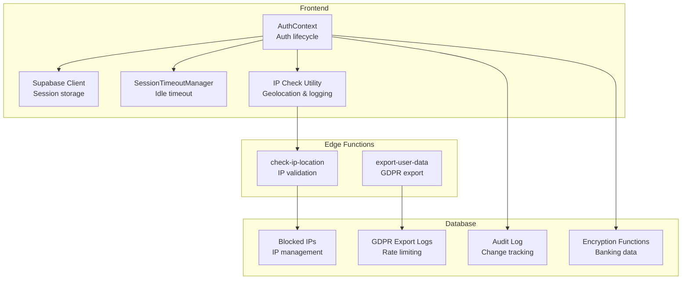
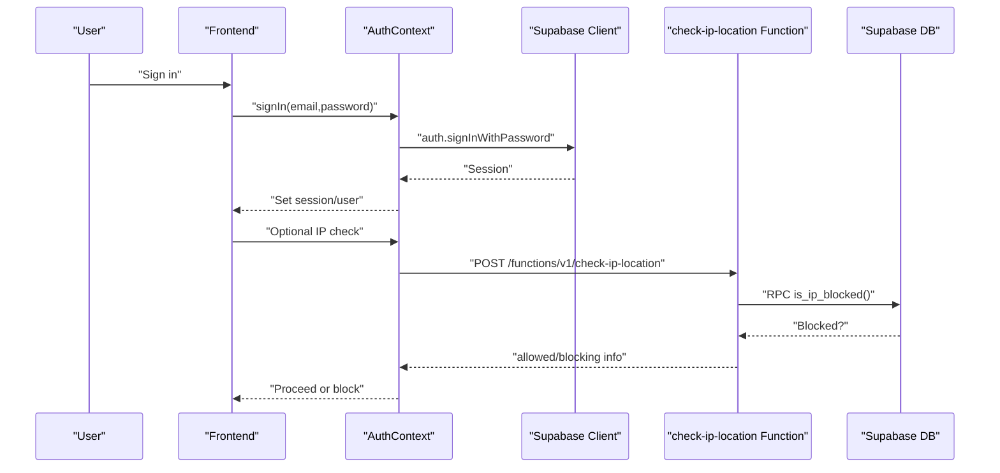
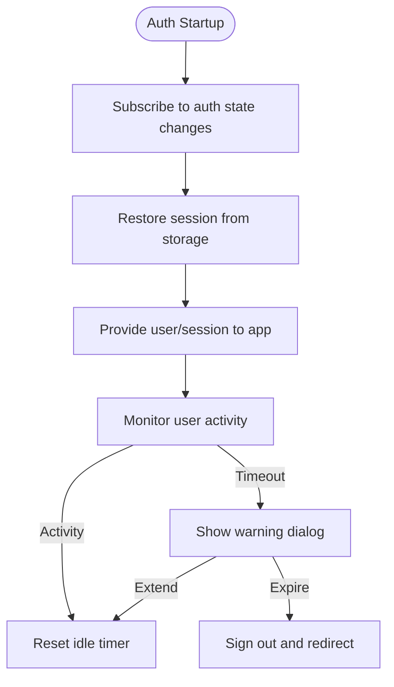
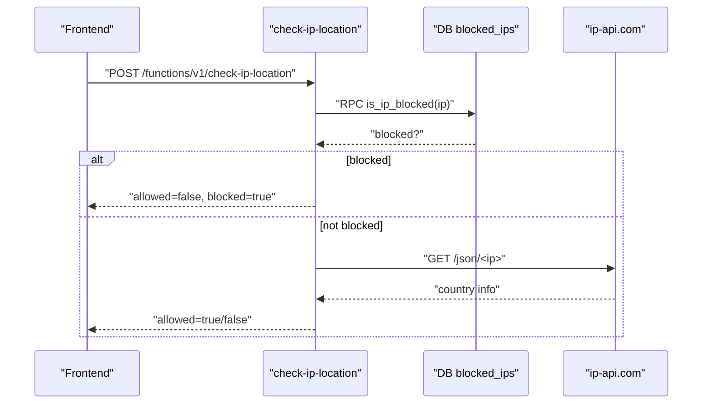
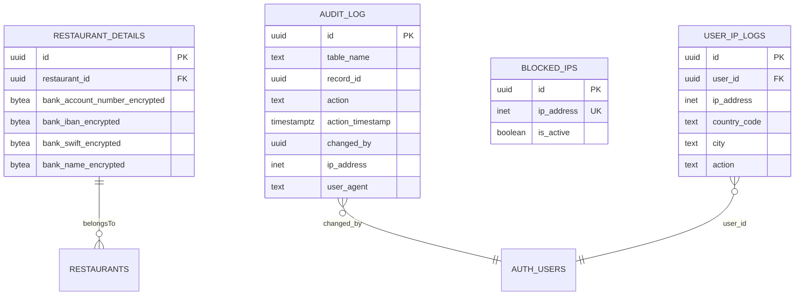
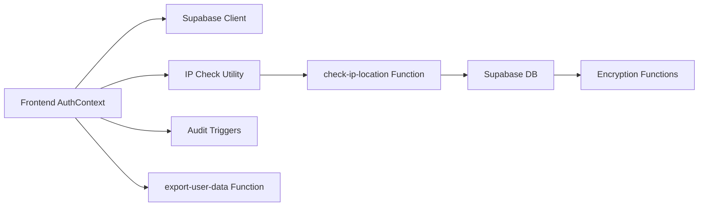

# Security Considerations

<cite>
**Referenced Files in This Document**
- [client.ts](file://src/integrations/supabase/client.ts)
- [AuthContext.tsx](file://src/contexts/AuthContext.tsx)
- [ipCheck.ts](file://src/lib/ipCheck.ts)
- [index.ts](file://supabase/functions/check-ip-location/index.ts)
- [20250219000000_ip_management.sql](file://supabase/migrations/20250219000000_ip_management.sql)
- [20260226000008_fix_rls_and_security_issues.sql](file://supabase/migrations/20260226000008_fix_rls_and_security_issues.sql)
- [20260226000001_encrypt_banking_data.sql](file://supabase/migrations/20260226000001_encrypt_banking_data.sql)
- [20260226000003_audit_logging_system.sql](file://supabase/migrations/20260226000003_audit_logging_system.sql)
- [index.ts](file://supabase/functions/export-user-data/index.ts)
- [20260227000001_add_gdpr_export_logs.sql](file://supabase/migrations/20260227000001_add_gdpr_export_logs.sql)
- [SessionTimeoutManager.tsx](file://src/components/SessionTimeoutManager.tsx)
- [security.spec.ts](file://e2e/system/security.spec.ts)
- [ip.spec.ts](file://e2e/admin/ip.spec.ts)
- [ip_management.spec.ts](file://e2e/admin/ip_management.spec.ts)
- [PRODUCTION_HARDENING_FINAL_SUMMARY.md](file://PRODUCTION_HARDENING_FINAL_SUMMARY.md)
- [COMPLETE_PRODUCTION_AUDIT_FINAL.md](file://COMPLETE_PRODUCTION_AUDIT_FINAL.md)
</cite>

## Table of Contents
1. [Introduction](#introduction)
2. [Project Structure](#project-structure)
3. [Core Components](#core-components)
4. [Architecture Overview](#architecture-overview)
5. [Detailed Component Analysis](#detailed-component-analysis)
6. [Dependency Analysis](#dependency-analysis)
7. [Performance Considerations](#performance-considerations)
8. [Troubleshooting Guide](#troubleshooting-guide)
9. [Conclusion](#conclusion)
10. [Appendices](#appendices)

## Introduction
This document consolidates the security posture of the Nutrio application, focusing on authentication and session management, data protection, input validation and sanitization, audit logging, IP and geographic access control, compliance and privacy measures, and monitoring/alerting. It synthesizes frontend integration with Supabase Auth, backend edge functions and database security controls, and operational runbooks and testing.

## Project Structure
Security-related capabilities span three layers:
- Frontend integration with Supabase Auth for session persistence and token refresh
- Supabase edge functions for IP validation and user IP logging
- Supabase database with row-level security, audit triggers, encryption functions, and GDPR export infrastructure

**Diagram sources**
- [AuthContext.tsx:36-61](file://src/contexts/AuthContext.tsx#L36-L61)
- [client.ts:47-57](file://src/integrations/supabase/client.ts#L47-L57)
- [SessionTimeoutManager.tsx:47-217](file://src/components/SessionTimeoutManager.tsx#L47-L217)
- [ipCheck.ts:19-80](file://src/lib/ipCheck.ts#L19-L80)
- [index.ts:7-107](file://supabase/functions/check-ip-location/index.ts#L7-L107)
- [20250219000000_ip_management.sql:1-60](file://supabase/migrations/20250219000000_ip_management.sql#L1-L60)
- [20260226000003_audit_logging_system.sql:10-52](file://supabase/migrations/20260226000003_audit_logging_system.sql#L10-L52)
- [20260226000001_encrypt_banking_data.sql:67-143](file://supabase/migrations/20260226000001_encrypt_banking_data.sql#L67-L143)
- [index.ts:74-319](file://supabase/functions/export-user-data/index.ts#L74-L319)
- [20260227000001_add_gdpr_export_logs.sql:34-59](file://supabase/migrations/20260227000001_add_gdpr_export_logs.sql#L34-L59)

**Section sources**
- [client.ts:1-57](file://src/integrations/supabase/client.ts#L1-L57)
- [AuthContext.tsx:1-131](file://src/contexts/AuthContext.tsx#L1-L131)
- [ipCheck.ts:1-107](file://src/lib/ipCheck.ts#L1-L107)
- [index.ts:1-107](file://supabase/functions/check-ip-location/index.ts#L1-L107)
- [20250219000000_ip_management.sql:1-60](file://supabase/migrations/20250219000000_ip_management.sql#L1-L60)
- [20260226000003_audit_logging_system.sql:1-373](file://supabase/migrations/20260226000003_audit_logging_system.sql#L1-L373)
- [20260226000001_encrypt_banking_data.sql:1-204](file://supabase/migrations/20260226000001_encrypt_banking_data.sql#L1-L204)
- [index.ts:74-319](file://supabase/functions/export-user-data/index.ts#L74-L319)
- [20260227000001_add_gdpr_export_logs.sql:34-59](file://supabase/migrations/20260227000001_add_gdpr_export_logs.sql#L34-L59)

## Core Components
- Supabase Auth integration with persistent sessions and automatic token refresh
- IP-based access control with blocking and geolocation enforcement
- Audit logging for all data changes with role-aware visibility
- Column-level encryption for sensitive banking data
- GDPR export pipeline with rate limiting and audit trail
- Session timeout manager for idle session termination

**Section sources**
- [client.ts:47-57](file://src/integrations/supabase/client.ts#L47-L57)
- [AuthContext.tsx:36-61](file://src/contexts/AuthContext.tsx#L36-L61)
- [ipCheck.ts:19-80](file://src/lib/ipCheck.ts#L19-L80)
- [index.ts:7-107](file://supabase/functions/check-ip-location/index.ts#L7-L107)
- [20260226000003_audit_logging_system.sql:10-52](file://supabase/migrations/20260226000003_audit_logging_system.sql#L10-L52)
- [20260226000001_encrypt_banking_data.sql:67-143](file://supabase/migrations/20260226000001_encrypt_banking_data.sql#L67-L143)
- [index.ts:74-319](file://supabase/functions/export-user-data/index.ts#L74-L319)
- [SessionTimeoutManager.tsx:47-217](file://src/components/SessionTimeoutManager.tsx#L47-L217)

## Architecture Overview
The security architecture integrates frontend auth state management, edge function validations, and database-level protections.

**Diagram sources**
- [AuthContext.tsx:87-112](file://src/contexts/AuthContext.tsx#L87-L112)
- [ipCheck.ts:47-80](file://src/lib/ipCheck.ts#L47-L80)
- [index.ts:20-107](file://supabase/functions/check-ip-location/index.ts#L20-L107)
- [20250219000000_ip_management.sql:51-60](file://supabase/migrations/20250219000000_ip_management.sql#L51-L60)

## Detailed Component Analysis

### Authentication and Session Management
- Supabase client configured with persistent session storage and automatic token refresh
- Auth state listener initializes push notifications on native platforms
- Session timeout manager enforces 30-minute idle timeout with warning and cross-tab synchronization

**Diagram sources**
- [client.ts:47-57](file://src/integrations/supabase/client.ts#L47-L57)
- [AuthContext.tsx:36-61](file://src/contexts/AuthContext.tsx#L36-L61)
- [SessionTimeoutManager.tsx:170-217](file://src/components/SessionTimeoutManager.tsx#L170-L217)

**Section sources**
- [client.ts:18-42](file://src/integrations/supabase/client.ts#L18-L42)
- [AuthContext.tsx:36-61](file://src/contexts/AuthContext.tsx#L36-L61)
- [SessionTimeoutManager.tsx:47-217](file://src/components/SessionTimeoutManager.tsx#L47-L217)

### Token Validation and Auth Flow
- Frontend uses Supabase client to sign in and persists session in storage
- Optional IP location check is performed before login; failures are handled gracefully (fail-open for reliability)
- Push notification initialization occurs upon sign-in on native platforms

**Section sources**
- [AuthContext.tsx:63-112](file://src/contexts/AuthContext.tsx#L63-L112)
- [ipCheck.ts:47-80](file://src/lib/ipCheck.ts#L47-L80)

### IP Management and Geographic Access Control
- Edge function validates client IP against blocked list and geolocation service
- IP logging is supported via a dedicated function for signup/login actions
- Database tables maintain blocked IPs and user IP logs with RLS policies

**Diagram sources**
- [index.ts:20-107](file://supabase/functions/check-ip-location/index.ts#L20-L107)
- [20250219000000_ip_management.sql:51-60](file://supabase/migrations/20250219000000_ip_management.sql#L51-L60)

**Section sources**
- [ipCheck.ts:19-80](file://src/lib/ipCheck.ts#L19-L80)
- [index.ts:1-107](file://supabase/functions/check-ip-location/index.ts#L1-L107)
- [20250219000000_ip_management.sql:1-60](file://supabase/migrations/20250219000000_ip_management.sql#L1-L60)

### Data Protection Strategies
- Column-level encryption for banking data using symmetric encryption functions
- Secure views expose decrypted data only to owners or admins
- Audit logging captures all changes with user context and request metadata

**Diagram sources**
- [20260226000001_encrypt_banking_data.sql:67-143](file://supabase/migrations/20260226000001_encrypt_banking_data.sql#L67-L143)
- [20260226000003_audit_logging_system.sql:10-52](file://supabase/migrations/20260226000003_audit_logging_system.sql#L10-L52)
- [20250219000000_ip_management.sql:1-31](file://supabase/migrations/20250219000000_ip_management.sql#L1-L31)

**Section sources**
- [20260226000001_encrypt_banking_data.sql:1-204](file://supabase/migrations/20260226000001_encrypt_banking_data.sql#L1-L204)
- [20260226000003_audit_logging_system.sql:1-373](file://supabase/migrations/20260226000003_audit_logging_system.sql#L1-L373)
- [20250219000000_ip_management.sql:1-60](file://supabase/migrations/20250219000000_ip_management.sql#L1-L60)

### Input Validation and Sanitization
- Supabase edge functions validate and sanitize inputs via RPC calls and controlled headers
- Database triggers capture changes and maintain immutable audit logs
- Frontend relies on Supabase client for safe authentication operations

**Section sources**
- [index.ts:20-107](file://supabase/functions/check-ip-location/index.ts#L20-L107)
- [20260226000003_audit_logging_system.sql:74-161](file://supabase/migrations/20260226000003_audit_logging_system.sql#L74-L161)

### Audit Logging System
- Centralized audit log table with indexes and helper functions
- Append-only policy enforced; admin-only visibility
- Partner-specific audit view allows owners to see changes to their data

**Section sources**
- [20260226000003_audit_logging_system.sql:10-52](file://supabase/migrations/20260226000003_audit_logging_system.sql#L10-L52)
- [20260226000003_audit_logging_system.sql:310-324](file://supabase/migrations/20260226000003_audit_logging_system.sql#L310-L324)
- [20260226000003_audit_logging_system.sql:325-347](file://supabase/migrations/20260226000003_audit_logging_system.sql#L325-L347)

### Compliance and Data Privacy (GDPR/CCPA)
- GDPR export endpoint collects user data across relevant tables and logs exports
- Rate limiting prevents abuse (once per 24 hours for users)
- Export logs table tracks who exported what and when

**Section sources**
- [index.ts:74-319](file://supabase/functions/export-user-data/index.ts#L74-L319)
- [20260227000001_add_gdpr_export_logs.sql:34-59](file://supabase/migrations/20260227000001_add_gdpr_export_logs.sql#L34-L59)

### Monitoring and Alerting
- Incident response runbooks define severity levels and escalation matrix
- Performance budgets and load testing included in production hardening
- Security testing coverage in end-to-end test suite

**Section sources**
- [COMPLETE_PRODUCTION_AUDIT_FINAL.md:618-671](file://COMPLETE_PRODUCTION_AUDIT_FINAL.md#L618-L671)
- [PRODUCTION_HARDENING_FINAL_SUMMARY.md:340-396](file://PRODUCTION_HARDENING_FINAL_SUMMARY.md#L340-L396)
- [security.spec.ts:1-727](file://e2e/system/security.spec.ts#L1-L727)

## Dependency Analysis
The system exhibits clear separation of concerns:
- Frontend depends on Supabase client and local storage for sessions
- Edge functions depend on Supabase RPC and external geolocation service
- Database enforces RLS and maintains audit trails and encryption functions

**Diagram sources**
- [AuthContext.tsx:36-61](file://src/contexts/AuthContext.tsx#L36-L61)
- [client.ts:47-57](file://src/integrations/supabase/client.ts#L47-L57)
- [ipCheck.ts:47-80](file://src/lib/ipCheck.ts#L47-L80)
- [index.ts:7-107](file://supabase/functions/check-ip-location/index.ts#L7-L107)
- [20260226000003_audit_logging_system.sql:163-177](file://supabase/migrations/20260226000003_audit_logging_system.sql#L163-L177)
- [20260226000001_encrypt_banking_data.sql:29-66](file://supabase/migrations/20260226000001_encrypt_banking_data.sql#L29-L66)
- [index.ts:74-319](file://supabase/functions/export-user-data/index.ts#L74-L319)

**Section sources**
- [client.ts:47-57](file://src/integrations/supabase/client.ts#L47-L57)
- [AuthContext.tsx:36-61](file://src/contexts/AuthContext.tsx#L36-L61)
- [ipCheck.ts:47-80](file://src/lib/ipCheck.ts#L47-L80)
- [index.ts:7-107](file://supabase/functions/check-ip-location/index.ts#L7-L107)
- [20260226000003_audit_logging_system.sql:163-177](file://supabase/migrations/20260226000003_audit_logging_system.sql#L163-L177)
- [20260226000001_encrypt_banking_data.sql:29-66](file://supabase/migrations/20260226000001_encrypt_banking_data.sql#L29-L66)
- [index.ts:74-319](file://supabase/functions/export-user-data/index.ts#L74-L319)

## Performance Considerations
- Session timeout reduces stale active sessions and improves resource utilization
- Audit log indexing supports efficient querying; consider partitioning strategies for scale
- Edge function failures are handled with fail-open behavior to preserve availability

[No sources needed since this section provides general guidance]

## Troubleshooting Guide
- Authentication issues: verify environment variables for Supabase URL and publishable key; ensure storage adapter is initialized
- IP validation failures: inspect edge function logs and geolocation service availability; note fail-open behavior
- Audit log visibility: confirm admin role or partner-specific view permissions
- GDPR export errors: check rate limit and export logs table for audit

**Section sources**
- [client.ts:10-16](file://src/integrations/supabase/client.ts#L10-L16)
- [ipCheck.ts:57-80](file://src/lib/ipCheck.ts#L57-L80)
- [20260226000003_audit_logging_system.sql:313-324](file://supabase/migrations/20260226000003_audit_logging_system.sql#L313-L324)
- [index.ts:74-319](file://supabase/functions/export-user-data/index.ts#L74-L319)

## Conclusion
Nutrio’s security architecture combines robust authentication with Supabase, database-level audit and encryption, IP-based access control, and GDPR-compliant data export capabilities. Operational readiness includes incident response runbooks, performance budgets, and continuous security testing.

[No sources needed since this section summarizes without analyzing specific files]

## Appendices

### Practical Examples and Best Practices
- Enforce session timeouts during long-running operations by pausing the timeout when initiating uploads or API calls
- Use the audit log functions to investigate unauthorized changes and maintain compliance
- Implement strict RLS policies and regularly review access controls for sensitive tables

**Section sources**
- [SessionTimeoutManager.tsx:227-248](file://src/components/SessionTimeoutManager.tsx#L227-L248)
- [20260226000003_audit_logging_system.sql:206-291](file://supabase/migrations/20260226000003_audit_logging_system.sql#L206-L291)

### Security Testing Coverage
- End-to-end tests include security-focused scenarios such as SQL injection protection and IP management workflows

**Section sources**
- [security.spec.ts:1-727](file://e2e/system/security.spec.ts#L1-L727)
- [ip.spec.ts:35-52](file://e2e/admin/ip.spec.ts#L35-L52)
- [ip_management.spec.ts:1-22](file://e2e/admin/ip_management.spec.ts#L1-L22)