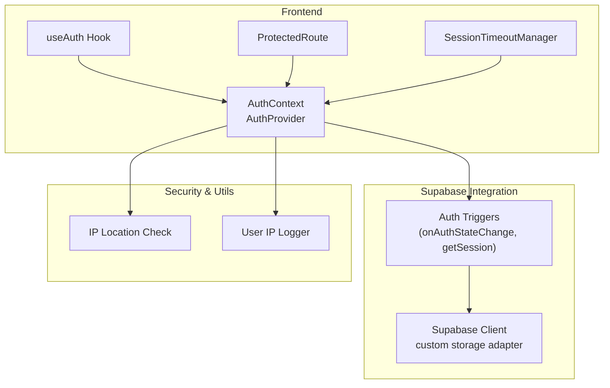
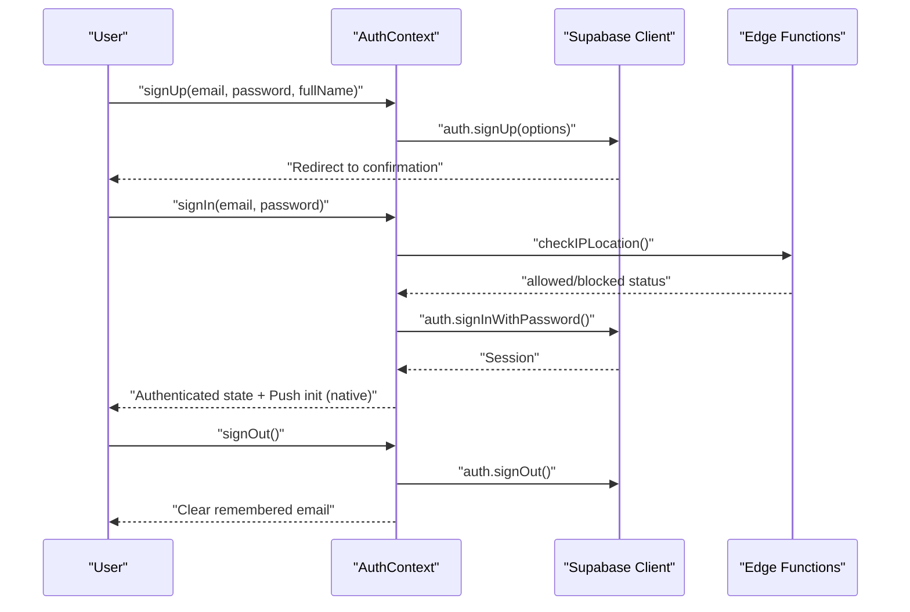
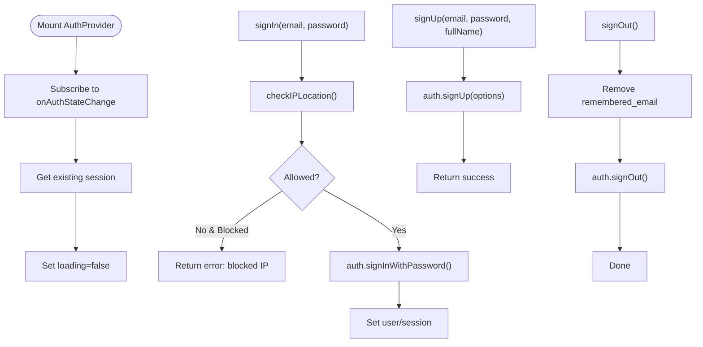
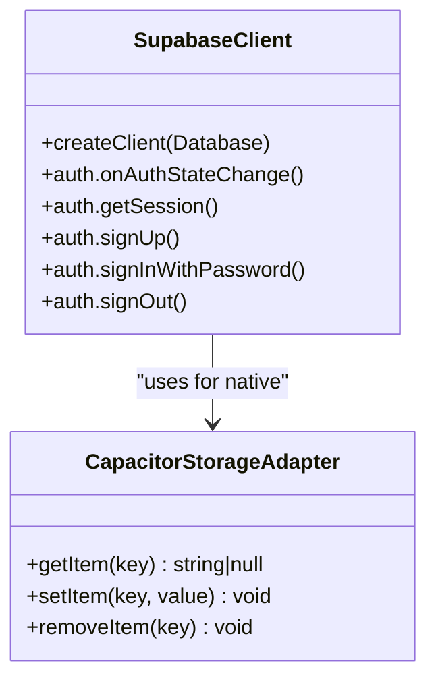
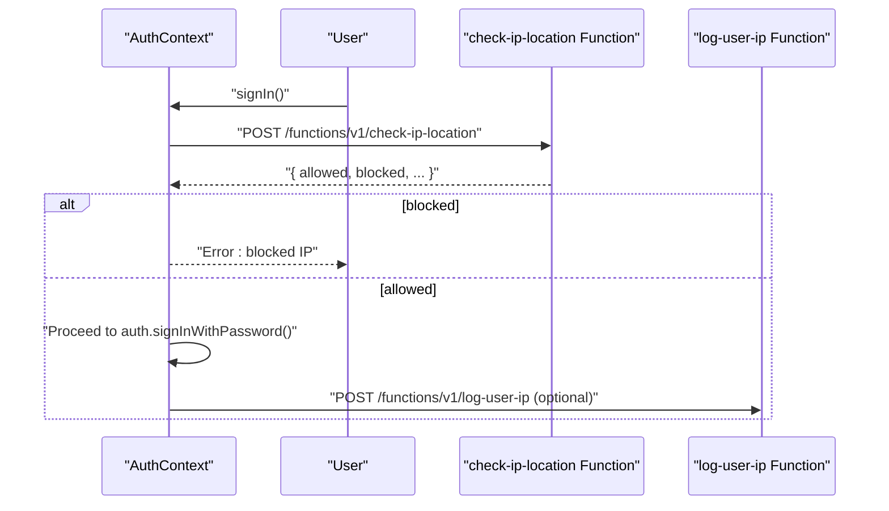
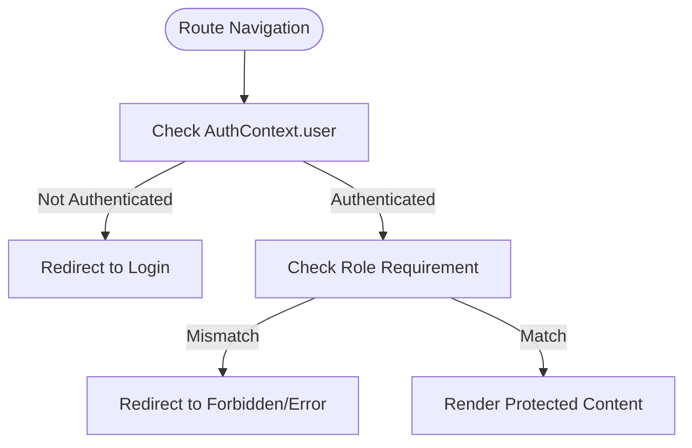
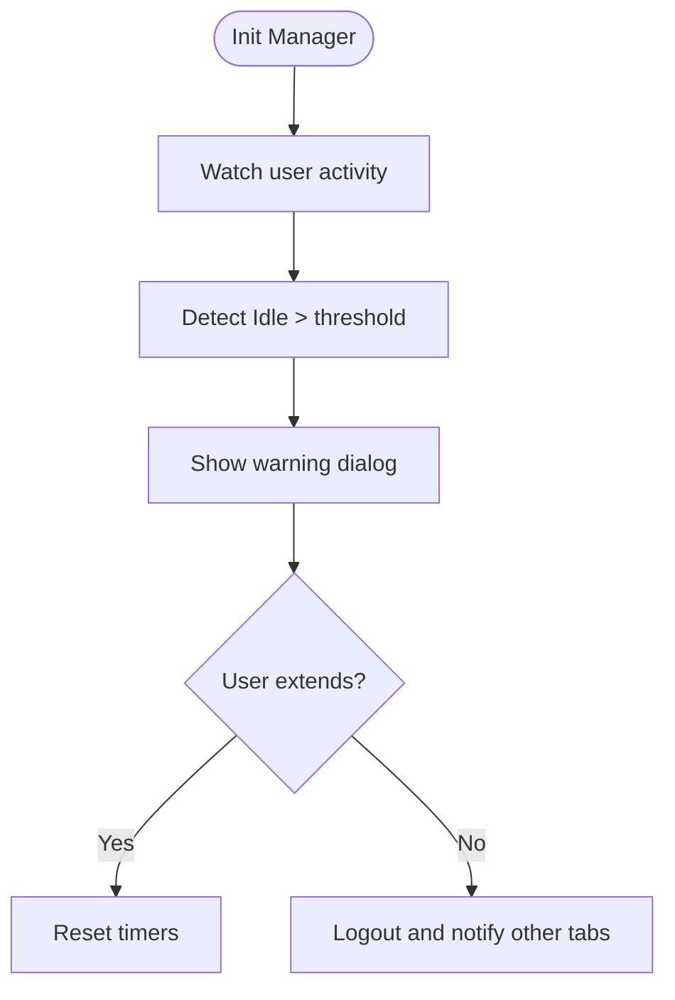
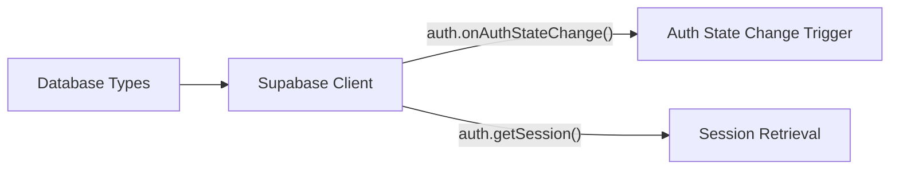
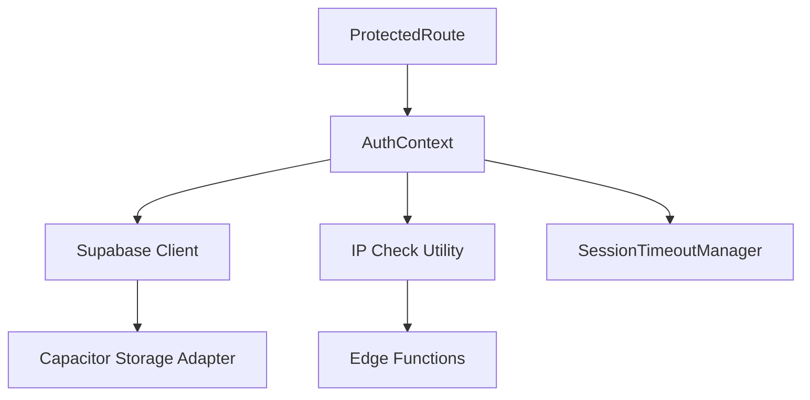

# Authentication Integration

<cite>
**Referenced Files in This Document**
- [AuthContext.tsx](file://src/contexts/AuthContext.tsx)
- [client.ts](file://src/integrations/supabase/client.ts)
- [ipCheck.ts](file://src/lib/ipCheck.ts)
- [ProtectedRoute.tsx](file://src/components/ProtectedRoute.tsx)
- [SessionTimeoutManager.tsx](file://src/components/SessionTimeoutManager.tsx)
- [types.ts](file://src/integrations/supabase/types.ts)
- [auth.spec.ts](file://e2e/customer/auth.spec.ts)
- [auth.spec.ts](file://e2e/admin/auth.spec.ts)
- [auth.spec.ts](file://e2e/driver/auth.spec.ts)
- [auth.spec.ts](file://e2e/partner/auth.spec.ts)
</cite>

## Table of Contents
1. [Introduction](#introduction)
2. [Project Structure](#project-structure)
3. [Core Components](#core-components)
4. [Architecture Overview](#architecture-overview)
5. [Detailed Component Analysis](#detailed-component-analysis)
6. [Dependency Analysis](#dependency-analysis)
7. [Performance Considerations](#performance-considerations)
8. [Troubleshooting Guide](#troubleshooting-guide)
9. [Conclusion](#conclusion)
10. [Appendices](#appendices)

## Introduction
This document explains the Supabase authentication integration across the frontend application. It covers the authentication flow (login, logout, session management, and token handling), the authentication context provider, session persistence, IP location verification, user activity logging, and security measures. It also documents role-based access control (RBAC) patterns, protected route implementation, and integration with Supabase Auth triggers. The goal is to help developers implement secure, reliable authentication across web and native platforms.

## Project Structure
The authentication system is composed of:
- An authentication context provider that manages user state, session lifecycle, and authentication actions
- A Supabase client configured with a custom storage adapter for native environments
- Utilities for IP location verification and user IP logging
- Protected routing and session timeout management
- Supabase database types for type-safe access

**Diagram sources**
- [AuthContext.tsx:31-61](file://src/contexts/AuthContext.tsx#L31-L61)
- [client.ts:47-57](file://src/integrations/supabase/client.ts#L47-L57)
- [ipCheck.ts:19-80](file://src/lib/ipCheck.ts#L19-L80)

**Section sources**
- [AuthContext.tsx:1-131](file://src/contexts/AuthContext.tsx#L1-L131)
- [client.ts:1-57](file://src/integrations/supabase/client.ts#L1-L57)
- [ipCheck.ts:1-107](file://src/lib/ipCheck.ts#L1-L107)

## Core Components
- Authentication Context Provider: Centralizes authentication state, exposes sign-up, sign-in, and sign-out actions, and sets up the Supabase auth state listener.
- Supabase Client: Configured with a custom storage adapter for Capacitor native apps and localStorage for web, enabling persistent sessions and automatic token refresh.
- IP Location Utilities: Provides IP geolocation checks and user IP logging via Supabase Edge Functions.
- Protected Routes: Guards routes based on authentication state and optional role requirements.
- Session Timeout Manager: Monitors user inactivity and logs out users after a configurable idle period.

**Section sources**
- [AuthContext.tsx:8-25](file://src/contexts/AuthContext.tsx#L8-L25)
- [client.ts:18-42](file://src/integrations/supabase/client.ts#L18-L42)
- [ipCheck.ts:87-107](file://src/lib/ipCheck.ts#L87-L107)
- [ProtectedRoute.tsx](file://src/components/ProtectedRoute.tsx)
- [SessionTimeoutManager.tsx:47-287](file://src/components/SessionTimeoutManager.tsx#L47-L287)

## Architecture Overview
The authentication architecture integrates React context, Supabase Auth, and custom utilities for IP checks and logging. The Supabase client uses a storage adapter to persist sessions on native devices. The auth context listens for auth state changes and initializes push notifications on native platforms upon sign-in.

**Diagram sources**
- [AuthContext.tsx:63-118](file://src/contexts/AuthContext.tsx#L63-L118)
- [client.ts:47-57](file://src/integrations/supabase/client.ts#L47-L57)
- [ipCheck.ts:19-80](file://src/lib/ipCheck.ts#L19-L80)

## Detailed Component Analysis

### Authentication Context Provider
The provider sets up the Supabase auth state listener, retrieves the current session, and exposes sign-up, sign-in, and sign-out functions. It also initializes push notifications on native platforms and clears remembered credentials on logout.

Key behaviors:
- Subscribes to auth state changes and updates user/session state
- Retrieves existing session on mount
- Implements sign-up with redirect-to-dashboard and optional user metadata
- Implements sign-in with pre-login IP location check (fail-open policy)
- Clears remembered email on sign-out

**Diagram sources**
- [AuthContext.tsx:36-61](file://src/contexts/AuthContext.tsx#L36-L61)
- [AuthContext.tsx:63-118](file://src/contexts/AuthContext.tsx#L63-L118)
- [ipCheck.ts:19-80](file://src/lib/ipCheck.ts#L19-L80)

**Section sources**
- [AuthContext.tsx:31-130](file://src/contexts/AuthContext.tsx#L31-L130)

### Supabase Client and Session Persistence
The Supabase client is configured with:
- A custom storage adapter for Capacitor native apps using Preferences
- Fallback to localStorage for web
- Persistent sessions and automatic token refresh enabled

**Diagram sources**
- [client.ts:18-42](file://src/integrations/supabase/client.ts#L18-L42)
- [client.ts:47-57](file://src/integrations/supabase/client.ts#L47-L57)

**Section sources**
- [client.ts:18-57](file://src/integrations/supabase/client.ts#L18-L57)

### IP Location Verification and User Activity Logging
The IP location utility performs a pre-login check against a Supabase Edge Function and returns an allowed/blocked status. The implementation currently bypasses restrictions for E2E testing but retains the function call pattern. User IP is optionally logged via another Edge Function.

**Diagram sources**
- [ipCheck.ts:19-80](file://src/lib/ipCheck.ts#L19-L80)
- [ipCheck.ts:87-107](file://src/lib/ipCheck.ts#L87-L107)

**Section sources**
- [ipCheck.ts:19-107](file://src/lib/ipCheck.ts#L19-L107)

### Protected Routes and RBAC
ProtectedRoute enforces authentication state and can be extended to enforce roles. The system supports caching roles in the auth context to avoid repeated queries and redirects unauthorized users to appropriate destinations.

**Diagram sources**
- [ProtectedRoute.tsx](file://src/components/ProtectedRoute.tsx)

**Section sources**
- [ProtectedRoute.tsx](file://src/components/ProtectedRoute.tsx)

### Session Timeout Management
The SessionTimeoutManager monitors user inactivity, warns before logout, and logs out users after a configured idle period. It synchronizes activity across browser tabs using BroadcastChannel and handles edge cases like long-running submissions and uploads.

**Diagram sources**
- [SessionTimeoutManager.tsx:47-287](file://src/components/SessionTimeoutManager.tsx#L47-L287)

**Section sources**
- [SessionTimeoutManager.tsx:47-287](file://src/components/SessionTimeoutManager.tsx#L47-L287)

### Supabase Auth Triggers and Types
Supabase Auth triggers are managed by the client configuration and auth state listener. The database types file defines the schema used by the Supabase client, ensuring type-safe access to tables and enums.

**Diagram sources**
- [client.ts:47-57](file://src/integrations/supabase/client.ts#L47-L57)
- [types.ts:1-50](file://src/integrations/supabase/types.ts#L1-L50)

**Section sources**
- [client.ts:47-57](file://src/integrations/supabase/client.ts#L47-L57)
- [types.ts:1-50](file://src/integrations/supabase/types.ts#L1-L50)

## Dependency Analysis
The authentication stack depends on:
- Supabase client for auth operations and session persistence
- Capacitor Preferences for native session storage
- Edge Functions for IP checks and user IP logging
- React context for state management and hook consumption

**Diagram sources**
- [AuthContext.tsx:31-130](file://src/contexts/AuthContext.tsx#L31-L130)
- [client.ts:18-57](file://src/integrations/supabase/client.ts#L18-L57)
- [ipCheck.ts:19-107](file://src/lib/ipCheck.ts#L19-L107)
- [SessionTimeoutManager.tsx:47-287](file://src/components/SessionTimeoutManager.tsx#L47-L287)

**Section sources**
- [AuthContext.tsx:31-130](file://src/contexts/AuthContext.tsx#L31-L130)
- [client.ts:18-57](file://src/integrations/supabase/client.ts#L18-L57)
- [ipCheck.ts:19-107](file://src/lib/ipCheck.ts#L19-L107)
- [SessionTimeoutManager.tsx:47-287](file://src/components/SessionTimeoutManager.tsx#L47-L287)

## Performance Considerations
- Prefer automatic token refresh and persisted sessions to minimize re-authentication overhead
- Use BroadcastChannel for cross-tab synchronization to reduce redundant timers
- Defer non-critical operations (like IP logging) to avoid blocking the sign-in flow
- Cache roles in the auth context to avoid repeated database queries

## Troubleshooting Guide
Common issues and resolutions:
- Missing Supabase configuration: The client logs an error if environment variables are missing; ensure VITE_SUPABASE_URL and VITE_SUPABASE_PUBLISHABLE_KEY are set
- Native session persistence failures: Capacitor Preferences operations are wrapped to fail silently; sessions may not persist across app restarts
- IP location check failures: The check is fail-open; if the function is unreachable, login proceeds with a warning
- Push notification initialization on native: Attempted on sign-in; failures are logged and do not block authentication
- Protected route navigation: Ensure ProtectedRoute is wrapped around routes and that role checks are implemented as needed

**Section sources**
- [client.ts:10-16](file://src/integrations/supabase/client.ts#L10-L16)
- [client.ts:28-41](file://src/integrations/supabase/client.ts#L28-L41)
- [ipCheck.ts:57-79](file://src/lib/ipCheck.ts#L57-L79)
- [AuthContext.tsx:44-49](file://src/contexts/AuthContext.tsx#L44-L49)
- [ProtectedRoute.tsx](file://src/components/ProtectedRoute.tsx)

## Conclusion
The authentication integration leverages Supabase Auth with a robust React context provider, custom storage for native environments, and utilities for IP verification and user activity logging. The system supports protected routes, session timeout management, and can be extended to enforce role-based access control. By following the patterns outlined here, teams can implement secure, maintainable authentication across web and native platforms.

## Appendices

### Example: Implementing Protected Routes
- Wrap route components with ProtectedRoute
- Optionally pass role props to enforce RBAC
- Redirect unauthenticated users to the login page
- Redirect unauthorized users to an error or forbidden page

**Section sources**
- [ProtectedRoute.tsx](file://src/components/ProtectedRoute.tsx)

### Example: Handling Authentication State
- Consume useAuth in components to access user, session, loading, and authentication methods
- Use loading state to show spinners or placeholders during session retrieval
- Clear remembered credentials on sign-out

**Section sources**
- [AuthContext.tsx:19-25](file://src/contexts/AuthContext.tsx#L19-L25)
- [AuthContext.tsx:114-118](file://src/contexts/AuthContext.tsx#L114-L118)

### Example: Integrating with Supabase Auth Triggers
- Listen for auth state changes using onAuthStateChange
- Retrieve the current session using getSession
- Initialize platform-specific services (e.g., push notifications) on sign-in

**Section sources**
- [AuthContext.tsx:36-61](file://src/contexts/AuthContext.tsx#L36-L61)
- [client.ts:47-57](file://src/integrations/supabase/client.ts#L47-L57)

### End-to-End Test Coverage
- Authentication tests exist for customer, admin, driver, and partner portals
- These tests validate sign-up, sign-in, and logout flows across environments

**Section sources**
- [auth.spec.ts](file://e2e/customer/auth.spec.ts)
- [auth.spec.ts](file://e2e/admin/auth.spec.ts)
- [auth.spec.ts](file://e2e/driver/auth.spec.ts)
- [auth.spec.ts](file://e2e/partner/auth.spec.ts)