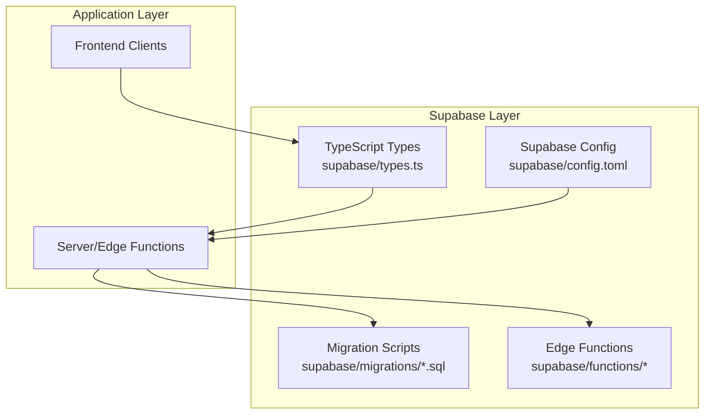
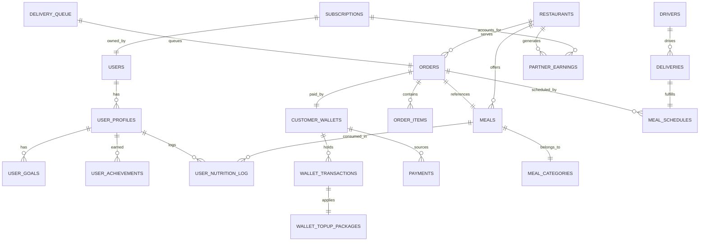
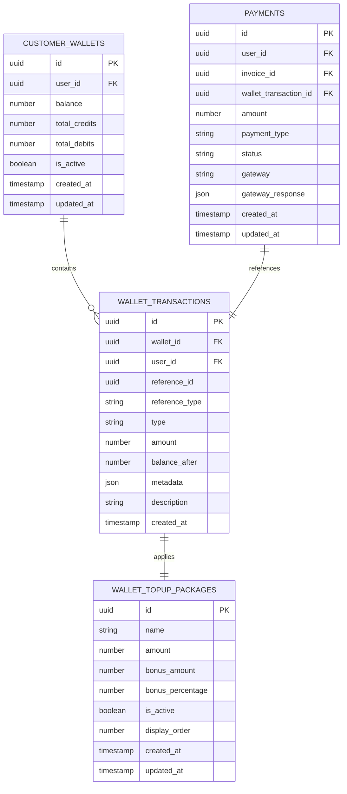
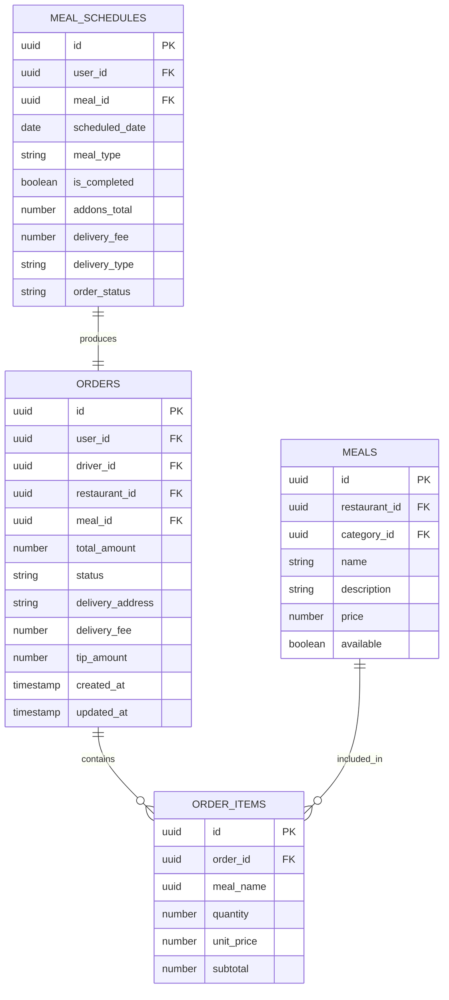
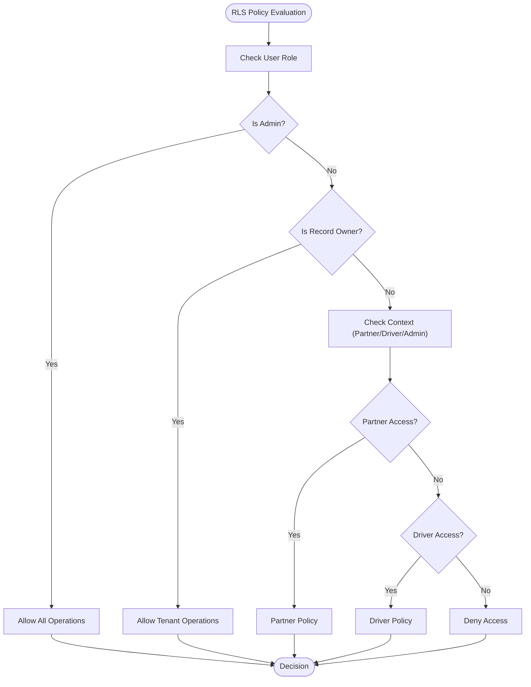
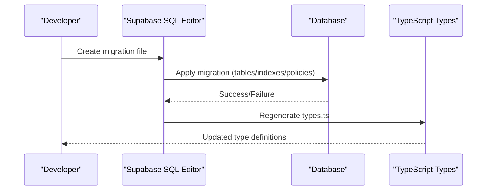
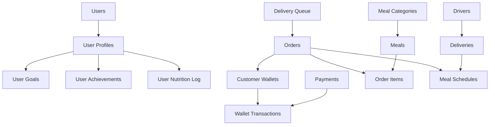

# Database Schema & Migrations

<cite>
**Referenced Files in This Document**
- [types.ts](file://supabase/types.ts)
- [config.toml](file://supabase/config.toml)
- [20240101000000_add_notification_preferences.sql](file://supabase/migrations/20240101000000_add_notification_preferences.sql)
- [20240101000001_add_nps_responses.sql](file://supabase/migrations/20240101000001_add_nps_responses.sql)
- [20240101000002_add_cancel_order_rpc.sql](file://supabase/migrations/20240101000002_add_cancel_order_rpc.sql)
- [20240101000003_add_delivery_queue.sql](file://supabase/migrations/20240101000003_add_delivery_queue.sql)
- [20240101_driver_app.sql](file://supabase/migrations/20240101_driver_app.sql)
- [20250218000001_add_performance_indexes.sql](file://supabase/migrations/20250218000001_add_performance_indexes.sql)
- [20250218000002_rls_audit_and_policies.sql](file://supabase/migrations/20250218000002_rls_audit_and_policies.sql)
- [fix_admin_tables.sql](file://fix_admin_tables.sql)
- [fix_homepage_errors.sql](file://fix_homepage_errors.sql)
</cite>

## Table of Contents
1. [Introduction](#introduction)
2. [Project Structure](#project-structure)
3. [Core Components](#core-components)
4. [Architecture Overview](#architecture-overview)
5. [Detailed Component Analysis](#detailed-component-analysis)
6. [Dependency Analysis](#dependency-analysis)
7. [Performance Considerations](#performance-considerations)
8. [Troubleshooting Guide](#troubleshooting-guide)
9. [Conclusion](#conclusion)

## Introduction
This document provides comprehensive documentation for the Supabase database schema and migration system powering the Nutrio platform. It covers entity relationship diagrams, row-level security (RLS) policies, migration strategy, adaptive goals and wallet systems, and practical guidance for extending the schema safely. The content is derived from the Supabase schema definitions, migration scripts, and supporting SQL fixes.

## Project Structure
The database layer is organized around:
- Supabase schema definitions exported via TypeScript types for strong typing in the frontend
- A migration system that evolves the schema over time with explicit RLS and indexes
- Edge functions and stored procedures enabling advanced workflows (e.g., order cancellation, delivery assignment)
- Operational fixes for admin dashboards and schema corrections



**Diagram sources**
- [types.ts:1-3167](file://supabase/types.ts#L1-L3167)
- [config.toml:1-59](file://supabase/config.toml#L1-L59)

**Section sources**
- [types.ts:1-3167](file://supabase/types.ts#L1-L3167)
- [config.toml:1-59](file://supabase/config.toml#L1-L59)

## Core Components
This section outlines the primary database components relevant to the adaptive goals system, wallet system, and other major features.

- Adaptive Goals System
  - User health goals and profiles: user_goals, user_profiles
  - Nutrition logging: user_nutrition_log
  - Achievements and progress tracking: achievements, user_achievements

- Wallet System
  - Customer wallets: customer_wallets
  - Wallet transactions: wallet_transactions
  - Top-up packages: wallet_topup_packages
  - Payment integration: payments
  - Helper functions: credit_wallet, debit_wallet, create_wallet_topup_invoice

- Delivery and Driver Management
  - Delivery queue: delivery_queue
  - Deliveries: deliveries
  - Drivers: drivers
  - Driver payouts and reviews: driver_payouts, driver_reviews

- Order and Meal Management
  - Orders and order items: orders, order_items
  - Meal scheduling: meal_schedules
  - Meals and categories: meals, meal_categories

- Analytics and Insights
  - NPS responses: nps_responses
  - Partner analytics: partner_analytics
  - Health tips: health_tips

**Section sources**
- [types.ts:16-3167](file://supabase/types.ts#L16-L3167)

## Architecture Overview
The database architecture centers on:
- Strong typing via generated TypeScript interfaces for all tables, views, enums, and functions
- Row Level Security (RLS) policies enforcing tenant isolation and role-based access
- Indexes optimized for frequent queries across orders, subscriptions, meals, and analytics
- Stored procedures and RPCs for complex workflows (e.g., order cancellation, delivery assignment)



**Diagram sources**
- [types.ts:16-3167](file://supabase/types.ts#L16-L3167)

## Detailed Component Analysis

### Adaptive Goals System
The adaptive goals system tracks user health goals, nutrition intake, and achievements.

```mermaid
erDiagram
USER_PROFILES {
uuid id PK
uuid user_id UK
string username
string display_name
boolean is_public
json goals
number total_calories_burned
number total_workouts
number streak_days
}
USER_GOALS {
uuid id PK
uuid user_id FK
enum goal
enum gender_type gender
number age
number height
number current_weight
number target_weight
string activity_level
}
USER_NUTRITION_LOG {
uuid id PK
uuid user_id FK
uuid meal_id FK
date date
number calories
number protein
number carbs
number fats
}
ACHIEVEMENTS {
uuid id PK
string name
string description
string icon
string category
number requirement_value
string requirement_type
}
USER_ACHIEVEMENTS {
uuid id PK
uuid user_id FK
uuid achievement_id FK
timestamp earned_at
boolean is_featured
}
USER_PROFILES ||--o{ USER_GOALS : "has"
USER_PROFILES ||--o{ USER_NUTRITION_LOG : "logs"
USER_PROFILES ||--o{ USER_ACHIEVEMENTS : "earns"
ACHIEVEMENTS ||--o{ USER_ACHIEVEMENTS : "awarded"
MEALS ||--o{ USER_NUTRITION_LOG : "consumed"
```

**Diagram sources**
- [types.ts:2622-2702](file://supabase/types.ts#L2622-L2702)
- [types.ts:2704-2747](file://supabase/types.ts#L2704-L2747)
- [types.ts:2748-2803](file://supabase/types.ts#L2748-L2803)
- [types.ts:2805-2831](file://supabase/types.ts#L2805-L2831)

**Section sources**
- [types.ts:2622-2831](file://supabase/types.ts#L2622-L2831)

### Wallet System
The wallet system manages customer credits, top-ups, and transactions.



**Diagram sources**
- [types.ts:2832-2920](file://supabase/types.ts#L2832-L2920)
- [types.ts:2921-2979](file://supabase/types.ts#L2921-L2979)
- [types.ts:2980-3023](file://supabase/types.ts#L2980-L3023)
- [types.ts:2007-2075](file://supabase/types.ts#L2007-L2075)

**Section sources**
- [types.ts:2832-3023](file://supabase/types.ts#L2832-L3023)

### Delivery and Driver Management
The delivery queue and driver management system coordinates order assignment and fulfillment.

```mermaid
erDiagram
DRIVERS {
uuid id PK
uuid user_id FK
enum vehicle_type vehicle_type
string vehicle_make
string vehicle_model
string vehicle_plate
string license_number
boolean is_online
number rating
number total_deliveries
number wallet_balance
enum approval_status approval_status
}
DELIVERY_QUEUE {
uuid id PK
uuid order_id FK
uuid restaurant_id FK
enum status
uuid assigned_driver_id FK
number priority_score
timestamp queued_at
timestamp expires_at
json metadata
}
DELIVERIES {
uuid id PK
uuid schedule_id FK
uuid driver_id FK
uuid restaurant_id FK
uuid user_id FK
enum delivery_status status
string delivery_address
number delivery_fee
number tip_amount
timestamp claimed_at
timestamp picked_up_at
timestamp delivered_at
}
DRIVERS ||--o{ DELIVERIES : "drives"
DELIVERY_QUEUE ||--|| ORDERS : "queues"
DELIVERIES ||--|| MEAL_SCHEDULES : "fulfills"
```

**Diagram sources**
- [types.ts:529-589](file://supabase/types.ts#L529-L589)
- [types.ts:1131-1193](file://supabase/types.ts#L1131-L1193)
- [types.ts:231-330](file://supabase/types.ts#L231-L330)

**Section sources**
- [types.ts:529-589](file://supabase/types.ts#L529-L589)
- [types.ts:1131-1193](file://supabase/types.ts#L1131-L1193)
- [types.ts:231-330](file://supabase/types.ts#L231-L330)

### Order and Meal Management
Order lifecycle and meal scheduling are central to the platform.



**Diagram sources**
- [types.ts:1697-1789](file://supabase/types.ts#L1697-L1789)
- [types.ts:1614-1651](file://supabase/types.ts#L1614-L1651)
- [types.ts:1342-1394](file://supabase/types.ts#L1342-L1394)
- [types.ts:1395-1459](file://supabase/types.ts#L1395-L1459)

**Section sources**
- [types.ts:1697-1789](file://supabase/types.ts#L1697-L1789)
- [types.ts:1614-1651](file://supabase/types.ts#L1614-L1651)
- [types.ts:1342-1394](file://supabase/types.ts#L1342-L1394)
- [types.ts:1395-1459](file://supabase/types.ts#L1395-L1459)

### Row-Level Security (RLS) Policies
RLS policies enforce tenant isolation and role-based access across tables. The policy audit script ensures RLS is enabled and defines strict rules for orders, subscriptions, meals, restaurants, wallets, notifications, and more.

Key policy examples:
- Orders: users can view/update only their own pending orders; partners can view orders for their restaurants; drivers can view assigned orders; admins have full access.
- Subscriptions: users can view/create their own subscriptions; admins have full access.
- Meals: anyone can view active meals; partners can manage meals for their restaurants; admins have full access.
- Restaurants: anyone can view approved restaurants; partners can manage their own restaurants; admins have full access.
- Customer wallets: users can view/create their own wallet; admins can view all wallets.
- Wallet transactions: users can view transactions linked to their wallet; admins can view all transactions.
- Notifications: users can view/update their own notifications; system can create notifications.



**Diagram sources**
- [20250218000002_rls_audit_and_policies.sql:46-166](file://supabase/migrations/20250218000002_rls_audit_and_policies.sql#L46-L166)

**Section sources**
- [20250218000002_rls_audit_and_policies.sql:1-356](file://supabase/migrations/20250218000002_rls_audit_and_policies.sql#L1-L356)

### Migration Strategy and Version Control
The migration system follows a timestamped naming convention (YYYYMMDDHHMMSS) to ensure deterministic ordering. Typical migration steps include:
- Creating tables with appropriate constraints and indexes
- Enabling RLS and defining policies
- Adding helper functions and triggers
- Updating comments and metadata

Example migrations:
- Notification preferences and push tokens
- NPS responses with analytics functions
- Order cancellation RPC with refund logic
- Delivery queue system with priority scoring
- Driver app tables and triggers
- Performance indexes for production
- RLS audit and hardened policies



**Diagram sources**
- [20240101000000_add_notification_preferences.sql:1-170](file://supabase/migrations/20240101000000_add_notification_preferences.sql#L1-L170)
- [20240101000001_add_nps_responses.sql:1-234](file://supabase/migrations/20240101000001_add_nps_responses.sql#L1-L234)
- [20240101000002_add_cancel_order_rpc.sql:1-393](file://supabase/migrations/20240101000002_add_cancel_order_rpc.sql#L1-L393)
- [20240101000003_add_delivery_queue.sql:1-595](file://supabase/migrations/20240101000003_add_delivery_queue.sql#L1-L595)
- [20240101_driver_app.sql:1-270](file://supabase/migrations/20240101_driver_app.sql#L1-L270)
- [20250218000001_add_performance_indexes.sql:1-73](file://supabase/migrations/20250218000001_add_performance_indexes.sql#L1-L73)
- [20250218000002_rls_audit_and_policies.sql:1-356](file://supabase/migrations/20250218000002_rls_audit_and_policies.sql#L1-L356)

**Section sources**
- [20240101000000_add_notification_preferences.sql:1-170](file://supabase/migrations/20240101000000_add_notification_preferences.sql#L1-L170)
- [20240101000001_add_nps_responses.sql:1-234](file://supabase/migrations/20240101000001_add_nps_responses.sql#L1-L234)
- [20240101000002_add_cancel_order_rpc.sql:1-393](file://supabase/migrations/20240101000002_add_cancel_order_rpc.sql#L1-L393)
- [20240101000003_add_delivery_queue.sql:1-595](file://supabase/migrations/20240101000003_add_delivery_queue.sql#L1-L595)
- [20240101_driver_app.sql:1-270](file://supabase/migrations/20240101_driver_app.sql#L1-L270)
- [20250218000001_add_performance_indexes.sql:1-73](file://supabase/migrations/20250218000001_add_performance_indexes.sql#L1-L73)
- [20250218000002_rls_audit_and_policies.sql:1-356](file://supabase/migrations/20250218000002_rls_audit_and_policies.sql#L1-L356)

### Practical Examples

#### Example: Adding a New Table
Steps to add a new table while maintaining schema hygiene:
1. Define the table structure with appropriate constraints and indexes
2. Enable RLS and define tenant-scoped policies
3. Add helper functions and triggers as needed
4. Update TypeScript types via regeneration
5. Commit migration with descriptive filename

Reference migration demonstrating this pattern:
- Push tokens table with indexes and RLS policies
- NPS responses table with analytics functions
- Delivery queue table with priority scoring and indexes

**Section sources**
- [20240101000000_add_notification_preferences.sql:44-98](file://supabase/migrations/20240101000000_add_notification_preferences.sql#L44-L98)
- [20240101000001_add_nps_responses.sql:9-111](file://supabase/migrations/20240101000001_add_nps_responses.sql#L9-L111)
- [20240101000003_add_delivery_queue.sql:9-143](file://supabase/migrations/20240101000003_add_delivery_queue.sql#L9-L143)

#### Example: Modifying Existing Schema
To modify an existing schema safely:
1. Create a new migration with ALTER TABLE statements
2. Add indexes for performance if needed
3. Update RLS policies to reflect new columns or relationships
4. Add or update helper functions and triggers
5. Regenerate TypeScript types and test queries

References:
- Fix homepage errors: adds columns to notifications, meal_schedules, and updates types
- Fix admin tables: adds columns to restaurants and enables RLS

**Section sources**
- [fix_homepage_errors.sql:45-127](file://fix_homepage_errors.sql#L45-L127)
- [fix_admin_tables.sql:32-224](file://fix_admin_tables.sql#L32-L224)

#### Example: Implementing RLS Policies
To implement RLS policies for a new table:
1. Enable RLS on the table
2. Drop existing conflicting policies
3. Create tenant-scoped policies (e.g., "Users can view their own records")
4. Add admin and service role policies as needed
5. Test with Supabase SQL Editor verification queries

Reference:
- RLS audit and hardened policies script demonstrates comprehensive policy coverage

**Section sources**
- [20250218000002_rls_audit_and_policies.sql:7-44](file://supabase/migrations/20250218000002_rls_audit_and_policies.sql#L7-L44)
- [20250218000002_rls_audit_and_policies.sql:46-166](file://supabase/migrations/20250218000002_rls_audit_and_policies.sql#L46-L166)

## Dependency Analysis
The database schema exhibits clear dependency relationships among core entities. The following diagram highlights primary dependencies:



**Diagram sources**
- [types.ts:16-3167](file://supabase/types.ts#L16-L3167)

**Section sources**
- [types.ts:16-3167](file://supabase/types.ts#L16-L3167)

## Performance Considerations
Production performance is enhanced through strategic indexing and query patterns:
- Orders: indexes on user_id, status, restaurant_id, driver_id, delivery_date
- Subscriptions: indexes on user_id, status, and partial index for active/pending
- Meals: indexes on restaurant_id, is_active, and GIN index on dietary_tags
- Wallet transactions: indexes on wallet_id, created_at
- Notifications: indexes on user_id, unread status
- Reviews: indexes on restaurant_id, meal_id, user_id
- Addresses and favorites: indexes on user_id
- Analytics: indexes on restaurant_id, date

Partial indexes optimize common query patterns (e.g., active subscriptions, pending orders).

**Section sources**
- [20250218000001_add_performance_indexes.sql:1-73](file://supabase/migrations/20250218000001_add_performance_indexes.sql#L1-L73)

## Troubleshooting Guide
Common operational issues and resolutions:
- Admin dashboard table discrepancies: use fix_admin_tables.sql to add missing columns and enable RLS
- Homepage errors: use fix_homepage_errors.sql to add missing columns to notifications, meal_schedules, and update types
- Migration failures: verify RLS is enabled, indexes exist, and policies align with table structure
- Type mismatches: regenerate TypeScript types after schema changes

**Section sources**
- [fix_admin_tables.sql:32-224](file://fix_admin_tables.sql#L32-L224)
- [fix_homepage_errors.sql:45-127](file://fix_homepage_errors.sql#L45-L127)

## Conclusion
The Supabase database schema and migration system provide a robust foundation for the Nutrio platform. Strong typing, comprehensive RLS policies, and performance-focused indexing ensure scalability and security. The migration strategy supports safe evolution of the schema, while helper functions and triggers automate complex workflows. By following the documented patterns and examples, teams can confidently extend the system with new features like adaptive goals and wallet enhancements.