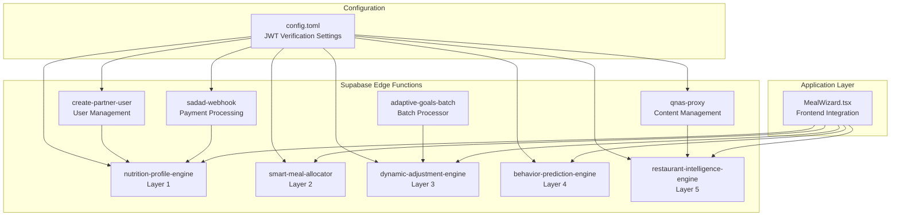
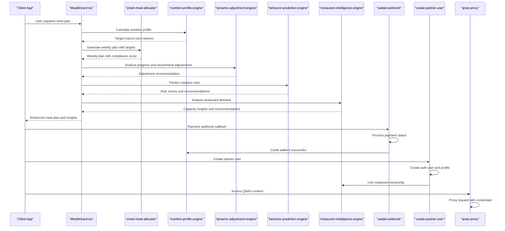
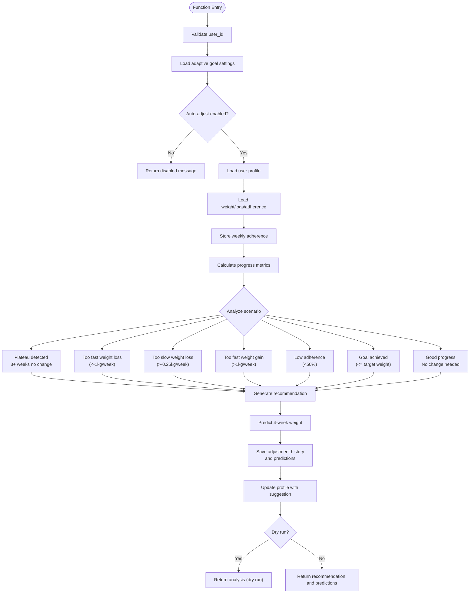
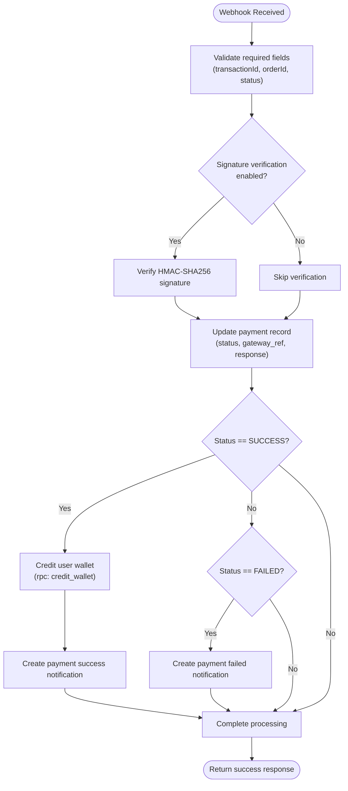
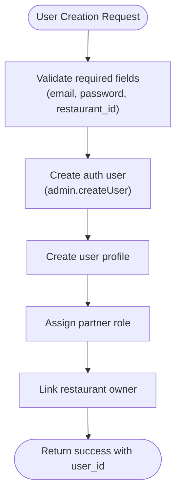
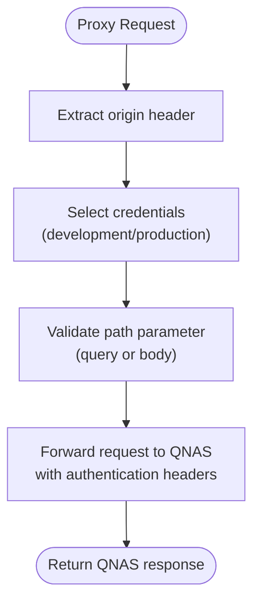
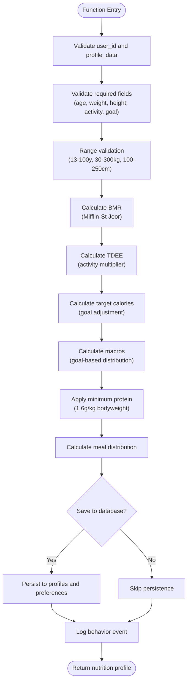
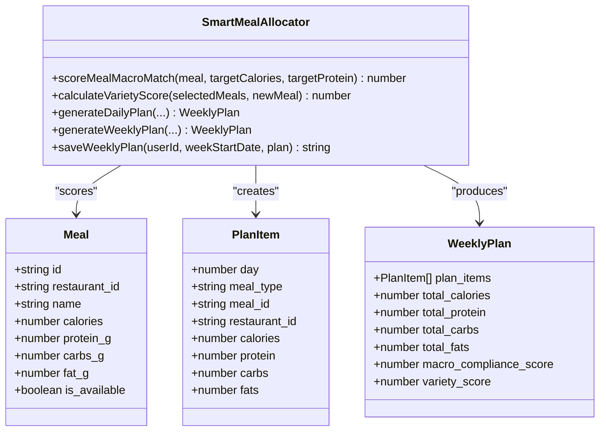
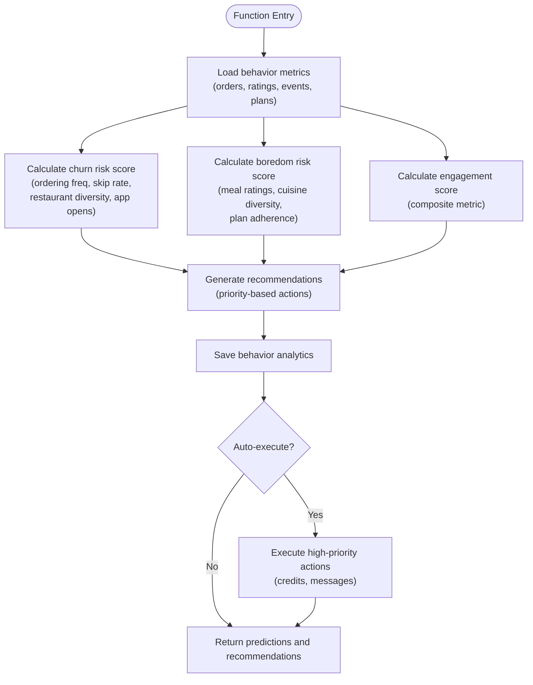

# Edge Functions Implementation

<cite>
**Referenced Files in This Document**
- [PHASE2_EDGE_FUNCTIONS.md](file://supabase/functions/PHASE2_EDGE_FUNCTIONS.md)
- [index.ts](file://supabase/functions/adaptive-goals/index.ts)
- [index.ts](file://supabase/functions/adaptive-goals-batch/index.ts)
- [index.ts](file://supabase/functions/nutrition-profile-engine/index.ts)
- [index.ts](file://supabase/functions/smart-meal-allocator/index.ts)
- [index.ts](file://supabase/functions/dynamic-adjustment-engine/index.ts)
- [index.ts](file://supabase/functions/behavior-prediction-engine/index.ts)
- [index.ts](file://supabase/functions/restaurant-intelligence-engine/index.ts)
- [index.ts](file://supabase/functions/sadad-webhook/index.ts)
- [index.ts](file://supabase/functions/create-partner-user/index.ts)
- [index.ts](file://supabase/functions/qnas-proxy/index.ts)
- [config.toml](file://supabase/config.toml)
- [20260227000004_webhook_retry_system.sql](file://supabase/migrations/20260227000004_webhook_retry_system.sql)
- [AI_IMPLEMENTATION_SUMMARY.md](file://AI_IMPLEMENTATION_SUMMARY.md)
- [ADAPTIVE_GOALS_IMPLEMENTATION_SUMMARY.md](file://ADAPTIVE_GOALS_IMPLEMENTATION_SUMMARY.md)
- [MealWizard.tsx](file://src/components/MealWizard.tsx)
- [20260224000001_add_ai_profile_fields.sql](file://supabase/migrations/20260224000001_add_ai_profile_fields.sql)
</cite>

## Update Summary
**Changes Made**
- Added documentation for three new edge functions: sadad-webhook (payment processing), create-partner-user (user management), and qnas-proxy (content management)
- Updated project structure to include new functions in the edge functions architecture
- Enhanced security considerations section with webhook signature verification
- Added comprehensive payment processing workflow documentation
- Updated dependency analysis to include new database tables and triggers

## Table of Contents
1. [Introduction](#introduction)
2. [Project Structure](#project-structure)
3. [Core Components](#core-components)
4. [Architecture Overview](#architecture-overview)
5. [Detailed Component Analysis](#detailed-component-analysis)
6. [Dependency Analysis](#dependency-analysis)
7. [Performance Considerations](#performance-considerations)
8. [Troubleshooting Guide](#troubleshooting-guide)
9. [Conclusion](#conclusion)
10. [Appendices](#appendices)

## Introduction
This document provides comprehensive technical documentation for the Supabase edge functions implementation powering the AI-driven nutrition and meal planning system. It covers the five-layer AI architecture: nutrition profile calculations, smart meal allocation, dynamic adjustments, behavior prediction, and restaurant intelligence. The documentation explains each function's purpose, parameters, return values, business logic, deployment, testing, and operational considerations.

**Updated** Added three new edge functions for enhanced payment processing, user management, and content management capabilities.

## Project Structure
The edge functions are organized by functional layer within the Supabase project:
- Layer 1: Nutrition Profile Engine (`nutrition-profile-engine`)
- Layer 2: Smart Meal Allocator (`smart-meal-allocator`)
- Layer 3: Dynamic Adjustment Engine (`dynamic-adjustment-engine`)
- Layer 4: Behavior Prediction Engine (`behavior-prediction-engine`)
- Layer 5: Restaurant Intelligence Engine (`restaurant-intelligence-engine`)
- Payment Processing: Sadad Webhook (`sadad-webhook`)
- User Management: Create Partner User (`create-partner-user`)
- Content Management: QNAS Proxy (`qnas-proxy`)
- Batch Processing: Adaptive Goals Batch (`adaptive-goals-batch`)
- Phase 2 Functions: Auto Assign Driver and Send Invoice Email (`auto-assign-driver`, `send-invoice-email`)

**Diagram sources**
- [index.ts:1-338](file://supabase/functions/nutrition-profile-engine/index.ts#L1-L338)
- [index.ts:1-755](file://supabase/functions/smart-meal-allocator/index.ts#L1-L755)
- [index.ts:1-455](file://supabase/functions/dynamic-adjustment-engine/index.ts#L1-L455)
- [index.ts:1-513](file://supabase/functions/behavior-prediction-engine/index.ts#L1-L513)
- [index.ts:1-422](file://supabase/functions/restaurant-intelligence-engine/index.ts#L1-L422)
- [index.ts:1-133](file://supabase/functions/sadad-webhook/index.ts#L1-L133)
- [index.ts:1-74](file://supabase/functions/create-partner-user/index.ts#L1-L74)
- [index.ts:1-72](file://supabase/functions/qnas-proxy/index.ts#L1-L72)
- [index.ts:1-136](file://supabase/functions/adaptive-goals-batch/index.ts#L1-L136)
- [config.toml:1-62](file://supabase/config.toml#L1-L62)
- [MealWizard.tsx:683-706](file://src/components/MealWizard.tsx#L683-L706)

**Section sources**
- [AI_IMPLEMENTATION_SUMMARY.md:124-143](file://AI_IMPLEMENTATION_SUMMARY.md#L124-L143)
- [PHASE2_EDGE_FUNCTIONS.md:1-411](file://supabase/functions/PHASE2_EDGE_FUNCTIONS.md#L1-L411)

## Core Components
This section documents the five-layer AI architecture, three new operational functions, and two phase 2 functions.

### Layer 1: Nutrition Profile Engine
Purpose: Calculates personalized nutrition targets using the Mifflin-St Jeor BMR equation, TDEE multipliers, and goal-specific macro distributions. Enforces minimum protein intake based on body weight.

Key Inputs:
- user_id: Unique identifier
- profile_data: Includes gender, age, height_cm, weight_kg, activity_level, goal, training_days_per_week (optional), food_preferences/allergies (optional)
- save_to_database: Boolean flag to persist results

Key Outputs:
- bmr, tdee, target_calories
- macros: protein_g, carbs_g, fats_g
- macro_percentages
- meal_distribution (breakfast, lunch, dinner, snacks)

Business Logic Highlights:
- BMR calculation using gender-specific Mifflin-St Jeor formula
- TDEE derived from activity level multipliers
- Goal-based target calorie adjustment (fat loss: -500, muscle gain: +300, maintenance: 0)
- Macro distribution tailored to goals with minimum protein enforcement
- Optional persistence to profiles and user_preferences tables

**Section sources**
- [index.ts:1-338](file://supabase/functions/nutrition-profile-engine/index.ts#L1-L338)

### Layer 2: Smart Meal Allocator
Purpose: Generates weekly or daily meal plans that meet macro targets, respect preferences, and enforce variety constraints across restaurants.

Key Inputs:
- user_id, week_start_date (YYYY-MM-DD), generate_variations (default 1)
- save_to_database (boolean), mode ("weekly"|"daily")
- remaining_calories, remaining_protein, locked_meal_types (for daily refresh)
- Additional parameters for smart refresh scenarios

Key Outputs:
- Weekly plan with plan_items containing scheduled_date, restaurant, and nested meal data
- Macro compliance score and variety score
- Total calories/macros across the week

Business Logic Highlights:
- Greedy optimization with backtracking to maximize macro match and variety
- Macro scoring prioritizes calorie match and protein alignment
- Variety enforcement: max 2 meals per restaurant per week, penalizes repeated meals
- Daily refresh mode supports "smart refresh" by calculating remaining nutrition and locked meals
- Enriched response with restaurant and meal metadata for frontend consumption

**Section sources**
- [index.ts:1-755](file://supabase/functions/smart-meal-allocator/index.ts#L1-L755)
- [MealWizard.tsx:683-706](file://src/components/MealWizard.tsx#L683-L706)

### Layer 3: Dynamic Adjustment Engine
Purpose: Analyzes user progress and automatically recommends nutrition target adjustments based on evidence-based criteria.

Key Inputs:
- user_id, auto_apply (boolean), weeks_of_history (default 4)

Key Outputs:
- Adjustment recommendation with type (calorie/macro/meal_timing/no_change)
- Calorie and macro adjustments with reasoning and confidence score
- Metrics: weight velocity, plateau detection, average adherence

Business Logic Highlights:
- Weight velocity calculation and plateau detection (3+ weeks, <0.2kg change)
- Adherence analysis over recent weeks
- Evidence-based scenarios:
  - Too slow weight loss (<0.25kg/week): small calorie reduction with protein preservation
  - Too fast weight loss (>1kg/week): slight increase to prevent muscle loss
  - Plateau: either adherence coaching or small reduction depending on adherence
  - Low adherence: meal timing and preference adjustments
  - Muscle gain: adjust based on observed gains
- Optional automatic application with confidence threshold

**Section sources**
- [index.ts:1-455](file://supabase/functions/dynamic-adjustment-engine/index.ts#L1-L455)

### Layer 4: Behavior Prediction Engine
Purpose: Predicts churn risk, boredom risk, and engagement score to drive proactive retention actions.

Key Inputs:
- user_id, analyze_period_days (default 30), auto_execute (boolean)

Key Outputs:
- Prediction scores: churn_risk_score, boredom_risk_score, engagement_score
- Recommendations with priority (low/medium/high/critical) and suggested actions
- Executed actions (when auto_execute is enabled)

Business Logic Highlights:
- Churn risk: ordering frequency, skip rate, restaurant diversity, app opens
- Boredom risk: meal ratings, cuisine diversity, plan adherence patterns
- Engagement score: composite metric with deductions for concerning behaviors
- Retention actions: personal outreach, bonus credits, cuisine exploration, gamification
- Automatic execution with credit awarding and transaction logging

**Section sources**
- [index.ts:1-513](file://supabase/functions/behavior-prediction-engine/index.ts#L1-L513)

### Layer 5: Restaurant Intelligence Engine
Purpose: Analyzes restaurant demand, capacity utilization, and provides optimization insights to balance load across restaurants.

Key Inputs:
- restaurant_id or analyze_all (boolean), days_of_history (default 14), apply_balancing (boolean)

Key Outputs:
- Demand analysis: demand_score, capacity_utilization, is_overloaded, order_growth_rate
- Insights: capacity adjustment, menu optimization, peak hours, growth opportunities
- Recommendations: increase capacity, add variety, optimize staffing, increase marketing

Business Logic Highlights:
- Demand scoring based on order volume, satisfaction, customer diversity, preparation efficiency
- Capacity utilization analysis and overload detection
- Growth trend analysis and peak hour identification
- AI insights generation and restaurant analytics updates
- Optional demand balancing by marking overloaded restaurants and promoting underutilized ones

**Section sources**
- [index.ts:1-422](file://supabase/functions/restaurant-intelligence-engine/index.ts#L1-L422)

### Payment Processing: Sadad Webhook
Purpose: Handles real-time payment status updates from the Sadad payment gateway, processes successful payments by crediting user wallets, and sends appropriate notifications.

Key Inputs:
- transactionId: Unique transaction identifier from Sadad
- orderId: Payment record identifier in the system
- status: Payment status (SUCCESS, FAILED, PENDING)
- amount: Transaction amount
- currency: Transaction currency (QAR)
- signature: HMAC-SHA256 signature for security verification

Key Outputs:
- Success response with internal status mapping
- Wallet credit operation result
- User notification creation

Business Logic Highlights:
- Input validation for required fields
- Optional signature verification using HMAC-SHA256
- Status mapping from Sadad format to internal format
- Payment record updates with gateway reference
- Automatic wallet crediting for successful payments
- User notification generation for payment outcomes
- Robust error handling and logging

**Section sources**
- [index.ts:1-133](file://supabase/functions/sadad-webhook/index.ts#L1-L133)

### User Management: Create Partner User
Purpose: Creates authenticated users for restaurant partners with automatic role assignment and restaurant ownership linking.

Key Inputs:
- email: User's email address
- password: User's password
- full_name: User's full name
- restaurant_id: Restaurant the user owns

Key Outputs:
- Success response with generated user_id
- Authenticated user creation
- Profile creation
- Role assignment
- Restaurant ownership linking

Business Logic Highlights:
- Input validation for required fields
- Service role authentication for administrative operations
- Auth user creation with email confirmation bypass
- Profile creation with user metadata
- Role assignment to "partner" role
- Restaurant owner linking with validation
- Comprehensive error handling

**Section sources**
- [index.ts:1-74](file://supabase/functions/create-partner-user/index.ts#L1-L74)

### Content Management: QNAS Proxy
Purpose: Provides secure proxy access to QNAS content management system with environment-aware credential management and request routing.

Key Inputs:
- path: QNAS API endpoint path
- Origin-based authentication: Different credentials for development vs production

Key Outputs:
- Forwarded QNAS API responses
- Environment-appropriate authentication headers
- CORS-enabled responses

Business Logic Highlights:
- Origin-based credential selection (development/production)
- Path parameter extraction from query string or request body
- Secure header forwarding with token and domain authentication
- Environment-aware URL construction
- CORS header configuration for cross-origin access
- Error handling with descriptive error messages

**Section sources**
- [index.ts:1-72](file://supabase/functions/qnas-proxy/index.ts#L1-L72)

### Batch Processing: Adaptive Goals Batch
Purpose: Processes all eligible users periodically to generate adaptive goals recommendations.

Key Inputs:
- None (processes all active users)

Key Outputs:
- Processing statistics: total, processed, skipped, errors, adjustments_created, plateaus_detected
- Individual user processing results

Business Logic Highlights:
- Filters active users with completed onboarding
- Respects user-defined adjustment frequency settings
- Calls adaptive-goals function for each eligible user
- Aggregates results and applies small delays to avoid rate limiting

**Section sources**
- [index.ts:1-136](file://supabase/functions/adaptive-goals-batch/index.ts#L1-L136)

### Phase 2 Functions
Two additional edge functions for operational automation:
- auto-assign-driver: Scores and assigns drivers based on distance, capacity, rating, and experience
- send-invoice-email: Generates and sends professional invoices via Resend, logs to email_logs

**Section sources**
- [PHASE2_EDGE_FUNCTIONS.md:34-221](file://supabase/functions/PHASE2_EDGE_FUNCTIONS.md#L34-L221)

## Architecture Overview
The AI system follows a layered architecture with clear separation of concerns. Each layer builds upon the previous one to deliver intelligent nutrition and meal planning experiences. The addition of new operational functions enhances the system's capabilities for payment processing, user management, and content integration.

**Diagram sources**
- [index.ts:480-755](file://supabase/functions/smart-meal-allocator/index.ts#L480-L755)
- [index.ts:199-338](file://supabase/functions/nutrition-profile-engine/index.ts#L199-L338)
- [index.ts:275-455](file://supabase/functions/dynamic-adjustment-engine/index.ts#L275-L455)
- [index.ts:306-513](file://supabase/functions/behavior-prediction-engine/index.ts#L306-L513)
- [index.ts:193-422](file://supabase/functions/restaurant-intelligence-engine/index.ts#L193-L422)
- [index.ts:1-133](file://supabase/functions/sadad-webhook/index.ts#L1-L133)
- [index.ts:1-74](file://supabase/functions/create-partner-user/index.ts#L1-L74)
- [index.ts:1-72](file://supabase/functions/qnas-proxy/index.ts#L1-L72)
- [MealWizard.tsx:683-706](file://src/components/MealWizard.tsx#L683-L706)

## Detailed Component Analysis

### Adaptive Goals Engine
The adaptive goals engine implements sophisticated progress analysis with multiple scenarios and confidence thresholds.

**Diagram sources**
- [index.ts:316-522](file://supabase/functions/adaptive-goals/index.ts#L316-L522)

**Section sources**
- [index.ts:1-522](file://supabase/functions/adaptive-goals/index.ts#L1-L522)
- [ADAPTIVE_GOALS_IMPLEMENTATION_SUMMARY.md:35-64](file://ADAPTIVE_GOALS_IMPLEMENTATION_SUMMARY.md#L35-L64)

### Payment Processing Workflow
The sadad-webhook function implements a comprehensive payment processing system with retry mechanisms and wallet integration.

**Diagram sources**
- [index.ts:23-133](file://supabase/functions/sadad-webhook/index.ts#L23-L133)

**Section sources**
- [index.ts:1-133](file://supabase/functions/sadad-webhook/index.ts#L1-L133)
- [20260227000004_webhook_retry_system.sql:1-181](file://supabase/migrations/20260227000004_webhook_retry_system.sql#L1-L181)

### User Management Process
The create-partner-user function streamlines the partner onboarding process with automated role assignment and restaurant linking.

**Diagram sources**
- [index.ts:10-74](file://supabase/functions/create-partner-user/index.ts#L10-L74)

**Section sources**
- [index.ts:1-74](file://supabase/functions/create-partner-user/index.ts#L1-L74)

### Content Management Proxy
The qnas-proxy function provides secure access to external content management systems with environment-aware authentication.

**Diagram sources**
- [index.ts:25-72](file://supabase/functions/qnas-proxy/index.ts#L25-L72)

**Section sources**
- [index.ts:1-72](file://supabase/functions/qnas-proxy/index.ts#L1-L72)

### Nutrition Profile Calculations
The nutrition profile engine implements evidence-based calculations with robust validation.

**Diagram sources**
- [index.ts:199-338](file://supabase/functions/nutrition-profile-engine/index.ts#L199-L338)

**Section sources**
- [index.ts:1-338](file://supabase/functions/nutrition-profile-engine/index.ts#L1-L338)
- [20260224000001_add_ai_profile_fields.sql:1-20](file://supabase/migrations/20260224000001_add_ai_profile_fields.sql#L1-L20)

### Smart Meal Allocation Algorithms
The smart meal allocator uses a hybrid scoring system combining macro compliance and variety constraints.

**Diagram sources**
- [index.ts:13-61](file://supabase/functions/smart-meal-allocator/index.ts#L13-L61)

**Section sources**
- [index.ts:1-755](file://supabase/functions/smart-meal-allocator/index.ts#L1-L755)

### Behavior Prediction Models
The behavior prediction engine implements weighted scoring algorithms for retention analytics.

**Diagram sources**
- [index.ts:306-513](file://supabase/functions/behavior-prediction-engine/index.ts#L306-L513)

**Section sources**
- [index.ts:1-513](file://supabase/functions/behavior-prediction-engine/index.ts#L1-L513)

## Dependency Analysis
The edge functions share common dependencies and integration points, with new functions adding additional database tables and external service integrations.

```mermaid
graph TB
subgraph "Runtime Dependencies"
DENO["Deno Runtime"]
SUPABASE["Supabase Client"]
CORS["CORS Headers"]
end
subgraph "Database Tables"
PROFILES["profiles"]
MEALS["meals"]
ORDERS["orders"]
RATINGS["meal_ratings"]
PLANS["weekly_meal_plans"]
EVENTS["behavior_events"]
SUBSCRIPTIONS["subscriptions"]
RESTAURANTS["restaurants"]
PAYMENTS["payments"]
WEBHOOK_QUEUE["webhook_delivery_queue"]
NOTIFICATIONS["notifications"]
USER_ROLES["user_roles"]
end
subgraph "External Services"
SADAD["Sadad Payment Gateway"]
QNAS["QNAS Content System"]
RESEND["Resend Email Service"]
end
subgraph "Edge Functions"
NP["nutrition-profile-engine"]
SMA["smart-meal-allocator"]
DAE["dynamic-adjustment-engine"]
BPE["behavior-prediction-engine"]
RIE["restaurant-intelligence-engine"]
SW["sadad-webhook"]
CPU["create-partner-user"]
QP["qnas-proxy"]
AGB["adaptive-goals-batch"]
end
DENO --> NP
DENO --> SMA
DENO --> DAE
DENO --> BPE
DENO --> RIE
DENO --> SW
DENO --> CPU
DENO --> QP
DENO --> AGB
SUPABASE --> NP
SUPABASE --> SMA
SUPABASE --> DAE
SUPABASE --> BPE
SUPABASE --> RIE
SUPABASE --> SW
SUPABASE --> CPU
SUPABASE --> QP
SUPABASE --> AGB
NP --> PROFILES
SMA --> MEALS
SMA --> PLANS
SMA --> RESTAURANTS
DAE --> PROFILES
DAE --> WEIGHT_LOGS["weight_logs"]
DAE --> WEEKLY_ADHERENCE["weekly_adherence"]
BPE --> ORDERS
BPE --> RATINGS
BPE --> EVENTS
BPE --> SUBSCRIPTIONS
RIE --> ORDERS
RIE --> MEALS
RIE --> RESTAURANTS
SW --> PAYMENTS
SW --> WEBHOOK_QUEUE
SW --> NOTIFICATIONS
CPU --> PROFILES
CPU --> USER_ROLES
CPU --> RESTAURANTS
QP --> QNAS
```

**Diagram sources**
- [index.ts:5-11](file://supabase/functions/nutrition-profile-engine/index.ts#L5-L11)
- [index.ts:5-11](file://supabase/functions/smart-meal-allocator/index.ts#L5-L11)
- [index.ts:5-11](file://supabase/functions/dynamic-adjustment-engine/index.ts#L5-L11)
- [index.ts:5-11](file://supabase/functions/behavior-prediction-engine/index.ts#L5-L11)
- [index.ts:5-11](file://supabase/functions/restaurant-intelligence-engine/index.ts#L5-L11)
- [index.ts:1-7](file://supabase/functions/adaptive-goals-batch/index.ts#L1-L7)
- [index.ts:1-133](file://supabase/functions/sadad-webhook/index.ts#L1-L133)
- [index.ts:1-74](file://supabase/functions/create-partner-user/index.ts#L1-L74)
- [index.ts:1-72](file://supabase/functions/qnas-proxy/index.ts#L1-L72)

**Section sources**
- [config.toml:45-62](file://supabase/config.toml#L45-L62)

## Performance Considerations
- Database Query Optimization: Use targeted SELECT statements with appropriate filters and indexes
- Caching Strategies: Leverage Supabase Edge Functions caching for frequently accessed configuration data
- Asynchronous Processing: Batch processing functions (adaptive-goals-batch) implement controlled throttling
- Memory Management: Avoid loading large datasets into memory; process incrementally
- Network Efficiency: Minimize external API calls; cache results where appropriate
- Concurrency Control: Use database upserts and conflict resolution to handle concurrent updates
- **New** Webhook Retry System: Implements exponential backoff with jitter for reliable payment processing
- **New** Environment-Based Authentication: Reduces credential exposure through origin-aware configuration

## Troubleshooting Guide
Common issues and resolutions:

### Function Deployment Issues
- Verify Supabase CLI version and project linking
- Check environment variable configuration (SUPABASE_URL, SUPABASE_SERVICE_ROLE_KEY)
- Ensure proper function syntax validation

### Database Connection Problems
- Confirm SUPABASE_URL correctness
- Verify service role key permissions
- Check Row Level Security policies for service role access

### Input Validation Errors
- Validate required fields presence
- Check data type ranges (age, weight, height)
- Ensure activity level and goal enumerations match expected values

### Payment Processing Issues
- **New** Verify Sadad webhook signature verification is properly configured
- Check SADAD_SECRET_KEY environment variable
- Monitor webhook delivery queue for retry attempts
- Verify payment record updates and wallet crediting

### User Management Issues
- **New** Ensure restaurant_id exists and is accessible
- Verify auth.admin.createUser permissions
- Check user_roles table for role assignment

### Content Proxy Issues
- **New** Verify QNAS credentials for selected environment
- Check origin header detection logic
- Monitor external service availability

### Performance Bottlenecks
- Monitor function execution time
- Optimize database queries with proper indexing
- Implement pagination for large result sets
- Use selective field projections

**Section sources**
- [PHASE2_EDGE_FUNCTIONS.md:380-411](file://supabase/functions/PHASE2_EDGE_FUNCTIONS.md#L380-L411)

## Conclusion
The Supabase edge functions implementation delivers a comprehensive AI-powered nutrition and meal planning platform enhanced with three new operational functions. The five-layer architecture provides scalable, automated solutions for personalized nutrition, intelligent meal planning, adaptive adjustments, behavioral insights, and operational optimization. The addition of sadad-webhook for payment processing, create-partner-user for user management, and qnas-proxy for content management significantly expands the system's capabilities while maintaining cohesive functionality across the entire ecosystem.

## Appendices

### Implementation Examples

#### Implementing a New Edge Function
1. Create function directory under `supabase/functions/`
2. Implement Deno-based handler with proper CORS headers
3. Add environment variable requirements to config.toml
4. Include comprehensive input validation and error handling
5. Test with Supabase CLI and integrate with frontend components

#### JWT Authentication Handling
- Configure verify_jwt settings in config.toml per function requirements
- Implement proper authorization checks for sensitive operations
- Use service role keys for database operations requiring bypass
- Validate JWT tokens when functions need user context

#### Function Dependencies Management
- Use Deno's built-in module system for runtime imports
- Avoid npm dependencies; leverage URL-based imports
- Keep function bundles minimal for faster cold starts
- Cache static configurations where appropriate

#### Payment Processing Security
- **New** Implement HMAC-SHA256 signature verification for webhook endpoints
- Use environment-specific secret keys for different environments
- Implement comprehensive error logging and monitoring
- Design retry mechanisms with exponential backoff

#### User Management Best Practices
- **New** Use service role keys for administrative operations
- Implement proper input validation and sanitization
- Handle role assignment and permission checking
- Provide clear error messaging for common failure scenarios

#### Content Proxy Configuration
- **New** Implement environment-aware credential management
- Use origin-based authentication for different deployment targets
- Configure CORS headers appropriately for cross-origin access
- Monitor external service availability and response times

**Section sources**
- [config.toml:1-62](file://supabase/config.toml#L1-L62)
- [PHASE2_EDGE_FUNCTIONS.md:364-377](file://supabase/functions/PHASE2_EDGE_FUNCTIONS.md#L364-L377)
- [20260227000004_webhook_retry_system.sql:1-181](file://supabase/migrations/20260227000004_webhook_retry_system.sql#L1-L181)