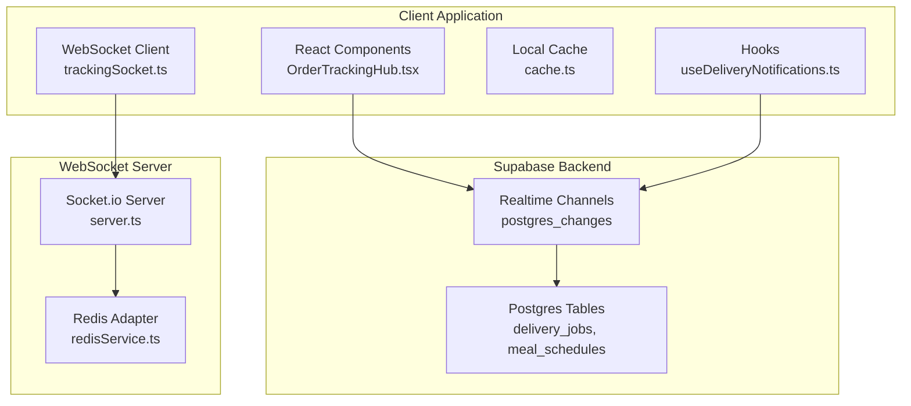
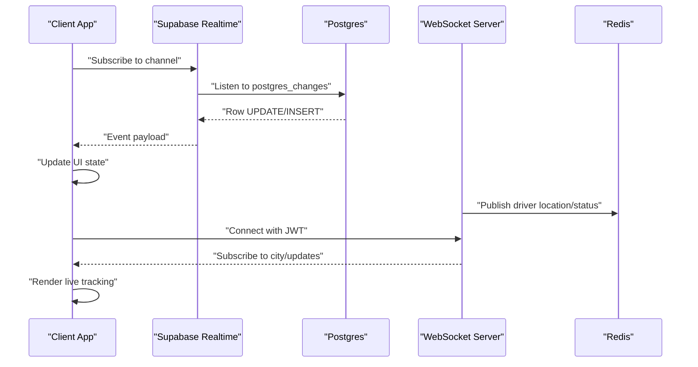
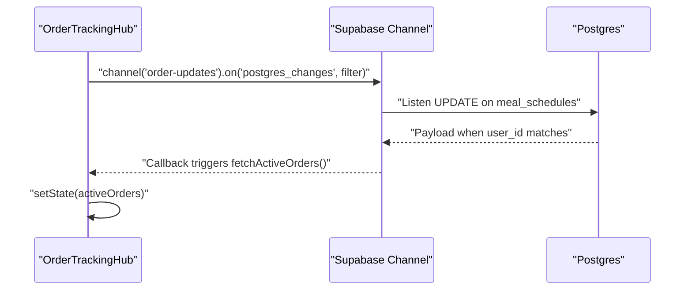
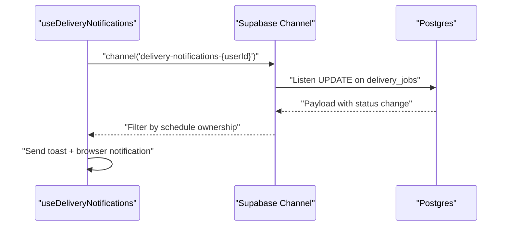
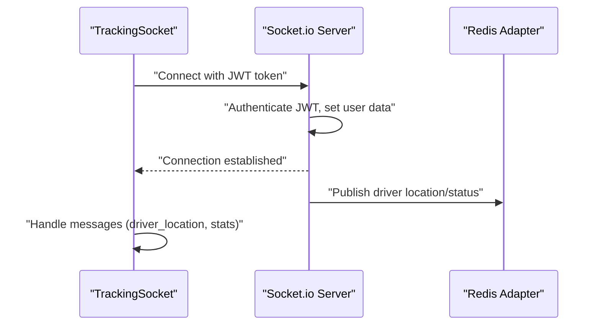
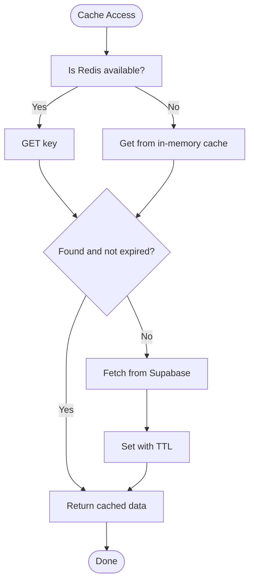
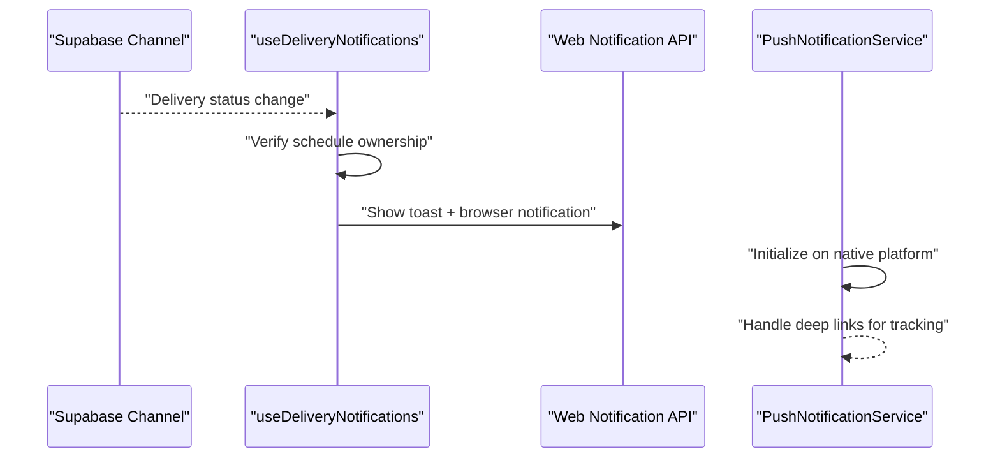
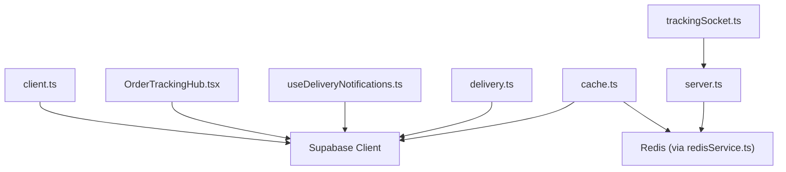

# Real-time Data Synchronization

<cite>
**Referenced Files in This Document**
- [client.ts](file://src/integrations/supabase/client.ts)
- [delivery.ts](file://src/integrations/supabase/delivery.ts)
- [types.ts](file://src/integrations/supabase/types.ts)
- [OrderTrackingHub.tsx](file://src/components/OrderTrackingHub.tsx)
- [useDeliveryNotifications.ts](file://src/hooks/useDeliveryNotifications.ts)
- [notifications.ts](file://src/lib/notifications.ts)
- [cache.ts](file://src/lib/cache.ts)
- [server.ts](file://websocket-server/src/server.ts)
- [redisService.ts](file://websocket-server/src/services/redisService.ts)
- [trackingSocket.ts](file://src/fleet/services/trackingSocket.ts)
</cite>

## Table of Contents
1. [Introduction](#introduction)
2. [Project Structure](#project-structure)
3. [Core Components](#core-components)
4. [Architecture Overview](#architecture-overview)
5. [Detailed Component Analysis](#detailed-component-analysis)
6. [Dependency Analysis](#dependency-analysis)
7. [Performance Considerations](#performance-considerations)
8. [Troubleshooting Guide](#troubleshooting-guide)
9. [Conclusion](#conclusion)

## Introduction
This document explains Nutrio's real-time data synchronization system, covering Supabase realtime subscriptions, WebSocket-based live tracking, local caching strategies, and offline-first patterns. It details how customer order tracking, delivery notifications, and fleet management achieve real-time updates through a combination of Supabase Postgres changes and a dedicated WebSocket server with Redis-backed persistence.

## Project Structure
The real-time system spans three primary areas:
- Supabase integration for Postgres-based real-time subscriptions
- React components and hooks that subscribe to Supabase channels
- WebSocket server for fleet tracking with Redis for scalability and offline resilience

**Diagram sources**
- [OrderTrackingHub.tsx:94-114](file://src/components/OrderTrackingHub.tsx#L94-L114)
- [useDeliveryNotifications.ts:37-130](file://src/hooks/useDeliveryNotifications.ts#L37-L130)
- [delivery.ts:695-734](file://src/integrations/supabase/delivery.ts#L695-L734)
- [server.ts:37-51](file://websocket-server/src/server.ts#L37-L51)
- [redisService.ts:63-82](file://websocket-server/src/services/redisService.ts#L63-L82)

**Section sources**
- [client.ts:1-57](file://src/integrations/supabase/client.ts#L1-L57)
- [OrderTrackingHub.tsx:1-235](file://src/components/OrderTrackingHub.tsx#L1-L235)
- [useDeliveryNotifications.ts:1-139](file://src/hooks/useDeliveryNotifications.ts#L1-L139)
- [delivery.ts:1-735](file://src/integrations/supabase/delivery.ts#L1-L735)
- [server.ts:1-256](file://websocket-server/src/server.ts#L1-L256)
- [redisService.ts:1-264](file://websocket-server/src/services/redisService.ts#L1-L264)
- [cache.ts:1-198](file://src/lib/cache.ts#L1-L198)
- [trackingSocket.ts:1-253](file://src/fleet/services/trackingSocket.ts#L1-L253)

## Core Components
- Supabase client initialization with persistent auth storage and native preferences adapter
- Real-time subscriptions for order and delivery updates using Postgres changes
- WebSocket server with Redis adapter for scalable fleet tracking and driver location streaming
- Local caching layer for offline-first experiences and reduced network load
- Notification system combining browser Web Notifications and push notifications for mobile

**Section sources**
- [client.ts:18-57](file://src/integrations/supabase/client.ts#L18-L57)
- [delivery.ts:695-734](file://src/integrations/supabase/delivery.ts#L695-L734)
- [server.ts:37-51](file://websocket-server/src/server.ts#L37-L51)
- [cache.ts:16-107](file://src/lib/cache.ts#L16-L107)
- [notifications.ts:18-35](file://src/lib/notifications.ts#L18-L35)

## Architecture Overview
Nutrio implements a hybrid real-time architecture:
- Supabase Postgres changes power customer-facing order and delivery updates
- A WebSocket server handles driver location streaming, fleet statistics, and city-based subscriptions
- Redis provides pub/sub and caching for multi-instance scaling and offline resilience
- Local caching reduces redundant network requests and improves offline capability

**Diagram sources**
- [OrderTrackingHub.tsx:94-114](file://src/components/OrderTrackingHub.tsx#L94-L114)
- [delivery.ts:695-734](file://src/integrations/supabase/delivery.ts#L695-L734)
- [server.ts:65-103](file://websocket-server/src/server.ts#L65-L103)
- [redisService.ts:87-146](file://websocket-server/src/services/redisService.ts#L87-L146)

## Detailed Component Analysis

### Supabase Realtime Subscriptions
Supabase powers real-time updates for customer order tracking and delivery notifications. Components and hooks establish channels that listen to Postgres row changes and trigger UI updates.

**Diagram sources**
- [OrderTrackingHub.tsx:94-114](file://src/components/OrderTrackingHub.tsx#L94-L114)
- [OrderTrackingHub.tsx:44-87](file://src/components/OrderTrackingHub.tsx#L44-L87)

Key implementation highlights:
- Channel creation and event filtering by user ID
- Cleanup on component unmount to prevent leaks
- Integration with Supabase client configured for persistent auth

**Section sources**
- [OrderTrackingHub.tsx:94-114](file://src/components/OrderTrackingHub.tsx#L94-L114)
- [OrderTrackingHub.tsx:44-87](file://src/components/OrderTrackingHub.tsx#L44-L87)
- [client.ts:47-57](file://src/integrations/supabase/client.ts#L47-L57)

### Delivery Updates and Driver Location Subscriptions
The delivery module exposes subscription functions for delivery job updates and driver location inserts, enabling real-time tracking for customers and fleet managers.

**Diagram sources**
- [useDeliveryNotifications.ts:37-130](file://src/hooks/useDeliveryNotifications.ts#L37-L130)
- [delivery.ts:695-734](file://src/integrations/supabase/delivery.ts#L695-L734)

Additional delivery subscriptions:
- Delivery updates per schedule ID
- Driver location inserts per driver ID

**Section sources**
- [useDeliveryNotifications.ts:37-130](file://src/hooks/useDeliveryNotifications.ts#L37-L130)
- [delivery.ts:695-734](file://src/integrations/supabase/delivery.ts#L695-L734)

### WebSocket Server for Live Tracking
The WebSocket server provides scalable, real-time tracking for drivers and fleet managers with Redis adapter for multi-instance deployments.

**Diagram sources**
- [trackingSocket.ts:34-95](file://src/fleet/services/trackingSocket.ts#L34-L95)
- [server.ts:65-103](file://websocket-server/src/server.ts#L65-L103)
- [redisService.ts:63-82](file://websocket-server/src/services/redisService.ts#L63-L82)

Key features:
- JWT authentication middleware
- City-based subscriptions for fleet managers
- Automatic reconnection with exponential backoff
- Message queuing during offline periods

**Section sources**
- [server.ts:37-51](file://websocket-server/src/server.ts#L37-L51)
- [server.ts:65-103](file://websocket-server/src/server.ts#L65-L103)
- [trackingSocket.ts:25-95](file://src/fleet/services/trackingSocket.ts#L25-L95)
- [trackingSocket.ts:170-178](file://src/fleet/services/trackingSocket.ts#L170-L178)

### Local State Management and Caching Strategies
The caching layer provides offline-first behavior and reduces network overhead by storing frequently accessed data locally with TTL-based invalidation.

**Diagram sources**
- [cache.ts:37-75](file://src/lib/cache.ts#L37-L75)
- [cache.ts:124-142](file://src/lib/cache.ts#L124-L142)

Patterns:
- Fallback to in-memory cache when Redis unavailable
- Pattern-based invalidation for bulk cache updates
- TTL-based expiration to maintain freshness

**Section sources**
- [cache.ts:16-107](file://src/lib/cache.ts#L16-L107)
- [cache.ts:124-198](file://src/lib/cache.ts#L124-L198)

### Notification System Integration
The notification system combines browser Web Notifications and push notifications for mobile, triggered by Supabase realtime events.

**Diagram sources**
- [useDeliveryNotifications.ts:37-130](file://src/hooks/useDeliveryNotifications.ts#L37-L130)
- [notifications.ts:18-35](file://src/lib/notifications.ts#L18-L35)

**Section sources**
- [useDeliveryNotifications.ts:13-29](file://src/hooks/useDeliveryNotifications.ts#L13-L29)
- [notifications.ts:38-81](file://src/lib/notifications.ts#L38-L81)

## Dependency Analysis
The real-time system exhibits clear separation of concerns:
- Supabase client encapsulates authentication and storage
- Components and hooks depend on Supabase channels for customer-facing updates
- WebSocket client depends on server-side Socket.io with Redis adapter
- Cache manager abstracts Redis/in-memory fallback
- Notification utilities integrate with both browser and native push APIs

**Diagram sources**
- [client.ts:47-57](file://src/integrations/supabase/client.ts#L47-L57)
- [OrderTrackingHub.tsx:3](file://src/components/OrderTrackingHub.tsx#L3)
- [useDeliveryNotifications.ts:2](file://src/hooks/useDeliveryNotifications.ts#L2)
- [delivery.ts:4](file://src/integrations/supabase/delivery.ts#L4)
- [cache.ts:6](file://src/lib/cache.ts#L6)
- [redisService.ts:6](file://websocket-server/src/services/redisService.ts#L6)
- [trackingSocket.ts:6](file://src/fleet/services/trackingSocket.ts#L6)
- [server.ts:7](file://websocket-server/src/server.ts#L7)

**Section sources**
- [client.ts:18-57](file://src/integrations/supabase/client.ts#L18-L57)
- [OrderTrackingHub.tsx:1-235](file://src/components/OrderTrackingHub.tsx#L1-L235)
- [useDeliveryNotifications.ts:1-139](file://src/hooks/useDeliveryNotifications.ts#L1-L139)
- [delivery.ts:1-735](file://src/integrations/supabase/delivery.ts#L1-L735)
- [cache.ts:1-198](file://src/lib/cache.ts#L1-L198)
- [server.ts:1-256](file://websocket-server/src/server.ts#L1-L256)
- [redisService.ts:1-264](file://websocket-server/src/services/redisService.ts#L1-L264)
- [trackingSocket.ts:1-253](file://src/fleet/services/trackingSocket.ts#L1-L253)

## Performance Considerations
- Minimize channel scope: Filter by user_id or schedule_id to reduce event volume
- Use caching: Leverage TTL-based cache invalidation to avoid repeated network calls
- Optimize WebSocket traffic: Batch updates and compress messages where appropriate
- Scale horizontally: Use Redis adapter for Socket.io to support multiple server instances
- Handle backpressure: Implement retry with exponential backoff and circuit breaker patterns

## Troubleshooting Guide
Common issues and resolutions:
- Connection failures in WebSocket client:
  - Verify JWT token validity and server capacity limits
  - Monitor reconnection attempts and exponential backoff behavior
- Supabase channel not receiving updates:
  - Confirm filter conditions match user/session context
  - Ensure proper cleanup on component unmount
- Cache not updating:
  - Check TTL values and pattern-based invalidation logic
  - Validate Redis availability and connectivity
- Notification permissions:
  - Request browser notification permission on mount
  - Handle platform-specific push notification setup for mobile

**Section sources**
- [trackingSocket.ts:170-178](file://src/fleet/services/trackingSocket.ts#L170-L178)
- [OrderTrackingHub.tsx:111-114](file://src/components/OrderTrackingHub.tsx#L111-L114)
- [cache.ts:88-106](file://src/lib/cache.ts#L88-L106)
- [useDeliveryNotifications.ts:13-29](file://src/hooks/useDeliveryNotifications.ts#L13-L29)

## Conclusion
Nutrio's real-time architecture combines Supabase Postgres changes for customer-centric updates with a scalable WebSocket server for fleet tracking. The hybrid approach ensures low-latency updates, horizontal scalability via Redis, and robust offline-first experiences through intelligent caching. By following the patterns documented here, developers can implement reliable real-time features, handle connection failures gracefully, and optimize performance across diverse deployment environments.