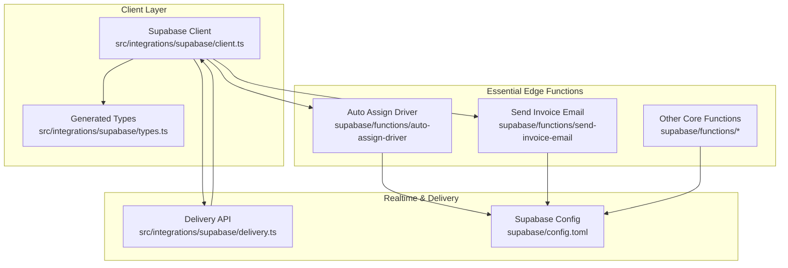
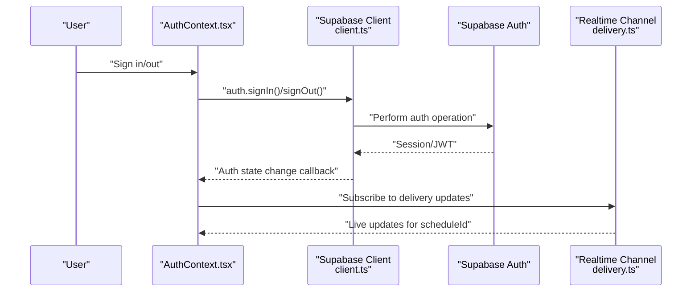
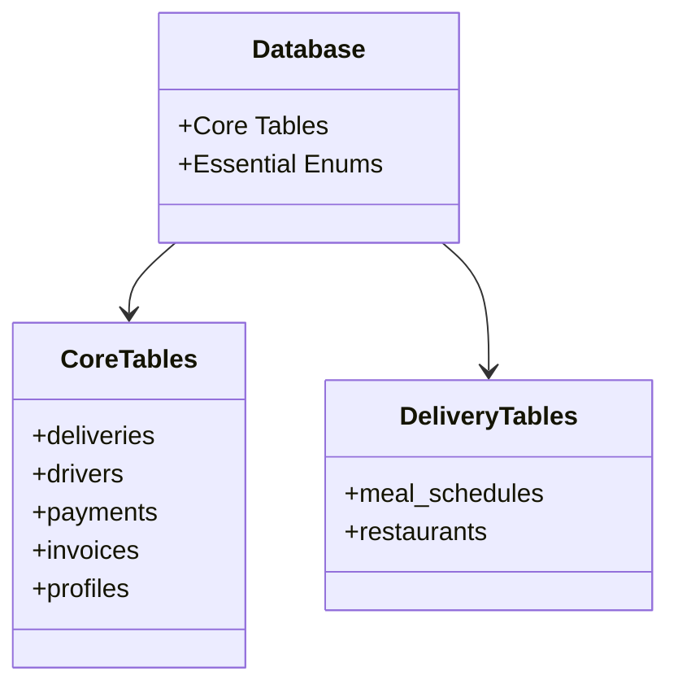
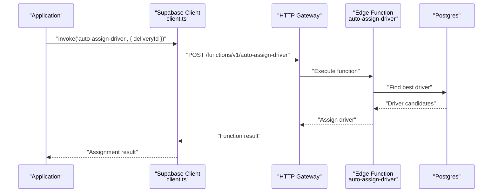
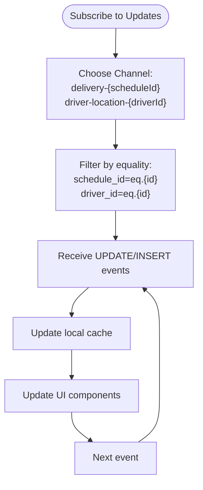
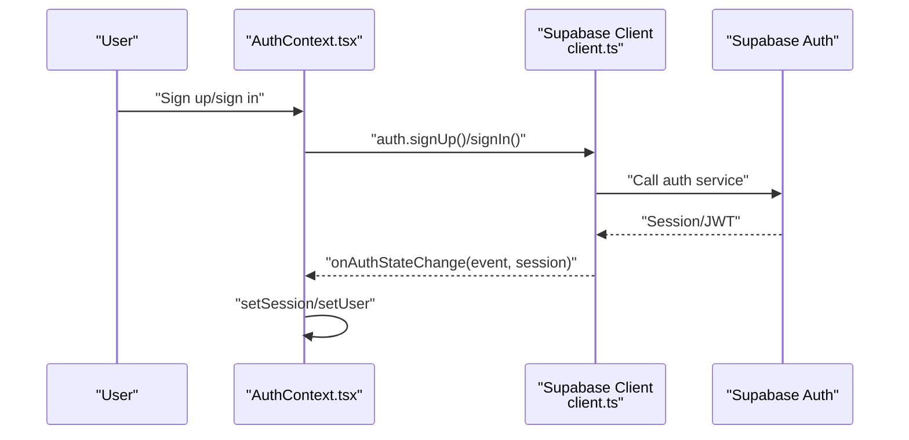
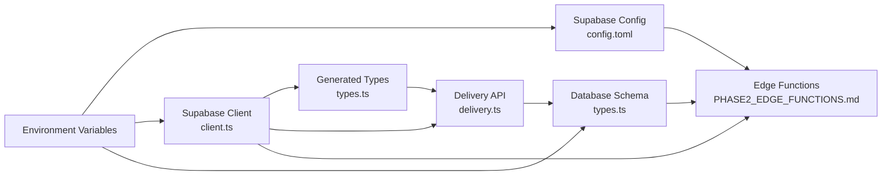

# Supabase Integration

<cite>
**Referenced Files in This Document**
- [client.ts](file://src/integrations/supabase/client.ts)
- [types.ts](file://src/integrations/supabase/types.ts)
- [delivery.ts](file://src/integrations/supabase/delivery.ts)
- [config.toml](file://supabase/config.toml)
- [PHASE2_EDGE_FUNCTIONS.md](file://supabase/functions/PHASE2_EDGE_FUNCTIONS.md)
- [handle-freeze-request/index.ts](file://supabase/functions/handle-freeze-request/index.ts)
- [AuthContext.tsx](file://src/contexts/AuthContext.tsx)
- [useHealthIntegration.ts](file://src/hooks/useHealthIntegration.ts)
- [useGoogleFitWorkouts.ts](file://src/hooks/useGoogleFitWorkouts.ts)
- [googleFit.ts](file://src/services/health/googleFit.ts)
- [fleetApi.ts](file://src/fleet/services/fleetApi.ts)
- [ProtectedFleetRoute.tsx](file://src/fleet/components/ProtectedFleetRoute.tsx)
- [fleet-auth/index.ts](file://supabase/functions/fleet-auth/index.ts)
- [load-test-config.yml](file://tests/load-test-config.yml)
- [20260318_google_fit_integration.sql](file://supabase/migrations/20260318_google_fit_integration.sql)
- [20250223000004_advanced_retention_system.sql](file://supabase/migrations/20250223000004_advanced_retention_system.sql)
- [20260320_add_driver_user.sql](file://supabase/migrations/20260320_add_driver_user.sql)
</cite>

## Update Summary
**Changes Made**
- Removed Google Fit integration components and related database tables
- Removed fleet management system and associated edge functions
- Removed advanced retention tracking system and health scoring
- Simplified edge functions to core automation functions only
- Removed database cleanup scripts and user role management migrations
- Streamlined Supabase integration to focus on essential authentication and edge functions

## Table of Contents
1. [Introduction](#introduction)
2. [Project Structure](#project-structure)
3. [Core Components](#core-components)
4. [Architecture Overview](#architecture-overview)
5. [Detailed Component Analysis](#detailed-component-analysis)
6. [Dependency Analysis](#dependency-analysis)
7. [Performance Considerations](#performance-considerations)
8. [Troubleshooting Guide](#troubleshooting-guide)
9. [Conclusion](#conclusion)
10. [Appendices](#appendices)

## Introduction
This document explains the simplified Supabase integration in Nutrio, focusing on core authentication and essential edge functions. The integration maintains strong type safety, real-time capabilities, and streamlined functionality after removing advanced features like Google Fit health integration, fleet management systems, and comprehensive retention tracking.

## Project Structure
The Supabase integration now consists of streamlined components:
- Client initialization with Capacitor/native storage adapter
- Strongly typed database interface from Supabase schema
- Essential edge functions for delivery automation and invoice processing
- Real-time subscriptions and delivery APIs
- Authentication and session management

**Diagram sources**
- [client.ts:1-68](file://src/integrations/supabase/client.ts#L1-L68)
- [types.ts:1-200](file://src/integrations/supabase/types.ts#L1-L200)
- [delivery.ts:1-735](file://src/integrations/supabase/delivery.ts#L1-L735)
- [config.toml:1-62](file://supabase/config.toml#L1-L62)

**Section sources**
- [client.ts:1-68](file://src/integrations/supabase/client.ts#L1-L68)
- [types.ts:1-200](file://src/integrations/supabase/types.ts#L1-L200)
- [delivery.ts:1-735](file://src/integrations/supabase/delivery.ts#L1-L735)
- [config.toml:1-62](file://supabase/config.toml#L1-L62)

## Core Components
- Supabase client with Capacitor/native storage adapter and automatic token refresh
- Strongly typed database interface generated from Supabase schema
- Delivery system API with CRUD operations and real-time subscriptions
- Essential edge functions for delivery automation and invoice processing
- Authentication and session management with simplified security model
- Supabase configuration controlling JWT verification for functions

Key responsibilities:
- Client: Initialize Supabase, manage sessions, persist auth state
- Types: Provide compile-time guarantees for database operations
- Delivery API: Driver lifecycle, job assignment, tracking, and real-time updates
- Edge Functions: Automated workflows for delivery assignment and invoice processing
- Authentication: Secure user authentication and session management
- Config: Control function security and invocation behavior

**Section sources**
- [client.ts:1-68](file://src/integrations/supabase/client.ts#L1-L68)
- [types.ts:1-200](file://src/integrations/supabase/types.ts#L1-L200)
- [delivery.ts:1-735](file://src/integrations/supabase/delivery.ts#L1-L735)
- [config.toml:1-62](file://supabase/config.toml#L1-L62)

## Architecture Overview
The system integrates Supabase Auth for identity, Supabase Postgres for persistence, and essential edge functions for serverless logic. The architecture maintains simplicity while preserving core functionality for delivery operations and invoice management.

**Diagram sources**
- [AuthContext.tsx:35-76](file://src/contexts/AuthContext.tsx#L35-L76)
- [client.ts:1-68](file://src/integrations/supabase/client.ts#L1-L68)
- [delivery.ts:694-735](file://src/integrations/supabase/delivery.ts#L694-L735)

**Section sources**
- [AuthContext.tsx:35-76](file://src/contexts/AuthContext.tsx#L35-L76)
- [client.ts:1-68](file://src/integrations/supabase/client.ts#L1-L68)
- [delivery.ts:694-735](file://src/integrations/supabase/delivery.ts#L694-L735)

## Detailed Component Analysis

### Database Schema Design and Type Safety
The database schema has been simplified to essential tables only:

**Core Tables:**
- `deliveries`: Delivery orders with assignment tracking
- `drivers`: Driver profiles with location and rating
- `meal_schedules`: Order scheduling
- `restaurants`: Restaurant locations
- `payments`: Payment records
- `invoices`: Invoice records
- `profiles`: User details for communication

**Enhanced Security:**
- Row Level Security policies for core tables
- Fine-grained access control for delivery operations
- Simplified role-based access for essential operations

**Diagram sources**
- [types.ts:15-52](file://src/integrations/supabase/types.ts#L15-L52)
- [types.ts:88-177](file://src/integrations/supabase/types.ts#L88-L177)

**Section sources**
- [types.ts:15-52](file://src/integrations/supabase/types.ts#L15-L52)
- [types.ts:88-177](file://src/integrations/supabase/types.ts#L88-L177)

### Edge Functions Implementation
Edge functions encapsulate essential serverless business logic for delivery automation and invoice processing. The configuration controls JWT verification per function.

**Core Function Categories:**
- **Delivery Functions**: Auto assignment and order management
- **Financial Functions**: Invoice processing and payment handling
- **Notification Functions**: Email and notification dispatch

**Security Model:**
- Role-based function invocation
- Enhanced JWT verification for sensitive operations
- Input validation and error handling

**Diagram sources**
- [PHASE2_EDGE_FUNCTIONS.md:224-254](file://supabase/functions/PHASE2_EDGE_FUNCTIONS.md#L224-L254)
- [PHASE2_EDGE_FUNCTIONS.md:258-321](file://supabase/functions/PHASE2_EDGE_FUNCTIONS.md#L258-L321)

**Section sources**
- [PHASE2_EDGE_FUNCTIONS.md:1-411](file://supabase/functions/PHASE2_EDGE_FUNCTIONS.md#L1-L411)
- [config.toml:1-62](file://supabase/config.toml#L1-L62)

### Real-Time Data Synchronization and Local Caching
The delivery module demonstrates real-time subscriptions and local caching strategies with focused filtering capabilities:

**Selective Filtering:**
- Filtering by schedule or driver ID for delivery updates
- Efficient workout session tracking with status updates
- Streamlined health data synchronization with real-time updates

**Efficient Caching:**
- Local state management for reduced API calls
- Smart invalidation on real-time event reception
- Batch processing for high-frequency updates

**Diagram sources**
- [delivery.ts:694-735](file://src/integrations/supabase/delivery.ts#L694-L735)

**Section sources**
- [delivery.ts:694-735](file://src/integrations/supabase/delivery.ts#L694-L735)

### Authentication Integration and Session Management
Authentication is handled by Supabase Auth with streamlined support for essential integration types:

**Simplified Session Management:**
- Native platform authentication with Capacitor Preferences
- Web platform OAuth integration
- Secure storage of authentication tokens
- Role-based access control for essential operations

**Session Persistence:**
- Automatic token refresh for all authentication types
- Secure storage of OAuth tokens for health integrations
- Role-based access control for fleet management
- Health data privacy with RLS policies

**Diagram sources**
- [AuthContext.tsx:35-76](file://src/contexts/AuthContext.tsx#L35-L76)
- [client.ts:1-68](file://src/integrations/supabase/client.ts#L1-L68)

**Section sources**
- [AuthContext.tsx:35-76](file://src/contexts/AuthContext.tsx#L35-L76)
- [client.ts:1-68](file://src/integrations/supabase/client.ts#L1-L68)

### Practical Examples

#### Implementing a New Edge Function
- Create function directory under supabase/functions
- Define input schema and environment variables
- Use Supabase client with service role for database operations
- Add function to config.toml with appropriate JWT verification settings
- Deploy via Supabase CLI and test with curl or client.invoke
- Add database migrations and indexes as needed

**Section sources**
- [PHASE2_EDGE_FUNCTIONS.md:175-221](file://supabase/functions/PHASE2_EDGE_FUNCTIONS.md#L175-L221)
- [PHASE2_EDGE_FUNCTIONS.md:306-321](file://supabase/functions/PHASE2_EDGE_FUNCTIONS.md#L306-L321)

#### Extending Database Schemas
- Update schema in Supabase with new tables and columns
- Regenerate types to align with changes
- Add indexes for frequently filtered columns
- Update edge functions to reflect new columns or relationships
- Implement RLS policies for new security requirements

**Section sources**
- [types.ts:1-200](file://src/integrations/supabase/types.ts#L1-L200)
- [20260320_add_driver_user.sql:1-45](file://supabase/migrations/20260320_add_driver_user.sql#L1-L45)

#### Optimizing Query Performance
- Use selective filters and indexes for high-volume tables
- Prefer single queries with joins over multiple round-trips
- Cache frequently accessed data locally and invalidate on real-time events
- Monitor edge function execution times and database metrics
- Optimize delivery data queries with proper indexing

**Section sources**
- [PHASE2_EDGE_FUNCTIONS.md:337-351](file://supabase/functions/PHASE2_EDGE_FUNCTIONS.md#L337-L351)
- [load-test-config.yml:154-172](file://tests/load-test-config.yml#L154-L172)

## Dependency Analysis
Supabase-related dependencies have been streamlined to essential components only:

**Core Dependencies:**
- Client depends on environment variables and Capacitor preferences for storage
- Delivery API depends on generated types and Supabase client
- Edge functions depend on Supabase config and environment variables
- Real-time channels depend on table names and filters

**Diagram sources**
- [config.toml:1-62](file://supabase/config.toml#L1-L62)
- [client.ts:1-68](file://src/integrations/supabase/client.ts#L1-L68)
- [types.ts:1-200](file://src/integrations/supabase/types.ts#L1-L200)
- [delivery.ts:1-735](file://src/integrations/supabase/delivery.ts#L1-L735)

**Section sources**
- [config.toml:1-62](file://supabase/config.toml#L1-L62)
- [client.ts:1-68](file://src/integrations/supabase/client.ts#L1-L68)
- [types.ts:1-200](file://src/integrations/supabase/types.ts#L1-L200)
- [delivery.ts:1-735](file://src/integrations/supabase/delivery.ts#L1-L735)

## Performance Considerations
- Database indexing: create indexes on columns used in filters and joins, especially for delivery operations
- Connection pooling: ensure adequate pool sizing for concurrent clients and delivery data sync
- Edge function scaling: monitor cold starts and optimize dependencies for core functions
- CDN caching: leverage static assets and reduce origin load
- Monitoring: track response times, error rates, and memory usage for all integrated systems
- Delivery data optimization: implement efficient caching strategies for delivery updates and driver assignments

## Troubleshooting Guide
Common issues and resolutions:
- Missing environment variables: verify Supabase URL and service role key settings
- Function deployment failures: check CLI version and syntax for core functions
- Database connection errors: validate service role key and RLS policies for core tables
- Real-time channel issues: ensure correct filters and channel names for delivery updates
- Token refresh failures: check authentication token validity and refresh mechanisms

**Section sources**
- [PHASE2_EDGE_FUNCTIONS.md:380-401](file://supabase/functions/PHASE2_EDGE_FUNCTIONS.md#L380-L401)
- [load-test-config.yml:154-172](file://tests/load-test-config.yml#L154-L172)

## Conclusion
Nutrio's simplified Supabase integration maintains strong type safety, robust edge functions, and real-time capabilities with a focused set of essential features. The system now emphasizes core delivery automation, invoice processing, and authentication while removing complex integrations like Google Fit health data and fleet management. By following the documented patterns for schema design, edge function development, real-time subscriptions, and performance optimization, teams can confidently extend the system with new features while maintaining security and scalability.

## Appendices

### Edge Function Security and Invocation
- JWT verification toggled per function in config
- Service role key required for privileged database operations
- Client-side invoke and HTTP request patterns supported
- Enhanced security for core delivery and financial functions

**Section sources**
- [config.toml:1-62](file://supabase/config.toml#L1-L62)
- [PHASE2_EDGE_FUNCTIONS.md:224-254](file://supabase/functions/PHASE2_EDGE_FUNCTIONS.md#L224-L254)

### Core Database Security
- OAuth token encryption and secure storage
- Provider-specific access controls
- Health data privacy with RLS policies
- Token refresh and expiration handling

**Section sources**
- [types.ts:1-200](file://src/integrations/supabase/types.ts#L1-L200)

### Simplified Access Control
- Role-based authentication and authorization
- City-level access restrictions
- Country-specific role assignments
- Admin override capabilities

**Section sources**
- [20260320_add_driver_user.sql:1-45](file://supabase/migrations/20260320_add_driver_user.sql#L1-L45)