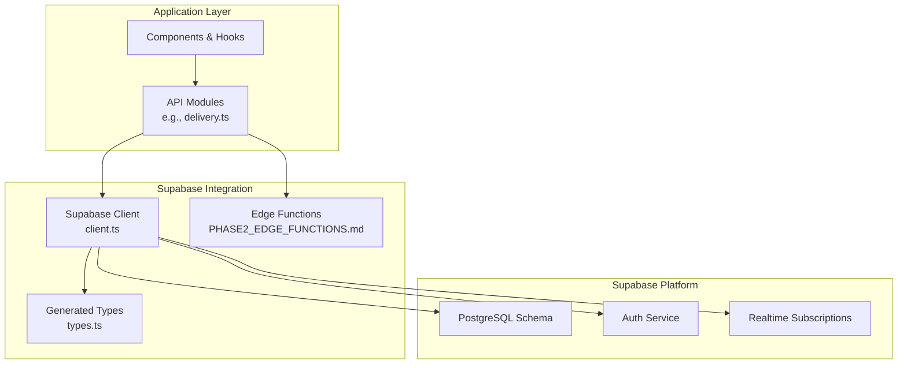
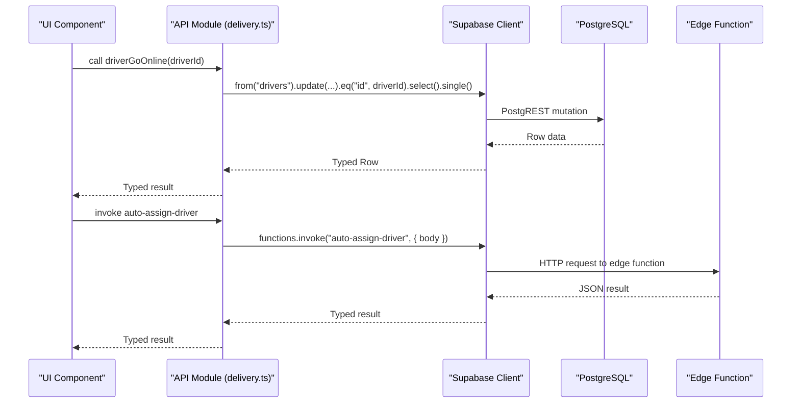
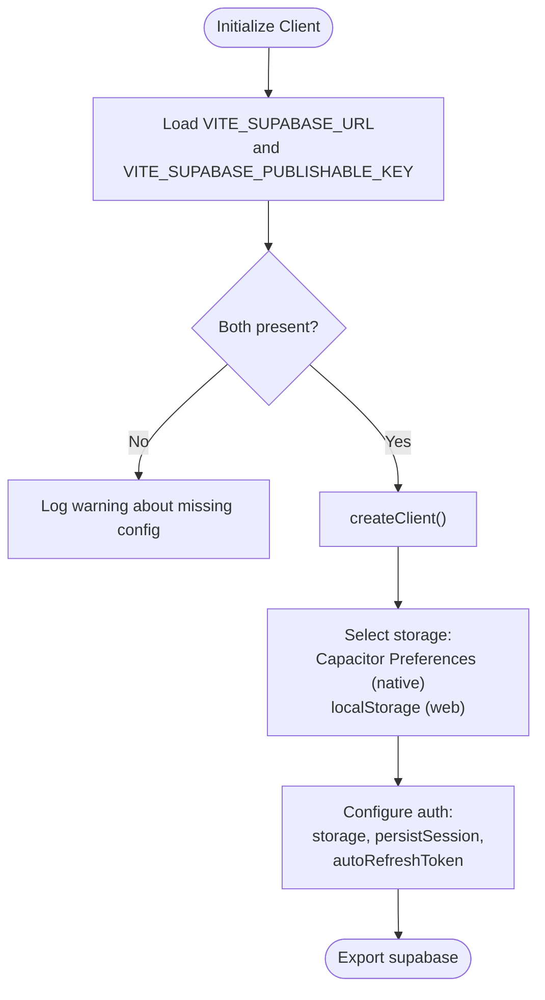
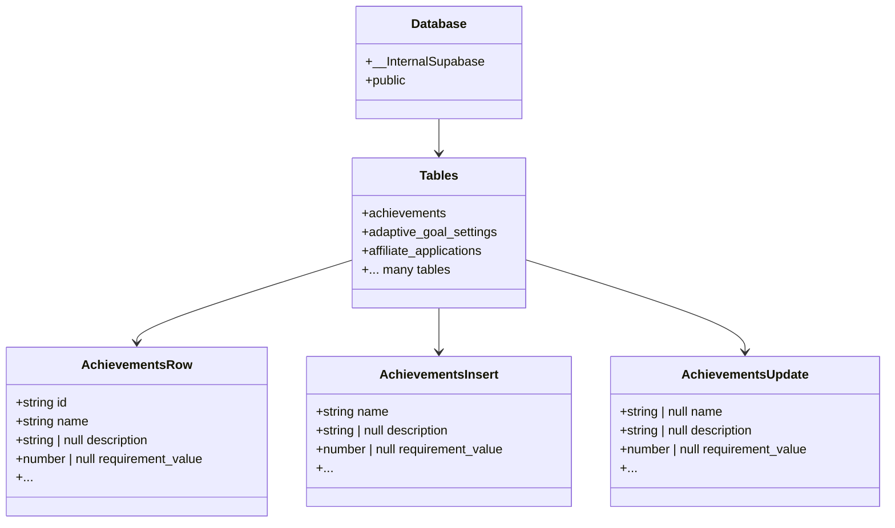
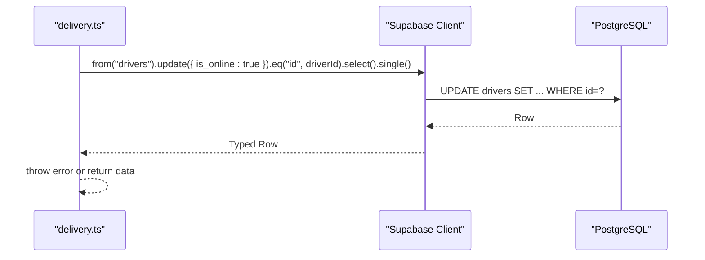
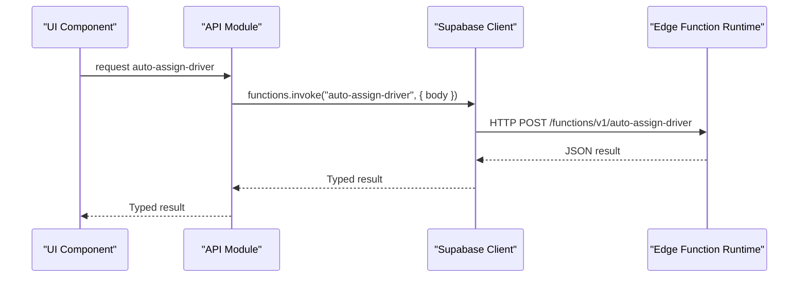
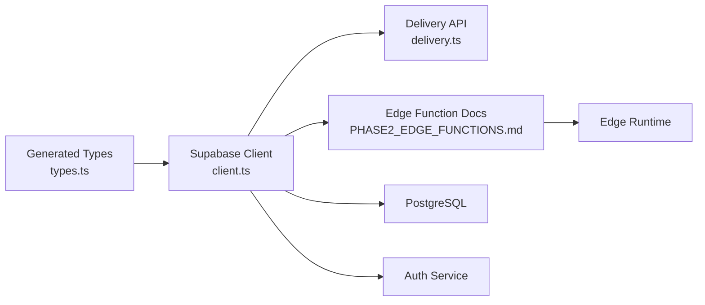

# Type Safety & TypeScript Integration

<cite>
**Referenced Files in This Document**
- [client.ts](file://src/integrations/supabase/client.ts)
- [types.ts](file://src/integrations/supabase/types.ts)
- [delivery.ts](file://src/integrations/supabase/delivery.ts)
- [PHASE2_EDGE_FUNCTIONS.md](file://supabase/functions/PHASE2_EDGE_FUNCTIONS.md)
- [config.toml](file://supabase/config.toml)
- [types.ts](file://supabase/types.ts)
</cite>

## Table of Contents
1. [Introduction](#introduction)
2. [Project Structure](#project-structure)
3. [Core Components](#core-components)
4. [Architecture Overview](#architecture-overview)
5. [Detailed Component Analysis](#detailed-component-analysis)
6. [Dependency Analysis](#dependency-analysis)
7. [Performance Considerations](#performance-considerations)
8. [Troubleshooting Guide](#troubleshooting-guide)
9. [Conclusion](#conclusion)

## Introduction
This document explains how TypeScript integrates with Supabase across the Nutrio Fuel application. It focuses on the generated type system, type-safe database operations, query builder usage, and edge function invocation patterns. It also covers strategies for maintaining type consistency during schema and function updates, and demonstrates practical approaches for CRUD operations, nullable handling, and complex nested data retrieval.

## Project Structure
The Supabase integration is centered around three key areas:
- Supabase client initialization with a strongly-typed Database generic
- A generated types module that mirrors the database schema
- API modules that encapsulate type-safe database operations and edge function calls

**Diagram sources**
- [client.ts:47-57](file://src/integrations/supabase/client.ts#L47-L57)
- [types.ts:9-15](file://src/integrations/supabase/types.ts#L9-L15)
- [delivery.ts:1-10](file://src/integrations/supabase/delivery.ts#L1-L10)
- [PHASE2_EDGE_FUNCTIONS.md:224-254](file://supabase/functions/PHASE2_EDGE_FUNCTIONS.md#L224-L254)

**Section sources**
- [client.ts:1-57](file://src/integrations/supabase/client.ts#L1-L57)
- [types.ts:1-15](file://src/integrations/supabase/types.ts#L1-L15)
- [delivery.ts:1-10](file://src/integrations/supabase/delivery.ts#L1-L10)

## Core Components
- Supabase client with typed Database generic and Capacitor-native auth persistence
- Generated Database types that define Row, Insert, Update, Enums, and Relationships for every table
- Delivery API module demonstrating type-safe PostgREST usage and real-time subscriptions
- Edge function invocation patterns for serverless logic

Key characteristics:
- The client is created with a Database generic so all PostgREST and Realtime operations are strongly typed
- Generated types include Json union, Enum references, and relationship metadata
- Delivery APIs show embedded joins, filtering, ordering, and real-time channels

**Section sources**
- [client.ts:47-57](file://src/integrations/supabase/client.ts#L47-L57)
- [types.ts:1-15](file://src/integrations/supabase/types.ts#L1-L15)
- [delivery.ts:87-99](file://src/integrations/supabase/delivery.ts#L87-L99)

## Architecture Overview
The integration pattern follows a layered approach:
- Client layer initializes Supabase with auth persistence and storage abstraction
- Types layer provides compile-time guarantees for database schemas
- API layer encapsulates operations with explicit typing and error handling
- Edge functions provide serverless logic invoked via the Supabase client or HTTP

**Diagram sources**
- [delivery.ts:11-25](file://src/integrations/supabase/delivery.ts#L11-L25)
- [PHASE2_EDGE_FUNCTIONS.md:224-254](file://supabase/functions/PHASE2_EDGE_FUNCTIONS.md#L224-L254)

## Detailed Component Analysis

### Supabase Client Initialization
- Creates a typed client using the generated Database generic
- Provides a Capacitor-compatible storage adapter for sessions
- Enables automatic token refresh and persistent sessions
- Guards against missing environment variables with console warnings

**Diagram sources**
- [client.ts:7-16](file://src/integrations/supabase/client.ts#L7-L16)
- [client.ts:44-57](file://src/integrations/supabase/client.ts#L44-L57)

**Section sources**
- [client.ts:1-57](file://src/integrations/supabase/client.ts#L1-L57)

### Generated Type System
- Database generic defines all tables, enums, and relationships
- Each table exposes Row, Insert, Update, and Relationships
- Json union supports flexible JSON/JSONB fields
- Enums are referenced via Database["public"]["Enums"][...] to maintain strong typing

**Diagram sources**
- [types.ts:9-52](file://src/integrations/supabase/types.ts#L9-L52)

**Section sources**
- [types.ts:1-800](file://src/integrations/supabase/types.ts#L1-L800)

### Type-Safe Database Operations
The delivery module demonstrates:
- Mutations with typed Row return via select().single()
- Filtering with eq(), not(), in()
- Embedded joins using select() with foreign table projections
- Ordering and limiting for paginated results
- Real-time subscriptions via Postgres changes

**Diagram sources**
- [delivery.ts:11-25](file://src/integrations/supabase/delivery.ts#L11-L25)

**Section sources**
- [delivery.ts:87-99](file://src/integrations/supabase/delivery.ts#L87-L99)
- [delivery.ts:174-235](file://src/integrations/supabase/delivery.ts#L174-L235)
- [delivery.ts:389-420](file://src/integrations/supabase/delivery.ts#L389-L420)
- [delivery.ts:695-712](file://src/integrations/supabase/delivery.ts#L695-L712)

### Edge Function Calls
Edge functions are invoked through the Supabase client or HTTP requests. The documentation shows:
- Using supabase.functions.invoke with a body payload
- HTTP POST to the functions endpoint with Authorization header
- Typical inputs and outputs for auto-assign-driver and send-invoice-email

**Diagram sources**
- [PHASE2_EDGE_FUNCTIONS.md:224-254](file://supabase/functions/PHASE2_EDGE_FUNCTIONS.md#L224-L254)

**Section sources**
- [PHASE2_EDGE_FUNCTIONS.md:34-86](file://supabase/functions/PHASE2_EDGE_FUNCTIONS.md#L34-L86)
- [PHASE2_EDGE_FUNCTIONS.md:106-171](file://supabase/functions/PHASE2_EDGE_FUNCTIONS.md#L106-L171)
- [PHASE2_EDGE_FUNCTIONS.md:224-254](file://supabase/functions/PHASE2_EDGE_FUNCTIONS.md#L224-L254)

### Edge Function Configuration
Supabase function settings indicate JWT verification toggles per function. This affects how functions validate incoming requests.

**Section sources**
- [config.toml:1-59](file://supabase/config.toml#L1-L59)

## Dependency Analysis
The integration exhibits low coupling and high cohesion:
- API modules depend on the typed client and generated types
- Client depends on environment variables and storage abstraction
- Edge functions depend on Supabase secrets and external services

**Diagram sources**
- [client.ts:3-4](file://src/integrations/supabase/client.ts#L3-L4)
- [types.ts:9-15](file://src/integrations/supabase/types.ts#L9-L15)
- [delivery.ts:4](file://src/integrations/supabase/delivery.ts#L4)
- [PHASE2_EDGE_FUNCTIONS.md:224-254](file://supabase/functions/PHASE2_EDGE_FUNCTIONS.md#L224-L254)

**Section sources**
- [client.ts:3-4](file://src/integrations/supabase/client.ts#L3-L4)
- [delivery.ts:4](file://src/integrations/supabase/delivery.ts#L4)

## Performance Considerations
- Prefer selective field projections in select() to reduce payload sizes
- Use filtering (eq, in, not) early to minimize result sets
- Leverage indexes on frequently filtered columns (e.g., pending deliveries)
- Batch operations where possible to reduce round-trips
- Use real-time subscriptions judiciously to avoid excessive channel traffic

## Troubleshooting Guide
Common issues and resolutions:
- Missing environment variables: The client logs warnings when Supabase URL or publishable key are missing. Ensure environment variables are set in the build environment.
- Authentication persistence on native: Capacitor Preferences are used for session storage; failures are handled gracefully to prevent crashes.
- Edge function invocation: Verify function deployment, environment variables, and Authorization headers. Use logs to diagnose failures.
- Real-time subscriptions: Ensure filters and channel names match expectations; handle PGRST116 errors when no rows are returned.

**Section sources**
- [client.ts:11-16](file://src/integrations/supabase/client.ts#L11-L16)
- [client.ts:36-41](file://src/integrations/supabase/client.ts#L36-L41)
- [PHASE2_EDGE_FUNCTIONS.md:380-401](file://supabase/functions/PHASE2_EDGE_FUNCTIONS.md#L380-L401)

## Conclusion
The application achieves strong type safety by combining a typed Supabase client with a generated schema-driven types module. API modules encapsulate PostgREST operations and edge function invocations, ensuring predictable, compile-time verified contracts across the stack. Following the outlined patterns and best practices will help maintain type consistency as the schema and edge functions evolve.