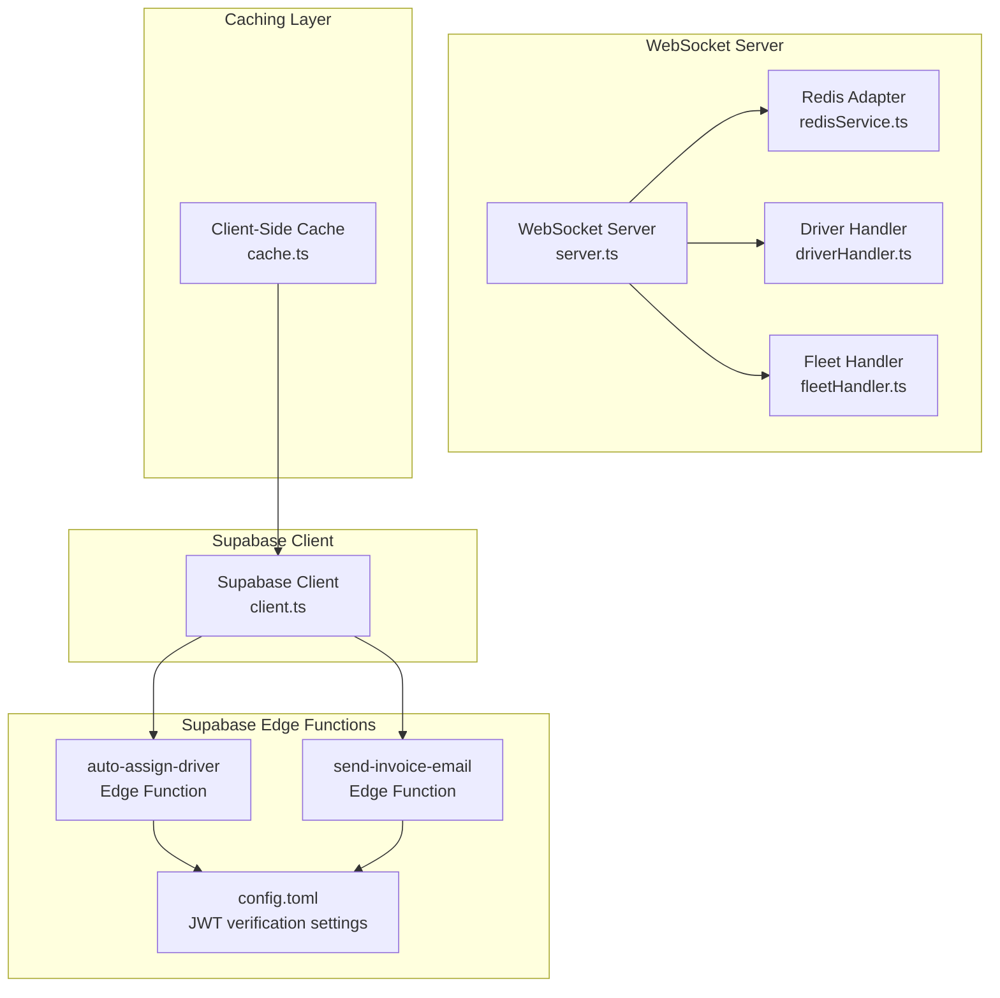
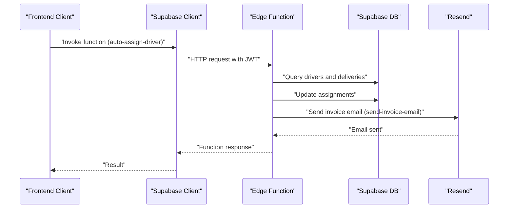
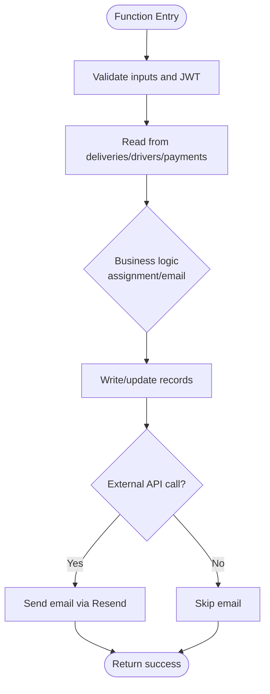
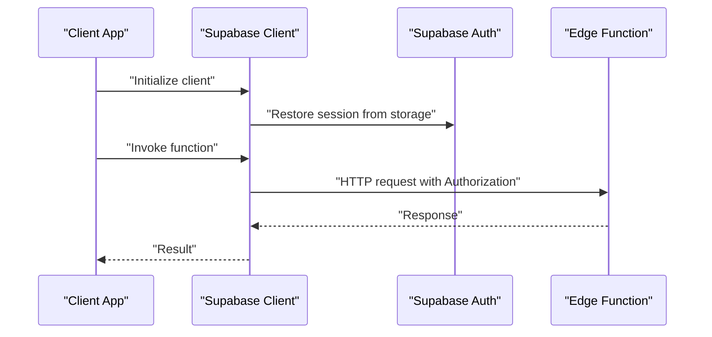
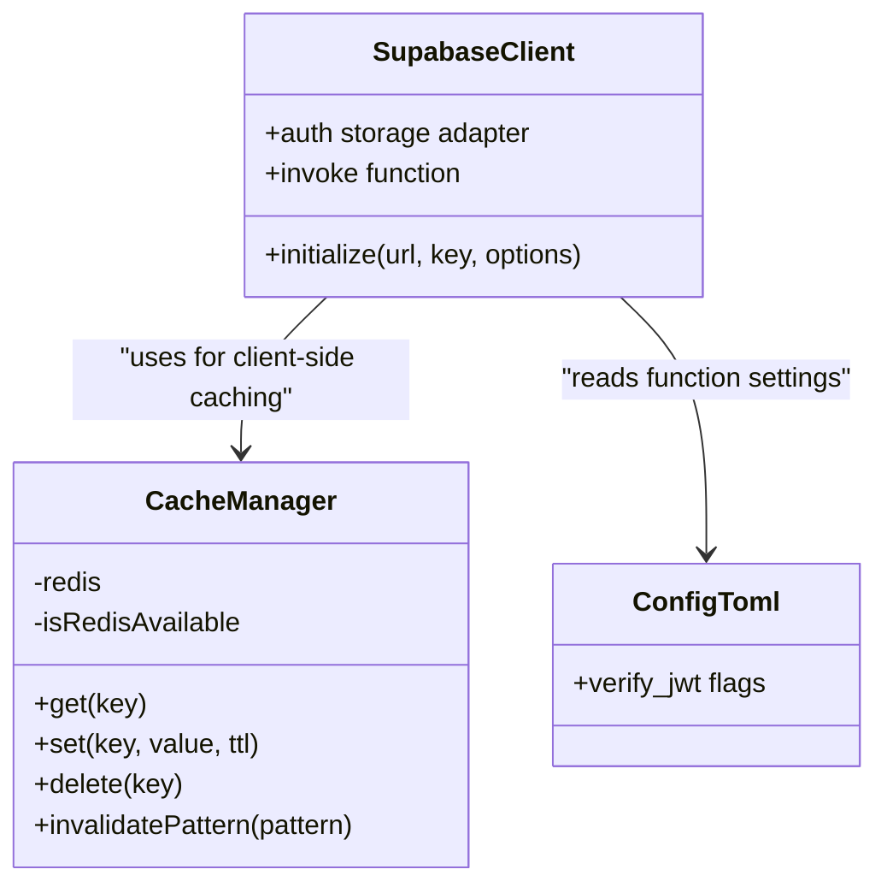
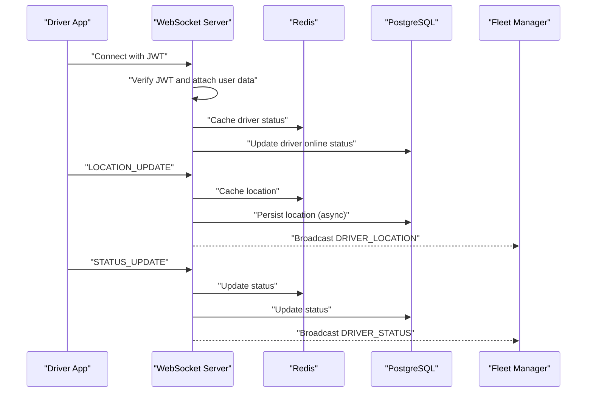
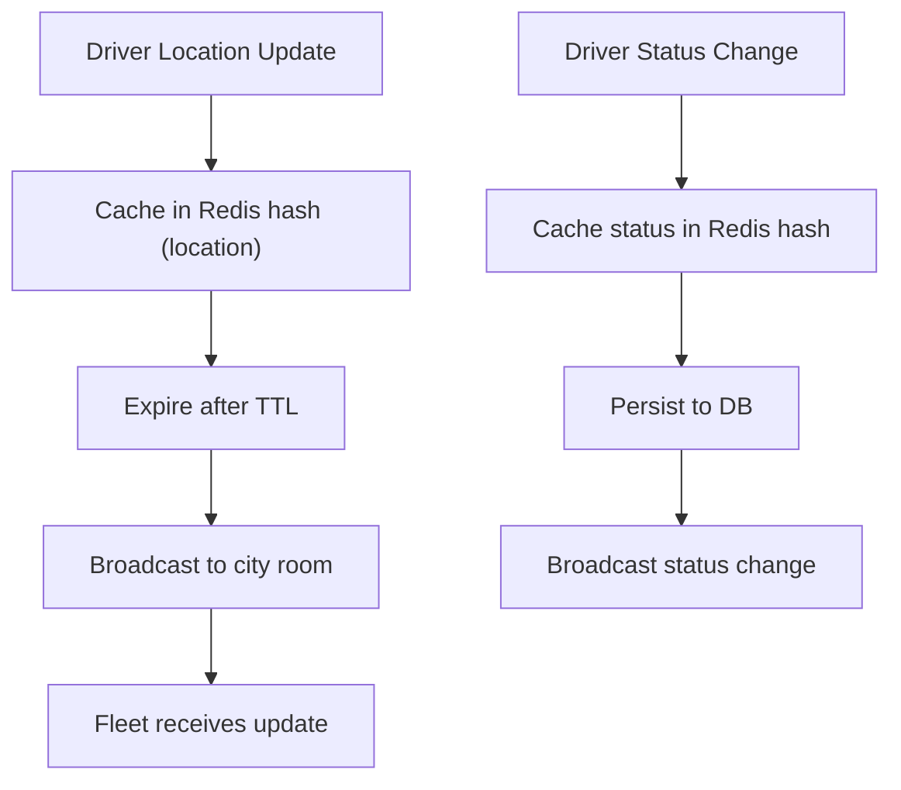
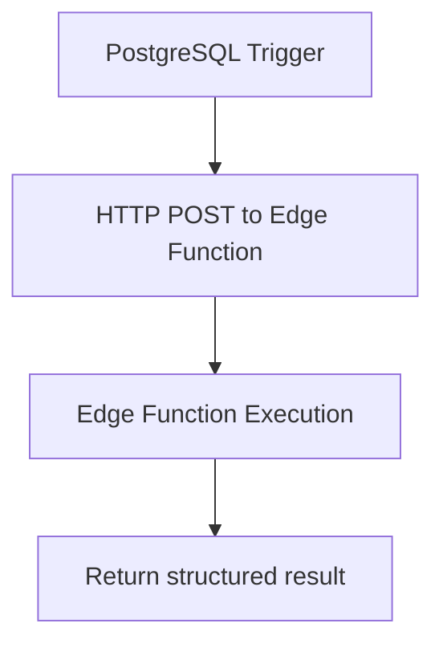
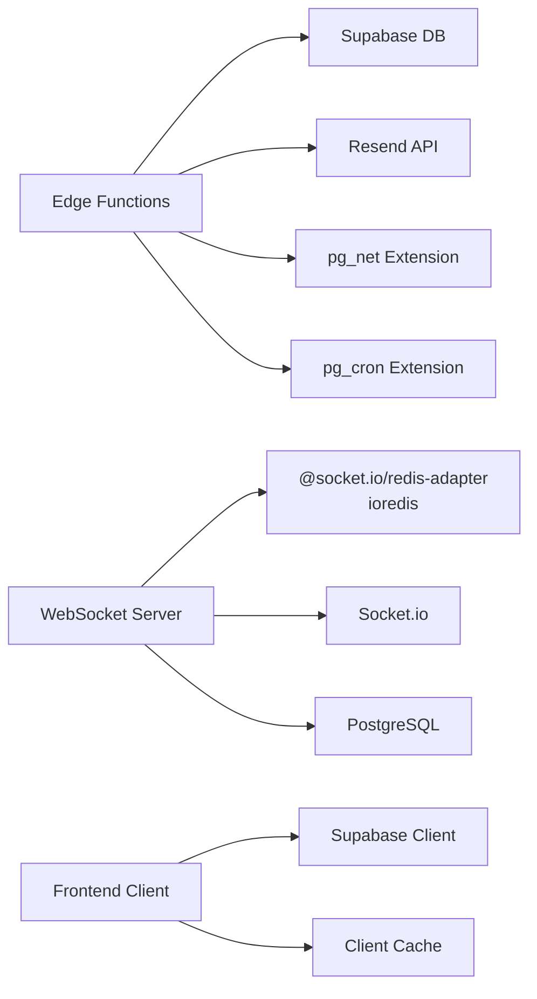

# Backend Architecture

<cite>
**Referenced Files in This Document**
- [PHASE2_EDGE_FUNCTIONS.md](file://supabase/functions/PHASE2_EDGE_FUNCTIONS.md)
- [config.toml](file://supabase/config.toml)
- [client.ts](file://src/integrations/supabase/client.ts)
- [server.ts](file://websocket-server/src/server.ts)
- [redisService.ts](file://websocket-server/src/services/redisService.ts)
- [driverHandler.ts](file://websocket-server/src/handlers/driverHandler.ts)
- [fleetHandler.ts](file://websocket-server/src/handlers/fleetHandler.ts)
- [cache.ts](file://src/lib/cache.ts)
- [realtime.spec.ts](file://e2e/system/realtime.spec.ts)
- [package.json](file://websocket-server/package.json)
</cite>

## Table of Contents
1. [Introduction](#introduction)
2. [Project Structure](#project-structure)
3. [Core Components](#core-components)
4. [Architecture Overview](#architecture-overview)
5. [Detailed Component Analysis](#detailed-component-analysis)
6. [Dependency Analysis](#dependency-analysis)
7. [Performance Considerations](#performance-considerations)
8. [Security Implementation](#security-implementation)
9. [Monitoring Strategies](#monitoring-strategies)
10. [Scalability Considerations](#scalability-considerations)
11. [Troubleshooting Guide](#troubleshooting-guide)
12. [Conclusion](#conclusion)

## Introduction
This document describes the backend architecture for the Supabase-powered system, focusing on edge function implementation patterns, real-time database synchronization, and serverless computing approaches. It also documents API design patterns, authentication integration with Supabase Auth, the data access layer abstraction, WebSocket server implementation for real-time features, Redis integration for caching and pub/sub messaging, and the relationship between edge functions and database triggers. Finally, it covers scalability, security, and monitoring strategies.

## Project Structure
The backend architecture spans three primary areas:
- Supabase Edge Functions: serverless automation for delivery assignment and invoice email generation
- Supabase Auth and Client Integration: secure client-side authentication and session persistence
- WebSocket Server: real-time fleet tracking with Redis-backed pub/sub and multi-instance scaling

**Diagram sources**
- [PHASE2_EDGE_FUNCTIONS.md:1-411](file://supabase/functions/PHASE2_EDGE_FUNCTIONS.md#L1-L411)
- [config.toml:1-59](file://supabase/config.toml#L1-L59)
- [client.ts:1-57](file://src/integrations/supabase/client.ts#L1-L57)
- [server.ts:1-256](file://websocket-server/src/server.ts#L1-L256)
- [redisService.ts:1-264](file://websocket-server/src/services/redisService.ts#L1-L264)
- [driverHandler.ts:1-318](file://websocket-server/src/handlers/driverHandler.ts#L1-L318)
- [fleetHandler.ts:1-247](file://websocket-server/src/handlers/fleetHandler.ts#L1-L247)
- [cache.ts:1-199](file://src/lib/cache.ts#L1-L199)

**Section sources**
- [PHASE2_EDGE_FUNCTIONS.md:1-411](file://supabase/functions/PHASE2_EDGE_FUNCTIONS.md#L1-L411)
- [config.toml:1-59](file://supabase/config.toml#L1-L59)
- [client.ts:1-57](file://src/integrations/supabase/client.ts#L1-L57)
- [server.ts:1-256](file://websocket-server/src/server.ts#L1-L256)
- [redisService.ts:1-264](file://websocket-server/src/services/redisService.ts#L1-L264)
- [driverHandler.ts:1-318](file://websocket-server/src/handlers/driverHandler.ts#L1-L318)
- [fleetHandler.ts:1-247](file://websocket-server/src/handlers/fleetHandler.ts#L1-L247)
- [cache.ts:1-199](file://src/lib/cache.ts#L1-L199)

## Core Components
- Supabase Edge Functions: Two serverless functions automate delivery assignment and invoice email dispatch. They use Supabase service role keys for database operations and external APIs for email delivery.
- Supabase Client Integration: The frontend integrates with Supabase Auth for secure session management and invokes Edge Functions via the Supabase client.
- WebSocket Server: A Socket.io-based real-time server with Redis adapter for multi-instance scaling, handling driver location/status updates and fleet manager subscriptions.
- Redis Integration: Provides caching, pub/sub synchronization, and driver status/location persistence for real-time tracking.
- Caching Layer: Client-side cache abstraction around Supabase queries with in-memory fallback.

**Section sources**
- [PHASE2_EDGE_FUNCTIONS.md:34-172](file://supabase/functions/PHASE2_EDGE_FUNCTIONS.md#L34-L172)
- [client.ts:1-57](file://src/integrations/supabase/client.ts#L1-L57)
- [server.ts:1-256](file://websocket-server/src/server.ts#L1-L256)
- [redisService.ts:1-264](file://websocket-server/src/services/redisService.ts#L1-L264)
- [cache.ts:1-199](file://src/lib/cache.ts#L1-L199)

## Architecture Overview
The system follows a serverless-first approach with Supabase Edge Functions orchestrating asynchronous tasks. Real-time features are powered by a dedicated WebSocket server with Redis pub/sub for multi-instance coordination. The client integrates with Supabase Auth and invokes Edge Functions for serverless actions.

**Diagram sources**
- [PHASE2_EDGE_FUNCTIONS.md:224-254](file://supabase/functions/PHASE2_EDGE_FUNCTIONS.md#L224-L254)
- [client.ts:1-57](file://src/integrations/supabase/client.ts#L1-L57)

**Section sources**
- [PHASE2_EDGE_FUNCTIONS.md:224-254](file://supabase/functions/PHASE2_EDGE_FUNCTIONS.md#L224-L254)
- [client.ts:1-57](file://src/integrations/supabase/client.ts#L1-L57)

## Detailed Component Analysis

### Edge Functions Implementation Pattern
- Purpose: Automate delivery assignment and invoice email dispatch using serverless functions.
- Invocation: Via Supabase client or direct HTTP requests with JWT.
- Database Access: Uses Supabase service role key for bypassing Row Level Security and performing writes.
- External Integrations: Email sending through Resend API.
- Triggers: Database triggers and scheduled jobs invoke functions to maintain automation.

**Diagram sources**
- [PHASE2_EDGE_FUNCTIONS.md:34-172](file://supabase/functions/PHASE2_EDGE_FUNCTIONS.md#L34-L172)

**Section sources**
- [PHASE2_EDGE_FUNCTIONS.md:34-172](file://supabase/functions/PHASE2_EDGE_FUNCTIONS.md#L34-L172)
- [PHASE2_EDGE_FUNCTIONS.md:258-322](file://supabase/functions/PHASE2_EDGE_FUNCTIONS.md#L258-L322)

### Supabase Auth Integration and API Design Patterns
- Client Initialization: Supabase client configured with publishable key and persistent auth storage (localStorage for web, Capacitor Preferences for native).
- Auth Persistence: Automatic token refresh and session persistence.
- Function Invocation: Frontend invokes Edge Functions using the Supabase client with proper headers.

**Diagram sources**
- [client.ts:1-57](file://src/integrations/supabase/client.ts#L1-L57)
- [PHASE2_EDGE_FUNCTIONS.md:224-254](file://supabase/functions/PHASE2_EDGE_FUNCTIONS.md#L224-L254)

**Section sources**
- [client.ts:1-57](file://src/integrations/supabase/client.ts#L1-L57)
- [PHASE2_EDGE_FUNCTIONS.md:224-254](file://supabase/functions/PHASE2_EDGE_FUNCTIONS.md#L224-L254)

### Data Access Layer Abstraction
- Supabase Client: Centralized client initialization with environment variables and storage adapters.
- Client-Side Cache: Optional Redis-backed cache with in-memory fallback; otherwise pure in-memory cache; invalidation patterns supported.
- Supabase Functions: Functions configured with JWT verification toggles in config.

**Diagram sources**
- [client.ts:1-57](file://src/integrations/supabase/client.ts#L1-L57)
- [cache.ts:1-199](file://src/lib/cache.ts#L1-L199)
- [config.toml:1-59](file://supabase/config.toml#L1-L59)

**Section sources**
- [client.ts:1-57](file://src/integrations/supabase/client.ts#L1-L57)
- [cache.ts:1-199](file://src/lib/cache.ts#L1-L199)
- [config.toml:1-59](file://supabase/config.toml#L1-L59)

### WebSocket Server Implementation for Real-Time Features
- Socket.io Server: Configured with CORS, ping intervals, transport fallback, and message compression.
- Redis Adapter: Enables multi-instance scaling by sharing state across servers.
- Authentication: JWT verification middleware decodes tokens and attaches user metadata to sockets.
- Room Management: Drivers and fleet managers join city-specific rooms; broadcasts scoped accordingly.
- Handlers:
  - Driver Handler: Validates and rates-limit location/status updates, caches in Redis, persists to DB, and broadcasts to fleet.
  - Fleet Handler: Manages city subscriptions, enforces access control, and serves location history queries.

**Diagram sources**
- [server.ts:65-150](file://websocket-server/src/server.ts#L65-L150)
- [driverHandler.ts:105-207](file://websocket-server/src/handlers/driverHandler.ts#L105-L207)
- [fleetHandler.ts:87-140](file://websocket-server/src/handlers/fleetHandler.ts#L87-L140)
- [redisService.ts:87-146](file://websocket-server/src/services/redisService.ts#L87-L146)

**Section sources**
- [server.ts:1-256](file://websocket-server/src/server.ts#L1-L256)
- [driverHandler.ts:1-318](file://websocket-server/src/handlers/driverHandler.ts#L1-L318)
- [fleetHandler.ts:1-247](file://websocket-server/src/handlers/fleetHandler.ts#L1-L247)
- [redisService.ts:1-264](file://websocket-server/src/services/redisService.ts#L1-L264)

### Redis Integration for Caching and Pub/Sub Messaging
- Driver Location/Status Caching: Hash-based keys with TTL for location and status.
- Online Driver Discovery: Scans status keys to enumerate online drivers.
- City Statistics: Maintains counters for online drivers per city.
- Multi-Instance Scaling: Redis adapter ensures events propagate across instances.

**Diagram sources**
- [redisService.ts:87-146](file://websocket-server/src/services/redisService.ts#L87-L146)
- [driverHandler.ts:148-182](file://websocket-server/src/handlers/driverHandler.ts#L148-L182)

**Section sources**
- [redisService.ts:1-264](file://websocket-server/src/services/redisService.ts#L1-L264)
- [driverHandler.ts:1-318](file://websocket-server/src/handlers/driverHandler.ts#L1-L318)

### Relationship Between Edge Functions and Database Triggers
- Database Triggers: PostgreSQL triggers invoke Edge Functions via HTTP calls when specific conditions occur (e.g., delivery creation with pending status).
- Scheduled Jobs: Cron jobs periodically invoke functions to handle pending workloads.
- Function Inputs/Outputs: Well-defined schemas for delivery and payment identifiers with standardized responses.

**Diagram sources**
- [PHASE2_EDGE_FUNCTIONS.md:258-302](file://supabase/functions/PHASE2_EDGE_FUNCTIONS.md#L258-L302)

**Section sources**
- [PHASE2_EDGE_FUNCTIONS.md:258-302](file://supabase/functions/PHASE2_EDGE_FUNCTIONS.md#L258-L302)

## Dependency Analysis
- Supabase Edge Functions depend on:
  - Supabase service role key for database operations
  - External email provider for invoice notifications
  - Database extensions (e.g., pg_net, pg_cron) for HTTP invocation and scheduling
- WebSocket Server depends on:
  - Socket.io for real-time communication
  - Redis adapter for multi-instance coordination
  - PostgreSQL for durable data persistence
  - JSON Web Token verification for authentication
- Client depends on:
  - Supabase client for Auth and function invocation
  - Optional Redis-backed cache with in-memory fallback

**Diagram sources**
- [PHASE2_EDGE_FUNCTIONS.md:1-411](file://supabase/functions/PHASE2_EDGE_FUNCTIONS.md#L1-L411)
- [package.json:21-30](file://websocket-server/package.json#L21-L30)
- [server.ts:1-256](file://websocket-server/src/server.ts#L1-L256)
- [client.ts:1-57](file://src/integrations/supabase/client.ts#L1-L57)
- [cache.ts:1-199](file://src/lib/cache.ts#L1-L199)

**Section sources**
- [PHASE2_EDGE_FUNCTIONS.md:1-411](file://supabase/functions/PHASE2_EDGE_FUNCTIONS.md#L1-L411)
- [package.json:1-44](file://websocket-server/package.json#L1-L44)
- [server.ts:1-256](file://websocket-server/src/server.ts#L1-L256)
- [client.ts:1-57](file://src/integrations/supabase/client.ts#L1-L57)
- [cache.ts:1-199](file://src/lib/cache.ts#L1-L199)

## Performance Considerations
- Edge Functions:
  - Use service role keys judiciously; ensure minimal query scope and proper indexing on frequently accessed columns.
  - Leverage pg_net for low-latency HTTP invocations and pg_cron for periodic maintenance.
- WebSocket Server:
  - Tune ping intervals and buffer sizes; enable compression for large payloads.
  - Use Redis adapter to avoid single-instance bottlenecks; monitor connection health.
- Caching:
  - Prefer Redis-backed cache in production; fall back to in-memory cache for development.
  - Use targeted TTLs and invalidation patterns to balance freshness and cost.
- Database:
  - Create indexes on filter columns (e.g., delivery status) to optimize function queries.

[No sources needed since this section provides general guidance]

## Security Implementation
- JWT Verification:
  - Edge Functions: Some functions disable JWT verification in config; ensure only trusted callers invoke them.
  - WebSocket Server: Enforce JWT verification middleware and reject malformed/expired tokens.
- Secrets Management:
  - Store Supabase URLs and service role keys as environment secrets; avoid embedding in client code.
- Input Validation:
  - Validate all function inputs and WebSocket payloads using schema libraries.
- Transport Security:
  - Use HTTPS/TLS for all external API calls and function endpoints.

**Section sources**
- [config.toml:1-59](file://supabase/config.toml#L1-L59)
- [server.ts:65-103](file://websocket-server/src/server.ts#L65-L103)
- [PHASE2_EDGE_FUNCTIONS.md:354-361](file://supabase/functions/PHASE2_EDGE_FUNCTIONS.md#L354-L361)

## Monitoring Strategies
- Edge Functions:
  - Tail function logs for real-time visibility; track error rates and execution times.
  - Monitor email delivery logs for invoice function.
- WebSocket Server:
  - Expose health and readiness endpoints; monitor connection counts and Redis health.
  - Track error events and uncaught exceptions for graceful shutdown procedures.
- Database:
  - Monitor query performance and connection pooling under load; ensure indexes are effective.

**Section sources**
- [PHASE2_EDGE_FUNCTIONS.md:337-351](file://supabase/functions/PHASE2_EDGE_FUNCTIONS.md#L337-L351)
- [server.ts:162-192](file://websocket-server/src/server.ts#L162-L192)

## Scalability Considerations
- Horizontal Scaling:
  - WebSocket server uses Redis adapter for multi-instance deployments; ensure Redis availability and network latency are optimized.
- Edge Functions:
  - Scale independently; ensure database indexes and function logic minimize cold starts and timeouts.
- Caching:
  - Redis-backed cache reduces database load; in-memory fallback prevents hard failures in development.
- Load Testing:
  - Validate response times and error rates under simulated load; adjust timeouts and resource limits accordingly.

**Section sources**
- [redisService.ts:63-82](file://websocket-server/src/services/redisService.ts#L63-L82)
- [server.ts:19-26](file://websocket-server/src/server.ts#L19-L26)
- [PHASE2_EDGE_FUNCTIONS.md:306-322](file://supabase/functions/PHASE2_EDGE_FUNCTIONS.md#L306-L322)

## Troubleshooting Guide
- Edge Functions:
  - Verify environment variables and function deployment status; check logs for validation and service errors.
  - Confirm database migrations and indexes exist; ensure pg_net and pg_cron extensions are enabled.
- WebSocket Server:
  - Validate JWT secret and Redis connectivity; check health endpoint readiness.
  - Inspect connection metrics and error handlers for graceful shutdown scenarios.
- Client:
  - Ensure Supabase URL and publishable key are configured; verify session storage behavior on native vs web.

**Section sources**
- [PHASE2_EDGE_FUNCTIONS.md:380-402](file://supabase/functions/PHASE2_EDGE_FUNCTIONS.md#L380-L402)
- [server.ts:197-239](file://websocket-server/src/server.ts#L197-L239)
- [client.ts:10-16](file://src/integrations/supabase/client.ts#L10-L16)

## Conclusion
The backend leverages Supabase Edge Functions for serverless automation, Supabase Auth for secure client integration, and a scalable WebSocket server with Redis for real-time fleet tracking. The architecture balances performance, security, and observability while supporting horizontal scaling and robust error handling.