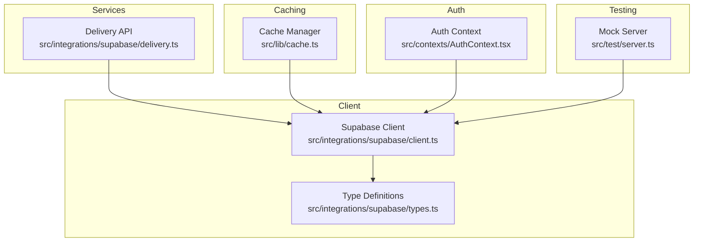
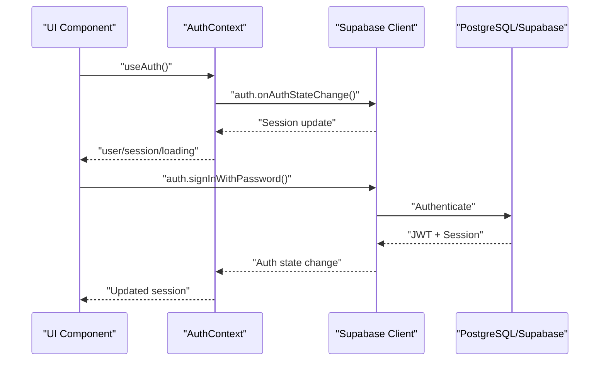
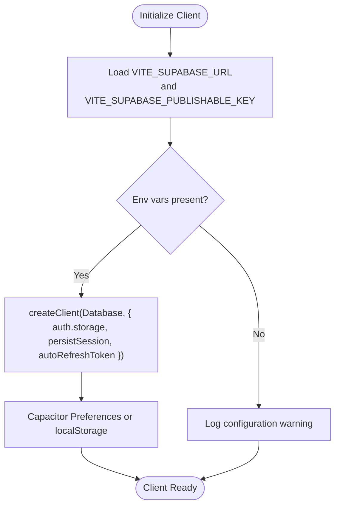
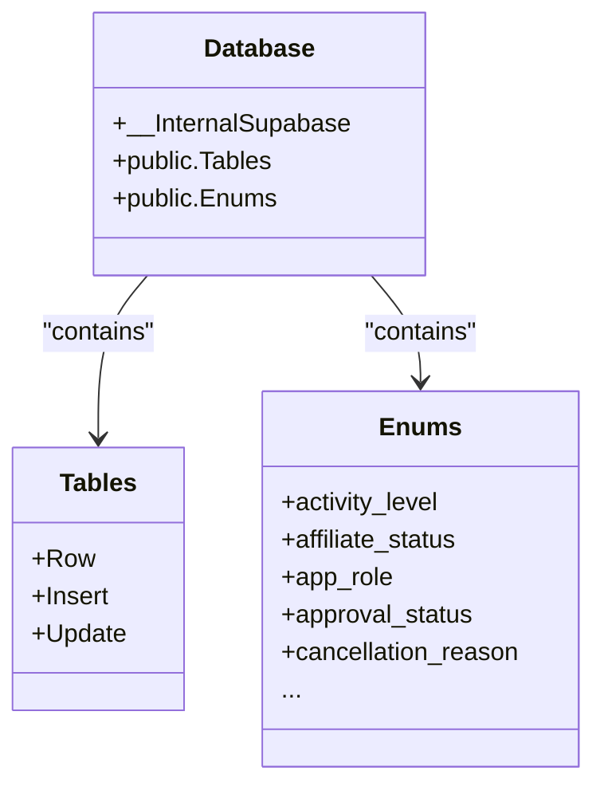
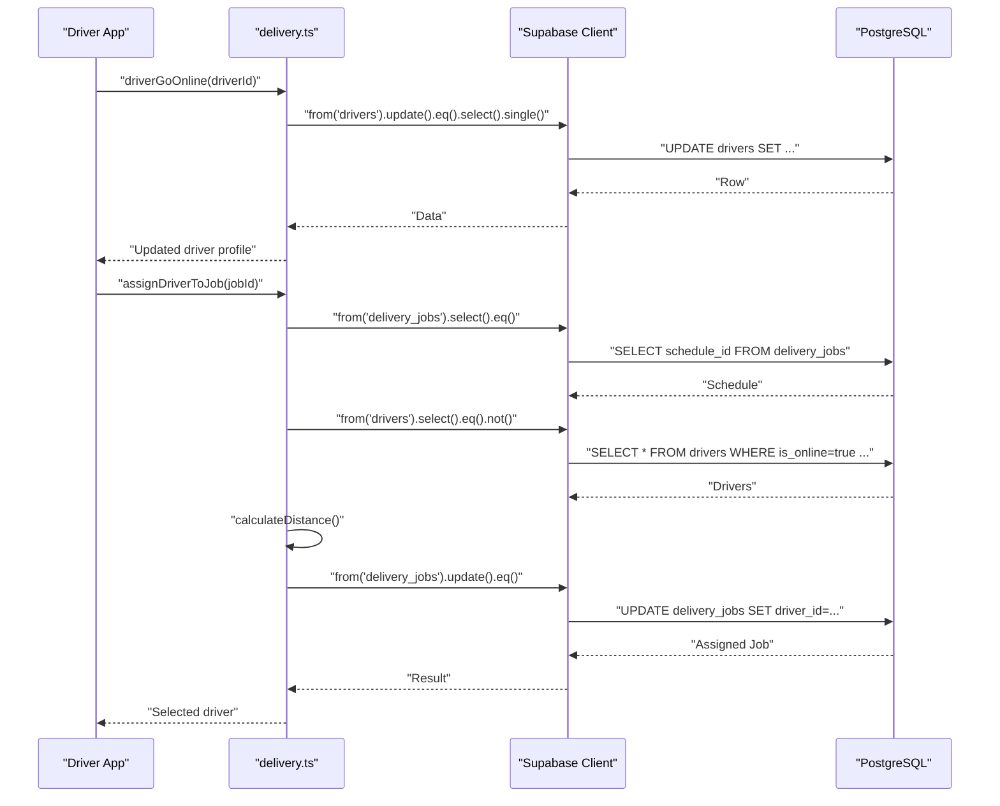
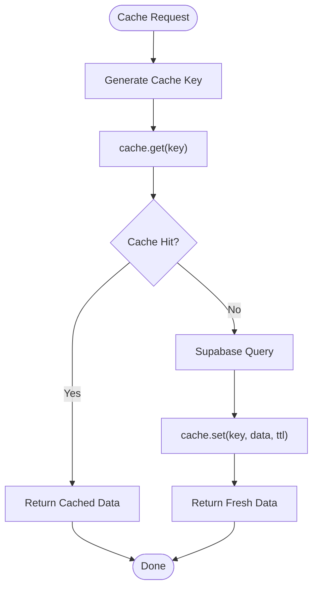
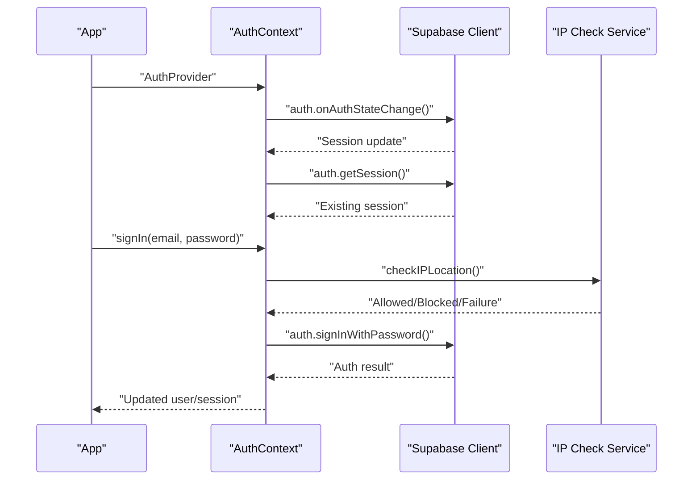
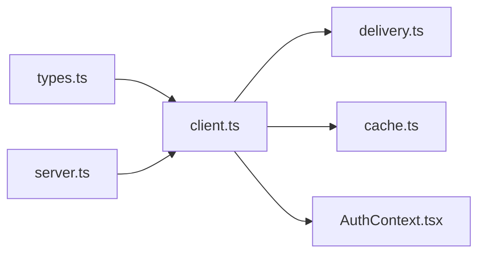

# Data Access Layer

<cite>
**Referenced Files in This Document**
- [client.ts](file://src/integrations/supabase/client.ts)
- [types.ts](file://src/integrations/supabase/types.ts)
- [delivery.ts](file://src/integrations/supabase/delivery.ts)
- [cache.ts](file://src/lib/cache.ts)
- [AuthContext.tsx](file://src/contexts/AuthContext.tsx)
- [server.ts](file://src/test/server.ts)
</cite>

## Table of Contents
1. [Introduction](#introduction)
2. [Project Structure](#project-structure)
3. [Core Components](#core-components)
4. [Architecture Overview](#architecture-overview)
5. [Detailed Component Analysis](#detailed-component-analysis)
6. [Dependency Analysis](#dependency-analysis)
7. [Performance Considerations](#performance-considerations)
8. [Troubleshooting Guide](#troubleshooting-guide)
9. [Conclusion](#conclusion)

## Introduction
This document describes the data access layer abstraction built on the Supabase client. It covers centralized client configuration, authentication integration, query patterns, TypeScript type safety, caching strategies, query optimization, data transformation, Supabase Auth session management, row-level security (RLS) policies, and access control. It also includes examples of CRUD operations, complex queries with joins, batch operations, error handling, retry mechanisms, and performance monitoring.

## Project Structure
The data access layer is organized around a central Supabase client, strongly typed database schemas, service modules for domain-specific APIs, and a caching layer for performance optimization. Authentication state is managed via a dedicated context that integrates with Supabase Auth.

**Diagram sources**
- [client.ts:1-57](file://src/integrations/supabase/client.ts#L1-L57)
- [types.ts:1-120](file://src/integrations/supabase/types.ts#L1-L120)
- [delivery.ts:1-50](file://src/integrations/supabase/delivery.ts#L1-L50)
- [cache.ts:1-120](file://src/lib/cache.ts#L1-L120)
- [AuthContext.tsx:1-60](file://src/contexts/AuthContext.tsx#L1-L60)
- [server.ts:1-24](file://src/test/server.ts#L1-L24)

**Section sources**
- [client.ts:1-57](file://src/integrations/supabase/client.ts#L1-L57)
- [types.ts:1-120](file://src/integrations/supabase/types.ts#L1-L120)
- [delivery.ts:1-50](file://src/integrations/supabase/delivery.ts#L1-L50)
- [cache.ts:1-120](file://src/lib/cache.ts#L1-L120)
- [AuthContext.tsx:1-60](file://src/contexts/AuthContext.tsx#L1-L60)
- [server.ts:1-24](file://src/test/server.ts#L1-L24)

## Core Components
- Centralized Supabase client with environment-driven configuration and native-capacitor storage integration for sessions.
- Strongly typed database schema definitions enabling compile-time safety for tables, inserts, updates, enums, and composite types.
- Domain-specific service module for delivery operations encapsulating CRUD and complex queries with joins.
- Caching layer with in-memory fallback and cache key patterns for frequently accessed entities.
- Authentication context integrating with Supabase Auth for session lifecycle and IP-based restrictions.
- Mock server for testing Supabase endpoints.

**Section sources**
- [client.ts:1-57](file://src/integrations/supabase/client.ts#L1-L57)
- [types.ts:9042-9194](file://src/integrations/supabase/types.ts#L9042-L9194)
- [delivery.ts:1-120](file://src/integrations/supabase/delivery.ts#L1-L120)
- [cache.ts:1-120](file://src/lib/cache.ts#L1-L120)
- [AuthContext.tsx:31-130](file://src/contexts/AuthContext.tsx#L31-L130)
- [server.ts:1-24](file://src/test/server.ts#L1-L24)

## Architecture Overview
The architecture centers on a single Supabase client instance configured with persistent session storage and automatic token refresh. Services consume this client to perform database operations, while the caching layer optimizes reads. Authentication state is synchronized globally via a React context that subscribes to Supabase Auth events.

**Diagram sources**
- [AuthContext.tsx:36-61](file://src/contexts/AuthContext.tsx#L36-L61)
- [client.ts:47-57](file://src/integrations/supabase/client.ts#L47-L57)

**Section sources**
- [AuthContext.tsx:31-130](file://src/contexts/AuthContext.tsx#L31-L130)
- [client.ts:1-57](file://src/integrations/supabase/client.ts#L1-L57)

## Detailed Component Analysis

### Centralized Supabase Client
- Environment variables drive client initialization with graceful placeholders.
- Capacitor Preferences storage adapter ensures sessions persist across native app restarts.
- Auth persistence and token auto-refresh are enabled for seamless UX.

**Diagram sources**
- [client.ts:7-16](file://src/integrations/supabase/client.ts#L7-L16)
- [client.ts:18-42](file://src/integrations/supabase/client.ts#L18-L42)
- [client.ts:47-57](file://src/integrations/supabase/client.ts#L47-L57)

**Section sources**
- [client.ts:1-57](file://src/integrations/supabase/client.ts#L1-L57)

### TypeScript Type Definitions and Schema Safety
- The Database type defines tables, rows, insert/update shapes, enums, and composite types.
- Utility types enable generic selection of Row/Insert/Update types per table.
- Enums and constants are exposed for runtime validation and UI usage.

**Diagram sources**
- [types.ts:9-15](file://src/integrations/supabase/types.ts#L9-L15)
- [types.ts:9042-9194](file://src/integrations/supabase/types.ts#L9042-L9194)

**Section sources**
- [types.ts:1-120](file://src/integrations/supabase/types.ts#L1-L120)
- [types.ts:9042-9194](file://src/integrations/supabase/types.ts#L9042-L9194)

### Delivery API Service
- Encapsulates driver lifecycle, job assignment, driver actions, admin controls, and real-time subscriptions.
- Demonstrates complex queries with joins, embedded selects, and batch operations.
- Uses PostGIS geometry types for location data and maintains historical location entries.

**Diagram sources**
- [delivery.ts:11-25](file://src/integrations/supabase/delivery.ts#L11-L25)
- [delivery.ts:174-235](file://src/integrations/supabase/delivery.ts#L174-L235)

**Section sources**
- [delivery.ts:1-735](file://src/integrations/supabase/delivery.ts#L1-L735)

### Caching Strategies
- Cache manager supports Redis (when available) and falls back to in-memory storage.
- TTL-based caching with pattern-based invalidation.
- Dedicated cache keys for restaurants, meals, challenges, leaderboards, and user profiles.
- Cached fetchers wrap Supabase queries to reduce round-trips for hot paths.

**Diagram sources**
- [cache.ts:37-86](file://src/lib/cache.ts#L37-L86)
- [cache.ts:124-177](file://src/lib/cache.ts#L124-L177)

**Section sources**
- [cache.ts:1-199](file://src/lib/cache.ts#L1-L199)

### Authentication Integration
- Auth context subscribes to Supabase Auth state changes and hydrates user/session state.
- Supports sign-up with redirect-to-dashboard and sign-in with optional IP location checks.
- On native platforms, initializes push notifications upon successful login.

**Diagram sources**
- [AuthContext.tsx:36-61](file://src/contexts/AuthContext.tsx#L36-L61)
- [AuthContext.tsx:87-112](file://src/contexts/AuthContext.tsx#L87-L112)

**Section sources**
- [AuthContext.tsx:1-131](file://src/contexts/AuthContext.tsx#L1-L131)

### Testing and Mocking
- Mock Service Worker server simulates Supabase auth and REST endpoints for isolated testing.
- Enables deterministic test runs without external database dependencies.

**Section sources**
- [server.ts:1-24](file://src/test/server.ts#L1-L24)

## Dependency Analysis
The data access layer exhibits low coupling and high cohesion:
- Services depend on the centralized client, not on each other.
- Types define contracts consumed by services and UI components.
- Cache depends on the client for data retrieval and on keys for invalidation.
- Auth context depends on the client for session lifecycle and on platform services for native features.

**Diagram sources**
- [types.ts:9042-9194](file://src/integrations/supabase/types.ts#L9042-L9194)
- [client.ts:1-57](file://src/integrations/supabase/client.ts#L1-L57)
- [delivery.ts:1-50](file://src/integrations/supabase/delivery.ts#L1-L50)
- [cache.ts:1-120](file://src/lib/cache.ts#L1-L120)
- [AuthContext.tsx:1-60](file://src/contexts/AuthContext.tsx#L1-L60)
- [server.ts:1-24](file://src/test/server.ts#L1-L24)

**Section sources**
- [client.ts:1-57](file://src/integrations/supabase/client.ts#L1-L57)
- [types.ts:9042-9194](file://src/integrations/supabase/types.ts#L9042-L9194)
- [delivery.ts:1-120](file://src/integrations/supabase/delivery.ts#L1-L120)
- [cache.ts:1-120](file://src/lib/cache.ts#L1-L120)
- [AuthContext.tsx:1-60](file://src/contexts/AuthContext.tsx#L1-L60)
- [server.ts:1-24](file://src/test/server.ts#L1-L24)

## Performance Considerations
- Prefer embedded selects and joins in service functions to minimize round-trips.
- Use caching for frequently accessed entities (restaurants, meals, challenges) with appropriate TTLs.
- Batch operations (e.g., auto-assigning multiple jobs) should be executed with minimal per-item overhead.
- Leverage Supabase’s PostGIS capabilities for spatial queries efficiently.
- Monitor query performance using Supabase logs and consider indexing high-cardinality columns.

[No sources needed since this section provides general guidance]

## Troubleshooting Guide
Common issues and resolutions:
- Missing Supabase configuration: The client logs a warning when environment variables are absent. Ensure VITE_SUPABASE_URL and VITE_SUPABASE_PUBLISHABLE_KEY are set in the build environment.
- Session persistence failures on native: Capacitor Preferences are used; silent failures are handled to avoid app crashes.
- Authentication state not updating: Verify onAuthStateChange subscription is registered and getSession is called after subscription setup.
- Real-time updates not firing: Confirm channel names and filters match the intended schema/table/event.
- Cache not reducing requests: Ensure cache keys are consistent and TTLs are appropriate; use invalidation helpers after mutations.

**Section sources**
- [client.ts:10-16](file://src/integrations/supabase/client.ts#L10-L16)
- [client.ts:18-42](file://src/integrations/supabase/client.ts#L18-L42)
- [AuthContext.tsx:36-61](file://src/contexts/AuthContext.tsx#L36-L61)
- [delivery.ts:695-734](file://src/integrations/supabase/delivery.ts#L695-L734)
- [cache.ts:179-195](file://src/lib/cache.ts#L179-L195)

## Conclusion
The data access layer leverages a centralized Supabase client, strong TypeScript types, and pragmatic caching to deliver a robust, type-safe, and performant foundation. Authentication is tightly integrated with Supabase Auth, and services encapsulate complex queries and transformations. With clear patterns for caching, error handling, and real-time subscriptions, the layer supports scalable development and maintenance.