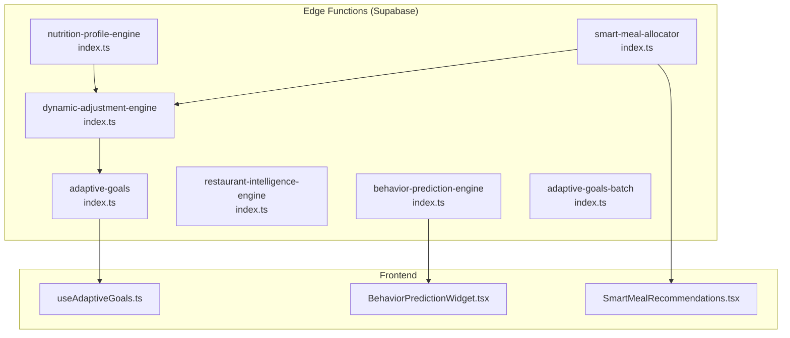
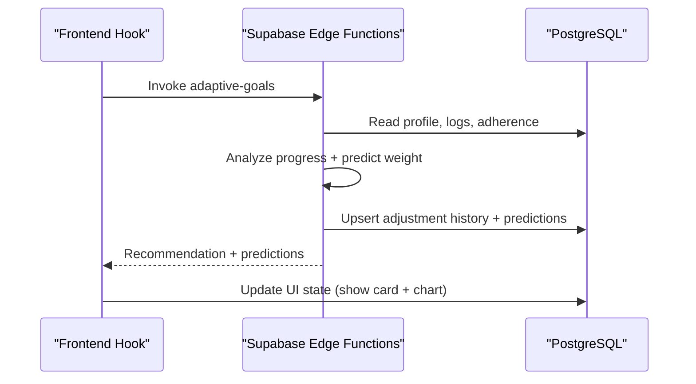
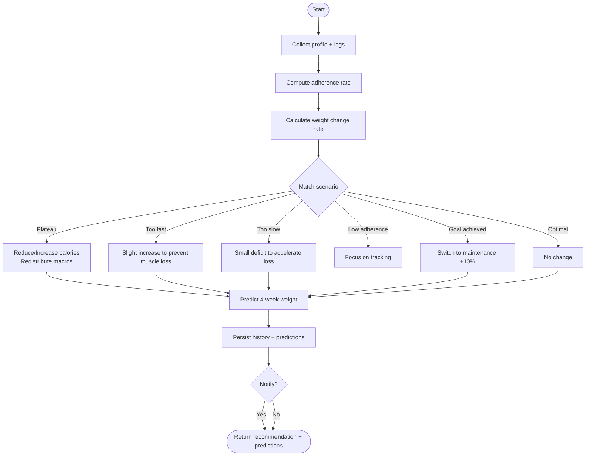
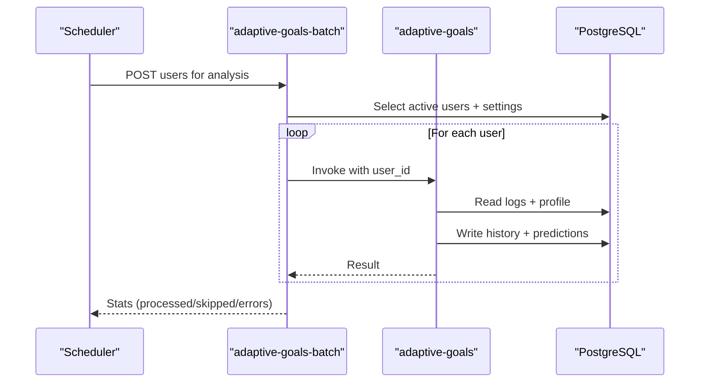
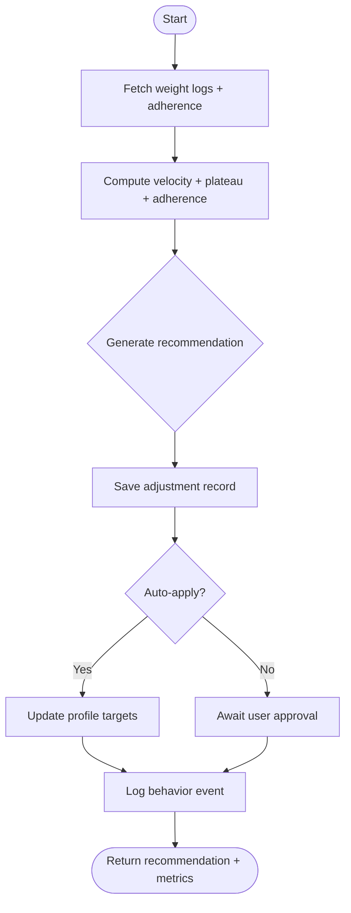
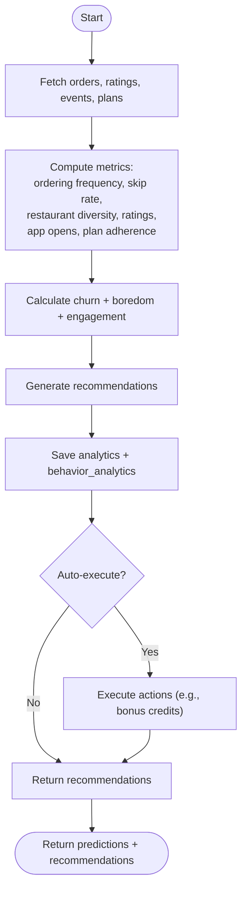
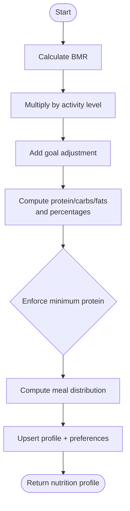
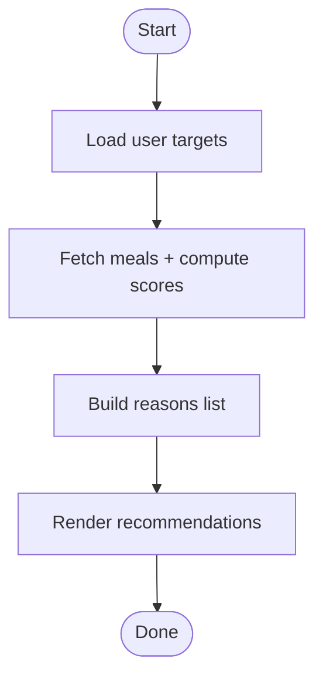
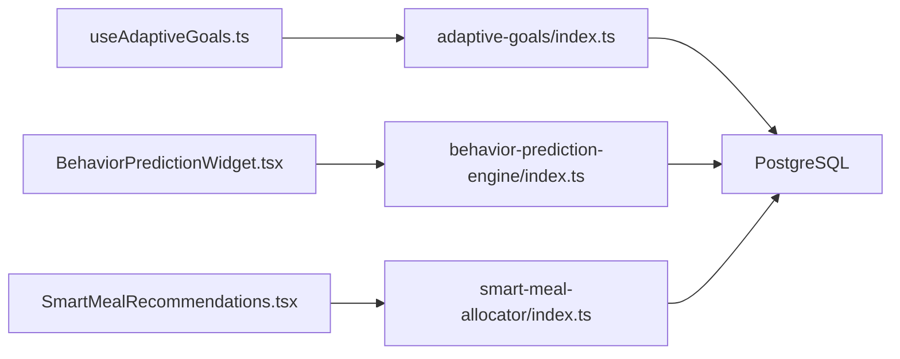

# AI Recommendation Engines

<cite>
**Referenced Files in This Document**
- [ADAPTIVE_GOALS_IMPLEMENTATION_SUMMARY.md](file://ADAPTIVE_GOALS_IMPLEMENTATION_SUMMARY.md)
- [AI_IMPLEMENTATION_SUMMARY.md](file://AI_IMPLEMENTATION_SUMMARY.md)
- [supabase/functions/adaptive-goals/index.ts](file://supabase/functions/adaptive-goals/index.ts)
- [supabase/functions/adaptive-goals-batch/index.ts](file://supabase/functions/adaptive-goals-batch/index.ts)
- [supabase/functions/dynamic-adjustment-engine/index.ts](file://supabase/functions/dynamic-adjustment-engine/index.ts)
- [supabase/functions/behavior-prediction-engine/index.ts](file://supabase/functions/behavior-prediction-engine/index.ts)
- [supabase/functions/nutrition-profile-engine/index.ts](file://supabase/functions/nutrition-profile-engine/index.ts)
- [src/hooks/useAdaptiveGoals.ts](file://src/hooks/useAdaptiveGoals.ts)
- [src/components/BehaviorPredictionWidget.tsx](file://src/components/BehaviorPredictionWidget.tsx)
- [src/pages/recommendations/SmartMealRecommendations.tsx](file://src/pages/recommendations/SmartMealRecommendations.tsx)
- [tests/ai-accuracy.test.ts](file://tests/ai-accuracy.test.ts)
- [implementation_matrix.md](file://implementation_matrix.md)
</cite>

## Table of Contents
1. [Introduction](#introduction)
2. [Project Structure](#project-structure)
3. [Core Components](#core-components)
4. [Architecture Overview](#architecture-overview)
5. [Detailed Component Analysis](#detailed-component-analysis)
6. [Dependency Analysis](#dependency-analysis)
7. [Performance Considerations](#performance-considerations)
8. [Troubleshooting Guide](#troubleshooting-guide)
9. [Conclusion](#conclusion)
10. [Appendices](#appendices)

## Introduction
This document explains the AI-powered recommendation engines that power personalized nutrition and engagement recommendations. It covers:
- Adaptive goals engine for personalized nutrition adjustments based on progress
- Batch processing for bulk user analysis
- Dynamic adjustment engine for real-time meal allocation and goal adaptation
- Behavior prediction engine for churn and engagement risk
- Nutrition profile engine for dietary analysis and macro distribution
- Model training, data preprocessing, feature engineering, and evaluation metrics
- Implementation examples, parameter tuning, and frontend integration patterns

## Project Structure
The AI recommendation system is implemented as a layered architecture:
- Layer 1: Nutrition Profile Engine computes baseline targets
- Layer 2: Smart Meal Allocator generates compliant meal plans
- Layer 3: Dynamic Adjustment Engine adapts targets based on progress
- Layer 4: Behavior Prediction Engine predicts churn and engagement
- Layer 5: Restaurant Intelligence Engine balances demand and capacity

**Diagram sources**
- [supabase/functions/nutrition-profile-engine/index.ts:1-338](file://supabase/functions/nutrition-profile-engine/index.ts#L1-L338)
- [supabase/functions/dynamic-adjustment-engine/index.ts:1-455](file://supabase/functions/dynamic-adjustment-engine/index.ts#L1-L455)
- [supabase/functions/adaptive-goals/index.ts:1-522](file://supabase/functions/adaptive-goals/index.ts#L1-L522)
- [supabase/functions/adaptive-goals-batch/index.ts:1-136](file://supabase/functions/adaptive-goals-batch/index.ts#L1-L136)
- [supabase/functions/behavior-prediction-engine/index.ts:1-513](file://supabase/functions/behavior-prediction-engine/index.ts#L1-L513)
- [src/hooks/useAdaptiveGoals.ts:300-345](file://src/hooks/useAdaptiveGoals.ts#L300-L345)
- [src/components/BehaviorPredictionWidget.tsx:1-159](file://src/components/BehaviorPredictionWidget.tsx#L1-L159)
- [src/pages/recommendations/SmartMealRecommendations.tsx:76-113](file://src/pages/recommendations/SmartMealRecommendations.tsx#L76-L113)

**Section sources**
- [AI_IMPLEMENTATION_SUMMARY.md:124-144](file://AI_IMPLEMENTATION_SUMMARY.md#L124-L144)

## Core Components
- Adaptive Goals Engine: Rule-based personalization with confidence thresholds, plateau detection, and 4-week predictions
- Adaptive Goals Batch: Weekly batch processing of users respecting frequency settings
- Dynamic Adjustment Engine: Evidence-based adjustments for weight loss/gain, adherence, and plateau
- Behavior Prediction Engine: Churn and boredom risk scoring with retention recommendations
- Nutrition Profile Engine: Baseline BMR/TDEE/macro calculation with minimum protein enforcement
- Smart Meal Recommendations: Macro scoring and recommendation generation

**Section sources**
- [ADAPTIVE_GOALS_IMPLEMENTATION_SUMMARY.md:35-104](file://ADAPTIVE_GOALS_IMPLEMENTATION_SUMMARY.md#L35-L104)
- [AI_IMPLEMENTATION_SUMMARY.md:24-107](file://AI_IMPLEMENTATION_SUMMARY.md#L24-L107)

## Architecture Overview
The system integrates frontend hooks and widgets with Supabase Edge Functions. Data flows from user profiles, logs, and events into engines that compute recommendations and persist outcomes.

**Diagram sources**
- [supabase/functions/adaptive-goals/index.ts:316-521](file://supabase/functions/adaptive-goals/index.ts#L316-L521)
- [src/hooks/useAdaptiveGoals.ts:327-345](file://src/hooks/useAdaptiveGoals.ts#L327-L345)

## Detailed Component Analysis

### Adaptive Goals Engine
The adaptive-goals function performs:
- Data collection: profile, recent weight and calorie logs, weekly adherence
- Progress analysis: weight change rate, plateau detection, adherence rate
- Scenario-based recommendations: plateau, rapid loss/gain, low adherence, goal achieved, optimal progress
- Prediction: 4-week weight forecast with confidence bands
- Persistence: adjustment history, predictions, and UI flags

**Diagram sources**
- [supabase/functions/adaptive-goals/index.ts:52-227](file://supabase/functions/adaptive-goals/index.ts#L52-L227)
- [supabase/functions/adaptive-goals/index.ts:229-262](file://supabase/functions/adaptive-goals/index.ts#L229-L262)
- [supabase/functions/adaptive-goals/index.ts:417-490](file://supabase/functions/adaptive-goals/index.ts#L417-L490)

**Section sources**
- [supabase/functions/adaptive-goals/index.ts:52-227](file://supabase/functions/adaptive-goals/index.ts#L52-L227)
- [supabase/functions/adaptive-goals/index.ts:229-262](file://supabase/functions/adaptive-goals/index.ts#L229-L262)
- [supabase/functions/adaptive-goals/index.ts:417-490](file://supabase/functions/adaptive-goals/index.ts#L417-L490)

### Adaptive Goals Batch
The adaptive-goals-batch function:
- Iterates active users with onboarding completed
- Checks adaptive goals settings and last adjustment date against frequency
- Invokes adaptive-goals per user and aggregates statistics

**Diagram sources**
- [supabase/functions/adaptive-goals-batch/index.ts:19-127](file://supabase/functions/adaptive-goals-batch/index.ts#L19-L127)
- [supabase/functions/adaptive-goals/index.ts:316-521](file://supabase/functions/adaptive-goals/index.ts#L316-L521)

**Section sources**
- [supabase/functions/adaptive-goals-batch/index.ts:19-127](file://supabase/functions/adaptive-goals-batch/index.ts#L19-L127)

### Dynamic Adjustment Engine
The dynamic-adjustment-engine:
- Calculates weight velocity and detects plateaus
- Computes average adherence over recent weeks
- Generates recommendations with confidence scores
- Optionally auto-applies adjustments to user targets

**Diagram sources**
- [supabase/functions/dynamic-adjustment-engine/index.ts:40-240](file://supabase/functions/dynamic-adjustment-engine/index.ts#L40-L240)
- [supabase/functions/dynamic-adjustment-engine/index.ts:242-273](file://supabase/functions/dynamic-adjustment-engine/index.ts#L242-L273)
- [supabase/functions/dynamic-adjustment-engine/index.ts:275-454](file://supabase/functions/dynamic-adjustment-engine/index.ts#L275-L454)

**Section sources**
- [supabase/functions/dynamic-adjustment-engine/index.ts:40-240](file://supabase/functions/dynamic-adjustment-engine/index.ts#L40-L240)
- [supabase/functions/dynamic-adjustment-engine/index.ts:242-273](file://supabase/functions/dynamic-adjustment-engine/index.ts#L242-L273)
- [supabase/functions/dynamic-adjustment-engine/index.ts:275-454](file://supabase/functions/dynamic-adjustment-engine/index.ts#L275-L454)

### Behavior Prediction Engine
The behavior-prediction-engine:
- Scores churn risk, boredom risk, and engagement
- Generates retention recommendations (priority levels)
- Can auto-execute actions (e.g., bonus credits) when configured

**Diagram sources**
- [supabase/functions/behavior-prediction-engine/index.ts:41-104](file://supabase/functions/behavior-prediction-engine/index.ts#L41-L104)
- [supabase/functions/behavior-prediction-engine/index.ts:144-231](file://supabase/functions/behavior-prediction-engine/index.ts#L144-L231)
- [supabase/functions/behavior-prediction-engine/index.ts:306-512](file://supabase/functions/behavior-prediction-engine/index.ts#L306-L512)

**Section sources**
- [supabase/functions/behavior-prediction-engine/index.ts:41-104](file://supabase/functions/behavior-prediction-engine/index.ts#L41-L104)
- [supabase/functions/behavior-prediction-engine/index.ts:144-231](file://supabase/functions/behavior-prediction-engine/index.ts#L144-L231)
- [supabase/functions/behavior-prediction-engine/index.ts:306-512](file://supabase/functions/behavior-prediction-engine/index.ts#L306-L512)

### Nutrition Profile Engine
The nutrition-profile-engine:
- Computes BMR via Mifflin-St Jeor
- Calculates TDEE using activity multipliers
- Derives target calories per goal (deficit/surplus/maintenance)
- Distributes macros with minimum protein enforcement
- Stores profile and preferences in database

**Diagram sources**
- [supabase/functions/nutrition-profile-engine/index.ts:47-94](file://supabase/functions/nutrition-profile-engine/index.ts#L47-L94)
- [supabase/functions/nutrition-profile-engine/index.ts:96-149](file://supabase/functions/nutrition-profile-engine/index.ts#L96-L149)
- [supabase/functions/nutrition-profile-engine/index.ts:177-197](file://supabase/functions/nutrition-profile-engine/index.ts#L177-L197)
- [supabase/functions/nutrition-profile-engine/index.ts:199-337](file://supabase/functions/nutrition-profile-engine/index.ts#L199-L337)

**Section sources**
- [supabase/functions/nutrition-profile-engine/index.ts:47-94](file://supabase/functions/nutrition-profile-engine/index.ts#L47-L94)
- [supabase/functions/nutrition-profile-engine/index.ts:96-149](file://supabase/functions/nutrition-profile-engine/index.ts#L96-L149)
- [supabase/functions/nutrition-profile-engine/index.ts:177-197](file://supabase/functions/nutrition-profile-engine/index.ts#L177-L197)
- [supabase/functions/nutrition-profile-engine/index.ts:199-337](file://supabase/functions/nutrition-profile-engine/index.ts#L199-L337)

### Smart Meal Recommendations
The SmartMealRecommendations page:
- Scores meals against user targets (calories, protein, macro balance)
- Provides reasons for scores
- Integrates with Supabase for user profile and recommendations

**Diagram sources**
- [src/pages/recommendations/SmartMealRecommendations.tsx:76-113](file://src/pages/recommendations/SmartMealRecommendations.tsx#L76-L113)

**Section sources**
- [src/pages/recommendations/SmartMealRecommendations.tsx:76-113](file://src/pages/recommendations/SmartMealRecommendations.tsx#L76-L113)

## Dependency Analysis
- Frontend hooks depend on Supabase Edge Functions for recommendations
- Adaptive goals depends on progress logs and adherence tables
- Dynamic adjustment depends on weight logs and weekly adherence
- Behavior prediction depends on orders, ratings, behavior events, and weekly plans
- Nutrition profile depends on user biometrics and preferences

**Diagram sources**
- [src/hooks/useAdaptiveGoals.ts:327-345](file://src/hooks/useAdaptiveGoals.ts#L327-L345)
- [src/components/BehaviorPredictionWidget.tsx:1-159](file://src/components/BehaviorPredictionWidget.tsx#L1-L159)
- [supabase/functions/adaptive-goals/index.ts:316-521](file://supabase/functions/adaptive-goals/index.ts#L316-L521)
- [supabase/functions/behavior-prediction-engine/index.ts:306-512](file://supabase/functions/behavior-prediction-engine/index.ts#L306-L512)

**Section sources**
- [src/hooks/useAdaptiveGoals.ts:300-345](file://src/hooks/useAdaptiveGoals.ts#L300-L345)
- [src/components/BehaviorPredictionWidget.tsx:1-159](file://src/components/BehaviorPredictionWidget.tsx#L1-L159)

## Performance Considerations
- Edge Functions should remain lightweight; offload heavy computations to batch jobs
- Use targeted queries with date filters to limit dataset sizes
- Cache frequently accessed user settings and preferences
- Monitor function execution time and optimize hot paths
- Tests demonstrate performance targets for profile calculation and plan generation

**Section sources**
- [tests/ai-accuracy.test.ts:336-371](file://tests/ai-accuracy.test.ts#L336-L371)

## Troubleshooting Guide
Common issues and resolutions:
- Function not deployed: Frontend hook checks availability and displays a message to deploy edge functions
- Missing user profile or settings: Functions validate presence and return appropriate errors
- Rate limiting: Batch function includes small delays between requests
- Data quality: Engines include guards (e.g., minimum adherence, sufficient logs) before generating recommendations

**Section sources**
- [src/hooks/useAdaptiveGoals.ts:327-345](file://src/hooks/useAdaptiveGoals.ts#L327-L345)
- [supabase/functions/adaptive-goals/index.ts:330-352](file://supabase/functions/adaptive-goals/index.ts#L330-L352)
- [supabase/functions/adaptive-goals-batch/index.ts:110-116](file://supabase/functions/adaptive-goals-batch/index.ts#L110-L116)

## Conclusion
The AI recommendation engines form a robust, layered system that personalizes nutrition targets, predicts behavior risks, and supports real-time adjustments. The adaptive-goals engine provides confidence-weighted recommendations with 4-week predictions, while the behavior engine offers proactive retention actions. Together with the nutrition profile and smart meal allocator, the platform delivers a scalable, data-driven recommendation pipeline.

## Appendices

### Model Training Procedures and Evaluation
- Current implementation uses rule-based engines with weighted scoring
- Future roadmap includes replacing rule-based churn prediction with trained models (XGBoost/Random Forest) and adding model training pipelines and inference endpoints

**Section sources**
- [implementation_matrix.md:544-567](file://implementation_matrix.md#L544-L567)

### Data Preprocessing and Feature Engineering
- Adaptive goals: collects weight logs, calorie logs, adherence rates, and profile data
- Dynamic adjustment: calculates velocity and plateau indicators from weight logs and adherence
- Behavior prediction: aggregates orders, ratings, events, and plan acceptance to derive risk scores
- Nutrition profile: uses biometrics and activity level to compute BMR/TDEE and macro targets

**Section sources**
- [supabase/functions/adaptive-goals/index.ts:368-415](file://supabase/functions/adaptive-goals/index.ts#L368-L415)
- [supabase/functions/dynamic-adjustment-engine/index.ts:40-83](file://supabase/functions/dynamic-adjustment-engine/index.ts#L40-L83)
- [supabase/functions/behavior-prediction-engine/index.ts:380-431](file://supabase/functions/behavior-prediction-engine/index.ts#L380-L431)
- [supabase/functions/nutrition-profile-engine/index.ts:47-94](file://supabase/functions/nutrition-profile-engine/index.ts#L47-L94)

### Parameter Tuning Guidelines
- Adaptive goals: adjust confidence thresholds and calorie deltas per scenario; enforce minimum/maximum calorie bounds
- Dynamic adjustment: tune velocity thresholds for plateau detection and adherence cutoffs for lifestyle coaching
- Behavior prediction: weight factors for ordering frequency, skip rate, diversity, and app opens; adjust recommendation priorities
- Nutrition profile: adjust macro percentages per goal and minimum protein enforcement

**Section sources**
- [supabase/functions/adaptive-goals/index.ts:83-226](file://supabase/functions/adaptive-goals/index.ts#L83-L226)
- [supabase/functions/dynamic-adjustment-engine/index.ts:105-237](file://supabase/functions/dynamic-adjustment-engine/index.ts#L105-L237)
- [supabase/functions/behavior-prediction-engine/index.ts:42-104](file://supabase/functions/behavior-prediction-engine/index.ts#L42-L104)
- [supabase/functions/nutrition-profile-engine/index.ts:96-149](file://supabase/functions/nutrition-profile-engine/index.ts#L96-L149)

### Integration Patterns with Frontend
- useAdaptiveGoals hook manages fetching, applying, dismissing, and updating settings for adaptive goals
- BehaviorPredictionWidget subscribes to real-time predictions and renders actionable recommendations
- SmartMealRecommendations integrates macro scoring with user targets to surface personalized suggestions

**Section sources**
- [src/hooks/useAdaptiveGoals.ts:300-345](file://src/hooks/useAdaptiveGoals.ts#L300-L345)
- [src/components/BehaviorPredictionWidget.tsx:1-159](file://src/components/BehaviorPredictionWidget.tsx#L1-L159)
- [src/pages/recommendations/SmartMealRecommendations.tsx:76-113](file://src/pages/recommendations/SmartMealRecommendations.tsx#L76-L113)