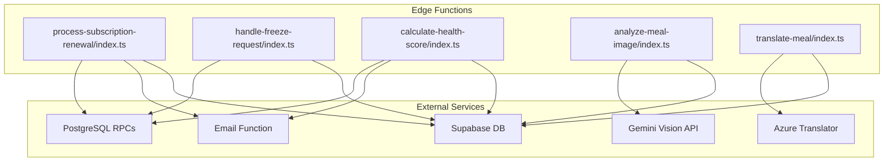
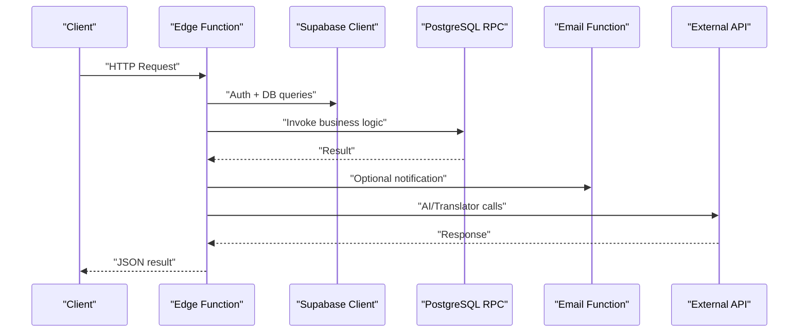
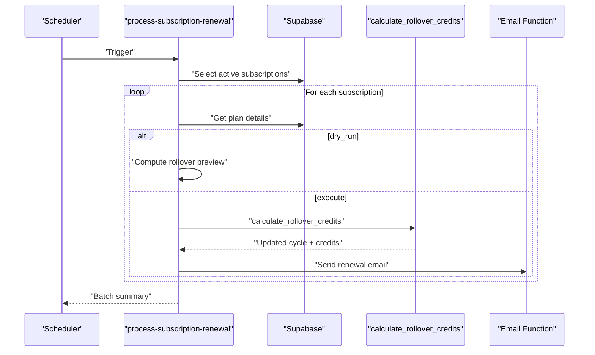
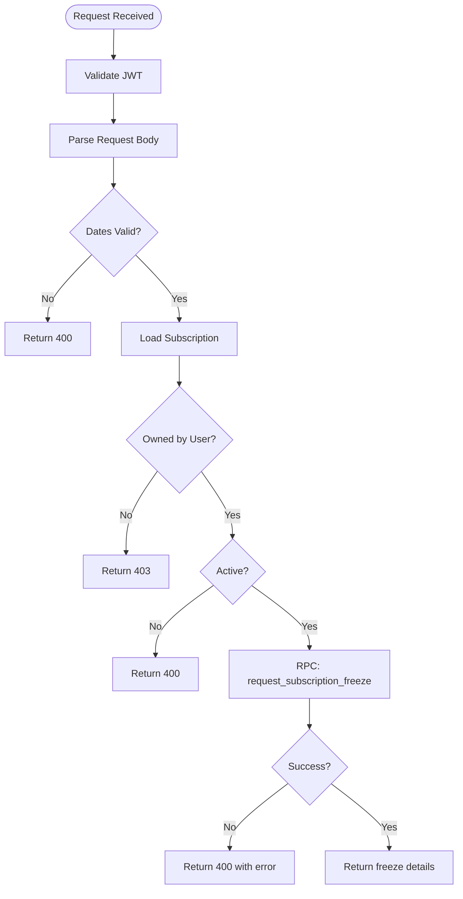
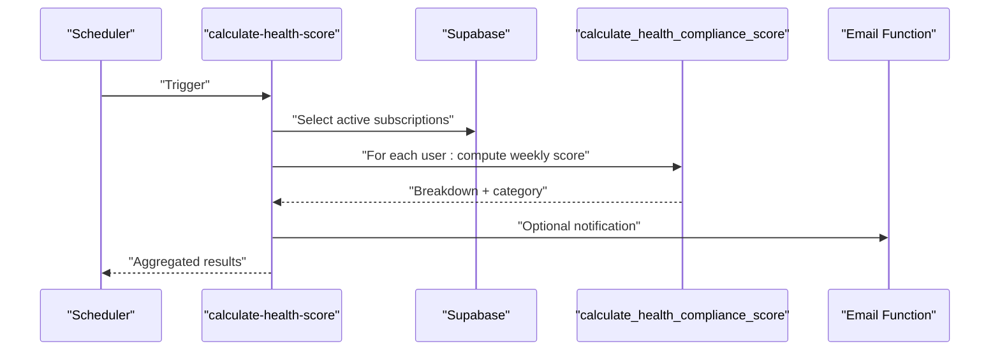
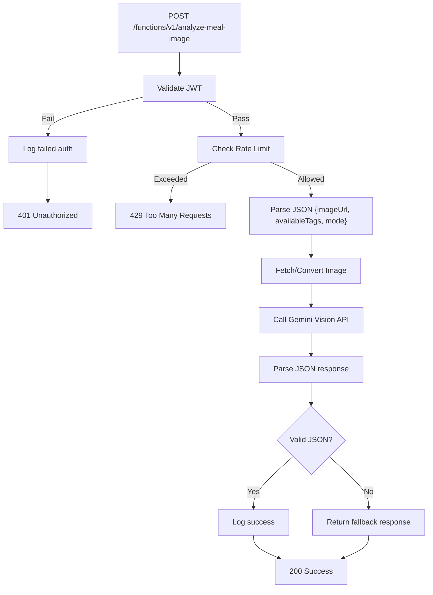
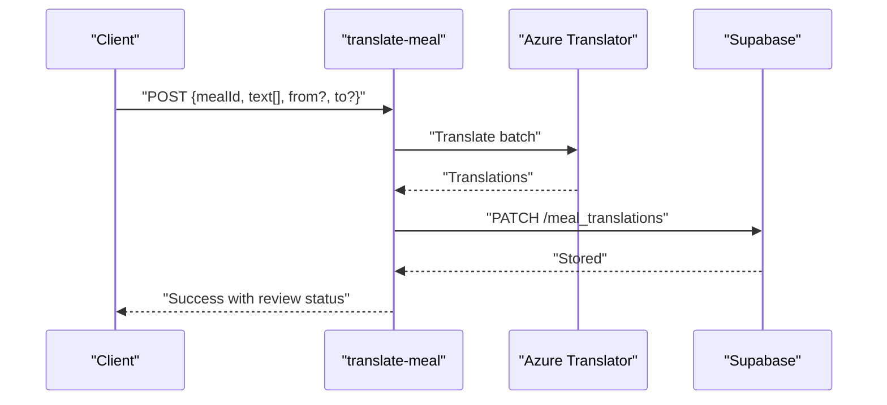
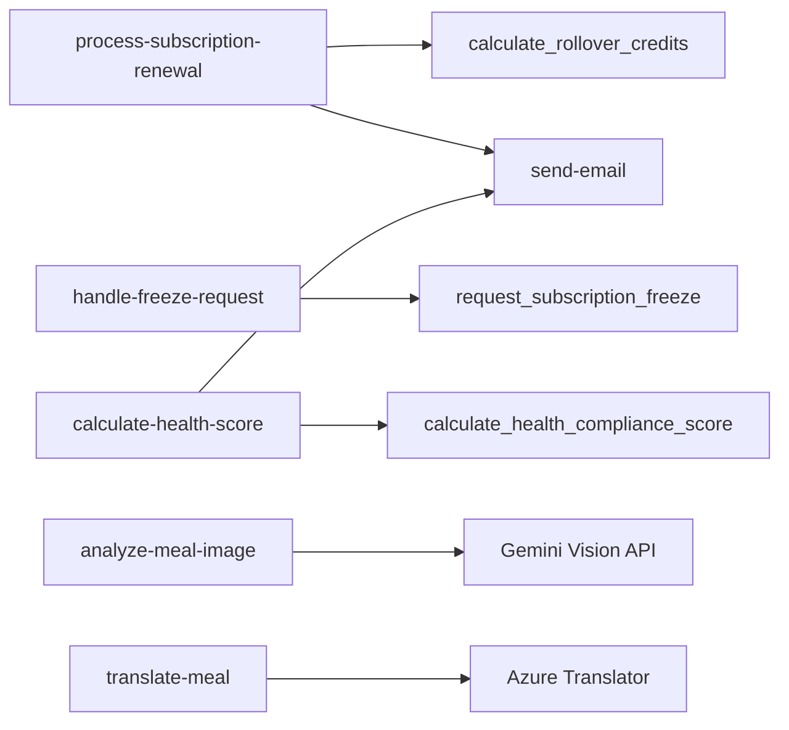

# Business Logic Functions

<cite>
**Referenced Files in This Document**
- [process-subscription-renewal/index.ts](file://supabase/functions/process-subscription-renewal/index.ts)
- [handle-freeze-request/index.ts](file://supabase/functions/handle-freeze-request/index.ts)
- [calculate-health-score/index.ts](file://supabase/functions/calculate-health-score/index.ts)
- [analyze-meal-image/index.ts](file://supabase/functions/analyze-meal-image/index.ts)
- [translate-meal/index.ts](file://supabase/functions/translate-meal/index.ts)
</cite>

## Table of Contents
1. [Introduction](#introduction)
2. [Project Structure](#project-structure)
3. [Core Components](#core-components)
4. [Architecture Overview](#architecture-overview)
5. [Detailed Component Analysis](#detailed-component-analysis)
6. [Dependency Analysis](#dependency-analysis)
7. [Performance Considerations](#performance-considerations)
8. [Troubleshooting Guide](#troubleshooting-guide)
9. [Conclusion](#conclusion)

## Introduction
This document details the core business logic functions that power critical platform operations. It covers:
- Process-subscription-renewal: renewal scheduling, rollover credit calculations, and lifecycle updates
- Handle-freeze-request: freeze request validation, credit rollover adjustments, and approval workflows
- Calculate-health-score: weekly health compliance scoring, category assignment, and trend reporting
- Analyze-meal-image: automated meal image processing and nutritional analysis via AI
- Translate-meal: multilingual meal data management using Azure Translator

It also addresses transaction handling, data consistency guarantees, error recovery mechanisms, integration examples, and monitoring approaches for business-critical operations.

## Project Structure
The business logic resides in Supabase Edge Functions under the functions directory. Each function encapsulates a focused business operation with explicit input validation, authorization checks, and integration with backend services (database RPCs, external APIs, and email functions).

**Diagram sources**
- [process-subscription-renewal/index.ts:1-278](file://supabase/functions/process-subscription-renewal/index.ts#L1-L278)
- [handle-freeze-request/index.ts:1-160](file://supabase/functions/handle-freeze-request/index.ts#L1-L160)
- [calculate-health-score/index.ts:1-229](file://supabase/functions/calculate-health-score/index.ts#L1-L229)
- [analyze-meal-image/index.ts:1-368](file://supabase/functions/analyze-meal-image/index.ts#L1-L368)
- [translate-meal/index.ts:1-279](file://supabase/functions/translate-meal/index.ts#L1-L279)

**Section sources**
- [process-subscription-renewal/index.ts:1-278](file://supabase/functions/process-subscription-renewal/index.ts#L1-L278)
- [handle-freeze-request/index.ts:1-160](file://supabase/functions/handle-freeze-request/index.ts#L1-L160)
- [calculate-health-score/index.ts:1-229](file://supabase/functions/calculate-health-score/index.ts#L1-L229)
- [analyze-meal-image/index.ts:1-368](file://supabase/functions/analyze-meal-image/index.ts#L1-L368)
- [translate-meal/index.ts:1-279](file://supabase/functions/translate-meal/index.ts#L1-L279)

## Core Components
This section outlines the primary business functions and their responsibilities.

- Process-subscription-renewal
  - Purpose: Automates subscription renewal, computes rollover credits, and updates billing cycles
  - Key capabilities: Dry-run previews, batch processing, admin overrides, and user notifications
- Handle-freeze-request
  - Purpose: Validates and processes subscription freeze requests with overlap checks and freeze-day accounting
  - Key capabilities: Ownership verification, date validation, RPC-driven persistence, and error reporting
- Calculate-health-score
  - Purpose: Computes weekly health compliance scores and categorizes performance
  - Key capabilities: Weekly aggregation, category thresholds, breakdown metrics, and optional notifications
- Analyze-meal-image
  - Purpose: Performs automated meal analysis and nutritional estimation from images
  - Key capabilities: Authentication, rate limiting, fallback handling, and structured JSON responses
- Translate-meal
  - Purpose: Translates meal metadata into Arabic using Azure Translator and persists results
  - Key capabilities: Batch text translation, database storage, character counting, and review status

**Section sources**
- [process-subscription-renewal/index.ts:1-278](file://supabase/functions/process-subscription-renewal/index.ts#L1-L278)
- [handle-freeze-request/index.ts:1-160](file://supabase/functions/handle-freeze-request/index.ts#L1-L160)
- [calculate-health-score/index.ts:1-229](file://supabase/functions/calculate-health-score/index.ts#L1-L229)
- [analyze-meal-image/index.ts:1-368](file://supabase/functions/analyze-meal-image/index.ts#L1-L368)
- [translate-meal/index.ts:1-279](file://supabase/functions/translate-meal/index.ts#L1-L279)

## Architecture Overview
The functions integrate with Supabase for authentication, database access, and outbound function invocation. They rely on PostgreSQL RPCs for complex business logic and external services for AI and translation.

**Diagram sources**
- [process-subscription-renewal/index.ts:30-277](file://supabase/functions/process-subscription-renewal/index.ts#L30-L277)
- [calculate-health-score/index.ts:32-218](file://supabase/functions/calculate-health-score/index.ts#L32-L218)
- [analyze-meal-image/index.ts:143-344](file://supabase/functions/analyze-meal-image/index.ts#L143-L344)
- [translate-meal/index.ts:155-263](file://supabase/functions/translate-meal/index.ts#L155-L263)

## Detailed Component Analysis

### Process-Subscription-Renewal
Responsibilities:
- Determine subscriptions due for renewal (cron-triggered daily)
- Compute rollover credits based on unused credits and plan limits
- Update billing cycle dates and freeze-day adjustments
- Optionally send renewal notifications

Processing logic:
- Authentication and authorization checks (admin override allowed)
- Query subscriptions with optional filters (subscription/user)
- For each subscription:
  - Retrieve plan details
  - Dry-run preview or execute via RPC
  - Persist results and notify user on success

**Diagram sources**
- [process-subscription-renewal/index.ts:96-241](file://supabase/functions/process-subscription-renewal/index.ts#L96-L241)

Operational notes:
- Supports dry-run for previews
- Enforces ownership for non-admin requests
- Uses RPC for deterministic credit calculations
- Emits structured results with success/failure counts

**Section sources**
- [process-subscription-renewal/index.ts:13-28](file://supabase/functions/process-subscription-renewal/index.ts#L13-L28)
- [process-subscription-renewal/index.ts:52-94](file://supabase/functions/process-subscription-renewal/index.ts#L52-L94)
- [process-subscription-renewal/index.ts:142-241](file://supabase/functions/process-subscription-renewal/index.ts#L142-L241)

### Handle-Freeze-Request
Responsibilities:
- Validate freeze request parameters and dates
- Confirm subscription ownership and active status
- Invoke database RPC to apply freeze with overlap checks
- Return freeze details and remaining days in the cycle

Processing logic:
- JWT validation and user lookup
- Input validation (required fields, date range)
- Subscription ownership and status checks
- RPC invocation for freeze application
- Structured success/error response

**Diagram sources**
- [handle-freeze-request/index.ts:18-151](file://supabase/functions/handle-freeze-request/index.ts#L18-L151)

**Section sources**
- [handle-freeze-request/index.ts:12-16](file://supabase/functions/handle-freeze-request/index.ts#L12-L16)
- [handle-freeze-request/index.ts:30-103](file://supabase/functions/handle-freeze-request/index.ts#L30-L103)
- [handle-freeze-request/index.ts:105-131](file://supabase/functions/handle-freeze-request/index.ts#L105-L131)

### Calculate-Health-Score
Responsibilities:
- Compute weekly health compliance score for active users
- Aggregate metrics for macro adherence, meal consistency, weight logging, and protein accuracy
- Assign category (green/orange/red) and optionally notify users

Processing logic:
- Optional JWT-based permission checks (admin override)
- Select active subscriptions to derive user list
- For each user, invoke RPC to compute score for the target week
- Optionally send email notification based on user preferences

**Diagram sources**
- [calculate-health-score/index.ts:90-194](file://supabase/functions/calculate-health-score/index.ts#L90-L194)

**Section sources**
- [calculate-health-score/index.ts:13-30](file://supabase/functions/calculate-health-score/index.ts#L13-L30)
- [calculate-health-score/index.ts:54-88](file://supabase/functions/calculate-health-score/index.ts#L54-L88)
- [calculate-health-score/index.ts:124-194](file://supabase/functions/calculate-health-score/index.ts#L124-L194)

### Analyze-Meal-Image
Responsibilities:
- Authenticate callers via JWT
- Enforce rate limits per user per hour
- Fetch and convert images (remote URL or base64 data URI)
- Call Gemini Vision API for nutrition analysis
- Return structured results or fallback responses

Processing logic:
- Authentication and audit logging
- Rate limit enforcement using DB logs
- Image fetching and MIME detection
- Prompt construction for quick scan vs detailed analysis
- JSON parsing and response shaping

**Diagram sources**
- [analyze-meal-image/index.ts:143-344](file://supabase/functions/analyze-meal-image/index.ts#L143-L344)

**Section sources**
- [analyze-meal-image/index.ts:13-55](file://supabase/functions/analyze-meal-image/index.ts#L13-L55)
- [analyze-meal-image/index.ts:105-141](file://supabase/functions/analyze-meal-image/index.ts#L105-L141)
- [analyze-meal-image/index.ts:194-336](file://supabase/functions/analyze-meal-image/index.ts#L194-L336)

### Translate-Meal
Responsibilities:
- Translate meal name and description from English to Arabic using Azure Translator
- Persist translations into the database with review status and metadata
- Track characters translated for monitoring

Processing logic:
- Validate environment variables and request payload
- Call Azure Translator API with batch text
- Patch database record with translated content and flags
- Return success with review status and character counts

**Diagram sources**
- [translate-meal/index.ts:155-263](file://supabase/functions/translate-meal/index.ts#L155-L263)

**Section sources**
- [translate-meal/index.ts:16-31](file://supabase/functions/translate-meal/index.ts#L16-L31)
- [translate-meal/index.ts:177-221](file://supabase/functions/translate-meal/index.ts#L177-L221)
- [translate-meal/index.ts:213-221](file://supabase/functions/translate-meal/index.ts#L213-L221)

## Dependency Analysis
The functions depend on:
- Supabase client libraries for authentication and database access
- PostgreSQL RPCs for complex business logic (rollover calculations, freeze requests, health scoring)
- External services (Gemini Vision API, Azure Translator)
- Email function for notifications

**Diagram sources**
- [process-subscription-renewal/index.ts:194-240](file://supabase/functions/process-subscription-renewal/index.ts#L194-L240)
- [handle-freeze-request/index.ts:105-121](file://supabase/functions/handle-freeze-request/index.ts#L105-L121)
- [calculate-health-score/index.ts:124-186](file://supabase/functions/calculate-health-score/index.ts#L124-L186)
- [analyze-meal-image/index.ts:254-281](file://supabase/functions/analyze-meal-image/index.ts#L254-L281)
- [translate-meal/index.ts:56-87](file://supabase/functions/translate-meal/index.ts#L56-L87)

**Section sources**
- [process-subscription-renewal/index.ts:38-47](file://supabase/functions/process-subscription-renewal/index.ts#L38-L47)
- [handle-freeze-request/index.ts:24-28](file://supabase/functions/handle-freeze-request/index.ts#L24-L28)
- [calculate-health-score/index.ts:40-49](file://supabase/functions/calculate-health-score/index.ts#L40-L49)
- [analyze-meal-image/index.ts:29-37](file://supabase/functions/analyze-meal-image/index.ts#L29-L37)
- [translate-meal/index.ts:6-8](file://supabase/functions/translate-meal/index.ts#L6-L8)

## Performance Considerations
- Batch processing: Renewal and health score functions iterate over collections; ensure efficient queries and minimal per-item overhead
- Rate limiting: The image analyzer enforces per-user hourly limits to prevent abuse and control costs
- External API latency: Vision and translation calls introduce network latency; implement timeouts and fallbacks
- Idempotency: Prefer idempotent operations for retries (e.g., dry-run previews before execution)
- Monitoring: Track function execution times, error rates, and external service availability

## Troubleshooting Guide
Common issues and remedies:
- Authentication failures
  - Verify Authorization header and JWT validity
  - Check service role keys and Supabase configuration
- Permission errors
  - Ensure admin role for privileged operations
  - Validate ownership for user-scoped actions
- External service errors
  - Gemini Vision API: Inspect response status and content; use fallback responses
  - Azure Translator: Confirm API key, region, and endpoint configuration
- Database errors
  - RPC invocations may fail due to constraints; inspect returned error messages
- Logging and auditing
  - Use built-in logging for auth failures and successful operations
  - Monitor DB logs for rate-limit counters and audit trails

**Section sources**
- [process-subscription-renewal/index.ts:52-78](file://supabase/functions/process-subscription-renewal/index.ts#L52-L78)
- [handle-freeze-request/index.ts:30-47](file://supabase/functions/handle-freeze-request/index.ts#L30-L47)
- [calculate-health-score/index.ts:63-88](file://supabase/functions/calculate-health-score/index.ts#L63-L88)
- [analyze-meal-image/index.ts:40-54](file://supabase/functions/analyze-meal-image/index.ts#L40-L54)
- [translate-meal/index.ts:162-175](file://supabase/functions/translate-meal/index.ts#L162-L175)

## Conclusion
These business logic functions form the backbone of subscription lifecycle management, health analytics, AI-powered meal analysis, and multilingual content translation. They emphasize robust authentication, controlled access, deterministic computations via RPCs, and resilient integration with external services. Proper monitoring, rate limiting, and error handling ensure reliability and scalability for production workloads.