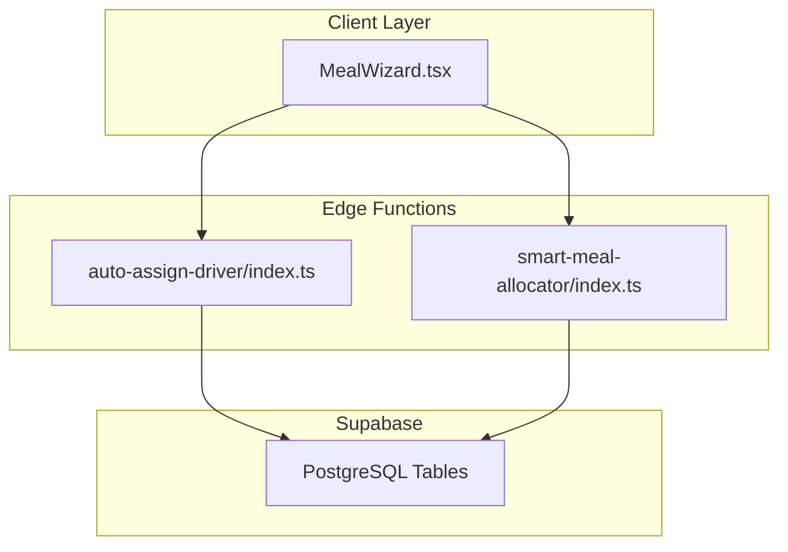
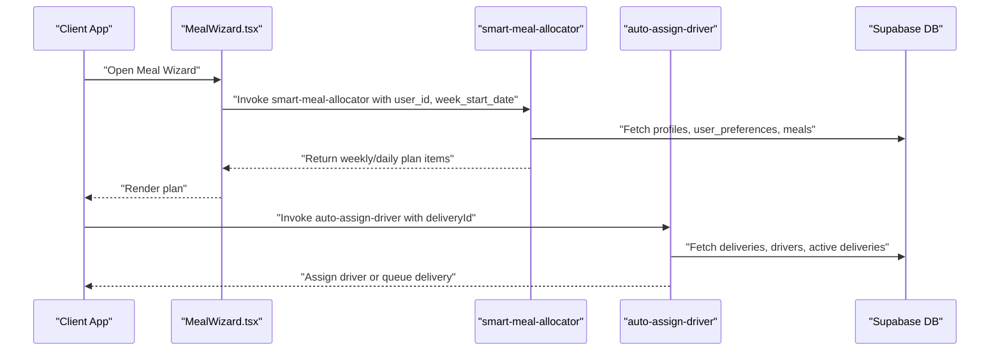
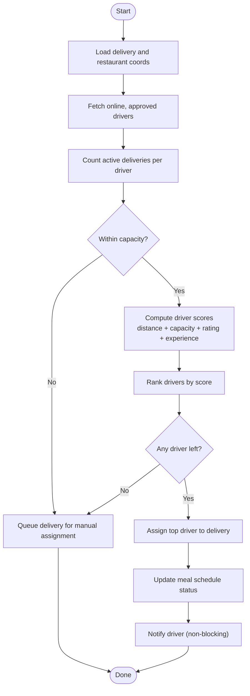
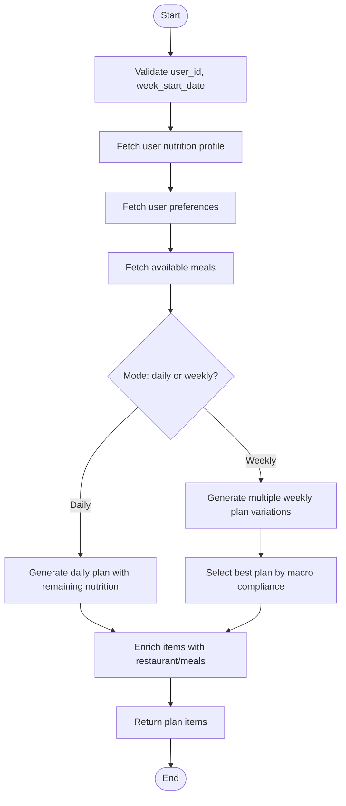
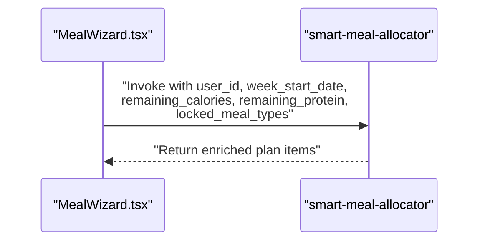
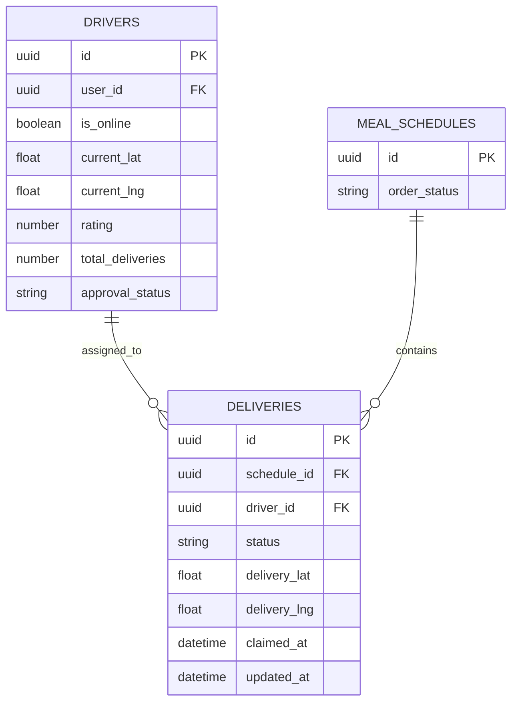

# Driver Allocation Engine

<cite>
**Referenced Files in This Document**
- [auto-assign-driver/index.ts](file://supabase/functions/auto-assign-driver/index.ts)
- [smart-meal-allocator/index.ts](file://supabase/functions/smart-meal-allocator/index.ts)
- [types.ts](file://supabase/types.ts)
- [MealWizard.tsx](file://src/components/MealWizard.tsx)
</cite>

## Table of Contents
1. [Introduction](#introduction)
2. [Project Structure](#project-structure)
3. [Core Components](#core-components)
4. [Architecture Overview](#architecture-overview)
5. [Detailed Component Analysis](#detailed-component-analysis)
6. [Dependency Analysis](#dependency-analysis)
7. [Performance Considerations](#performance-considerations)
8. [Troubleshooting Guide](#troubleshooting-guide)
9. [Conclusion](#conclusion)

## Introduction
This document explains the driver allocation and meal assignment systems powering Nutrio’s delivery and nutrition services. It focuses on:
- The auto-assign-driver edge function: how it matches drivers to orders using distance, availability, capacity, ratings, and experience.
- The smart-meal-allocator edge function: how it generates intelligent weekly and daily meal plans with macro compliance, variety constraints, and preference handling.
- Real-time availability tracking, conflict resolution, and fallback mechanisms.
- Implementation details for location-based routing, surge pricing integration, and driver preference handling.
- Performance optimization techniques and error handling strategies.

## Project Structure
The driver and meal allocation logic lives in Supabase Edge Functions:
- auto-assign-driver: serverless function that selects the best driver for a delivery order.
- smart-meal-allocator: serverless function that builds weekly/daily meal plans aligned with user nutrition targets and preferences.

**Diagram sources**
- [auto-assign-driver/index.ts:289-340](file://supabase/functions/auto-assign-driver/index.ts#L289-L340)
- [smart-meal-allocator/index.ts:480-755](file://supabase/functions/smart-meal-allocator/index.ts#L480-L755)
- [types.ts:230-330](file://supabase/types.ts#L230-L330)

**Section sources**
- [auto-assign-driver/index.ts:1-340](file://supabase/functions/auto-assign-driver/index.ts#L1-L340)
- [smart-meal-allocator/index.ts:1-755](file://supabase/functions/smart-meal-allocator/index.ts#L1-L755)
- [types.ts:230-330](file://supabase/types.ts#L230-L330)

## Core Components
- Driver Allocation Engine (auto-assign-driver):
  - Fetches delivery details and restaurant coordinates.
  - Filters online, approved drivers.
  - Computes per-driver scores based on proximity, capacity, rating, and experience.
  - Assigns the highest-scoring driver to the delivery and updates related records.
  - Sends a non-blocking push notification to the driver.
  - Queues the delivery for manual assignment if no drivers are available or all are at capacity.

- Meal Allocation Engine (smart-meal-allocator):
  - Builds weekly or daily plans aligned with user nutrition targets and preferences.
  - Scores meals by macro match and variety penalties.
  - Enforces constraints like restaurant diversity and meal variety.
  - Returns enriched plan items with restaurant and meal metadata.

**Section sources**
- [auto-assign-driver/index.ts:131-287](file://supabase/functions/auto-assign-driver/index.ts#L131-L287)
- [smart-meal-allocator/index.ts:285-419](file://supabase/functions/smart-meal-allocator/index.ts#L285-L419)

## Architecture Overview
The system integrates client-side UI triggers with Supabase Edge Functions and database-backed entities.

**Diagram sources**
- [MealWizard.tsx:683-706](file://src/components/MealWizard.tsx#L683-L706)
- [smart-meal-allocator/index.ts:480-755](file://supabase/functions/smart-meal-allocator/index.ts#L480-L755)
- [auto-assign-driver/index.ts:289-340](file://supabase/functions/auto-assign-driver/index.ts#L289-L340)

## Detailed Component Analysis

### Driver Allocation Engine (auto-assign-driver)
The auto-assign-driver function orchestrates driver selection and assignment for a given delivery.

Key steps:
- Validate environment and request payload.
- Load delivery details and restaurant coordinates; default to a city center if missing.
- Retrieve online, approved drivers.
- Count active deliveries per driver to enforce capacity limits.
- Compute a composite score per driver using:
  - Exponential decay by pickup distance (Haversine).
  - Available capacity (max orders per driver).
  - Driver rating and total deliveries (experience).
- Select the top-ranked driver and update:
  - delivery record with driver_id, status, timestamps, and assignment metadata.
  - related meal schedule order status.
- Notify the driver via a non-blocking function invocation.
- If no drivers are available or all are at capacity, mark the delivery as pending and queue for manual assignment.

Scoring mechanism:
- Distance score: exponential decay with a 5 km half-life.
- Capacity score: proportion of free slots out of a fixed cap.
- Rating score: scaled by a fixed multiplier.
- Experience bonus: proportional to total deliveries.
- Weighted total score: distance (50%), capacity (30%), rating (15%), experience (5%).

Availability and conflict checks:
- Only considers drivers marked as online and approved.
- Excludes drivers exceeding the maximum concurrent deliveries.
- Prevents reassignment if the delivery is not in pending status.

Fallback and error handling:
- Queues delivery with a note if no drivers are available or all are at capacity.
- Returns structured responses indicating success, queuing, or errors.
- Non-blocking notifications avoid blocking assignment.

Location-based routing and surge:
- Distance calculation uses the Haversine formula for accurate km estimation.
- Surge pricing is not implemented in the current function; integration would require adding a surge multiplier to the scoring weights or distance cost.

Driver preference handling:
- Current scoring does not incorporate explicit driver preferences.
- To add preference handling, extend the scoring function to include factors like cuisine preferences, vehicle type, or route alignment.

**Diagram sources**
- [auto-assign-driver/index.ts:131-287](file://supabase/functions/auto-assign-driver/index.ts#L131-L287)

**Section sources**
- [auto-assign-driver/index.ts:51-97](file://supabase/functions/auto-assign-driver/index.ts#L51-L97)
- [auto-assign-driver/index.ts:131-287](file://supabase/functions/auto-assign-driver/index.ts#L131-L287)

### Meal Allocation Engine (smart-meal-allocator)
The smart-meal-allocator generates weekly or daily meal plans tailored to user nutrition targets and preferences.

Key steps:
- Validate inputs and fetch user nutrition profile and preferences.
- Load available meals with nutritional macros.
- For daily mode (refresh with locked meals):
  - Compute remaining nutrition targets and locked meal types.
  - Generate a single-day plan respecting constraints.
- For weekly mode:
  - Generate multiple plan variations with randomized meals.
  - Select the best plan by macro compliance score.
- Enrich plan items with restaurant and meal metadata.
- Optionally save plan to database (currently disabled due to missing table).

Scoring and constraints:
- Macro match scoring prioritizes calorie and protein targets with balance weighting.
- Variety scoring penalizes repeated restaurants and identical meals.
- Constraints:
  - Max 2 meals per restaurant per plan window.
  - Snacks excluded when daily calorie targets are low.
  - Required meal slots enforced unless locked.

**Diagram sources**
- [smart-meal-allocator/index.ts:480-755](file://supabase/functions/smart-meal-allocator/index.ts#L480-L755)

**Section sources**
- [smart-meal-allocator/index.ts:62-119](file://supabase/functions/smart-meal-allocator/index.ts#L62-L119)
- [smart-meal-allocator/index.ts:162-283](file://supabase/functions/smart-meal-allocator/index.ts#L162-L283)
- [smart-meal-allocator/index.ts:285-419](file://supabase/functions/smart-meal-allocator/index.ts#L285-L419)
- [smart-meal-allocator/index.ts:480-755](file://supabase/functions/smart-meal-allocator/index.ts#L480-L755)

### Client Integration (MealWizard)
The client invokes the smart-meal-allocator with appropriate parameters, including remaining nutrition and locked meal types during daily refresh scenarios.

**Diagram sources**
- [MealWizard.tsx:683-706](file://src/components/MealWizard.tsx#L683-L706)
- [smart-meal-allocator/index.ts:480-755](file://supabase/functions/smart-meal-allocator/index.ts#L480-L755)

**Section sources**
- [MealWizard.tsx:683-706](file://src/components/MealWizard.tsx#L683-L706)

## Dependency Analysis
The driver and meal allocation functions depend on Supabase tables and enums for data integrity and runtime decisions.

**Diagram sources**
- [types.ts:230-330](file://supabase/types.ts#L230-L330)
- [types.ts:529-589](file://supabase/types.ts#L529-L589)

**Section sources**
- [types.ts:230-330](file://supabase/types.ts#L230-L330)
- [types.ts:529-589](file://supabase/types.ts#L529-L589)

## Performance Considerations
- Driver allocation:
  - Distance computation uses vectorized filtering and a single Haversine pass per candidate driver.
  - Limit driver pool by online/approved filters to reduce scoring overhead.
  - Consider caching recent driver locations and active delivery counts to minimize DB queries.
  - Batch assignment requests if multiple deliveries need immediate attention.

- Meal allocation:
  - Shuffle meals slightly to introduce variation without heavy recomputation.
  - Early exit when no valid meals remain for a slot to avoid unnecessary scoring.
  - Memoize macro and variety scores for repeated selections.
  - Defer database writes to a background job if saving plans becomes frequent.

[No sources needed since this section provides general guidance]

## Troubleshooting Guide
Common issues and resolutions:
- No drivers available:
  - The function queues the delivery and sets a note. Confirm driver availability and approval status.
  - Check online status and approval_status fields in the drivers table.

- All drivers at capacity:
  - The function queues the delivery. Review the maximum orders per driver and adjust capacity limits if needed.

- Delivery status mismatch:
  - Assignment only occurs for pending deliveries. Ensure the delivery status is correct before invoking the function.

- Scoring anomalies:
  - Verify driver rating, total_deliveries, and current coordinates.
  - Adjust scoring weights or thresholds if certain drivers are underperforming in assignments.

- Notification failures:
  - Driver notifications are non-blocking. Monitor logs for errors and retry mechanisms if necessary.

**Section sources**
- [auto-assign-driver/index.ts:197-208](file://supabase/functions/auto-assign-driver/index.ts#L197-L208)
- [auto-assign-driver/index.ts:240-251](file://supabase/functions/auto-assign-driver/index.ts#L240-L251)
- [auto-assign-driver/index.ts:268-270](file://supabase/functions/auto-assign-driver/index.ts#L268-L270)

## Conclusion
The driver allocation and meal assignment systems leverage Supabase Edge Functions to deliver scalable, real-time orchestration. The driver allocator balances proximity, capacity, and quality metrics to maximize assignment success, while the meal allocator ensures macro compliance and variety. Future enhancements can integrate surge pricing, expand driver preferences, and optimize performance through caching and batch processing.