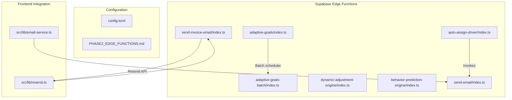
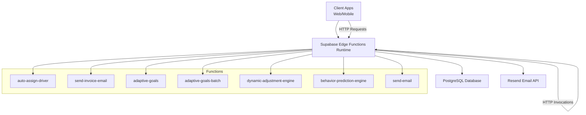
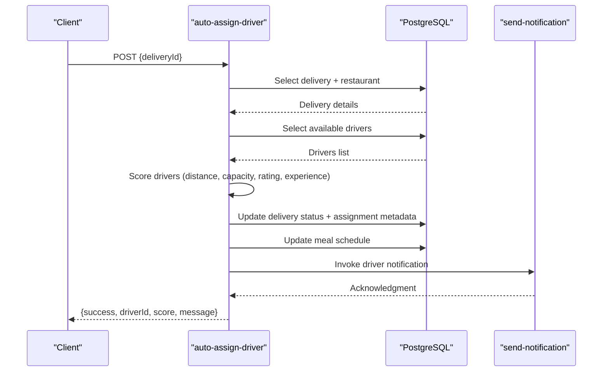
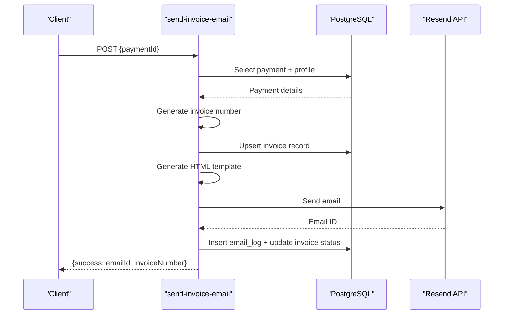
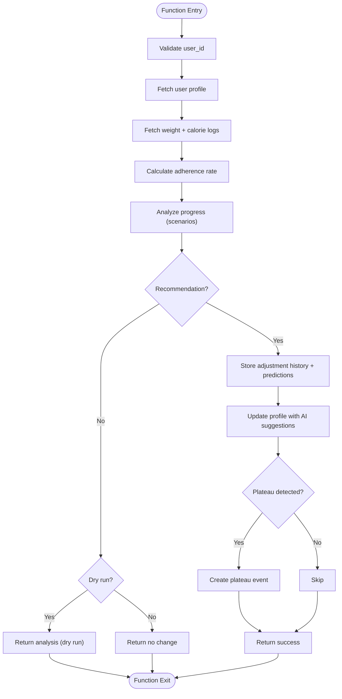
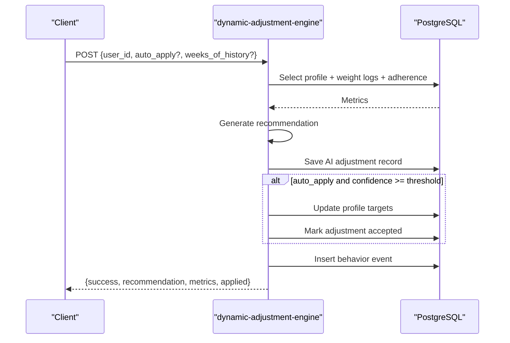
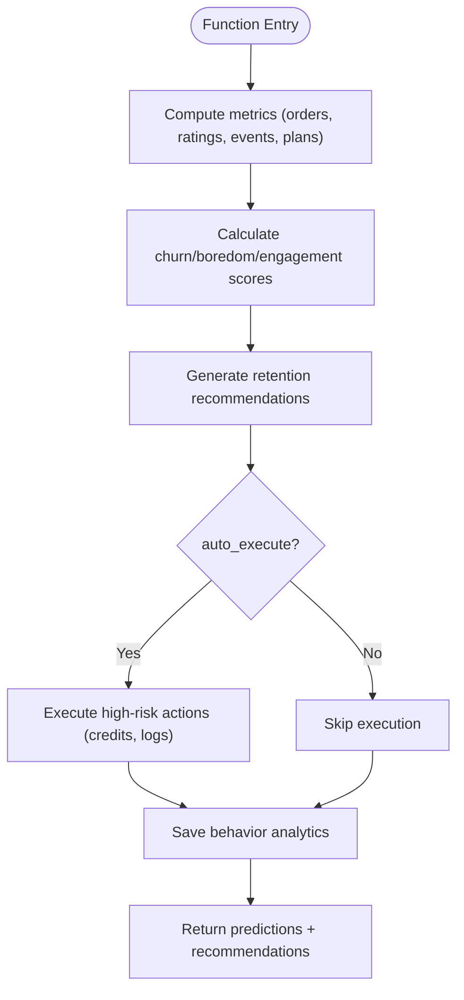
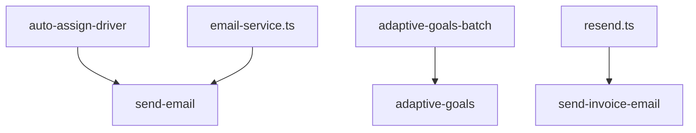

# Edge Functions

<cite>
**Referenced Files in This Document**
- [auto-assign-driver/index.ts](file://supabase/functions/auto-assign-driver/index.ts)
- [send-invoice-email/index.ts](file://supabase/functions/send-invoice-email/index.ts)
- [adaptive-goals/index.ts](file://supabase/functions/adaptive-goals/index.ts)
- [adaptive-goals-batch/index.ts](file://supabase/functions/adaptive-goals-batch/index.ts)
- [dynamic-adjustment-engine/index.ts](file://supabase/functions/dynamic-adjustment-engine/index.ts)
- [behavior-prediction-engine/index.ts](file://supabase/functions/behavior-prediction-engine/index.ts)
- [send-email/index.ts](file://supabase/functions/send-email/index.ts)
- [PHASE2_EDGE_FUNCTIONS.md](file://supabase/functions/PHASE2_EDGE_FUNCTIONS.md)
- [config.toml](file://supabase/config.toml)
- [email-service.ts](file://src/lib/email-service.ts)
- [resend.ts](file://src/lib/resend.ts)
- [edge.spec.ts](file://e2e/system/edge.spec.ts)
- [load-test-config.yml](file://tests/load-test-config.yml)
- [deploy.sh](file://deploy.sh)
- [deploy.bat](file://deploy.bat)
</cite>

## Table of Contents
1. [Introduction](#introduction)
2. [Project Structure](#project-structure)
3. [Core Components](#core-components)
4. [Architecture Overview](#architecture-overview)
5. [Detailed Component Analysis](#detailed-component-analysis)
6. [Dependency Analysis](#dependency-analysis)
7. [Performance Considerations](#performance-considerations)
8. [Troubleshooting Guide](#troubleshooting-guide)
9. [Conclusion](#conclusion)
10. [Appendices](#appendices)

## Introduction
This document provides comprehensive documentation for the Supabase Edge Functions implementation powering the Nutrio Fuel platform. It covers the serverless computing architecture, function deployment patterns, runtime environment, and operational procedures. It documents four primary AI-driven engines: the adaptive-goals engine for AI-powered nutrition recommendations, the dynamic-adjustment-engine for meal allocation, the behavior-prediction-engine for user behavior analysis, and the auto-assign-driver function for intelligent driver assignment. It also details the send-invoice-email function with Resend integration, email template system, and invoice generation. The guide includes function invocation patterns, error handling strategies, environment variable configuration, monitoring approaches, deployment instructions, testing methodologies, and troubleshooting guides for each function.

## Project Structure
The Edge Functions are organized under the Supabase project in the `supabase/functions` directory. Each function resides in its own subdirectory with a single entry point (`index.ts`). Supporting configuration and documentation are located in `supabase/config.toml` and `supabase/functions/PHASE2_EDGE_FUNCTIONS.md`. Client-side email utilities and Resend integration are implemented in the frontend under `src/lib`.

**Diagram sources**
- [auto-assign-driver/index.ts:1-340](file://supabase/functions/auto-assign-driver/index.ts#L1-L340)
- [send-invoice-email/index.ts:1-540](file://supabase/functions/send-invoice-email/index.ts#L1-L540)
- [adaptive-goals/index.ts:1-522](file://supabase/functions/adaptive-goals/index.ts#L1-L522)
- [adaptive-goals-batch/index.ts:1-136](file://supabase/functions/adaptive-goals-batch/index.ts#L1-L136)
- [dynamic-adjustment-engine/index.ts:1-455](file://supabase/functions/dynamic-adjustment-engine/index.ts#L1-L455)
- [behavior-prediction-engine/index.ts:1-513](file://supabase/functions/behavior-prediction-engine/index.ts#L1-L513)
- [send-email/index.ts:1-120](file://supabase/functions/send-email/index.ts#L1-L120)
- [config.toml:1-59](file://supabase/config.toml#L1-L59)
- [PHASE2_EDGE_FUNCTIONS.md:1-411](file://supabase/functions/PHASE2_EDGE_FUNCTIONS.md#L1-L411)
- [email-service.ts:1-173](file://src/lib/email-service.ts#L1-L173)
- [resend.ts:1-239](file://src/lib/resend.ts#L1-L239)

**Section sources**
- [PHASE2_EDGE_FUNCTIONS.md:1-411](file://supabase/functions/PHASE2_EDGE_FUNCTIONS.md#L1-L411)
- [config.toml:1-59](file://supabase/config.toml#L1-L59)

## Core Components
- auto-assign-driver: Intelligent driver assignment using a composite scoring algorithm based on distance, capacity, rating, and experience. It updates delivery status, triggers driver notifications, and queues assignments when no drivers are available.
- send-invoice-email: Automated invoice email generation upon payment completion, integrating with Resend for delivery and logging outcomes in the database.
- adaptive-goals: AI-powered nutrition recommendation engine that analyzes user progress, detects plateaus, and suggests caloric and macronutrient adjustments with confidence scores and predictions.
- dynamic-adjustment-engine: Evidence-based adjustment logic for weight loss plateaus, adherence issues, and goal-specific scenarios, generating recommendations and optionally applying changes.
- behavior-prediction-engine: Predictive analytics engine that calculates churn risk, boredom risk, and engagement scores, and recommends retention actions with priority levels.
- send-email: Generic email dispatch function for Resend integration used by other components.

**Section sources**
- [auto-assign-driver/index.ts:1-340](file://supabase/functions/auto-assign-driver/index.ts#L1-L340)
- [send-invoice-email/index.ts:1-540](file://supabase/functions/send-invoice-email/index.ts#L1-L540)
- [adaptive-goals/index.ts:1-522](file://supabase/functions/adaptive-goals/index.ts#L1-L522)
- [dynamic-adjustment-engine/index.ts:1-455](file://supabase/functions/dynamic-adjustment-engine/index.ts#L1-L455)
- [behavior-prediction-engine/index.ts:1-513](file://supabase/functions/behavior-prediction-engine/index.ts#L1-L513)
- [send-email/index.ts:1-120](file://supabase/functions/send-email/index.ts#L1-L120)

## Architecture Overview
The Edge Functions operate within the Supabase Edge Functions runtime, leveraging Deno’s standard library and the Supabase client for database operations. Functions communicate with external services (Resend) and each other via HTTP invocations. Configuration is managed through Supabase secrets and function-level settings.

**Diagram sources**
- [auto-assign-driver/index.ts:289-340](file://supabase/functions/auto-assign-driver/index.ts#L289-L340)
- [send-invoice-email/index.ts:475-540](file://supabase/functions/send-invoice-email/index.ts#L475-L540)
- [adaptive-goals/index.ts:316-522](file://supabase/functions/adaptive-goals/index.ts#L316-L522)
- [adaptive-goals-batch/index.ts:9-136](file://supabase/functions/adaptive-goals-batch/index.ts#L9-L136)
- [dynamic-adjustment-engine/index.ts:275-455](file://supabase/functions/dynamic-adjustment-engine/index.ts#L275-L455)
- [behavior-prediction-engine/index.ts:306-513](file://supabase/functions/behavior-prediction-engine/index.ts#L306-L513)
- [send-email/index.ts:19-120](file://supabase/functions/send-email/index.ts#L19-L120)

## Detailed Component Analysis

### auto-assign-driver
- Purpose: Automatically assigns the best available driver to a delivery order using a scoring algorithm.
- Scoring Algorithm:
  - Distance from pickup location (50% weight) using exponential decay.
  - Available capacity (30% weight) based on current active orders vs. max capacity.
  - Driver rating (15% weight) normalized to 0–100.
  - Experience bonus (5% weight) based on total deliveries.
- Availability Checks:
  - Filters online and approved drivers.
  - Counts active orders for each driver to enforce capacity limits.
  - Queues assignment if no drivers are available or all are at capacity.
- Notification:
  - Invokes a notification function to inform the selected driver.
- Database Interactions:
  - Reads delivery and restaurant details.
  - Updates delivery status, assignment metadata, and meal schedule status.
- Invocation Pattern:
  - Accepts either deliveryId or orderId (backward compatibility).
  - Returns success with driverId and score, or queued status when no drivers are available.
- Error Handling:
  - Validates environment credentials and request payload.
  - Handles missing records and database errors gracefully.

**Diagram sources**
- [auto-assign-driver/index.ts:131-287](file://supabase/functions/auto-assign-driver/index.ts#L131-L287)

**Section sources**
- [auto-assign-driver/index.ts:1-340](file://supabase/functions/auto-assign-driver/index.ts#L1-L340)
- [PHASE2_EDGE_FUNCTIONS.md:34-103](file://supabase/functions/PHASE2_EDGE_FUNCTIONS.md#L34-L103)

### send-invoice-email
- Purpose: Generates and sends professional invoice emails upon payment completion, manages invoice records, and logs email activity.
- Workflow:
  - Validates payment status and existence.
  - Creates or updates invoice records with invoice number generation.
  - Generates HTML invoice using a branded template.
  - Sends via Resend API and logs outcomes.
  - Updates invoice status to sent.
- Email Template System:
  - Branded HTML template with invoice details, customer information, and footer links.
  - Formats currency in QAR and dates for Qatar locale.
- Integration:
  - Uses Resend API for delivery.
  - Stores email logs and invoice metadata in the database.
- Invocation Pattern:
  - Accepts paymentId in the request body.
  - Returns success with emailId and invoiceNumber or appropriate status messages.

**Diagram sources**
- [send-invoice-email/index.ts:327-473](file://supabase/functions/send-invoice-email/index.ts#L327-L473)

**Section sources**
- [send-invoice-email/index.ts:1-540](file://supabase/functions/send-invoice-email/index.ts#L1-L540)
- [PHASE2_EDGE_FUNCTIONS.md:106-172](file://supabase/functions/PHASE2_EDGE_FUNCTIONS.md#L106-L172)

### adaptive-goals
- Purpose: AI-powered nutrition recommendations that analyze user progress and suggest caloric and macronutrient adjustments.
- Algorithm:
  - Calculates weight change velocity and detects plateaus.
  - Evaluates adherence rate and goal type (lose/gain/maintain).
  - Provides scenario-based recommendations with confidence scores.
- Predictions:
  - Generates 4-week weight predictions with confidence bounds.
- Data Storage:
  - Stores weekly adherence, adjustment history, predictions, and plateau events.
  - Updates user profile with AI suggestions and flags.
- Invocation Pattern:
  - Accepts user_id and optional dry_run flag.
  - Returns recommendation, predictions, and notification flags.

**Diagram sources**
- [adaptive-goals/index.ts:52-227](file://supabase/functions/adaptive-goals/index.ts#L52-L227)
- [adaptive-goals/index.ts:229-262](file://supabase/functions/adaptive-goals/index.ts#L229-L262)
- [adaptive-goals/index.ts:265-314](file://supabase/functions/adaptive-goals/index.ts#L265-L314)

**Section sources**
- [adaptive-goals/index.ts:1-522](file://supabase/functions/adaptive-goals/index.ts#L1-L522)
- [adaptive-goals-batch/index.ts:1-136](file://supabase/functions/adaptive-goals-batch/index.ts#L1-L136)

### dynamic-adjustment-engine
- Purpose: Evidence-based adjustment logic for weight loss plateaus, adherence issues, and goal-specific scenarios.
- Metrics:
  - Weight velocity calculation over N weeks.
  - Plateau detection based on recent weight measurements.
  - Average adherence over recent weeks.
- Recommendations:
  - Adjusts calories and macros with rationale and confidence.
  - Suggests actions tailored to user behavior.
- Application:
  - Optionally applies adjustments to user profiles and marks acceptance.
  - Logs behavior events for analytics.

**Diagram sources**
- [dynamic-adjustment-engine/index.ts:275-455](file://supabase/functions/dynamic-adjustment-engine/index.ts#L275-L455)

**Section sources**
- [dynamic-adjustment-engine/index.ts:1-455](file://supabase/functions/dynamic-adjustment-engine/index.ts#L1-L455)

### behavior-prediction-engine
- Purpose: Predictive analytics for churn risk, boredom risk, and engagement, and recommend retention actions.
- Scores:
  - Churn risk based on ordering frequency, skip rate, restaurant diversity, and app engagement.
  - Boredom risk based on meal ratings, cuisine diversity, and plan adherence.
  - Engagement score out of 100.
- Recommendations:
  - Action types with priority levels and suggested messaging.
  - Optional execution of retention actions (e.g., bonus credits).
- Analytics:
  - Saves behavior analytics records for reporting.

**Diagram sources**
- [behavior-prediction-engine/index.ts:306-513](file://supabase/functions/behavior-prediction-engine/index.ts#L306-L513)

**Section sources**
- [behavior-prediction-engine/index.ts:1-513](file://supabase/functions/behavior-prediction-engine/index.ts#L1-L513)

### send-email
- Purpose: Generic email dispatcher for Resend integration used by other components.
- Features:
  - Validates required fields and email format.
  - Sends via Resend API and returns message ID.
- Integration:
  - Used by the frontend email-service and other functions.

**Section sources**
- [send-email/index.ts:1-120](file://supabase/functions/send-email/index.ts#L1-L120)

## Dependency Analysis
- Runtime and Libraries:
  - Functions use Deno standard HTTP server and Supabase client for database operations.
  - No npm dependencies; imports are resolved via URL at runtime.
- External Integrations:
  - Resend API for email delivery.
  - Supabase secrets for environment variables.
- Function Coupling:
  - auto-assign-driver invokes a notification function.
  - adaptive-goals-batch orchestrates adaptive-goals for batches of users.
  - Frontend email-service and resend.ts integrate with send-email and send-invoice-email respectively.

**Diagram sources**
- [auto-assign-driver/index.ts:114-128](file://supabase/functions/auto-assign-driver/index.ts#L114-L128)
- [adaptive-goals-batch/index.ts:84-92](file://supabase/functions/adaptive-goals-batch/index.ts#L84-L92)
- [email-service.ts:50-84](file://src/lib/email-service.ts#L50-L84)
- [resend.ts:34-66](file://src/lib/resend.ts#L34-L66)
- [send-invoice-email/index.ts:423-442](file://supabase/functions/send-invoice-email/index.ts#L423-L442)

**Section sources**
- [PHASE2_EDGE_FUNCTIONS.md:364-377](file://supabase/functions/PHASE2_EDGE_FUNCTIONS.md#L364-L377)
- [config.toml:1-59](file://supabase/config.toml#L1-L59)

## Performance Considerations
- Function Execution:
  - Keep computations lightweight; offload heavy analytics to batch functions.
  - Use pagination and indexed queries for large datasets.
- Rate Limits:
  - Respect Resend API rate limits; implement backoff and retries.
  - Batch adaptive-goals processing to avoid throttling.
- Monitoring:
  - Track error rates, response times, and rate limit hits.
  - Use Supabase logs and external monitoring for visibility.

[No sources needed since this section provides general guidance]

## Troubleshooting Guide
- Function Deployment:
  - Ensure Supabase CLI is installed and linked to the project.
  - Verify environment variables are set and secrets are synchronized.
- Environment Variables:
  - Confirm SUPABASE_URL, SUPABASE_SERVICE_ROLE_KEY, and RESEND_API_KEY are configured.
- Database Connectivity:
  - Validate service role key permissions and RLS policies.
- Email Delivery:
  - Check Resend API key validity and sending limits.
  - Inspect email_logs for detailed error messages.
- Logs and Diagnostics:
  - Tail function logs for real-time insights.
  - Review Supabase dashboard for function execution metrics.

**Section sources**
- [PHASE2_EDGE_FUNCTIONS.md:380-411](file://supabase/functions/PHASE2_EDGE_FUNCTIONS.md#L380-L411)

## Conclusion
The Edge Functions implementation provides a robust, scalable foundation for automation and AI-driven personalization across delivery, finance, nutrition, and retention domains. By combining intelligent algorithms with reliable external integrations and comprehensive monitoring, the system ensures smooth operations and actionable insights for users and operators alike.

[No sources needed since this section summarizes without analyzing specific files]

## Appendices

### Environment Variables
- SUPABASE_URL: Supabase project URL.
- SUPABASE_SERVICE_ROLE_KEY: Service role key for database operations.
- RESEND_API_KEY: Resend API key for email delivery.

**Section sources**
- [PHASE2_EDGE_FUNCTIONS.md:10-22](file://supabase/functions/PHASE2_EDGE_FUNCTIONS.md#L10-L22)

### Deployment Instructions
- Install Supabase CLI, log in, and link to the project.
- Set environment variables using the CLI.
- Deploy individual functions or all functions at once.
- Verify deployment and function URLs.

**Section sources**
- [PHASE2_EDGE_FUNCTIONS.md:175-221](file://supabase/functions/PHASE2_EDGE_FUNCTIONS.md#L175-L221)
- [deploy.sh:1-32](file://deploy.sh#L1-L32)
- [deploy.bat:1-33](file://deploy.bat#L1-L33)

### Testing Methodologies
- End-to-end tests include Edge Function coverage for auto-assign, reminders, IP checks, health score calc, and meal image analysis.
- Test harness validates route correctness and basic UI presence for Edge Function features.

**Section sources**
- [edge.spec.ts:1-83](file://e2e/system/edge.spec.ts#L1-L83)

### Monitoring Approaches
- Monitor error rates, response times, and rate limit hits.
- Review Supabase logs and implement alerting for critical thresholds.
- Validate performance targets during load testing.

**Section sources**
- [PRODUCTION_HARDENING_FINAL_SUMMARY.md:271-333](file://PRODUCTION_HARDENING_FINAL_SUMMARY.md#L271-L333)
- [load-test-config.yml:154-172](file://tests/load-test-config.yml#L154-L172)