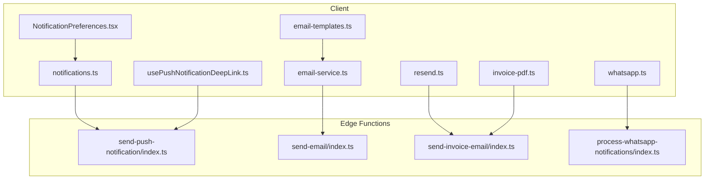
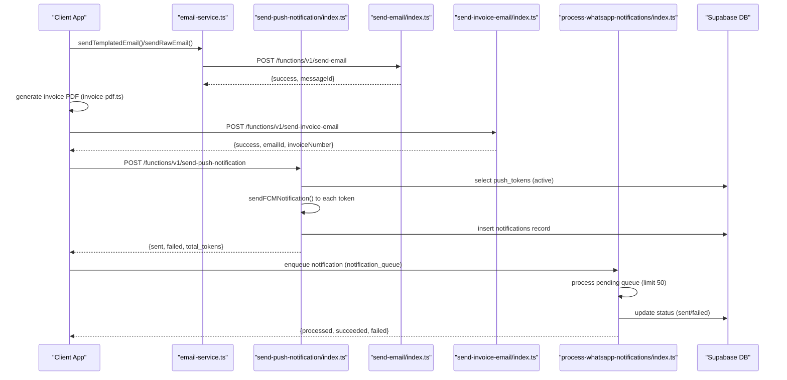
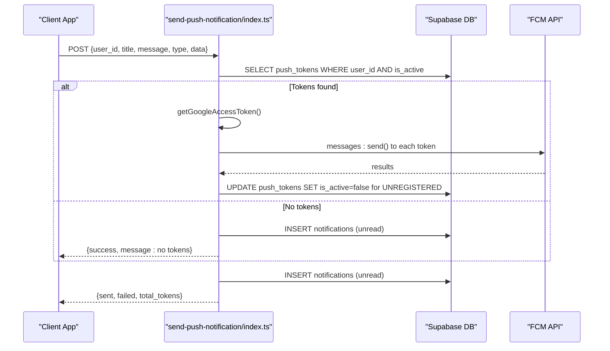
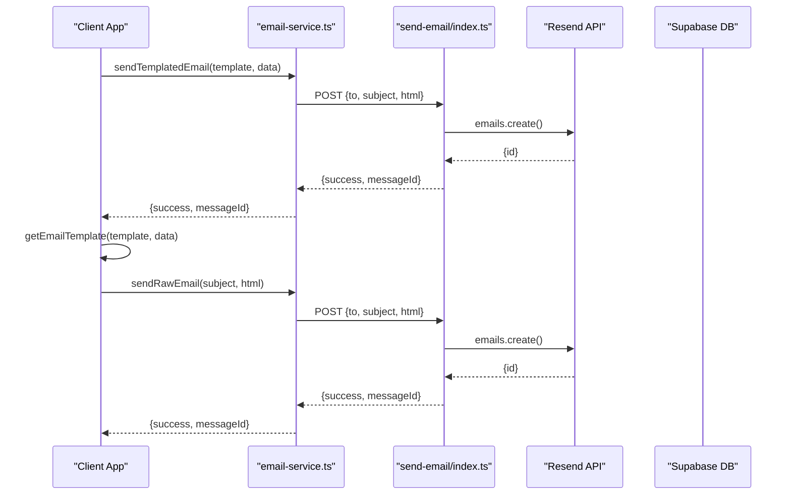
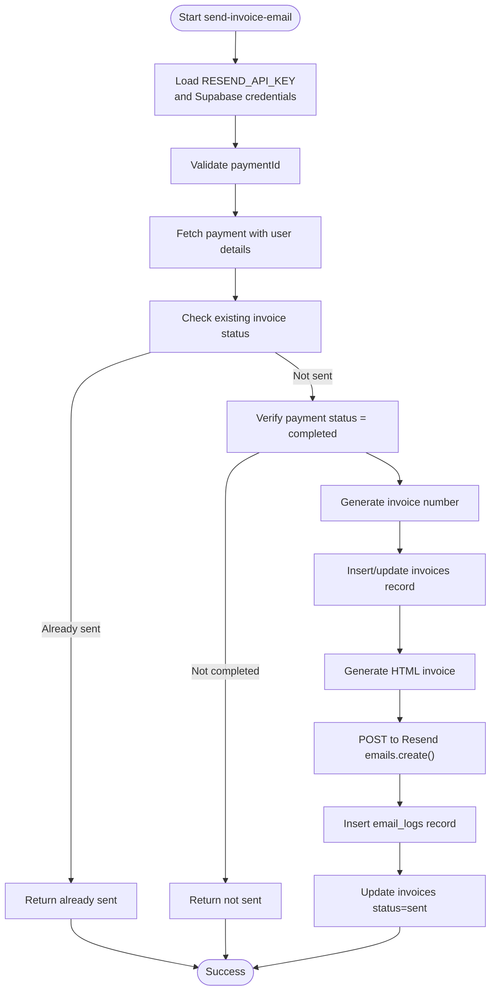
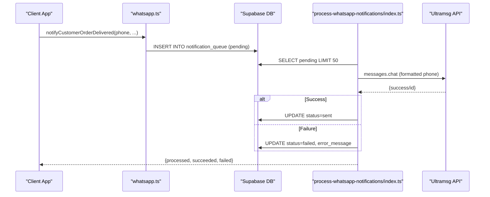
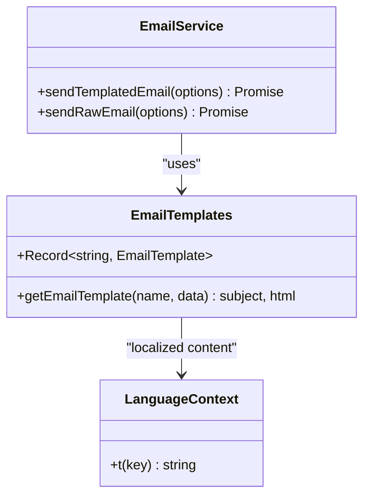
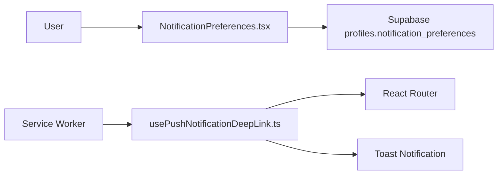
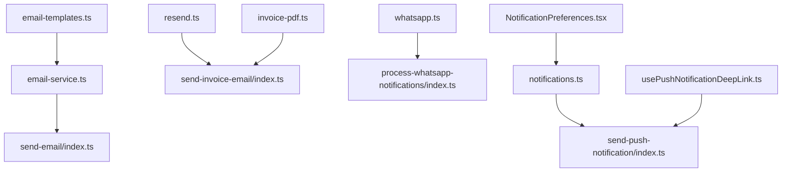

# Notification System

<cite>
**Referenced Files in This Document**
- [send-push-notification/index.ts](file://supabase/functions/send-push-notification/index.ts)
- [send-email/index.ts](file://supabase/functions/send-email/index.ts)
- [send-invoice-email/index.ts](file://supabase/functions/send-invoice-email/index.ts)
- [process-whatsapp-notifications/index.ts](file://supabase/functions/process-whatsapp-notifications/index.ts)
- [notifications.ts](file://src/lib/notifications.ts)
- [email-service.ts](file://src/lib/email-service.ts)
- [resend.ts](file://src/lib/resend.ts)
- [whatsapp.ts](file://src/lib/whatsapp.ts)
- [email-templates.ts](file://src/lib/email-templates.ts)
- [invoice-pdf.ts](file://src/lib/invoice-pdf.ts)
- [usePushNotificationDeepLink.ts](file://src/hooks/usePushNotificationDeepLink.ts)
- [NotificationPreferences.tsx](file://src/components/NotificationPreferences.tsx)
</cite>

## Table of Contents
1. [Introduction](#introduction)
2. [Project Structure](#project-structure)
3. [Core Components](#core-components)
4. [Architecture Overview](#architecture-overview)
5. [Detailed Component Analysis](#detailed-component-analysis)
6. [Dependency Analysis](#dependency-analysis)
7. [Performance Considerations](#performance-considerations)
8. [Troubleshooting Guide](#troubleshooting-guide)
9. [Conclusion](#conclusion)
10. [Appendices](#appendices)

## Introduction
This document describes the multi-channel notification system used by the application. It covers:
- Firebase Cloud Messaging (FCM) integration for push notifications
- Email delivery via Resend with templating and PDF invoice generation
- WhatsApp API integration using Ultramsg with queueing and delivery confirmation
- Notification scheduling, batch processing, retry mechanisms, and delivery tracking
- Template customization, localization support, and notification analytics
- Configuration examples and troubleshooting guidance

## Project Structure
The notification system spans client-side libraries, Supabase Edge Functions, and UI components:
- Client libraries: email-service, resend, whatsapp, email-templates, invoice-pdf, notifications helpers, deep-link handling, and preferences UI
- Edge Functions: send-push-notification, send-email, send-invoice-email, process-whatsapp-notifications
- UI integration: notification preferences and deep-link routing

**Diagram sources**
- [email-service.ts:1-173](file://src/lib/email-service.ts#L1-L173)
- [resend.ts:1-239](file://src/lib/resend.ts#L1-L239)
- [whatsapp.ts:1-197](file://src/lib/whatsapp.ts#L1-L197)
- [email-templates.ts:1-209](file://src/lib/email-templates.ts#L1-L209)
- [invoice-pdf.ts:1-359](file://src/lib/invoice-pdf.ts#L1-L359)
- [notifications.ts:1-114](file://src/lib/notifications.ts#L1-L114)
- [usePushNotificationDeepLink.ts:1-195](file://src/hooks/usePushNotificationDeepLink.ts#L1-L195)
- [NotificationPreferences.tsx:1-198](file://src/components/NotificationPreferences.tsx#L1-L198)
- [send-push-notification/index.ts:1-300](file://supabase/functions/send-push-notification/index.ts#L1-L300)
- [send-email/index.ts:1-120](file://supabase/functions/send-email/index.ts#L1-L120)
- [send-invoice-email/index.ts:1-540](file://supabase/functions/send-invoice-email/index.ts#L1-L540)
- [process-whatsapp-notifications/index.ts:1-215](file://supabase/functions/process-whatsapp-notifications/index.ts#L1-L215)

**Section sources**
- [email-service.ts:1-173](file://src/lib/email-service.ts#L1-L173)
- [resend.ts:1-239](file://src/lib/resend.ts#L1-L239)
- [whatsapp.ts:1-197](file://src/lib/whatsapp.ts#L1-L197)
- [email-templates.ts:1-209](file://src/lib/email-templates.ts#L1-L209)
- [invoice-pdf.ts:1-359](file://src/lib/invoice-pdf.ts#L1-L359)
- [notifications.ts:1-114](file://src/lib/notifications.ts#L1-L114)
- [usePushNotificationDeepLink.ts:1-195](file://src/hooks/usePushNotificationDeepLink.ts#L1-L195)
- [NotificationPreferences.tsx:1-198](file://src/components/NotificationPreferences.tsx#L1-L198)
- [send-push-notification/index.ts:1-300](file://supabase/functions/send-push-notification/index.ts#L1-L300)
- [send-email/index.ts:1-120](file://supabase/functions/send-email/index.ts#L1-L120)
- [send-invoice-email/index.ts:1-540](file://supabase/functions/send-invoice-email/index.ts#L1-L540)
- [process-whatsapp-notifications/index.ts:1-215](file://supabase/functions/process-whatsapp-notifications/index.ts#L1-L215)

## Core Components
- Push Notifications (FCM): Supabase Edge Function handles token retrieval, multi-device delivery, token deactivation on UNREGISTERED errors, and persistence of notification records.
- Email Service: Client library composes templated emails and forwards raw HTML to a Supabase Edge Function that integrates with Resend. Additional invoice-specific function generates and emails PDF invoices.
- WhatsApp Service: Client library provides convenience functions for common notifications; Edge Function queues and processes messages via Ultramsg with status tracking.
- Templates and Localization: Email templates support dynamic subjects and HTML rendering; localization is handled via the application’s language context.
- Analytics and Preferences: User preferences are stored in the database; deep links enable navigation from push notifications; UI exposes preference toggles.

**Section sources**
- [send-push-notification/index.ts:178-299](file://supabase/functions/send-push-notification/index.ts#L178-L299)
- [email-service.ts:23-84](file://src/lib/email-service.ts#L23-L84)
- [send-email/index.ts:19-119](file://supabase/functions/send-email/index.ts#L19-L119)
- [send-invoice-email/index.ts:326-473](file://supabase/functions/send-invoice-email/index.ts#L326-L473)
- [whatsapp.ts:26-60](file://src/lib/whatsapp.ts#L26-L60)
- [process-whatsapp-notifications/index.ts:31-162](file://supabase/functions/process-whatsapp-notifications/index.ts#L31-L162)
- [email-templates.ts:43-188](file://src/lib/email-templates.ts#L43-L188)
- [NotificationPreferences.tsx:17-83](file://src/components/NotificationPreferences.tsx#L17-L83)
- [usePushNotificationDeepLink.ts:51-127](file://src/hooks/usePushNotificationDeepLink.ts#L51-L127)

## Architecture Overview
The system orchestrates notifications across channels using a hybrid approach:
- Client-side composition and dispatch
- Serverless Edge Functions for provider-specific APIs and persistence
- Database-backed storage for tokens, queues, and logs

**Diagram sources**
- [email-service.ts:23-84](file://src/lib/email-service.ts#L23-L84)
- [send-email/index.ts:19-119](file://supabase/functions/send-email/index.ts#L19-L119)
- [send-invoice-email/index.ts:326-473](file://supabase/functions/send-invoice-email/index.ts#L326-L473)
- [send-push-notification/index.ts:178-299](file://supabase/functions/send-push-notification/index.ts#L178-L299)
- [process-whatsapp-notifications/index.ts:88-162](file://supabase/functions/process-whatsapp-notifications/index.ts#L88-L162)

## Detailed Component Analysis

### Push Notifications (Firebase Cloud Messaging)
The Edge Function coordinates FCM delivery:
- Validates input and fetches active tokens for the user
- Generates a Google OAuth2 access token from a service account
- Sends notifications to all active tokens concurrently
- Deactivates tokens that return UNREGISTERED/NOT_FOUND
- Persists notification records regardless of token presence

**Diagram sources**
- [send-push-notification/index.ts:178-299](file://supabase/functions/send-push-notification/index.ts#L178-L299)

**Section sources**
- [send-push-notification/index.ts:178-299](file://supabase/functions/send-push-notification/index.ts#L178-L299)
- [notifications.ts:18-35](file://src/lib/notifications.ts#L18-L35)
- [usePushNotificationDeepLink.ts:51-127](file://src/hooks/usePushNotificationDeepLink.ts#L51-L127)

### Email Delivery (Resend Integration)
Two pathways exist:
- Client-side templated emails routed to a Supabase Edge Function for Resend
- Invoice-specific function that generates HTML and attaches a PDF

**Diagram sources**
- [email-service.ts:23-84](file://src/lib/email-service.ts#L23-L84)
- [send-email/index.ts:19-119](file://supabase/functions/send-email/index.ts#L19-L119)
- [email-templates.ts:190-208](file://src/lib/email-templates.ts#L190-L208)

**Section sources**
- [email-service.ts:23-84](file://src/lib/email-service.ts#L23-L84)
- [send-email/index.ts:19-119](file://supabase/functions/send-email/index.ts#L19-L119)
- [email-templates.ts:43-188](file://src/lib/email-templates.ts#L43-L188)

### Invoice Email Generation and Delivery
The invoice function:
- Validates payment status and deduplicates invoice attempts
- Creates or updates invoice records
- Generates HTML invoice using localized labels
- Sends via Resend and logs to email_logs
- Updates invoice status to sent

**Diagram sources**
- [send-invoice-email/index.ts:326-473](file://supabase/functions/send-invoice-email/index.ts#L326-L473)

**Section sources**
- [send-invoice-email/index.ts:326-473](file://supabase/functions/send-invoice-email/index.ts#L326-L473)
- [invoice-pdf.ts:40-300](file://src/lib/invoice-pdf.ts#L40-L300)

### WhatsApp Notifications (Ultramsg Integration)
The client library provides convenience functions for common scenarios. The Edge Function manages a queue:
- Processes pending notifications in batches (limit 50)
- Validates phone numbers and sends via Ultramsg
- Updates statuses to sent or failed with error messages

**Diagram sources**
- [whatsapp.ts:63-114](file://src/lib/whatsapp.ts#L63-L114)
- [process-whatsapp-notifications/index.ts:88-162](file://supabase/functions/process-whatsapp-notifications/index.ts#L88-L162)

**Section sources**
- [whatsapp.ts:26-197](file://src/lib/whatsapp.ts#L26-L197)
- [process-whatsapp-notifications/index.ts:31-162](file://supabase/functions/process-whatsapp-notifications/index.ts#L31-L162)

### Notification Templates and Localization
- Email templates define subject and HTML content; subjects can be static or dynamic via functions.
- The client-side email-service composes messages using templates and forwards to the Edge Function.
- Localization is supported through the application’s language context; templates render localized content.

**Diagram sources**
- [email-templates.ts:43-188](file://src/lib/email-templates.ts#L43-L188)
- [email-service.ts:23-45](file://src/lib/email-service.ts#L23-L45)

**Section sources**
- [email-templates.ts:43-188](file://src/lib/email-templates.ts#L43-L188)
- [email-service.ts:23-45](file://src/lib/email-service.ts#L23-L45)

### Notification Preferences and Deep Links
- Users can toggle notification preferences per category and channel.
- Deep links enable navigation from push notifications to relevant app screens.
- Templates define common notification payloads for consistent UX.

**Diagram sources**
- [NotificationPreferences.tsx:39-83](file://src/components/NotificationPreferences.tsx#L39-L83)
- [usePushNotificationDeepLink.ts:51-127](file://src/hooks/usePushNotificationDeepLink.ts#L51-L127)

**Section sources**
- [NotificationPreferences.tsx:17-83](file://src/components/NotificationPreferences.tsx#L17-L83)
- [usePushNotificationDeepLink.ts:51-127](file://src/hooks/usePushNotificationDeepLink.ts#L51-L127)

## Dependency Analysis
- Client libraries depend on environment variables for provider credentials.
- Edge Functions depend on Supabase for database access and external APIs for providers.
- The system maintains loose coupling via HTTP endpoints and shared data models.

**Diagram sources**
- [email-service.ts:1-173](file://src/lib/email-service.ts#L1-L173)
- [resend.ts:1-239](file://src/lib/resend.ts#L1-L239)
- [whatsapp.ts:1-197](file://src/lib/whatsapp.ts#L1-L197)
- [email-templates.ts:1-209](file://src/lib/email-templates.ts#L1-L209)
- [invoice-pdf.ts:1-359](file://src/lib/invoice-pdf.ts#L1-L359)
- [notifications.ts:1-114](file://src/lib/notifications.ts#L1-L114)
- [usePushNotificationDeepLink.ts:1-195](file://src/hooks/usePushNotificationDeepLink.ts#L1-L195)
- [NotificationPreferences.tsx:1-198](file://src/components/NotificationPreferences.tsx#L1-L198)
- [send-email/index.ts:1-120](file://supabase/functions/send-email/index.ts#L1-L120)
- [send-invoice-email/index.ts:1-540](file://supabase/functions/send-invoice-email/index.ts#L1-L540)
- [process-whatsapp-notifications/index.ts:1-215](file://supabase/functions/process-whatsapp-notifications/index.ts#L1-L215)
- [send-push-notification/index.ts:1-300](file://supabase/functions/send-push-notification/index.ts#L1-L300)

**Section sources**
- [email-service.ts:1-173](file://src/lib/email-service.ts#L1-L173)
- [resend.ts:1-239](file://src/lib/resend.ts#L1-L239)
- [whatsapp.ts:1-197](file://src/lib/whatsapp.ts#L1-L197)
- [email-templates.ts:1-209](file://src/lib/email-templates.ts#L1-L209)
- [invoice-pdf.ts:1-359](file://src/lib/invoice-pdf.ts#L1-L359)
- [notifications.ts:1-114](file://src/lib/notifications.ts#L1-L114)
- [usePushNotificationDeepLink.ts:1-195](file://src/hooks/usePushNotificationDeepLink.ts#L1-L195)
- [NotificationPreferences.tsx:1-198](file://src/components/NotificationPreferences.tsx#L1-L198)
- [send-email/index.ts:1-120](file://supabase/functions/send-email/index.ts#L1-L120)
- [send-invoice-email/index.ts:1-540](file://supabase/functions/send-invoice-email/index.ts#L1-L540)
- [process-whatsapp-notifications/index.ts:1-215](file://supabase/functions/process-whatsapp-notifications/index.ts#L1-L215)
- [send-push-notification/index.ts:1-300](file://supabase/functions/send-push-notification/index.ts#L1-L300)

## Performance Considerations
- Concurrency: FCM batching is handled via Promise.allSettled; adjust concurrency based on provider limits.
- Queueing: WhatsApp processing caps batch size to prevent overload; tune limit according to throughput needs.
- Persistence: Prefer minimal payloads in notifications; store large data in app state or backend.
- Caching: Reuse generated PDFs for invoices when appropriate to reduce computation.
- Monitoring: Track delivery failures and token deactivation rates to optimize re-engagement strategies.

[No sources needed since this section provides general guidance]

## Troubleshooting Guide
Common issues and resolutions:
- Missing credentials
  - Symptom: Email/WhatsApp/Push functions fail to initialize.
  - Resolution: Ensure environment variables are set in Supabase and client-side env files.
- Invalid email format
  - Symptom: Email function returns validation error.
  - Resolution: Validate recipient addresses before sending.
- Unregistered device tokens
  - Symptom: FCM returns UNREGISTERED; notifications not delivered.
  - Resolution: The function deactivates tokens automatically; remove inactive tokens periodically.
- WhatsApp phone number validation
  - Symptom: Messages marked as failed with invalid phone number.
  - Resolution: Ensure phone numbers are numeric and meet minimum length requirements.
- Invoice already sent
  - Symptom: Invoice function indicates invoice already sent.
  - Resolution: Check invoice status and avoid duplicate attempts.
- Template rendering errors
  - Symptom: Email subject or HTML missing content.
  - Resolution: Verify template keys and data passed to getEmailTemplate.

**Section sources**
- [send-email/index.ts:26-62](file://supabase/functions/send-email/index.ts#L26-L62)
- [send-push-notification/index.ts:241-271](file://supabase/functions/send-push-notification/index.ts#L241-L271)
- [process-whatsapp-notifications/index.ts:36-46](file://supabase/functions/process-whatsapp-notifications/index.ts#L36-L46)
- [send-invoice-email/index.ts:357-373](file://supabase/functions/send-invoice-email/index.ts#L357-L373)
- [email-templates.ts:190-208](file://src/lib/email-templates.ts#L190-L208)

## Conclusion
The notification system provides a robust, extensible foundation for multi-channel communications. It leverages Supabase Edge Functions for provider integrations, maintains strong separation of concerns between client and server, and supports advanced features like queueing, retry logic, and delivery tracking. With clear configuration patterns and comprehensive error handling, teams can confidently extend and maintain the system.

[No sources needed since this section summarizes without analyzing specific files]

## Appendices

### Configuration Examples
- Firebase Cloud Messaging (FCM)
  - Set service account JSON in Supabase secrets; ensure project ID matches.
  - Configure push tokens table with user_id, token, platform, and is_active fields.
- Resend
  - Set RESEND_API_KEY in Supabase Edge Function environment.
  - Use send-email function for generic emails; use send-invoice-email for invoices.
- Ultramsg (WhatsApp)
  - Set ULTRAMSG_INSTANCE_ID and ULTRAMSG_TOKEN in Supabase Edge Function environment.
  - Ensure phone numbers are formatted correctly before enqueueing.

**Section sources**
- [send-push-notification/index.ts:189-197](file://supabase/functions/send-push-notification/index.ts#L189-L197)
- [send-email/index.ts:4-6](file://supabase/functions/send-email/index.ts#L4-L6)
- [send-invoice-email/index.ts:7-11](file://supabase/functions/send-invoice-email/index.ts#L7-L11)
- [process-whatsapp-notifications/index.ts:5-9](file://supabase/functions/process-whatsapp-notifications/index.ts#L5-L9)