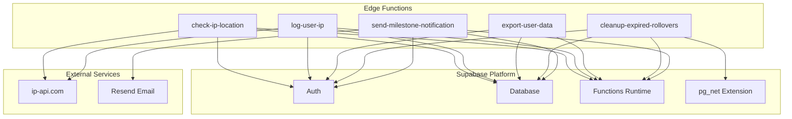
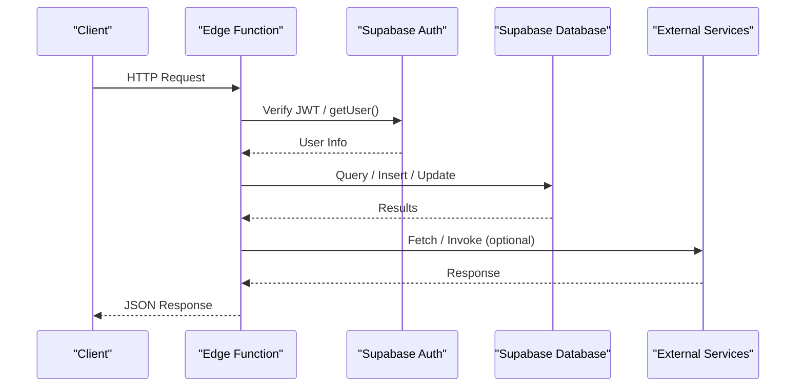
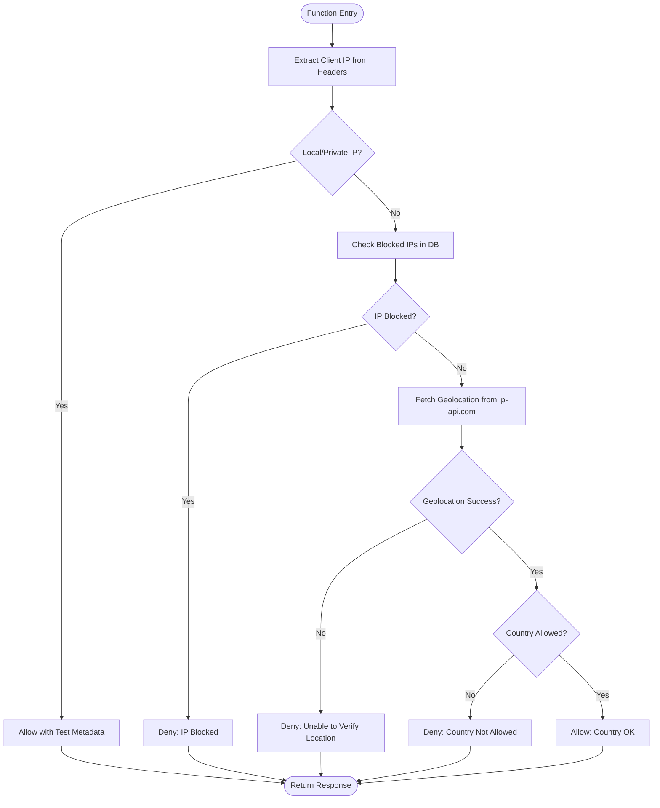
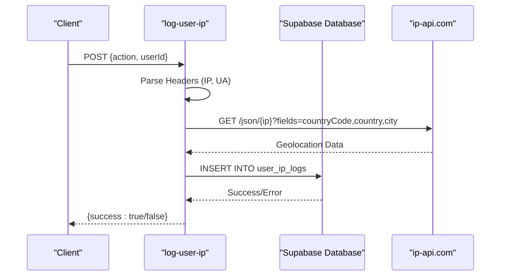
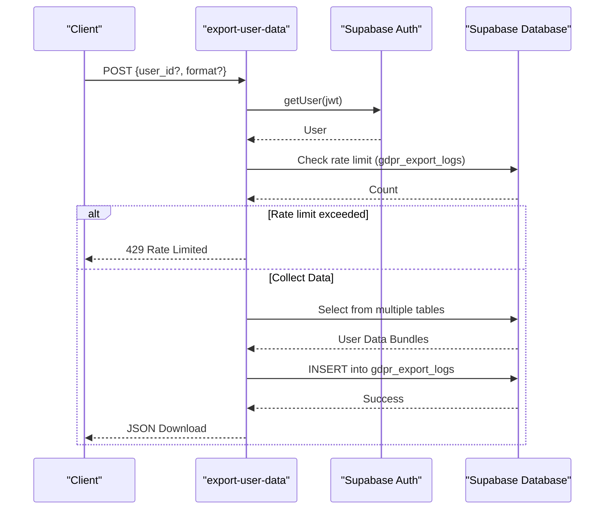
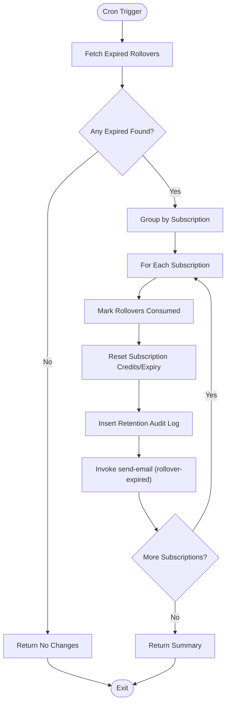
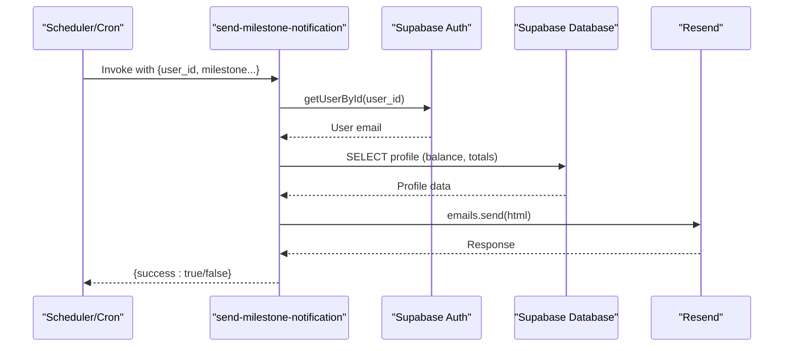
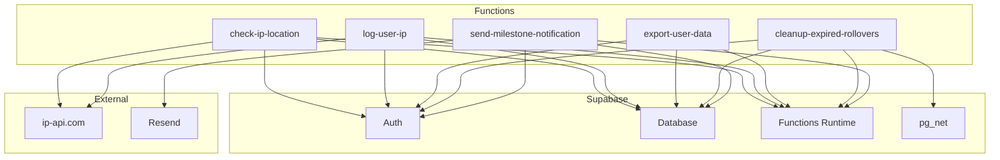

# Utility Functions

<cite>
**Referenced Files in This Document**
- [check-ip-location/index.ts](file://supabase/functions/check-ip-location/index.ts)
- [log-user-ip/index.ts](file://supabase/functions/log-user-ip/index.ts)
- [export-user-data/index.ts](file://supabase/functions/export-user-data/index.ts)
- [cleanup-expired-rollovers/index.ts](file://supabase/functions/cleanup-expired-rollovers/index.ts)
- [send-milestone-notification/index.ts](file://supabase/functions/send-milestone-notification/index.ts)
- [config.toml](file://supabase/config.toml)
- [20250219000000_ip_management.sql](file://supabase/migrations/20250219000000_ip_management.sql)
- [20260227000001_add_gdpr_export_logs.sql](file://supabase/migrations/20260227000001_add_gdpr_export_logs.sql)
- [20260308000001_auto_rollover_and_schedule_deduction.sql](file://supabase/migrations/20260308000001_auto_rollover_and_schedule_deduction.sql)
- [test-ip-check.mjs](file://test-ip-check.mjs)
- [sentry.ts](file://src/lib/sentry.ts)
- [cache.ts](file://src/lib/cache.ts)
</cite>

## Table of Contents
1. [Introduction](#introduction)
2. [Project Structure](#project-structure)
3. [Core Components](#core-components)
4. [Architecture Overview](#architecture-overview)
5. [Detailed Component Analysis](#detailed-component-analysis)
6. [Dependency Analysis](#dependency-analysis)
7. [Performance Considerations](#performance-considerations)
8. [Security and Compliance](#security-and-compliance)
9. [Configuration and Environments](#configuration-and-environments)
10. [Monitoring and Observability](#monitoring-and-observability)
11. [Troubleshooting Guide](#troubleshooting-guide)
12. [Conclusion](#conclusion)

## Introduction
This document provides comprehensive documentation for the utility and support functions that deliver auxiliary platform capabilities. It covers:
- Geolocation verification and IP-based security via check-ip-location
- Audit trail creation and user activity tracking via log-user-ip
- GDPR-compliant data export with portability via export-user-data
- Automated data maintenance and expired credit management via cleanup-expired-rollovers
- Achievement tracking and user engagement via send-milestone-notification

The guide explains implementation patterns, data flows, security considerations, privacy compliance, performance optimization for background processing, configuration examples, and monitoring approaches tailored to different operational environments.

## Project Structure
The utility functions are implemented as Supabase Edge Functions under the supabase/functions directory. Each function encapsulates a specific capability and integrates with Supabase Auth, Database, and external services (e.g., ip-api.com for geolocation, Resend for email).

**Diagram sources**
- [check-ip-location/index.ts:1-107](file://supabase/functions/check-ip-location/index.ts#L1-L107)
- [log-user-ip/index.ts:1-65](file://supabase/functions/log-user-ip/index.ts#L1-L65)
- [export-user-data/index.ts:1-320](file://supabase/functions/export-user-data/index.ts#L1-L320)
- [cleanup-expired-rollovers/index.ts:1-199](file://supabase/functions/cleanup-expired-rollovers/index.ts#L1-L199)
- [send-milestone-notification/index.ts:1-156](file://supabase/functions/send-milestone-notification/index.ts#L1-L156)

**Section sources**
- [check-ip-location/index.ts:1-107](file://supabase/functions/check-ip-location/index.ts#L1-L107)
- [log-user-ip/index.ts:1-65](file://supabase/functions/log-user-ip/index.ts#L1-L65)
- [export-user-data/index.ts:1-320](file://supabase/functions/export-user-data/index.ts#L1-L320)
- [cleanup-expired-rollovers/index.ts:1-199](file://supabase/functions/cleanup-expired-rollovers/index.ts#L1-L199)
- [send-milestone-notification/index.ts:1-156](file://supabase/functions/send-milestone-notification/index.ts#L1-L156)

## Core Components
This section outlines the primary utility functions and their responsibilities.

- check-ip-location: Validates client IP against blocked lists and geolocation, enforcing regional restrictions and returning allow/deny decisions with location metadata.
- log-user-ip: Records user IP addresses, locations, actions, and user agents into a dedicated audit table for security and compliance.
- export-user-data: Implements GDPR-compliant data portability by collecting user data across multiple tables and returning it as a structured export with rate limiting and audit logging.
- cleanup-expired-rollovers: Performs nightly maintenance to expire unused rollover credits, update subscription records, and notify users via email.
- send-milestone-notification: Sends personalized milestone achievement emails to users, aggregating affiliate program metrics.

**Section sources**
- [check-ip-location/index.ts:1-107](file://supabase/functions/check-ip-location/index.ts#L1-L107)
- [log-user-ip/index.ts:1-65](file://supabase/functions/log-user-ip/index.ts#L1-L65)
- [export-user-data/index.ts:1-320](file://supabase/functions/export-user-data/index.ts#L1-L320)
- [cleanup-expired-rollovers/index.ts:1-199](file://supabase/functions/cleanup-expired-rollovers/index.ts#L1-L199)
- [send-milestone-notification/index.ts:1-156](file://supabase/functions/send-milestone-notification/index.ts#L1-L156)

## Architecture Overview
The utility functions operate within Supabase Edge Functions, leveraging Supabase Auth for identity and Supabase Database for persistence. They integrate with external services for geolocation and email delivery.

**Diagram sources**
- [check-ip-location/index.ts:20-106](file://supabase/functions/check-ip-location/index.ts#L20-L106)
- [log-user-ip/index.ts:16-64](file://supabase/functions/log-user-ip/index.ts#L16-L64)
- [export-user-data/index.ts:29-318](file://supabase/functions/export-user-data/index.ts#L29-L318)
- [cleanup-expired-rollovers/index.ts:25-197](file://supabase/functions/cleanup-expired-rollovers/index.ts#L25-L197)
- [send-milestone-notification/index.ts:27-152](file://supabase/functions/send-milestone-notification/index.ts#L27-L152)

## Detailed Component Analysis

### check-ip-location
Purpose: Enforce IP-based security and regional access control by validating client IP against blocked entries and geolocation data.

Key behaviors:
- Extracts client IP from forwarded headers
- Bypasses checks for local/private IPs (e.g., localhost, 192.168.x.x, 10.x.x.x) for testing
- Checks database for blocked IP entries
- Queries ip-api.com for geolocation and enforces allow-list country
- Returns structured JSON with allow/deny decision and location metadata

**Diagram sources**
- [check-ip-location/index.ts:20-94](file://supabase/functions/check-ip-location/index.ts#L20-L94)

**Section sources**
- [check-ip-location/index.ts:1-107](file://supabase/functions/check-ip-location/index.ts#L1-L107)
- [20250219000000_ip_management.sql:51-60](file://supabase/migrations/20250219000000_ip_management.sql#L51-L60)

### log-user-ip
Purpose: Maintain an audit trail of user IP addresses and associated metadata for security monitoring and compliance.

Key behaviors:
- Accepts action and userId in request body
- Extracts IP and user agent from headers
- Retrieves geolocation from ip-api.com
- Inserts record into user_ip_logs table with country, city, and action metadata

**Diagram sources**
- [log-user-ip/index.ts:16-54](file://supabase/functions/log-user-ip/index.ts#L16-L54)

**Section sources**
- [log-user-ip/index.ts:1-65](file://supabase/functions/log-user-ip/index.ts#L1-L65)
- [20250219000000_ip_management.sql:1-42](file://supabase/migrations/20250219000000_ip_management.sql#L1-L42)

### export-user-data
Purpose: Implement GDPR Article 20 data portability by exporting user data in a structured format with rate limiting and audit logging.

Key behaviors:
- Validates JWT and determines requester identity
- Supports admin exports for other users with role verification
- Enforces rate limit (once per 24 hours for non-admins)
- Aggregates data across multiple tables (auth, profiles, orders, subscriptions, wallet, activities, etc.)
- Logs export events to gdpr_export_logs for compliance tracking
- Returns downloadable JSON payload

**Diagram sources**
- [export-user-data/index.ts:29-304](file://supabase/functions/export-user-data/index.ts#L29-L304)
- [20260227000001_add_gdpr_export_logs.sql:1-59](file://supabase/migrations/20260227000001_add_gdpr_export_logs.sql#L1-L59)

**Section sources**
- [export-user-data/index.ts:1-320](file://supabase/functions/export-user-data/index.ts#L1-L320)
- [20260227000001_add_gdpr_export_logs.sql:1-59](file://supabase/migrations/20260227000001_add_gdpr_export_logs.sql#L1-L59)

### cleanup-expired-rollovers
Purpose: Automate rollover credit expiration and maintain accurate subscription balances.

Key behaviors:
- Scheduled execution (cron) to process expired rollover credits
- Groups expired records by subscription for efficient batch updates
- Marks rollover records as consumed and resets subscription rollover credits/expiry
- Logs retention actions to retention_audit_logs
- Invokes send-email function to notify users about expired credits

**Diagram sources**
- [cleanup-expired-rollovers/index.ts:72-177](file://supabase/functions/cleanup-expired-rollovers/index.ts#L72-L177)

**Section sources**
- [cleanup-expired-rollovers/index.ts:1-199](file://supabase/functions/cleanup-expired-rollovers/index.ts#L1-L199)
- [20260308000001_auto_rollover_and_schedule_deduction.sql:83-103](file://supabase/migrations/20260308000001_auto_rollover_and_schedule_deduction.sql#L83-L103)

### send-milestone-notification
Purpose: Engage users by notifying them of affiliate milestones with personalized content and balance updates.

Key behaviors:
- Receives user_id and milestone details
- Fetches user email and profile metrics
- Sends HTML email via Resend with formatted milestone details
- Returns success/failure response

**Diagram sources**
- [send-milestone-notification/index.ts:32-142](file://supabase/functions/send-milestone-notification/index.ts#L32-L142)

**Section sources**
- [send-milestone-notification/index.ts:1-156](file://supabase/functions/send-milestone-notification/index.ts#L1-L156)

## Dependency Analysis
The utility functions depend on Supabase platform capabilities and external services. The following diagram highlights key dependencies and relationships.

**Diagram sources**
- [check-ip-location/index.ts:1-107](file://supabase/functions/check-ip-location/index.ts#L1-L107)
- [log-user-ip/index.ts:1-65](file://supabase/functions/log-user-ip/index.ts#L1-L65)
- [export-user-data/index.ts:1-320](file://supabase/functions/export-user-data/index.ts#L1-L320)
- [cleanup-expired-rollovers/index.ts:1-199](file://supabase/functions/cleanup-expired-rollovers/index.ts#L1-L199)
- [send-milestone-notification/index.ts:1-156](file://supabase/functions/send-milestone-notification/index.ts#L1-L156)

**Section sources**
- [config.toml:30-40](file://supabase/config.toml#L30-L40)

## Performance Considerations
- Edge Function cold starts: Minimize initialization work; reuse clients where possible.
- Network calls: Batch operations (e.g., grouping rollover updates) to reduce round-trips.
- Database indexing: Ensure appropriate indexes on frequently queried columns (blocked_ips, user_ip_logs, gdpr_export_logs).
- Caching: Use in-memory caching for non-critical data; avoid caching sensitive user data.
- Asynchronous processing: Use pg_net for outbound HTTP calls from the database when appropriate.

[No sources needed since this section provides general guidance]

## Security and Compliance
- IP-based security:
  - Regional allow-list enforcement with fail-closed behavior on geolocation failures.
  - Local/private IP bypass for testing environments.
  - Blocked IP database with RLS policies restricting access to administrators.
- Audit logging:
  - Comprehensive IP logging with country, city, and action metadata.
  - GDPR export logs with rate limiting and audit trails.
- Data protection:
  - Export function validates JWT and restricts access based on user identity and admin roles.
  - Rate limiting prevents abuse of data export functionality.
- Email notifications:
  - Verified sender domain and secure transport via Resend.

**Section sources**
- [check-ip-location/index.ts:31-47](file://supabase/functions/check-ip-location/index.ts#L31-L47)
- [20250219000000_ip_management.sql:36-49](file://supabase/migrations/20250219000000_ip_management.sql#L36-L49)
- [20260227000001_add_gdpr_export_logs.sql:26-47](file://supabase/migrations/20260227000001_add_gdpr_export_logs.sql#L26-L47)
- [export-user-data/index.ts:61-78](file://supabase/functions/export-user-data/index.ts#L61-L78)

## Configuration and Environments
Environment variables and configuration examples:

- Supabase Edge Functions configuration:
  - Disable JWT verification for utility functions (verify_jwt = false) to enable anonymous invocation for background tasks.
  - Example: [config.toml:30-40](file://supabase/config.toml#L30-L40)

- Database extensions for cron:
  - Enable pg_cron and pg_net for scheduled tasks and outbound HTTP calls.
  - Example: [20260105170347_ea4e2662-2c76-4a2a-845f-12337380833b.sql:1-7](file://supabase/migrations/20260105170347_ea4e2662-2c76-4a2a-845f-12337380833b.sql#L1-L7)

- Testing IP check:
  - Example script invoking check-ip-location function.
  - Example: [test-ip-check.mjs:1-39](file://test-ip-check.mjs#L1-L39)

- Monitoring and observability:
  - Sentry integration for error tracking and filtering PII.
  - Example: [sentry.ts:1-72](file://src/lib/sentry.ts#L1-L72)

- Caching layer:
  - In-memory cache fallback for non-critical data.
  - Example: [cache.ts:1-99](file://src/lib/cache.ts#L1-L99)

**Section sources**
- [config.toml:30-40](file://supabase/config.toml#L30-L40)
- [test-ip-check.mjs:1-39](file://test-ip-check.mjs#L1-L39)
- [sentry.ts:1-72](file://src/lib/sentry.ts#L1-L72)
- [cache.ts:1-99](file://src/lib/cache.ts#L1-L99)

## Monitoring and Observability
Recommended monitoring approaches:
- Edge Function execution metrics: Track response times, error rates, and invocation counts.
- Database performance: Monitor slow queries, index usage, and connection pooling.
- External service reliability: Observe ip-api.com and Resend availability and latency.
- Logging: Centralize logs and correlate function invocations with database changes.
- Alerts: Set thresholds for error spikes, rate limit hits, and failed email deliveries.

[No sources needed since this section provides general guidance]

## Troubleshooting Guide
Common issues and resolutions:
- IP check failures:
  - Verify ip-api.com availability and network connectivity from Edge Functions runtime.
  - Confirm blocked_ips table has correct entries and indexes.
  - Check function logs for CORS and error responses.
  - Reference: [check-ip-location/index.ts:64-78](file://supabase/functions/check-ip-location/index.ts#L64-L78)

- Export rate limit exceeded:
  - Ensure 24-hour window is respected; verify gdpr_export_logs table entries.
  - Confirm admin role checks for cross-user exports.
  - Reference: [export-user-data/index.ts:80-98](file://supabase/functions/export-user-data/index.ts#L80-L98)

- Email delivery failures:
  - Validate Resend API key and domain configuration.
  - Review function logs for send errors and retry mechanisms.
  - Reference: [send-milestone-notification/index.ts:60-134](file://supabase/functions/send-milestone-notification/index.ts#L60-L134)

- Cron job not running:
  - Confirm pg_cron extension is enabled and scheduled job is configured.
  - Verify function permissions and service role key usage.
  - Reference: [cleanup-expired-rollovers/index.ts:38-62](file://supabase/functions/cleanup-expired-rollovers/index.ts#L38-L62)

**Section sources**
- [check-ip-location/index.ts:64-78](file://supabase/functions/check-ip-location/index.ts#L64-L78)
- [export-user-data/index.ts:80-98](file://supabase/functions/export-user-data/index.ts#L80-L98)
- [send-milestone-notification/index.ts:60-134](file://supabase/functions/send-milestone-notification/index.ts#L60-L134)
- [cleanup-expired-rollovers/index.ts:38-62](file://supabase/functions/cleanup-expired-rollovers/index.ts#L38-L62)

## Conclusion
The utility functions provide robust auxiliary capabilities for security, auditing, compliance, maintenance, and user engagement. By leveraging Supabase Edge Functions, Auth, and Database, combined with external services for geolocation and email, the platform achieves scalable, secure, and privacy-conscious operations. Proper configuration, monitoring, and adherence to best practices ensure reliable performance across environments.