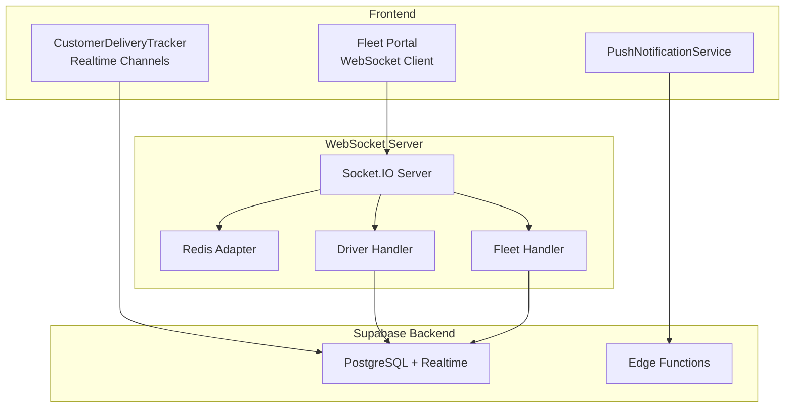
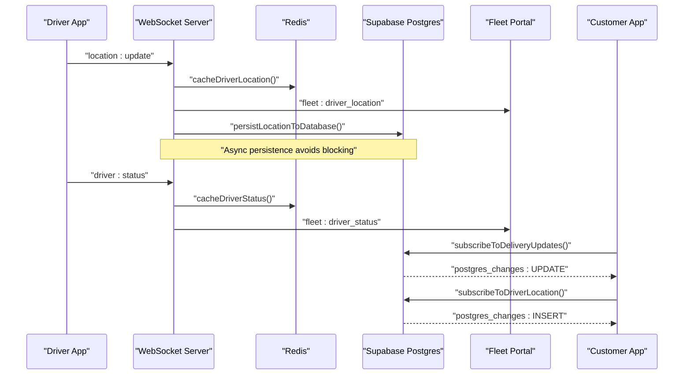
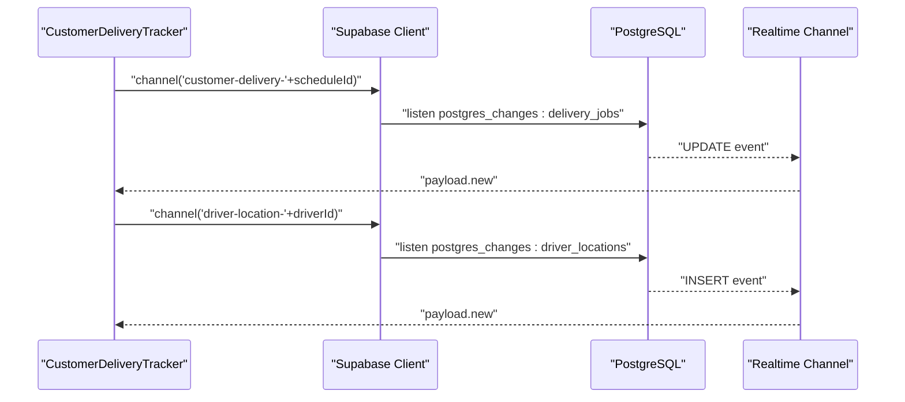
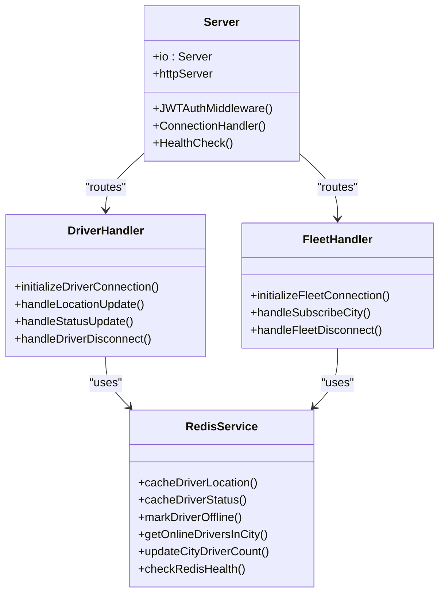
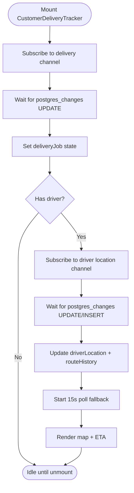
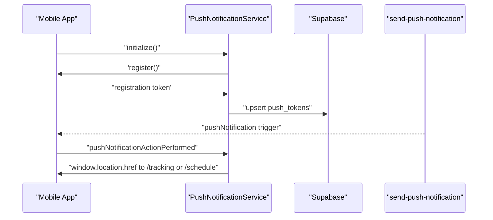
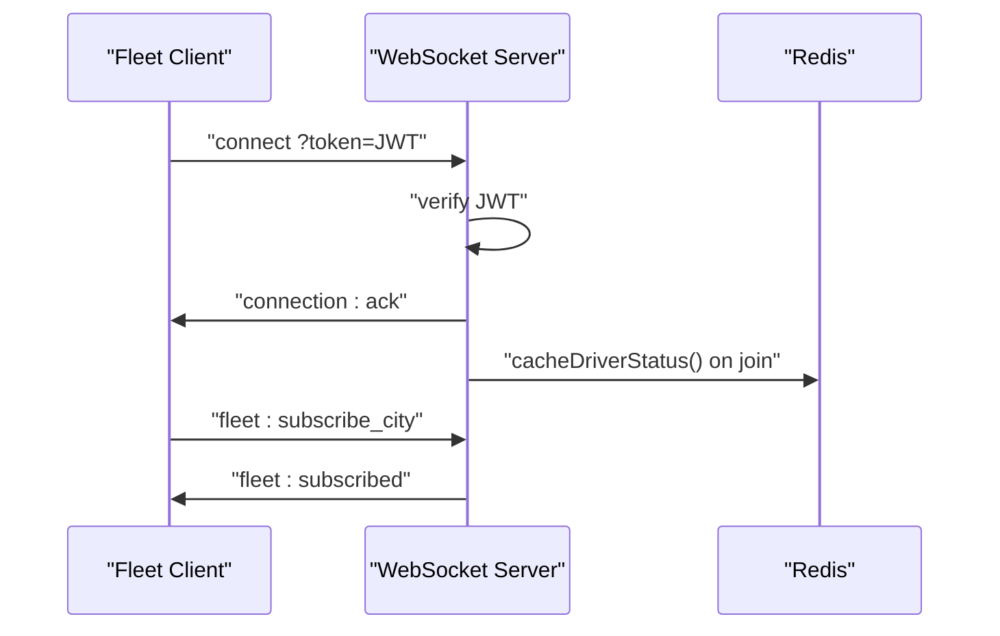
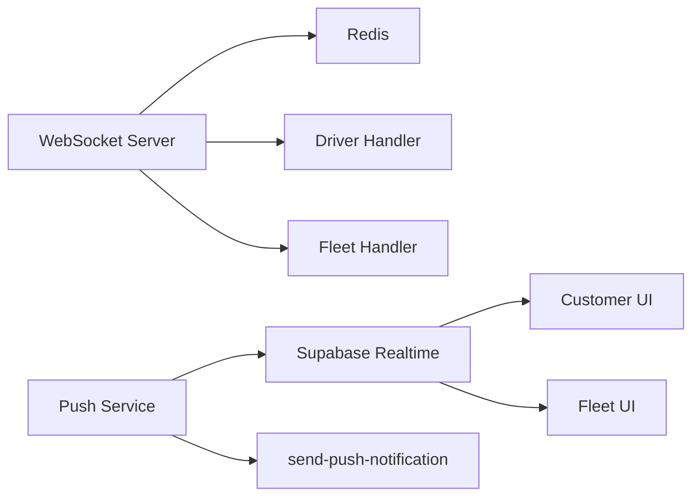

# Real-time Database

<cite>
**Referenced Files in This Document**
- [client.ts](file://src/integrations/supabase/client.ts)
- [delivery.ts](file://src/integrations/supabase/delivery.ts)
- [CustomerDeliveryTracker.tsx](file://src/components/customer/CustomerDeliveryTracker.tsx)
- [push.ts](file://src/lib/notifications/push.ts)
- [server.ts](file://websocket-server/src/server.ts)
- [redisService.ts](file://websocket-server/src/services/redisService.ts)
- [driverHandler.ts](file://websocket-server/src/handlers/driverHandler.ts)
- [fleetHandler.ts](file://websocket-server/src/handlers/fleetHandler.ts)
- [events.ts](file://websocket-server/src/types/events.ts)
- [trackingSocket.ts](file://src/fleet/services/trackingSocket.ts)
- [useSubscription.ts](file://src/hooks/useSubscription.ts)
</cite>

## Table of Contents
1. [Introduction](#introduction)
2. [Project Structure](#project-structure)
3. [Core Components](#core-components)
4. [Architecture Overview](#architecture-overview)
5. [Detailed Component Analysis](#detailed-component-analysis)
6. [Dependency Analysis](#dependency-analysis)
7. [Performance Considerations](#performance-considerations)
8. [Troubleshooting Guide](#troubleshooting-guide)
9. [Conclusion](#conclusion)

## Introduction
This document explains the real-time database architecture integrating Supabase Realtime and a dedicated WebSocket server for live delivery tracking. It covers bidirectional synchronization between frontend and backend, real-time event subscriptions, presence tracking, driver location streaming, live delivery updates, notification system integration, and WebSocket connection management. It also documents message routing patterns, authentication, scaling considerations, and practical examples for real-time data binding and performance optimization.

## Project Structure
The real-time system spans three layers:
- Frontend (React) with Supabase Realtime channels for UI updates and push notifications for off-session engagement.
- Supabase Realtime for PostgreSQL-based event streaming and presence-like behavior via channels.
- WebSocket server (Socket.IO with Redis adapter) for high-frequency driver location updates, presence tracking, and fleet management.

**Diagram sources**
- [CustomerDeliveryTracker.tsx:124-207](file://src/components/customer/CustomerDeliveryTracker.tsx#L124-L207)
- [server.ts:34-51](file://websocket-server/src/server.ts#L34-L51)
- [driverHandler.ts:48-80](file://websocket-server/src/handlers/driverHandler.ts#L48-L80)
- [fleetHandler.ts:79-82](file://websocket-server/src/handlers/fleetHandler.ts#L79-L82)
- [redisService.ts:63-82](file://websocket-server/src/services/redisService.ts#L63-L82)

**Section sources**
- [client.ts:47-57](file://src/integrations/supabase/client.ts#L47-L57)
- [delivery.ts:695-734](file://src/integrations/supabase/delivery.ts#L695-L734)
- [server.ts:34-51](file://websocket-server/src/server.ts#L34-L51)

## Core Components
- Supabase Realtime client and channels for live delivery updates and subscription changes.
- Customer UI component that subscribes to delivery and driver location streams.
- WebSocket server with Redis adapter for scalable driver location and status broadcasts.
- Driver and fleet handlers implementing event routing, rate limiting, and presence caching.
- Push notification service for deep-linking to tracking pages and token persistence.

**Section sources**
- [client.ts:47-57](file://src/integrations/supabase/client.ts#L47-L57)
- [delivery.ts:695-734](file://src/integrations/supabase/delivery.ts#L695-L734)
- [CustomerDeliveryTracker.tsx:124-207](file://src/components/customer/CustomerDeliveryTracker.tsx#L124-L207)
- [server.ts:65-103](file://websocket-server/src/server.ts#L65-L103)
- [driverHandler.ts:48-80](file://websocket-server/src/handlers/driverHandler.ts#L48-L80)
- [fleetHandler.ts:79-82](file://websocket-server/src/handlers/fleetHandler.ts#L79-L82)
- [push.ts:25-75](file://src/lib/notifications/push.ts#L25-L75)

## Architecture Overview
The system combines Supabase Realtime for database-driven events and a WebSocket server for high-frequency driver telemetry. Supabase channels deliver near-real-time updates to customers and fleet dashboards. The WebSocket server handles driver location streaming, status changes, and fleet subscriptions with Redis-backed presence and caching.

**Diagram sources**
- [driverHandler.ts:105-207](file://websocket-server/src/handlers/driverHandler.ts#L105-L207)
- [driverHandler.ts:212-275](file://websocket-server/src/handlers/driverHandler.ts#L212-L275)
- [redisService.ts:87-114](file://websocket-server/src/services/redisService.ts#L87-L114)
- [delivery.ts:695-734](file://src/integrations/supabase/delivery.ts#L695-L734)

## Detailed Component Analysis

### Supabase Realtime Integration
- Realtime client initialization with persistent auth storage for Capacitor/web.
- Delivery updates subscription targeting delivery_jobs filtered by schedule_id.
- Driver location subscription targeting driver_locations inserts filtered by driver_id.
- Customer tracker subscribes to delivery job updates and driver location updates.

**Diagram sources**
- [CustomerDeliveryTracker.tsx:127-191](file://src/components/customer/CustomerDeliveryTracker.tsx#L127-L191)
- [delivery.ts:695-734](file://src/integrations/supabase/delivery.ts#L695-L734)

**Section sources**
- [client.ts:47-57](file://src/integrations/supabase/client.ts#L47-L57)
- [delivery.ts:695-734](file://src/integrations/supabase/delivery.ts#L695-L734)
- [CustomerDeliveryTracker.tsx:124-207](file://src/components/customer/CustomerDeliveryTracker.tsx#L124-L207)

### WebSocket Server and Presence Tracking
- Socket.IO server with Redis adapter for horizontal scaling.
- JWT-based authentication middleware extracting user type and roles.
- Driver handler: validates and rate-limits location/status updates, caches in Redis, persists asynchronously, and broadcasts to fleet rooms.
- Fleet handler: manages city subscriptions, enforces access control, and emits stats.

**Diagram sources**
- [server.ts:65-103](file://websocket-server/src/server.ts#L65-L103)
- [driverHandler.ts:48-80](file://websocket-server/src/handlers/driverHandler.ts#L48-L80)
- [fleetHandler.ts:79-82](file://websocket-server/src/handlers/fleetHandler.ts#L79-L82)
- [redisService.ts:87-146](file://websocket-server/src/services/redisService.ts#L87-L146)

**Section sources**
- [server.ts:34-51](file://websocket-server/src/server.ts#L34-L51)
- [server.ts:65-103](file://websocket-server/src/server.ts#L65-L103)
- [driverHandler.ts:105-207](file://websocket-server/src/handlers/driverHandler.ts#L105-L207)
- [driverHandler.ts:212-275](file://websocket-server/src/handlers/driverHandler.ts#L212-L275)
- [fleetHandler.ts:87-127](file://websocket-server/src/handlers/fleetHandler.ts#L87-L127)
- [redisService.ts:19-58](file://websocket-server/src/services/redisService.ts#L19-L58)

### Real-time UI Updates and Data Binding
- CustomerDeliveryTracker subscribes to delivery and driver location channels, updates state, and renders live map overlays and ETA.
- Uses fallback polling to refresh driver location periodically while maintaining real-time subscriptions.
- Fleet portal connects via WebSocket, authenticates with token, subscribes to city rooms, and receives driver location/status updates.

**Diagram sources**
- [CustomerDeliveryTracker.tsx:124-207](file://src/components/customer/CustomerDeliveryTracker.tsx#L124-L207)

**Section sources**
- [CustomerDeliveryTracker.tsx:124-207](file://src/components/customer/CustomerDeliveryTracker.tsx#L124-L207)
- [trackingSocket.ts:36-82](file://src/fleet/services/trackingSocket.ts#L36-L82)

### Notification System Integration
- PushNotificationService registers device tokens via Capacitor PushNotifications and persists them to Supabase.
- Listens for push notification taps and navigates to tracking or schedule pages based on notification data.
- Edge function for sending push notifications integrates with Firebase Cloud Messaging/APNs.

**Diagram sources**
- [push.ts:25-75](file://src/lib/notifications/push.ts#L25-L75)
- [push.ts:110-125](file://src/lib/notifications/push.ts#L110-L125)

**Section sources**
- [push.ts:25-75](file://src/lib/notifications/push.ts#L25-L75)
- [push.ts:77-108](file://src/lib/notifications/push.ts#L77-L108)
- [push.ts:110-125](file://src/lib/notifications/push.ts#L110-L125)

### Connection Management and Authentication
- WebSocket server validates JWT from handshake.auth.token and stores user metadata on socket.data.
- Enforces maximum concurrent connections and logs connection/disconnection metrics.
- Fleet portal client connects with token query parameter and subscribes to city rooms upon connect.

**Diagram sources**
- [server.ts:65-103](file://websocket-server/src/server.ts#L65-L103)
- [server.ts:108-150](file://websocket-server/src/server.ts#L108-L150)
- [driverHandler.ts:48-80](file://websocket-server/src/handlers/driverHandler.ts#L48-L80)
- [trackingSocket.ts:36-82](file://src/fleet/services/trackingSocket.ts#L36-L82)

**Section sources**
- [server.ts:65-103](file://websocket-server/src/server.ts#L65-L103)
- [server.ts:108-150](file://websocket-server/src/server.ts#L108-L150)
- [trackingSocket.ts:36-82](file://src/fleet/services/trackingSocket.ts#L36-L82)

## Dependency Analysis
- Supabase Realtime depends on PostgreSQL publication and channel filters; frontend subscribes to specific channels keyed by schedule_id or driver_id.
- WebSocket server depends on Redis for pub/sub and caching; driver and fleet handlers depend on RedisService for presence and stats.
- Push notifications depend on Capacitor PushNotifications and Supabase for token storage; edge functions trigger push delivery.

**Diagram sources**
- [delivery.ts:695-734](file://src/integrations/supabase/delivery.ts#L695-L734)
- [CustomerDeliveryTracker.tsx:124-207](file://src/components/customer/CustomerDeliveryTracker.tsx#L124-L207)
- [server.ts:34-51](file://websocket-server/src/server.ts#L34-L51)
- [redisService.ts:63-82](file://websocket-server/src/services/redisService.ts#L63-L82)
- [push.ts:25-75](file://src/lib/notifications/push.ts#L25-L75)

**Section sources**
- [delivery.ts:695-734](file://src/integrations/supabase/delivery.ts#L695-L734)
- [server.ts:34-51](file://websocket-server/src/server.ts#L34-L51)
- [redisService.ts:63-82](file://websocket-server/src/services/redisService.ts#L63-L82)
- [push.ts:25-75](file://src/lib/notifications/push.ts#L25-L75)

## Performance Considerations
- Redis caching for driver location/status reduces DB load; TTL ensures freshness.
- Asynchronous persistence prevents blocking driver updates; errors are logged and retried externally.
- Rate limiting in driver handler controls update frequency to balance accuracy and bandwidth.
- Socket.IO compression and capped buffer sizes reduce memory footprint.
- Supabase channels minimize polling; fallback polling in UI ensures resilience.
- Health checks and readiness probes protect against degraded Redis connectivity.

[No sources needed since this section provides general guidance]

## Troubleshooting Guide
- WebSocket authentication failures: verify JWT secret and token validity; check error emissions for invalid/expired tokens.
- Redis connectivity issues: use health endpoint and readiness probe; confirm cluster mode and password settings.
- Driver location not updating: inspect rate-limiting and payload validation; confirm Redis caching and async persistence logs.
- Realtime channel not receiving updates: verify channel names and filters; ensure proper subscription lifecycle and cleanup on unmount.
- Push notifications not received: confirm device permissions, token registration, and edge function configuration.

**Section sources**
- [server.ts:95-102](file://websocket-server/src/server.ts#L95-L102)
- [redisService.ts:254-263](file://websocket-server/src/services/redisService.ts#L254-L263)
- [driverHandler.ts:115-135](file://websocket-server/src/handlers/driverHandler.ts#L115-L135)
- [CustomerDeliveryTracker.tsx:193-204](file://src/components/customer/CustomerDeliveryTracker.tsx#L193-L204)
- [push.ts:59-61](file://src/lib/notifications/push.ts#L59-L61)

## Conclusion
The system achieves robust real-time delivery tracking through a hybrid architecture: Supabase Realtime for database-driven UI updates and a WebSocket server for high-frequency driver telemetry. Redis-backed caching and pub/sub enable scalable presence tracking and fleet management. Push notifications enhance engagement by deep-linking users to tracking experiences. With careful connection management, authentication, and performance tuning, the system supports reliable, low-latency updates across customer, driver, and fleet interfaces.