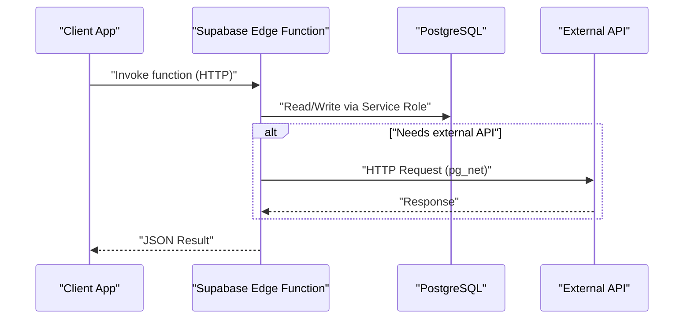
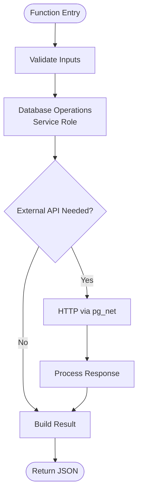
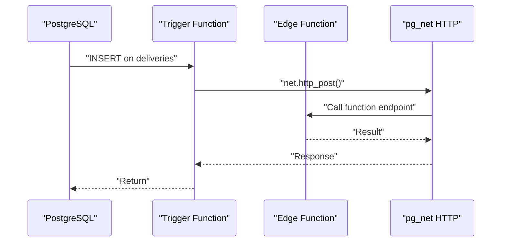
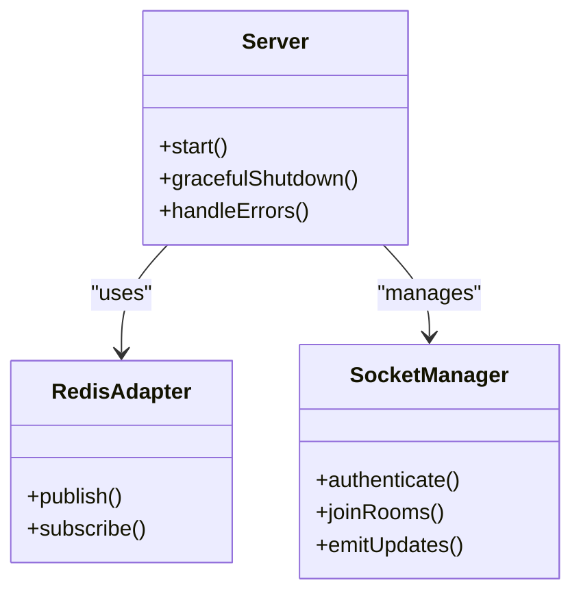
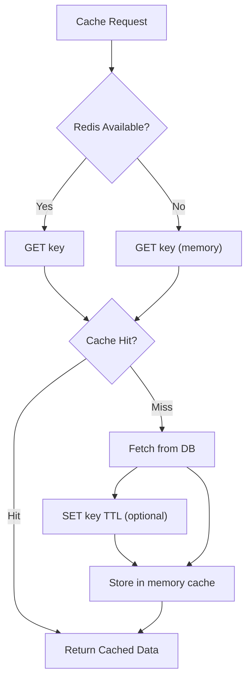
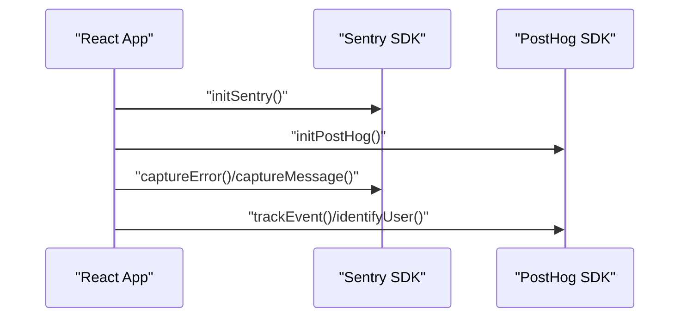
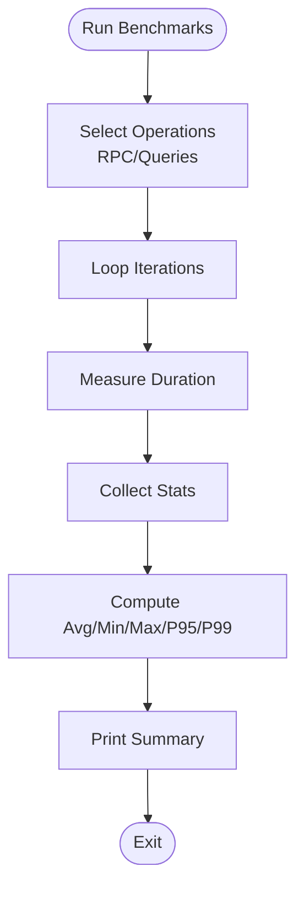
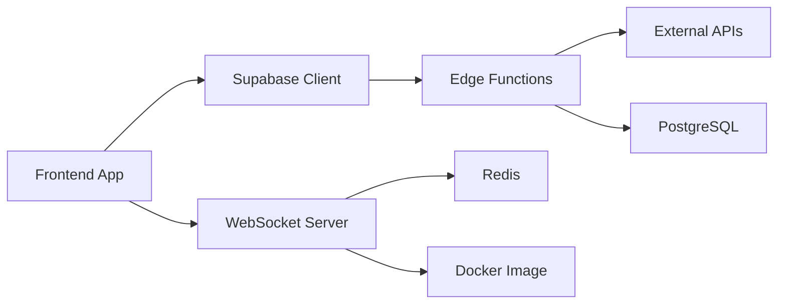

# Serverless Architecture

<cite>
**Referenced Files in This Document**
- [config.toml](file://supabase/config.toml)
- [PHASE2_EDGE_FUNCTIONS.md](file://supabase/functions/PHASE2_EDGE_FUNCTIONS.md)
- [client.ts](file://src/integrations/supabase/client.ts)
- [server.ts](file://websocket-server/src/server.ts)
- [Dockerfile](file://websocket-server/Dockerfile)
- [package.json](file://websocket-server/package.json)
- [cache.ts](file://src/lib/cache.ts)
- [analytics.ts](file://src/lib/analytics.ts)
- [sentry.ts](file://src/lib/sentry.ts)
- [performance-benchmark.ts](file://scripts/performance-benchmark.ts)
- [vercel.json](file://vercel.json)
- [package.json](file://package.json)
- [main.tsx](file://src/main.tsx)
</cite>

## Table of Contents
1. [Introduction](#introduction)
2. [Project Structure](#project-structure)
3. [Core Components](#core-components)
4. [Architecture Overview](#architecture-overview)
5. [Detailed Component Analysis](#detailed-component-analysis)
6. [Dependency Analysis](#dependency-analysis)
7. [Performance Considerations](#performance-considerations)
8. [Troubleshooting Guide](#troubleshooting-guide)
9. [Conclusion](#conclusion)
10. [Appendices](#appendices)

## Introduction
This document describes the serverless computing model implementation for the platform, focusing on the Supabase edge function execution environment, containerized WebSocket server deployment, and supporting infrastructure. It explains cost-effective scaling mechanisms, cold start optimization, resource allocation strategies, and the integration between edge functions and database triggers, webhook processing, and scheduled job execution. It also covers container orchestration for WebSocket services, Redis caching layer, and external API integrations, along with monitoring and observability patterns, logging strategies, and performance benchmarking approaches tailored for serverless workloads.

## Project Structure
The serverless architecture spans three primary areas:
- Supabase edge functions for event-driven automation and scheduled jobs
- A containerized WebSocket server for real-time fleet tracking
- Frontend and shared libraries for caching, analytics, and error reporting

```mermaid
graph TB
subgraph "Frontend"
FE_App["React App<br/>Monitoring Init<br/>Analytics & Sentry"]
end
subgraph "Supabase Platform"
SF_Config["Functions Config<br/>JWT Verification Off"]
SF_Edge["Edge Functions<br/>auto-assign-driver<br/>send-invoice-email"]
DB["PostgreSQL<br/>Tables & Triggers"]
CRON["pg_cron<br/>Scheduled Jobs"]
NET["pg_net<br/>HTTP Calls"]
end
subgraph "WebSocket Service"
WS_Server["Socket.io Server<br/>Redis Adapter"]
WS_Docker["Docker Image<br/>Multi-stage Build"]
WS_Redis["Redis Pub/Sub"]
end
FE_App --> |"HTTP/Edge Functions"| SF_Edge
SF_Edge --> |"Database Ops"| DB
SF_Edge --> |"HTTP Calls"| NET
DB --> |"Triggers"| SF_Edge
CRON --> |"Schedule"| SF_Edge
FE_App --> |"Real-time Updates"| WS_Server
WS_Server <- --> |"Pub/Sub"| WS_Redis
WS_Server --> |"Container"| WS_Docker
```

**Diagram sources**
- [config.toml:1-59](file://supabase/config.toml#L1-L59)
- [PHASE2_EDGE_FUNCTIONS.md:1-411](file://supabase/functions/PHASE2_EDGE_FUNCTIONS.md#L1-L411)
- [server.ts:1-256](file://websocket-server/src/server.ts#L1-L256)
- [Dockerfile:1-96](file://websocket-server/Dockerfile#L1-L96)

**Section sources**
- [config.toml:1-59](file://supabase/config.toml#L1-L59)
- [PHASE2_EDGE_FUNCTIONS.md:1-411](file://supabase/functions/PHASE2_EDGE_FUNCTIONS.md#L1-L411)
- [server.ts:1-256](file://websocket-server/src/server.ts#L1-L256)
- [Dockerfile:1-96](file://websocket-server/Dockerfile#L1-L96)

## Core Components
- Supabase edge functions: Two phase-2 functions automate driver assignment and invoice email dispatch. They rely on Supabase’s Deno runtime, use service role keys for database operations, and integrate with external APIs (e.g., Resend).
- Database triggers and scheduled jobs: PostgreSQL triggers and pg_cron enable automated workflows, invoking edge functions on data changes or on intervals.
- WebSocket server: A containerized Socket.io server with Redis adapter supports multi-instance scaling, JWT-based authentication, and health/readiness probes.
- Caching layer: A Redis-backed cache manager with in-memory fallback reduces database load and improves response times.
- Observability: PostHog analytics and Sentry SDKs provide telemetry and error tracking; a performance benchmarking suite measures query and RPC latency.

**Section sources**
- [PHASE2_EDGE_FUNCTIONS.md:1-411](file://supabase/functions/PHASE2_EDGE_FUNCTIONS.md#L1-L411)
- [config.toml:1-59](file://supabase/config.toml#L1-L59)
- [server.ts:1-256](file://websocket-server/src/server.ts#L1-L256)
- [cache.ts:1-199](file://src/lib/cache.ts#L1-L199)
- [analytics.ts:1-170](file://src/lib/analytics.ts#L1-L170)
- [sentry.ts:1-73](file://src/lib/sentry.ts#L1-L73)

## Architecture Overview
The system leverages Supabase’s managed edge functions for serverless compute, PostgreSQL for persistence, and optional extensions (pg_net, pg_cron) for outbound HTTP calls and scheduling. The WebSocket server complements the real-time needs of fleet operations, orchestrated behind containerization and Redis for horizontal scaling.



**Diagram sources**
- [PHASE2_EDGE_FUNCTIONS.md:224-284](file://supabase/functions/PHASE2_EDGE_FUNCTIONS.md#L224-L284)
- [config.toml:1-59](file://supabase/config.toml#L1-L59)

## Detailed Component Analysis

### Supabase Edge Functions Execution Environment
- Runtime and dependencies: Functions run on Deno with URL-imported modules; no npm dependencies are required at deployment time.
- Invocation: The frontend invokes functions via the Supabase client or raw HTTP requests.
- Triggers and scheduling: Database triggers call functions using pg_net; scheduled jobs use pg_cron to periodically invoke functions.
- Security: JWT verification toggled off in configuration; service role keys enable privileged database operations.



**Diagram sources**
- [PHASE2_EDGE_FUNCTIONS.md:325-377](file://supabase/functions/PHASE2_EDGE_FUNCTIONS.md#L325-L377)

**Section sources**
- [PHASE2_EDGE_FUNCTIONS.md:1-411](file://supabase/functions/PHASE2_EDGE_FUNCTIONS.md#L1-L411)
- [config.toml:1-59](file://supabase/config.toml#L1-L59)
- [client.ts:1-57](file://src/integrations/supabase/client.ts#L1-L57)

### Database Triggers and Scheduled Jobs
- Trigger example: On insertion of a delivery with a pending status, a trigger function calls the driver assignment edge function via HTTP.
- Scheduled job: A cron job runs every five minutes to pick a pending delivery and invoke the assignment function.
- Required migrations: Additional columns and indexes are added to optimize assignment workflows.



**Diagram sources**
- [PHASE2_EDGE_FUNCTIONS.md:258-302](file://supabase/functions/PHASE2_EDGE_FUNCTIONS.md#L258-L302)

**Section sources**
- [PHASE2_EDGE_FUNCTIONS.md:258-322](file://supabase/functions/PHASE2_EDGE_FUNCTIONS.md#L258-L322)

### Containerized WebSocket Server Deployment
- Multi-stage Docker build: Optimizes production image size and enforces non-root execution.
- Socket.io with Redis adapter: Enables multi-instance deployments and horizontal scaling.
- Health and readiness: Dedicated endpoints expose server status and Redis health checks.
- Graceful shutdown: Ensures clean termination of connections, Redis, and database resources.



**Diagram sources**
- [server.ts:1-256](file://websocket-server/src/server.ts#L1-L256)
- [Dockerfile:1-96](file://websocket-server/Dockerfile#L1-L96)
- [package.json:1-44](file://websocket-server/package.json#L1-L44)

**Section sources**
- [server.ts:1-256](file://websocket-server/src/server.ts#L1-L256)
- [Dockerfile:1-96](file://websocket-server/Dockerfile#L1-L96)
- [package.json:1-44](file://websocket-server/package.json#L1-L44)

### Caching Layer and Resource Allocation
- Redis-backed cache manager with in-memory fallback ensures resilience when Redis is unavailable.
- TTL-based caching for frequently accessed data (e.g., restaurants, meals, active challenges).
- Pattern-based invalidation to maintain cache consistency.



**Diagram sources**
- [cache.ts:1-199](file://src/lib/cache.ts#L1-L199)

**Section sources**
- [cache.ts:1-199](file://src/lib/cache.ts#L1-L199)

### Monitoring and Observability
- Frontend initialization: Sentry and PostHog are initialized at app startup with environment guards and privacy filtering.
- Analytics: Event tracking, page views, and predefined event categories for user actions.
- Error reporting: Structured error capture with user context and PII redaction.



**Diagram sources**
- [main.tsx:1-50](file://src/main.tsx#L1-L50)
- [sentry.ts:1-73](file://src/lib/sentry.ts#L1-L73)
- [analytics.ts:1-170](file://src/lib/analytics.ts#L1-L170)

**Section sources**
- [main.tsx:1-50](file://src/main.tsx#L1-L50)
- [sentry.ts:1-73](file://src/lib/sentry.ts#L1-L73)
- [analytics.ts:1-170](file://src/lib/analytics.ts#L1-L170)

### Performance Benchmarking
- Automated suite measures RPC and query latencies with percentile statistics and error counts.
- Targets defined per operation; results printed with pass/fail indicators.



**Diagram sources**
- [performance-benchmark.ts:1-280](file://scripts/performance-benchmark.ts#L1-L280)

**Section sources**
- [performance-benchmark.ts:1-280](file://scripts/performance-benchmark.ts#L1-L280)

## Dependency Analysis
- Supabase edge functions depend on:
  - Supabase client for database operations
  - Optional external APIs (e.g., Resend) via pg_net
  - Database triggers and scheduled jobs for automation
- WebSocket server depends on:
  - Socket.io and Redis adapter for clustering
  - Health checks and readiness probes for container orchestration
- Frontend integrates:
  - Supabase client for function invocation
  - Analytics and error reporting SDKs
  - Vercel configuration for routing and security headers



**Diagram sources**
- [client.ts:1-57](file://src/integrations/supabase/client.ts#L1-L57)
- [PHASE2_EDGE_FUNCTIONS.md:1-411](file://supabase/functions/PHASE2_EDGE_FUNCTIONS.md#L1-L411)
- [server.ts:1-256](file://websocket-server/src/server.ts#L1-L256)
- [Dockerfile:1-96](file://websocket-server/Dockerfile#L1-L96)

**Section sources**
- [client.ts:1-57](file://src/integrations/supabase/client.ts#L1-L57)
- [package.json:1-159](file://package.json#L1-L159)

## Performance Considerations
- Cold start optimization:
  - Keep edge function bundles minimal; avoid bundling unused dependencies.
  - Use URL imports for runtime modules to reduce deployment size.
  - Prefer lightweight HTTP clients and avoid heavy synchronous I/O.
- Scaling mechanisms:
  - Horizontal scaling via multiple edge function instances and Redis-backed Socket.io servers.
  - Use pg_cron for scheduled tasks to distribute load across time.
  - Apply caching to reduce database pressure and improve latency.
- Resource allocation:
  - Configure container CPU/memory limits and health checks for WebSocket server.
  - Use environment-specific tuning (e.g., ping intervals, buffer sizes) for Socket.io.
- Cost-effectiveness:
  - Minimize external API calls; batch where possible.
  - Use database indexes and efficient queries to reduce execution time.
  - Monitor function execution duration and adjust concurrency thresholds.

[No sources needed since this section provides general guidance]

## Troubleshooting Guide
- Edge function deployment and environment:
  - Verify CLI version and project linkage; ensure secrets are set and match expected names.
  - Confirm JWT verification settings and service role key permissions.
- Database connectivity:
  - Validate URLs and RLS policies; ensure service role access is granted.
- WebSocket server:
  - Check Redis health and adapter configuration; review readiness and health endpoints.
  - Inspect graceful shutdown logs for connection and resource cleanup.
- Observability:
  - Confirm SDK initialization and environment variables; verify privacy filters for analytics and error reporting.

**Section sources**
- [PHASE2_EDGE_FUNCTIONS.md:380-411](file://supabase/functions/PHASE2_EDGE_FUNCTIONS.md#L380-L411)
- [server.ts:155-239](file://websocket-server/src/server.ts#L155-L239)

## Conclusion
The serverless architecture combines Supabase edge functions for event-driven automation, PostgreSQL with triggers and scheduled jobs, and a containerized WebSocket server for real-time fleet tracking. The design emphasizes cost-effective scaling, cold start optimization, and robust observability through caching, analytics, and error reporting. Together, these components deliver a resilient, scalable platform capable of handling dynamic workloads while maintaining strong operational visibility.

[No sources needed since this section summarizes without analyzing specific files]

## Appendices

### Supabase Edge Functions Configuration
- Functions listed in configuration with JWT verification toggled off.
- Environment variables required for service role access and external integrations.

**Section sources**
- [config.toml:1-59](file://supabase/config.toml#L1-L59)
- [PHASE2_EDGE_FUNCTIONS.md:10-31](file://supabase/functions/PHASE2_EDGE_FUNCTIONS.md#L10-L31)

### Frontend and Routing
- Vercel configuration for SPA routing and security headers.
- Frontend initialization of monitoring and analytics.

**Section sources**
- [vercel.json:1-38](file://vercel.json#L1-L38)
- [main.tsx:1-50](file://src/main.tsx#L1-L50)