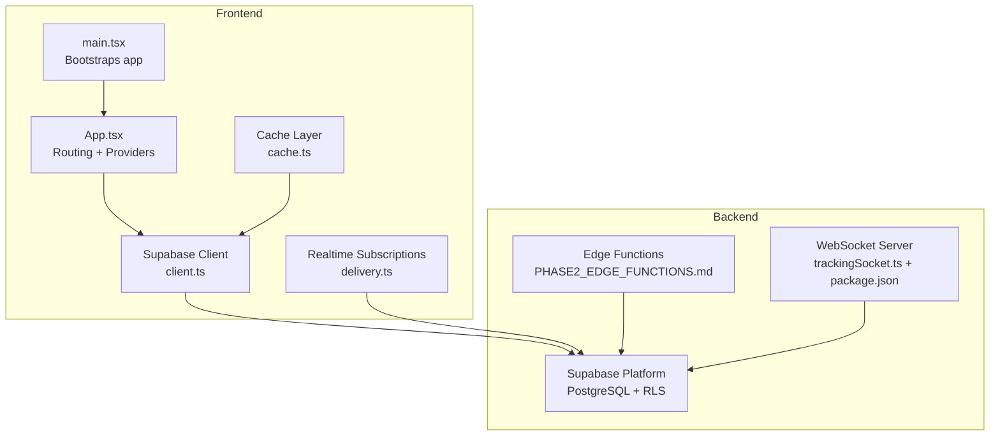
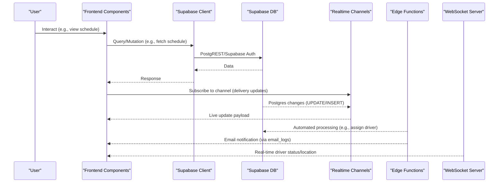
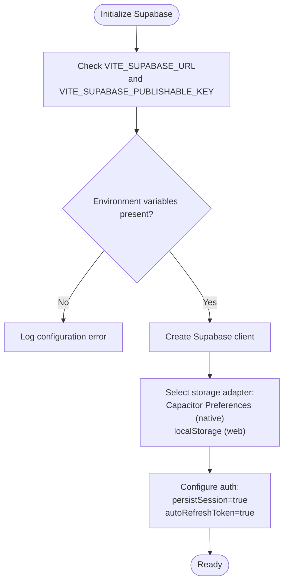
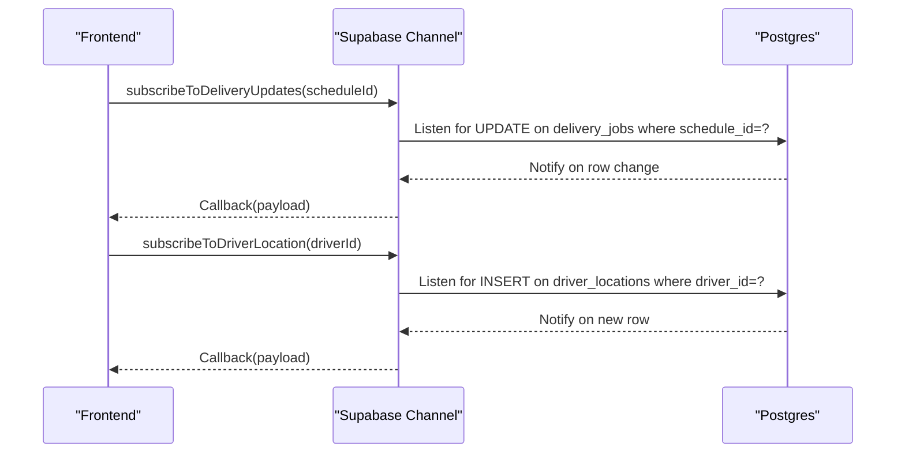
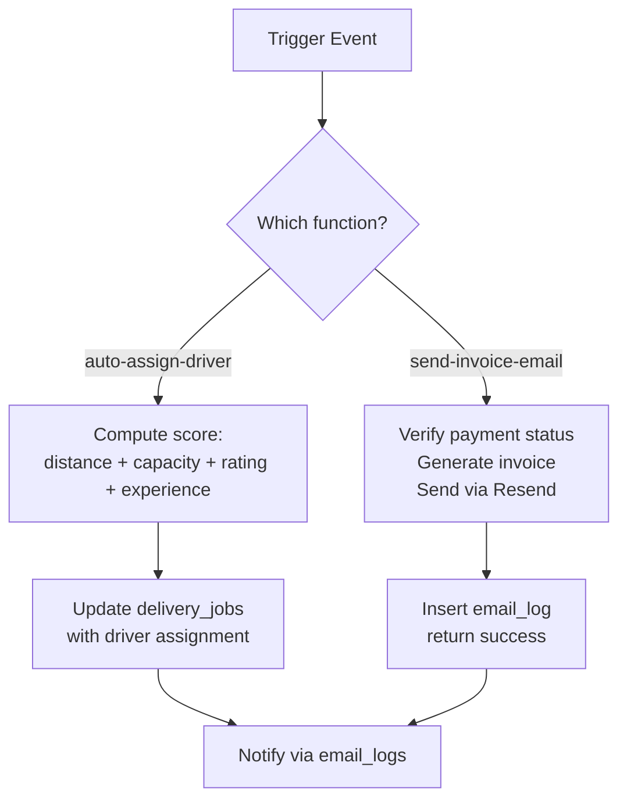
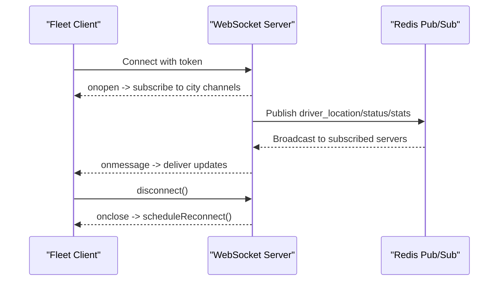
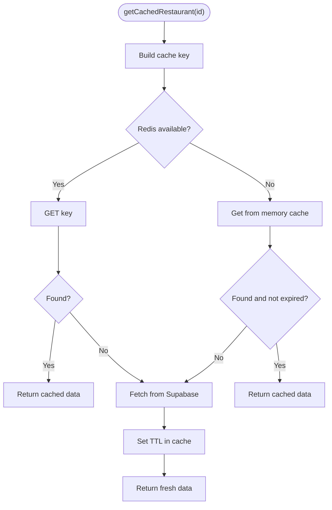
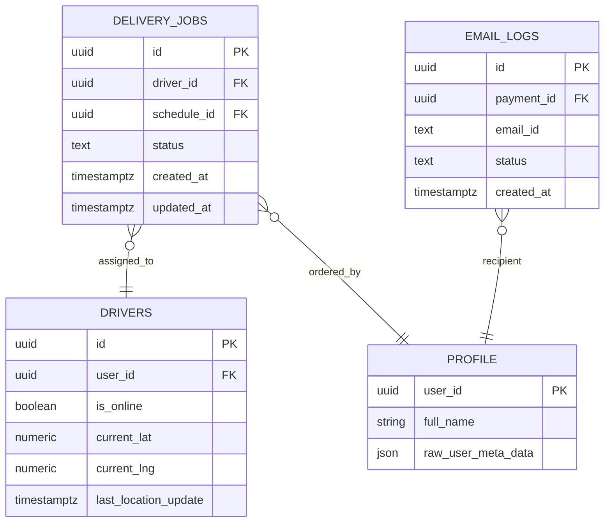
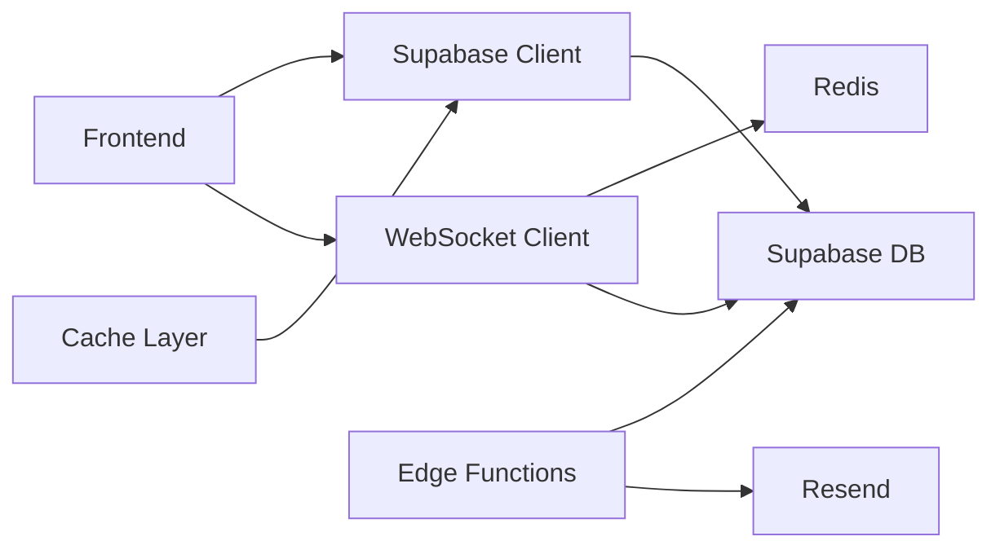

# Data Flow Architecture

<cite>
**Referenced Files in This Document**
- [App.tsx](file://src/App.tsx)
- [main.tsx](file://src/main.tsx)
- [client.ts](file://src/integrations/supabase/client.ts)
- [delivery.ts](file://src/integrations/supabase/delivery.ts)
- [types.ts](file://src/integrations/supabase/types.ts)
- [PHASE2_EDGE_FUNCTIONS.md](file://supabase/functions/PHASE2_EDGE_FUNCTIONS.md)
- [config.toml](file://supabase/config.toml)
- [cache.ts](file://src/lib/cache.ts)
- [trackingSocket.ts](file://src/fleet/services/trackingSocket.ts)
- [package.json](file://websocket-server/package.json)
- [realtime.spec.ts](file://e2e/system/realtime.spec.ts)
- [SECURITY_REMEDIATION_REPORT.md](file://SECURITY_REMEDIATION_REPORT.md)
</cite>

## Table of Contents
1. [Introduction](#introduction)
2. [Project Structure](#project-structure)
3. [Core Components](#core-components)
4. [Architecture Overview](#architecture-overview)
5. [Detailed Component Analysis](#detailed-component-analysis)
6. [Dependency Analysis](#dependency-analysis)
7. [Performance Considerations](#performance-considerations)
8. [Troubleshooting Guide](#troubleshooting-guide)
9. [Conclusion](#conclusion)

## Introduction
This document describes the data flow architecture of the Nutrio system, covering how user interactions propagate through frontend components, backend services, database operations, and real-time updates. It documents state management patterns, data synchronization strategies, caching mechanisms, Supabase Realtime for live updates, Supabase Edge Functions for serverless processing, and WebSocket connections for real-time features. It also explains validation, transformation, and security considerations across all stages.

## Project Structure
The system comprises:
- Frontend application bootstrapped in main.tsx, wrapped by providers for routing, authentication, analytics, and error boundaries.
- Supabase integration for authentication, database access, and real-time subscriptions.
- Supabase Edge Functions for automated workflows.
- Fleet WebSocket server for real-time driver tracking and fleet management.
- Caching layer for frequently accessed data.

**Diagram sources**
- [main.tsx:1-50](file://src/main.tsx#L1-L50)
- [App.tsx:139-739](file://src/App.tsx#L139-L739)
- [client.ts:1-57](file://src/integrations/supabase/client.ts#L1-L57)
- [delivery.ts:1-735](file://src/integrations/supabase/delivery.ts#L1-L735)
- [cache.ts:1-199](file://src/lib/cache.ts#L1-L199)
- [PHASE2_EDGE_FUNCTIONS.md:1-411](file://supabase/functions/PHASE2_EDGE_FUNCTIONS.md#L1-L411)
- [trackingSocket.ts:36-214](file://src/fleet/services/trackingSocket.ts#L36-L214)
- [package.json:1-44](file://websocket-server/package.json#L1-L44)

**Section sources**
- [main.tsx:1-50](file://src/main.tsx#L1-L50)
- [App.tsx:139-739](file://src/App.tsx#L139-L739)

## Core Components
- Supabase client initialization with Capacitor-native storage for sessions and auto-refresh.
- Real-time subscriptions for delivery updates and driver locations.
- Edge Functions for automated workflows (driver assignment and invoice email).
- WebSocket server for fleet tracking with Redis adapter and scaling strategies.
- Caching layer for database reads with in-memory fallback.

**Section sources**
- [client.ts:18-57](file://src/integrations/supabase/client.ts#L18-L57)
- [delivery.ts:694-734](file://src/integrations/supabase/delivery.ts#L694-L734)
- [PHASE2_EDGE_FUNCTIONS.md:34-172](file://supabase/functions/PHASE2_EDGE_FUNCTIONS.md#L34-L172)
- [trackingSocket.ts:36-214](file://src/fleet/services/trackingSocket.ts#L36-L214)
- [cache.ts:16-107](file://src/lib/cache.ts#L16-L107)

## Architecture Overview
The data flow follows a layered pattern:
- User interactions trigger frontend components and hooks.
- Data access uses Supabase client for authenticated queries and mutations.
- Real-time updates are handled via Supabase Postgres changes and WebSocket connections.
- Edge Functions automate backend tasks triggered by database events or HTTP invocations.
- Caching reduces latency and load for repeated reads.

**Diagram sources**
- [delivery.ts:694-734](file://src/integrations/supabase/delivery.ts#L694-L734)
- [PHASE2_EDGE_FUNCTIONS.md:258-322](file://supabase/functions/PHASE2_EDGE_FUNCTIONS.md#L258-L322)
- [trackingSocket.ts:36-121](file://src/fleet/services/trackingSocket.ts#L36-L121)

## Detailed Component Analysis

### Supabase Client and Authentication
- Initializes Supabase with environment variables and Capacitor-native storage for sessions.
- Enables persistent session and automatic token refresh.
- Guards against missing configuration during builds.

**Diagram sources**
- [client.ts:7-57](file://src/integrations/supabase/client.ts#L7-L57)

**Section sources**
- [client.ts:7-57](file://src/integrations/supabase/client.ts#L7-L57)

### Real-Time Subscriptions (Supabase Postgres Changes)
- Delivery updates: subscribe to UPDATE events on delivery_jobs filtered by schedule_id.
- Driver location updates: subscribe to INSERT events on driver_locations filtered by driver_id.
- These subscriptions push live updates to the UI without polling.

**Diagram sources**
- [delivery.ts:694-734](file://src/integrations/supabase/delivery.ts#L694-L734)

**Section sources**
- [delivery.ts:694-734](file://src/integrations/supabase/delivery.ts#L694-L734)

### Edge Functions (Serverless Workflows)
- auto-assign-driver: Scores and assigns nearest available driver to a delivery based on distance, capacity, rating, and experience.
- send-invoice-email: Generates and sends invoices upon payment completion, logs to email_logs.
- Both functions use Supabase service role for database operations and Resend for email delivery.
- Functions can be invoked via Supabase client or HTTP requests and can be triggered by database events.

**Diagram sources**
- [PHASE2_EDGE_FUNCTIONS.md:34-172](file://supabase/functions/PHASE2_EDGE_FUNCTIONS.md#L34-L172)
- [PHASE2_EDGE_FUNCTIONS.md:258-322](file://supabase/functions/PHASE2_EDGE_FUNCTIONS.md#L258-L322)

**Section sources**
- [PHASE2_EDGE_FUNCTIONS.md:34-172](file://supabase/functions/PHASE2_EDGE_FUNCTIONS.md#L34-L172)
- [PHASE2_EDGE_FUNCTIONS.md:258-322](file://supabase/functions/PHASE2_EDGE_FUNCTIONS.md#L258-L322)
- [config.toml:1-59](file://supabase/config.toml#L1-L59)

### WebSocket Server (Fleet Real-Time Tracking)
- Socket.IO server with Redis adapter for horizontal scaling.
- Clients authenticate via token query parameter and subscribe to city-specific channels.
- Supports sticky sessions, pub/sub broadcasting, and exponential backoff reconnection.

**Diagram sources**
- [trackingSocket.ts:36-121](file://src/fleet/services/trackingSocket.ts#L36-L121)
- [package.json:21-30](file://websocket-server/package.json#L21-L30)

**Section sources**
- [trackingSocket.ts:36-214](file://src/fleet/services/trackingSocket.ts#L36-L214)
- [package.json:1-44](file://websocket-server/package.json#L1-L44)

### Caching Layer
- Redis-backed cache with in-memory fallback when Redis is unavailable.
- TTL-based entries for restaurant, meal, and challenge data.
- Pattern-based invalidation for cache updates.

**Diagram sources**
- [cache.ts:37-107](file://src/lib/cache.ts#L37-L107)
- [cache.ts:124-177](file://src/lib/cache.ts#L124-L177)

**Section sources**
- [cache.ts:16-107](file://src/lib/cache.ts#L16-L107)
- [cache.ts:124-177](file://src/lib/cache.ts#L124-L177)

### Data Models Overview
Supabase types define core tables and enums used across the system (e.g., deliveries, drivers, profiles, email_logs). These types drive type-safe client usage and real-time subscriptions.

**Diagram sources**
- [types.ts:1-800](file://src/integrations/supabase/types.ts#L1-L800)

**Section sources**
- [types.ts:1-800](file://src/integrations/supabase/types.ts#L1-L800)

## Dependency Analysis
- Frontend depends on Supabase client for auth and data access, and on WebSocket client for fleet tracking.
- Supabase Edge Functions depend on Supabase service role keys and external services (Resend).
- WebSocket server depends on Redis for pub/sub and Postgres for driver data.
- Caching layer depends on Supabase client for data retrieval.

**Diagram sources**
- [client.ts:1-57](file://src/integrations/supabase/client.ts#L1-L57)
- [PHASE2_EDGE_FUNCTIONS.md:14-21](file://supabase/functions/PHASE2_EDGE_FUNCTIONS.md#L14-L21)
- [trackingSocket.ts:36-121](file://src/fleet/services/trackingSocket.ts#L36-L121)
- [package.json:21-30](file://websocket-server/package.json#L21-L30)
- [cache.ts:6-6](file://src/lib/cache.ts#L6-L6)

**Section sources**
- [client.ts:1-57](file://src/integrations/supabase/client.ts#L1-L57)
- [PHASE2_EDGE_FUNCTIONS.md:14-21](file://supabase/functions/PHASE2_EDGE_FUNCTIONS.md#L14-L21)
- [trackingSocket.ts:36-121](file://src/fleet/services/trackingSocket.ts#L36-L121)
- [package.json:21-30](file://websocket-server/package.json#L21-L30)
- [cache.ts:6-6](file://src/lib/cache.ts#L6-L6)

## Performance Considerations
- Real-time subscriptions minimize polling overhead and reduce latency for delivery and driver updates.
- Edge Functions offload heavy work from the client and API, enabling scalable automation.
- Caching reduces database load for frequently accessed data (restaurants, meals, challenges).
- WebSocket server scalability via Redis pub/sub and sticky sessions ensures horizontal growth.

[No sources needed since this section provides general guidance]

## Troubleshooting Guide
- Supabase configuration errors: Verify VITE_SUPABASE_URL and VITE_SUPABASE_PUBLISHABLE_KEY are set; otherwise, initialization logs an error.
- Edge Function deployment and invocation: Confirm environment variables are set and functions are deployed; use logs to diagnose failures.
- WebSocket connectivity: Check token authentication, origin validation, and reconnection logic; ensure Redis is reachable for pub/sub.
- Security hardening: Review encryption of banking data and API secret hashing; ensure proper RLS policies and audit logging.

**Section sources**
- [client.ts:10-16](file://src/integrations/supabase/client.ts#L10-L16)
- [PHASE2_EDGE_FUNCTIONS.md:380-402](file://supabase/functions/PHASE2_EDGE_FUNCTIONS.md#L380-L402)
- [trackingSocket.ts:76-94](file://src/fleet/services/trackingSocket.ts#L76-L94)
- [SECURITY_REMEDIATION_REPORT.md:13-47](file://SECURITY_REMEDIATION_REPORT.md#L13-L47)

## Conclusion
Nutrio’s data flow architecture integrates Supabase for authentication, database, and real-time capabilities, Edge Functions for serverless automation, and a WebSocket server for fleet tracking. The caching layer optimizes read performance, while robust security measures protect sensitive data. Together, these components enable responsive, scalable, and secure data pathways across the platform.