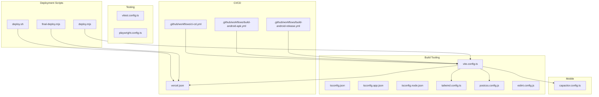
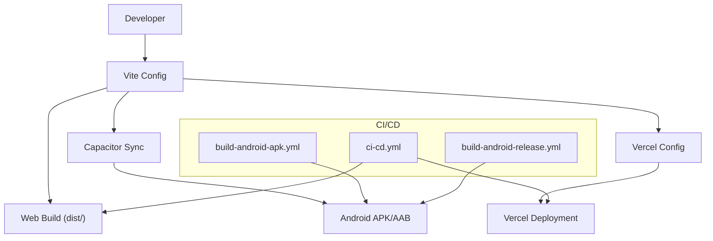

# Build Configuration

<cite>
**Referenced Files in This Document**
- [vite.config.ts](file://vite.config.ts)
- [package.json](file://package.json)
- [tailwind.config.ts](file://tailwind.config.ts)
- [postcss.config.js](file://postcss.config.js)
- [tsconfig.json](file://tsconfig.json)
- [tsconfig.app.json](file://tsconfig.app.json)
- [tsconfig.node.json](file://tsconfig.node.json)
- [capacitor.config.ts](file://capacitor.config.ts)
- [.github/workflows/ci-cd.yml](file://.github/workflows/ci-cd.yml)
- [.github/workflows/build-android-apk.yml](file://.github/workflows/build-android-apk.yml)
- [.github/workflows/build-android-release.yml](file://.github/workflows/build-android-release.yml)
- [vercel.json](file://vercel.json)
- [playwright.config.ts](file://playwright.config.ts)
- [vitest.config.ts](file://vitest.config.ts)
- [deploy.sh](file://deploy.sh)
- [deploy.mjs](file://deploy.mjs)
- [final-deploy.mjs](file://final-deploy.mjs)
- [eslint.config.js](file://eslint.config.js)
- [components.json](file://components.json)
</cite>

## Table of Contents
1. [Introduction](#introduction)
2. [Project Structure](#project-structure)
3. [Core Components](#core-components)
4. [Architecture Overview](#architecture-overview)
5. [Detailed Component Analysis](#detailed-component-analysis)
6. [Dependency Analysis](#dependency-analysis)
7. [Performance Considerations](#performance-considerations)
8. [Troubleshooting Guide](#troubleshooting-guide)
9. [Conclusion](#conclusion)
10. [Appendices](#appendices)

## Introduction
This document explains the build system configuration and deployment pipeline for the project. It covers Vite multi-target builds for web and native mobile (iOS/Android via Capacitor), TypeScript compilation settings, and Tailwind CSS integration. It also details code splitting, lazy loading strategies, bundle optimization, the GitHub Actions CI/CD pipeline, environment variable management, automated deployments, build performance optimization, asset handling, and production deployment strategies. Finally, it outlines the development workflow, Hot Module Replacement (HMR), and local development setup.

## Project Structure
The build and deployment system spans several configuration files and CI/CD workflows:
- Build tooling: Vite configuration, TypeScript configs, PostCSS/Tailwind integration
- Mobile integration: Capacitor configuration for Android/iOS
- CI/CD: GitHub Actions workflows for web and Android builds/deployments
- Testing: Vitest and Playwright configurations
- Deployment: Shell and Node scripts for Supabase and production deployment

**Diagram sources**
- [vite.config.ts](file://vite.config.ts)
- [tsconfig.json](file://tsconfig.json)
- [tsconfig.app.json](file://tsconfig.app.json)
- [tsconfig.node.json](file://tsconfig.node.json)
- [tailwind.config.ts](file://tailwind.config.ts)
- [postcss.config.js](file://postcss.config.js)
- [capacitor.config.ts](file://capacitor.config.ts)
- [.github/workflows/ci-cd.yml](file://.github/workflows/ci-cd.yml)
- [.github/workflows/build-android-apk.yml](file://.github/workflows/build-android-apk.yml)
- [.github/workflows/build-android-release.yml](file://.github/workflows/build-android-release.yml)
- [vercel.json](file://vercel.json)
- [deploy.sh](file://deploy.sh)
- [deploy.mjs](file://deploy.mjs)
- [final-deploy.mjs](file://final-deploy.mjs)

**Section sources**
- [vite.config.ts](file://vite.config.ts)
- [package.json](file://package.json)
- [tailwind.config.ts](file://tailwind.config.ts)
- [postcss.config.js](file://postcss.config.js)
- [tsconfig.json](file://tsconfig.json)
- [tsconfig.app.json](file://tsconfig.app.json)
- [tsconfig.node.json](file://tsconfig.node.json)
- [capacitor.config.ts](file://capacitor.config.ts)
- [.github/workflows/ci-cd.yml](file://.github/workflows/ci-cd.yml)
- [.github/workflows/build-android-apk.yml](file://.github/workflows/build-android-apk.yml)
- [.github/workflows/build-android-release.yml](file://.github/workflows/build-android-release.yml)
- [vercel.json](file://vercel.json)
- [playwright.config.ts](file://playwright.config.ts)
- [vitest.config.ts](file://vitest.config.ts)
- [deploy.sh](file://deploy.sh)
- [deploy.mjs](file://deploy.mjs)
- [final-deploy.mjs](file://final-deploy.mjs)
- [eslint.config.js](file://eslint.config.js)
- [components.json](file://components.json)

## Core Components
- Vite configuration defines base path, server, plugins, aliases, dependency optimization, and build outputs for web and mobile.
- TypeScript configurations split app and node environments with strict settings and bundler resolution.
- Tailwind CSS integrates via PostCSS with content scanning and custom theme extensions.
- Capacitor bridges the web build to native apps with splash screen, notifications, and allow-navigation settings.
- GitHub Actions workflows orchestrate quality checks, unit tests, builds, and deployments to Vercel and Android artifacts.
- Testing frameworks (Vitest, Playwright) complement the build pipeline with coverage and E2E testing.
- Deployment scripts automate Supabase edge functions, migrations, and hosting deployment.

**Section sources**
- [vite.config.ts](file://vite.config.ts)
- [tsconfig.app.json](file://tsconfig.app.json)
- [tsconfig.node.json](file://tsconfig.node.json)
- [tailwind.config.ts](file://tailwind.config.ts)
- [postcss.config.js](file://postcss.config.js)
- [capacitor.config.ts](file://capacitor.config.ts)
- [.github/workflows/ci-cd.yml](file://.github/workflows/ci-cd.yml)
- [.github/workflows/build-android-apk.yml](file://.github/workflows/build-android-apk.yml)
- [.github/workflows/build-android-release.yml](file://.github/workflows/build-android-release.yml)
- [playwright.config.ts](file://playwright.config.ts)
- [vitest.config.ts](file://vitest.config.ts)
- [deploy.sh](file://deploy.sh)
- [deploy.mjs](file://deploy.mjs)
- [final-deploy.mjs](file://final-deploy.mjs)

## Architecture Overview
The build and deployment architecture combines Vite for bundling, Tailwind for styling, Capacitor for native packaging, and GitHub Actions for automation. Web deployments leverage Vercel rewrites and security headers, while Android builds produce APK/AAB artifacts with optional signing.

**Diagram sources**
- [vite.config.ts](file://vite.config.ts)
- [capacitor.config.ts](file://capacitor.config.ts)
- [vercel.json](file://vercel.json)
- [.github/workflows/ci-cd.yml](file://.github/workflows/ci-cd.yml)
- [.github/workflows/build-android-apk.yml](file://.github/workflows/build-android-apk.yml)
- [.github/workflows/build-android-release.yml](file://.github/workflows/build-android-release.yml)

## Detailed Component Analysis

### Vite Configuration and Multi-Target Builds
Key aspects:
- Base path: Uses absolute path for Vercel web deployments and relative path for Capacitor mobile builds depending on mode and VERCEL environment variable.
- Server: Hosts on "::", port 5173, allows local network access, improves HMR reliability with overlay disabled and increased timeout, watches src directory.
- Plugins: React plugin with ES2020 devTarget, componentTagger in development, Sentry plugin enabled in production with org/project/authToken from environment variables.
- Aliases and dedupe: Alias "@" to "./src", deduplicate React packages.
- Dependency optimization: Pre-bundle React and JSX runtime.
- Build: Targets modern browsers (esnext), enables sourcemaps, minifies with Terser, drops console logs in production, manual chunking for vendor bundles and charts.

Code-splitting and chunking strategy:
- Manual chunks group React ecosystem, Radix UI components, and Recharts into dedicated chunks to improve caching and reduce initial payload.

HMR and development workflow:
- HMR overlay disabled and extended timeout to stabilize during development.
- Watch configuration ensures efficient rebuilds by focusing on src and excluding node_modules/dist.

**Section sources**
- [vite.config.ts](file://vite.config.ts)

### TypeScript Compilation Settings
- Root tsconfig references app and node configs and sets baseUrl and path aliases.
- App config targets ES2020, uses bundler module resolution, JSX with react-jsx, strict type checking, and path aliases.
- Node config targets ES2023, uses bundler resolution for Vite config.

**Section sources**
- [tsconfig.json](file://tsconfig.json)
- [tsconfig.app.json](file://tsconfig.app.json)
- [tsconfig.node.json](file://tsconfig.node.json)

### Tailwind CSS Integration
- Content scanning includes pages, components, app, and src directories.
- Theme extends fonts, color palette, border radius, shadows, keyframes, and animations.
- Plugins include tailwindcss-animate.
- PostCSS pipeline applies Tailwind and Autoprefixer.

**Section sources**
- [tailwind.config.ts](file://tailwind.config.ts)
- [postcss.config.js](file://postcss.config.js)
- [components.json](file://components.json)

### Capacitor Configuration for iOS/Android
- App ID and name, webDir set to dist, development server proxying to Vite dev server, production serving built files.
- Security: androidScheme set to https, cleartext enabled, allowNavigation for Supabase domains.
- Plugins: SplashScreen, PushNotifications, LocalNotifications, NativeBiometric with localized titles and descriptions.

**Section sources**
- [capacitor.config.ts](file://capacitor.config.ts)

### GitHub Actions CI/CD Pipeline
- ci-cd.yml:
  - Code quality: Node setup, npm ci, ESLint, TypeScript typecheck.
  - Unit tests: Node setup, npm ci, Vitest run with coverage, upload coverage artifact.
  - Build: Node setup, npm ci, production build with Supabase and Sentry keys injected via environment variables, upload dist artifact.
  - Staging/Production: Download dist, deploy to Vercel with environment-specific flags.
  - Security: npm audit and audit-ci checks.
- build-android-apk.yml:
  - Node and Java setup, npm ci, web build with Supabase keys, Capacitor sync, Gradle build (debug or release), publish APK as GitHub Release.
- build-android-release.yml:
  - Node and Java setup, npm ci, web build, Capacitor sync, Gradle build (unsigned), optional keystore decoding and signing for release artifacts, upload APK/AAB artifacts.

Environment variables:
- Supabase URLs and keys, Sentry DSN, PostHog key, app version injected into build jobs.

**Section sources**
- [.github/workflows/ci-cd.yml](file://.github/workflows/ci-cd.yml)
- [.github/workflows/build-android-apk.yml](file://.github/workflows/build-android-apk.yml)
- [.github/workflows/build-android-release.yml](file://.github/workflows/build-android-release.yml)

### Testing Configuration
- Vitest: Global environment, jsdom, setup files, coverage reporting, include patterns, and path alias.
- Playwright: Test directory, reporters, trace/screenshot/video defaults, projects for Chromium, baseURL override, optional local dev server configuration.

**Section sources**
- [vitest.config.ts](file://vitest.config.ts)
- [playwright.config.ts](file://playwright.config.ts)

### Deployment Scripts and Strategies
- deploy.sh: Installs Supabase CLI if missing, deploys edge functions, pushes migrations, builds app, deploys to Supabase Hosting.
- deploy.mjs: Validates critical and optional environment variables, runs tests, builds app, prints next steps for Supabase migrations and Vercel deployment.
- final-deploy.mjs: Checks Docker availability, verifies Supabase functions, attempts local migration verification, builds app, runs tests, validates environment variables, prints production deployment instructions.

Vercel configuration:
- Rewrites all paths to index.html for SPA routing.
- Security headers: X-Content-Type-Options, X-Frame-Options, X-XSS-Protection.
- Asset caching: Cache-Control header for /assets/.

**Section sources**
- [deploy.sh](file://deploy.sh)
- [deploy.mjs](file://deploy.mjs)
- [final-deploy.mjs](file://final-deploy.mjs)
- [vercel.json](file://vercel.json)

### Development Workflow and HMR
- Vite dev server runs on port 5173, accessible from local network, with improved HMR stability.
- Watch configuration focuses on src and excludes node_modules/dist to speed up rebuilds.
- React plugin configured with ES2020 devTarget to minimize hook-related HMR issues.
- componentTagger plugin active in development for component tagging.

**Section sources**
- [vite.config.ts](file://vite.config.ts)
- [package.json](file://package.json)

## Dependency Analysis
The build system exhibits clear separation of concerns:
- Vite orchestrates bundling, plugins, and build outputs.
- TypeScript configs isolate app and node environments.
- Tailwind and PostCSS handle styling.
- Capacitor bridges web to native.
- GitHub Actions automates quality, testing, building, and deployment.
- Testing frameworks integrate with the build pipeline.

```mermaid
graph LR
Vite["vite.config.ts"] --> Plugins["React + Sentry + Tagging"]
Vite --> Build["Rollup Options<br/>Manual Chunks"]
Vite --> Server["Dev Server + HMR"]
TSApp["tsconfig.app.json"] --> Vite
TSNode["tsconfig.node.json"] --> Vite
Tailwind["tailwind.config.ts"] --> PostCSS["postcss.config.js"]
Vite --> Tailwind
Vite --> Cap["capacitor.config.ts"]
Vite --> Vercel["vercel.json"]
W1[".github/workflows/ci-cd.yml"] --> Vite
W2[".github/workflows/build-android-apk.yml"] --> Vite
W3[".github/workflows/build-android-release.yml"] --> Vite
Vitest["vitest.config.ts"] --> Vite
PW["playwright.config.ts"] --> Vite
```

**Diagram sources**
- [vite.config.ts](file://vite.config.ts)
- [tsconfig.app.json](file://tsconfig.app.json)
- [tsconfig.node.json](file://tsconfig.node.json)
- [tailwind.config.ts](file://tailwind.config.ts)
- [postcss.config.js](file://postcss.config.js)
- [capacitor.config.ts](file://capacitor.config.ts)
- [vercel.json](file://vercel.json)
- [.github/workflows/ci-cd.yml](file://.github/workflows/ci-cd.yml)
- [.github/workflows/build-android-apk.yml](file://.github/workflows/build-android-apk.yml)
- [.github/workflows/build-android-release.yml](file://.github/workflows/build-android-release.yml)
- [vitest.config.ts](file://vitest.config.ts)
- [playwright.config.ts](file://playwright.config.ts)

**Section sources**
- [vite.config.ts](file://vite.config.ts)
- [tsconfig.app.json](file://tsconfig.app.json)
- [tsconfig.node.json](file://tsconfig.node.json)
- [tailwind.config.ts](file://tailwind.config.ts)
- [postcss.config.js](file://postcss.config.js)
- [capacitor.config.ts](file://capacitor.config.ts)
- [vercel.json](file://vercel.json)
- [.github/workflows/ci-cd.yml](file://.github/workflows/ci-cd.yml)
- [.github/workflows/build-android-apk.yml](file://.github/workflows/build-android-apk.yml)
- [.github/workflows/build-android-release.yml](file://.github/workflows/build-android-release.yml)
- [vitest.config.ts](file://vitest.config.ts)
- [playwright.config.ts](file://playwright.config.ts)

## Performance Considerations
- Modern browser target (esnext) and Terser minification improve runtime performance.
- Console log removal in production reduces bundle size and noise.
- Manual chunking separates React vendor libraries, UI primitives, and charts to improve caching and reduce initial JS.
- Sourcemaps enabled for production builds to support Sentry error tracking.
- HMR timeout increased and overlay disabled to improve developer experience and reduce disruption.
- Tailwind purging via content globs minimizes CSS size.
- Vercel headers and asset caching reduce latency and bandwidth usage.

[No sources needed since this section provides general guidance]

## Troubleshooting Guide
Common issues and resolutions:
- HMR overlay errors: Disabled overlay and increased timeout in Vite config to stabilize HMR.
- Missing environment variables: deploy.mjs and final-deploy.mjs validate critical and optional variables and exit with clear messages if missing.
- Sentry sourcemap uploads: Ensure SENTRY_ORG, SENTRY_PROJECT, and SENTRY_AUTH_TOKEN are present in production builds.
- Capacitor sync failures: Run Capacitor sync after Vite build to align native project with web output.
- Android build failures: Verify Java and Android SDK setup, Gradle cache keys, and keystore configuration for signed releases.
- Vercel routing: SPA routing relies on rewrite to index.html; ensure vercel.json is present and correct.

**Section sources**
- [vite.config.ts](file://vite.config.ts)
- [deploy.mjs](file://deploy.mjs)
- [final-deploy.mjs](file://final-deploy.mjs)
- [vercel.json](file://vercel.json)

## Conclusion
The build system leverages Vite for fast, modern builds, TypeScript for strong typing, Tailwind for scalable styling, and Capacitor for native packaging. GitHub Actions automates quality checks, testing, and deployments to Vercel and Android. The configuration emphasizes performance (manual chunking, modern target, minification), developer experience (HMR improvements), and robustness (environment validation, sourcemaps, security headers). Deployment scripts streamline Supabase and hosting tasks, while CI/CD ensures reliable, repeatable releases.

[No sources needed since this section summarizes without analyzing specific files]

## Appendices

### Environment Variables Reference
- Vercel and CI/CD:
  - VITE_SUPABASE_URL
  - VITE_SUPABASE_PUBLISHABLE_KEY
  - VITE_SENTRY_DSN
  - VITE_POSTHOG_KEY
  - SENTRY_ORG
  - SENTRY_PROJECT
  - SENTRY_AUTH_TOKEN
  - VERCEL_TOKEN
  - VERCEL_ORG_ID
  - VERCEL_PROJECT_ID
- Android release signing:
  - ANDROID_KEYSTORE_BASE64
  - ANDROID_KEY_ALIAS
  - ANDROID_KEY_PASSWORD
  - ANDROID_KEYSTORE_PASSWORD
- Deployment scripts:
  - RESEND_API_KEY (critical)
  - Optional: VITE_SENTRY_DSN, VITE_POSTHOG_KEY, SENTRY_ORG, SENTRY_PROJECT, SENTRY_AUTH_TOKEN

**Section sources**
- [.github/workflows/ci-cd.yml](file://.github/workflows/ci-cd.yml)
- [.github/workflows/build-android-release.yml](file://.github/workflows/build-android-release.yml)
- [deploy.mjs](file://deploy.mjs)
- [final-deploy.mjs](file://final-deploy.mjs)