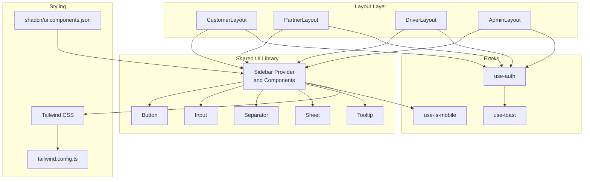
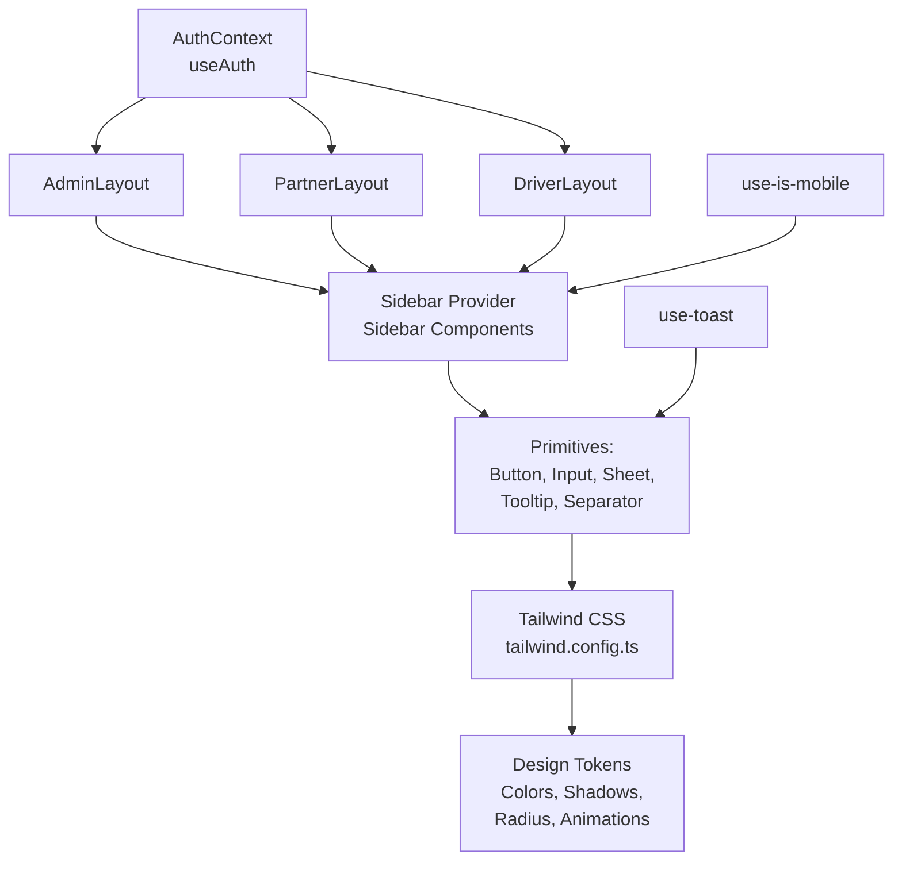
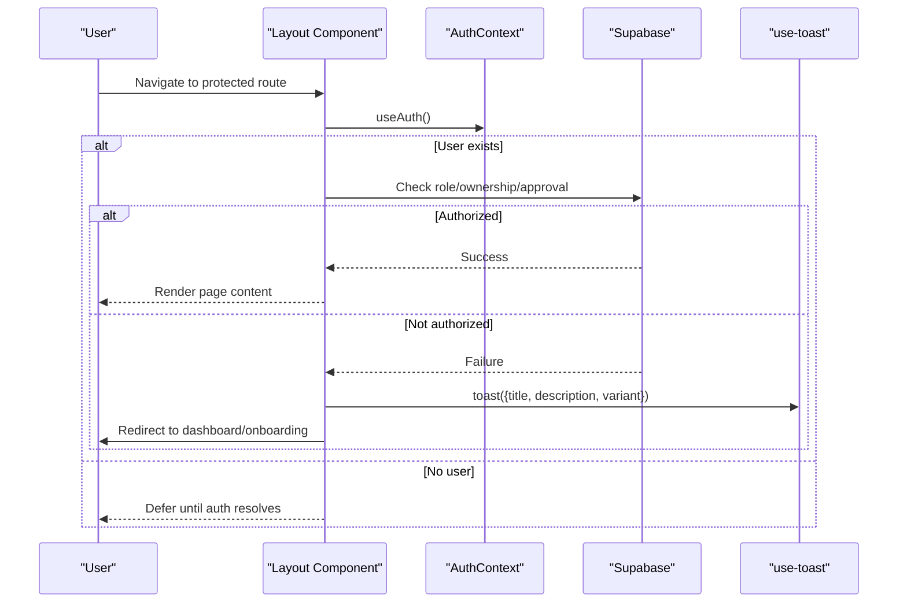
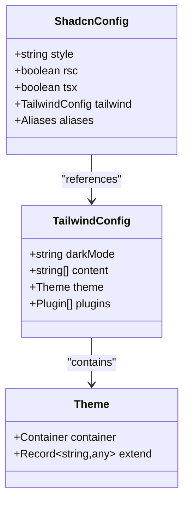
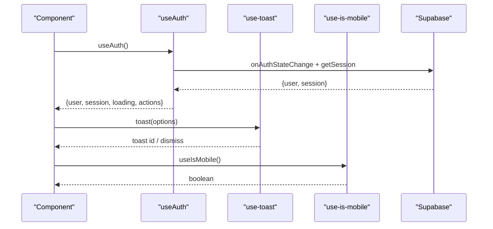
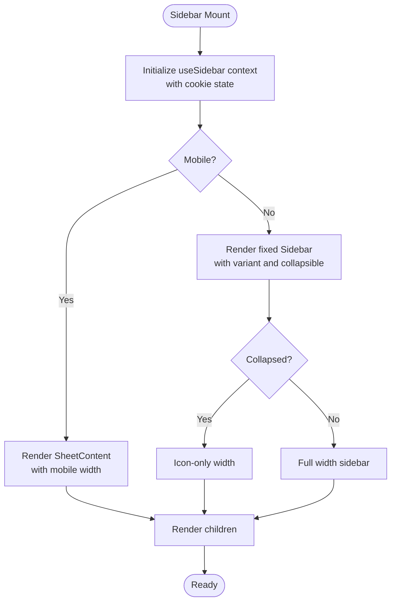
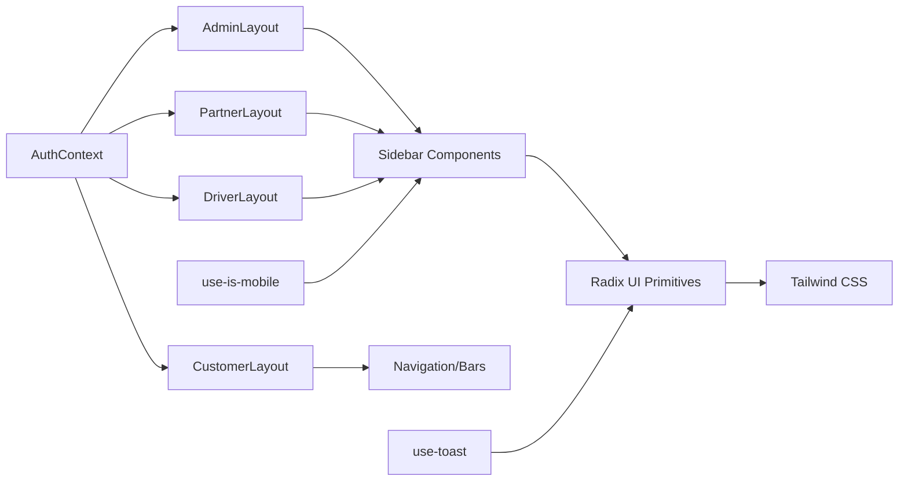

# Component Architecture

<cite>
**Referenced Files in This Document**
- [AdminLayout.tsx](file://src/components/AdminLayout.tsx)
- [PartnerLayout.tsx](file://src/components/PartnerLayout.tsx)
- [DriverLayout.tsx](file://src/components/DriverLayout.tsx)
- [CustomerLayout.tsx](file://src/components/CustomerLayout.tsx)
- [AuthContext.tsx](file://src/contexts/AuthContext.tsx)
- [use-toast.ts](file://src/hooks/use-toast.ts)
- [use-mobile.tsx](file://src/hooks/use-mobile.tsx)
- [sidebar.tsx](file://src/components/ui/sidebar.tsx)
- [utils.ts](file://src/lib/utils.ts)
- [tailwind.config.ts](file://tailwind.config.ts)
- [components.json](file://components.json)
</cite>

## Table of Contents
1. [Introduction](#introduction)
2. [Project Structure](#project-structure)
3. [Core Components](#core-components)
4. [Architecture Overview](#architecture-overview)
5. [Detailed Component Analysis](#detailed-component-analysis)
6. [Dependency Analysis](#dependency-analysis)
7. [Performance Considerations](#performance-considerations)
8. [Accessibility Implementation](#accessibility-implementation)
9. [Testing Strategies](#testing-strategies)
10. [Development Guidelines](#development-guidelines)
11. [Conclusion](#conclusion)

## Introduction
This document describes the component architecture and design system of the Nutrio application. It focuses on the layout components (CustomerLayout, PartnerLayout, DriverLayout, AdminLayout) and how they compose UI primitives and feature-specific components. It also covers the hook-based architecture for business logic separation, the UI component library built with shadcn/ui and Radix UI, styling with Tailwind CSS, state management patterns, lifecycle considerations, accessibility, testing strategies, and development guidelines.

## Project Structure
The component architecture follows a portal-centric layout pattern:
- Layout wrappers encapsulate page-level concerns: authentication checks, breadcrumbs, navigation, and responsive behavior.
- UI primitives are provided by a shared component library configured via shadcn/ui and Radix UI.
- Hooks separate cross-cutting concerns like notifications, device detection, and authentication state.
- Styling leverages Tailwind CSS with a cohesive design token system.

**Diagram sources**
- [CustomerLayout.tsx:1-24](file://src/components/CustomerLayout.tsx#L1-L24)
- [PartnerLayout.tsx:1-141](file://src/components/PartnerLayout.tsx#L1-L141)
- [DriverLayout.tsx:1-183](file://src/components/DriverLayout.tsx#L1-L183)
- [AdminLayout.tsx:1-130](file://src/components/AdminLayout.tsx#L1-L130)
- [sidebar.tsx:1-638](file://src/components/ui/sidebar.tsx#L1-L638)
- [use-toast.ts:1-83](file://src/hooks/use-toast.ts#L1-L83)
- [use-mobile.tsx:1-20](file://src/hooks/use-mobile.tsx#L1-L20)
- [AuthContext.tsx:1-131](file://src/contexts/AuthContext.tsx#L1-L131)
- [tailwind.config.ts:1-128](file://tailwind.config.ts#L1-L128)
- [components.json:1-21](file://components.json#L1-L21)

**Section sources**
- [CustomerLayout.tsx:1-24](file://src/components/CustomerLayout.tsx#L1-L24)
- [PartnerLayout.tsx:1-141](file://src/components/PartnerLayout.tsx#L1-L141)
- [DriverLayout.tsx:1-183](file://src/components/DriverLayout.tsx#L1-L183)
- [AdminLayout.tsx:1-130](file://src/components/AdminLayout.tsx#L1-L130)
- [sidebar.tsx:1-638](file://src/components/ui/sidebar.tsx#L1-L638)
- [AuthContext.tsx:1-131](file://src/contexts/AuthContext.tsx#L1-L131)
- [use-toast.ts:1-83](file://src/hooks/use-toast.ts#L1-L83)
- [use-mobile.tsx:1-20](file://src/hooks/use-mobile.tsx#L1-L20)
- [tailwind.config.ts:1-128](file://tailwind.config.ts#L1-L128)
- [components.json:1-21](file://components.json#L1-L21)

## Core Components
This section documents the four layout components and their composition patterns, props, and reusability strategies.

- CustomerLayout
  - Purpose: Provides a shared background and bottom navigation for customer-facing pages.
  - Composition: Uses Outlet for nested routes and renders CustomerNavigation at the base level.
  - Props: None; relies on routing for content.
  - Reusability: Stateless wrapper; applied consistently across customer routes.

- PartnerLayout
  - Purpose: Wraps partner/admin-like pages with a sidebar, breadcrumbs, and optional action area.
  - Composition: Checks user roles or ownership of a restaurant; conditionally renders content; integrates PartnerSidebar and Breadcrumbs.
  - Props: children, title, subtitle, action.
  - Reusability: Centralizes role gating and navigation; supports dynamic action injection.

- DriverLayout
  - Purpose: Manages driver-specific UI, including online/offline toggle, bottom navigation, and route protection.
  - Composition: Validates driver status and approval; exposes an online status toggle; renders a bottom tab bar.
  - Props: children, title, subtitle.
  - Reusability: Encapsulates driver state and navigation; suitable for all driver-related pages.

- AdminLayout
  - Purpose: Enforces admin-only access and provides admin-specific header and sidebar.
  - Composition: Verifies admin role via Supabase; displays breadcrumbs and AdminSidebar.
  - Props: children, title, subtitle.
  - Reusability: Strict access control; consistent header and sidebar across admin routes.

**Section sources**
- [CustomerLayout.tsx:1-24](file://src/components/CustomerLayout.tsx#L1-L24)
- [PartnerLayout.tsx:1-141](file://src/components/PartnerLayout.tsx#L1-L141)
- [DriverLayout.tsx:1-183](file://src/components/DriverLayout.tsx#L1-L183)
- [AdminLayout.tsx:1-130](file://src/components/AdminLayout.tsx#L1-L130)

## Architecture Overview
The architecture separates concerns across layers:
- Layout layer: Portal-specific wrappers with role checks and navigation.
- UI layer: Shared components from shadcn/ui and Radix UI, styled with Tailwind.
- Hooks layer: Cross-cutting utilities for notifications, device detection, and authentication.
- Styling layer: Tailwind configuration and shadcn/ui aliasing.

**Diagram sources**
- [AuthContext.tsx:1-131](file://src/contexts/AuthContext.tsx#L1-L131)
- [AdminLayout.tsx:1-130](file://src/components/AdminLayout.tsx#L1-L130)
- [PartnerLayout.tsx:1-141](file://src/components/PartnerLayout.tsx#L1-L141)
- [DriverLayout.tsx:1-183](file://src/components/DriverLayout.tsx#L1-L183)
- [sidebar.tsx:1-638](file://src/components/ui/sidebar.tsx#L1-L638)
- [use-toast.ts:1-83](file://src/hooks/use-toast.ts#L1-L83)
- [use-mobile.tsx:1-20](file://src/hooks/use-mobile.tsx#L1-L20)
- [tailwind.config.ts:1-128](file://tailwind.config.ts#L1-L128)

## Detailed Component Analysis

### Layout Component Composition Patterns
- Role-based gating: PartnerLayout and AdminLayout fetch user roles and either render content or redirect with toast feedback.
- Responsive sidebar: PartnerLayout and AdminLayout embed SidebarProvider/SidebarTrigger for collapsible navigation.
- Bottom navigation: DriverLayout provides a persistent bottom tab bar; CustomerLayout composes a bottom navigation component.
- Breadcrumbs: PartnerLayout and AdminLayout render breadcrumbs for improved UX and SEO.

**Diagram sources**
- [PartnerLayout.tsx:35-76](file://src/components/PartnerLayout.tsx#L35-L76)
- [AdminLayout.tsx:33-67](file://src/components/AdminLayout.tsx#L33-L67)
- [DriverLayout.tsx:26-73](file://src/components/DriverLayout.tsx#L26-L73)
- [AuthContext.tsx:36-61](file://src/contexts/AuthContext.tsx#L36-L61)
- [use-toast.ts:21-61](file://src/hooks/use-toast.ts#L21-L61)

**Section sources**
- [PartnerLayout.tsx:1-141](file://src/components/PartnerLayout.tsx#L1-L141)
- [AdminLayout.tsx:1-130](file://src/components/AdminLayout.tsx#L1-L130)
- [DriverLayout.tsx:1-183](file://src/components/DriverLayout.tsx#L1-L183)
- [AuthContext.tsx:1-131](file://src/contexts/AuthContext.tsx#L1-L131)
- [use-toast.ts:1-83](file://src/hooks/use-toast.ts#L1-L83)

### UI Component Library and Styling
- shadcn/ui configuration: components.json defines aliases for components, utils, ui, lib, and hooks, enabling consistent imports and theming.
- Radix UI primitives: Used for slots, tooltips, and composite UI behaviors.
- Tailwind CSS: Extends design tokens for colors, shadows, radius, animations, and responsive containers.
- Utility function: cn merges Tailwind classes safely.

**Diagram sources**
- [components.json:1-21](file://components.json#L1-L21)
- [tailwind.config.ts:1-128](file://tailwind.config.ts#L1-L128)

**Section sources**
- [components.json:1-21](file://components.json#L1-L21)
- [tailwind.config.ts:1-128](file://tailwind.config.ts#L1-L128)
- [utils.ts:1-7](file://src/lib/utils.ts#L1-L7)

### Hook-Based Architecture
- useAuth: Centralizes authentication state, sign-up/sign-in/sign-out, and native push notification initialization.
- use-toast: Provides a unified toast interface backed by Sonner, maintaining backward compatibility.
- use-is-mobile: Detects mobile breakpoints and manages responsive behavior across components.

**Diagram sources**
- [AuthContext.tsx:31-61](file://src/contexts/AuthContext.tsx#L31-L61)
- [use-toast.ts:67-78](file://src/hooks/use-toast.ts#L67-L78)
- [use-mobile.tsx:5-19](file://src/hooks/use-mobile.tsx#L5-L19)

**Section sources**
- [AuthContext.tsx:1-131](file://src/contexts/AuthContext.tsx#L1-L131)
- [use-toast.ts:1-83](file://src/hooks/use-toast.ts#L1-L83)
- [use-mobile.tsx:1-20](file://src/hooks/use-mobile.tsx#L1-L20)

### Sidebar Component Deep Dive
The sidebar system demonstrates advanced composition:
- Context-driven state: SidebarProvider manages expanded/collapsed/open states and cookies.
- Responsive behavior: Mobile vs desktop rendering with keyboard shortcuts and sheet overlays.
- Variants and collapsibility: Supports offcanvas, icon, and none modes with variant-specific styling.
- Menu primitives: Menu, MenuItem, MenuButton, MenuAction, MenuBadge, MenuSub, and Skeleton components.

**Diagram sources**
- [sidebar.tsx:43-129](file://src/components/ui/sidebar.tsx#L43-L129)
- [sidebar.tsx:131-216](file://src/components/ui/sidebar.tsx#L131-L216)

**Section sources**
- [sidebar.tsx:1-638](file://src/components/ui/sidebar.tsx#L1-L638)

## Dependency Analysis
The component hierarchy exhibits clear separation of concerns:
- Layout components depend on AuthContext for user/session state and on use-toast for user feedback.
- Layout components rely on the shared UI library for navigation and responsive behavior.
- Hooks are consumed by components and contexts, minimizing duplication.

**Diagram sources**
- [AuthContext.tsx:1-131](file://src/contexts/AuthContext.tsx#L1-L131)
- [AdminLayout.tsx:1-130](file://src/components/AdminLayout.tsx#L1-L130)
- [PartnerLayout.tsx:1-141](file://src/components/PartnerLayout.tsx#L1-L141)
- [DriverLayout.tsx:1-183](file://src/components/DriverLayout.tsx#L1-L183)
- [CustomerLayout.tsx:1-24](file://src/components/CustomerLayout.tsx#L1-L24)
- [sidebar.tsx:1-638](file://src/components/ui/sidebar.tsx#L1-L638)
- [use-toast.ts:1-83](file://src/hooks/use-toast.ts#L1-L83)
- [use-mobile.tsx:1-20](file://src/hooks/use-mobile.tsx#L1-L20)

**Section sources**
- [AuthContext.tsx:1-131](file://src/contexts/AuthContext.tsx#L1-L131)
- [AdminLayout.tsx:1-130](file://src/components/AdminLayout.tsx#L1-L130)
- [PartnerLayout.tsx:1-141](file://src/components/PartnerLayout.tsx#L1-L141)
- [DriverLayout.tsx:1-183](file://src/components/DriverLayout.tsx#L1-L183)
- [CustomerLayout.tsx:1-24](file://src/components/CustomerLayout.tsx#L1-L24)
- [sidebar.tsx:1-638](file://src/components/ui/sidebar.tsx#L1-L638)
- [use-toast.ts:1-83](file://src/hooks/use-toast.ts#L1-L83)
- [use-mobile.tsx:1-20](file://src/hooks/use-mobile.tsx#L1-L20)

## Performance Considerations
- Lazy loading and skeleton placeholders: Layouts use Skeleton components during initial checks to avoid blank screens.
- Minimal re-renders: useSidebar and useAuth memoize state and callbacks to reduce unnecessary updates.
- Cookie persistence: Sidebar state persists via cookies to avoid layout thrashing on reload.
- Responsive optimization: use-is-mobile avoids heavy computations by caching the media query result.
- Toast batching: use-toast consolidates notifications to prevent UI thrash.

[No sources needed since this section provides general guidance]

## Accessibility Implementation
- Semantic markup: Layouts use semantic headers, buttons, and lists; Sidebar components leverage Radix UI primitives for accessible interactions.
- Keyboard navigation: Sidebar supports keyboard shortcuts to toggle state.
- Screen reader support: Icons include sr-only labels; tooltips provide contextual descriptions.
- Focus management: Tooltips and sheets manage focus transitions; buttons expose focus-visible rings.
- Color contrast: Tailwind theme defines accessible foreground/background combinations.

[No sources needed since this section provides general guidance]

## Testing Strategies
- Unit tests for hooks: Validate useAuth state transitions, use-toast behavior, and use-is-mobile responsiveness.
- Integration tests for layouts: Verify role checks, redirects, and breadcrumb rendering under various auth states.
- Snapshot tests for UI primitives: Ensure sidebar variants and menu states render consistently across breakpoints.
- Accessibility tests: Use automated tools to verify ARIA attributes and keyboard interactions in sidebar and dialogs.

[No sources needed since this section provides general guidance]

## Development Guidelines
- Prefer composition over inheritance: Use SidebarProvider and AuthContext to compose behavior rather than duplicating logic.
- Keep props minimal: Layouts accept only essential props (title, subtitle, action) to maintain simplicity.
- Centralize cross-cutting concerns: Place notifications, device detection, and auth in dedicated hooks.
- Follow shadcn/ui conventions: Use aliases defined in components.json to ensure consistent imports and theming.
- Maintain Tailwind design tokens: Extend tailwind.config.ts for global changes; avoid ad-hoc color classes.

[No sources needed since this section provides general guidance]

## Conclusion
The component architecture centers on portal-specific layouts that encapsulate authentication checks, navigation, and responsive behavior. The shared UI library (shadcn/ui + Radix UI) and Tailwind CSS provide a consistent, themeable foundation. Hooks isolate cross-cutting concerns, improving modularity and testability. Adhering to the development guidelines ensures scalability and maintainability across customer, partner, driver, and admin portals.