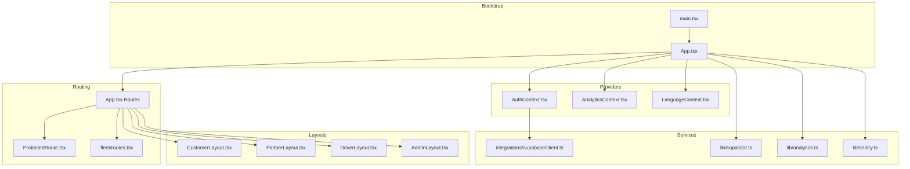
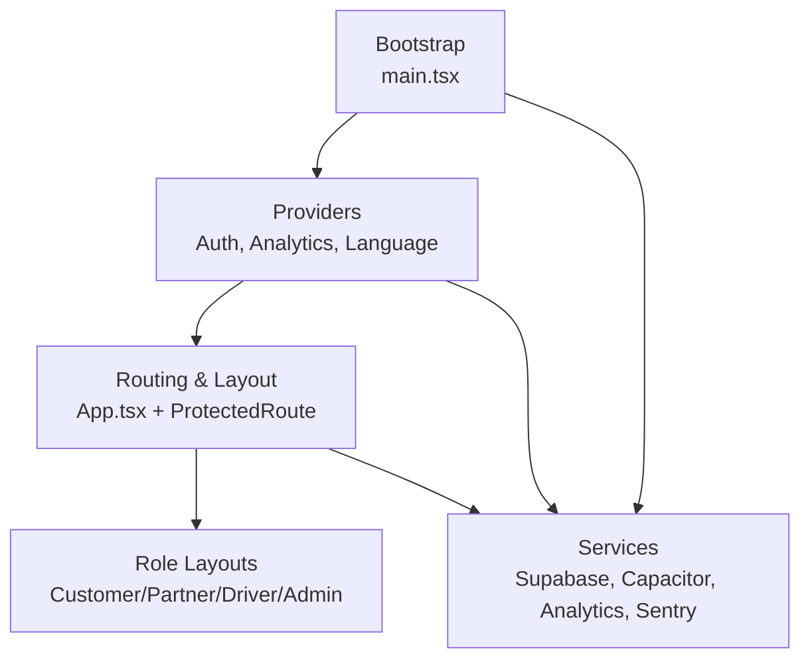
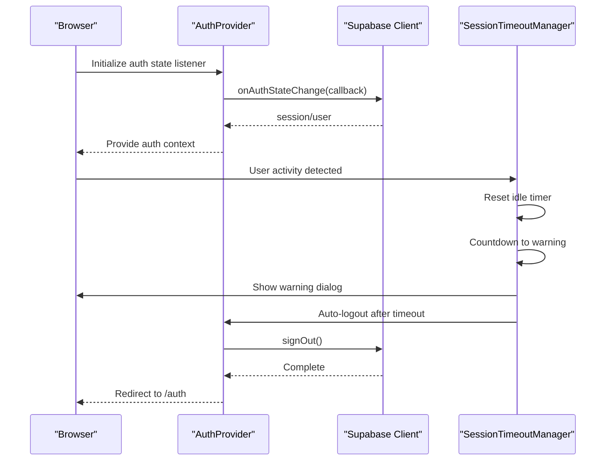
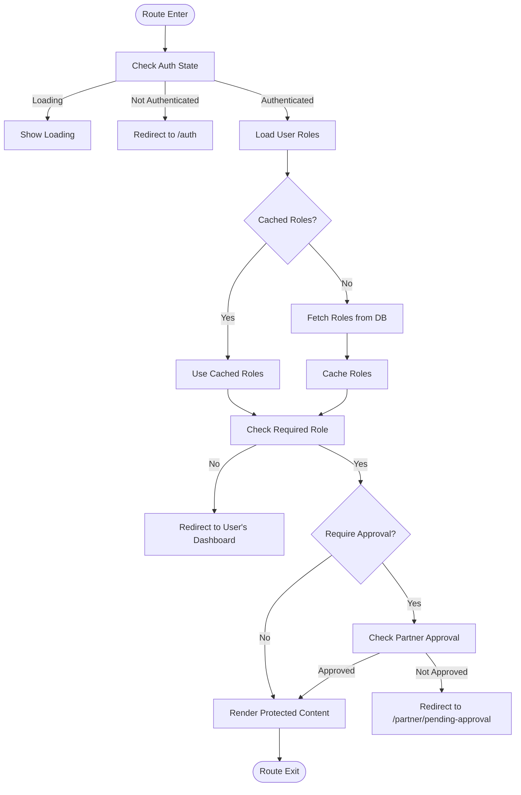
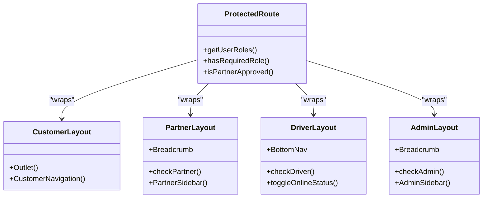
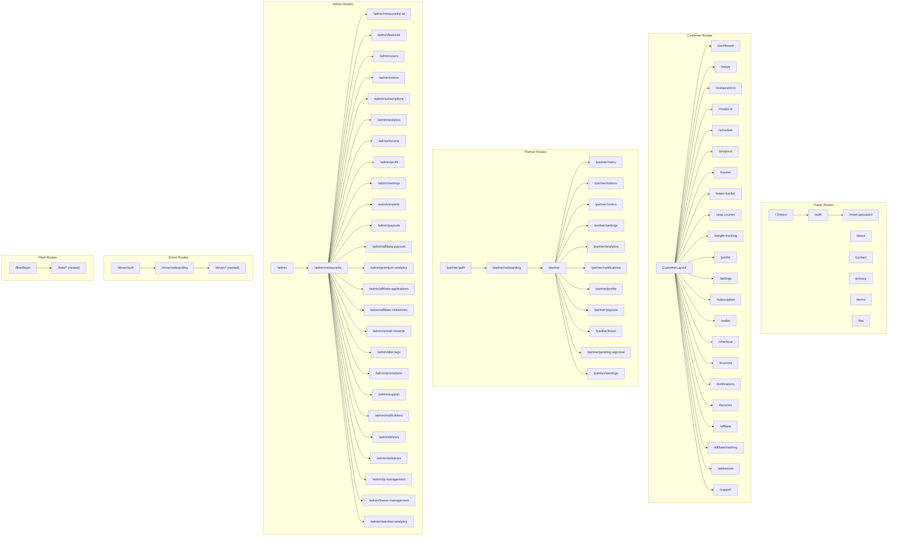
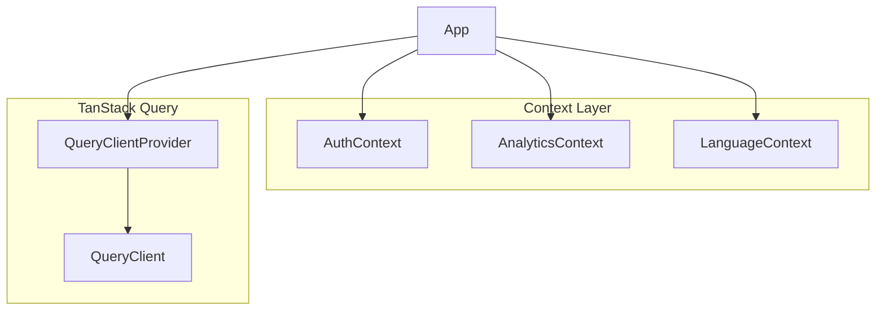
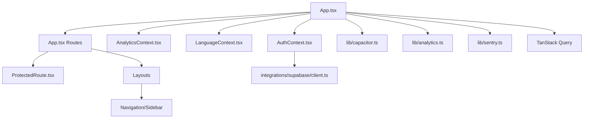

# Frontend Architecture

<cite>
**Referenced Files in This Document**
- [App.tsx](file://src/App.tsx)
- [main.tsx](file://src/main.tsx)
- [AuthContext.tsx](file://src/contexts/AuthContext.tsx)
- [ProtectedRoute.tsx](file://src/components/ProtectedRoute.tsx)
- [CustomerLayout.tsx](file://src/components/CustomerLayout.tsx)
- [PartnerLayout.tsx](file://src/components/PartnerLayout.tsx)
- [DriverLayout.tsx](file://src/components/DriverLayout.tsx)
- [AdminLayout.tsx](file://src/components/AdminLayout.tsx)
- [SessionTimeoutManager.tsx](file://src/components/SessionTimeoutManager.tsx)
- [AnalyticsContext.tsx](file://src/contexts/AnalyticsContext.tsx)
- [LanguageContext.tsx](file://src/contexts/LanguageContext.tsx)
- [routes.tsx](file://src/fleet/routes.tsx)
- [capacitor.ts](file://src/lib/capacitor.ts)
- [client.ts](file://src/integrations/supabase/client.ts)
- [CustomerNavigation.tsx](file://src/components/CustomerNavigation.tsx)
- [PartnerSidebar.tsx](file://src/components/PartnerSidebar.tsx)
- [AdminSidebar.tsx](file://src/components/AdminSidebar.tsx)
- [analytics.ts](file://src/lib/analytics.ts)
- [sentry.ts](file://src/lib/sentry.ts)
</cite>

## Table of Contents
1. [Introduction](#introduction)
2. [Project Structure](#project-structure)
3. [Core Components](#core-components)
4. [Architecture Overview](#architecture-overview)
5. [Detailed Component Analysis](#detailed-component-analysis)
6. [Dependency Analysis](#dependency-analysis)
7. [Performance Considerations](#performance-considerations)
8. [Troubleshooting Guide](#troubleshooting-guide)
9. [Conclusion](#conclusion)

## Introduction
This document describes the React frontend architecture for the Nutrio application. It covers the component hierarchy, routing system with role-based access control, state management using React Context and TanStack Query, and the lazy loading strategy. It also documents the multi-layout system (CustomerLayout, PartnerLayout, DriverLayout, AdminLayout) and how they encapsulate role-specific UI patterns, along with the authentication flow, session management, and protected route implementation. Finally, it outlines component composition patterns, reusability strategies, and performance optimizations such as code splitting.

## Project Structure
The frontend is organized around a layered architecture:
- Application bootstrap and providers in main.tsx
- Routing and layout orchestration in App.tsx
- Authentication and analytics contexts
- Role-based layouts and navigation components
- Fleet portal integration via separate routes module
- Native platform integration via Capacitor wrappers
- Supabase integration for authentication and session persistence

**Diagram sources**
- [main.tsx:1-50](file://src/main.tsx#L1-L50)
- [App.tsx:139-739](file://src/App.tsx#L139-L739)
- [AuthContext.tsx:31-131](file://src/contexts/AuthContext.tsx#L31-L131)
- [AnalyticsContext.tsx:22-61](file://src/contexts/AnalyticsContext.tsx#L22-L61)
- [LanguageContext.tsx:1-800](file://src/contexts/LanguageContext.tsx#L1-L800)
- [ProtectedRoute.tsx:139-230](file://src/components/ProtectedRoute.tsx#L139-L230)
- [routes.tsx:20-42](file://src/fleet/routes.tsx#L20-L42)
- [CustomerLayout.tsx:8-21](file://src/components/CustomerLayout.tsx#L8-L21)
- [PartnerLayout.tsx:27-141](file://src/components/PartnerLayout.tsx#L27-L141)
- [DriverLayout.tsx:16-183](file://src/components/DriverLayout.tsx#L16-L183)
- [AdminLayout.tsx:25-130](file://src/components/AdminLayout.tsx#L25-L130)
- [client.ts:47-57](file://src/integrations/supabase/client.ts#L47-L57)
- [capacitor.ts:590-640](file://src/lib/capacitor.ts#L590-L640)
- [analytics.ts:1-170](file://src/lib/analytics.ts#L1-L170)
- [sentry.ts:1-73](file://src/lib/sentry.ts#L1-L73)

**Section sources**
- [main.tsx:1-50](file://src/main.tsx#L1-L50)
- [App.tsx:139-739](file://src/App.tsx#L139-L739)

## Core Components
- App orchestrates routing, providers, lazy-loaded pages, and Suspense fallback.
- Providers supply authentication, analytics, language, and session timeout management.
- ProtectedRoute enforces role-based access and optional approval gating.
- Multi-layout system encapsulates role-specific UI patterns and navigation.
- Supabase client integrates with Capacitor Preferences for native sessions.

Key implementation highlights:
- Code splitting via React.lazy and Suspense for initial and feature-based pages.
- TanStack Query provider wraps the app for caching and optimistic updates.
- Role hierarchy and caching reduce repeated database queries for role checks.
- Layouts provide consistent navigation and breadcrumbs per role.

**Section sources**
- [App.tsx:139-739](file://src/App.tsx#L139-L739)
- [AuthContext.tsx:31-131](file://src/contexts/AuthContext.tsx#L31-L131)
- [ProtectedRoute.tsx:139-230](file://src/components/ProtectedRoute.tsx#L139-L230)
- [CustomerLayout.tsx:8-21](file://src/components/CustomerLayout.tsx#L8-L21)
- [PartnerLayout.tsx:27-141](file://src/components/PartnerLayout.tsx#L27-L141)
- [DriverLayout.tsx:16-183](file://src/components/DriverLayout.tsx#L16-L183)
- [AdminLayout.tsx:25-130](file://src/components/AdminLayout.tsx#L25-L130)
- [client.ts:47-57](file://src/integrations/supabase/client.ts#L47-L57)

## Architecture Overview
The frontend follows a layered architecture:
- Bootstrap layer initializes native features, analytics, and error boundaries.
- Provider layer manages authentication state, analytics, language, and session timeouts.
- Routing layer defines public and protected routes, with role-gated access.
- Layout layer encapsulates role-specific UI and navigation.
- Service layer integrates Supabase, analytics, and monitoring libraries.

**Diagram sources**
- [main.tsx:1-50](file://src/main.tsx#L1-L50)
- [App.tsx:139-739](file://src/App.tsx#L139-L739)
- [AuthContext.tsx:31-131](file://src/contexts/AuthContext.tsx#L31-L131)
- [AnalyticsContext.tsx:22-61](file://src/contexts/AnalyticsContext.tsx#L22-L61)
- [LanguageContext.tsx:1-800](file://src/contexts/LanguageContext.tsx#L1-L800)
- [ProtectedRoute.tsx:139-230](file://src/components/ProtectedRoute.tsx#L139-L230)
- [client.ts:47-57](file://src/integrations/supabase/client.ts#L47-L57)
- [capacitor.ts:590-640](file://src/lib/capacitor.ts#L590-L640)
- [analytics.ts:1-170](file://src/lib/analytics.ts#L1-L170)
- [sentry.ts:1-73](file://src/lib/sentry.ts#L1-L73)

## Detailed Component Analysis

### Authentication and Session Management
The authentication system is powered by Supabase with native session persistence via Capacitor Preferences. The AuthProvider listens to auth state changes and exposes sign-up, sign-in, and sign-out functions. SessionTimeoutManager monitors user activity and enforces automatic logout with warnings and cross-tab synchronization.

**Diagram sources**
- [AuthContext.tsx:36-61](file://src/contexts/AuthContext.tsx#L36-L61)
- [client.ts:47-57](file://src/integrations/supabase/client.ts#L47-L57)
- [SessionTimeoutManager.tsx:47-217](file://src/components/SessionTimeoutManager.tsx#L47-L217)

**Section sources**
- [AuthContext.tsx:31-131](file://src/contexts/AuthContext.tsx#L31-L131)
- [client.ts:47-57](file://src/integrations/supabase/client.ts#L47-L57)
- [SessionTimeoutManager.tsx:47-344](file://src/components/SessionTimeoutManager.tsx#L47-L344)

### Role-Based Access Control and Protected Routes
ProtectedRoute enforces role-based access using a role hierarchy and caches role checks to minimize database queries. It supports optional approval gating for partner routes and redirects unauthorized users to appropriate dashboards.

**Diagram sources**
- [ProtectedRoute.tsx:139-230](file://src/components/ProtectedRoute.tsx#L139-L230)
- [ProtectedRoute.tsx:40-98](file://src/components/ProtectedRoute.tsx#L40-L98)
- [ProtectedRoute.tsx:124-137](file://src/components/ProtectedRoute.tsx#L124-L137)

**Section sources**
- [ProtectedRoute.tsx:139-264](file://src/components/ProtectedRoute.tsx#L139-L264)

### Multi-Layout System
Each role has a dedicated layout that encapsulates navigation, breadcrumbs, and role-specific UI patterns:
- CustomerLayout: Background and bottom navigation for customer journeys.
- PartnerLayout: Sidebar navigation, breadcrumbs, and order notifications for restaurant owners.
- DriverLayout: Bottom navigation, online/offline toggle, and driver-specific actions.
- AdminLayout: Sidebar navigation and administrative breadcrumbs.

**Diagram sources**
- [CustomerLayout.tsx:8-21](file://src/components/CustomerLayout.tsx#L8-L21)
- [PartnerLayout.tsx:27-141](file://src/components/PartnerLayout.tsx#L27-L141)
- [DriverLayout.tsx:16-183](file://src/components/DriverLayout.tsx#L16-L183)
- [AdminLayout.tsx:25-130](file://src/components/AdminLayout.tsx#L25-L130)
- [ProtectedRoute.tsx:139-230](file://src/components/ProtectedRoute.tsx#L139-L230)

**Section sources**
- [CustomerLayout.tsx:8-24](file://src/components/CustomerLayout.tsx#L8-L24)
- [PartnerLayout.tsx:27-141](file://src/components/PartnerLayout.tsx#L27-L141)
- [DriverLayout.tsx:16-183](file://src/components/DriverLayout.tsx#L16-L183)
- [AdminLayout.tsx:25-130](file://src/components/AdminLayout.tsx#L25-L130)

### Routing and Lazy Loading Strategy
The application uses React.lazy for code splitting and Suspense for loading states. Pages are grouped by role and feature areas. The router defines public routes, protected routes with layouts, and nested driver routes.

**Diagram sources**
- [App.tsx:150-728](file://src/App.tsx#L150-L728)
- [routes.tsx:20-42](file://src/fleet/routes.tsx#L20-L42)

**Section sources**
- [App.tsx:150-728](file://src/App.tsx#L150-L728)
- [routes.tsx:20-42](file://src/fleet/routes.tsx#L20-L42)

### State Management with React Context and TanStack Query
React Context provides centralized state for authentication, analytics, and language. TanStack Query is configured at the root to manage server state, caching, and optimistic updates across the application.

**Diagram sources**
- [App.tsx:139-140](file://src/App.tsx#L139-L140)
- [AuthContext.tsx:31-131](file://src/contexts/AuthContext.tsx#L31-L131)
- [AnalyticsContext.tsx:22-61](file://src/contexts/AnalyticsContext.tsx#L22-L61)
- [LanguageContext.tsx:1-800](file://src/contexts/LanguageContext.tsx#L1-L800)

**Section sources**
- [App.tsx:139-140](file://src/App.tsx#L139-L140)
- [AuthContext.tsx:31-131](file://src/contexts/AuthContext.tsx#L31-L131)
- [AnalyticsContext.tsx:22-61](file://src/contexts/AnalyticsContext.tsx#L22-L61)
- [LanguageContext.tsx:1-800](file://src/contexts/LanguageContext.tsx#L1-L800)

### Component Composition Patterns and Reusability
- Layouts compose shared UI (navigation, breadcrumbs, sidebars) and outlet rendering.
- ProtectedRoute composes role checks and redirection logic.
- Native integration utilities abstract Capacitor APIs for haptics, notifications, and biometrics.
- Hooks encapsulate domain logic (e.g., useUserRoles, useHasRole) for reuse across components.

**Section sources**
- [CustomerNavigation.tsx:8-61](file://src/components/CustomerNavigation.tsx#L8-L61)
- [PartnerSidebar.tsx:46-132](file://src/components/PartnerSidebar.tsx#L46-L132)
- [AdminSidebar.tsx:68-151](file://src/components/AdminSidebar.tsx#L68-L151)
- [ProtectedRoute.tsx:233-264](file://src/components/ProtectedRoute.tsx#L233-L264)
- [capacitor.ts:590-640](file://src/lib/capacitor.ts#L590-L640)

## Dependency Analysis
The frontend depends on:
- Supabase for authentication and session persistence (with Capacitor Preferences on native).
- PostHog for analytics and feature flags.
- Sentry for error monitoring and replay.
- TanStack Query for caching and optimistic updates.
- React Router for routing and navigation.
- UI primitives from shadcn/ui for consistent design.

**Diagram sources**
- [App.tsx:139-739](file://src/App.tsx#L139-L739)
- [AuthContext.tsx:31-131](file://src/contexts/AuthContext.tsx#L31-L131)
- [AnalyticsContext.tsx:22-61](file://src/contexts/AnalyticsContext.tsx#L22-L61)
- [LanguageContext.tsx:1-800](file://src/contexts/LanguageContext.tsx#L1-L800)
- [client.ts:47-57](file://src/integrations/supabase/client.ts#L47-L57)
- [capacitor.ts:590-640](file://src/lib/capacitor.ts#L590-L640)
- [analytics.ts:1-170](file://src/lib/analytics.ts#L1-L170)
- [sentry.ts:1-73](file://src/lib/sentry.ts#L1-L73)

**Section sources**
- [App.tsx:139-739](file://src/App.tsx#L139-L739)
- [client.ts:47-57](file://src/integrations/supabase/client.ts#L47-L57)
- [analytics.ts:1-170](file://src/lib/analytics.ts#L1-L170)
- [sentry.ts:1-73](file://src/lib/sentry.ts#L1-L73)

## Performance Considerations
- Code splitting: Pages are lazily loaded to reduce initial bundle size.
- Caching: Role checks are cached to minimize repeated database queries.
- TanStack Query: Centralized caching and background refetching improve responsiveness.
- Suspense: Graceful loading states during navigation and lazy loads.
- Native optimizations: Capacitor integration reduces overhead for native features.

[No sources needed since this section provides general guidance]

## Troubleshooting Guide
Common issues and resolutions:
- Authentication state not persisting on native: Verify Capacitor Preferences integration and environment variables for Supabase.
- Session timeout not working: Ensure BroadcastChannel compatibility and activity event listeners are active.
- Role checks failing: Confirm database tables for user roles and restaurant ownership exist and are accessible.
- Analytics not capturing events: Check PostHog API key and environment configuration.
- Error monitoring not reporting: Verify Sentry DSN and environment variables.

**Section sources**
- [client.ts:47-57](file://src/integrations/supabase/client.ts#L47-L57)
- [SessionTimeoutManager.tsx:63-81](file://src/components/SessionTimeoutManager.tsx#L63-L81)
- [analytics.ts:9-35](file://src/lib/analytics.ts#L9-L35)
- [sentry.ts:9-37](file://src/lib/sentry.ts#L9-L37)

## Conclusion
The frontend architecture leverages React Router for routing, React Context for state management, TanStack Query for caching, and Supabase for authentication. The multi-layout system and ProtectedRoute provide a robust, role-aware user experience with strong performance characteristics through code splitting and caching. Native platform integration via Capacitor ensures a seamless mobile experience, while analytics and monitoring provide operational insights.