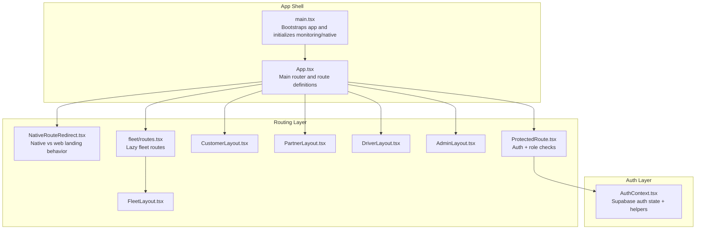
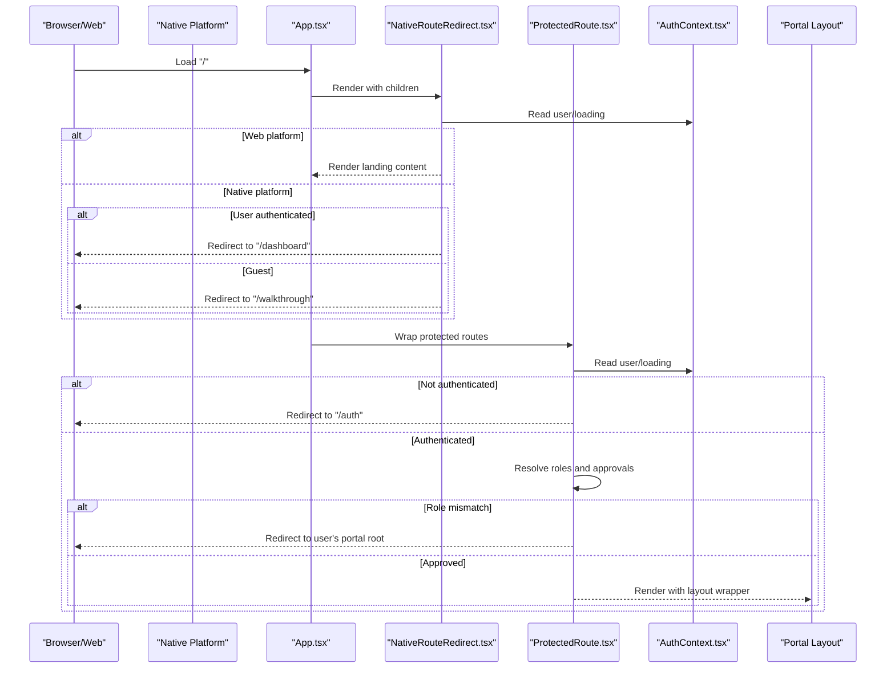
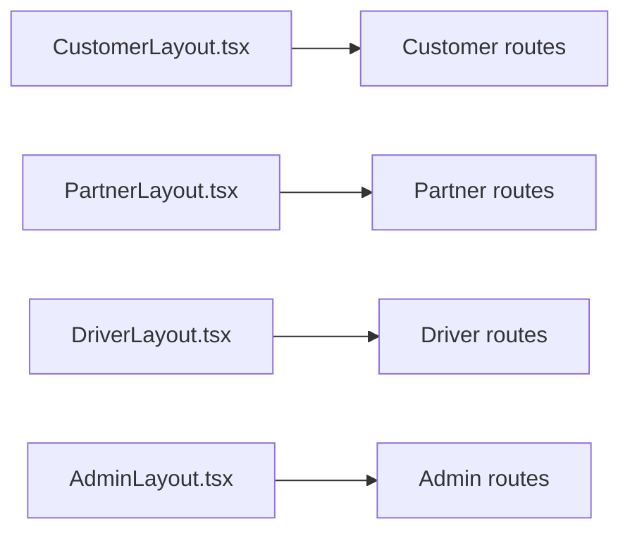
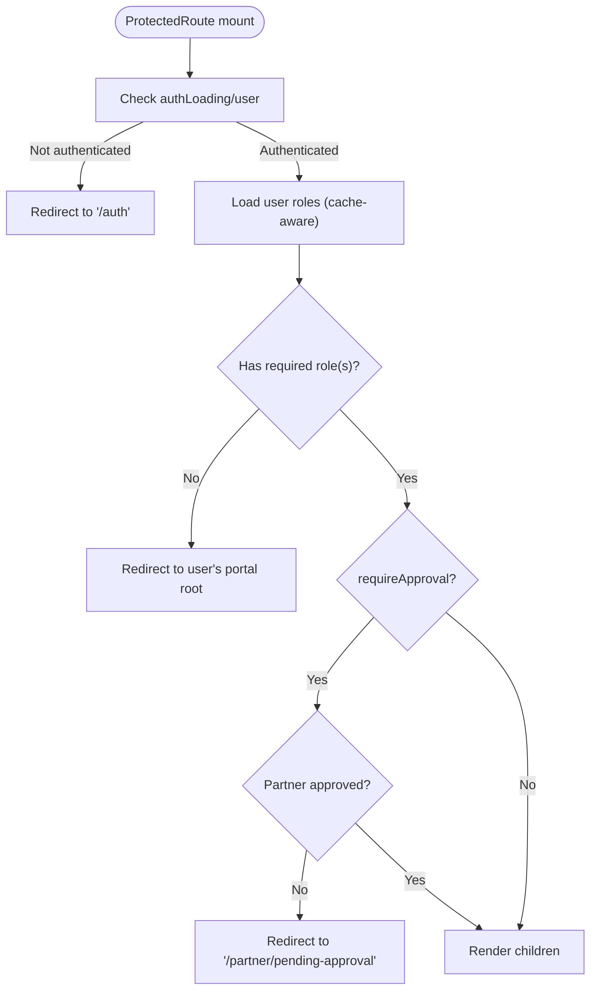
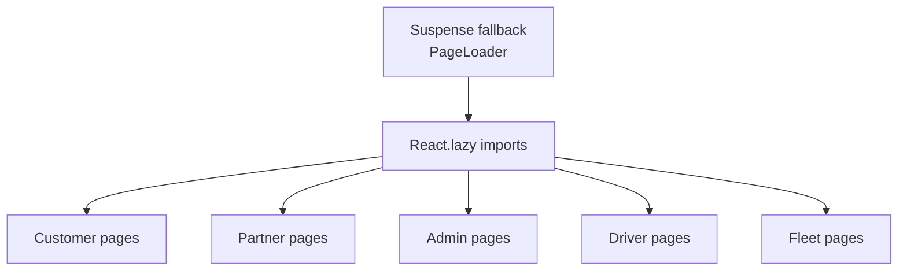
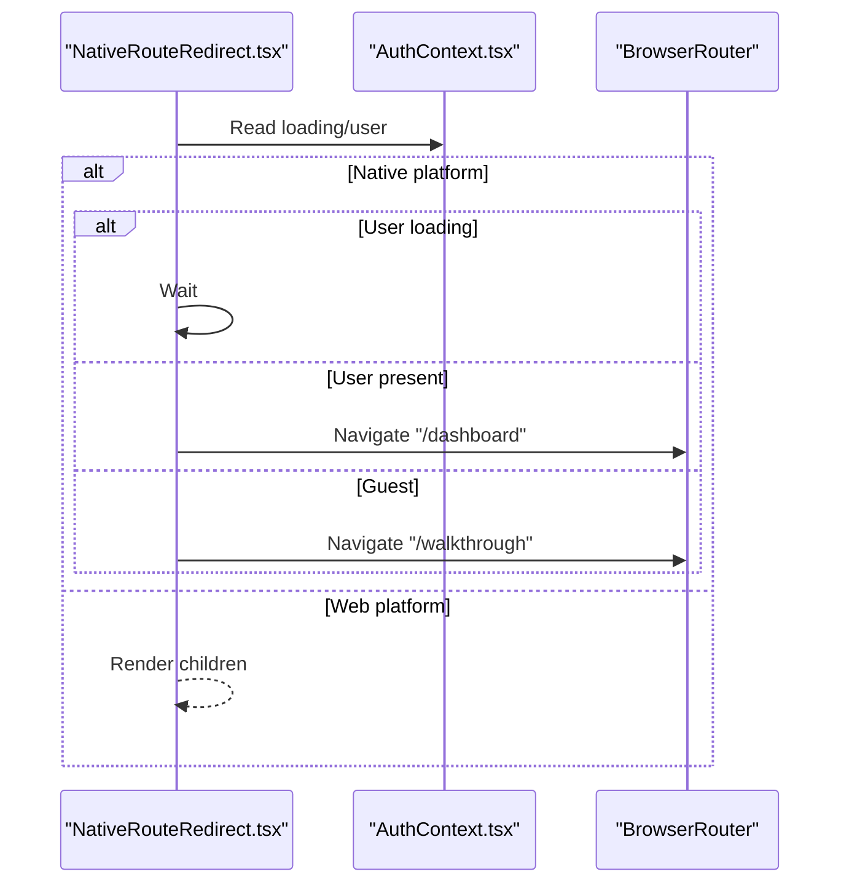
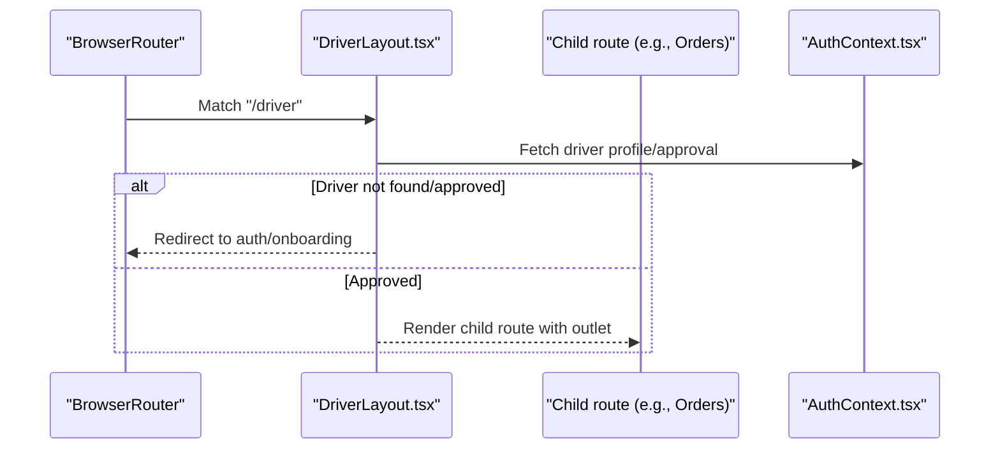
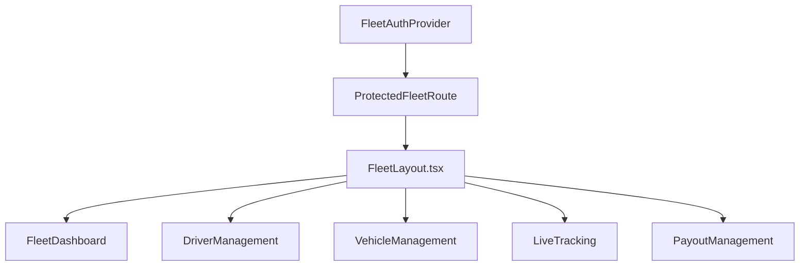
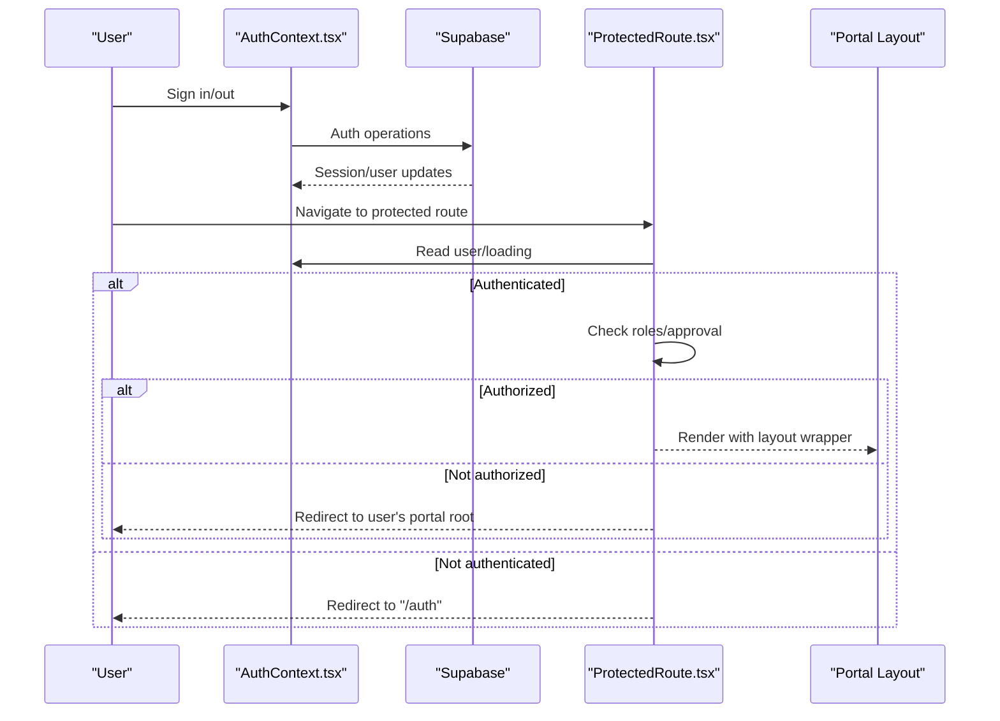
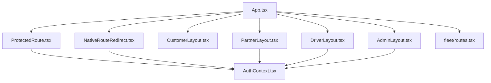

# Routing System

<cite>
**Referenced Files in This Document**
- [App.tsx](file://src/App.tsx)
- [main.tsx](file://src/main.tsx)
- [ProtectedRoute.tsx](file://src/components/ProtectedRoute.tsx)
- [CustomerLayout.tsx](file://src/components/CustomerLayout.tsx)
- [PartnerLayout.tsx](file://src/components/PartnerLayout.tsx)
- [DriverLayout.tsx](file://src/components/DriverLayout.tsx)
- [AdminLayout.tsx](file://src/components/AdminLayout.tsx)
- [NativeRouteRedirect.tsx](file://src/components/NativeRouteRedirect.tsx)
- [routes.tsx](file://src/fleet/routes.tsx)
- [FleetLayout.tsx](file://src/fleet/components/FleetLayout.tsx)
- [AuthContext.tsx](file://src/contexts/AuthContext.tsx)
</cite>

## Table of Contents
1. [Introduction](#introduction)
2. [Project Structure](#project-structure)
3. [Core Components](#core-components)
4. [Architecture Overview](#architecture-overview)
5. [Detailed Component Analysis](#detailed-component-analysis)
6. [Dependency Analysis](#dependency-analysis)
7. [Performance Considerations](#performance-considerations)
8. [Troubleshooting Guide](#troubleshooting-guide)
9. [Conclusion](#conclusion)

## Introduction
This document explains the React Router system architecture used across the multi-portal application. It covers the multi-layout routing pattern with CustomerLayout, PartnerLayout, DriverLayout, and AdminLayout wrappers, the ProtectedRoute implementation with role-based access control, lazy loading strategy using React.lazy and Suspense, route grouping by feature areas, public versus protected routes distinction, and native mobile route redirection. It also documents nested routing for the driver portal and fleet management routes, route guards, authentication flow integration, and navigation patterns.

## Project Structure
The routing system is defined centrally in the application shell and composed of:
- A main router configuration that defines all routes and wraps protected sections with guards.
- Layout components that provide shared UI scaffolding per portal.
- A ProtectedRoute guard that enforces authentication and role-based access.
- A NativeRouteRedirect component that adapts landing behavior for native platforms.
- Feature-specific route groups (e.g., fleet) that are lazily loaded and nested under providers.

**Diagram sources**
- [main.tsx:1-50](file://src/main.tsx#L1-L50)
- [App.tsx:139-739](file://src/App.tsx#L139-L739)
- [NativeRouteRedirect.tsx:1-43](file://src/components/NativeRouteRedirect.tsx#L1-L43)
- [ProtectedRoute.tsx:139-230](file://src/components/ProtectedRoute.tsx#L139-L230)
- [CustomerLayout.tsx:1-24](file://src/components/CustomerLayout.tsx#L1-L24)
- [PartnerLayout.tsx:1-141](file://src/components/PartnerLayout.tsx#L1-L141)
- [DriverLayout.tsx:1-183](file://src/components/DriverLayout.tsx#L1-L183)
- [AdminLayout.tsx:1-130](file://src/components/AdminLayout.tsx#L1-L130)
- [routes.tsx:20-41](file://src/fleet/routes.tsx#L20-L41)
- [FleetLayout.tsx:94-155](file://src/fleet/components/FleetLayout.tsx#L94-L155)
- [AuthContext.tsx:31-61](file://src/contexts/AuthContext.tsx#L31-L61)

**Section sources**
- [App.tsx:139-739](file://src/App.tsx#L139-L739)
- [main.tsx:1-50](file://src/main.tsx#L1-L50)

## Core Components
- App router: Declares all routes, lazy-loads feature areas, groups routes by portal, and applies layout wrappers and guards.
- ProtectedRoute: Enforces authentication and role checks, caches role resolution, and optionally validates partner approval.
- Layouts: Provide shared navigation, breadcrumbs, and sidebar for each portal.
- NativeRouteRedirect: Redirects native users to appropriate entry points on initial load.
- AuthContext: Centralizes Supabase authentication state and exposes sign-in/sign-out helpers.

Key responsibilities:
- Route grouping by feature area: Public pages (e.g., About, FAQ), customer routes, partner routes, admin routes, driver routes, and fleet routes.
- Nested routing: Driver portal routes nested under a dedicated layout with a bottom navigation.
- Lazy loading: Split by feature area using React.lazy and a global Suspense fallback.
- Native adaptation: Redirects native users to auth or dashboard on the home route.

**Section sources**
- [App.tsx:139-739](file://src/App.tsx#L139-L739)
- [ProtectedRoute.tsx:139-230](file://src/components/ProtectedRoute.tsx#L139-L230)
- [NativeRouteRedirect.tsx:10-42](file://src/components/NativeRouteRedirect.tsx#L10-L42)
- [AuthContext.tsx:31-130](file://src/contexts/AuthContext.tsx#L31-L130)

## Architecture Overview
The routing architecture combines declarative route definitions with guard components and layout wrappers. Authentication state is managed globally and consumed by route guards and layout components. Native behavior is handled via a dedicated redirect component.

**Diagram sources**
- [App.tsx:144-158](file://src/App.tsx#L144-L158)
- [NativeRouteRedirect.tsx:15-42](file://src/components/NativeRouteRedirect.tsx#L15-L42)
- [ProtectedRoute.tsx:139-230](file://src/components/ProtectedRoute.tsx#L139-L230)
- [AuthContext.tsx:31-61](file://src/contexts/AuthContext.tsx#L31-L61)

## Detailed Component Analysis

### Multi-Layout Routing Pattern
The application uses distinct layout wrappers per portal:
- CustomerLayout: Provides a background and shared navigation for customer-facing pages.
- PartnerLayout: Adds a sidebar, breadcrumbs, and runtime checks for partner privileges.
- DriverLayout: Manages driver onboarding, approval checks, online status, and a bottom navigation.
- AdminLayout: Provides admin sidebar and breadcrumb navigation.

These layouts are applied around grouped routes to ensure consistent UX and navigation across each portal.

**Diagram sources**
- [CustomerLayout.tsx:8-21](file://src/components/CustomerLayout.tsx#L8-L21)
- [PartnerLayout.tsx:27-140](file://src/components/PartnerLayout.tsx#L27-L140)
- [DriverLayout.tsx:16-182](file://src/components/DriverLayout.tsx#L16-L182)
- [AdminLayout.tsx:25-129](file://src/components/AdminLayout.tsx#L25-L129)

**Section sources**
- [App.tsx:174-363](file://src/App.tsx#L174-L363)
- [App.tsx:364-469](file://src/App.tsx#L364-L469)
- [App.tsx:470-698](file://src/App.tsx#L470-L698)
- [App.tsx:699-724](file://src/App.tsx#L699-L724)

### ProtectedRoute Implementation
ProtectedRoute enforces:
- Authentication: Redirects unauthenticated users to the login route.
- Role-based access control: Supports requiredRole as a single role or array of roles. Uses a role hierarchy to allow higher roles to access lower-role routes.
- Approval gating for partners: Optionally checks restaurant approval status and redirects accordingly.
- Caching: Caches resolved roles for a TTL to reduce repeated database queries.
- Fallback rendering: Allows optional custom fallback UI when role checks fail.

**Diagram sources**
- [ProtectedRoute.tsx:139-230](file://src/components/ProtectedRoute.tsx#L139-L230)
- [ProtectedRoute.tsx:40-98](file://src/components/ProtectedRoute.tsx#L40-L98)
- [ProtectedRoute.tsx:103-137](file://src/components/ProtectedRoute.tsx#L103-L137)

**Section sources**
- [ProtectedRoute.tsx:139-230](file://src/components/ProtectedRoute.tsx#L139-L230)
- [ProtectedRoute.tsx:17-24](file://src/components/ProtectedRoute.tsx#L17-L24)
- [ProtectedRoute.tsx:34-35](file://src/components/ProtectedRoute.tsx#L34-L35)

### Lazy Loading Strategy
Routes are grouped by feature area and lazily imported:
- Critical first-render pages are eagerly loaded (e.g., Index, Auth, NotFound).
- Feature areas (customer, partner, admin, driver, fleet) are wrapped with React.lazy and rendered under a global Suspense fallback.
- The Suspense boundary ensures a consistent loading experience while chunks are fetched.

**Diagram sources**
- [App.tsx:149-149](file://src/App.tsx#L149-L149)
- [App.tsx:21-117](file://src/App.tsx#L21-L117)
- [routes.tsx:6-19](file://src/fleet/routes.tsx#L6-L19)

**Section sources**
- [App.tsx:149-149](file://src/App.tsx#L149-L149)
- [App.tsx:21-117](file://src/App.tsx#L21-L117)

### Route Grouping by Feature Areas
Routes are grouped by portal and feature:
- Public pages: Landing, About, Contact, Privacy, Terms, FAQ, Auth, ResetPassword.
- Customer portal: Dashboard, Meals, Orders, Profile, Settings, Subscription, Wallet, etc.
- Partner portal: Dashboard, Menu, Orders, Analytics, Payouts, Boost, Add-ons, Pending approval, Earnings.
- Admin portal: Dashboard, Users, Orders, Analytics, Settings, Exports, Drivers, Deliveries, IP management, etc.
- Driver portal: Auth, Onboarding, Dashboard, Orders, History, Earnings, Payouts, Profile, Settings, Notifications.
- Fleet portal: Login, Dashboard, Drivers, Vehicles, Live tracking, Route optimization, Payouts.

Public vs protected distinction:
- Public routes are declared without wrapping in ProtectedRoute.
- Protected routes are wrapped with ProtectedRoute and may specify requiredRole and requireApproval.

**Section sources**
- [App.tsx:150-166](file://src/App.tsx#L150-L166)
- [App.tsx:174-363](file://src/App.tsx#L174-L363)
- [App.tsx:364-469](file://src/App.tsx#L364-L469)
- [App.tsx:470-698](file://src/App.tsx#L470-L698)
- [App.tsx:699-724](file://src/App.tsx#L699-L724)

### Native Mobile Route Redirection
NativeRouteRedirect adapts the landing behavior:
- On native platforms, it redirects guests to the walkthrough and authenticated users to the dashboard.
- On web, it renders the landing content directly.
- It waits for auth state to be ready before deciding the redirect.

**Diagram sources**
- [NativeRouteRedirect.tsx:15-42](file://src/components/NativeRouteRedirect.tsx#L15-L42)
- [AuthContext.tsx:31-61](file://src/contexts/AuthContext.tsx#L31-L61)

**Section sources**
- [NativeRouteRedirect.tsx:15-42](file://src/components/NativeRouteRedirect.tsx#L15-L42)

### Nested Routing for Driver Portal
The driver portal uses nested routes under a dedicated layout with a bottom navigation:
- Parent route mounts the DriverLayout and sets up driver state.
- Child routes define dashboards, orders, history, earnings, payouts, profile, settings, and notifications.
- The layout manages online/offline status, location tracking, and responsive navigation.

**Diagram sources**
- [App.tsx:709-724](file://src/App.tsx#L709-L724)
- [DriverLayout.tsx:24-85](file://src/components/DriverLayout.tsx#L24-L85)

**Section sources**
- [App.tsx:709-724](file://src/App.tsx#L709-L724)
- [DriverLayout.tsx:16-182](file://src/components/DriverLayout.tsx#L16-L182)

### Fleet Management Routes
Fleet routes are lazily loaded and nested under a provider and a route guard:
- A provider initializes fleet context.
- A route guard protects the fleet section.
- Nested routes include dashboard, drivers, vehicles, live tracking, route optimization, and payout management.

**Diagram sources**
- [routes.tsx:20-41](file://src/fleet/routes.tsx#L20-L41)
- [FleetLayout.tsx:94-155](file://src/fleet/components/FleetLayout.tsx#L94-L155)

**Section sources**
- [routes.tsx:20-41](file://src/fleet/routes.tsx#L20-L41)
- [FleetLayout.tsx:94-155](file://src/fleet/components/FleetLayout.tsx#L94-L155)

### Route Guards, Authentication Flow, and Navigation Patterns
- Authentication flow: AuthContext listens to Supabase auth state changes, initializes push notifications on native, and exposes sign-in/sign-out helpers.
- Navigation patterns:
  - Public routes are accessible without login.
  - Protected routes enforce authentication and role checks.
  - NativeRouteRedirect ensures native users land appropriately.
  - Layouts provide consistent navigation and breadcrumbs per portal.
  - Nested routes under DriverLayout offer a mobile-first bottom navigation.

**Diagram sources**
- [AuthContext.tsx:31-61](file://src/contexts/AuthContext.tsx#L31-L61)
- [ProtectedRoute.tsx:139-230](file://src/components/ProtectedRoute.tsx#L139-L230)

**Section sources**
- [AuthContext.tsx:31-130](file://src/contexts/AuthContext.tsx#L31-L130)
- [ProtectedRoute.tsx:139-230](file://src/components/ProtectedRoute.tsx#L139-L230)

## Dependency Analysis
The routing system exhibits clear separation of concerns:
- App.tsx orchestrates routes, lazy loading, Suspense, and layout wrappers.
- ProtectedRoute depends on AuthContext and Supabase client for role checks.
- NativeRouteRedirect depends on AuthContext and platform detection.
- Layouts depend on AuthContext for runtime checks and navigation.
- Fleet routes are modular and imported via a dedicated routes module.

**Diagram sources**
- [App.tsx:139-739](file://src/App.tsx#L139-L739)
- [ProtectedRoute.tsx:139-230](file://src/components/ProtectedRoute.tsx#L139-L230)
- [NativeRouteRedirect.tsx:15-42](file://src/components/NativeRouteRedirect.tsx#L15-L42)
- [PartnerLayout.tsx:27-140](file://src/components/PartnerLayout.tsx#L27-L140)
- [DriverLayout.tsx:16-182](file://src/components/DriverLayout.tsx#L16-L182)
- [AdminLayout.tsx:25-129](file://src/components/AdminLayout.tsx#L25-L129)
- [routes.tsx:20-41](file://src/fleet/routes.tsx#L20-L41)

**Section sources**
- [App.tsx:139-739](file://src/App.tsx#L139-L739)

## Performance Considerations
- Lazy loading: Split routes by feature area to reduce initial bundle size.
- Role caching: ProtectedRoute caches role resolution to minimize repeated database queries.
- Suspense fallback: Provide a lightweight loader to maintain perceived performance during chunk downloads.
- Native splash: On native, avoid rendering heavy content until redirect completes; rely on splash video while redirecting.

## Troubleshooting Guide
Common issues and resolutions:
- Redirect loops after login: Verify ProtectedRoute fallback behavior and ensure user roles resolve correctly.
- Partner routes inaccessible: Confirm restaurant approval status and that requireApproval is set appropriately.
- Native landing not redirecting: Ensure isNative flag and auth loading state are handled before navigation.
- Driver onboarding flow: Confirm driver record exists and approval status is checked before rendering driver routes.
- Fleet access denied: Verify fleet authentication and manager context initialization.

**Section sources**
- [ProtectedRoute.tsx:139-230](file://src/components/ProtectedRoute.tsx#L139-L230)
- [NativeRouteRedirect.tsx:15-42](file://src/components/NativeRouteRedirect.tsx#L15-L42)
- [DriverLayout.tsx:32-73](file://src/components/DriverLayout.tsx#L32-L73)
- [routes.tsx:20-41](file://src/fleet/routes.tsx#L20-L41)

## Conclusion
The routing system leverages React Router’s declarative configuration with guard components and layout wrappers to deliver a scalable, secure, and consistent multi-portal experience. ProtectedRoute centralizes authentication and role checks, while NativeRouteRedirect adapts behavior for native platforms. Lazy loading and Suspense improve performance, and nested routing provides a cohesive navigation model for portals like the driver and fleet management systems.