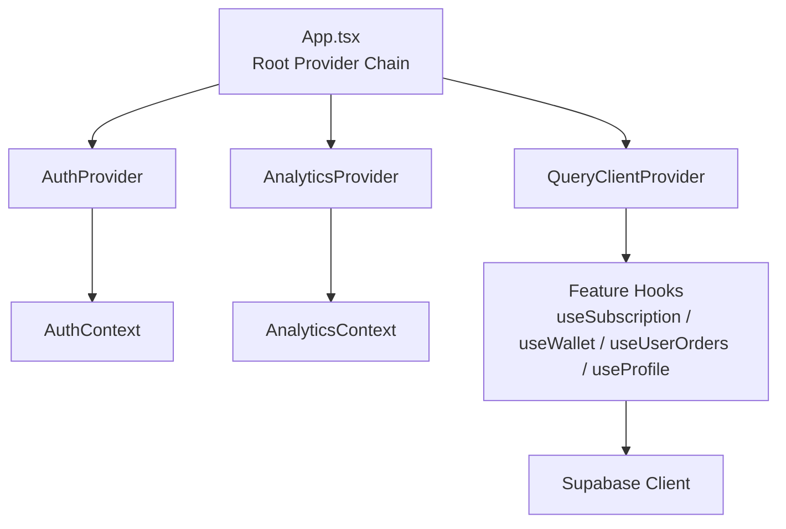
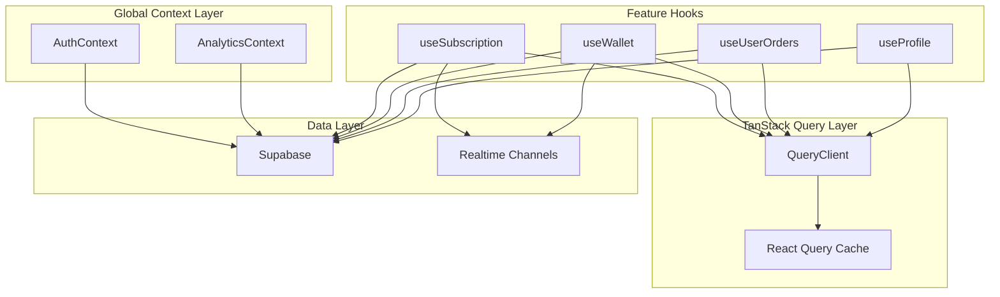
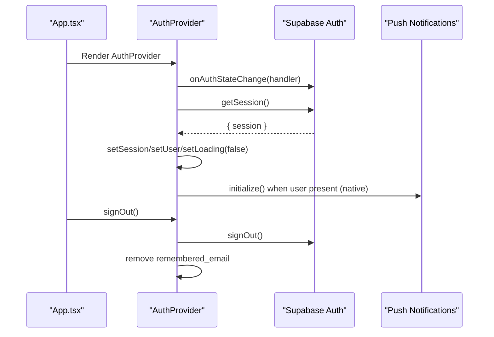
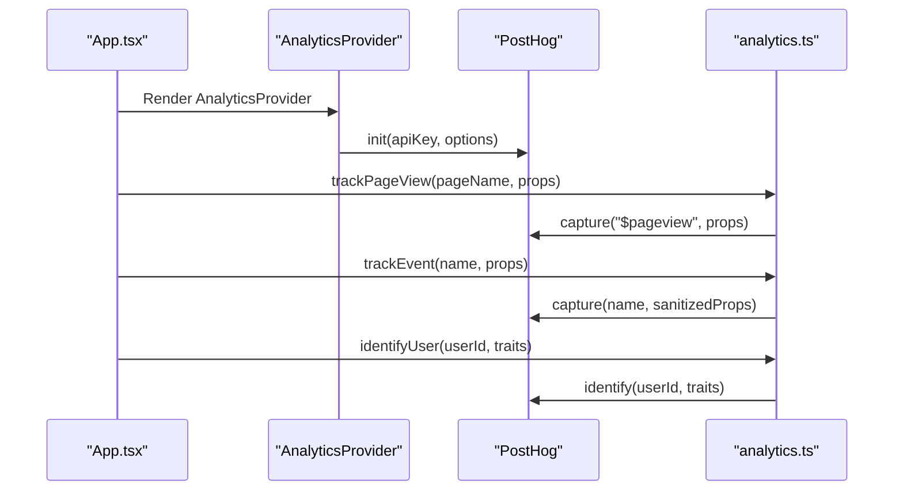
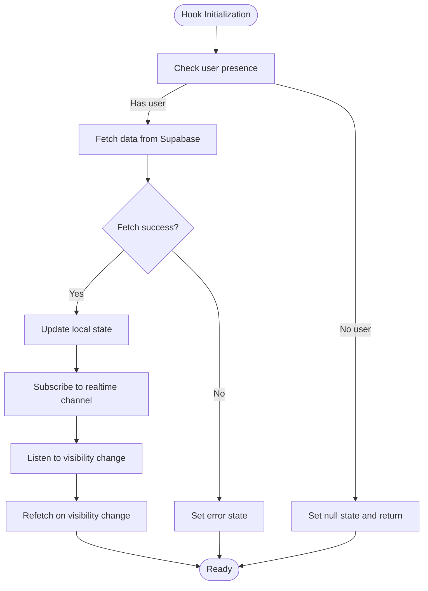
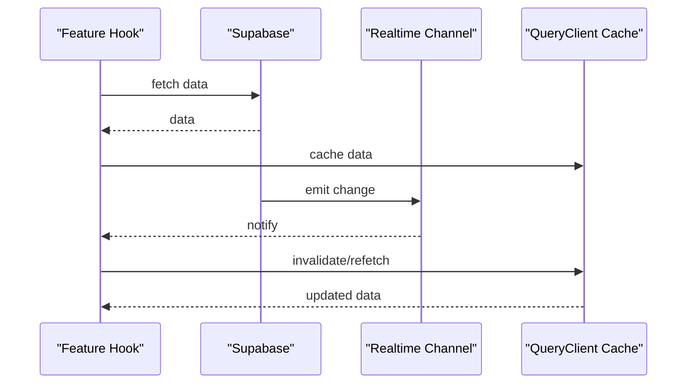
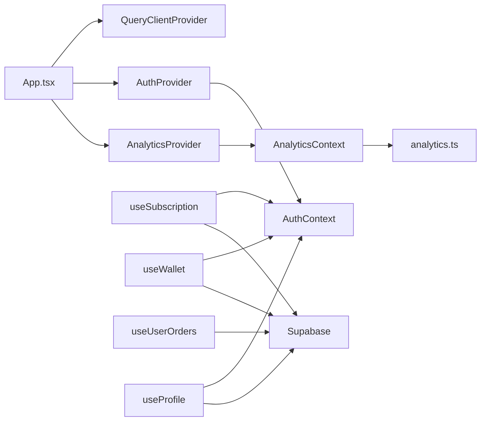

# State Management

<cite>
**Referenced Files in This Document**
- [AuthContext.tsx](file://src/contexts/AuthContext.tsx)
- [AnalyticsContext.tsx](file://src/contexts/AnalyticsContext.tsx)
- [LanguageContext.tsx](file://src/contexts/LanguageContext.tsx)
- [App.tsx](file://src/App.tsx)
- [useSubscription.ts](file://src/hooks/useSubscription.ts)
- [useWallet.ts](file://src/hooks/useWallet.ts)
- [useUserOrders.ts](file://src/hooks/useUserOrders.ts)
- [useProfile.ts](file://src/hooks/useProfile.ts)
- [analytics.ts](file://src/lib/analytics.ts)
- [cache.ts](file://src/lib/cache.ts)
</cite>

## Table of Contents
1. [Introduction](#introduction)
2. [Project Structure](#project-structure)
3. [Core Components](#core-components)
4. [Architecture Overview](#architecture-overview)
5. [Detailed Component Analysis](#detailed-component-analysis)
6. [Dependency Analysis](#dependency-analysis)
7. [Performance Considerations](#performance-considerations)
8. [Troubleshooting Guide](#troubleshooting-guide)
9. [Conclusion](#conclusion)

## Introduction
This document explains the state management architecture built with React Context and TanStack Query. It covers:
- Global authentication state and session management via AuthContext
- Analytics tracking and event logging via AnalyticsContext and the analytics library
- Feature-specific custom hooks for server state (subscriptions, wallet, orders, profiles)
- TanStack Query integration for caching, background refetch, and optimistic updates
- Patterns for context providers, hook implementations, and state synchronization
- Performance optimizations, memory management, and state persistence strategies

## Project Structure
The application initializes global providers at the root level and composes feature-specific hooks around Supabase data access. Providers:
- QueryClientProvider wraps the app to enable TanStack Query
- AuthProvider manages authentication state and session lifecycle
- AnalyticsProvider initializes analytics and exposes tracking utilities
- Additional providers (e.g., TooltipProvider, Router) are layered accordingly

**Diagram sources**
- [App.tsx:137-172](file://src/App.tsx#L137-L172)
- [AuthContext.tsx:31-130](file://src/contexts/AuthContext.tsx#L31-L130)
- [AnalyticsContext.tsx:22-61](file://src/contexts/AnalyticsContext.tsx#L22-L61)

**Section sources**
- [App.tsx:137-172](file://src/App.tsx#L137-L172)

## Core Components
- AuthContext: Manages user session, sign-up/sign-in/sign-out, and native push notification initialization. Provides a safe hook to access auth state.
- AnalyticsContext: Initializes PostHog, exposes tracking APIs, and supports page-view tracking.
- Feature Hooks: Encapsulate server state for subscriptions, wallet, orders, and profiles. They orchestrate data fetching, real-time updates, and local refetch triggers.

**Section sources**
- [AuthContext.tsx:8-25](file://src/contexts/AuthContext.tsx#L8-L25)
- [AnalyticsContext.tsx:13-47](file://src/contexts/AnalyticsContext.tsx#L13-L47)
- [useSubscription.ts:42-263](file://src/hooks/useSubscription.ts#L42-L263)
- [useWallet.ts:56-275](file://src/hooks/useWallet.ts#L56-L275)
- [useUserOrders.ts:43-161](file://src/hooks/useUserOrders.ts#L43-L161)
- [useProfile.ts:33-87](file://src/hooks/useProfile.ts#L33-L87)

## Architecture Overview
The state architecture combines three layers:
- Global Context Layer: AuthContext and AnalyticsContext for cross-cutting concerns
- TanStack Query Layer: Centralized caching, background refetch, and invalidation
- Feature Hooks: Domain-specific state logic with optimistic updates and real-time channels

**Diagram sources**
- [App.tsx:137-172](file://src/App.tsx#L137-L172)
- [AuthContext.tsx:31-130](file://src/contexts/AuthContext.tsx#L31-L130)
- [AnalyticsContext.tsx:22-61](file://src/contexts/AnalyticsContext.tsx#L22-L61)
- [useSubscription.ts:100-134](file://src/hooks/useSubscription.ts#L100-L134)
- [useWallet.ts:223-257](file://src/hooks/useWallet.ts#L223-L257)

## Detailed Component Analysis

### AuthContext: Authentication State and Session Management
AuthContext centralizes:
- Session lifecycle via Supabase auth listeners
- Sign-up, sign-in, and sign-out operations
- Native push notification initialization on sign-in
- Loading state and safe hook usage

Key behaviors:
- Subscribes to auth state changes and hydrates user/session
- On mount, retrieves existing session and sets loading state
- Enforces IP checks during sign-in (non-blocking failures)
- Clears remembered credentials on sign-out

**Diagram sources**
- [AuthContext.tsx:36-61](file://src/contexts/AuthContext.tsx#L36-L61)
- [AuthContext.tsx:114-118](file://src/contexts/AuthContext.tsx#L114-L118)

**Section sources**
- [AuthContext.tsx:31-130](file://src/contexts/AuthContext.tsx#L31-L130)

### AnalyticsContext: Analytics Tracking and Event Logging
AnalyticsContext:
- Initializes PostHog with environment-aware configuration
- Exposes tracking functions for events, page views, user identification, and resets
- Provides helper hooks for page tracking and predefined events

Analytics library utilities:
- Sanitization of sensitive properties
- Feature flag evaluation
- Error tracking helper

**Diagram sources**
- [AnalyticsContext.tsx:22-39](file://src/contexts/AnalyticsContext.tsx#L22-L39)
- [analytics.ts:3-35](file://src/lib/analytics.ts#L3-L35)
- [analytics.ts:56-76](file://src/lib/analytics.ts#L56-L76)
- [analytics.ts:38-53](file://src/lib/analytics.ts#L38-L53)

**Section sources**
- [AnalyticsContext.tsx:22-61](file://src/contexts/AnalyticsContext.tsx#L22-L61)
- [analytics.ts:1-170](file://src/lib/analytics.ts#L1-L170)

### Feature Hooks: Server State Management with TanStack Query
These hooks encapsulate domain-specific server state and integrate with Supabase:
- useSubscription: Fetches subscription status, calculates quotas, and exposes controls to pause/resume and increment usage
- useWallet: Manages wallet, transactions, top-up packages, and payment initiation
- useUserOrders: Loads orders with filtering, computes stats, and refetches on visibility change
- useProfile: Loads and updates user profile data

**Diagram sources**
- [useSubscription.ts:47-98](file://src/hooks/useSubscription.ts#L47-L98)
- [useWallet.ts:65-98](file://src/hooks/useWallet.ts#L65-L98)
- [useUserOrders.ts:50-86](file://src/hooks/useUserOrders.ts#L50-L86)
- [useProfile.ts:39-61](file://src/hooks/useProfile.ts#L39-L61)

**Section sources**
- [useSubscription.ts:42-263](file://src/hooks/useSubscription.ts#L42-L263)
- [useWallet.ts:56-275](file://src/hooks/useWallet.ts#L56-L275)
- [useUserOrders.ts:43-161](file://src/hooks/useUserOrders.ts#L43-L161)
- [useProfile.ts:33-87](file://src/hooks/useProfile.ts#L33-L87)

### TanStack Query Integration and Optimistic Updates
- QueryClientProvider is initialized at the root to enable caching and background refetch
- Hooks use callbacks and effect-driven refetch patterns to keep state fresh
- Real-time channels subscribe to Supabase events to trigger immediate updates
- Local updates can be applied optimistically and reconciled on subsequent fetches

**Diagram sources**
- [App.tsx:137-172](file://src/App.tsx#L137-L172)
- [useSubscription.ts:100-134](file://src/hooks/useSubscription.ts#L100-L134)
- [useWallet.ts:223-257](file://src/hooks/useWallet.ts#L223-L257)

**Section sources**
- [App.tsx:137-172](file://src/App.tsx#L137-L172)
- [useSubscription.ts:100-134](file://src/hooks/useSubscription.ts#L100-L134)
- [useWallet.ts:223-257](file://src/hooks/useWallet.ts#L223-L257)

### State Persistence Strategies
- Auth state persists across sessions via Supabase session storage and auth listeners
- Local loading flags and error states are maintained per hook lifecycle
- Real-time channels ensure state synchronization across tabs and devices
- Optional in-memory cache layer reduces redundant network requests for frequently accessed data

**Section sources**
- [AuthContext.tsx:36-61](file://src/contexts/AuthContext.tsx#L36-L61)
- [useSubscription.ts:125-134](file://src/hooks/useSubscription.ts#L125-L134)
- [useWallet.ts:210-221](file://src/hooks/useWallet.ts#L210-L221)
- [cache.ts:1-198](file://src/lib/cache.ts#L1-L198)

## Dependency Analysis
The provider chain and hook dependencies form a cohesive state management layer:
- App.tsx composes QueryClientProvider, AuthProvider, and AnalyticsProvider
- Feature hooks depend on AuthContext for user identity and Supabase for data
- AnalyticsContext depends on the analytics library for tracking

**Diagram sources**
- [App.tsx:137-172](file://src/App.tsx#L137-L172)
- [AuthContext.tsx:31-130](file://src/contexts/AuthContext.tsx#L31-L130)
- [AnalyticsContext.tsx:22-61](file://src/contexts/AnalyticsContext.tsx#L22-L61)
- [useSubscription.ts:42-263](file://src/hooks/useSubscription.ts#L42-L263)
- [useWallet.ts:56-275](file://src/hooks/useWallet.ts#L56-L275)
- [useUserOrders.ts:43-161](file://src/hooks/useUserOrders.ts#L43-L161)
- [useProfile.ts:33-87](file://src/hooks/useProfile.ts#L33-L87)
- [analytics.ts:1-170](file://src/lib/analytics.ts#L1-L170)

**Section sources**
- [App.tsx:137-172](file://src/App.tsx#L137-L172)
- [AuthContext.tsx:31-130](file://src/contexts/AuthContext.tsx#L31-L130)
- [AnalyticsContext.tsx:22-61](file://src/contexts/AnalyticsContext.tsx#L22-L61)
- [useSubscription.ts:42-263](file://src/hooks/useSubscription.ts#L42-L263)
- [useWallet.ts:56-275](file://src/hooks/useWallet.ts#L56-L275)
- [useUserOrders.ts:43-161](file://src/hooks/useUserOrders.ts#L43-L161)
- [useProfile.ts:33-87](file://src/hooks/useProfile.ts#L33-L87)
- [analytics.ts:1-170](file://src/lib/analytics.ts#L1-L170)

## Performance Considerations
- TanStack Query caching: Configure cache times and background refetch to minimize network usage while keeping data fresh
- Real-time channels: Subscribe only to necessary tables and filters to reduce bandwidth and CPU overhead
- Local refetch on visibility change: Ensures freshness without polling
- In-memory cache fallback: Reduces repeated network calls for hot paths
- Avoid unnecessary renders: Use callback-based fetchers and memoization in hooks
- Analytics in development: PostHog is disabled in development to prevent noise and overhead

[No sources needed since this section provides general guidance]

## Troubleshooting Guide
Common issues and resolutions:
- Auth state not persisting: Verify Supabase auth listeners and session retrieval on mount
- Analytics not capturing: Confirm PostHog initialization and environment variables
- Real-time updates not triggering: Check channel subscriptions and filter correctness
- Cache invalidation: Use targeted invalidation helpers for restaurant/meals data
- Hook errors: Inspect error states returned by hooks and console logs for underlying Supabase errors

**Section sources**
- [AuthContext.tsx:36-61](file://src/contexts/AuthContext.tsx#L36-L61)
- [AnalyticsContext.tsx:22-39](file://src/contexts/AnalyticsContext.tsx#L22-L39)
- [analytics.ts:3-35](file://src/lib/analytics.ts#L3-L35)
- [useSubscription.ts:100-134](file://src/hooks/useSubscription.ts#L100-L134)
- [useWallet.ts:223-257](file://src/hooks/useWallet.ts#L223-L257)
- [cache.ts:180-198](file://src/lib/cache.ts#L180-L198)

## Conclusion
The state management architecture leverages React Context for global concerns and TanStack Query for robust server state handling. AuthContext and AnalyticsContext provide cross-cutting capabilities, while feature hooks encapsulate domain logic with real-time synchronization and caching. This design balances performance, maintainability, and scalability across the application.