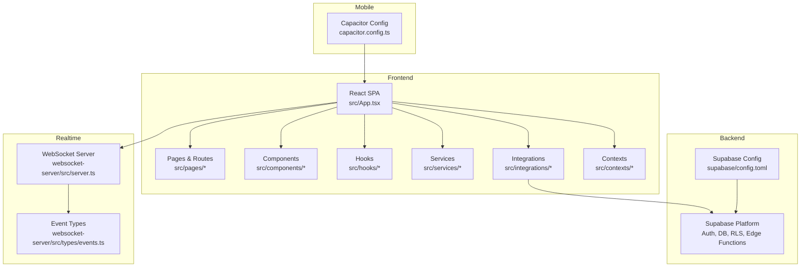
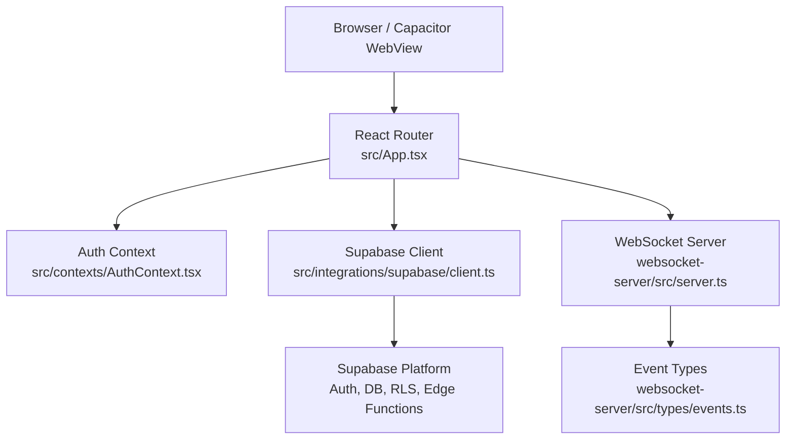
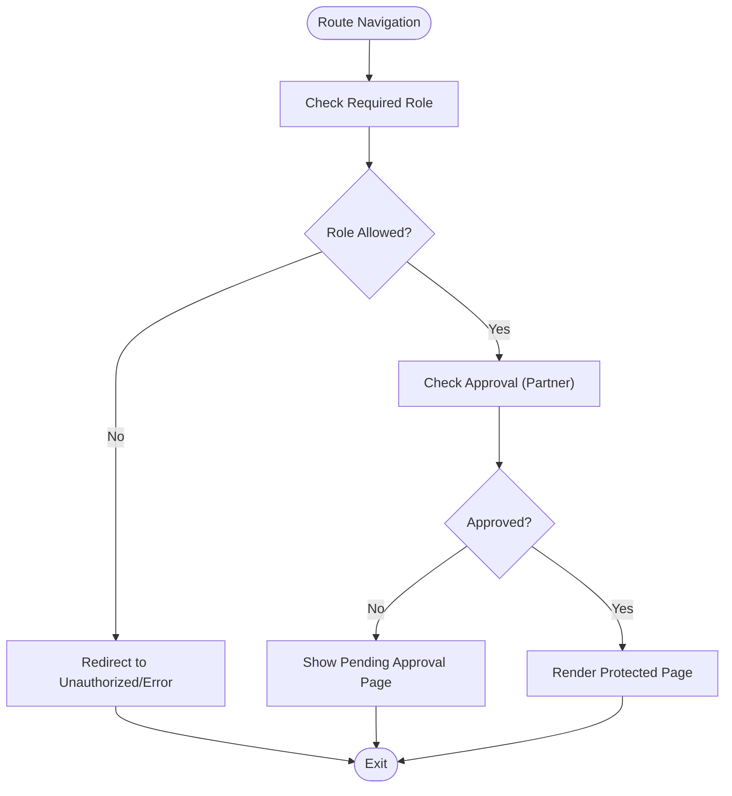
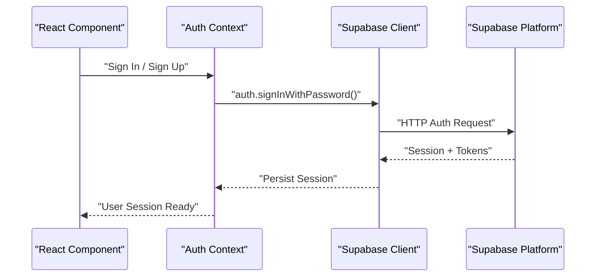
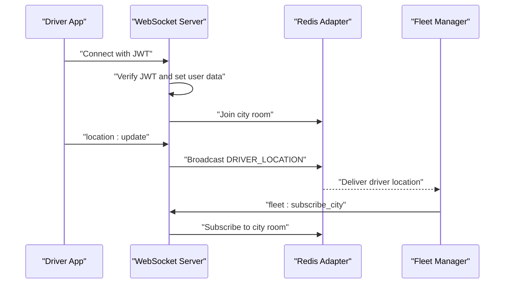
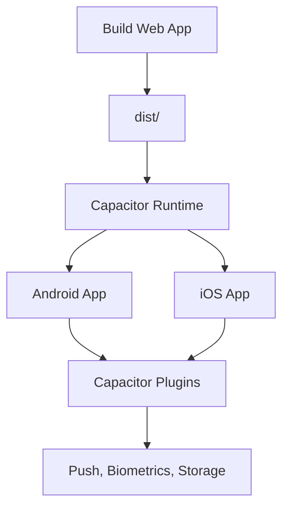
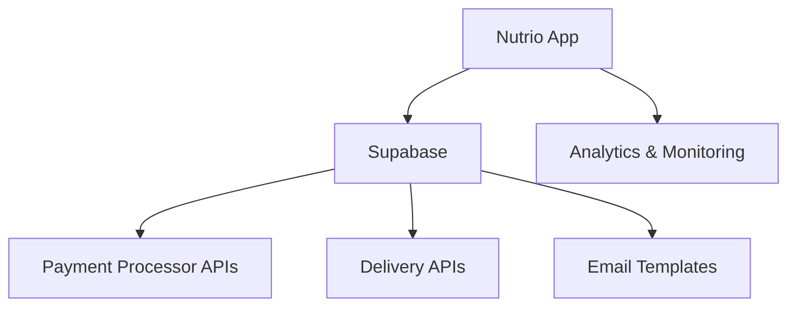
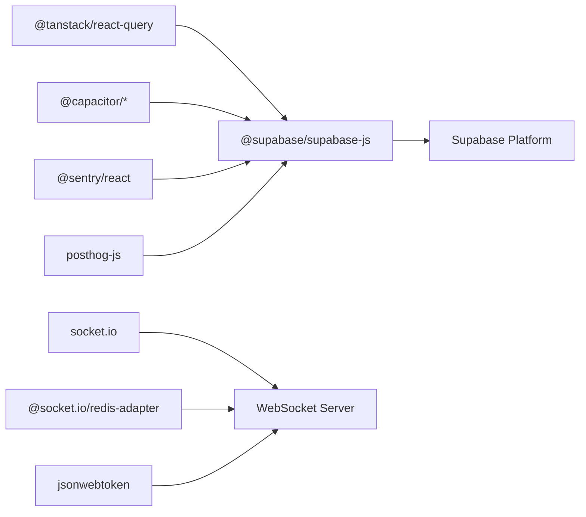

# High-Level Architecture

<cite>
**Referenced Files in This Document**
- [README.md](file://README.md)
- [package.json](file://package.json)
- [src/App.tsx](file://src/App.tsx)
- [src/main.tsx](file://src/main.tsx)
- [src/contexts/AuthContext.tsx](file://src/contexts/AuthContext.tsx)
- [src/integrations/supabase/client.ts](file://src/integrations/supabase/client.ts)
- [supabase/config.toml](file://supabase/config.toml)
- [websocket-server/src/server.ts](file://websocket-server/src/server.ts)
- [websocket-server/src/types/events.ts](file://websocket-server/src/types/events.ts)
- [capacitor.config.ts](file://capacitor.config.ts)
- [src/fleet/routes.tsx](file://src/fleet/routes.tsx)
</cite>

## Table of Contents
1. [Introduction](#introduction)
2. [Project Structure](#project-structure)
3. [Core Components](#core-components)
4. [Architecture Overview](#architecture-overview)
5. [Detailed Component Analysis](#detailed-component-analysis)
6. [Dependency Analysis](#dependency-analysis)
7. [Performance Considerations](#performance-considerations)
8. [Troubleshooting Guide](#troubleshooting-guide)
9. [Conclusion](#conclusion)

## Introduction
This document describes the high-level system architecture of Nutrio, a healthy meal delivery and nutrition tracking platform. The system comprises:
- A React-based single-page application (SPA) with React Router for routing and TanStack React Query for data fetching and caching.
- A Supabase backend providing authentication, relational database, real-time Row Level Security (RLS), and serverless functions.
- A fleet management portal integrated via dedicated routes and protected by a separate authentication context.
- A WebSocket server for real-time delivery tracking and fleet operations.
- A Capacitor-based hybrid mobile application for Android and iOS with native features.

The system supports a multi-tenant, role-based access control model with four primary user roles: customer, partner, driver, and admin. The architecture separates concerns across presentation, business logic, data access, and real-time features, while integrating with external services such as payment processors and delivery APIs.

## Project Structure
The repository is organized into modular directories:
- src: React frontend application, pages, components, hooks, services, integrations, and contexts.
- supabase: Backend configuration, migrations, and Edge Functions.
- websocket-server: Fleet management real-time server.
- android/ios: Capacitor native projects.
- docs: Architectural and operational documentation.
- e2e: End-to-end tests across portals and workflows.
- scripts/tests: Automation and testing utilities.

**Diagram sources**
- [src/App.tsx:139-739](file://src/App.tsx#L139-L739)
- [src/main.tsx:1-50](file://src/main.tsx#L1-L50)
- [src/integrations/supabase/client.ts:1-57](file://src/integrations/supabase/client.ts#L1-L57)
- [supabase/config.toml:1-59](file://supabase/config.toml#L1-L59)
- [websocket-server/src/server.ts:1-256](file://websocket-server/src/server.ts#L1-L256)
- [websocket-server/src/types/events.ts:1-210](file://websocket-server/src/types/events.ts#L1-L210)
- [capacitor.config.ts:1-45](file://capacitor.config.ts#L1-L45)

**Section sources**
- [src/App.tsx:139-739](file://src/App.tsx#L139-L739)
- [src/main.tsx:1-50](file://src/main.tsx#L1-L50)
- [package.json:1-159](file://package.json#L1-L159)

## Core Components
- Presentation Layer (React SPA)
  - Routing and layout: [src/App.tsx:139-739](file://src/App.tsx#L139-L739), [src/fleet/routes.tsx:1-42](file://src/fleet/routes.tsx#L1-L42)
  - Root initialization and providers: [src/main.tsx:1-50](file://src/main.tsx#L1-L50)
  - Authentication context and state management: [src/contexts/AuthContext.tsx:1-131](file://src/contexts/AuthContext.tsx#L1-L131)
  - Supabase client integration: [src/integrations/supabase/client.ts:1-57](file://src/integrations/supabase/client.ts#L1-L57)
  - Capacitor configuration for native behavior: [capacitor.config.ts:1-45](file://capacitor.config.ts#L1-L45)

- Business Logic
  - Protected routing with role checks and approval gating: [src/App.tsx:364-724](file://src/App.tsx#L364-L724)
  - Fleet portal routing and protected routes: [src/fleet/routes.tsx:1-42](file://src/fleet/routes.tsx#L1-L42)
  - Authenticated state synchronization and push notification initialization: [src/contexts/AuthContext.tsx:36-61](file://src/contexts/AuthContext.tsx#L36-L61)

- Data Access
  - Supabase client with Capacitor-native storage adapter: [src/integrations/supabase/client.ts:18-57](file://src/integrations/supabase/client.ts#L18-L57)
  - Supabase configuration and function permissions: [supabase/config.toml:1-59](file://supabase/config.toml#L1-L59)

- Real-Time Features
  - WebSocket server with Redis adapter, JWT auth, and room management: [websocket-server/src/server.ts:1-256](file://websocket-server/src/server.ts#L1-L256)
  - Event types and payload contracts: [websocket-server/src/types/events.ts:1-210](file://websocket-server/src/types/events.ts#L1-L210)

**Section sources**
- [src/App.tsx:139-739](file://src/App.tsx#L139-L739)
- [src/main.tsx:1-50](file://src/main.tsx#L1-L50)
- [src/contexts/AuthContext.tsx:1-131](file://src/contexts/AuthContext.tsx#L1-L131)
- [src/integrations/supabase/client.ts:1-57](file://src/integrations/supabase/client.ts#L1-L57)
- [supabase/config.toml:1-59](file://supabase/config.toml#L1-L59)
- [websocket-server/src/server.ts:1-256](file://websocket-server/src/server.ts#L1-L256)
- [websocket-server/src/types/events.ts:1-210](file://websocket-server/src/types/events.ts#L1-L210)
- [capacitor.config.ts:1-45](file://capacitor.config.ts#L1-L45)

## Architecture Overview
The system follows a layered architecture with clear separation of concerns:
- Presentation: React SPA handles UI, routing, and user interactions.
- Business Logic: Protected routes enforce role-based access and approval requirements.
- Data Access: Supabase provides authentication, relational data, RLS, and serverless functions.
- Real-Time: WebSocket server enables live tracking and fleet operations.
- Mobile: Capacitor wraps the web app into native apps with platform-specific capabilities.

**Diagram sources**
- [src/App.tsx:139-739](file://src/App.tsx#L139-L739)
- [src/contexts/AuthContext.tsx:1-131](file://src/contexts/AuthContext.tsx#L1-L131)
- [src/integrations/supabase/client.ts:1-57](file://src/integrations/supabase/client.ts#L1-L57)
- [websocket-server/src/server.ts:1-256](file://websocket-server/src/server.ts#L1-L256)
- [websocket-server/src/types/events.ts:1-210](file://websocket-server/src/types/events.ts#L1-L210)

## Detailed Component Analysis

### Multi-Tenant and Role-Based Access Control
- Four primary roles are supported: customer, partner, driver, and admin.
- ProtectedRoute wrappers enforce role requirements and optional approval gating for partner portal routes.
- Fleet portal routes are isolated under a dedicated namespace and protected by a separate authentication context.

**Diagram sources**
- [src/App.tsx:364-724](file://src/App.tsx#L364-L724)
- [src/fleet/routes.tsx:1-42](file://src/fleet/routes.tsx#L1-L42)

**Section sources**
- [src/App.tsx:364-724](file://src/App.tsx#L364-L724)
- [src/fleet/routes.tsx:1-42](file://src/fleet/routes.tsx#L1-L42)

### Supabase Integration and Data Access
- Supabase client is initialized with a Capacitor-native storage adapter for sessions and tokens.
- Environment variables define Supabase URL and publishable key, guarded against missing values.
- Supabase configuration controls function permissions and JWT verification flags.

**Diagram sources**
- [src/contexts/AuthContext.tsx:87-112](file://src/contexts/AuthContext.tsx#L87-L112)
- [src/integrations/supabase/client.ts:47-57](file://src/integrations/supabase/client.ts#L47-L57)

**Section sources**
- [src/integrations/supabase/client.ts:1-57](file://src/integrations/supabase/client.ts#L1-L57)
- [supabase/config.toml:1-59](file://supabase/config.toml#L1-L59)

### Real-Time Communication Layer
- WebSocket server uses Socket.IO with Redis adapter for horizontal scaling.
- JWT-based authentication decodes user role and assigns driver or fleet type.
- Rooms enable targeted broadcasting for cities and individual drivers.
- Events cover location updates, status changes, order assignments, and statistics.

**Diagram sources**
- [websocket-server/src/server.ts:65-150](file://websocket-server/src/server.ts#L65-L150)
- [websocket-server/src/types/events.ts:157-187](file://websocket-server/src/types/events.ts#L157-L187)

**Section sources**
- [websocket-server/src/server.ts:1-256](file://websocket-server/src/server.ts#L1-L256)
- [websocket-server/src/types/events.ts:1-210](file://websocket-server/src/types/events.ts#L1-L210)

### Mobile Application Integration
- Capacitor configuration defines app ID, webDir, server scheme, and allowed navigation domains.
- Native plugins include splash screen, push notifications, local notifications, and biometric authentication.
- The web app runs inside Capacitor WebView with HTTPS scheme enforced for Android.

**Diagram sources**
- [capacitor.config.ts:1-45](file://capacitor.config.ts#L1-L45)

**Section sources**
- [capacitor.config.ts:1-45](file://capacitor.config.ts#L1-L45)

### System Boundaries and External Dependencies
- Supabase: Authentication, database, RLS, and Edge Functions.
- Payment processors and delivery APIs: Integrated via Supabase functions and external service calls (configured in Edge Functions).
- Third-party services: Email templates, analytics, and monitoring are integrated through Supabase and client-side libraries.

[No sources needed since this diagram shows conceptual relationships, not specific code structure]

## Dependency Analysis
Key dependencies and their roles:
- Frontend dependencies include React, React Router, TanStack React Query, Supabase JS client, Sentry, PostHog, and Capacitor plugins.
- Supabase configuration defines function permissions and JWT verification behavior.
- WebSocket server depends on Socket.IO, Redis adapter, JSON Web Token, and HTTP server.

**Diagram sources**
- [package.json:44-126](file://package.json#L44-L126)
- [supabase/config.toml:1-59](file://supabase/config.toml#L1-L59)
- [websocket-server/src/server.ts:6-16](file://websocket-server/src/server.ts#L6-L16)

**Section sources**
- [package.json:44-126](file://package.json#L44-L126)
- [supabase/config.toml:1-59](file://supabase/config.toml#L1-L59)
- [websocket-server/src/server.ts:6-16](file://websocket-server/src/server.ts#L6-L16)

## Performance Considerations
- Client-side caching: TanStack React Query manages caching and invalidation for API responses.
- Lazy loading: Routes are lazily loaded to reduce initial bundle size.
- Real-time scalability: WebSocket server uses Redis adapter for multi-instance deployments.
- Network efficiency: WebSocket compression thresholds and buffer sizing are configured for optimal throughput.

[No sources needed since this section provides general guidance]

## Troubleshooting Guide
- Authentication failures: Verify Supabase URL and keys, and ensure Capacitor storage adapter is functioning.
- WebSocket connection issues: Confirm JWT secret, Redis connectivity, and allowed origins.
- Mobile app navigation: Check Capacitor server configuration and allowNavigation entries for external domains.

**Section sources**
- [src/integrations/supabase/client.ts:10-16](file://src/integrations/supabase/client.ts#L10-L16)
- [websocket-server/src/server.ts:28-32](file://websocket-server/src/server.ts#L28-L32)
- [capacitor.config.ts:13-16](file://capacitor.config.ts#L13-L16)

## Conclusion
Nutrio’s architecture combines a modern React SPA, Supabase backend, and a dedicated WebSocket server to deliver a scalable, real-time, multi-tenant platform. Role-based access control, protected routes, and a clear separation of concerns enable maintainability and extensibility. The integration with Capacitor ensures a seamless native experience across Android and iOS, while Supabase functions and external services support advanced business workflows such as payments and delivery orchestration.