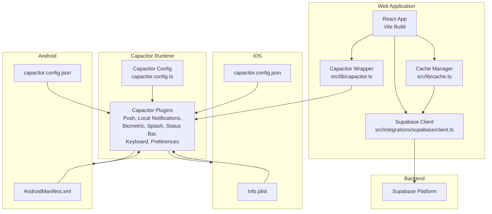
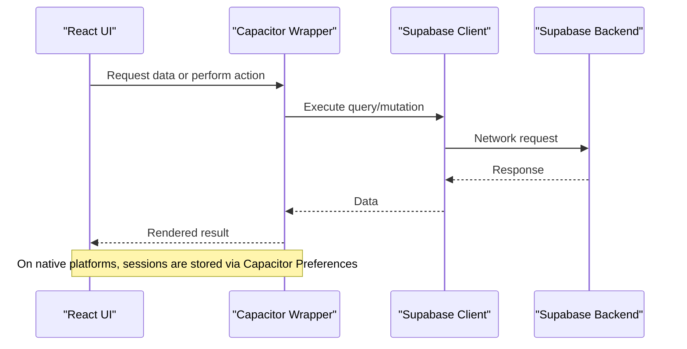
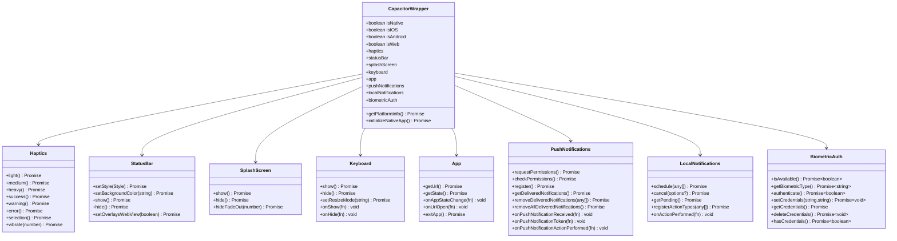
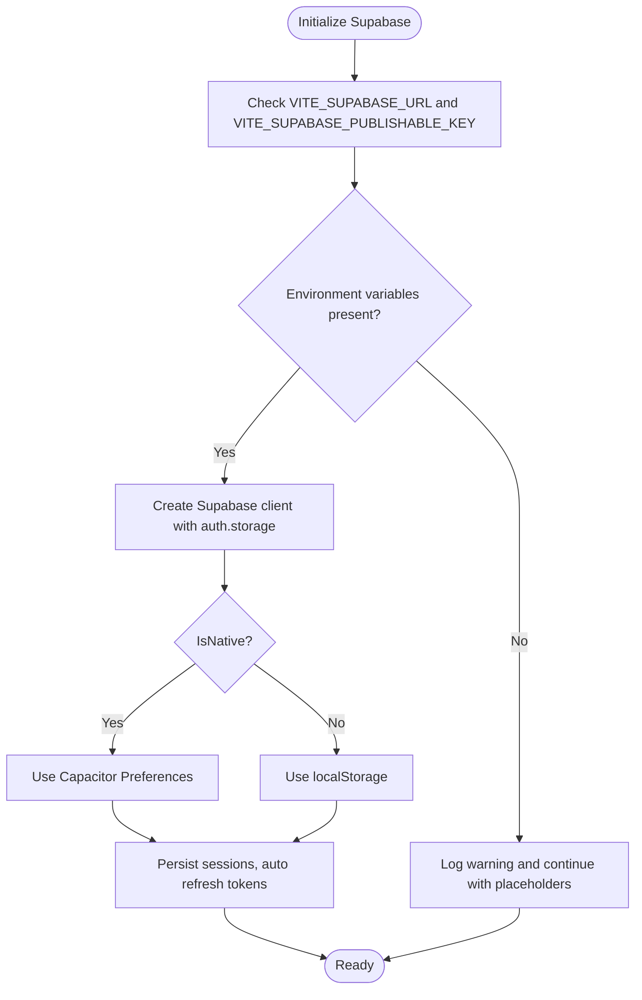
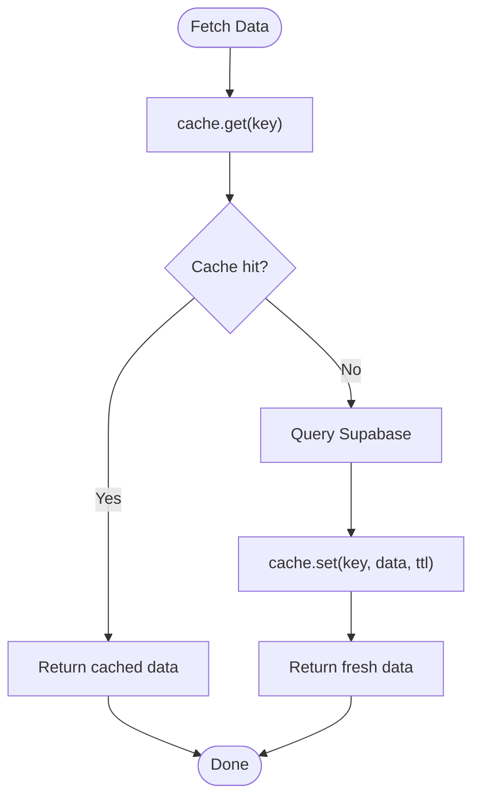
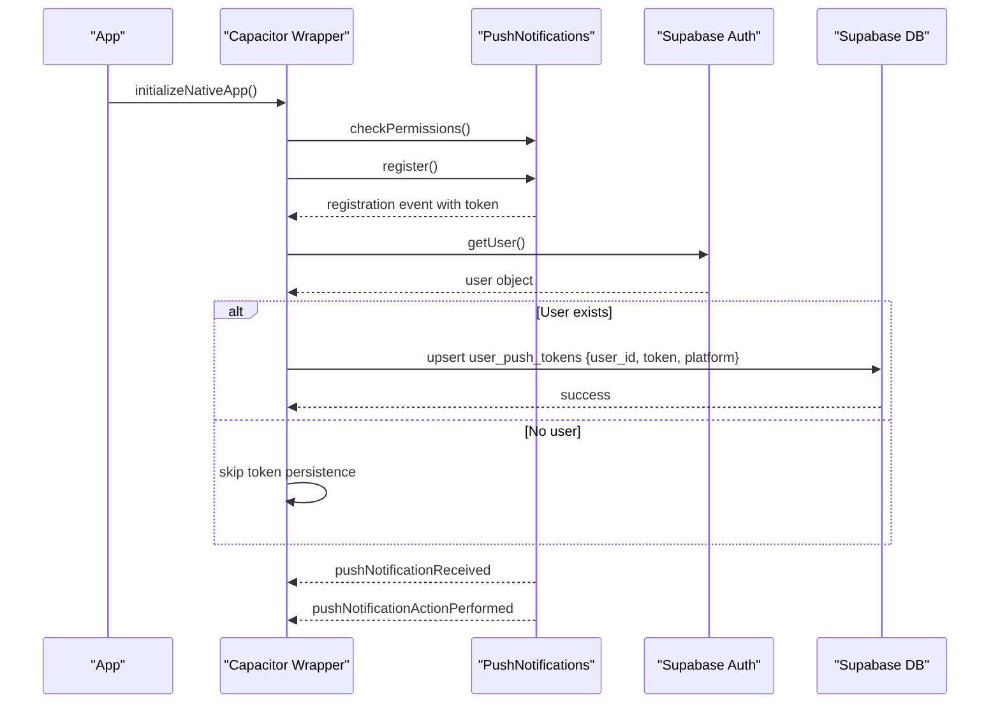
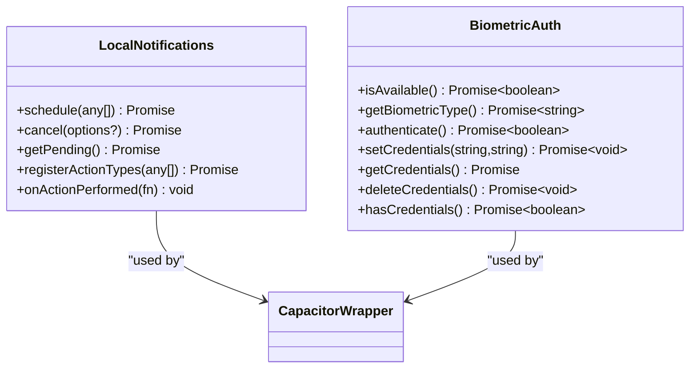
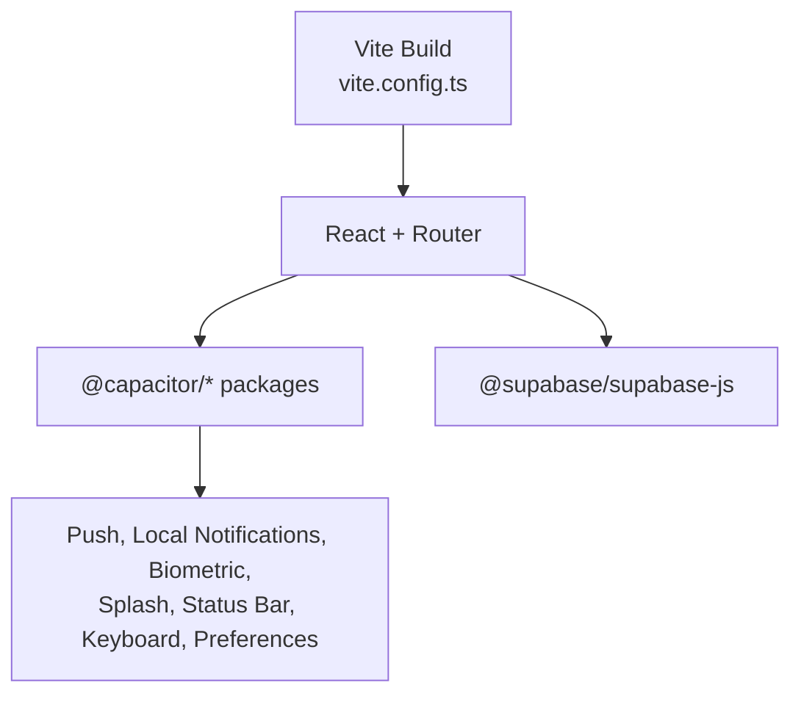

# Mobile Architecture

<cite>
**Referenced Files in This Document**
- [capacitor.config.ts](file://capacitor.config.ts)
- [package.json](file://package.json)
- [android\app\src\main\assets\capacitor.config.json](file://android\app\src\main\assets\capacitor.config.json)
- [ios\App\App\capacitor.config.json](file://ios\App\App\capacitor.config.json)
- [android\app\src\main\AndroidManifest.xml](file://android\app\src\main\AndroidManifest.xml)
- [ios\App\App\Info.plist](file://ios\App\App\Info.plist)
- [src\lib\capacitor.ts](file://src\lib\capacitor.ts)
- [src\integrations\supabase\client.ts](file://src\integrations\supabase\client.ts)
- [src\lib\cache.ts](file://src\lib\cache.ts)
- [src\lib\notifications.ts](file://src\lib\notifications.ts)
- [vite.config.ts](file://vite.config.ts)
</cite>

## Table of Contents
1. [Introduction](#introduction)
2. [Project Structure](#project-structure)
3. [Core Components](#core-components)
4. [Architecture Overview](#architecture-overview)
5. [Detailed Component Analysis](#detailed-component-analysis)
6. [Dependency Analysis](#dependency-analysis)
7. [Performance Considerations](#performance-considerations)
8. [Troubleshooting Guide](#troubleshooting-guide)
9. [Conclusion](#conclusion)

## Introduction
This document describes the mobile application architecture for Nutrio, built with Capacitor. It explains how the hybrid app combines web technologies with native capabilities, how the plugin architecture integrates device features, and how the apps communicate with backend services. It also covers cross-platform deployment, native iOS and Android configurations, offline capabilities, push notification implementation, and performance optimization techniques tailored for mobile platforms.

## Project Structure
The mobile architecture centers around a React-based web application packaged with Capacitor for iOS and Android. Capacitor manages the native bridge, plugins, and platform-specific configurations. The backend integration leverages Supabase for authentication, real-time data, and storage, while a custom caching layer optimizes data retrieval.

**Diagram sources**
- [capacitor.config.ts:1-45](file://capacitor.config.ts#L1-L45)
- [src\lib\capacitor.ts:1-640](file://src\lib\capacitor.ts#L1-L640)
- [src\integrations\supabase\client.ts:1-57](file://src\integrations\supabase\client.ts#L1-L57)
- [src\lib\cache.ts:1-199](file://src\lib\cache.ts#L1-L199)
- [android\app\src\main\AndroidManifest.xml:1-53](file://android\app\src\main\AndroidManifest.xml#L1-L53)
- [ios\App\App\Info.plist:1-56](file://ios\App\App\Info.plist#L1-L56)
- [android\app\src\main\assets\capacitor.config.json:1-41](file://android\app\src\main\assets\capacitor.config.json#L1-L41)
- [ios\App\App\capacitor.config.json:1-56](file://ios\App\App\capacitor.config.json#L1-L56)

**Section sources**
- [capacitor.config.ts:1-45](file://capacitor.config.ts#L1-L45)
- [package.json:1-159](file://package.json#L1-L159)

## Core Components
- Capacitor wrapper: Provides a unified interface to native features with graceful fallbacks for web environments. It encapsulates haptics, status bar, splash screen, keyboard, app state, push notifications, local notifications, and biometric authentication.
- Supabase integration: Uses a custom storage adapter to persist sessions using Capacitor Preferences on native platforms and localStorage on the web. It initializes the Supabase client with automatic token refresh and persisted sessions.
- Cache manager: Implements a two-tier caching strategy with in-memory fallback when Redis is unavailable, optimizing frequent queries with configurable TTLs.
- Notifications service: Centralizes notification creation and helper functions for order updates, driver assignments, and delivery claims.

**Section sources**
- [src\lib\capacitor.ts:1-640](file://src\lib\capacitor.ts#L1-L640)
- [src\integrations\supabase\client.ts:1-57](file://src\integrations\supabase\client.ts#L1-L57)
- [src\lib\cache.ts:1-199](file://src\lib\cache.ts#L1-L199)
- [src\lib\notifications.ts:1-114](file://src\lib\notifications.ts#L1-L114)

## Architecture Overview
The hybrid architecture follows a layered approach:
- Presentation layer: React components using Vite for development and optimized builds.
- Native abstraction: Capacitor wrapper exposes platform-specific APIs safely.
- Data access: Supabase client with custom storage adapter for sessions and persisted auth state.
- Offline and caching: In-memory cache with TTLs to reduce network requests.
- Notifications: Push notifications via Capacitor plugins with local notification scheduling.

**Diagram sources**
- [src\lib\capacitor.ts:1-640](file://src\lib\capacitor.ts#L1-L640)
- [src\integrations\supabase\client.ts:1-57](file://src\integrations\supabase\client.ts#L1-L57)

## Detailed Component Analysis

### Capacitor Plugin Integration
The Capacitor wrapper centralizes access to native features and ensures compatibility across platforms. It detects the current platform and conditionally executes native calls, falling back to no-op behavior on the web.

**Diagram sources**
- [src\lib\capacitor.ts:1-640](file://src\lib\capacitor.ts#L1-L640)

**Section sources**
- [src\lib\capacitor.ts:24-43](file://src\lib\capacitor.ts#L24-L43)
- [src\lib\capacitor.ts:49-122](file://src\lib\capacitor.ts#L49-L122)
- [src\lib\capacitor.ts:128-173](file://src\lib\capacitor.ts#L128-L173)
- [src\lib\capacitor.ts:179-210](file://src\lib\capacitor.ts#L179-L210)
- [src\lib\capacitor.ts:216-262](file://src\lib\capacitor.ts#L216-L262)
- [src\lib\capacitor.ts:268-315](file://src\lib\capacitor.ts#L268-L315)
- [src\lib\capacitor.ts:321-405](file://src\lib\capacitor.ts#L321-L405)
- [src\lib\capacitor.ts:411-462](file://src\lib\capacitor.ts#L411-L462)
- [src\lib\capacitor.ts:468-581](file://src\lib\capacitor.ts#L468-L581)

### Supabase Client and Session Storage
The Supabase client uses a custom storage adapter to persist sessions. On native platforms, it stores tokens in Capacitor Preferences; on the web, it uses localStorage. This ensures consistent auth state across reloads and platform boundaries.

**Diagram sources**
- [src\integrations\supabase\client.ts:1-57](file://src\integrations\supabase\client.ts#L1-L57)

**Section sources**
- [src\integrations\supabase\client.ts:18-45](file://src\integrations\supabase\client.ts#L18-L45)

### Cache Manager and Offline Strategy
The cache manager provides a unified interface for retrieving and storing data with TTLs. It attempts to use Redis when available and falls back to an in-memory cache otherwise. This reduces network latency and supports basic offline behavior by serving cached data when the backend is unreachable.

**Diagram sources**
- [src\lib\cache.ts:37-86](file://src\lib\cache.ts#L37-L86)

**Section sources**
- [src\lib\cache.ts:16-107](file://src\lib\cache.ts#L16-L107)
- [src\lib\cache.ts:124-177](file://src\lib\cache.ts#L124-L177)

### Push Notifications Workflow
Push notifications are handled through Capacitor Push Notifications on native platforms. The system requests permissions, registers for tokens, and persists tokens associated with the authenticated user. It also listens for notification actions and received events.

**Diagram sources**
- [src\lib\capacitor.ts:321-405](file://src\lib\capacitor.ts#L321-L405)
- [src\integrations\supabase\client.ts:1-57](file://src\integrations\supabase\client.ts#L1-L57)

**Section sources**
- [src\lib\capacitor.ts:321-405](file://src\lib\capacitor.ts#L321-L405)

### Local Notifications and Biometric Authentication
Local notifications enable scheduled reminders and actions on native platforms. Biometric authentication provides secure, device-backed identity verification and credential storage for seamless login experiences.

**Diagram sources**
- [src\lib\capacitor.ts:411-462](file://src\lib\capacitor.ts#L411-L462)
- [src\lib\capacitor.ts:468-581](file://src\lib\capacitor.ts#L468-L581)

**Section sources**
- [src\lib\capacitor.ts:411-462](file://src\lib\capacitor.ts#L411-L462)
- [src\lib\capacitor.ts:468-581](file://src\lib\capacitor.ts#L468-L581)

## Dependency Analysis
The mobile app relies on Capacitor plugins for native capabilities and Supabase for backend services. The build system uses Vite with Terser minification and chunk splitting to optimize bundle sizes for mobile networks.

**Diagram sources**
- [vite.config.ts:1-77](file://vite.config.ts#L1-L77)
- [package.json:44-61](file://package.json#L44-L61)

**Section sources**
- [package.json:44-61](file://package.json#L44-L61)
- [vite.config.ts:51-76](file://vite.config.ts#L51-L76)

## Performance Considerations
- Build optimization: Vite targets modern ESNext for better runtime performance, enables Terser minification, and splits vendor bundles for improved caching.
- Network efficiency: The cache manager reduces redundant network calls with TTL-based caching and invalidation patterns.
- Haptics and UX: The Capacitor wrapper provides lightweight haptic feedback APIs to enhance user experience without heavy dependencies.
- Bundle size: Manual chunking groups UI libraries and charting dependencies separately to minimize initial payload.

**Section sources**
- [vite.config.ts:51-76](file://vite.config.ts#L51-L76)
- [src\lib\cache.ts:16-107](file://src\lib\cache.ts#L16-L107)

## Troubleshooting Guide
- Missing Supabase configuration: The client logs a warning if required environment variables are not present during build. Ensure VITE_SUPABASE_URL and VITE_SUPABASE_PUBLISHABLE_KEY are set for production builds.
- Platform detection: The Capacitor wrapper checks the platform before invoking native APIs. If a feature does not work on the web, verify isNative and platform flags.
- Push notification registration: On native platforms, ensure permissions are granted and tokens are registered. The wrapper listens for registration events and persists tokens when a user is authenticated.
- Session persistence: On native platforms, sessions are stored via Capacitor Preferences. If login state is lost, verify Preferences storage and retry authentication.

**Section sources**
- [src\integrations\supabase\client.ts:10-16](file://src\integrations\supabase\client.ts#L10-L16)
- [src\lib\capacitor.ts:27-43](file://src\lib\capacitor.ts#L27-L43)
- [src\lib\capacitor.ts:321-405](file://src\lib\capacitor.ts#L321-L405)

## Conclusion
Nutrio’s mobile architecture leverages Capacitor to blend web-scale development with native capabilities. The Capacitor wrapper provides a clean abstraction for device features, while Supabase handles authentication and data persistence. A caching layer improves offline resilience and performance. With Vite-driven optimizations and platform-specific configurations for iOS and Android, the app delivers a responsive, reliable experience across devices.