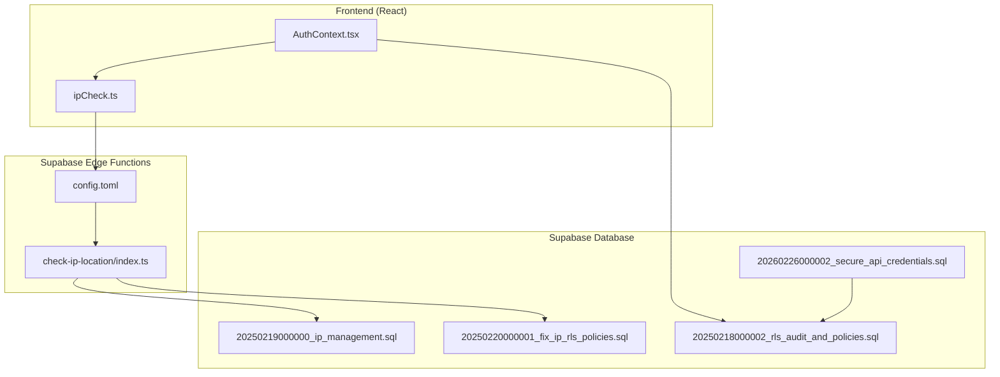
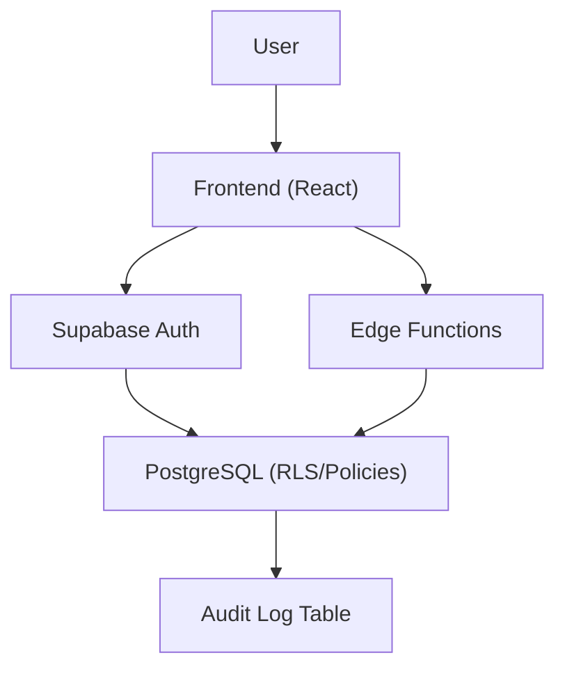
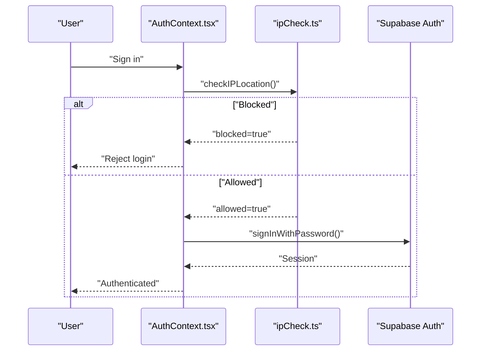
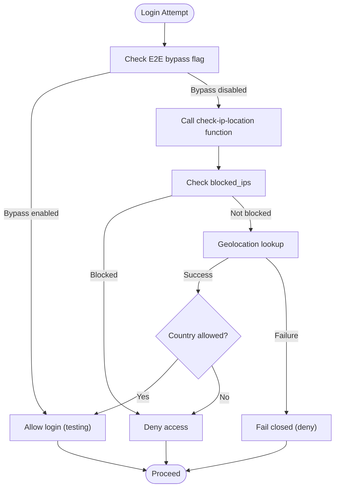
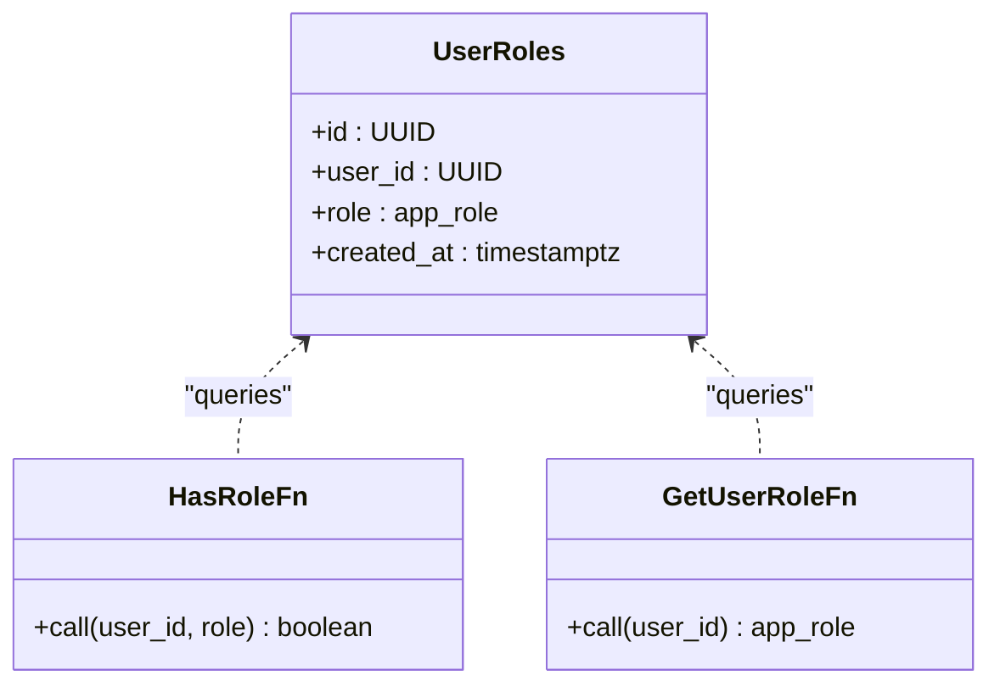
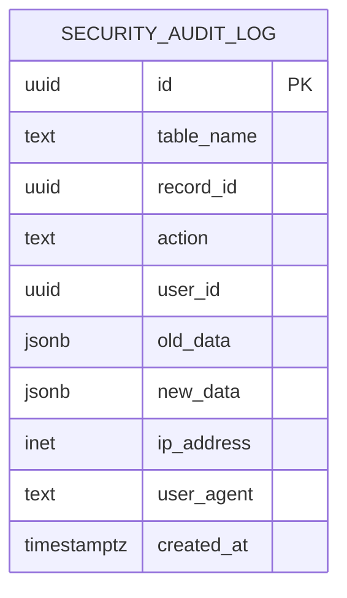
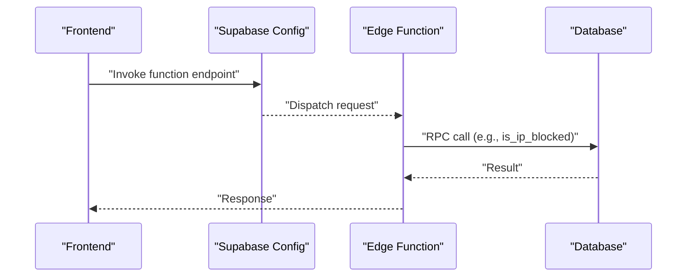
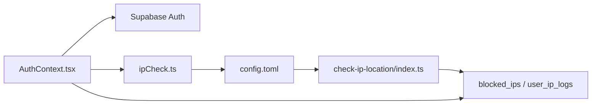

# Security Architecture

<cite>
**Referenced Files in This Document**
- [AuthContext.tsx](file://src/contexts/AuthContext.tsx)
- [ipCheck.ts](file://src/lib/ipCheck.ts)
- [check-ip-location/index.ts](file://supabase/functions/check-ip-location/index.ts)
- [config.toml](file://supabase/config.toml)
- [20250219000000_ip_management.sql](file://supabase/migrations/20250219000000_ip_management.sql)
- [20250220000001_fix_ip_rls_policies.sql](file://supabase/migrations/20250220000001_fix_ip_rls_policies.sql)
- [20250218000002_rls_audit_and_policies.sql](file://supabase/migrations/20250218000002_rls_audit_and_policies.sql)
- [20260226000002_secure_api_credentials.sql](file://supabase/migrations/20260226000002_secure_api_credentials.sql)
- [20260226000009_audit_remediation_summary.sql](file://supabase/migrations/20260226000009_audit_remediation_summary.sql)
- [PRODUCTION_HARDENING_FINAL_SUMMARY.md](file://PRODUCTION_HARDENING_FINAL_SUMMARY.md)
- [SECURITY_REMEDIATION_REPORT.md](file://SECURITY_REMEDIATION_REPORT.md)
- [fleet-management-portal-design.md](file://docs/fleet-management-portal-design.md)
- [ip_management.spec.ts](file://e2e/admin/ip_management.spec.ts)
</cite>

## Table of Contents
1. [Introduction](#introduction)
2. [Project Structure](#project-structure)
3. [Core Components](#core-components)
4. [Architecture Overview](#architecture-overview)
5. [Detailed Component Analysis](#detailed-component-analysis)
6. [Dependency Analysis](#dependency-analysis)
7. [Performance Considerations](#performance-considerations)
8. [Troubleshooting Guide](#troubleshooting-guide)
9. [Conclusion](#conclusion)
10. [Appendices](#appendices)

## Introduction
This document describes the multi-layered security architecture for the platform. It covers Supabase Row Level Security (RLS), JWT token validation, IP management and location checks, and role-based access control (RBAC). It also documents the authentication flow, session management, authorization patterns for different user roles, data protection, API security, and real-time synchronization considerations. Finally, it outlines threat mitigation strategies, audit logging, and compliance considerations derived from the repository’s security artifacts.

## Project Structure
Security-related components span the frontend React application, Supabase edge functions, and Supabase database migrations. The frontend handles authentication state and optional IP checks; edge functions enforce IP restrictions and IP logging; database migrations define RLS policies, RBAC functions, and audit tables.

**Diagram sources**
- [AuthContext.tsx:36-61](file://src/contexts/AuthContext.tsx#L36-L61)
- [ipCheck.ts:47-80](file://src/lib/ipCheck.ts#L47-L80)
- [check-ip-location/index.ts:37-107](file://supabase/functions/check-ip-location/index.ts#L37-L107)
- [config.toml:30-34](file://supabase/config.toml#L30-L34)
- [20250219000000_ip_management.sql:1-60](file://supabase/migrations/20250219000000_ip_management.sql#L1-L60)
- [20250220000001_fix_ip_rls_policies.sql:1-64](file://supabase/migrations/20250220000001_fix_ip_rls_policies.sql#L1-L64)
- [20250218000002_rls_audit_and_policies.sql:275-294](file://supabase/migrations/20250218000002_rls_audit_and_policies.sql#L275-L294)
- [20260226000002_secure_api_credentials.sql:38-76](file://supabase/migrations/20260226000002_secure_api_credentials.sql#L38-L76)

**Section sources**
- [AuthContext.tsx:31-61](file://src/contexts/AuthContext.tsx#L31-L61)
- [ipCheck.ts:19-80](file://src/lib/ipCheck.ts#L19-L80)
- [check-ip-location/index.ts:37-107](file://supabase/functions/check-ip-location/index.ts#L37-L107)
- [config.toml:30-34](file://supabase/config.toml#L30-L34)
- [20250219000000_ip_management.sql:1-60](file://supabase/migrations/20250219000000_ip_management.sql#L1-L60)
- [20250220000001_fix_ip_rls_policies.sql:1-64](file://supabase/migrations/20250220000001_fix_ip_rls_policies.sql#L1-L64)
- [20250218000002_rls_audit_and_policies.sql:275-294](file://supabase/migrations/20250218000002_rls_audit_and_policies.sql#L275-L294)
- [20260226000002_secure_api_credentials.sql:38-76](file://supabase/migrations/20260226000002_secure_api_credentials.sql#L38-L76)

## Core Components
- Authentication and session management: Frontend provider listens to Supabase auth state and exposes sign-in/sign-out flows.
- IP management and location checks: Frontend optionally checks IP location via an edge function; the function enforces country-based allowlists and blocks known IPs.
- Role-based access control (RBAC): Supabase functions and policies enforce role checks for admin-only operations.
- Data protection and audit: RLS policies on sensitive tables; audit log table for security events; banking data encryption and API credential hashing in later migrations.
- API security: Edge functions configured with JWT verification toggles; API credential hashing and rotation; rate-limiting tables introduced.

**Section sources**
- [AuthContext.tsx:36-118](file://src/contexts/AuthContext.tsx#L36-L118)
- [ipCheck.ts:19-80](file://src/lib/ipCheck.ts#L19-L80)
- [check-ip-location/index.ts:37-107](file://supabase/functions/check-ip-location/index.ts#L37-L107)
- [20250219000000_ip_management.sql:32-60](file://supabase/migrations/20250219000000_ip_management.sql#L32-L60)
- [20250220000001_fix_ip_rls_policies.sql:5-18](file://supabase/migrations/20250220000001_fix_ip_rls_policies.sql#L5-L18)
- [20250218000002_rls_audit_and_policies.sql:275-294](file://supabase/migrations/20250218000002_rls_audit_and_policies.sql#L275-L294)
- [20260226000002_secure_api_credentials.sql:38-76](file://supabase/migrations/20260226000002_secure_api_credentials.sql#L38-L76)

## Architecture Overview
The security architecture follows a layered approach:
- Transport and identity: HTTPS/TLS and JWT-based authentication via Supabase Auth.
- Authorization: Supabase RLS and custom RBAC functions restrict data visibility and mutations.
- Access control enforcement: Edge functions validate IP/location and enforce policy decisions.
- Audit and compliance: Dedicated audit log table and remediation artifacts track security events and improvements.
- Data protection: Encryption for sensitive fields and secure hashing for API secrets.

**Diagram sources**
- [AuthContext.tsx:36-61](file://src/contexts/AuthContext.tsx#L36-L61)
- [check-ip-location/index.ts:37-107](file://supabase/functions/check-ip-location/index.ts#L37-L107)
- [20250218000002_rls_audit_and_policies.sql:275-294](file://supabase/migrations/20250218000002_rls_audit_and_policies.sql#L275-L294)

## Detailed Component Analysis

### Authentication Flow and Session Management
- The frontend initializes an auth state listener and retrieves the current session.
- Sign-in flow optionally performs an IP location check before attempting authentication.
- On successful sign-in, the provider sets the session and user; on sign-out, it clears local storage and invokes Supabase sign-out.

**Diagram sources**
- [AuthContext.tsx:87-112](file://src/contexts/AuthContext.tsx#L87-L112)
- [ipCheck.ts:47-80](file://src/lib/ipCheck.ts#L47-L80)

**Section sources**
- [AuthContext.tsx:36-118](file://src/contexts/AuthContext.tsx#L36-L118)
- [ipCheck.ts:19-80](file://src/lib/ipCheck.ts#L19-L80)

### IP Management and Location Checking
- Frontend IP check is currently bypassed for E2E testing but would call the edge function in production.
- The edge function validates the client IP against a blocked list and geolocation service, returning allow/block decisions.
- Supabase configuration disables JWT verification for the IP functions to allow anonymous invocation.

**Diagram sources**
- [ipCheck.ts:19-80](file://src/lib/ipCheck.ts#L19-L80)
- [check-ip-location/index.ts:37-107](file://supabase/functions/check-ip-location/index.ts#L37-L107)
- [config.toml:30-34](file://supabase/config.toml#L30-L34)

**Section sources**
- [ipCheck.ts:19-80](file://src/lib/ipCheck.ts#L19-L80)
- [check-ip-location/index.ts:37-107](file://supabase/functions/check-ip-location/index.ts#L37-L107)
- [config.toml:30-34](file://supabase/config.toml#L30-L34)

### Role-Based Access Control (RBAC)
- RBAC relies on a dedicated user roles table and helper functions to check roles and determine primary roles.
- Policies enforce admin-only access to sensitive tables and allow users to view their own roles.
- Edge function configuration indicates JWT verification toggles for various functions; IP/location functions disable JWT verification to permit anonymous checks.

**Diagram sources**
- [20250219000000_ip_management.sql:32-60](file://supabase/migrations/20250219000000_ip_management.sql#L32-L60)
- [20250220000001_fix_ip_rls_policies.sql:5-18](file://supabase/migrations/20250220000001_fix_ip_rls_policies.sql#L5-L18)
- [20250218000002_rls_audit_and_policies.sql:275-294](file://supabase/migrations/20250218000002_rls_audit_and_policies.sql#L275-L294)

**Section sources**
- [20250219000000_ip_management.sql:32-60](file://supabase/migrations/20250219000000_ip_management.sql#L32-L60)
- [20250220000001_fix_ip_rls_policies.sql:5-18](file://supabase/migrations/20250220000001_fix_ip_rls_policies.sql#L5-L18)
- [20250218000002_rls_audit_and_policies.sql:275-294](file://supabase/migrations/20250218000002_rls_audit_and_policies.sql#L275-L294)
- [config.toml:30-34](file://supabase/config.toml#L30-L34)

### Data Protection and Audit Logging
- RLS is enabled on core and administrative tables; a dedicated audit log table captures changes with user, IP, and timestamps.
- Security remediation migrations introduce encryption for banking data and secure hashing for API secrets, along with rotation and rate-limiting mechanisms.

**Diagram sources**
- [20250218000002_rls_audit_and_policies.sql:275-294](file://supabase/migrations/20250218000002_rls_audit_and_policies.sql#L275-L294)

**Section sources**
- [20250218000002_rls_audit_and_policies.sql:275-294](file://supabase/migrations/20250218000002_rls_audit_and_policies.sql#L275-L294)
- [SECURITY_REMEDIATION_REPORT.md:13-47](file://SECURITY_REMEDIATION_REPORT.md#L13-L47)
- [20260226000002_secure_api_credentials.sql:38-76](file://supabase/migrations/20260226000002_secure_api_credentials.sql#L38-L76)

### API Security and Real-Time Considerations
- Edge functions are configured with JWT verification toggles; IP/location functions disable JWT verification to allow anonymous invocation.
- Security hardening documents emphasize HTTPS/TLS, parameterized queries, and rate limiting; fleet portal design includes WebSocket security controls.

**Diagram sources**
- [config.toml:30-34](file://supabase/config.toml#L30-L34)
- [check-ip-location/index.ts:50-62](file://supabase/functions/check-ip-location/index.ts#L50-L62)
- [20250219000000_ip_management.sql:51-60](file://supabase/migrations/20250219000000_ip_management.sql#L51-L60)

**Section sources**
- [config.toml:30-34](file://supabase/config.toml#L30-L34)
- [check-ip-location/index.ts:37-107](file://supabase/functions/check-ip-location/index.ts#L37-L107)
- [20250219000000_ip_management.sql:51-60](file://supabase/migrations/20250219000000_ip_management.sql#L51-L60)
- [fleet-management-portal-design.md:2677-2718](file://docs/fleet-management-portal-design.md#L2677-L2718)

## Dependency Analysis
- Frontend depends on Supabase client for auth state and optional IP checks.
- Edge functions depend on Supabase RPC functions and database tables for IP blocking and logging.
- Database migrations define RLS policies and RBAC functions that edge functions and frontend rely upon.

**Diagram sources**
- [AuthContext.tsx:36-61](file://src/contexts/AuthContext.tsx#L36-L61)
- [ipCheck.ts:47-80](file://src/lib/ipCheck.ts#L47-L80)
- [config.toml:30-34](file://supabase/config.toml#L30-L34)
- [check-ip-location/index.ts:37-107](file://supabase/functions/check-ip-location/index.ts#L37-L107)
- [20250219000000_ip_management.sql:1-60](file://supabase/migrations/20250219000000_ip_management.sql#L1-L60)

**Section sources**
- [AuthContext.tsx:36-61](file://src/contexts/AuthContext.tsx#L36-L61)
- [ipCheck.ts:47-80](file://src/lib/ipCheck.ts#L47-L80)
- [check-ip-location/index.ts:37-107](file://supabase/functions/check-ip-location/index.ts#L37-L107)
- [20250219000000_ip_management.sql:1-60](file://supabase/migrations/20250219000000_ip_management.sql#L1-L60)

## Performance Considerations
- IP checks should be cached or rate-limited to avoid repeated network calls.
- RLS policies and indexes on IP logs and blocked IPs improve query performance.
- Edge function cold-start latency can be mitigated by keeping functions warm and minimizing dependencies.

[No sources needed since this section provides general guidance]

## Troubleshooting Guide
- If IP restrictions appear ineffective during testing, verify the E2E bypass flag in the frontend IP check module and confirm edge function configuration.
- If edge function invocations fail, check Supabase config for JWT verification settings and function availability.
- If RBAC appears inconsistent, review user roles and RLS policies in the database migrations.

**Section sources**
- [ipCheck.ts:19-30](file://src/lib/ipCheck.ts#L19-L30)
- [config.toml:30-34](file://supabase/config.toml#L30-L34)
- [20250220000001_fix_ip_rls_policies.sql:20-41](file://supabase/migrations/20250220000001_fix_ip_rls_policies.sql#L20-L41)

## Conclusion
The platform implements a robust, multi-layered security architecture centered on Supabase RLS, JWT-based authentication, and RBAC. IP management and location enforcement are handled via edge functions with configurable JWT verification. Data protection includes encryption for sensitive fields and secure hashing for API credentials, complemented by audit logging and remediation efforts. Additional hardening and monitoring are documented for production readiness.

[No sources needed since this section summarizes without analyzing specific files]

## Appendices

### Compliance and Security Controls
- HTTPS/TLS enforced for API endpoints.
- Audit logging captures security-relevant events.
- Rate limiting and rotation policies for API credentials.
- Security remediation includes encryption and credential hashing.

**Section sources**
- [fleet-management-portal-design.md:2677-2718](file://docs/fleet-management-portal-design.md#L2677-L2718)
- [SECURITY_REMEDIATION_REPORT.md:13-47](file://SECURITY_REMEDIATION_REPORT.md#L13-L47)
- [PRODUCTION_HARDENING_FINAL_SUMMARY.md:381-394](file://PRODUCTION_HARDENING_FINAL_SUMMARY.md#L381-L394)

### Testing and Validation
- Admin tests validate IP management UI and workflows.
- End-to-end tests exercise authentication and related flows.

**Section sources**
- [ip_management.spec.ts:8-21](file://e2e/admin/ip_management.spec.ts#L8-L21)