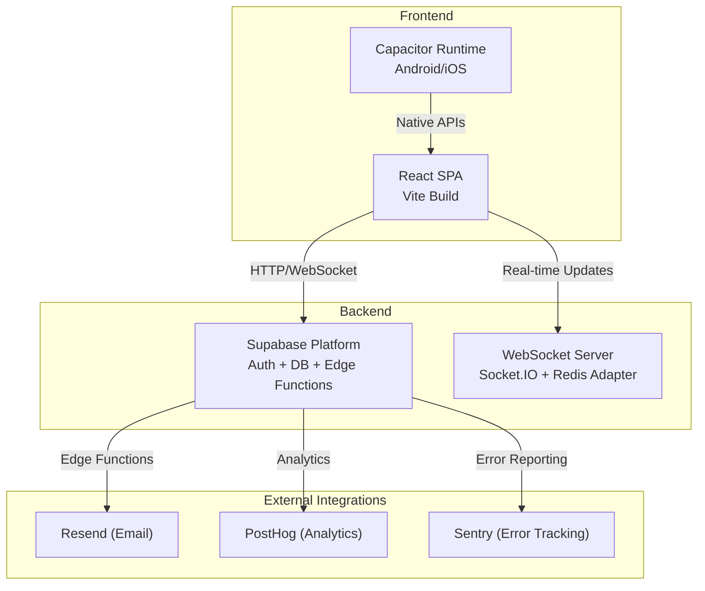
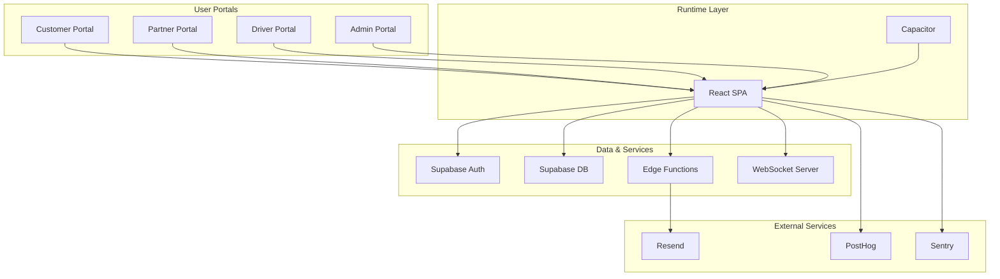
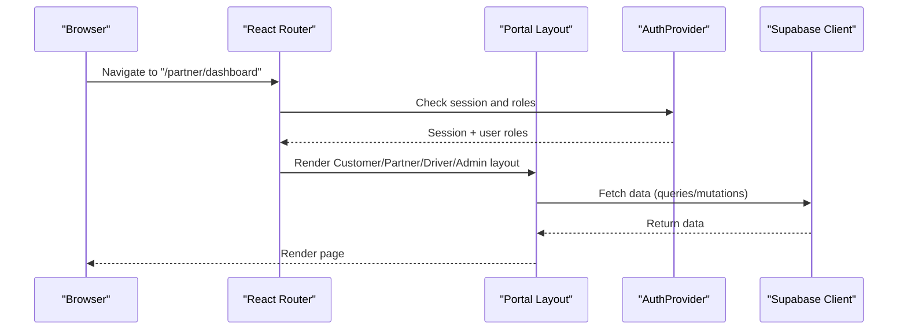
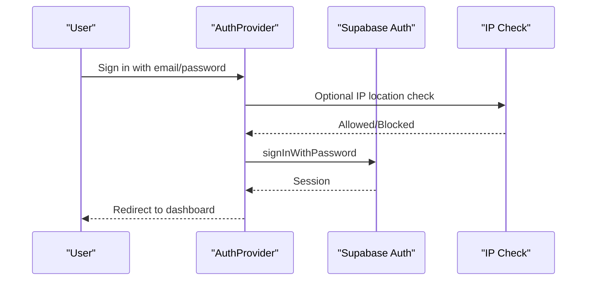
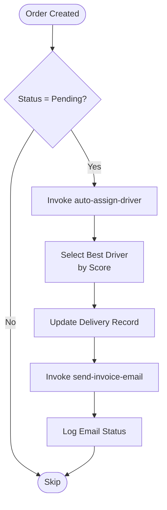
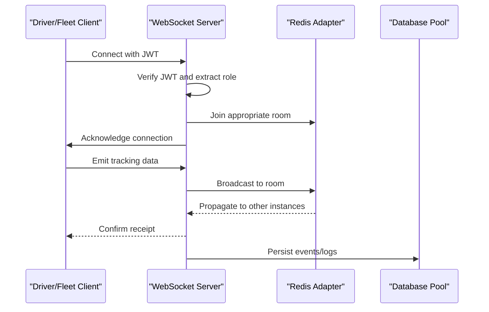
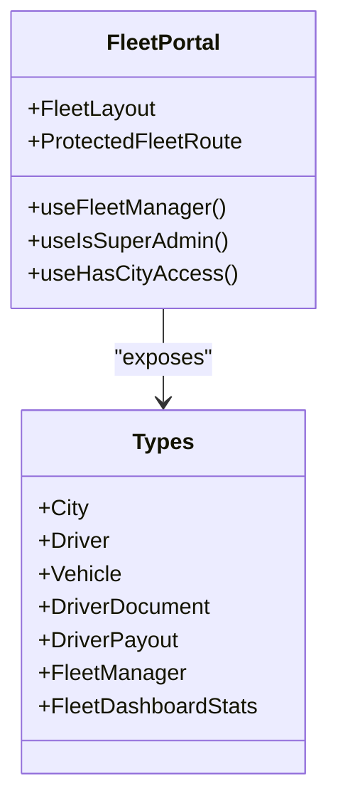
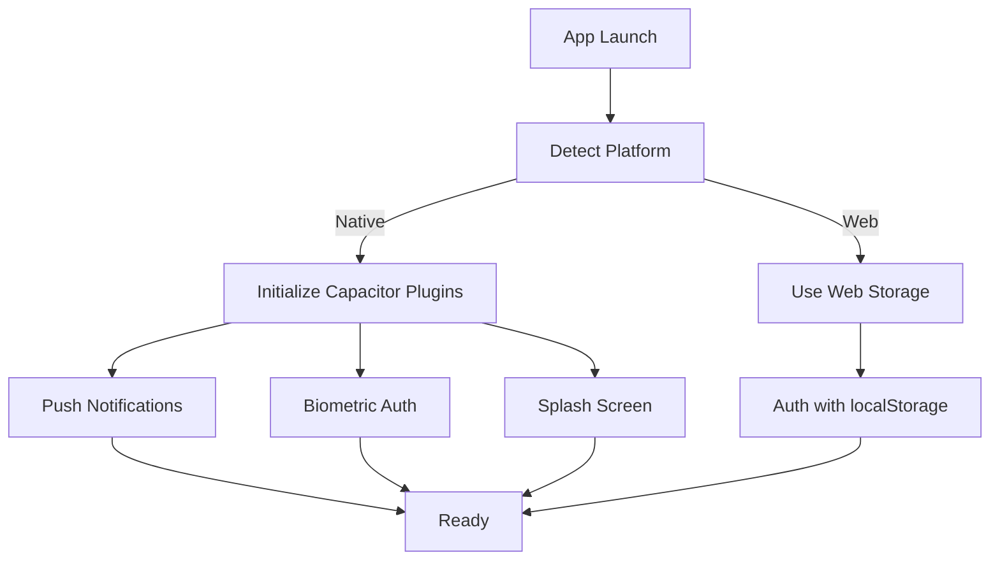
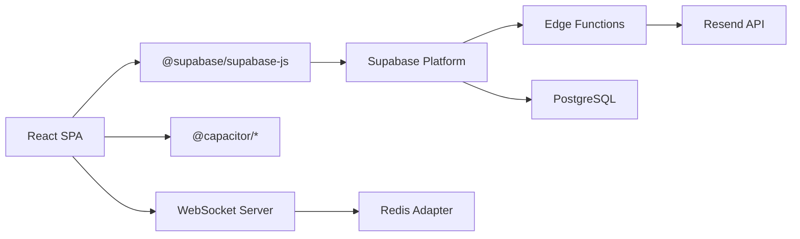

# System Architecture

<cite>
**Referenced Files in This Document**
- [package.json](file://package.json)
- [App.tsx](file://src/App.tsx)
- [AuthContext.tsx](file://src/contexts/AuthContext.tsx)
- [client.ts](file://src/integrations/supabase/client.ts)
- [capacitor.config.ts](file://capacitor.config.ts)
- [config.toml](file://supabase/config.toml)
- [server.ts](file://websocket-server/src/server.ts)
- [index.ts](file://src/fleet/index.ts)
- [DEPLOYMENT.md](file://DEPLOYMENT.md)
- [PHASE2_EDGE_FUNCTIONS.md](file://supabase/functions/PHASE2_EDGE_FUNCTIONS.md)
- [system-architecture.html](file://docs/plans/system-architecture.html)
- [nutrio-system-documentation.html](file://docs/plans/nutrio-system-documentation.html)
</cite>

## Table of Contents
1. [Introduction](#introduction)
2. [Project Structure](#project-structure)
3. [Core Components](#core-components)
4. [Architecture Overview](#architecture-overview)
5. [Detailed Component Analysis](#detailed-component-analysis)
6. [Dependency Analysis](#dependency-analysis)
7. [Performance Considerations](#performance-considerations)
8. [Troubleshooting Guide](#troubleshooting-guide)
9. [Conclusion](#conclusion)
10. [Appendices](#appendices)

## Introduction
This document describes the Nutrio system architecture, focusing on the React frontend, Supabase backend, mobile applications, and real-time communication layers. It explains how customer, partner, driver, and admin portals integrate through a unified single-page application (SPA) with role-based routing, Supabase authentication and database, edge functions for automation, and a dedicated WebSocket server for real-time fleet tracking. The document also covers technical decisions around multi-tenancy, edge functions, real-time database synchronization, infrastructure requirements, scalability, and deployment topology.

## Project Structure
The repository combines:
- A React SPA with TypeScript and Vite
- Supabase for authentication, database, and edge functions
- Capacitor for native mobile capabilities
- A standalone WebSocket server for real-time fleet tracking
- Extensive documentation and deployment scripts

**Diagram sources**
- [package.json:1-159](file://package.json#L1-L159)
- [capacitor.config.ts:1-45](file://capacitor.config.ts#L1-L45)
- [server.ts:1-256](file://websocket-server/src/server.ts#L1-L256)

**Section sources**
- [package.json:1-159](file://package.json#L1-L159)
- [system-architecture.html:1-800](file://docs/plans/system-architecture.html#L1-L800)

## Core Components
- React SPA with role-based routing and protected routes for customer, partner, driver, and admin portals
- Supabase integration for authentication, session persistence, and database access
- Capacitor for native mobile features (push notifications, biometrics, device APIs)
- WebSocket server for real-time fleet tracking with JWT authentication and Redis adapter
- Supabase edge functions for automation (driver assignment, invoice emails)

Key implementation references:
- Application shell and routing: [App.tsx:1-739](file://src/App.tsx#L1-L739)
- Authentication provider and session management: [AuthContext.tsx:1-131](file://src/contexts/AuthContext.tsx#L1-L131)
- Supabase client initialization and storage adapter: [client.ts:1-57](file://src/integrations/supabase/client.ts#L1-L57)
- Capacitor configuration for native features: [capacitor.config.ts:1-45](file://capacitor.config.ts#L1-L45)
- WebSocket server with Redis adapter and JWT auth: [server.ts:1-256](file://websocket-server/src/server.ts#L1-L256)
- Supabase edge functions configuration: [config.toml:1-59](file://supabase/config.toml#L1-L59)

**Section sources**
- [App.tsx:1-739](file://src/App.tsx#L1-L739)
- [AuthContext.tsx:1-131](file://src/contexts/AuthContext.tsx#L1-L131)
- [client.ts:1-57](file://src/integrations/supabase/client.ts#L1-L57)
- [capacitor.config.ts:1-45](file://capacitor.config.ts#L1-L45)
- [server.ts:1-256](file://websocket-server/src/server.ts#L1-L256)
- [config.toml:1-59](file://supabase/config.toml#L1-L59)

## Architecture Overview
The system follows a modern cloud-native architecture:
- Frontend: React SPA with TypeScript, Vite, and React Router for role-based navigation
- Backend: Supabase providing authentication, relational database, and edge functions
- Mobile: Capacitor wraps the web app into native Android/iOS experiences
- Real-time: Dedicated WebSocket server for driver/fleet tracking with Redis adapter for horizontal scaling
- Integrations: Resend for invoice emails, PostHog for analytics, Sentry for error reporting

**Diagram sources**
- [App.tsx:1-739](file://src/App.tsx#L1-L739)
- [client.ts:1-57](file://src/integrations/supabase/client.ts#L1-L57)
- [server.ts:1-256](file://websocket-server/src/server.ts#L1-L256)
- [PHASE2_EDGE_FUNCTIONS.md:1-411](file://supabase/functions/PHASE2_EDGE_FUNCTIONS.md#L1-L411)

## Detailed Component Analysis

### React SPA and Routing
- Single-page application with lazy-loaded routes grouped by portal
- ProtectedRoute wrapper enforces role-based access control
- NativeRouteRedirect integrates Capacitor deep links and navigation
- Scroll-to-top behavior and session timeout manager improve UX

**Diagram sources**
- [App.tsx:174-724](file://src/App.tsx#L174-L724)
- [AuthContext.tsx:31-61](file://src/contexts/AuthContext.tsx#L31-L61)

**Section sources**
- [App.tsx:1-739](file://src/App.tsx#L1-L739)
- [AuthContext.tsx:1-131](file://src/contexts/AuthContext.tsx#L1-L131)

### Supabase Authentication and Session Management
- Supabase client configured with Capacitor-native storage adapter for sessions
- AuthProvider subscribes to auth state changes and initializes push notifications on native platforms
- IP location checks during login for geo-restrictions and blocking

**Diagram sources**
- [AuthContext.tsx:63-112](file://src/contexts/AuthContext.tsx#L63-L112)
- [client.ts:18-42](file://src/integrations/supabase/client.ts#L18-L42)

**Section sources**
- [AuthContext.tsx:1-131](file://src/contexts/AuthContext.tsx#L1-L131)
- [client.ts:1-57](file://src/integrations/supabase/client.ts#L1-L57)

### Supabase Edge Functions
- Edge functions enable serverless automation for driver assignment and invoice emails
- Functions are configured in Supabase with JWT verification disabled for simplified invocation
- Deployment via Supabase CLI with environment variables for service URLs and API keys

**Diagram sources**
- [PHASE2_EDGE_FUNCTIONS.md:258-321](file://supabase/functions/PHASE2_EDGE_FUNCTIONS.md#L258-L321)
- [config.toml:3-59](file://supabase/config.toml#L3-L59)

**Section sources**
- [PHASE2_EDGE_FUNCTIONS.md:1-411](file://supabase/functions/PHASE2_EDGE_FUNCTIONS.md#L1-L411)
- [config.toml:1-59](file://supabase/config.toml#L1-L59)

### Real-Time Communication: WebSocket Server
- Socket.IO server with Redis adapter for multi-instance scaling
- JWT-based authentication with role-specific connection handling
- Metrics and health endpoints for monitoring capacity and readiness

**Diagram sources**
- [server.ts:65-150](file://websocket-server/src/server.ts#L65-L150)
- [server.ts:162-192](file://websocket-server/src/server.ts#L162-L192)

**Section sources**
- [server.ts:1-256](file://websocket-server/src/server.ts#L1-L256)

### Multi-Tenant and Data Isolation
- Supabase Row Level Security (RLS) policies govern access per user role
- Edge functions use service role keys to bypass RLS for internal operations
- Fleet management portal exposes typed routes and protected components for city-level access control

**Diagram sources**
- [index.ts:1-14](file://src/fleet/index.ts#L1-L14)

**Section sources**
- [index.ts:1-14](file://src/fleet/index.ts#L1-L14)

### Mobile Integration with Capacitor
- Capacitor configuration enables native features: push notifications, local notifications, biometric authentication, splash screen, and keyboard handling
- Web app served via Capacitor server with allow-navigation to Supabase domains
- Native app initialization sets status bar, hides splash, and requests notification permissions

**Diagram sources**
- [capacitor.config.ts:3-42](file://capacitor.config.ts#L3-L42)
- [client.ts:18-42](file://src/integrations/supabase/client.ts#L18-L42)

**Section sources**
- [capacitor.config.ts:1-45](file://capacitor.config.ts#L1-L45)
- [client.ts:1-57](file://src/integrations/supabase/client.ts#L1-L57)

## Dependency Analysis
- Frontend depends on Supabase JS SDK for auth and database operations
- Edge functions depend on Supabase service role keys and external providers (Resend)
- WebSocket server depends on Redis adapter and PostgreSQL for persistence
- Capacitor plugins provide native capabilities with graceful fallbacks on web

**Diagram sources**
- [package.json:93-126](file://package.json#L93-L126)
- [PHASE2_EDGE_FUNCTIONS.md:14-30](file://supabase/functions/PHASE2_EDGE_FUNCTIONS.md#L14-L30)
- [server.ts:54-55](file://websocket-server/src/server.ts#L54-L55)

**Section sources**
- [package.json:1-159](file://package.json#L1-L159)
- [PHASE2_EDGE_FUNCTIONS.md:1-411](file://supabase/functions/PHASE2_EDGE_FUNCTIONS.md#L1-L411)
- [server.ts:1-256](file://websocket-server/src/server.ts#L1-L256)

## Performance Considerations
- React lazy loading reduces initial bundle size; route groups minimize payload per portal
- Supabase edge functions offload work from the main application, improving responsiveness
- WebSocket server uses Redis adapter for horizontal scaling and compression thresholds for bandwidth efficiency
- Capacitor caching and native storage reduce repeated network calls on mobile devices

[No sources needed since this section provides general guidance]

## Troubleshooting Guide
Common issues and resolutions:
- Supabase CLI not found: Install globally and link project with correct project reference
- Function deployment errors: Check Supabase dashboard for detailed error messages
- Database migration conflicts: Reset database using CLI or restore from backup
- IP management: Use admin panel to view blocked IPs and logs; verify geo-restrictions and blocking logic
- WebSocket server capacity: Monitor health endpoint and adjust max connections; ensure Redis is healthy

**Section sources**
- [DEPLOYMENT.md:96-137](file://DEPLOYMENT.md#L96-L137)

## Conclusion
Nutrio employs a cohesive architecture combining a modern React SPA, Supabase backend, Capacitor-powered mobile apps, and a dedicated WebSocket server for real-time fleet tracking. Role-based routing, Supabase authentication, and edge functions enable scalable automation, while the WebSocket server ensures reliable real-time updates. The system emphasizes performance, security, and maintainability through lazy loading, RLS, and modular components.

[No sources needed since this section summarizes without analyzing specific files]

## Appendices

### Infrastructure Requirements
- Node.js v18+, npm v8+
- Supabase CLI for deployment and management
- Docker for local development environments
- Redis for WebSocket server scaling
- API keys for Resend, PostHog, and Sentry

**Section sources**
- [DEPLOYMENT.md:5-12](file://DEPLOYMENT.md#L5-L12)
- [server.ts:21-32](file://websocket-server/src/server.ts#L21-L32)

### Scalability Considerations
- Horizontal scaling: WebSocket server uses Redis adapter; edge functions are serverless
- Database: Supabase managed PostgreSQL with RLS and indexing strategies
- CDN/static hosting: Supabase hosting for frontend assets
- Monitoring: PostHog analytics, Sentry error tracking, and WebSocket health endpoints

**Section sources**
- [server.ts:54-55](file://websocket-server/src/server.ts#L54-L55)
- [system-architecture.html:1-800](file://docs/plans/system-architecture.html#L1-L800)