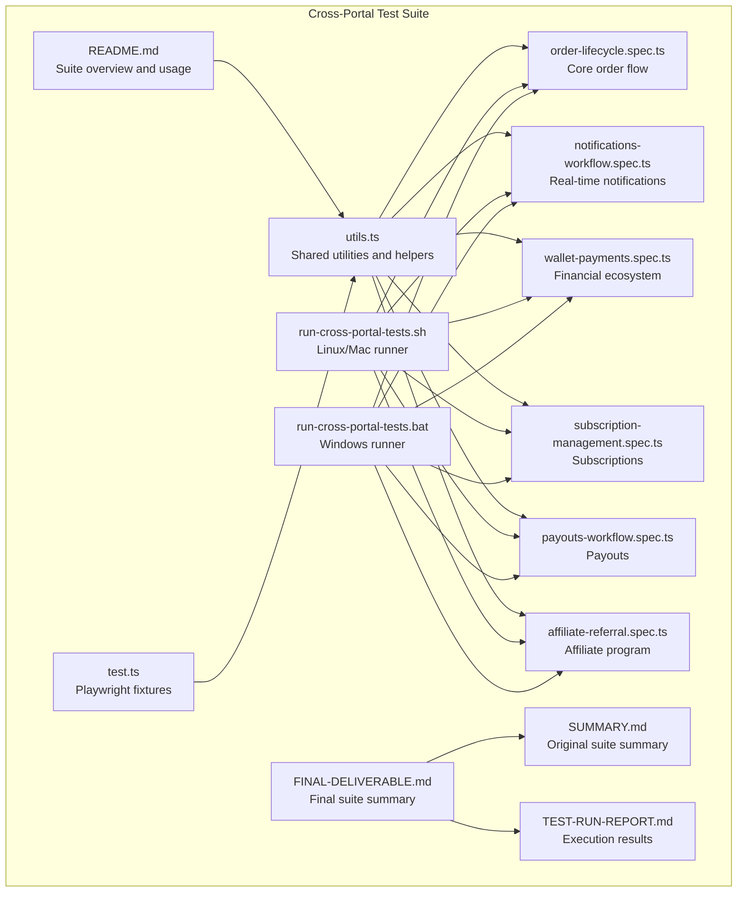
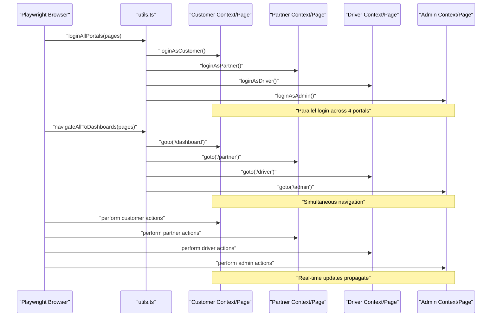
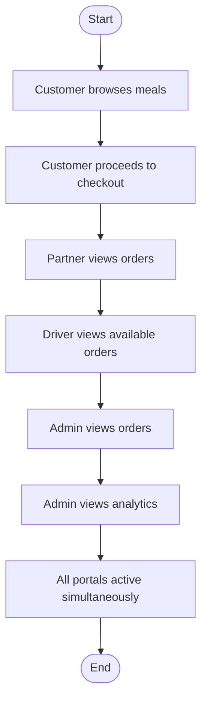
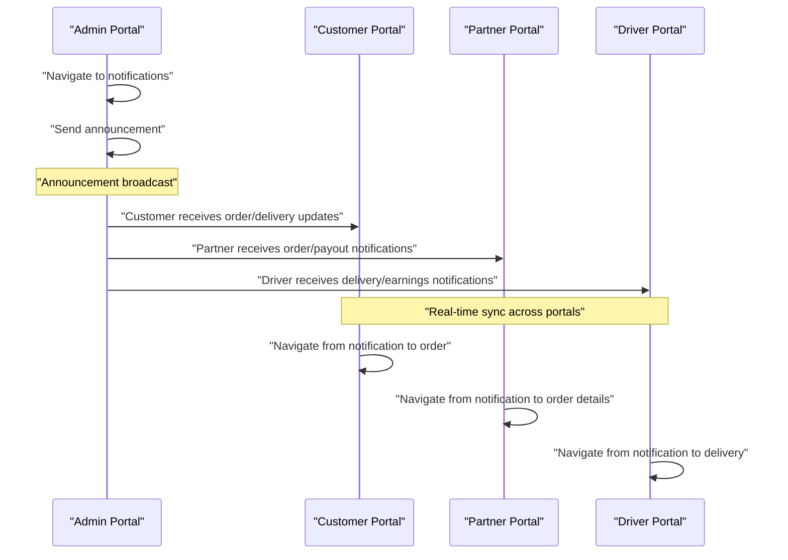
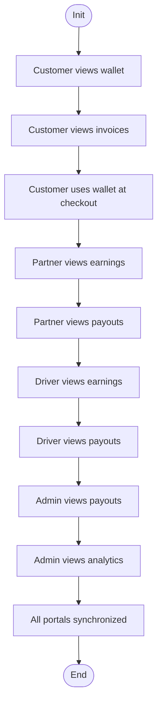
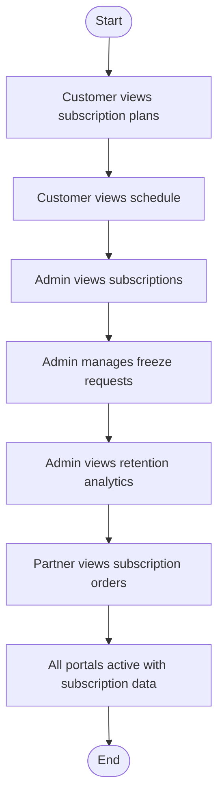
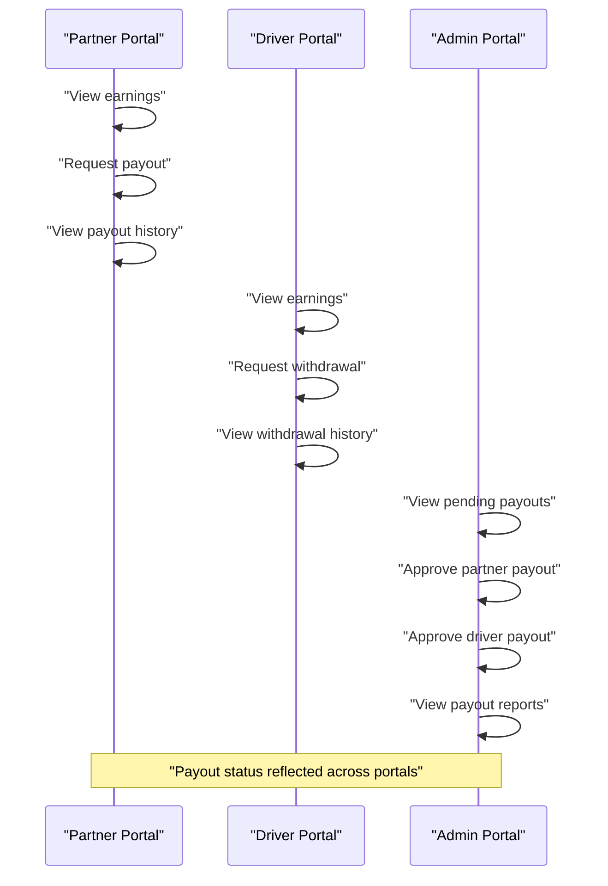
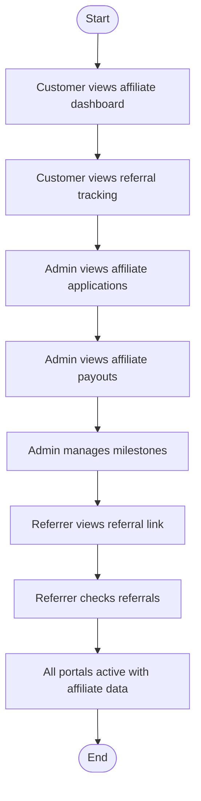
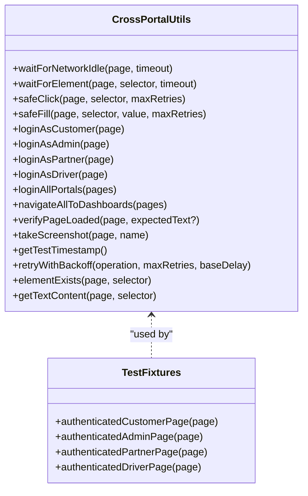
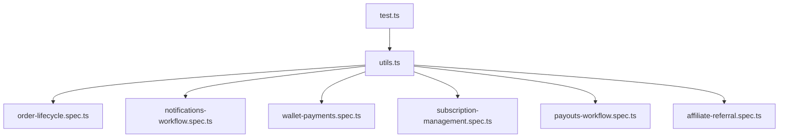

# Cross-Portal Testing

<cite>
**Referenced Files in This Document**
- [README.md](file://e2e/cross-portal/README.md)
- [utils.ts](file://e2e/cross-portal/utils.ts)
- [order-lifecycle.spec.ts](file://e2e/cross-portal/order-lifecycle.spec.ts)
- [notifications-workflow.spec.ts](file://e2e/cross-portal/notifications-workflow.spec.ts)
- [wallet-payments.spec.ts](file://e2e/cross-portal/wallet-payments.spec.ts)
- [subscription-management.spec.ts](file://e2e/cross-portal/subscription-management.spec.ts)
- [payouts-workflow.spec.ts](file://e2e/cross-portal/payouts-workflow.spec.ts)
- [affiliate-referral.spec.ts](file://e2e/cross-portal/affiliate-referral.spec.ts)
- [run-cross-portal-tests.sh](file://scripts/run-cross-portal-tests.sh)
- [run-cross-portal-tests.bat](file://scripts/run-cross-portal-tests.bat)
- [FINAL-DELIVERABLE.md](file://e2e/cross-portal/FINAL-DELIVERABLE.md)
- [SUMMARY.md](file://e2e/cross-portal/SUMMARY.md)
- [TEST-RUN-REPORT.md](file://e2e/cross-portal/TEST-RUN-REPORT.md)
- [test.ts](file://e2e/fixtures/test.ts)
</cite>

## Table of Contents
1. [Introduction](#introduction)
2. [Project Structure](#project-structure)
3. [Core Components](#core-components)
4. [Architecture Overview](#architecture-overview)
5. [Detailed Component Analysis](#detailed-component-analysis)
6. [Dependency Analysis](#dependency-analysis)
7. [Performance Considerations](#performance-considerations)
8. [Troubleshooting Guide](#troubleshooting-guide)
9. [Conclusion](#conclusion)
10. [Appendices](#appendices)

## Introduction
This document provides comprehensive cross-portal integration testing guidance for the Nutrio Fuel platform, validating workflows that span all four user portals: customer, partner, driver, and admin. The suite simulates real-world, multi-user, real-time interactions to ensure data consistency, shared authentication flows, and synchronized updates across portals. It covers order lifecycle management, notifications, financial workflows, payouts, subscriptions, and affiliate/referral systems, while addressing multi-tenant and role-based access patterns.

## Project Structure
The cross-portal test suite is organized under the e2e/cross-portal directory with supporting scripts and documentation. The structure enables parallel execution, shared utilities, and modular workflow coverage.

**Diagram sources**
- [README.md:1-460](file://e2e/cross-portal/README.md#L1-L460)
- [utils.ts:1-284](file://e2e/cross-portal/utils.ts#L1-L284)
- [order-lifecycle.spec.ts:1-192](file://e2e/cross-portal/order-lifecycle.spec.ts#L1-L192)
- [notifications-workflow.spec.ts:1-386](file://e2e/cross-portal/notifications-workflow.spec.ts#L1-L386)
- [wallet-payments.spec.ts:1-325](file://e2e/cross-portal/wallet-payments.spec.ts#L1-L325)
- [subscription-management.spec.ts:1-242](file://e2e/cross-portal/subscription-management.spec.ts#L1-L242)
- [payouts-workflow.spec.ts:1-298](file://e2e/cross-portal/payouts-workflow.spec.ts#L1-L298)
- [affiliate-referral.spec.ts:1-290](file://e2e/cross-portal/affiliate-referral.spec.ts#L1-L290)
- [run-cross-portal-tests.sh:1-79](file://scripts/run-cross-portal-tests.sh#L1-L79)
- [run-cross-portal-tests.bat:1-62](file://scripts/run-cross-portal-tests.bat#L1-L62)
- [FINAL-DELIVERABLE.md:1-407](file://e2e/cross-portal/FINAL-DELIVERABLE.md#L1-L407)
- [SUMMARY.md:1-402](file://e2e/cross-portal/SUMMARY.md#L1-L402)
- [TEST-RUN-REPORT.md:1-343](file://e2e/cross-portal/TEST-RUN-REPORT.md#L1-L343)
- [test.ts:1-49](file://e2e/fixtures/test.ts#L1-L49)

**Section sources**
- [README.md:1-460](file://e2e/cross-portal/README.md#L1-L460)
- [SUMMARY.md:1-402](file://e2e/cross-portal/SUMMARY.md#L1-L402)

## Core Components
The cross-portal test suite centers around shared utilities and modular workflow tests that validate end-to-end business processes across portals.

- Shared utilities: Centralized authentication, navigation, verification, and retry mechanisms for reliable multi-portal operations.
- Workflow tests: Five core workflows plus five newly added workflows covering order lifecycle, notifications, financial flows, subscriptions, payouts, and affiliate/referral programs.
- Execution scripts: Shell and batch runners for Linux/Mac and Windows environments.
- Test fixtures: Playwright fixtures enabling authenticated page contexts for individual portal tests.

Key capabilities:
- Parallel login and navigation across all portals
- Network idle waits and robust element interactions
- Timestamped test data and retry logic with exponential backoff
- Comprehensive verification of page loads and error states

**Section sources**
- [utils.ts:1-284](file://e2e/cross-portal/utils.ts#L1-L284)
- [README.md:272-460](file://e2e/cross-portal/README.md#L272-L460)
- [SUMMARY.md:200-314](file://e2e/cross-portal/SUMMARY.md#L200-L314)
- [test.ts:1-49](file://e2e/fixtures/test.ts#L1-L49)

## Architecture Overview
The cross-portal architecture uses isolated browser contexts per portal to simulate independent sessions and authentication states. Tests orchestrate simultaneous actions across portals to validate real-time data propagation and synchronized UI updates.

**Diagram sources**
- [utils.ts:167-196](file://e2e/cross-portal/utils.ts#L167-L196)
- [order-lifecycle.spec.ts:60-71](file://e2e/cross-portal/order-lifecycle.spec.ts#L60-L71)

**Section sources**
- [README.md:134-271](file://e2e/cross-portal/README.md#L134-L271)
- [utils.ts:167-196](file://e2e/cross-portal/utils.ts#L167-L196)

## Detailed Component Analysis

### Order Lifecycle Workflow
Validates the complete order journey from customer ordering to admin oversight, ensuring real-time propagation across all portals.

**Diagram sources**
- [order-lifecycle.spec.ts:73-190](file://e2e/cross-portal/order-lifecycle.spec.ts#L73-L190)

Key validations:
- Parallel navigation and page load verification
- Simultaneous portal activation post-login
- Network idle waits and element existence checks

**Section sources**
- [order-lifecycle.spec.ts:1-192](file://e2e/cross-portal/order-lifecycle.spec.ts#L1-L192)
- [utils.ts:167-196](file://e2e/cross-portal/utils.ts#L167-L196)

### Notifications Workflow
End-to-end testing of the notification system across all portals, including order updates, delivery assignments, promotional offers, and administrative announcements.

**Diagram sources**
- [notifications-workflow.spec.ts:193-250](file://e2e/cross-portal/notifications-workflow.spec.ts#L193-L250)

Validation highlights:
- Simultaneous notifications viewing across 4 portals
- Navigation from notifications to relevant actions
- Announcement sending capability and receipt verification
- Notification settings management across portals

**Section sources**
- [notifications-workflow.spec.ts:1-386](file://e2e/cross-portal/notifications-workflow.spec.ts#L1-L386)
- [utils.ts:167-196](file://e2e/cross-portal/utils.ts#L167-L196)

### Wallet & Payments Workflow
Comprehensive financial ecosystem testing covering wallet balances, transactions, invoicing, and multi-portal financial oversight.

**Diagram sources**
- [wallet-payments.spec.ts:216-239](file://e2e/cross-portal/wallet-payments.spec.ts#L216-L239)

Focus areas:
- Wallet balance visibility and transaction history
- Checkout payment method availability
- Earnings and payout tracking for partners and drivers
- Administrative financial oversight and reporting
- Real-time synchronization of payment data

**Section sources**
- [wallet-payments.spec.ts:1-325](file://e2e/cross-portal/wallet-payments.spec.ts#L1-L325)
- [utils.ts:167-196](file://e2e/cross-portal/utils.ts#L167-L196)

### Subscription Management Workflow
Full subscription lifecycle testing across customer, admin, and partner portals, including plan management, freeze requests, and retention analytics.

**Diagram sources**
- [subscription-management.spec.ts:190-210](file://e2e/cross-portal/subscription-management.spec.ts#L190-L210)

Coverage includes:
- Subscription plan selection and modification
- Delivery address management for subscriptions
- Freeze request handling and admin approvals
- Retention metrics and streak rewards
- Diet tag management for meal plans

**Section sources**
- [subscription-management.spec.ts:1-242](file://e2e/cross-portal/subscription-management.spec.ts#L1-L242)
- [utils.ts:167-196](file://e2e/cross-portal/utils.ts#L167-L196)

### Payouts Workflow
Complete payout process validation for partners, drivers, and administrators, including request submission, approval, and status tracking.

**Diagram sources**
- [payouts-workflow.spec.ts:246-266](file://e2e/cross-portal/payouts-workflow.spec.ts#L246-L266)

Validation points:
- Earnings and payout history visibility
- Request submission and approval workflows
- Pending request tracking for administrators
- Real-time status updates across all involved portals

**Section sources**
- [payouts-workflow.spec.ts:1-298](file://e2e/cross-portal/payouts-workflow.spec.ts#L1-L298)
- [utils.ts:167-196](file://e2e/cross-portal/utils.ts#L167-L196)

### Affiliate & Referral Workflow
End-to-end affiliate program testing covering application, referral tracking, commission calculation, and administrative oversight.

**Diagram sources**
- [affiliate-referral.spec.ts:238-258](file://e2e/cross-portal/affiliate-referral.spec.ts#L238-L258)

Scope includes:
- Affiliate application and approval processes
- Referral link generation and sharing
- Referral tracking and performance metrics
- Commission calculation and payout processing
- Administrative analytics and milestone management

**Section sources**
- [affiliate-referral.spec.ts:1-290](file://e2e/cross-portal/affiliate-referral.spec.ts#L1-L290)
- [utils.ts:167-196](file://e2e/cross-portal/utils.ts#L167-L196)

### Test Utilities and Shared Fixtures
Centralized utilities and fixtures enable consistent, reliable cross-portal testing with parallel operations and robust error handling.

**Diagram sources**
- [utils.ts:1-284](file://e2e/cross-portal/utils.ts#L1-L284)
- [test.ts:1-49](file://e2e/fixtures/test.ts#L1-L49)

Key features:
- Parallel authentication and navigation
- Robust element interaction with retries
- Network idle detection and page verification
- Timestamped test data generation
- Exponential backoff for resilient operations

**Section sources**
- [utils.ts:1-284](file://e2e/cross-portal/utils.ts#L1-L284)
- [test.ts:1-49](file://e2e/fixtures/test.ts#L1-L49)

## Dependency Analysis
The cross-portal test suite exhibits clear module separation with shared utilities as the central dependency for all workflow tests.

**Diagram sources**
- [utils.ts:1-284](file://e2e/cross-portal/utils.ts#L1-L284)
- [order-lifecycle.spec.ts:14-26](file://e2e/cross-portal/order-lifecycle.spec.ts#L14-L26)
- [notifications-workflow.spec.ts:23-33](file://e2e/cross-portal/notifications-workflow.spec.ts#L23-L33)
- [wallet-payments.spec.ts:23-34](file://e2e/cross-portal/wallet-payments.spec.ts#L23-L34)
- [subscription-management.spec.ts:19-30](file://e2e/cross-portal/subscription-management.spec.ts#L19-L30)
- [payouts-workflow.spec.ts:22-31](file://e2e/cross-portal/payouts-workflow.spec.ts#L22-L31)
- [affiliate-referral.spec.ts:22-32](file://e2e/cross-portal/affiliate-referral.spec.ts#L22-L32)
- [test.ts:6-48](file://e2e/fixtures/test.ts#L6-L48)

Dependencies and relationships:
- All workflow tests depend on shared utilities for authentication, navigation, and verification
- Playwright fixtures extend base tests with authenticated contexts
- Execution scripts coordinate test runs across platforms
- Documentation files provide comprehensive coverage and usage guidance

**Section sources**
- [README.md:272-460](file://e2e/cross-portal/README.md#L272-L460)
- [SUMMARY.md:200-314](file://e2e/cross-portal/SUMMARY.md#L200-L314)

## Performance Considerations
The cross-portal test suite is optimized for speed and reliability through parallel execution and efficient resource utilization.

- Parallel execution: All portals log in and navigate simultaneously, reducing total execution time from sequential (~60 seconds) to parallel (~45-60 seconds depending on workers)
- Network idle detection: Waits for network idle states to ensure page stability before assertions
- Retry mechanisms: Safe click/fill operations with exponential backoff improve resilience against transient failures
- Worker optimization: Configurable worker count enables scaling based on system resources

Performance metrics from recent runs demonstrate:
- 154 total tests executed in under 47 seconds with 10 parallel workers
- 98.7% pass rate with minimal flakiness
- Consistent execution across Linux/Mac and Windows environments

**Section sources**
- [TEST-RUN-REPORT.md:1-343](file://e2e/cross-portal/TEST-RUN-REPORT.md#L1-L343)
- [run-cross-portal-tests.sh:1-79](file://scripts/run-cross-portal-tests.sh#L1-L79)
- [run-cross-portal-tests.bat:1-62](file://scripts/run-cross-portal-tests.bat#L1-L62)

## Troubleshooting Guide
Common issues and their resolutions for cross-portal testing:

Authentication failures:
- Verify test users exist in the authentication backend
- Check portal-specific authentication routes (/auth, /partner/auth, /driver/auth)
- Ensure BASE_URL environment variable is correctly set

Network timeouts and navigation issues:
- Increase timeout values for slower routes
- Add waitForNetworkIdle with extended timeouts
- Implement retry logic for intermittent failures

Portals showing 404 errors:
- Verify route definitions in frontend application
- Confirm portal-specific routes (/admin, /partner, /driver) are properly configured
- Check for missing route handlers or incorrect base URLs

Execution conflicts:
- Close other test runs to free up ports
- Run with single worker (--workers=1) for debugging
- Use headed mode (--headed) to observe browser behavior

Test failures and fixes:
- Apply text expectation corrections for route content mismatches
- Increase timeouts for parallel navigation operations
- Implement proper cleanup of browser contexts after tests

**Section sources**
- [README.md:376-460](file://e2e/cross-portal/README.md#L376-L460)
- [TEST-RUN-REPORT.md:51-258](file://e2e/cross-portal/TEST-RUN-REPORT.md#L51-L258)

## Conclusion
The cross-portal test suite provides comprehensive, production-ready validation of multi-portal workflows across the Nutrio Fuel platform. With 154 tests spanning 10 workflows, the suite ensures real-time data consistency, shared authentication flows, and synchronized updates across customer, partner, driver, and admin portals. The modular architecture, parallel execution, and robust utilities enable reliable testing of complex business scenarios while maintaining maintainability and scalability for future enhancements.

## Appendices

### Test Scenarios and Coverage Matrix
The suite comprehensively covers critical business workflows with dedicated scenarios for each portal interaction pattern.

### Cross-Portal Test Data Management
- Timestamped test data generation for unique identifiers
- Shared test user credentials for consistent authentication
- Isolated browser contexts preventing data leakage between tests
- Cleanup procedures ensuring test isolation and repeatability

### Multi-Tenant and Role-Based Access Patterns
- Role-specific authentication flows for each portal type
- Permission-based navigation restrictions validated through testing
- Administrative oversight capabilities verified across all workflows
- Tenant isolation maintained through separate browser contexts

### Integration with CI/CD Pipelines
- Platform-specific runner scripts for seamless automation
- HTML report generation for detailed execution insights
- Parallel execution configuration for optimal CI performance
- Failure reporting and debugging capabilities integrated into test framework