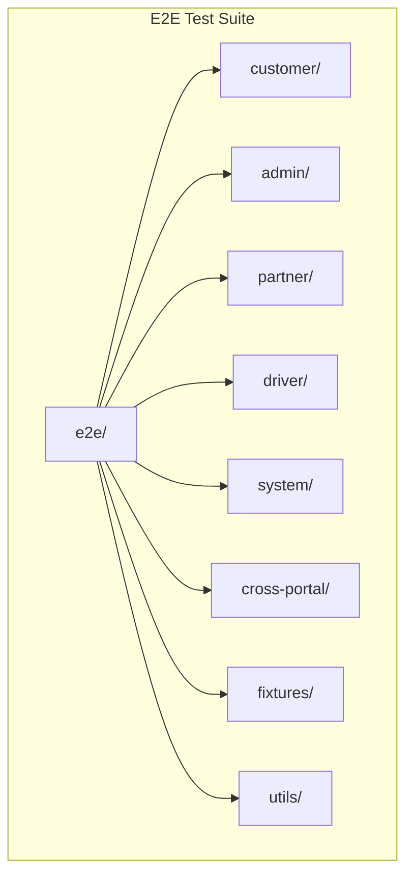
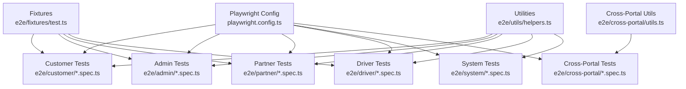
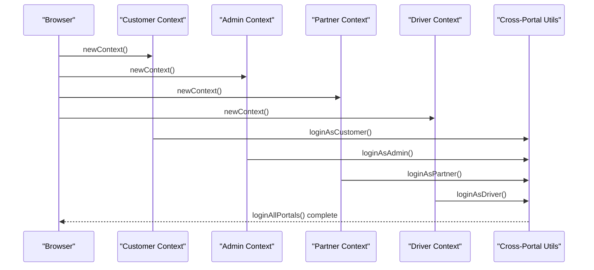
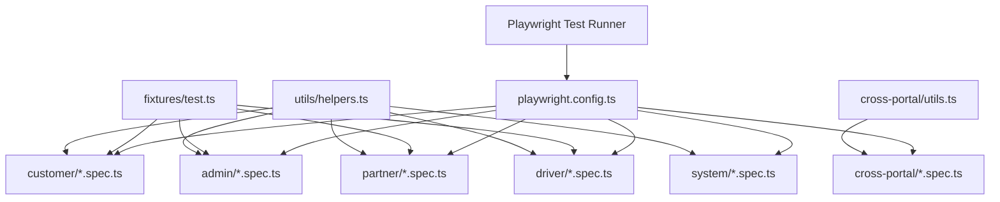

# End-to-End Testing

<cite>
**Referenced Files in This Document**
- [playwright.config.ts](file://playwright.config.ts)
- [package.json](file://package.json)
- [e2e/README.md](file://e2e/README.md)
- [e2e/utils/helpers.ts](file://e2e/utils/helpers.ts)
- [e2e/fixtures/test.ts](file://e2e/fixtures/test.ts)
- [e2e/customer/auth.spec.ts](file://e2e/customer/auth.spec.ts)
- [e2e/admin/dashboard.spec.ts](file://e2e/admin/dashboard.spec.ts)
- [e2e/system/integration.spec.ts](file://e2e/system/integration.spec.ts)
- [e2e/cross-portal/order-lifecycle.spec.ts](file://e2e/cross-portal/order-lifecycle.spec.ts)
- [e2e/cross-portal/utils.ts](file://e2e/cross-portal/utils.ts)
- [e2e/debug.spec.ts](file://e2e/debug.spec.ts)
- [e2e/FINAL-SUMMARY.md](file://e2e/FINAL-SUMMARY.md)
- [e2e/TEST-RUN-REPORT.md](file://e2e/TEST-RUN-REPORT.md)
</cite>

## Table of Contents
1. [Introduction](#introduction)
2. [Project Structure](#project-structure)
3. [Core Components](#core-components)
4. [Architecture Overview](#architecture-overview)
5. [Detailed Component Analysis](#detailed-component-analysis)
6. [Dependency Analysis](#dependency-analysis)
7. [Performance Considerations](#performance-considerations)
8. [Troubleshooting Guide](#troubleshooting-guide)
9. [Conclusion](#conclusion)
10. [Appendices](#appendices)

## Introduction
This document provides comprehensive end-to-end testing documentation for the Nutrio platform using the Playwright framework. It covers test configuration, browser setup, project structure, execution commands, filtering, debugging, test organization patterns, page object models, reusable utilities, reporting, JSON results export, and video recording. It also addresses test data management, environment configuration, and CI/CD integration patterns. The suite currently includes 927 test cases organized by portal: customer, admin, partner, driver, system, and cross-portal workflows.

## Project Structure
The E2E test suite is organized under the e2e directory with dedicated folders per portal and shared utilities:
- e2e/
  - customer/: 333 tests for customer portal flows
  - admin/: 201 tests for admin portal flows
  - partner/: 213 tests for partner portal flows
  - driver/: 94 tests for driver portal flows
  - system/: 86 tests for system-level integrations
  - cross-portal/: multi-portal integration workflows
  - fixtures/: Playwright test fixtures extending base tests with authenticated pages
  - utils/: shared helpers for authentication, navigation, assertions, and retries
  - Additional supporting files for reports, summaries, and test generation

**Diagram sources**
- [e2e/README.md:61-93](file://e2e/README.md#L61-L93)

**Section sources**
- [e2e/README.md:61-93](file://e2e/README.md#L61-L93)

## Core Components
- Playwright configuration defines test directory, reporters, tracing, screenshots, video recording, timeouts, and browser projects.
- Shared utilities encapsulate authentication, navigation, assertions, retries, and viewport helpers.
- Fixtures provide authenticated pages per portal to simplify test setup and teardown.
- Cross-portal utilities enable multi-context testing for coordinated workflows.

Key configuration highlights:
- Test directory: ./e2e
- Reporters: HTML report, JSON results, list
- Trace, screenshot, and video enabled for all tests
- Fully parallel disabled to avoid conflicts
- Projects configured for Chromium; mobile/webkit/firefox commented for optional cross-browser testing

**Section sources**
- [playwright.config.ts:13-91](file://playwright.config.ts#L13-L91)
- [e2e/utils/helpers.ts:1-239](file://e2e/utils/helpers.ts#L1-L239)
- [e2e/fixtures/test.ts:1-49](file://e2e/fixtures/test.ts#L1-L49)
- [e2e/cross-portal/utils.ts:1-284](file://e2e/cross-portal/utils.ts#L1-L284)

## Architecture Overview
The test architecture centers around Playwright’s test runner, fixtures for authenticated contexts, and shared utilities. Cross-portal tests spawn separate browser contexts to simulate simultaneous user actions across portals.

**Diagram sources**
- [playwright.config.ts:13-91](file://playwright.config.ts#L13-L91)
- [e2e/fixtures/test.ts:17-46](file://e2e/fixtures/test.ts#L17-L46)
- [e2e/utils/helpers.ts:1-239](file://e2e/utils/helpers.ts#L1-L239)
- [e2e/cross-portal/utils.ts:1-284](file://e2e/cross-portal/utils.ts#L1-L284)

## Detailed Component Analysis

### Playwright Configuration
- Test directory: ./e2e
- Parallelism: disabled to prevent conflicts
- CI behavior: forbidOnly, retries on CI, worker count constrained on CI
- Reporters: HTML report output folder, JSON results file, list reporter
- Tracing, screenshots, and video enabled globally
- Projects: Chromium configured; Firefox/Webkit commented for optional use
- Optional webServer hook for local dev server startup

Execution commands:
- Run all tests: npx playwright test
- Run with UI: npx playwright test --ui
- Run headed: npx playwright test --headed
- Filter by portal: npx playwright test customer | admin | partner | driver | system
- Filter by pattern: npx playwright test --grep "TC001" | --grep "Critical"

**Section sources**
- [playwright.config.ts:13-91](file://playwright.config.ts#L13-L91)
- [package.json:27-42](file://package.json#L27-L42)
- [e2e/README.md:32-59](file://e2e/README.md#L32-L59)

### Test Execution Commands and Filtering
- Run all tests: npm run test:e2e
- Run with UI: npm run test:e2e:ui
- Run in debug mode: npm run test:e2e:debug
- Generate HTML report: npm run test:e2e:report
- Run cross-portal tests: npm run test:cross-portal
- Run specific cross-portal workflows:
  - Order lifecycle: npm run test:order-lifecycle
  - Partner onboarding: npm run test:partner-onboarding
  - Driver delivery: npm run test:driver-delivery
  - Admin management: npm run test:admin-management
  - Customer journey: npm run test:customer-journey
  - Subscription management: npm run test:subscription-mgmt
  - Affiliate referral: npm run test:affiliate-referral
  - Wallet payments: npm run test:wallet-payments
  - Payouts: npm run test:payouts
  - Notifications: npm run test:notifications

Filtering:
- By portal: playwright test customer | admin | partner | driver | system
- By pattern: --grep "TC001" | --grep "Critical"

**Section sources**
- [package.json:27-42](file://package.json#L27-L42)
- [e2e/README.md:32-59](file://e2e/README.md#L32-L59)

### Test Case Organization Patterns
- Each portal has a dedicated folder with feature-focused spec files.
- Tests use descriptive names with TC prefixes and feature categories.
- Tests are grouped using test.describe blocks for readability.
- Authentication fixtures provide preconditions for tests.

Examples:
- Customer auth tests demonstrate login, registration, password reset, and logout flows.
- Admin dashboard tests verify dashboard loading and statistics.
- System integration tests outline external service validations.

**Section sources**
- [e2e/customer/auth.spec.ts:1-235](file://e2e/customer/auth.spec.ts#L1-L235)
- [e2e/admin/dashboard.spec.ts:1-125](file://e2e/admin/dashboard.spec.ts#L1-L125)
- [e2e/system/integration.spec.ts:1-143](file://e2e/system/integration.spec.ts#L1-L143)

### Page Object Models and Reusable Test Utilities
Shared utilities consolidate common operations:
- Authentication helpers: loginAsCustomer, loginAsAdmin, loginAsPartner, loginAsDriver, logout
- Navigation and waits: waitForNetworkIdle, waitForElement, navigateTo
- Form interactions: fillForm, clearAndFill, selectOption, check/uncheck checkbox
- Assertions: expectToast, expectUrl, expectElement, expectText
- Tables: getTableRows, clickTableRow
- Search and uploads: search, uploadFile
- Scrolling: scrollToBottom, scrollToElement
- Viewport helpers: setMobileViewport, setTabletViewport, setDesktopViewport
- Local storage helpers: getLocalStorage, setLocalStorage, clearLocalStorage
- Screenshots: takeScreenshot
- Retry logic: retry with configurable attempts and delays

Fixtures:
- authenticatedCustomerPage, authenticatedAdminPage, authenticatedPartnerPage, authenticatedDriverPage
- Each fixture logs in, yields the authenticated page, and ensures logout after use

**Section sources**
- [e2e/utils/helpers.ts:1-239](file://e2e/utils/helpers.ts#L1-L239)
- [e2e/fixtures/test.ts:1-49](file://e2e/fixtures/test.ts#L1-L49)

### Cross-Portal Integration Testing
Cross-portal tests coordinate multiple browser contexts to simulate end-to-end workflows spanning customer, admin, partner, and driver portals:
- Multi-context creation and page initialization
- Parallel login across portals
- Simultaneous navigation to dashboards
- Utility functions for safe interactions, retries, and verification

**Diagram sources**
- [e2e/cross-portal/order-lifecycle.spec.ts:41-64](file://e2e/cross-portal/order-lifecycle.spec.ts#L41-L64)
- [e2e/cross-portal/utils.ts:168-177](file://e2e/cross-portal/utils.ts#L168-L177)

**Section sources**
- [e2e/cross-portal/order-lifecycle.spec.ts:1-192](file://e2e/cross-portal/order-lifecycle.spec.ts#L1-L192)
- [e2e/cross-portal/utils.ts:1-284](file://e2e/cross-portal/utils.ts#L1-L284)

### HTML Report Generation, JSON Results Export, and Video Recording
- HTML report: configured with output folder playwright-report and automatic opening disabled
- JSON results: exported to playwright-report/results.json
- Video recording: enabled for all tests
- Screenshots: enabled for all tests
- Tracing: enabled for all tests

Reports and artifacts:
- HTML report location: playwright-report/index.html
- JSON results: playwright-report/results.json
- Video and screenshot artifacts: stored under test-results/ and playwright-report/ as configured

**Section sources**
- [playwright.config.ts:28-54](file://playwright.config.ts#L28-L54)

### Test Data Management and Environment Configuration
Environment configuration:
- BASE_URL defaults to http://localhost:8080
- Test users credentials defined in shared helpers for customer, admin, partner, and driver
- Scripts to create test users and seed data are documented in summary reports

Current state and blockers:
- Many tests fail due to missing test users and route mismatches between generated tests and actual application routes
- Authentication infrastructure needs to be established across all portals
- Test data seeding and cleanup procedures need implementation

**Section sources**
- [playwright.config.ts:36-38](file://playwright.config.ts#L36-L38)
- [e2e/utils/helpers.ts:8-26](file://e2e/utils/helpers.ts#L8-L26)
- [e2e/FINAL-SUMMARY.md:93-133](file://e2e/FINAL-SUMMARY.md#L93-L133)
- [e2e/TEST-RUN-REPORT.md:97-114](file://e2e/TEST-RUN-REPORT.md#L97-L114)

### CI/CD Integration Patterns
Recommended GitHub Actions workflow:
- Checkout repository
- Setup Node.js
- Install dependencies
- Install Playwright with system dependencies
- Start local dev server
- Run Playwright tests
- Upload playwright-report as artifact

**Section sources**
- [e2e/README.md:165-189](file://e2e/README.md#L165-L189)

## Dependency Analysis
The test suite depends on Playwright for browser automation and TypeScript for type safety. Utilities depend on shared helpers, while fixtures depend on authentication helpers. Cross-portal tests depend on both shared helpers and cross-portal utilities.

**Diagram sources**
- [playwright.config.ts:13-91](file://playwright.config.ts#L13-L91)
- [e2e/fixtures/test.ts:17-46](file://e2e/fixtures/test.ts#L17-L46)
- [e2e/utils/helpers.ts:1-239](file://e2e/utils/helpers.ts#L1-L239)
- [e2e/cross-portal/utils.ts:1-284](file://e2e/cross-portal/utils.ts#L1-L284)

**Section sources**
- [playwright.config.ts:13-91](file://playwright.config.ts#L13-L91)
- [e2e/fixtures/test.ts:1-49](file://e2e/fixtures/test.ts#L1-L49)
- [e2e/utils/helpers.ts:1-239](file://e2e/utils/helpers.ts#L1-L239)
- [e2e/cross-portal/utils.ts:1-284](file://e2e/cross-portal/utils.ts#L1-L284)

## Performance Considerations
- Parallelization is disabled to avoid conflicts; consider enabling selectively for independent suites.
- Retries are configured for CI; adjust based on flakiness observed in your environment.
- Network idle waits and explicit retries reduce flakiness but increase runtime; tune timeouts and retry counts accordingly.
- Video and screenshot capture improve diagnostics but increase disk usage; consider disabling in CI if storage is constrained.

## Troubleshooting Guide
Common issues and resolutions:
- 404 Page Not Found: Route mismatches between generated tests and actual application routes. Update test URLs to match actual routes.
- Login failures: Test user credentials not present in the database. Create test users and ensure authentication endpoints are reachable.
- Missing UI elements: Selectors outdated or missing data-testid attributes. Align selectors with actual UI text and add stable identifiers.
- Dialogs blocking interactions: Overlay elements intercept pointer events. Close dialogs or overlays before interacting.
- Timeouts: Increase actionTimeout/navigationTimeout or add explicit waits for network idle.

Debugging aids:
- Run in debug mode: playwright test --debug
- Open last test trace: playwright show-trace test-results/trace.zip
- Generate HTML report: playwright show-report
- Use debug.spec.ts to inspect page state and locate elements

**Section sources**
- [e2e/README.md:191-202](file://e2e/README.md#L191-L202)
- [e2e/TEST-RUN-REPORT.md:22-65](file://e2e/TEST-RUN-REPORT.md#L22-L65)
- [e2e/debug.spec.ts:1-38](file://e2e/debug.spec.ts#L1-L38)

## Conclusion
The Nutrio E2E test suite leverages Playwright to comprehensively cover customer, admin, partner, driver, system, and cross-portal workflows. While the framework and structure are solid, current test failures stem from missing test data, route mismatches, and incomplete authentication infrastructure. Addressing these blockers—creating test users, aligning test routes with actual application routes, and implementing robust authentication and test data management—will unlock the full potential of the 927-test suite and deliver reliable, maintainable end-to-end coverage.

## Appendices

### Test Coverage Summary
- Customer: 333 tests across auth, onboarding, dashboard, meals, orders, profile, schedule, settings, subscriptions, support, wallet
- Admin: 201 tests across auth, dashboard, analytics, orders, users, restaurants, settings, and more
- Partner: 213 tests across auth, dashboard, menu, orders, earnings, profile, settings, and more
- Driver: 94 tests across auth, dashboard, deliveries, earnings, profile, settings, and more
- System: 86 tests across security, payments, integration, performance, realtime, and more
- Cross-portal: Integration workflows spanning all portals

**Section sources**
- [e2e/README.md:5-14](file://e2e/README.md#L5-L14)