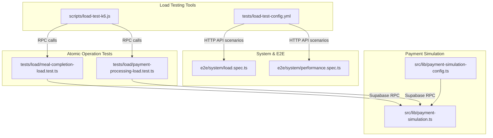
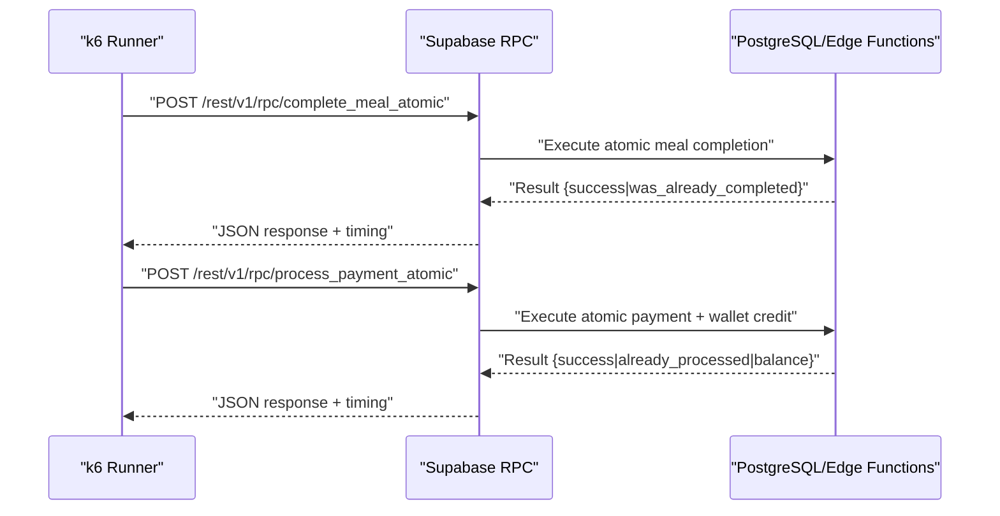
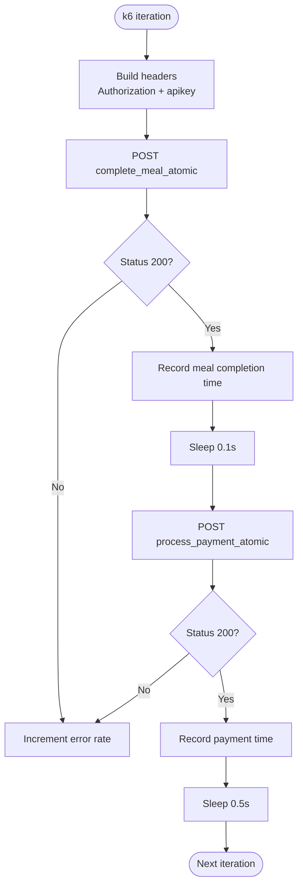
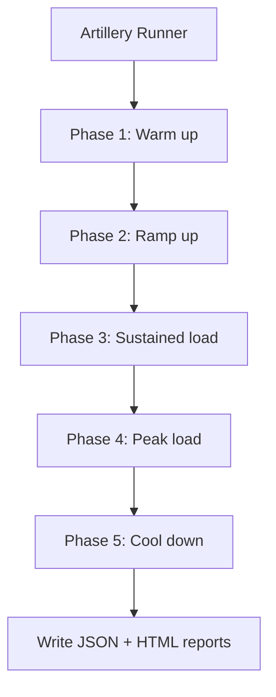
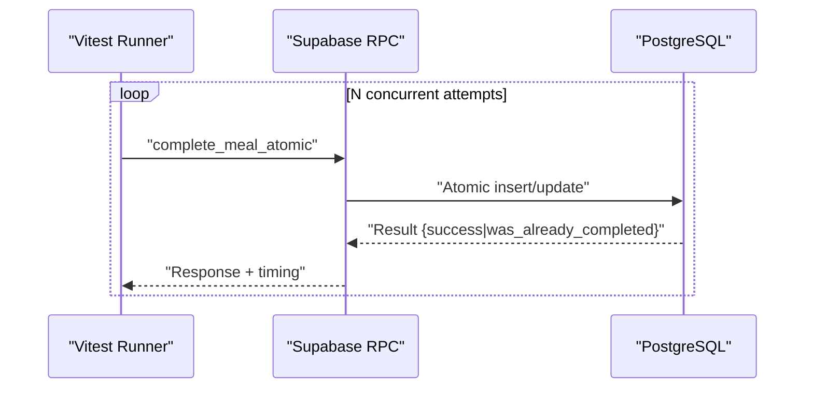
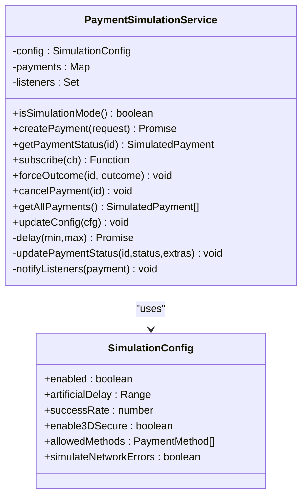
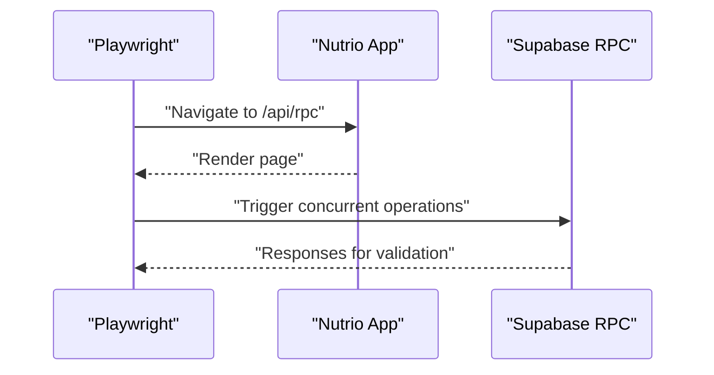
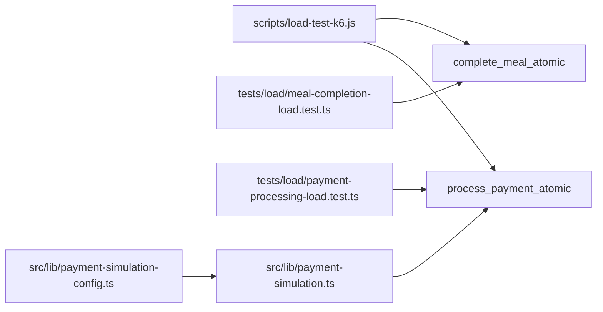

# Load & Performance Testing

<cite>
**Referenced Files in This Document**
- [load-test-k6.js](file://scripts/load-test-k6.js)
- [load-test-config.yml](file://tests/load-test-config.yml)
- [meal-completion-load.test.ts](file://tests/load/meal-completion-load.test.ts)
- [payment-processing-load.test.ts](file://tests/load/payment-processing-load.test.ts)
- [load.spec.ts](file://e2e/system/load.spec.ts)
- [performance.spec.ts](file://e2e/system/performance.spec.ts)
- [payment-simulation.ts](file://src/lib/payment-simulation.ts)
- [payment-simulation-config.ts](file://src/lib/payment-simulation-config.ts)
- [package.json](file://package.json)
- [CONCERNS.md](file://.planning/codebase/CONCERNS.md)
</cite>

## Table of Contents
1. [Introduction](#introduction)
2. [Project Structure](#project-structure)
3. [Core Components](#core-components)
4. [Architecture Overview](#architecture-overview)
5. [Detailed Component Analysis](#detailed-component-analysis)
6. [Dependency Analysis](#dependency-analysis)
7. [Performance Considerations](#performance-considerations)
8. [Troubleshooting Guide](#troubleshooting-guide)
9. [Conclusion](#conclusion)
10. [Appendices](#appendices)

## Introduction
This document provides comprehensive guidance for load and performance testing of the Nutrio application using k6 and complementary test suites. It covers load testing configuration, test scenarios, performance benchmarks, and practical execution strategies. It also explains how to simulate concurrent users, measure performance metrics, interpret results, identify bottlenecks, monitor resource utilization, and automate load tests. Guidance is included for environment-specific best practices, test data management, and performance regression detection.

## Project Structure
The repository includes multiple load and performance testing artifacts:
- k6 scripts for RPC-level load testing
- Artillery configuration for higher-level API scenarios
- Vitest-based load tests for atomic operations
- Playwright system tests for concurrent user scenarios
- Payment simulation utilities enabling realistic load testing without external gateways

**Diagram sources**
- [load-test-k6.js:1-129](file://scripts/load-test-k6.js#L1-L129)
- [load-test-config.yml:1-173](file://tests/load-test-config.yml#L1-L173)
- [meal-completion-load.test.ts:1-188](file://tests/load/meal-completion-load.test.ts#L1-L188)
- [payment-processing-load.test.ts:1-158](file://tests/load/payment-processing-load.test.ts#L1-L158)
- [load.spec.ts:1-83](file://e2e/system/load.spec.ts#L1-L83)
- [performance.spec.ts:1-127](file://e2e/system/performance.spec.ts#L1-L127)
- [payment-simulation.ts:1-222](file://src/lib/payment-simulation.ts#L1-L222)
- [payment-simulation-config.ts:1-43](file://src/lib/payment-simulation-config.ts#L1-L43)

**Section sources**
- [load-test-k6.js:1-129](file://scripts/load-test-k6.js#L1-L129)
- [load-test-config.yml:1-173](file://tests/load-test-config.yml#L1-L173)
- [meal-completion-load.test.ts:1-188](file://tests/load/meal-completion-load.test.ts#L1-L188)
- [payment-processing-load.test.ts:1-158](file://tests/load/payment-processing-load.test.ts#L1-L158)
- [load.spec.ts:1-83](file://e2e/system/load.spec.ts#L1-L83)
- [performance.spec.ts:1-127](file://e2e/system/performance.spec.ts#L1-L127)
- [payment-simulation.ts:1-222](file://src/lib/payment-simulation.ts#L1-L222)
- [payment-simulation-config.ts:1-43](file://src/lib/payment-simulation-config.ts#L1-L43)

## Core Components
- k6 RPC load tests: Execute concurrent calls to Supabase RPC functions for meal completion and payment processing, capturing latency and error rates.
- Artillery scenario suite: Define realistic user journeys across API endpoints with weighted scenarios and thresholds.
- Atomic operation load tests: Use Vitest to stress Supabase RPCs for idempotency and race condition prevention.
- System load and performance tests: Playwright tests scaffolding for concurrent user and performance validations.
- Payment simulation utilities: Provide deterministic, configurable payment outcomes for safe, repeatable load testing.

Key capabilities:
- Concurrent user simulation via k6 and Vitest
- Threshold-driven pass/fail criteria
- Endpoint-level metrics and reporting
- Idempotency and atomicity validation
- Safe payment load testing without real gateways

**Section sources**
- [load-test-k6.js:1-129](file://scripts/load-test-k6.js#L1-L129)
- [load-test-config.yml:1-173](file://tests/load-test-config.yml#L1-L173)
- [meal-completion-load.test.ts:1-188](file://tests/load/meal-completion-load.test.ts#L1-L188)
- [payment-processing-load.test.ts:1-158](file://tests/load/payment-processing-load.test.ts#L1-L158)
- [payment-simulation.ts:1-222](file://src/lib/payment-simulation.ts#L1-L222)
- [payment-simulation-config.ts:1-43](file://src/lib/payment-simulation-config.ts#L1-L43)

## Architecture Overview
The load testing architecture integrates multiple layers:
- k6 orchestrates high-concurrency RPC calls to Supabase
- Artillery defines realistic HTTP API scenarios and thresholds
- Atomic operation tests validate idempotency and race condition prevention
- Payment simulation enables controlled, deterministic payment load testing
- System tests capture concurrent user and performance behaviors

**Diagram sources**
- [load-test-k6.js:47-115](file://scripts/load-test-k6.js#L47-L115)
- [meal-completion-load.test.ts:66](file://tests/load/meal-completion-load.test.ts#L66)
- [payment-processing-load.test.ts:64](file://tests/load/payment-processing-load.test.ts#L64)

**Section sources**
- [load-test-k6.js:1-129](file://scripts/load-test-k6.js#L1-L129)
- [meal-completion-load.test.ts:1-188](file://tests/load/meal-completion-load.test.ts#L1-L188)
- [payment-processing-load.test.ts:1-158](file://tests/load/payment-processing-load.test.ts#L1-L158)

## Detailed Component Analysis

### k6 Load Testing Script
The k6 script defines staged concurrency, custom metrics, and thresholds for RPC-level load testing:
- Stages ramp up to 200 virtual users and then ramp down
- Custom metrics track meal completion and payment processing latencies
- Thresholds enforce p95 response times and error rates
- RPC calls target atomic meal completion and payment processing functions

**Diagram sources**
- [load-test-k6.js:21-35](file://scripts/load-test-k6.js#L21-L35)
- [load-test-k6.js:40-116](file://scripts/load-test-k6.js#L40-L116)

**Section sources**
- [load-test-k6.js:1-129](file://scripts/load-test-k6.js#L1-L129)

### Artillery Load Test Configuration
The Artillery YAML defines multi-phase load with weighted scenarios:
- Phases: warm-up, ramp-up, sustained, peak, cool-down
- Scenarios: browse plans, view recommendations, generate meal plan, place order, check balance
- Thresholds: p95 response time, max error rate, throughput targets
- Reporting: JSON and HTML outputs

**Diagram sources**
- [load-test-config.yml:9-46](file://tests/load-test-config.yml#L9-L46)
- [load-test-config.yml:47-116](file://tests/load-test-config.yml#L47-L116)
- [load-test-config.yml:118-142](file://tests/load-test-config.yml#L118-L142)

**Section sources**
- [load-test-config.yml:1-173](file://tests/load-test-config.yml#L1-L173)

### Atomic Operation Load Tests (Vitest)
These tests validate atomicity and idempotency under concurrency:
- Meal completion: concurrent RPC calls to ensure only one succeeds while others receive idempotent responses
- Payment processing: concurrent RPC calls to ensure atomic wallet credit and double-spending prevention
- Statistics: average, p95, and p99 response times, race condition detection

**Diagram sources**
- [meal-completion-load.test.ts:34-109](file://tests/load/meal-completion-load.test.ts#L34-L109)

**Section sources**
- [meal-completion-load.test.ts:1-188](file://tests/load/meal-completion-load.test.ts#L1-L188)
- [payment-processing-load.test.ts:1-158](file://tests/load/payment-processing-load.test.ts#L1-L158)

### Payment Simulation Utilities
The payment simulation system enables deterministic, safe payment load testing:
- Configurable success rate, artificial delays, and 3D Secure simulation
- Realistic UI flow and event-driven updates
- Seamless switch between simulation and real gateway modes

**Diagram sources**
- [payment-simulation.ts:25-212](file://src/lib/payment-simulation.ts#L25-L212)
- [payment-simulation-config.ts:4-30](file://src/lib/payment-simulation-config.ts#L4-L30)

**Section sources**
- [payment-simulation.ts:1-222](file://src/lib/payment-simulation.ts#L1-L222)
- [payment-simulation-config.ts:1-43](file://src/lib/payment-simulation-config.ts#L1-L43)

### System Load and Performance Tests (Playwright)
Playwright tests scaffold concurrent user and performance validations:
- Load scenarios: concurrent meal completion, payment double-spending prevention, API rate limits
- Performance scenarios: page load times, concurrent users, database queries, API response times

**Diagram sources**
- [load.spec.ts:8-36](file://e2e/system/load.spec.ts#L8-L36)

**Section sources**
- [load.spec.ts:1-83](file://e2e/system/load.spec.ts#L1-L83)
- [performance.spec.ts:1-127](file://e2e/system/performance.spec.ts#L1-L127)

## Dependency Analysis
Load testing components depend on Supabase RPC functions and internal utilities:
- k6 depends on Supabase RPC endpoints for meal completion and payment processing
- Atomic operation tests rely on RPC functions and database state
- Payment simulation provides deterministic outcomes for safe load testing
- System tests depend on application routes and RPC availability

**Diagram sources**
- [load-test-k6.js:47-96](file://scripts/load-test-k6.js#L47-L96)
- [meal-completion-load.test.ts:66](file://tests/load/meal-completion-load.test.ts#L66)
- [payment-processing-load.test.ts:64](file://tests/load/payment-processing-load.test.ts#L64)
- [payment-simulation.ts:25-212](file://src/lib/payment-simulation.ts#L25-L212)
- [payment-simulation-config.ts:4-30](file://src/lib/payment-simulation-config.ts#L4-L30)

**Section sources**
- [load-test-k6.js:1-129](file://scripts/load-test-k6.js#L1-L129)
- [meal-completion-load.test.ts:1-188](file://tests/load/meal-completion-load.test.ts#L1-L188)
- [payment-processing-load.test.ts:1-158](file://tests/load/payment-processing-load.test.ts#L1-L158)
- [payment-simulation.ts:1-222](file://src/lib/payment-simulation.ts#L1-L222)
- [payment-simulation-config.ts:1-43](file://src/lib/payment-simulation-config.ts#L1-L43)

## Performance Considerations
- Concurrency ramping: Use staged ramp-ups to avoid immediate saturation and to observe stabilization
- Idempotency and atomicity: Validate RPC functions handle concurrent requests safely
- Thresholds: Enforce p95 response times and error rates to detect regressions
- Resource monitoring: Track CPU, memory, and database connection pool utilization during tests
- Environment isolation: Prefer dedicated test/staging environments for load tests
- Data hygiene: Clean test data between runs to avoid skewed results

[No sources needed since this section provides general guidance]

## Troubleshooting Guide
Common issues and resolutions:
- Unexpected errors in RPC calls: Verify Supabase RPC functions exist and are deployed
- Race conditions or double-spending: Confirm atomic operations and idempotency checks
- Payment simulation not triggering: Ensure simulation mode is enabled and payment method is supported
- Slow response times: Inspect database indexes, RLS policies, and edge function performance
- Test data inconsistencies: Reset test records before running atomic operation tests

**Section sources**
- [CONCERNS.md:398-432](file://.planning/codebase/CONCERNS.md#L398-L432)
- [payment-simulation.ts:34-42](file://src/lib/payment-simulation.ts#L34-L42)

## Conclusion
The Nutrio repository provides robust load and performance testing assets spanning k6, Artillery, Vitest, and Playwright. By leveraging RPC-level tests, atomic operation validations, and payment simulation utilities, teams can safely and effectively evaluate system behavior under realistic loads. Adopting staged concurrency, strict thresholds, and continuous monitoring supports scalable, reliable deployments.

[No sources needed since this section summarizes without analyzing specific files]

## Appendices

### A. Running k6 Load Tests
- Configure environment variables for Supabase URL and key
- Execute the k6 script with staged concurrency and thresholds
- Review built-in metrics and logs for insights

**Section sources**
- [load-test-k6.js:37-38](file://scripts/load-test-k6.js#L37-L38)
- [load-test-k6.js:21-35](file://scripts/load-test-k6.js#L21-L35)

### B. Writing k6 Scripts and Defining Scenarios
- Define stages for ramp-up, sustained load, and ramp-down
- Create custom metrics for critical paths
- Set thresholds for p95 response times and error rates
- Use environment variables for flexible targeting

**Section sources**
- [load-test-k6.js:21-35](file://scripts/load-test-k6.js#L21-L35)
- [load-test-k6.js:15-18](file://scripts/load-test-k6.js#L15-L18)

### C. Measuring Performance Metrics
- Capture latency distributions (average, p95, p99)
- Track error rates and failure modes
- Aggregate endpoint-level metrics for reporting
- Export JSON and HTML reports for analysis

**Section sources**
- [load-test-config.yml:118-142](file://tests/load-test-config.yml#L118-L142)

### D. Load Test Execution and Automation
- Integrate k6 and Artillery into CI/CD pipelines
- Use environment-specific configurations
- Automate result comparison and threshold enforcement
- Trigger alerts on performance regressions

**Section sources**
- [package.json:7-42](file://package.json#L7-L42)

### E. Performance Monitoring and Resource Utilization
- Monitor database connection pools and query performance
- Observe edge function execution times and cold starts
- Track application-level metrics (CPU, memory, disk I/O)
- Correlate metrics with load test results

**Section sources**
- [CONCERNS.md:414-432](file://.planning/codebase/CONCERNS.md#L414-L432)

### F. Scalability Testing Approaches
- Gradually increase concurrency to identify saturation points
- Validate horizontal scaling readiness for edge functions and databases
- Assess RLS overhead and caching effectiveness under load
- Plan capacity and optimize indexes and roles

**Section sources**
- [CONCERNS.md:416-429](file://.planning/codebase/CONCERNS.md#L416-L429)

### G. Test Data Management
- Provision clean datasets for each test run
- Use deterministic identifiers to avoid collisions
- Validate idempotency and race condition prevention
- Archive test data and results for trend analysis

**Section sources**
- [meal-completion-load.test.ts:165-169](file://tests/load/meal-completion-load.test.ts#L165-L169)