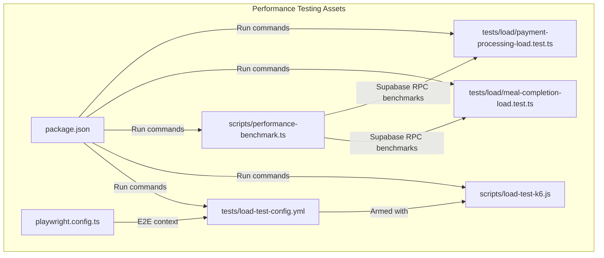
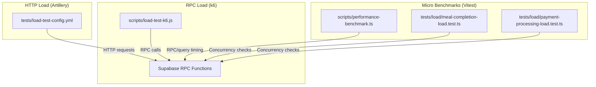
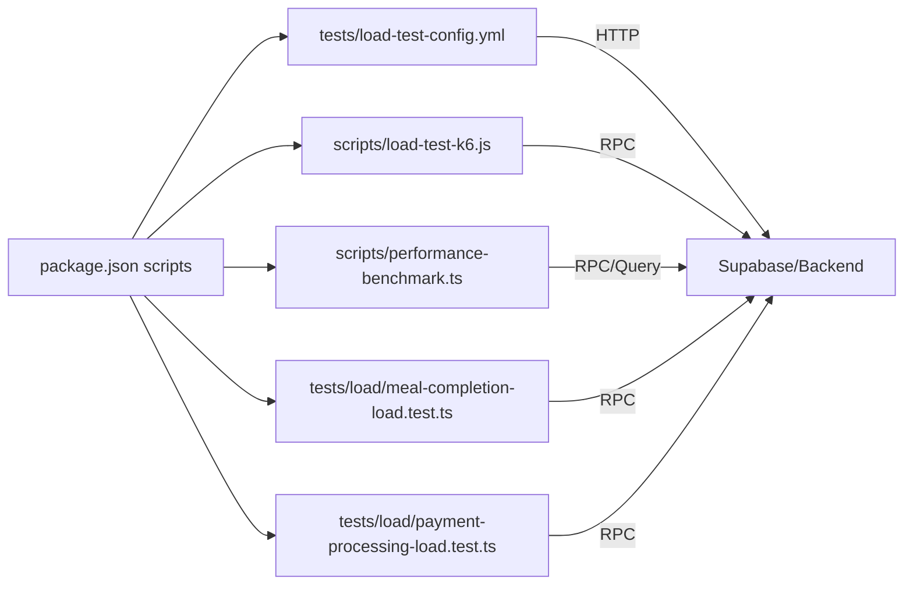

# Performance Testing

<cite>
**Referenced Files in This Document**
- [load-test-config.yml](file://tests/load-test-config.yml)
- [load-test-k6.js](file://scripts/load-test-k6.js)
- [performance-benchmark.ts](file://scripts/performance-benchmark.ts)
- [meal-completion-load.test.ts](file://tests/load/meal-completion-load.test.ts)
- [payment-processing-load.test.ts](file://tests/load/payment-processing-load.test.ts)
- [package.json](file://package.json)
- [playwright.config.ts](file://playwright.config.ts)
</cite>

## Table of Contents
1. [Introduction](#introduction)
2. [Project Structure](#project-structure)
3. [Core Components](#core-components)
4. [Architecture Overview](#architecture-overview)
5. [Detailed Component Analysis](#detailed-component-analysis)
6. [Dependency Analysis](#dependency-analysis)
7. [Performance Considerations](#performance-considerations)
8. [Troubleshooting Guide](#troubleshooting-guide)
9. [Conclusion](#conclusion)
10. [Appendices](#appendices)

## Introduction
This document provides comprehensive performance testing guidance for the Nutrio platform. It covers load testing, stress testing, and performance benchmarking using the k6 JavaScript load testing framework and Vitest-based tests. It explains test scenarios for meal completion, payment processing, and concurrent user sessions, along with configuration, execution, metrics collection, and result interpretation. It also outlines environment requirements, monitoring, bottleneck identification, and optimization strategies.

## Project Structure
The performance testing assets are organized as follows:
- Load test configurations and scenarios: tests/load-test-config.yml
- k6 load test script: scripts/load-test-k6.js
- Performance benchmark suite: scripts/performance-benchmark.ts
- Atomic transaction load tests (Vitest): tests/load/meal-completion-load.test.ts, tests/load/payment-processing-load.test.ts
- Test runner configuration: package.json scripts
- E2E and reporting configuration: playwright.config.ts

**Diagram sources**
- [load-test-config.yml:1-173](file://tests/load-test-config.yml#L1-L173)
- [load-test-k6.js:1-129](file://scripts/load-test-k6.js#L1-L129)
- [performance-benchmark.ts:1-280](file://scripts/performance-benchmark.ts#L1-L280)
- [meal-completion-load.test.ts:1-188](file://tests/load/meal-completion-load.test.ts#L1-L188)
- [payment-processing-load.test.ts:1-158](file://tests/load/payment-processing-load.test.ts#L1-L158)
- [package.json:1-159](file://package.json#L1-L159)
- [playwright.config.ts:1-92](file://playwright.config.ts#L1-L92)

**Section sources**
- [load-test-config.yml:1-173](file://tests/load-test-config.yml#L1-L173)
- [load-test-k6.js:1-129](file://scripts/load-test-k6.js#L1-L129)
- [performance-benchmark.ts:1-280](file://scripts/performance-benchmark.ts#L1-L280)
- [meal-completion-load.test.ts:1-188](file://tests/load/meal-completion-load.test.ts#L1-L188)
- [payment-processing-load.test.ts:1-158](file://tests/load/payment-processing-load.test.ts#L1-L158)
- [package.json:1-159](file://package.json#L1-L159)
- [playwright.config.ts:1-92](file://playwright.config.ts#L1-L92)

## Core Components
- Load test configuration (Artillery): Defines target endpoint, ramp-up phases, scenario weights, thresholds, and reporters.
- k6 load test script: Executes RPC-heavy load scenarios for meal completion and payment processing with custom metrics and thresholds.
- Performance benchmark suite: Measures RPC and query latency distributions and flags regressions.
- Atomic transaction load tests: Validates idempotency and race condition prevention for meal completion and payment processing under concurrency.

Key capabilities:
- Multi-phase load profiles (warm-up, ramp-up, sustained, peak, cool-down)
- Scenario weighting to reflect realistic traffic mix
- Threshold-driven early termination and pass/fail criteria
- Custom metrics for RPC endpoints
- RPC and query benchmarking with percentiles and error accounting

**Section sources**
- [load-test-config.yml:9-46](file://tests/load-test-config.yml#L9-L46)
- [load-test-k6.js:21-35](file://scripts/load-test-k6.js#L21-L35)
- [performance-benchmark.ts:20-98](file://scripts/performance-benchmark.ts#L20-L98)
- [meal-completion-load.test.ts:20-54](file://tests/load/meal-completion-load.test.ts#L20-L54)
- [payment-processing-load.test.ts:18-53](file://tests/load/payment-processing-load.test.ts#L18-L53)

## Architecture Overview
The performance testing architecture integrates three complementary approaches:
- Artillery-based scenario orchestration for HTTP-level load
- k6-based RPC-focused load for Supabase functions
- Vitest-based micro-benchmarks for atomic transactions and idempotency checks

**Diagram sources**
- [load-test-config.yml:9-46](file://tests/load-test-config.yml#L9-L46)
- [load-test-k6.js:40-116](file://scripts/load-test-k6.js#L40-L116)
- [performance-benchmark.ts:23-98](file://scripts/performance-benchmark.ts#L23-L98)
- [meal-completion-load.test.ts:34-109](file://tests/load/meal-completion-load.test.ts#L34-L109)
- [payment-processing-load.test.ts:30-106](file://tests/load/payment-processing-load.test.ts#L30-L106)

## Detailed Component Analysis

### Load Test Configuration (Artillery)
- Purpose: Define multi-phase load profiles and scenario weights for HTTP endpoints.
- Phases:
  - Warm-up: gradual ramp to stabilize systems.
  - Ramp-up: increase concurrency to target levels.
  - Sustained: maintain high load for stability verification.
  - Peak: exceed capacity to observe breaking points.
  - Cool-down: reduce load to baseline.
- Scenarios:
  - Browse Plans, View Recommendations, Generate Meal Plan, Place Order, Check Balance.
- Thresholds:
  - Response time targets (p95, p99), error rate cap, throughput minimum.
- Reporting:
  - JSON and HTML outputs for automated analysis and dashboards.

Execution:
- Run via Artillery CLI with the configuration file.

Interpretation:
- Use p95/p99 response times and error rates to assess SLA adherence.
- Investigate failing thresholds and adjust capacity or optimize hotspots.

**Section sources**
- [load-test-config.yml:9-46](file://tests/load-test-config.yml#L9-L46)
- [load-test-config.yml:47-135](file://tests/load-test-config.yml#L47-L135)
- [load-test-config.yml:136-142](file://tests/load-test-config.yml#L136-L142)

### k6 Load Test Script
- Purpose: Execute RPC-heavy load against Supabase functions.
- Scenarios:
  - Meal completion RPC under concurrent load.
  - Payment processing RPC under concurrent load.
  - Subscription management RPC under concurrent load.
- Metrics:
  - Custom trends for RPC durations and global error rate.
- Thresholds:
  - p95 response time targets for RPCs and overall request duration.
- Environment:
  - Uses environment variables for Supabase URL and API key.

Execution:
- Run with k6 CLI using the script file.

Interpretation:
- Evaluate error rate and latency percentiles to detect saturation points.
- Correlate failures with backend function performance and database contention.

**Section sources**
- [load-test-k6.js:1-129](file://scripts/load-test-k6.js#L1-L129)

### Performance Benchmark Suite
- Purpose: Measure and track RPC and query performance over time.
- Coverage:
  - RPC functions: meal completion, payment processing, cancellation, subscription creation, win-back offers, review submission.
  - Queries: common selects with joins and filters.
- Methodology:
  - Repeated invocations with timing capture and percentile calculation.
  - Expected vs. unexpected error classification.
- Outputs:
  - Tabular results with averages, min/max, p95/p99, pass/fail, and error counts.

Execution:
- Run via Node/TypeScript runtime.

Interpretation:
- Use p95 thresholds to flag regressions.
- Investigate failed benchmarks for indexing, query plan changes, or function bottlenecks.

**Section sources**
- [performance-benchmark.ts:20-98](file://scripts/performance-benchmark.ts#L20-L98)
- [performance-benchmark.ts:100-164](file://scripts/performance-benchmark.ts#L100-L164)
- [performance-benchmark.ts:166-205](file://scripts/performance-benchmark.ts#L166-L205)
- [performance-benchmark.ts:221-263](file://scripts/performance-benchmark.ts#L221-L263)

### Atomic Transaction Load Tests (Vitest)
- Purpose: Validate idempotency and race condition prevention under concurrency.
- Scenarios:
  - Concurrent meal completion attempts: assert single success and idempotent responses for duplicates.
  - Concurrent payment attempts: assert single success and detection of double-spending attempts.
- Metrics:
  - Request counts, successes, failures, race conditions, average response time, percentiles.

Execution:
- Run with Vitest test runner.

Interpretation:
- Zero race conditions indicates robust atomic operations.
- High failure rates or long response times signal contention or locking issues.

**Section sources**
- [meal-completion-load.test.ts:20-54](file://tests/load/meal-completion-load.test.ts#L20-L54)
- [meal-completion-load.test.ts:125-184](file://tests/load/meal-completion-load.test.ts#L125-L184)
- [payment-processing-load.test.ts:18-53](file://tests/load/payment-processing-load.test.ts#L18-L53)
- [payment-processing-load.test.ts:109-155](file://tests/load/payment-processing-load.test.ts#L109-L155)

## Dependency Analysis
- Artillery configuration depends on HTTP endpoints and environment variables.
- k6 script depends on Supabase RPC endpoints and authentication keys.
- Benchmark suite and atomic transaction tests depend on Supabase client connectivity and function availability.
- Test execution relies on project scripts defined in package.json.

**Diagram sources**
- [package.json:7-43](file://package.json#L7-L43)
- [load-test-config.yml:10-11](file://tests/load-test-config.yml#L10-L11)
- [load-test-k6.js:37-38](file://scripts/load-test-k6.js#L37-L38)
- [performance-benchmark.ts:6-6](file://scripts/performance-benchmark.ts#L6-L6)
- [meal-completion-load.test.ts:2-2](file://tests/load/meal-completion-load.test.ts#L2-L2)
- [payment-processing-load.test.ts:2-2](file://tests/load/payment-processing-load.test.ts#L2-L2)

**Section sources**
- [package.json:7-43](file://package.json#L7-L43)
- [load-test-config.yml:10-11](file://tests/load-test-config.yml#L10-L11)
- [load-test-k6.js:37-38](file://scripts/load-test-k6.js#L37-L38)
- [performance-benchmark.ts:6-6](file://scripts/performance-benchmark.ts#L6-L6)
- [meal-completion-load.test.ts:2-2](file://tests/load/meal-completion-load.test.ts#L2-L2)
- [payment-processing-load.test.ts:2-2](file://tests/load/payment-processing-load.test.ts#L2-L2)

## Performance Considerations
- Capacity planning:
  - Use sustained and peak phases to estimate upper bounds and identify breakage points.
- Database and edge functions:
  - Monitor Supabase function execution times and database connection pools during load.
- CDN and caching:
  - Ensure static assets leverage caching to reduce origin load.
- Monitoring:
  - Track CPU, memory, and network utilization alongside latency and error metrics.
- Idempotency and atomicity:
  - Validate that repeated calls do not cause unintended state changes or double-spending.

[No sources needed since this section provides general guidance]

## Troubleshooting Guide
Common issues and resolutions:
- Excessive error rates:
  - Verify environment variables and endpoint reachability.
  - Inspect backend logs for function timeouts or database deadlocks.
- Latency spikes:
  - Check database query plans and indexes.
  - Confirm Supabase edge function scaling and cold start mitigation.
- Race conditions:
  - Review atomic function logic and transaction isolation levels.
  - Ensure proper locking and idempotency guards.
- Test data readiness:
  - Provision test records for RPCs and queries before running benchmarks.

**Section sources**
- [load-test-config.yml:42-46](file://tests/load-test-config.yml#L42-L46)
- [load-test-k6.js:29-35](file://scripts/load-test-k6.js#L29-L35)
- [performance-benchmark.ts:207-219](file://scripts/performance-benchmark.ts#L207-L219)
- [meal-completion-load.test.ts:160-183](file://tests/load/meal-completion-load.test.ts#L160-L183)
- [payment-processing-load.test.ts:139-154](file://tests/load/payment-processing-load.test.ts#L139-L154)

## Conclusion
The Nutrio performance testing toolkit combines HTTP-level scenarios, RPC-focused k6 loads, and micro-benchmarks to comprehensively evaluate system behavior under realistic and extreme loads. By leveraging thresholds, percentiles, and idempotency checks, teams can identify bottlenecks, validate atomic operations, and ensure SLA compliance across meal completion, payment processing, and concurrent user sessions.

[No sources needed since this section summarizes without analyzing specific files]

## Appendices

### A. Execution Commands and Scripts
- Artillery load test:
  - Run with the configuration file to execute multi-phase HTTP load.
- k6 load test:
  - Execute the script with environment variables for Supabase URL and API key.
- Performance benchmarks:
  - Run the benchmark suite to measure RPC and query latencies.
- Atomic transaction tests:
  - Execute Vitest tests to validate concurrency correctness.

Environment variables:
- SUPABASE_URL: Supabase service URL.
- SUPABASE_KEY: Supabase API key for RPC access.

**Section sources**
- [load-test-config.yml:5-6](file://tests/load-test-config.yml#L5-L6)
- [load-test-k6.js:37-38](file://scripts/load-test-k6.js#L37-L38)
- [performance-benchmark.ts:267-276](file://scripts/performance-benchmark.ts#L267-L276)
- [meal-completion-load.test.ts:125-158](file://tests/load/meal-completion-load.test.ts#L125-L158)
- [payment-processing-load.test.ts:109-137](file://tests/load/payment-processing-load.test.ts#L109-L137)

### B. Metrics Collection and Reporting
- Artillery:
  - JSON and HTML reports for aggregated metrics and per-scenario breakdowns.
- k6:
  - Custom metrics for RPC durations and error rates; thresholds drive pass/fail.
- Benchmarks:
  - Percentile-based results with pass/fail indicators and error counts.
- Atomic tests:
  - Statistics on response times, race conditions, and assertion outcomes.

**Section sources**
- [load-test-config.yml:136-142](file://tests/load-test-config.yml#L136-L142)
- [load-test-k6.js:15-19](file://scripts/load-test-k6.js#L15-L19)
- [load-test-k6.js:29-35](file://scripts/load-test-k6.js#L29-L35)
- [performance-benchmark.ts:221-263](file://scripts/performance-benchmark.ts#L221-L263)
- [meal-completion-load.test.ts:143-151](file://tests/load/meal-completion-load.test.ts#L143-L151)
- [payment-processing-load.test.ts:124-130](file://tests/load/payment-processing-load.test.ts#L124-L130)

### C. Test Data Preparation
- Supabase:
  - Ensure test users, schedules, and payment records exist for RPC tests.
  - Validate function permissions and row-level security policies.
- HTTP endpoints:
  - Confirm subscription plans, recommendations, and balance endpoints are seeded.

**Section sources**
- [meal-completion-load.test.ts:131-141](file://tests/load/meal-completion-load.test.ts#L131-L141)
- [payment-processing-load.test.ts:112-122](file://tests/load/payment-processing-load.test.ts#L112-L122)
- [load-test-config.yml:48-116](file://tests/load-test-config.yml#L48-L116)

### D. Environment Requirements
- Local development:
  - Supabase emulator or hosted Supabase project with RPC functions deployed.
  - Node.js runtime for k6 and benchmark suites.
- CI/CD:
  - Dedicated staging environment mirroring production capacity.
  - Artifact storage for reports and dashboards.

**Section sources**
- [load-test-k6.js:37-38](file://scripts/load-test-k6.js#L37-L38)
- [playwright.config.ts:38-38](file://playwright.config.ts#L38-L38)

### E. Bottleneck Identification and Optimization Strategies
- Database:
  - Add missing indexes, optimize slow queries, and review connection pooling.
- Edge functions:
  - Reduce cold starts, minimize external calls, and batch operations.
- Frontend:
  - Enable caching, lazy loading, and asset compression.
- Infrastructure:
  - Scale vertical and horizontal resources, monitor autoscaling triggers.

**Section sources**
- [load-test-config.yml:151-157](file://tests/load-test-config.yml#L151-L157)
- [performance-benchmark.ts:257-262](file://scripts/performance-benchmark.ts#L257-L262)