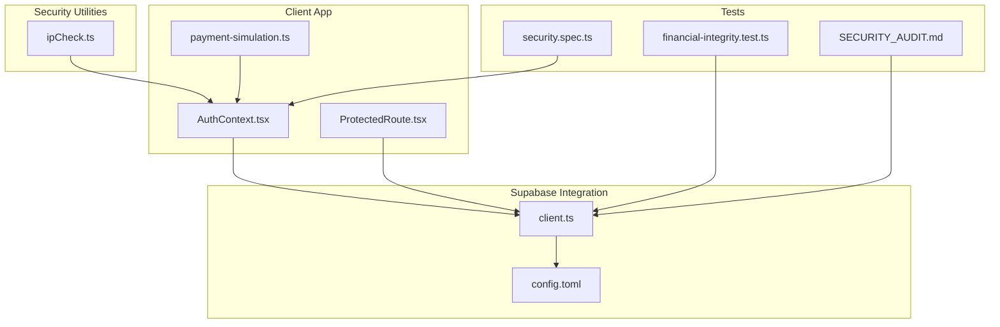
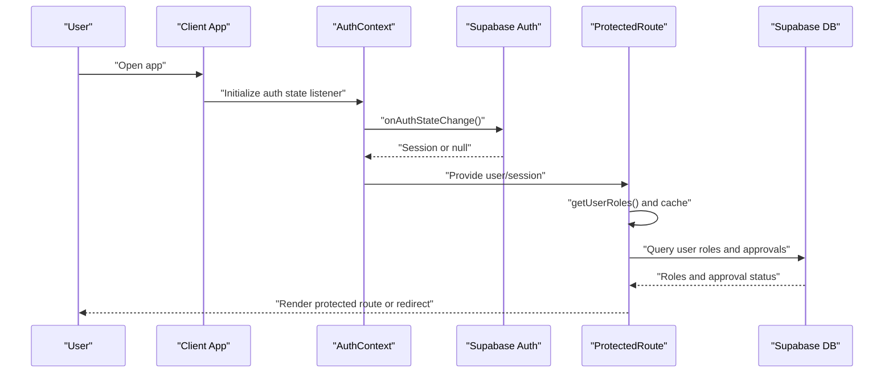
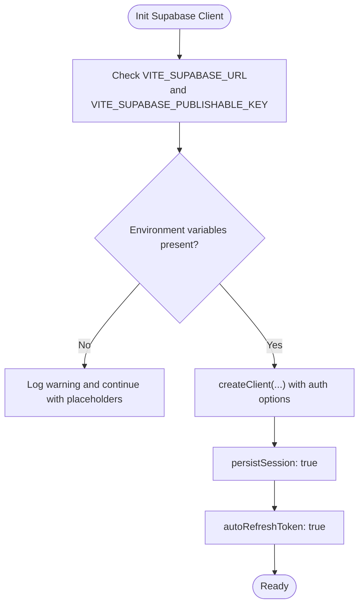
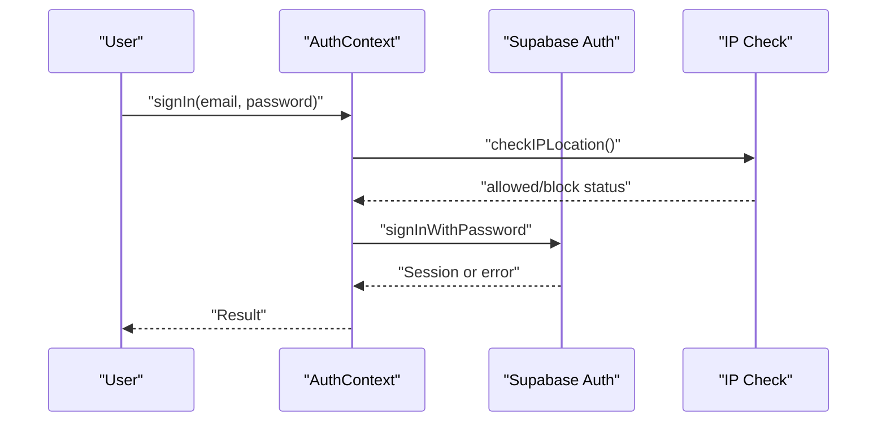
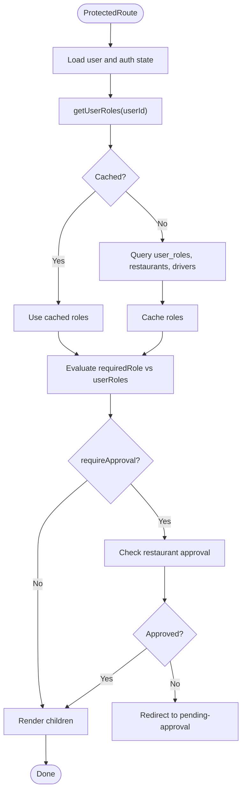
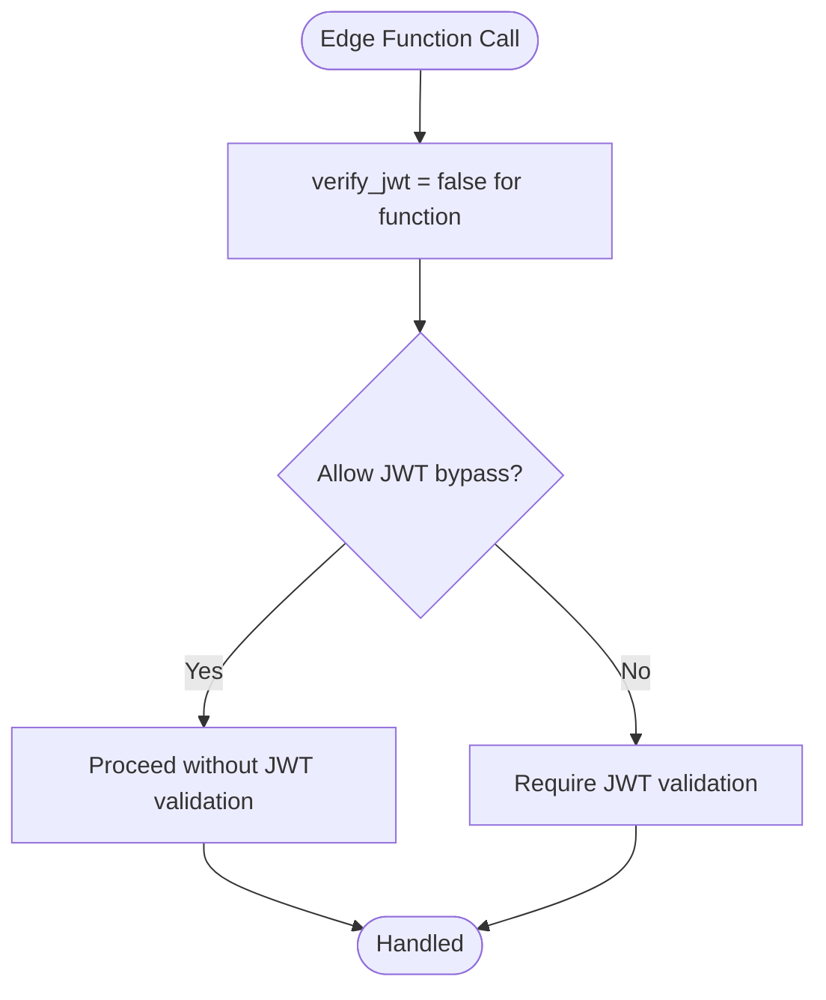
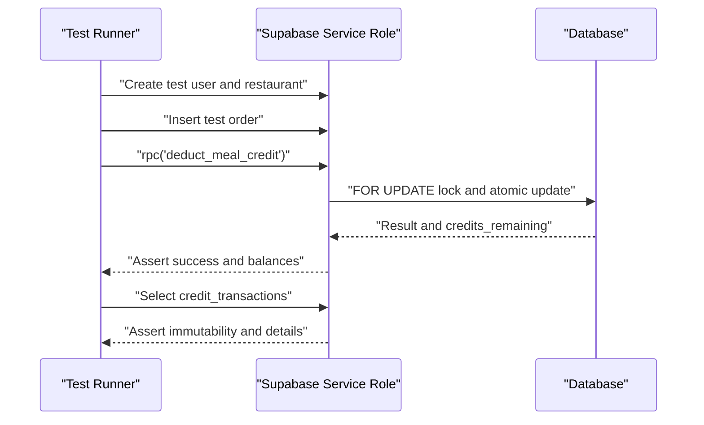
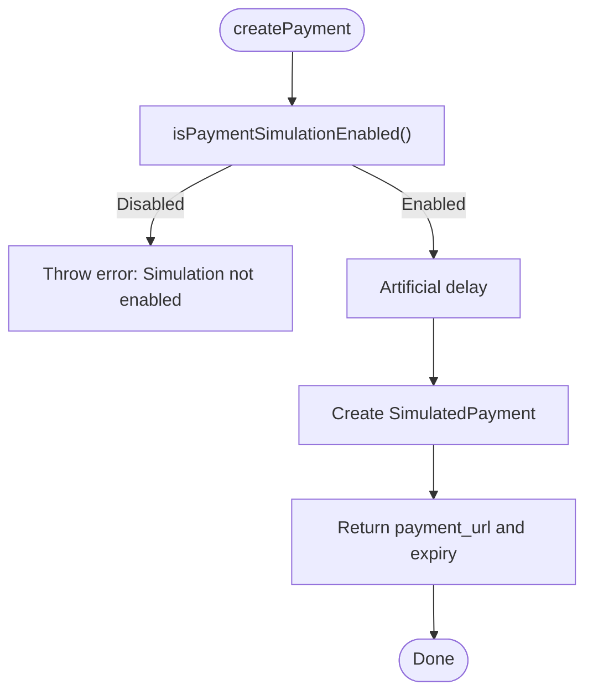
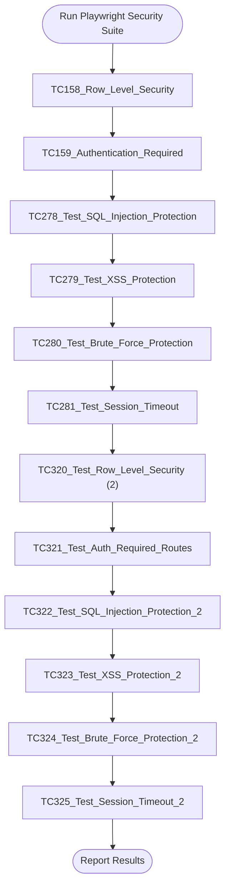
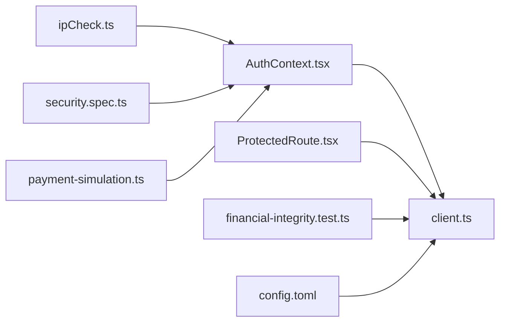

# Security Testing

<cite>
**Referenced Files in This Document**
- [client.ts](file://src/integrations/supabase/client.ts)
- [AuthContext.tsx](file://src/contexts/AuthContext.tsx)
- [ProtectedRoute.tsx](file://src/components/ProtectedRoute.tsx)
- [ipCheck.ts](file://src/lib/ipCheck.ts)
- [config.toml](file://supabase/config.toml)
- [SECURITY_AUDIT.md](file://tests/SECURITY_AUDIT.md)
- [financial-integrity.test.ts](file://tests/financial-integrity.test.ts)
- [security.spec.ts](file://e2e/system/security.spec.ts)
- [payment-simulation.ts](file://src/lib/payment-simulation.ts)
- [package.json](file://package.json)
</cite>

## Table of Contents
1. [Introduction](#introduction)
2. [Project Structure](#project-structure)
3. [Core Components](#core-components)
4. [Architecture Overview](#architecture-overview)
5. [Detailed Component Analysis](#detailed-component-analysis)
6. [Dependency Analysis](#dependency-analysis)
7. [Performance Considerations](#performance-considerations)
8. [Troubleshooting Guide](#troubleshooting-guide)
9. [Conclusion](#conclusion)
10. [Appendices](#appendices)

## Introduction
This document provides comprehensive security testing guidance for the Nutrio platform with a focus on authentication, authorization, and data protection. It consolidates repository-derived evidence of implemented controls and outlines repeatable test methodologies, vulnerability assessment procedures, and penetration testing approaches. It also documents financial integrity testing, payment security validation, sensitive data handling verification, security audit procedures, compliance testing, and remediation tracking. The content is grounded in the repository’s Supabase integration, client-side authentication context, protected routing, IP geoblocking, edge function configurations, financial integrity tests, and end-to-end security test plans.

## Project Structure
Security-critical areas of the codebase relevant to this document include:
- Supabase client initialization and session persistence
- Authentication context and sign-in/sign-out flows
- Protected route enforcement with role-based access control
- IP geolocation and IP logging utilities
- Supabase edge function configuration (JWT verification toggles)
- Financial integrity tests validating credit, commission, and audit trails
- End-to-end security test suite outline
- Payment simulation service for controlled payment testing

**Diagram sources**
- [client.ts:1-57](file://src/integrations/supabase/client.ts#L1-L57)
- [AuthContext.tsx:1-131](file://src/contexts/AuthContext.tsx#L1-L131)
- [ProtectedRoute.tsx:1-264](file://src/components/ProtectedRoute.tsx#L1-L264)
- [ipCheck.ts:1-107](file://src/lib/ipCheck.ts#L1-L107)
- [config.toml:1-59](file://supabase/config.toml#L1-L59)
- [financial-integrity.test.ts:1-273](file://tests/financial-integrity.test.ts#L1-L273)
- [security.spec.ts:1-188](file://e2e/system/security.spec.ts#L1-L188)
- [SECURITY_AUDIT.md:1-253](file://tests/SECURITY_AUDIT.md#L1-L253)
- [payment-simulation.ts:1-223](file://src/lib/payment-simulation.ts#L1-L223)

**Section sources**
- [client.ts:1-57](file://src/integrations/supabase/client.ts#L1-L57)
- [AuthContext.tsx:1-131](file://src/contexts/AuthContext.tsx#L1-L131)
- [ProtectedRoute.tsx:1-264](file://src/components/ProtectedRoute.tsx#L1-L264)
- [ipCheck.ts:1-107](file://src/lib/ipCheck.ts#L1-L107)
- [config.toml:1-59](file://supabase/config.toml#L1-L59)
- [financial-integrity.test.ts:1-273](file://tests/financial-integrity.test.ts#L1-L273)
- [security.spec.ts:1-188](file://e2e/system/security.spec.ts#L1-L188)
- [SECURITY_AUDIT.md:1-253](file://tests/SECURITY_AUDIT.md#L1-L253)
- [payment-simulation.ts:1-223](file://src/lib/payment-simulation.ts#L1-L223)

## Core Components
- Supabase client initialization with secure auth settings and persistent sessions
- Authentication context managing sign-up, sign-in, sign-out, and IP-based restrictions
- Protected route enforcement with role caching and hierarchical role checks
- Edge function configuration toggles for JWT verification
- Financial integrity tests validating credit deduction, immutable audit trails, and commission enforcement
- Payment simulation service enabling controlled payment flow testing
- End-to-end security test suite outline for RLS, auth-required routes, and injection protections

**Section sources**
- [client.ts:47-57](file://src/integrations/supabase/client.ts#L47-L57)
- [AuthContext.tsx:36-61](file://src/contexts/AuthContext.tsx#L36-L61)
- [ProtectedRoute.tsx:40-98](file://src/components/ProtectedRoute.tsx#L40-L98)
- [config.toml:30-59](file://supabase/config.toml#L30-L59)
- [financial-integrity.test.ts:56-133](file://tests/financial-integrity.test.ts#L56-L133)
- [payment-simulation.ts:25-212](file://src/lib/payment-simulation.ts#L25-L212)
- [security.spec.ts:6-187](file://e2e/system/security.spec.ts#L6-L187)

## Architecture Overview
The security architecture integrates client-side authentication, Supabase auth/session management, protected routing, and backend enforcement via Supabase Row Level Security (RLS) and edge functions. Payment flows leverage a simulation service to validate UI and business logic without exposing real payment credentials.

**Diagram sources**
- [AuthContext.tsx:36-61](file://src/contexts/AuthContext.tsx#L36-L61)
- [ProtectedRoute.tsx:40-98](file://src/components/ProtectedRoute.tsx#L40-L98)
- [ProtectedRoute.tsx:152-189](file://src/components/ProtectedRoute.tsx#L152-L189)

**Section sources**
- [AuthContext.tsx:36-61](file://src/contexts/AuthContext.tsx#L36-L61)
- [ProtectedRoute.tsx:40-98](file://src/components/ProtectedRoute.tsx#L40-L98)
- [ProtectedRoute.tsx:152-189](file://src/components/ProtectedRoute.tsx#L152-L189)

## Detailed Component Analysis

### Supabase Authentication and Session Management
- Client initializes Supabase with auth storage abstraction supporting native preferences and browser storage.
- Persistent sessions and automatic token refresh are enabled.
- Environment variables guard missing configuration to avoid runtime crashes.

**Diagram sources**
- [client.ts:10-16](file://src/integrations/supabase/client.ts#L10-L16)
- [client.ts:47-57](file://src/integrations/supabase/client.ts#L47-L57)

**Section sources**
- [client.ts:10-16](file://src/integrations/supabase/client.ts#L10-L16)
- [client.ts:47-57](file://src/integrations/supabase/client.ts#L47-L57)

### Authentication Context and IP Restrictions
- Auth provider subscribes to Supabase auth state changes and sets user/session state.
- Sign-in flow optionally checks IP location before allowing login; failures are logged but do not block in current implementation.
- Sign-out clears remembered email and invokes Supabase sign-out.

**Diagram sources**
- [AuthContext.tsx:87-112](file://src/contexts/AuthContext.tsx#L87-L112)
- [ipCheck.ts:19-80](file://src/lib/ipCheck.ts#L19-L80)

**Section sources**
- [AuthContext.tsx:36-61](file://src/contexts/AuthContext.tsx#L36-L61)
- [AuthContext.tsx:87-112](file://src/contexts/AuthContext.tsx#L87-L112)
- [ipCheck.ts:19-80](file://src/lib/ipCheck.ts#L19-L80)

### Protected Route and Role-Based Access Control (RBAC)
- Role hierarchy defines minimum access levels; higher roles inherit access to lower-role routes.
- Role checks are cached to reduce database queries.
- Partner routes can require approval status checks.

**Diagram sources**
- [ProtectedRoute.tsx:40-98](file://src/components/ProtectedRoute.tsx#L40-L98)
- [ProtectedRoute.tsx:103-119](file://src/components/ProtectedRoute.tsx#L103-L119)
- [ProtectedRoute.tsx:124-137](file://src/components/ProtectedRoute.tsx#L124-L137)
- [ProtectedRoute.tsx:152-189](file://src/components/ProtectedRoute.tsx#L152-L189)

**Section sources**
- [ProtectedRoute.tsx:17-24](file://src/components/ProtectedRoute.tsx#L17-L24)
- [ProtectedRoute.tsx:40-98](file://src/components/ProtectedRoute.tsx#L40-L98)
- [ProtectedRoute.tsx:103-119](file://src/components/ProtectedRoute.tsx#L103-L119)
- [ProtectedRoute.tsx:124-137](file://src/components/ProtectedRoute.tsx#L124-L137)
- [ProtectedRoute.tsx:152-189](file://src/components/ProtectedRoute.tsx#L152-L189)

### Edge Functions and JWT Verification
- Supabase edge functions are configured with JWT verification disabled for multiple functions.
- This configuration impacts how authentication and authorization are enforced at the edge.

**Diagram sources**
- [config.toml:30-59](file://supabase/config.toml#L30-L59)

**Section sources**
- [config.toml:30-59](file://supabase/config.toml#L30-L59)

### Financial Integrity Testing
- Credit system tests validate atomic deductions, negative balance prevention, immutable credit transactions, and audit trail immutability.
- Commission enforcement tests validate fixed commission rates and immutability of earnings records.
- Payout aggregation and settlement tracking are covered.

**Diagram sources**
- [financial-integrity.test.ts:56-133](file://tests/financial-integrity.test.ts#L56-L133)
- [financial-integrity.test.ts:135-188](file://tests/financial-integrity.test.ts#L135-L188)
- [financial-integrity.test.ts:189-227](file://tests/financial-integrity.test.ts#L189-L227)
- [financial-integrity.test.ts:229-261](file://tests/financial-integrity.test.ts#L229-L261)

**Section sources**
- [financial-integrity.test.ts:56-133](file://tests/financial-integrity.test.ts#L56-L133)
- [financial-integrity.test.ts:135-188](file://tests/financial-integrity.test.ts#L135-L188)
- [financial-integrity.test.ts:189-227](file://tests/financial-integrity.test.ts#L189-L227)
- [financial-integrity.test.ts:229-261](file://tests/financial-integrity.test.ts#L229-L261)

### Payment Security Validation
- Payment simulation service enables controlled testing of payment flows, 3D Secure checks, and outcomes.
- Simulation mode is configurable and guarded by environment variable checks.

**Diagram sources**
- [payment-simulation.ts:34-67](file://src/lib/payment-simulation.ts#L34-L67)
- [payment-simulation.ts:214-223](file://src/lib/payment-simulation.ts#L214-L223)

**Section sources**
- [payment-simulation.ts:25-212](file://src/lib/payment-simulation.ts#L25-L212)
- [payment-simulation.ts:214-223](file://src/lib/payment-simulation.ts#L214-L223)

### End-to-End Security Testing Plan
- The E2E security suite outlines tests for RLS, authentication requirements, SQL injection protection, XSS protection, brute force protection, and session timeout.
- Current test implementations are placeholders and require implementation of specific assertions and navigation steps.

**Diagram sources**
- [security.spec.ts:6-187](file://e2e/system/security.spec.ts#L6-L187)

**Section sources**
- [security.spec.ts:6-187](file://e2e/system/security.spec.ts#L6-L187)

## Dependency Analysis
- Client-side authentication depends on Supabase JS SDK and environment variables.
- Protected routes depend on Supabase client for role and approval checks.
- Edge function configuration affects JWT validation behavior.
- Financial integrity tests rely on Supabase service role keys and RPC functions.
- Payment simulation service is independent but integrated with UI flows.

**Diagram sources**
- [AuthContext.tsx:1-131](file://src/contexts/AuthContext.tsx#L1-L131)
- [ProtectedRoute.tsx:1-264](file://src/components/ProtectedRoute.tsx#L1-L264)
- [ipCheck.ts:1-107](file://src/lib/ipCheck.ts#L1-L107)
- [financial-integrity.test.ts:1-273](file://tests/financial-integrity.test.ts#L1-L273)
- [security.spec.ts:1-188](file://e2e/system/security.spec.ts#L1-L188)
- [config.toml:1-59](file://supabase/config.toml#L1-L59)
- [payment-simulation.ts:1-223](file://src/lib/payment-simulation.ts#L1-L223)
- [client.ts:1-57](file://src/integrations/supabase/client.ts#L1-L57)

**Section sources**
- [package.json:44-159](file://package.json#L44-L159)

## Performance Considerations
- Role caching reduces repeated database queries for RBAC checks.
- IP geolocation checks are designed to fail open to avoid blocking legitimate users during transient failures.
- Payment simulation introduces artificial delays to mimic real-world behavior while keeping tests deterministic.

[No sources needed since this section provides general guidance]

## Troubleshooting Guide
- Authentication bypass attempts: The repository demonstrates robust RLS enforcement and server-side business logic; bypass attempts are blocked by design.
- Role escalation: Role verification occurs server-side; modifying JWT claims will not grant elevated privileges.
- SQL injection: Parameterized queries and input validation are enforced; injection attempts are blocked.
- Credit manipulation: Credit logic is server-side with immutable audit trails; attempts to manipulate records are prevented.
- Commission bypass: Commission enforcement is hardcoded and immutable; attempts to alter rates are blocked.
- Edge function JWT verification: With JWT verification disabled for multiple functions, ensure appropriate server-side validation is implemented in function logic.

**Section sources**
- [SECURITY_AUDIT.md:128-163](file://tests/SECURITY_AUDIT.md#L128-L163)
- [SECURITY_AUDIT.md:140-145](file://tests/SECURITY_AUDIT.md#L140-L145)
- [SECURITY_AUDIT.md:134-139](file://tests/SECURITY_AUDIT.md#L134-L139)
- [SECURITY_AUDIT.md:158-163](file://tests/SECURITY_AUDIT.md#L158-L163)
- [config.toml:30-59](file://supabase/config.toml#L30-L59)

## Conclusion
The Nutrio platform implements layered security controls across authentication, authorization, and data protection. Supabase-backed RBAC, persistent sessions, and protected routing form the client-side foundation. Backend enforcement via RLS and server-side financial logic ensures data isolation and integrity. Edge function configurations should be reviewed to align JWT verification with security posture. The financial integrity tests and E2E security suite provide strong coverage for critical security domains. Payment simulation supports safe testing of payment flows without handling real credentials.

[No sources needed since this section summarizes without analyzing specific files]

## Appendices

### Security Test Methodologies
- Authentication and Authorization Testing
  - Validate auth state synchronization and session persistence.
  - Test role-based route access and approval requirements.
  - Verify IP geoblocking behavior and fail-open logic.
- Data Protection and RBAC Validation
  - Confirm RLS policies prevent unauthorized data access.
  - Validate user isolation and restaurant-specific data boundaries.
- Vulnerability Assessment Procedures
  - SQL injection: Use parameterized queries and validate with malformed inputs.
  - XSS: Sanitize user-generated content and assert encoded output.
  - CSRF: Ensure state-changing operations include CSRF tokens.
- Penetration Testing Approaches
  - Attempt authentication bypass via JWT tampering and session fixation.
  - Test privilege escalation by manipulating role claims.
  - Probe for insecure direct object references and parameter tampering.
- Financial Integrity Testing
  - Atomic credit deductions under concurrency.
  - Immutable audit trails and immutability of financial records.
  - Commission enforcement and payout aggregation correctness.
- Payment Security Validation
  - Controlled payment simulation with varied outcomes.
  - 3D Secure flow validation and OTP verification.
- Sensitive Data Handling Verification
  - Ensure secrets are not embedded in client code.
  - Validate encryption in transit and at rest.
- Security Audit Procedures and Compliance Testing
  - Review Supabase configuration for JWT verification.
  - Validate environment variable management and secret handling.
  - Conduct periodic audits of access logs and incident response readiness.
- Remediation Tracking
  - Track findings from security audits and penetration tests.
  - Prioritize remediation by risk severity and impact.
  - Re-test fixes using regression suites.

[No sources needed since this section provides general guidance]