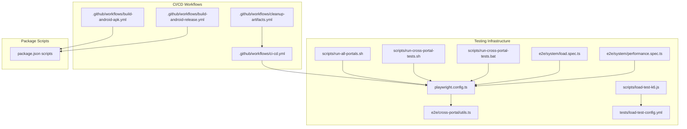
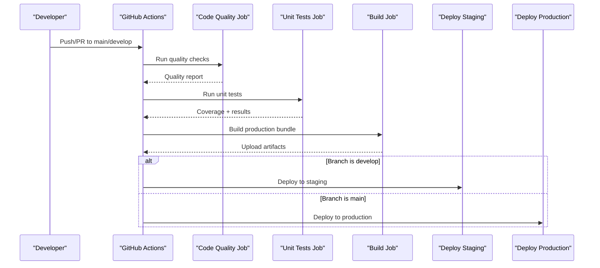
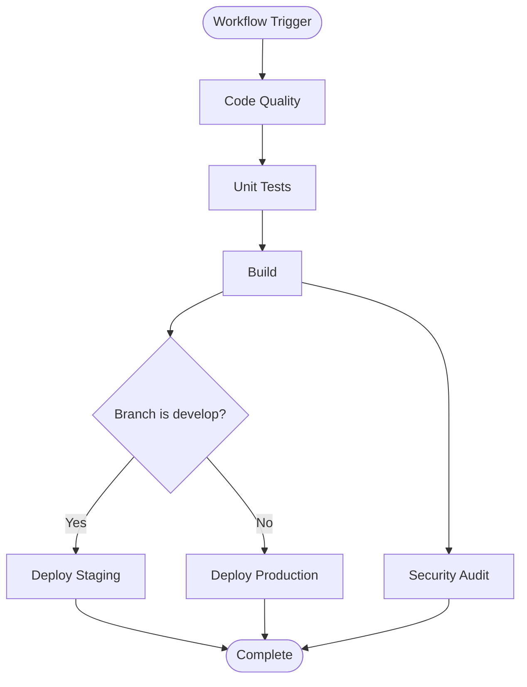
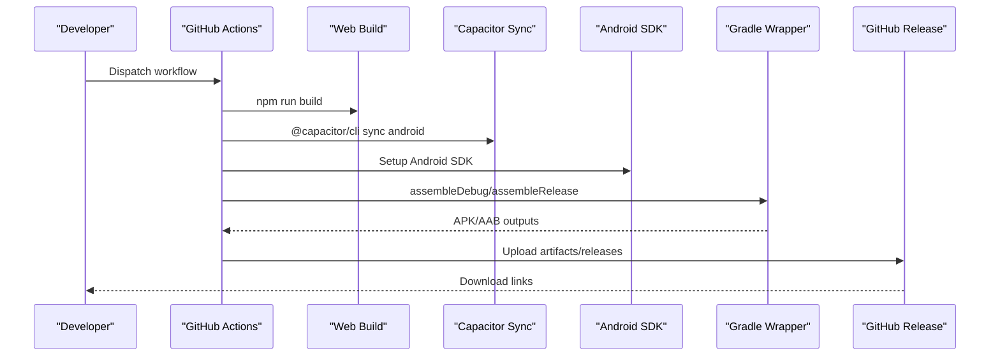
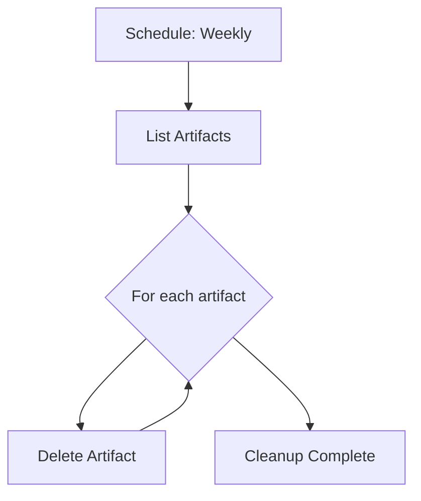
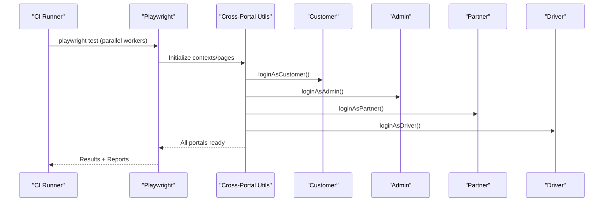
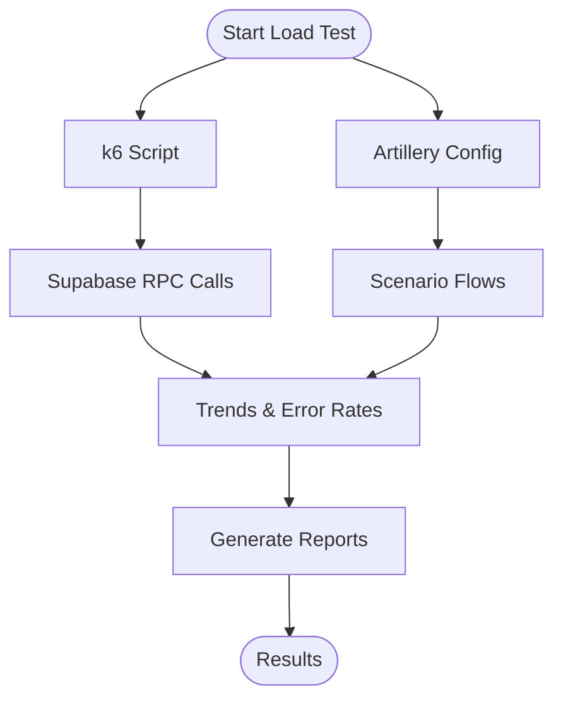
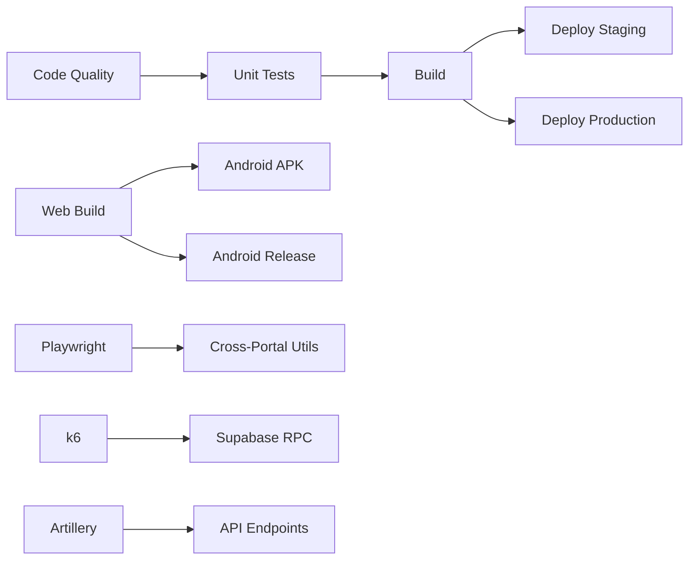

# Test Automation & CI/CD Integration

<cite>
**Referenced Files in This Document**
- [ci-cd.yml](file://.github/workflows/ci-cd.yml)
- [build-android-apk.yml](file://.github/workflows/build-android-apk.yml)
- [build-android-release.yml](file://.github/workflows/build-android-release.yml)
- [cleanup-artifacts.yml](file://.github/workflows/cleanup-artifacts.yml)
- [playwright.config.ts](file://playwright.config.ts)
- [package.json](file://package.json)
- [run-all-portals.sh](file://scripts/run-all-portals.sh)
- [run-cross-portal-tests.sh](file://scripts/run-cross-portal-tests.sh)
- [run-cross-portal-tests.bat](file://scripts/run-cross-portal-tests.bat)
- [utils.ts](file://e2e/cross-portal/utils.ts)
- [load-test-k6.js](file://scripts/load-test-k6.js)
- [load-test-config.yml](file://tests/load-test-config.yml)
- [load.spec.ts](file://e2e/system/load.spec.ts)
- [performance.spec.ts](file://e2e/system/performance.spec.ts)
</cite>

## Table of Contents
1. [Introduction](#introduction)
2. [Project Structure](#project-structure)
3. [Core Components](#core-components)
4. [Architecture Overview](#architecture-overview)
5. [Detailed Component Analysis](#detailed-component-analysis)
6. [Dependency Analysis](#dependency-analysis)
7. [Performance Considerations](#performance-considerations)
8. [Troubleshooting Guide](#troubleshooting-guide)
9. [Conclusion](#conclusion)
10. [Appendices](#appendices)

## Introduction
This document provides comprehensive CI/CD testing automation documentation for the Nutrio application. It explains the GitHub Actions workflows for automated testing, builds, and deployments; details cross-portal test execution strategies; describes parallel test running and artifact management; and outlines integration between E2E tests, unit tests, and load tests. It also covers failure handling, retry mechanisms, notifications, mobile app testing integration, code quality checks, security scanning, performance optimization, secret management, and reliability across environments.

## Project Structure
The repository organizes CI/CD automation via GitHub Actions workflows under `.github/workflows`, with Playwright-based E2E tests under `e2e`, load testing scripts under `scripts` and `tests`, and supporting scripts under `scripts/`.

Key areas:
- CI/CD pipeline orchestration and deployment to staging/production
- Android build and release publishing
- Artifact cleanup automation
- Playwright configuration and cross-portal test utilities
- Unit tests and code quality checks
- Load testing with k6 and Artillery configurations
- System performance and concurrency tests

**Diagram sources**
- [ci-cd.yml:1-197](file://.github/workflows/ci-cd.yml#L1-L197)
- [build-android-apk.yml:1-142](file://.github/workflows/build-android-apk.yml#L1-L142)
- [build-android-release.yml:1-148](file://.github/workflows/build-android-release.yml#L1-L148)
- [cleanup-artifacts.yml:1-36](file://.github/workflows/cleanup-artifacts.yml#L1-L36)
- [playwright.config.ts:1-92](file://playwright.config.ts#L1-L92)
- [package.json:7-43](file://package.json#L7-L43)
- [run-all-portals.sh:1-22](file://scripts/run-all-portals.sh#L1-L22)
- [run-cross-portal-tests.sh:1-79](file://scripts/run-cross-portal-tests.sh#L1-L79)
- [run-cross-portal-tests.bat:1-62](file://scripts/run-cross-portal-tests.bat#L1-L62)
- [utils.ts:1-284](file://e2e/cross-portal/utils.ts#L1-L284)
- [load-test-k6.js:1-129](file://scripts/load-test-k6.js#L1-L129)
- [load-test-config.yml:1-173](file://tests/load-test-config.yml#L1-L173)
- [load.spec.ts:1-83](file://e2e/system/load.spec.ts#L1-L83)
- [performance.spec.ts:1-128](file://e2e/system/performance.spec.ts#L1-L128)

**Section sources**
- [ci-cd.yml:1-197](file://.github/workflows/ci-cd.yml#L1-L197)
- [build-android-apk.yml:1-142](file://.github/workflows/build-android-apk.yml#L1-L142)
- [build-android-release.yml:1-148](file://.github/workflows/build-android-release.yml#L1-L148)
- [cleanup-artifacts.yml:1-36](file://.github/workflows/cleanup-artifacts.yml#L1-L36)
- [playwright.config.ts:1-92](file://playwright.config.ts#L1-L92)
- [package.json:7-43](file://package.json#L7-L43)

## Core Components
- CI/CD Pipeline: Orchestrates code quality, unit tests, build, and deployments to staging/production with artifact uploads and environment-specific gating.
- Android Build Pipelines: Builds debug/release APKs/AABs, publishes artifacts, and manages keystore signing for releases.
- Artifact Management: Uploads build artifacts and cleans up old artifacts periodically.
- Playwright Configuration: Defines test execution behavior, reporters, retries, and projects for desktop/mobile browsers.
- Cross-Portal Utilities: Provides shared helpers for multi-portal login, navigation, retries, and assertions.
- Load Testing: k6 and Artillery configurations for performance and concurrency validation.
- System Tests: E2E tests focused on load, concurrency, and performance scenarios.

**Section sources**
- [ci-cd.yml:12-197](file://.github/workflows/ci-cd.yml#L12-L197)
- [build-android-apk.yml:27-142](file://.github/workflows/build-android-apk.yml#L27-L142)
- [build-android-release.yml:13-148](file://.github/workflows/build-android-release.yml#L13-L148)
- [playwright.config.ts:13-92](file://playwright.config.ts#L13-L92)
- [utils.ts:1-284](file://e2e/cross-portal/utils.ts#L1-L284)
- [load-test-k6.js:1-129](file://scripts/load-test-k6.js#L1-L129)
- [load-test-config.yml:1-173](file://tests/load-test-config.yml#L1-L173)
- [load.spec.ts:1-83](file://e2e/system/load.spec.ts#L1-L83)
- [performance.spec.ts:1-128](file://e2e/system/performance.spec.ts#L1-L128)

## Architecture Overview
The CI/CD architecture integrates multiple workflows:
- Code quality and unit tests run first, followed by builds.
- Staging deployment occurs on pushes to develop; production deployment occurs on pushes to main.
- Android builds publish APKs/AABs to GitHub Releases or artifacts.
- E2E tests leverage Playwright with cross-portal utilities and reporters.
- Load tests integrate k6 and Artillery for performance validation.

**Diagram sources**
- [ci-cd.yml:3-197](file://.github/workflows/ci-cd.yml#L3-L197)

**Section sources**
- [ci-cd.yml:3-197](file://.github/workflows/ci-cd.yml#L3-L197)

## Detailed Component Analysis

### CI/CD Pipeline (.github/workflows/ci-cd.yml)
- Triggers on push/PR to main and develop.
- Environment variables set Node version globally.
- Jobs:
  - Code Quality: Runs ESLint and TypeScript type checks.
  - Unit Tests: Executes Vitest with coverage; uploads coverage artifacts.
  - Build: Builds production bundle and uploads artifacts.
  - Deploy Staging: Deploys to Vercel when develop branch and secrets available.
  - Deploy Production: Deploys to Vercel when main branch and secrets available.
  - Security Audit: Runs npm audit and audit-ci with high severity threshold.

**Diagram sources**
- [ci-cd.yml:3-197](file://.github/workflows/ci-cd.yml#L3-L197)

**Section sources**
- [ci-cd.yml:3-197](file://.github/workflows/ci-cd.yml#L3-L197)

### Android Build Pipelines
- Build Android APK (.github/workflows/build-android-apk.yml):
  - Triggers on push/PR to main/develop and manual dispatch.
  - Builds web app, syncs Capacitor Android, sets up Android SDK and Java.
  - Builds debug or release APK using Gradle wrapper.
  - Publishes APK as GitHub Release with metadata.
  - Caches Gradle packages for performance.

- Build Android Release (APK + AAB) (.github/workflows/build-android-release.yml):
  - Triggers on tags and manual dispatch.
  - Builds unsigned APK/AAB, optionally signs with keystore.
  - Uploads artifacts and writes release summary with version and download instructions.

**Diagram sources**
- [build-android-apk.yml:3-142](file://.github/workflows/build-android-apk.yml#L3-L142)
- [build-android-release.yml:3-148](file://.github/workflows/build-android-release.yml#L3-L148)

**Section sources**
- [build-android-apk.yml:3-142](file://.github/workflows/build-android-apk.yml#L3-L142)
- [build-android-release.yml:3-148](file://.github/workflows/build-android-release.yml#L3-L148)

### Artifact Management and Cleanup
- Cleanup Old Artifacts (.github/workflows/cleanup-artifacts.yml):
  - Scheduled weekly cleanup of artifacts using GitHub Script API.
  - Permissions granted to write actions for deletion.

**Diagram sources**
- [cleanup-artifacts.yml:3-36](file://.github/workflows/cleanup-artifacts.yml#L3-L36)

**Section sources**
- [cleanup-artifacts.yml:3-36](file://.github/workflows/cleanup-artifacts.yml#L3-L36)

### Playwright Configuration and Cross-Portal Execution
- Playwright Config (playwright.config.ts):
  - Test directory set to e2e.
  - Parallelization disabled by default; configurable for CI.
  - Retries enabled on CI; worker count limited on CI.
  - Reporters configured for HTML, JSON, and list.
  - Projects for Chromium; mobile projects commented for optional use.
  - Base URL, trace, screenshot, video, timeouts configured.

- Cross-Portal Utilities (e2e/cross-portal/utils.ts):
  - Shared test users and portal contexts.
  - Helpers for wait, safe fill/click, login flows, navigation, verification, screenshots, retries, and element checks.

- Cross-Portal Test Runners:
  - scripts/run-all-portals.sh: Runs selected tests with 4 workers for parallel portal execution.
  - scripts/run-cross-portal-tests.sh/.bat: Iterative runner for cross-portal workflows with reporting and dev server detection.

**Diagram sources**
- [playwright.config.ts:13-92](file://playwright.config.ts#L13-L92)
- [utils.ts:1-284](file://e2e/cross-portal/utils.ts#L1-L284)
- [run-all-portals.sh:10-16](file://scripts/run-all-portals.sh#L10-L16)
- [run-cross-portal-tests.sh:17-33](file://scripts/run-cross-portal-tests.sh#L17-L33)
- [run-cross-portal-tests.bat:15-43](file://scripts/run-cross-portal-tests.bat#L15-L43)

**Section sources**
- [playwright.config.ts:13-92](file://playwright.config.ts#L13-L92)
- [utils.ts:1-284](file://e2e/cross-portal/utils.ts#L1-L284)
- [run-all-portals.sh:10-16](file://scripts/run-all-portals.sh#L10-L16)
- [run-cross-portal-tests.sh:17-33](file://scripts/run-cross-portal-tests.sh#L17-L33)
- [run-cross-portal-tests.bat:15-43](file://scripts/run-cross-portal-tests.bat#L15-L43)

### Load Testing Integration
- k6 Script (scripts/load-test-k6.js):
  - Defines stages ramping users up to 200.
  - Tests RPC endpoints for meal completion and payment processing.
  - Tracks trends and error rates with thresholds.

- Artillery Config (tests/load-test-config.yml):
  - Scenarios for browsing plans, viewing recommendations, generating meal plans, placing orders, and checking balances.
  - Phases for warm-up, ramp-up, sustained load, peak load, and cool-down.
  - Thresholds for response time, error rate, and throughput.

- System Load and Performance Tests (e2e/system):
  - load.spec.ts: Tests around concurrent completions, double-spending prevention, and API rate limits.
  - performance.spec.ts: Tests for page load performance, concurrent users, database query performance, and API response times.

**Diagram sources**
- [load-test-k6.js:21-116](file://scripts/load-test-k6.js#L21-L116)
- [load-test-config.yml:9-173](file://tests/load-test-config.yml#L9-L173)
- [load.spec.ts:6-82](file://e2e/system/load.spec.ts#L6-L82)
- [performance.spec.ts:6-127](file://e2e/system/performance.spec.ts#L6-L127)

**Section sources**
- [load-test-k6.js:21-116](file://scripts/load-test-k6.js#L21-L116)
- [load-test-config.yml:9-173](file://tests/load-test-config.yml#L9-L173)
- [load.spec.ts:6-82](file://e2e/system/load.spec.ts#L6-L82)
- [performance.spec.ts:6-127](file://e2e/system/performance.spec.ts#L6-L127)

### Package Scripts and Local Execution
- package.json scripts:
  - Dev, build, lint, typecheck, test, test:run, test:coverage, test:ui.
  - Playwright commands for E2E, UI, debug, and cross-portal specific tests.
  - Capacitor sync and device run commands.

These scripts enable local execution and CI parity for test commands.

**Section sources**
- [package.json:7-43](file://package.json#L7-L43)

## Dependency Analysis
- Workflow dependencies:
  - Build depends on quality and unit tests.
  - Deploy jobs depend on build.
  - Android workflows are independent of web CI but share build steps conceptually.
- Tooling dependencies:
  - Playwright for E2E.
  - Vitest for unit tests.
  - ESLint and TypeScript for code quality/type checks.
  - npm audit and audit-ci for security.
  - k6 and Artillery for load testing.
  - Vercel action for deployments.

**Diagram sources**
- [ci-cd.yml:12-197](file://.github/workflows/ci-cd.yml#L12-L197)
- [build-android-apk.yml:52-90](file://.github/workflows/build-android-apk.yml#L52-L90)
- [build-android-release.yml:36-105](file://.github/workflows/build-android-release.yml#L36-L105)
- [playwright.config.ts:13-92](file://playwright.config.ts#L13-L92)
- [utils.ts:1-284](file://e2e/cross-portal/utils.ts#L1-L284)
- [load-test-k6.js:40-116](file://scripts/load-test-k6.js#L40-L116)
- [load-test-config.yml:47-149](file://tests/load-test-config.yml#L47-L149)

**Section sources**
- [ci-cd.yml:12-197](file://.github/workflows/ci-cd.yml#L12-L197)
- [build-android-apk.yml:52-90](file://.github/workflows/build-android-apk.yml#L52-L90)
- [build-android-release.yml:36-105](file://.github/workflows/build-android-release.yml#L36-L105)
- [playwright.config.ts:13-92](file://playwright.config.ts#L13-L92)
- [utils.ts:1-284](file://e2e/cross-portal/utils.ts#L1-L284)
- [load-test-k6.js:40-116](file://scripts/load-test-k6.js#L40-L116)
- [load-test-config.yml:47-149](file://tests/load-test-config.yml#L47-L149)

## Performance Considerations
- Parallelism:
  - Playwright workers limited on CI; cross-portal runner uses explicit worker counts for parallel portal execution.
  - Android Gradle caching reduces build times.
- Retries:
  - Playwright retries enabled on CI; cross-portal utilities include exponential backoff helpers.
- Artifact retention:
  - Build and coverage artifacts retained for short periods to balance storage and debugging needs.
- Load testing:
  - k6 stages and Artillery phases simulate realistic traffic growth and sustained loads.
  - Thresholds enforce response time and error rate targets.

[No sources needed since this section provides general guidance]

## Troubleshooting Guide
- Test failures and retries:
  - Playwright retries configured for CI; adjust retries and workers if flakiness increases.
  - Cross-portal utilities include safe fill/click and retry helpers; leverage exponential backoff for transient failures.
- Secrets management:
  - Vercel tokens and Supabase keys are required for deployments and builds; ensure secrets are configured in repository settings.
  - Android keystore and passwords are required for signed releases; ensure base64 keystore and properties are provided.
- Artifact cleanup:
  - Use cleanup workflow to remove stale artifacts and reclaim storage.
- Mobile app testing:
  - Ensure Capacitor sync and Android SDK are available; verify Gradle wrapper permissions and caching keys.
- Security scanning:
  - npm audit and audit-ci are configured to pass but not block; review findings and remediate high severity issues.

**Section sources**
- [ci-cd.yml:114-197](file://.github/workflows/ci-cd.yml#L114-L197)
- [build-android-apk.yml:64-142](file://.github/workflows/build-android-apk.yml#L64-L142)
- [build-android-release.yml:64-148](file://.github/workflows/build-android-release.yml#L64-L148)
- [cleanup-artifacts.yml:12-36](file://.github/workflows/cleanup-artifacts.yml#L12-L36)
- [utils.ts:238-259](file://e2e/cross-portal/utils.ts#L238-L259)

## Conclusion
The Nutrio CI/CD and testing automation framework integrates code quality, unit tests, E2E cross-portal workflows, load testing, and secure deployments. By leveraging Playwright, Vitest, k6, and Artillery, the pipeline ensures robust validation across environments. The Android build workflows streamline mobile app delivery, while artifact management and cleanup keep the repository maintainable. With proper secret management and retry strategies, the system delivers reliable, scalable test automation.

[No sources needed since this section summarizes without analyzing specific files]

## Appendices

### A. CI/CD Workflow Matrix and Environment Variables
- Matrix configuration:
  - Not currently implemented in the referenced workflows; can be added to jobs requiring parallel variants (e.g., browsers, Node versions).
- Environment variables:
  - NODE_VERSION set globally.
  - Vercel deployment variables: VERCEL_TOKEN, VERCEL_ORG_ID, VERCEL_PROJECT_ID.
  - Supabase keys for builds and load tests: VITE_SUPABASE_URL, VITE_SUPABASE_PUBLISHABLE_KEY, SUPABASE_URL, SUPABASE_KEY.

**Section sources**
- [ci-cd.yml:9-101](file://.github/workflows/ci-cd.yml#L9-L101)
- [build-android-apk.yml:57-60](file://.github/workflows/build-android-apk.yml#L57-L60)
- [build-android-release.yml:41-43](file://.github/workflows/build-android-release.yml#L41-L43)
- [load-test-k6.js:37-38](file://scripts/load-test-k6.js#L37-L38)

### B. Test Result Reporting
- Playwright reporters:
  - HTML report with screenshots and traces.
  - JSON results for programmatic consumption.
  - List reporter for concise output.
- Load test reporting:
  - k6 trends and error rates.
  - Artillery JSON and HTML reports.

**Section sources**
- [playwright.config.ts:29-33](file://playwright.config.ts#L29-L33)
- [load-test-k6.js:15-35](file://scripts/load-test-k6.js#L15-L35)
- [load-test-config.yml:136-141](file://tests/load-test-config.yml#L136-L141)

### C. Example Commands and Paths
- Run all portals in parallel:
  - [scripts/run-all-portals.sh:10-16](file://scripts/run-all-portals.sh#L10-L16)
- Run cross-portal tests:
  - [scripts/run-cross-portal-tests.sh:17-33](file://scripts/run-cross-portal-tests.sh#L17-L33)
  - [scripts/run-cross-portal-tests.bat:15-43](file://scripts/run-cross-portal-tests.bat#L15-L43)
- Playwright E2E commands:
  - [package.json:27-31](file://package.json#L27-L31)
- Load test commands:
  - [scripts/load-test-k6.js:3-4](file://scripts/load-test-k6.js#L3-L4)
  - [tests/load-test-config.yml:5-6](file://tests/load-test-config.yml#L5-L6)

**Section sources**
- [run-all-portals.sh:10-16](file://scripts/run-all-portals.sh#L10-L16)
- [run-cross-portal-tests.sh:17-33](file://scripts/run-cross-portal-tests.sh#L17-L33)
- [run-cross-portal-tests.bat:15-43](file://scripts/run-cross-portal-tests.bat#L15-L43)
- [package.json:27-31](file://package.json#L27-L31)
- [load-test-k6.js:3-4](file://scripts/load-test-k6.js#L3-L4)
- [load-test-config.yml:5-6](file://tests/load-test-config.yml#L5-L6)