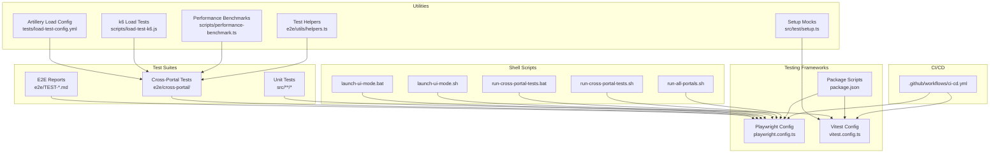
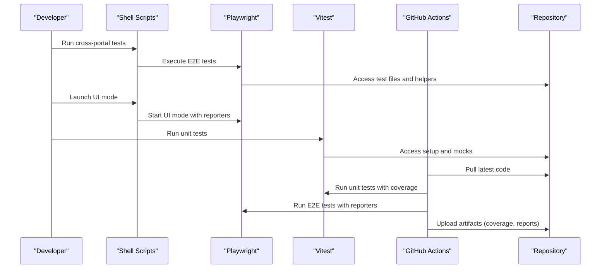
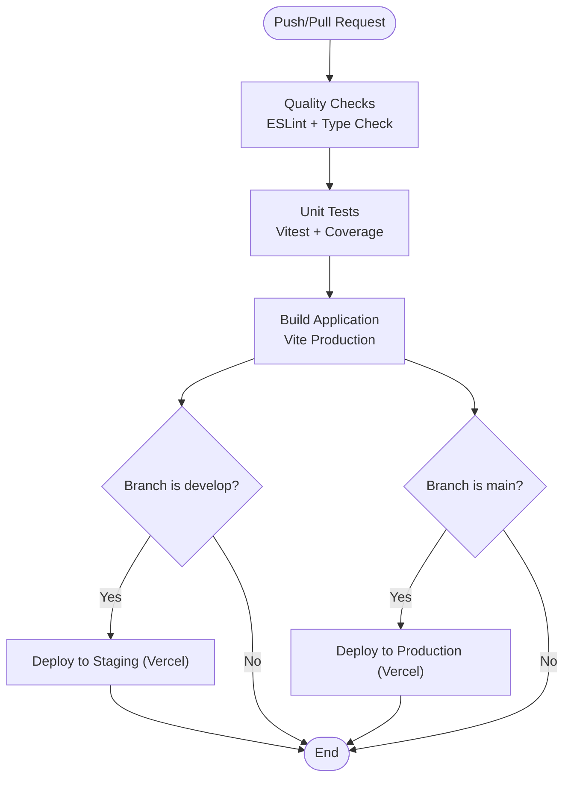
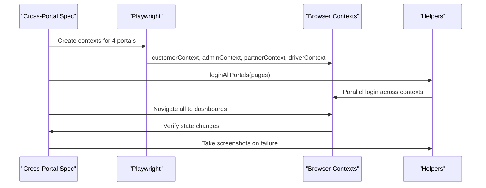
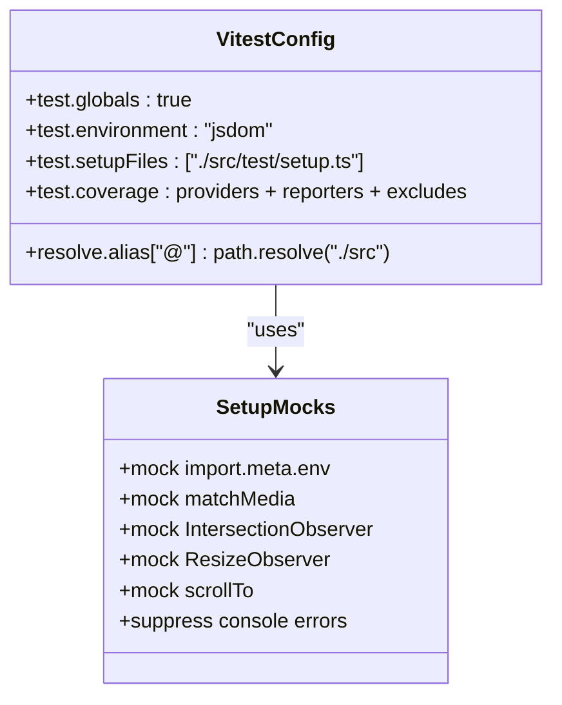
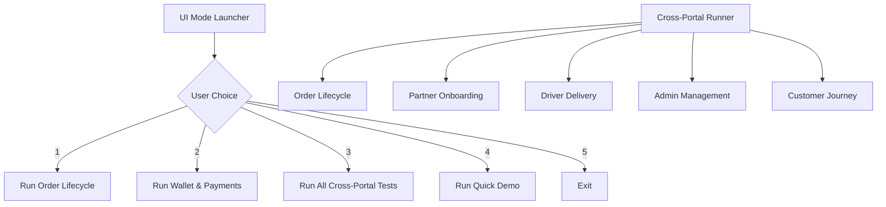
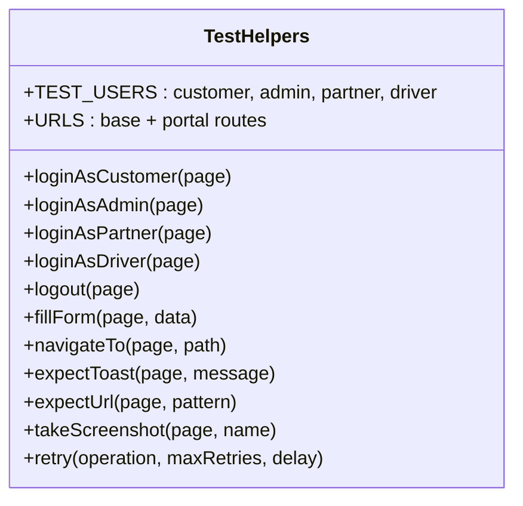
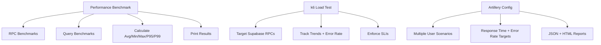
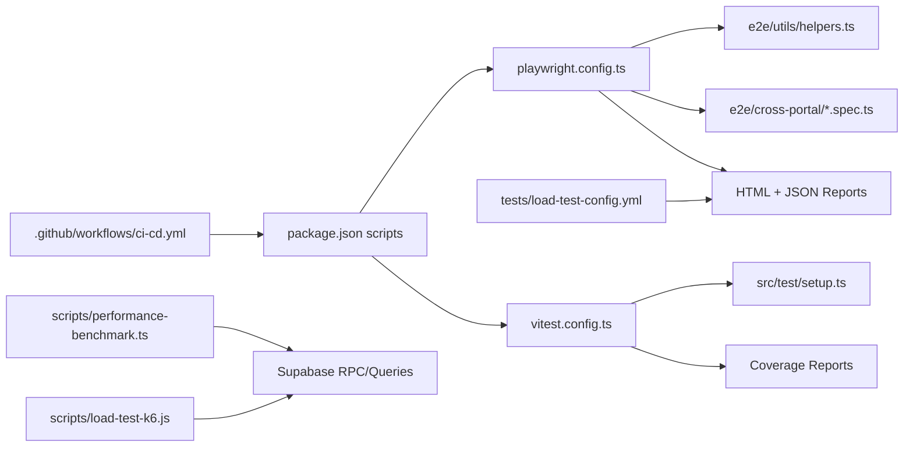
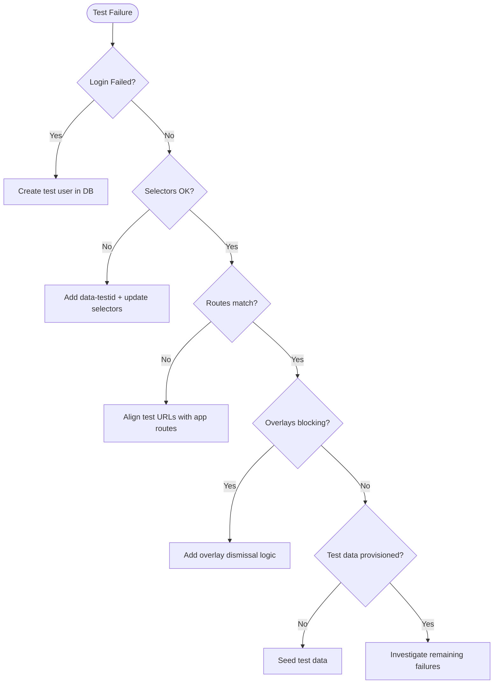

# Test Automation Infrastructure

<cite>
**Referenced Files in This Document**
- [ci-cd.yml](file://.github/workflows/ci-cd.yml)
- [playwright.config.ts](file://playwright.config.ts)
- [package.json](file://package.json)
- [vitest.config.ts](file://vitest.config.ts)
- [run-all-portals.sh](file://scripts/run-all-portals.sh)
- [run-cross-portal-tests.sh](file://scripts/run-cross-portal-tests.sh)
- [run-cross-portal-tests.bat](file://scripts/run-cross-portal-tests.bat)
- [launch-ui-mode.sh](file://scripts/launch-ui-mode.sh)
- [launch-ui-mode.bat](file://scripts/launch-ui-mode.bat)
- [README.md](file://e2e/cross-portal/README.md)
- [TEST-REPORT.md](file://e2e/TEST-REPORT.md)
- [TEST-RUN-REPORT.md](file://e2e/TEST-RUN-REPORT.md)
- [helpers.ts](file://e2e/utils/helpers.ts)
- [performance-benchmark.ts](file://scripts/performance-benchmark.ts)
- [load-test-k6.js](file://scripts/load-test-k6.js)
- [load-test-config.yml](file://tests/load-test-config.yml)
- [setup.ts](file://src/test/setup.ts)
</cite>

## Table of Contents
1. [Introduction](#introduction)
2. [Project Structure](#project-structure)
3. [Core Components](#core-components)
4. [Architecture Overview](#architecture-overview)
5. [Detailed Component Analysis](#detailed-component-analysis)
6. [Dependency Analysis](#dependency-analysis)
7. [Performance Considerations](#performance-considerations)
8. [Troubleshooting Guide](#troubleshooting-guide)
9. [Conclusion](#conclusion)
10. [Appendices](#appendices)

## Introduction
This document describes the complete test automation infrastructure for the Nutrio project, covering continuous integration and deployment (CI/CD), automated test execution, and test result management. It explains the shell scripts for running different test suites, UI mode launching, and test environment setup. It documents GitHub Actions workflows for automated testing, test result reporting, and failure notifications. It also covers test execution scheduling, parallel test running, resource management, test data cleanup, environment isolation, and test artifact management. Finally, it outlines integration with reporting tools, notifications, and test result aggregation for stakeholders.

## Project Structure
The test automation system spans multiple layers:
- CI/CD workflows orchestrated via GitHub Actions
- Playwright-based end-to-end (E2E) tests with cross-portal orchestration
- Vitest-based unit tests with coverage
- Shell scripts for local test execution and UI mode
- Performance and load testing utilities
- Test utilities and helpers for environment setup and assertions

**Diagram sources**
- [ci-cd.yml:1-197](file://.github/workflows/ci-cd.yml#L1-L197)
- [playwright.config.ts:1-92](file://playwright.config.ts#L1-L92)
- [vitest.config.ts:1-28](file://vitest.config.ts#L1-L28)
- [package.json:7-43](file://package.json#L7-L43)
- [run-all-portals.sh:1-22](file://scripts/run-all-portals.sh#L1-L22)
- [run-cross-portal-tests.sh:1-79](file://scripts/run-cross-portal-tests.sh#L1-L79)
- [run-cross-portal-tests.bat:1-62](file://scripts/run-cross-portal-tests.bat#L1-L62)
- [launch-ui-mode.sh:1-106](file://scripts/launch-ui-mode.sh#L1-L106)
- [launch-ui-mode.bat:1-99](file://scripts/launch-ui-mode.bat#L1-L99)
- [README.md:1-460](file://e2e/cross-portal/README.md#L1-L460)
- [TEST-REPORT.md:1-215](file://e2e/TEST-REPORT.md#L1-L215)
- [TEST-RUN-REPORT.md:1-202](file://e2e/TEST-RUN-REPORT.md#L1-L202)
- [helpers.ts:1-239](file://e2e/utils/helpers.ts#L1-L239)
- [setup.ts:1-70](file://src/test/setup.ts#L1-L70)
- [performance-benchmark.ts:1-280](file://scripts/performance-benchmark.ts#L1-L280)
- [load-test-k6.js:1-129](file://scripts/load-test-k6.js#L1-L129)
- [load-test-config.yml:1-173](file://tests/load-test-config.yml#L1-L173)

**Section sources**
- [ci-cd.yml:1-197](file://.github/workflows/ci-cd.yml#L1-L197)
- [playwright.config.ts:1-92](file://playwright.config.ts#L1-L92)
- [vitest.config.ts:1-28](file://vitest.config.ts#L1-L28)
- [package.json:7-43](file://package.json#L7-L43)

## Core Components
- CI/CD pipeline with quality checks, unit tests, builds, and deployments
- Playwright configuration for E2E tests with reporters, tracing, screenshots, and video
- Vitest configuration for unit tests with coverage and setup files
- Shell scripts for cross-portal test execution and UI mode
- Test helpers for authentication, navigation, assertions, and utilities
- Performance and load testing tools for benchmarking and stress testing

Key capabilities:
- Automated test execution in CI with coverage and artifacts
- Local parallel execution and UI mode for debugging
- Cross-portal orchestration with isolated browser contexts
- Performance benchmarking and load testing configurations

**Section sources**
- [ci-cd.yml:14-197](file://.github/workflows/ci-cd.yml#L14-L197)
- [playwright.config.ts:13-92](file://playwright.config.ts#L13-L92)
- [vitest.config.ts:4-27](file://vitest.config.ts#L4-L27)
- [package.json:7-43](file://package.json#L7-L43)
- [helpers.ts:8-26](file://e2e/utils/helpers.ts#L8-L26)

## Architecture Overview
The test automation architecture integrates CI/CD, test frameworks, and local execution tools. CI orchestrates quality checks, unit tests, builds, and deployments. Locally, developers use Playwright and Vitest with shell scripts and helpers for rapid feedback. Cross-portal tests leverage isolated browser contexts to simulate multi-user, multi-portal workflows.

**Diagram sources**
- [run-cross-portal-tests.sh:17-33](file://scripts/run-cross-portal-tests.sh#L17-L33)
- [launch-ui-mode.sh:51-100](file://scripts/launch-ui-mode.sh#L51-L100)
- [playwright.config.ts:28-33](file://playwright.config.ts#L28-L33)
- [vitest.config.ts:9-19](file://vitest.config.ts#L9-L19)
- [ci-cd.yml:43-110](file://.github/workflows/ci-cd.yml#L43-L110)

## Detailed Component Analysis

### CI/CD Pipeline (GitHub Actions)
The CI pipeline performs:
- Code quality checks (ESLint, TypeScript type check)
- Unit tests with coverage
- Build production bundle
- Deployments to staging and production environments
- Security audit with npm audit and audit-ci

**Diagram sources**
- [ci-cd.yml:3-197](file://.github/workflows/ci-cd.yml#L3-L197)

**Section sources**
- [ci-cd.yml:14-197](file://.github/workflows/ci-cd.yml#L14-L197)

### Playwright Configuration and Cross-Portal Tests
Playwright is configured for:
- Test directory, parallelization, retries, and worker limits
- HTML and JSON reporters with trace, screenshot, and video collection
- Projects for Chromium and optional cross-browser testing
- Local dev server hook for test execution

Cross-portal tests orchestrate:
- Isolated browser contexts per portal
- Parallel login and navigation
- Simultaneous actions across portals
- Utilities for login, navigation, assertions, and screenshots

**Diagram sources**
- [playwright.config.ts:56-82](file://playwright.config.ts#L56-L82)
- [README.md:134-186](file://e2e/cross-portal/README.md#L134-L186)
- [helpers.ts:56-95](file://e2e/utils/helpers.ts#L56-L95)

**Section sources**
- [playwright.config.ts:13-92](file://playwright.config.ts#L13-L92)
- [README.md:1-460](file://e2e/cross-portal/README.md#L1-L460)
- [helpers.ts:1-239](file://e2e/utils/helpers.ts#L1-L239)

### Vitest Configuration and Unit Tests
Vitest is configured with:
- Global environment and jsdom
- Setup files for mocking
- Coverage reporting (text, json, html)
- Path aliases and include patterns

**Diagram sources**
- [vitest.config.ts:4-27](file://vitest.config.ts#L4-L27)
- [setup.ts:1-70](file://src/test/setup.ts#L1-L70)

**Section sources**
- [vitest.config.ts:1-28](file://vitest.config.ts#L1-L28)
- [setup.ts:1-70](file://src/test/setup.ts#L1-L70)

### Shell Scripts for Test Execution and UI Mode
Local execution scripts:
- Cross-portal runner (Linux/macOS and Windows)
- UI mode launcher with menu-driven choices
- All-portals parallel execution

**Diagram sources**
- [launch-ui-mode.sh:31-100](file://scripts/launch-ui-mode.sh#L31-L100)
- [launch-ui-mode.bat:14-99](file://scripts/launch-ui-mode.bat#L14-L99)
- [run-cross-portal-tests.sh:17-33](file://scripts/run-cross-portal-tests.sh#L17-L33)
- [run-cross-portal-tests.bat:15-43](file://scripts/run-cross-portal-tests.bat#L15-L43)

**Section sources**
- [run-all-portals.sh:1-22](file://scripts/run-all-portals.sh#L1-L22)
- [run-cross-portal-tests.sh:1-79](file://scripts/run-cross-portal-tests.sh#L1-L79)
- [run-cross-portal-tests.bat:1-62](file://scripts/run-cross-portal-tests.bat#L1-L62)
- [launch-ui-mode.sh:1-106](file://scripts/launch-ui-mode.sh#L1-L106)
- [launch-ui-mode.bat:1-99](file://scripts/launch-ui-mode.bat#L1-L99)

### Test Utilities and Environment Setup
Test helpers centralize:
- Test user credentials and portal URLs
- Wait utilities and element interactions
- Authentication flows per portal
- Assertions, navigation, uploads, scrolling, and viewport helpers
- Screenshot capture and retry logic

**Diagram sources**
- [helpers.ts:8-239](file://e2e/utils/helpers.ts#L8-L239)

**Section sources**
- [helpers.ts:1-239](file://e2e/utils/helpers.ts#L1-L239)

### Performance and Load Testing
Performance benchmarking:
- Measures RPC and query response times with percentiles
- Validates targets and logs pass/fail status
- Handles expected errors in test environments

Load testing:
- k6 script for Supabase RPC under load with thresholds
- Artillery YAML for sustained load scenarios and reporting

**Diagram sources**
- [performance-benchmark.ts:20-264](file://scripts/performance-benchmark.ts#L20-L264)
- [load-test-k6.js:20-116](file://scripts/load-test-k6.js#L20-L116)
- [load-test-config.yml:9-173](file://tests/load-test-config.yml#L9-L173)

**Section sources**
- [performance-benchmark.ts:1-280](file://scripts/performance-benchmark.ts#L1-L280)
- [load-test-k6.js:1-129](file://scripts/load-test-k6.js#L1-L129)
- [load-test-config.yml:1-173](file://tests/load-test-config.yml#L1-L173)

## Dependency Analysis
The test automation stack exhibits clear separation of concerns:
- CI/CD depends on package scripts and test configurations
- Playwright depends on test helpers and cross-portal specs
- Vitest depends on setup mocks and unit test files
- Shell scripts depend on Playwright commands and environment variables
- Performance and load testing depend on Supabase connectivity and environment variables

**Diagram sources**
- [ci-cd.yml:43-110](file://.github/workflows/ci-cd.yml#L43-L110)
- [package.json:7-43](file://package.json#L7-L43)
- [playwright.config.ts:13-92](file://playwright.config.ts#L13-L92)
- [vitest.config.ts:4-27](file://vitest.config.ts#L4-L27)
- [helpers.ts:1-239](file://e2e/utils/helpers.ts#L1-L239)
- [performance-benchmark.ts:1-280](file://scripts/performance-benchmark.ts#L1-L280)
- [load-test-k6.js:1-129](file://scripts/load-test-k6.js#L1-L129)
- [load-test-config.yml:1-173](file://tests/load-test-config.yml#L1-L173)

**Section sources**
- [ci-cd.yml:1-197](file://.github/workflows/ci-cd.yml#L1-L197)
- [package.json:7-43](file://package.json#L7-L43)
- [playwright.config.ts:1-92](file://playwright.config.ts#L1-L92)
- [vitest.config.ts:1-28](file://vitest.config.ts#L1-L28)
- [helpers.ts:1-239](file://e2e/utils/helpers.ts#L1-L239)

## Performance Considerations
- Parallelization: Playwright workers are limited in CI to reduce contention; adjust locally for speed.
- Retries: CI enables retries for flaky tests; consider adding retry logic in flaky steps.
- Resource management: Use isolated browser contexts to prevent cross-test interference.
- Coverage: Unit test coverage is enabled; ensure meaningful coverage thresholds.
- Reporting: HTML and JSON reporters provide actionable insights; archive artifacts for historical analysis.
- Load testing: k6 and Artillery provide realistic load scenarios; tune thresholds and ramp schedules.

[No sources needed since this section provides general guidance]

## Troubleshooting Guide
Common issues and resolutions:
- Test credentials not working: Ensure test users exist in the database and credentials are correct.
- UI selectors mismatch: Update selectors to use stable identifiers (e.g., data-testid) and align with actual UI.
- Route mismatches: Align test URLs with actual application routes; fix 404 errors.
- Dialogs blocking interactions: Add logic to close overlays before clicking.
- Missing test data: Provision test users, restaurants, orders, and subscriptions.
- Authentication failures: Verify login flows and redirect expectations.

**Section sources**
- [TEST-REPORT.md:35-134](file://e2e/TEST-REPORT.md#L35-L134)
- [TEST-RUN-REPORT.md:22-152](file://e2e/TEST-RUN-REPORT.md#L22-L152)
- [helpers.ts:8-26](file://e2e/utils/helpers.ts#L8-L26)

## Conclusion
The test automation infrastructure combines robust CI/CD workflows, Playwright-based cross-portal E2E tests, Vitest unit tests, and performance/load testing tools. It supports local parallel execution, UI mode debugging, and comprehensive reporting. By addressing current issues (credentials, selectors, routes, and test data), the system can achieve reliable, repeatable, and scalable automated testing aligned with stakeholder needs.

[No sources needed since this section summarizes without analyzing specific files]

## Appendices

### Test Execution Commands and Scripts
- Run all cross-portal tests: `npx playwright test e2e/cross-portal/`
- Run with UI mode: `npx playwright test --ui`
- Run specific workflow: `npx playwright test e2e/cross-portal/order-lifecycle.spec.ts`
- Run with headed mode: `npx playwright test --headed`
- Show report: `npx playwright show-report`
- Run unit tests: `npm run test:run`
- Run unit tests with coverage: `npm run test:coverage`
- Run all portals in parallel: `./scripts/run-all-portals.sh`

**Section sources**
- [README.md:187-271](file://e2e/cross-portal/README.md#L187-L271)
- [package.json:27-42](file://package.json#L27-L42)

### Environment Variables and Secrets
- CI environment variables: Node.js version
- Build secrets: Supabase URL/key, Sentry DSN, PostHog key
- Local environment: BASE_URL for Playwright; ensure dev server is running on port 8080

**Section sources**
- [ci-cd.yml:9-101](file://.github/workflows/ci-cd.yml#L9-L101)
- [playwright.config.ts:37-53](file://playwright.config.ts#L37-L53)

### Artifact and Report Management
- Coverage reports: Uploaded as artifacts in CI
- Playwright HTML and JSON reports: Generated locally and in CI
- Load test results: JSON and HTML outputs for analysis

**Section sources**
- [ci-cd.yml:65-71](file://.github/workflows/ci-cd.yml#L65-L71)
- [load-test-config.yml:136-141](file://tests/load-test-config.yml#L136-L141)