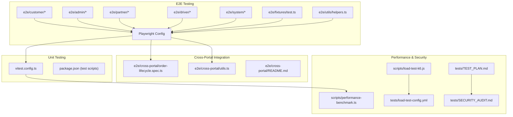
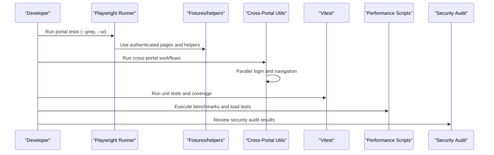
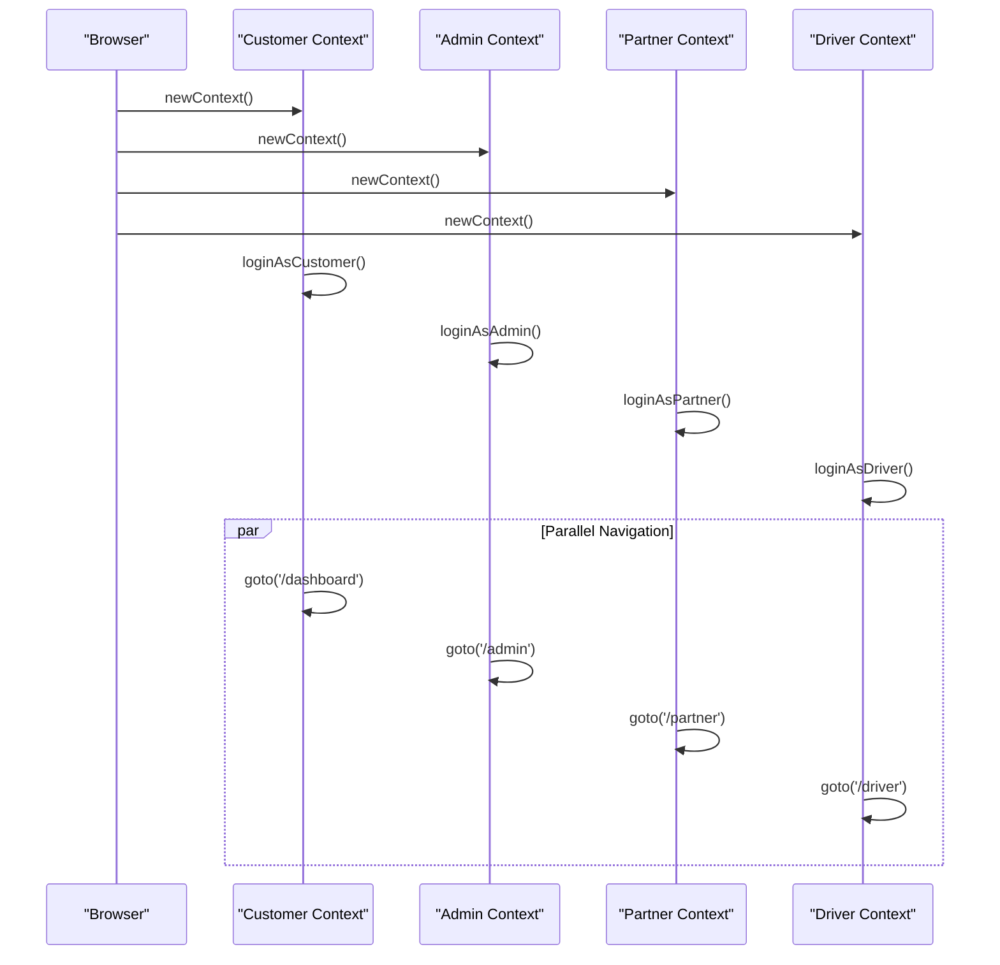
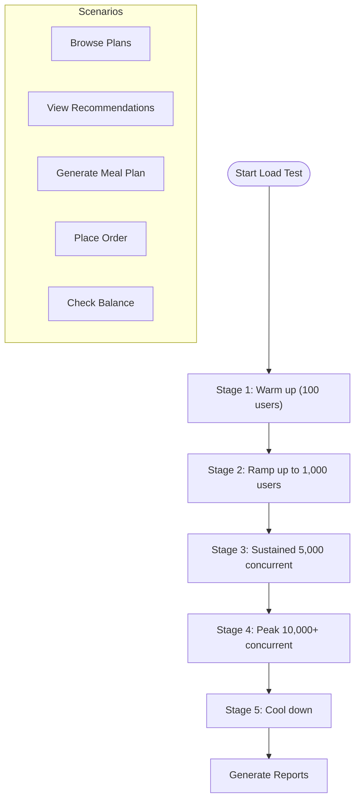
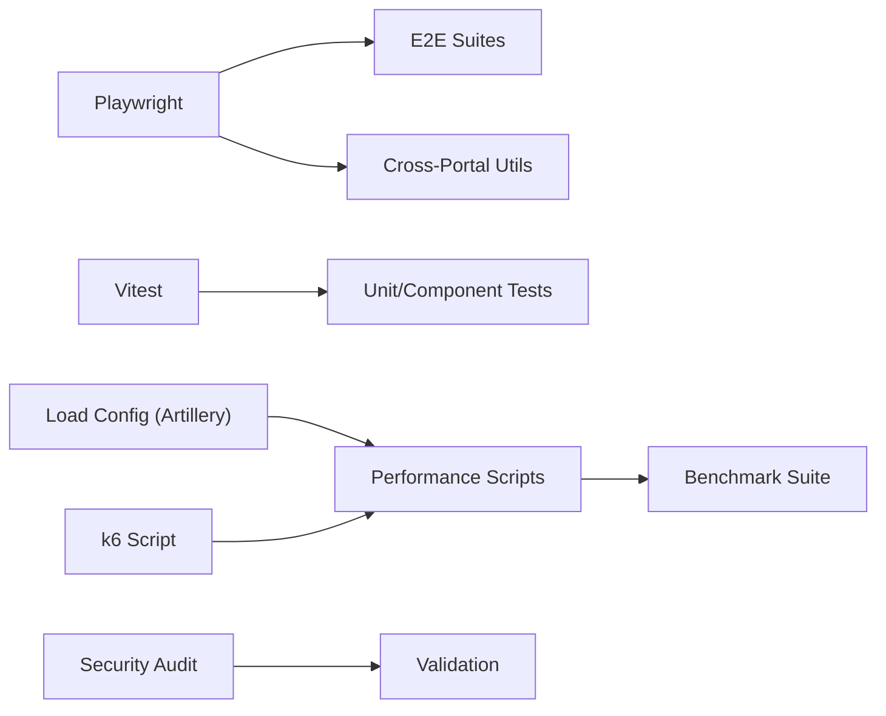

# Testing Strategy

<cite>
**Referenced Files in This Document**
- [playwright.config.ts](file://playwright.config.ts)
- [vitest.config.ts](file://vitest.config.ts)
- [package.json](file://package.json)
- [e2e/README.md](file://e2e/README.md)
- [e2e/fixtures/test.ts](file://e2e/fixtures/test.ts)
- [e2e/utils/helpers.ts](file://e2e/utils/helpers.ts)
- [e2e/cross-portal/README.md](file://e2e/cross-portal/README.md)
- [e2e/cross-portal/utils.ts](file://e2e/cross-portal/utils.ts)
- [tests/TEST_PLAN.md](file://tests/TEST_PLAN.md)
- [tests/load-test-config.yml](file://tests/load-test-config.yml)
- [scripts/load-test-k6.js](file://scripts/load-test-k6.js)
- [scripts/performance-benchmark.ts](file://scripts/performance-benchmark.ts)
- [tests/SECURITY_AUDIT.md](file://tests/SECURITY_AUDIT.md)
</cite>

## Table of Contents
1. [Introduction](#introduction)
2. [Project Structure](#project-structure)
3. [Core Components](#core-components)
4. [Architecture Overview](#architecture-overview)
5. [Detailed Component Analysis](#detailed-component-analysis)
6. [Dependency Analysis](#dependency-analysis)
7. [Performance Considerations](#performance-considerations)
8. [Troubleshooting Guide](#troubleshooting-guide)
9. [Conclusion](#conclusion)
10. [Appendices](#appendices)

## Introduction
This document defines the comprehensive testing strategy for the Nutrio platform, covering Playwright-based end-to-end (E2E) testing, unit testing, cross-portal integration workflows, continuous integration testing, performance and load testing, security testing, best practices, test data management, regression strategies, mobile and cross-browser compatibility, and accessibility requirements. The goal is to ensure reliable, scalable, and secure delivery of the AI-powered subscription platform.

## Project Structure
The testing ecosystem is organized around three pillars:
- Playwright E2E tests grouped by portal and system categories
- Cross-portal integration tests simulating multi-user, multi-portal workflows
- Unit and component tests powered by Vitest with TypeScript
- Performance, load, and security testing suites with dedicated scripts and configurations

**Diagram sources**
- [playwright.config.ts:13-92](file://playwright.config.ts#L13-L92)
- [vitest.config.ts:1-28](file://vitest.config.ts#L1-L28)
- [package.json:7-43](file://package.json#L7-L43)
- [e2e/README.md:61-93](file://e2e/README.md#L61-L93)
- [e2e/cross-portal/README.md:1-460](file://e2e/cross-portal/README.md#L1-L460)
- [e2e/fixtures/test.ts:1-49](file://e2e/fixtures/test.ts#L1-L49)
- [e2e/utils/helpers.ts:1-239](file://e2e/utils/helpers.ts#L1-L239)
- [scripts/performance-benchmark.ts:1-280](file://scripts/performance-benchmark.ts#L1-L280)
- [scripts/load-test-k6.js:1-129](file://scripts/load-test-k6.js#L1-L129)
- [tests/load-test-config.yml:1-173](file://tests/load-test-config.yml#L1-L173)
- [tests/SECURITY_AUDIT.md:1-253](file://tests/SECURITY_AUDIT.md#L1-L253)
- [tests/TEST_PLAN.md:1-158](file://tests/TEST_PLAN.md#L1-L158)

**Section sources**
- [e2e/README.md:1-233](file://e2e/README.md#L1-L233)
- [e2e/cross-portal/README.md:1-460](file://e2e/cross-portal/README.md#L1-L460)
- [playwright.config.ts:13-92](file://playwright.config.ts#L13-L92)
- [vitest.config.ts:1-28](file://vitest.config.ts#L1-L28)
- [package.json:7-43](file://package.json#L7-L43)

## Core Components
- Playwright E2E framework with portal-specific suites and shared fixtures/helpers
- Cross-portal integration tests leveraging isolated browser contexts and parallel operations
- Vitest-based unit and component tests with coverage reporting
- Performance benchmarking and load testing scripts for API and database functions
- Security audit and penetration testing documentation validating controls

Key capabilities:
- Portal-based test execution with filtering and UI mode
- Shared authentication and navigation utilities
- Multi-portal login and simultaneous navigation
- Retry logic, screenshots, and trace collection for debugging
- CI-friendly reporters and artifact generation

**Section sources**
- [e2e/README.md:16-59](file://e2e/README.md#L16-L59)
- [e2e/fixtures/test.ts:10-46](file://e2e/fixtures/test.ts#L10-L46)
- [e2e/utils/helpers.ts:56-95](file://e2e/utils/helpers.ts#L56-L95)
- [e2e/cross-portal/README.md:134-186](file://e2e/cross-portal/README.md#L134-L186)
- [e2e/cross-portal/utils.ts:98-165](file://e2e/cross-portal/utils.ts#L98-L165)
- [playwright.config.ts:29-54](file://playwright.config.ts#L29-L54)

## Architecture Overview
The testing architecture integrates multiple layers:
- Test orchestration via Playwright and Vitest
- Shared utilities for authentication, navigation, and assertions
- Cross-portal workflows using isolated browser contexts
- Performance and load testing with k6 and Artillery
- Security validation through audits and controlled penetration tests

**Diagram sources**
- [playwright.config.ts:13-92](file://playwright.config.ts#L13-L92)
- [e2e/fixtures/test.ts:18-46](file://e2e/fixtures/test.ts#L18-L46)
- [e2e/utils/helpers.ts:56-95](file://e2e/utils/helpers.ts#L56-L95)
- [e2e/cross-portal/utils.ts:170-196](file://e2e/cross-portal/utils.ts#L170-L196)
- [vitest.config.ts:5-21](file://vitest.config.ts#L5-L21)
- [scripts/performance-benchmark.ts:23-98](file://scripts/performance-benchmark.ts#L23-L98)
- [tests/SECURITY_AUDIT.md:1-253](file://tests/SECURITY_AUDIT.md#L1-L253)

## Detailed Component Analysis

### Playwright E2E Testing Framework
- Configuration supports parallelism toggles, retries, CI workers, and multiple reporters
- Projects for desktop browsers and commented mobile device presets
- Base URL, trace, screenshot, and video collection for debugging
- Test scripts in package.json for targeted portal runs and UI mode

Implementation highlights:
- Portal-specific suites under customer, admin, partner, driver, and system
- Shared helpers for login, navigation, assertions, and viewport management
- Fixtures that automatically authenticate and logout per test

**Section sources**
- [playwright.config.ts:13-92](file://playwright.config.ts#L13-L92)
- [e2e/README.md:61-93](file://e2e/README.md#L61-L93)
- [e2e/utils/helpers.ts:56-95](file://e2e/utils/helpers.ts#L56-L95)
- [e2e/fixtures/test.ts:18-46](file://e2e/fixtures/test.ts#L18-L46)
- [package.json:27-42](file://package.json#L27-L42)

### Cross-Portal Integration Testing
- Multi-browser context strategy enabling isolated sessions across Customer, Admin, Partner, and Driver portals
- Parallel login and navigation to simulate real-time interactions
- Utility functions for safe element interactions, retries, and verification
- Dedicated README with workflow scenarios, best practices, and CI integration guidance

**Diagram sources**
- [e2e/cross-portal/README.md:136-186](file://e2e/cross-portal/README.md#L136-L186)
- [e2e/cross-portal/utils.ts:170-196](file://e2e/cross-portal/utils.ts#L170-L196)

**Section sources**
- [e2e/cross-portal/README.md:1-460](file://e2e/cross-portal/README.md#L1-L460)
- [e2e/cross-portal/utils.ts:11-32](file://e2e/cross-portal/utils.ts#L11-L32)
- [e2e/cross-portal/utils.ts:98-165](file://e2e/cross-portal/utils.ts#L98-L165)

### Unit Testing with Vitest
- Global environment with jsdom, setup files, and coverage configuration
- Aliased imports for cleaner test paths
- Scripts for running tests, UI mode, and coverage reports

Best practices:
- Use setup files to mock environment and initialize test utilities
- Leverage coverage exclusions for config and type files
- Run tests in CI with coverage reporting

**Section sources**
- [vitest.config.ts:1-28](file://vitest.config.ts#L1-L28)
- [package.json:13-16](file://package.json#L13-L16)

### Performance and Load Testing
- k6 script targeting critical RPC endpoints with staged concurrency and thresholds
- Artillery YAML defining user journeys, weights, and performance thresholds
- Performance benchmarking suite measuring RPC and query latencies with percentiles

**Diagram sources**
- [tests/load-test-config.yml:9-46](file://tests/load-test-config.yml#L9-L46)
- [scripts/load-test-k6.js:21-35](file://scripts/load-test-k6.js#L21-L35)

**Section sources**
- [scripts/load-test-k6.js:1-129](file://scripts/load-test-k6.js#L1-L129)
- [tests/load-test-config.yml:1-173](file://tests/load-test-config.yml#L1-L173)
- [scripts/performance-benchmark.ts:1-280](file://scripts/performance-benchmark.ts#L1-L280)

### Security Testing
- Comprehensive security audit validating financial controls, authentication, SQL injection prevention, race conditions, and commission enforcement
- Penetration test results demonstrating blocking of unauthorized access, credit manipulation, and privilege escalation attempts
- Security metrics and grade assessment supporting production readiness

**Section sources**
- [tests/SECURITY_AUDIT.md:1-253](file://tests/SECURITY_AUDIT.md#L1-L253)

### Test Case Organization and CI/CD
- Playwright scripts for running specific portals and cross-portal workflows
- CI-friendly reporters (HTML, JSON) and artifact uploads
- GitHub Actions example in E2E README for automated test execution

**Section sources**
- [package.json:27-42](file://package.json#L27-L42)
- [e2e/README.md:165-189](file://e2e/README.md#L165-L189)
- [playwright.config.ts:29-33](file://playwright.config.ts#L29-L33)

## Dependency Analysis
The testing stack relies on:
- Playwright for browser automation and cross-portal multi-context testing
- Vitest for unit and component testing with jsdom
- k6 and Artillery for load and performance testing
- Supabase client for performance benchmarking and security validation
- Package scripts orchestrating test execution and reporting

**Diagram sources**
- [playwright.config.ts:13-92](file://playwright.config.ts#L13-L92)
- [vitest.config.ts:1-28](file://vitest.config.ts#L1-L28)
- [scripts/performance-benchmark.ts:1-280](file://scripts/performance-benchmark.ts#L1-L280)
- [tests/load-test-config.yml:1-173](file://tests/load-test-config.yml#L1-L173)
- [scripts/load-test-k6.js:1-129](file://scripts/load-test-k6.js#L1-L129)
- [tests/SECURITY_AUDIT.md:1-253](file://tests/SECURITY_AUDIT.md#L1-L253)

**Section sources**
- [package.json:7-43](file://package.json#L7-L43)
- [playwright.config.ts:13-92](file://playwright.config.ts#L13-L92)
- [vitest.config.ts:1-28](file://vitest.config.ts#L1-L28)

## Performance Considerations
- Use k6 for targeted RPC endpoint load testing with staged concurrency and percentile thresholds
- Employ Artillery YAML to simulate realistic user journeys and enforce response time and error rate targets
- Run performance benchmarks to identify slow RPCs and queries, focusing on P95/P99 latency targets
- Monitor database connection pooling, edge function scaling, and CDN caching during load tests

[No sources needed since this section provides general guidance]

## Troubleshooting Guide
Common issues and resolutions:
- Authentication failures: Verify test users exist in the Supabase auth table and credentials are correct
- Portals showing 404: Confirm route definitions in the frontend application
- Timeouts: Increase test timeouts or reduce concurrency; run with UI/headed mode for visibility
- Port conflicts: Run with single worker or sequentially to avoid port contention
- Network flakiness: Utilize retry helpers and wait-for-idle utilities

**Section sources**
- [e2e/cross-portal/README.md:376-406](file://e2e/cross-portal/README.md#L376-L406)
- [e2e/utils/helpers.ts:218-239](file://e2e/utils/helpers.ts#L218-L239)
- [e2e/cross-portal/utils.ts:238-259](file://e2e/cross-portal/utils.ts#L238-L259)

## Conclusion
The Nutrio testing strategy combines robust E2E coverage across portals, comprehensive cross-portal integration workflows, unit testing with Vitest, and rigorous performance, load, and security validation. The documented setup, utilities, and CI guidance enable reliable, repeatable quality assurance aligned with production-grade standards.

[No sources needed since this section summarizes without analyzing specific files]

## Appendices

### Test Data Management
- Centralized test credentials and URLs in shared helpers
- Timestamped identifiers for unique test records
- Controlled test data creation and cleanup via fixtures and helpers

**Section sources**
- [e2e/utils/helpers.ts:8-42](file://e2e/utils/helpers.ts#L8-L42)
- [e2e/cross-portal/utils.ts:11-32](file://e2e/cross-portal/utils.ts#L11-L32)
- [e2e/cross-portal/utils.ts:233-235](file://e2e/cross-portal/utils.ts#L233-L235)

### Regression Testing Strategy
- Prioritize critical and high-priority tests using grep filters
- Maintain cross-portal workflows as regression gates for integrated changes
- Use CI artifacts and HTML reports for historical trend analysis

**Section sources**
- [e2e/README.md:204-210](file://e2e/README.md#L204-L210)
- [e2e/cross-portal/README.md:418-433](file://e2e/cross-portal/README.md#L418-L433)

### Mobile and Cross-Browser Compatibility
- Device presets available in Playwright projects for desktop Chromium, Firefox, and WebKit
- Mobile viewport helpers and responsive navigation utilities
- Cross-browser execution for critical workflows

**Section sources**
- [playwright.config.ts:56-82](file://playwright.config.ts#L56-L82)
- [e2e/utils/helpers.ts:188-198](file://e2e/utils/helpers.ts#L188-L198)

### Accessibility Testing Requirements
- WCAG 2.1 compliance goals outlined in the testing plan
- Visual inspection and screen reader testing recommended for UI/UX validations
- Automated checks can complement manual accessibility reviews

**Section sources**
- [tests/TEST_PLAN.md:82-90](file://tests/TEST_PLAN.md#L82-L90)