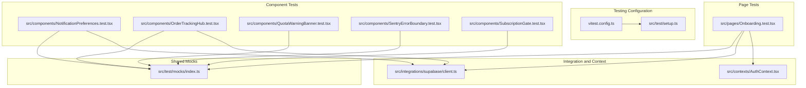
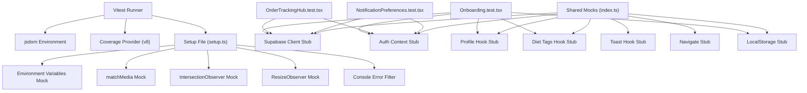
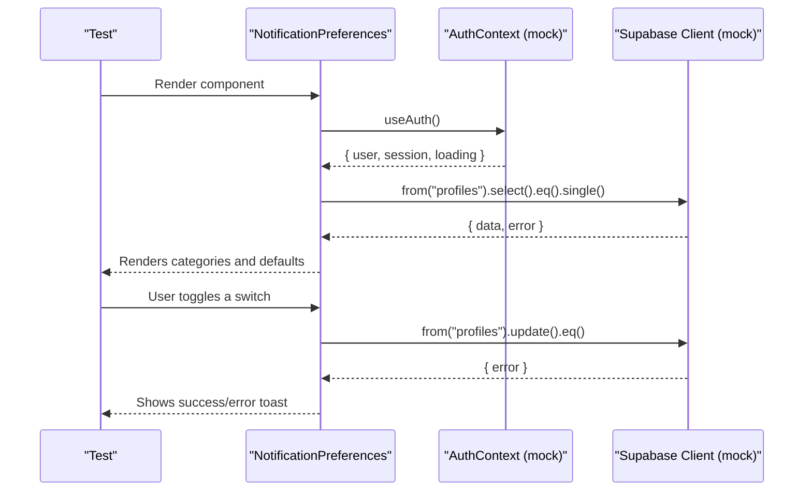
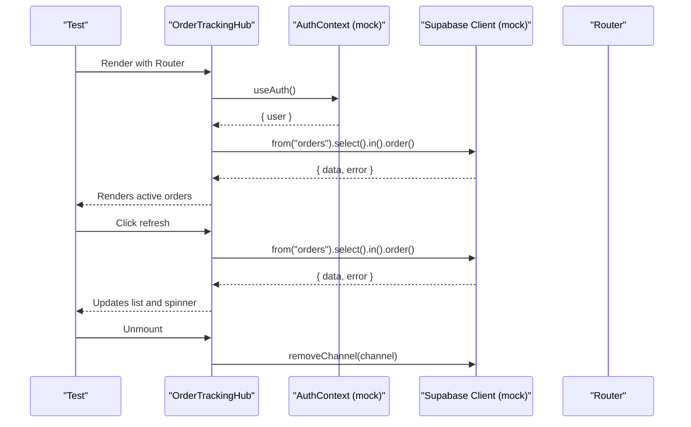
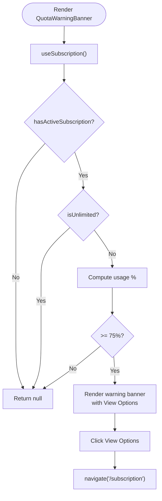
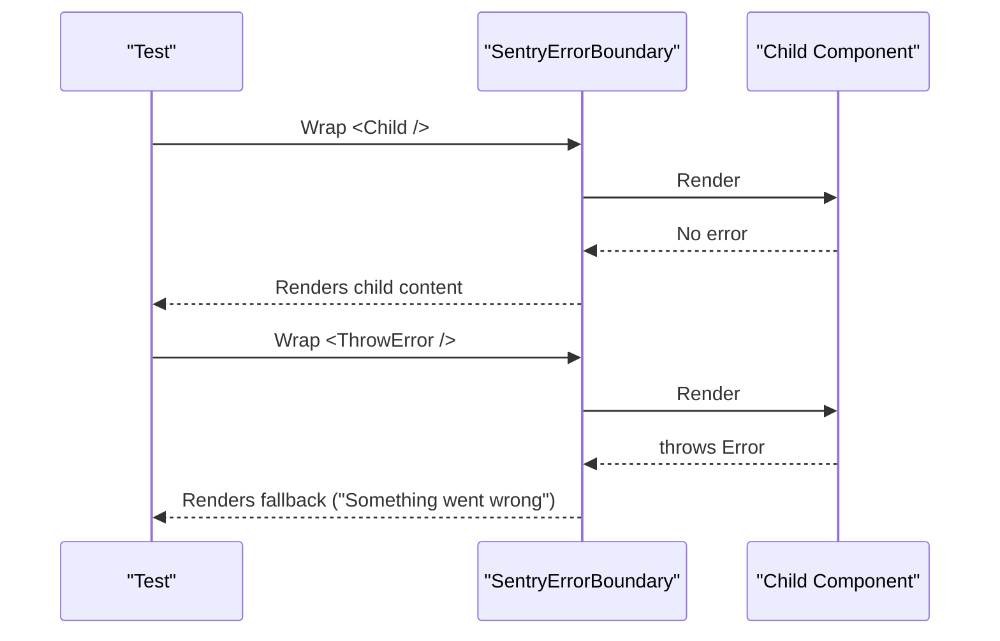
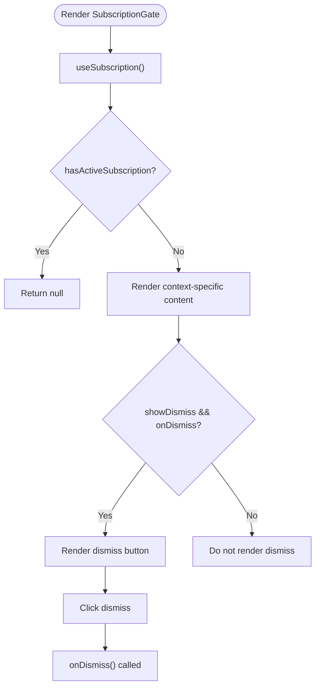
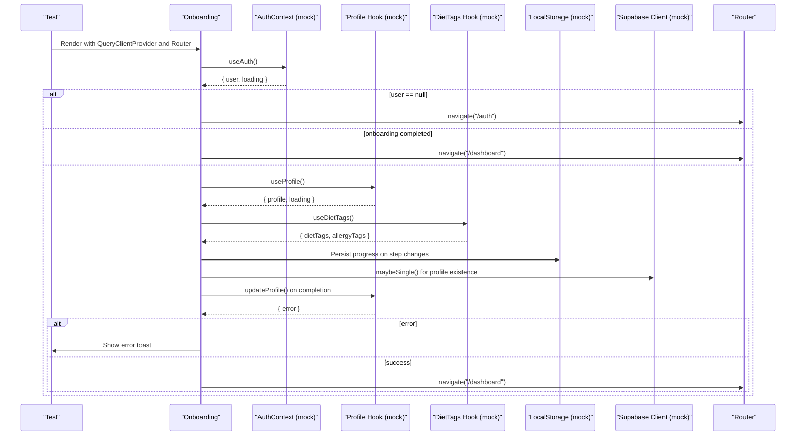
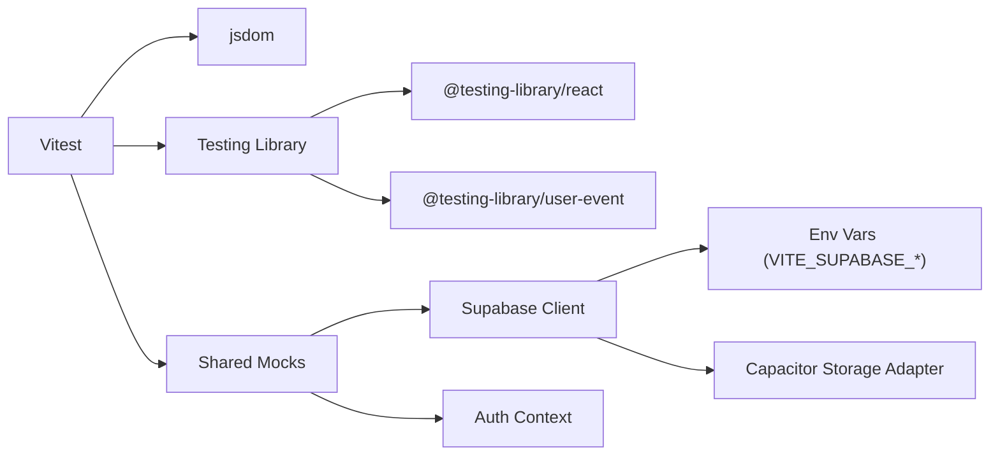

# Unit Testing

<cite>
**Referenced Files in This Document**
- [vitest.config.ts](file://vitest.config.ts)
- [setup.ts](file://src/test/setup.ts)
- [index.ts](file://src/test/mocks/index.ts)
- [NotificationPreferences.test.tsx](file://src/components/NotificationPreferences.test.tsx)
- [OrderTrackingHub.test.tsx](file://src/components/OrderTrackingHub.test.tsx)
- [QuotaWarningBanner.test.tsx](file://src/components/QuotaWarningBanner.test.tsx)
- [SentryErrorBoundary.test.tsx](file://src/components/SentryErrorBoundary.test.tsx)
- [SubscriptionGate.test.tsx](file://src/components/SubscriptionGate.test.tsx)
- [Onboarding.test.tsx](file://src/pages/Onboarding.test.tsx)
- [client.ts](file://src/integrations/supabase/client.ts)
- [AuthContext.tsx](file://src/contexts/AuthContext.tsx)
- [package.json](file://package.json)
</cite>

## Table of Contents
1. [Introduction](#introduction)
2. [Project Structure](#project-structure)
3. [Core Components](#core-components)
4. [Architecture Overview](#architecture-overview)
5. [Detailed Component Analysis](#detailed-component-analysis)
6. [Dependency Analysis](#dependency-analysis)
7. [Performance Considerations](#performance-considerations)
8. [Troubleshooting Guide](#troubleshooting-guide)
9. [Conclusion](#conclusion)
10. [Appendices](#appendices)

## Introduction
This document provides comprehensive unit testing guidance for the React application using Vitest. It covers configuration, test setup utilities, shared mocks, and testing patterns for components, custom hooks, and utility functions. It also documents strategies for mocking Supabase client, Capacitor plugins, and external APIs, along with best practices for async operations, error handling, and component rendering. Practical examples are linked via file references to real tests and supporting modules.

## Project Structure
The testing stack is organized around Vitest with jsdom as the DOM environment, Jest-DOM matchers, and a centralized setup file for global mocks. Shared mocks live under a dedicated module for reuse across tests. Component and page tests reside alongside their implementation files, with clear separation of concerns.

**Diagram sources**
- [vitest.config.ts:1-28](file://vitest.config.ts#L1-L28)
- [setup.ts:1-70](file://src/test/setup.ts#L1-L70)
- [index.ts:1-149](file://src/test/mocks/index.ts#L1-L149)
- [NotificationPreferences.test.tsx:1-427](file://src/components/NotificationPreferences.test.tsx#L1-L427)
- [OrderTrackingHub.test.tsx:1-524](file://src/components/OrderTrackingHub.test.tsx#L1-L524)
- [QuotaWarningBanner.test.tsx:1-325](file://src/components/QuotaWarningBanner.test.tsx#L1-L325)
- [SentryErrorBoundary.test.tsx:1-54](file://src/components/SentryErrorBoundary.test.tsx#L1-L54)
- [SubscriptionGate.test.tsx:1-234](file://src/components/SubscriptionGate.test.tsx#L1-L234)
- [Onboarding.test.tsx:1-712](file://src/pages/Onboarding.test.tsx#L1-L712)
- [client.ts:1-57](file://src/integrations/supabase/client.ts#L1-L57)
- [AuthContext.tsx:1-131](file://src/contexts/AuthContext.tsx#L1-L131)

**Section sources**
- [vitest.config.ts:1-28](file://vitest.config.ts#L1-L28)
- [setup.ts:1-70](file://src/test/setup.ts#L1-L70)
- [index.ts:1-149](file://src/test/mocks/index.ts#L1-L149)

## Core Components
- Vitest configuration defines globals, jsdom environment, setup file, coverage provider/reporters, and include patterns.
- Global setup mocks environment variables, IntersectionObserver, ResizeObserver, matchMedia, and suppresses noisy console errors.
- Shared mocks centralize user/profile data, Supabase client stubs, Auth context stubs, navigation, and local storage mocks.

Key responsibilities:
- vitest.config.ts: Configure test runner, coverage, and aliases.
- setup.ts: Provide browser-like globals and suppress noise.
- index.ts: Provide reusable mock factories and helpers.

**Section sources**
- [vitest.config.ts:4-27](file://vitest.config.ts#L4-L27)
- [setup.ts:4-69](file://src/test/setup.ts#L4-L69)
- [index.ts:54-149](file://src/test/mocks/index.ts#L54-L149)

## Architecture Overview
The testing architecture integrates:
- Vitest runtime with jsdom for DOM simulation.
- Centralized setup for environment mocks.
- Shared mock factories for consistent test doubles.
- Component/page tests that isolate units and assert behavior.

**Diagram sources**
- [vitest.config.ts:5-21](file://vitest.config.ts#L5-L21)
- [setup.ts:4-69](file://src/test/setup.ts#L4-L69)
- [index.ts:54-149](file://src/test/mocks/index.ts#L54-L149)
- [NotificationPreferences.test.tsx:14-35](file://src/components/NotificationPreferences.test.tsx#L14-L35)
- [OrderTrackingHub.test.tsx:14-42](file://src/components/OrderTrackingHub.test.tsx#L14-L42)
- [Onboarding.test.tsx:17-50](file://src/pages/Onboarding.test.tsx#L17-L50)

## Detailed Component Analysis

### NotificationPreferences Component Tests
Patterns demonstrated:
- Mocking Supabase client per test to control data retrieval and updates.
- Using @testing-library/user-event for realistic interactions.
- Verifying loading states, default preferences, category structure, and toast feedback.
- Asserting error handling and graceful degradation.

**Diagram sources**
- [NotificationPreferences.test.tsx:37-231](file://src/components/NotificationPreferences.test.tsx#L37-L231)
- [client.ts:47-57](file://src/integrations/supabase/client.ts#L47-L57)

**Section sources**
- [NotificationPreferences.test.tsx:52-179](file://src/components/NotificationPreferences.test.tsx#L52-L179)
- [NotificationPreferences.test.tsx:181-285](file://src/components/NotificationPreferences.test.tsx#L181-L285)
- [NotificationPreferences.test.tsx:287-347](file://src/components/NotificationPreferences.test.tsx#L287-L347)
- [NotificationPreferences.test.tsx:349-389](file://src/components/NotificationPreferences.test.tsx#L349-L389)
- [NotificationPreferences.test.tsx:391-425](file://src/components/NotificationPreferences.test.tsx#L391-L425)

### OrderTrackingHub Component Tests
Patterns demonstrated:
- Router wrapping for navigation assertions.
- Real-time subscription mocking via Supabase channel.
- Refresh and navigation interactions.
- Status rendering and icon/color assertions.

**Diagram sources**
- [OrderTrackingHub.test.tsx:44-47](file://src/components/OrderTrackingHub.test.tsx#L44-L47)
- [OrderTrackingHub.test.tsx:74-90](file://src/components/OrderTrackingHub.test.tsx#L74-L90)
- [OrderTrackingHub.test.tsx:432-477](file://src/components/OrderTrackingHub.test.tsx#L432-L477)

**Section sources**
- [OrderTrackingHub.test.tsx:91-120](file://src/components/OrderTrackingHub.test.tsx#L91-L120)
- [OrderTrackingHub.test.tsx:122-171](file://src/components/OrderTrackingHub.test.tsx#L122-L171)
- [OrderTrackingHub.test.tsx:173-309](file://src/components/OrderTrackingHub.test.tsx#L173-L309)
- [OrderTrackingHub.test.tsx:311-373](file://src/components/OrderTrackingHub.test.tsx#L311-L373)
- [OrderTrackingHub.test.tsx:375-430](file://src/components/OrderTrackingHub.test.tsx#L375-L430)
- [OrderTrackingHub.test.tsx:432-477](file://src/components/OrderTrackingHub.test.tsx#L432-L477)
- [OrderTrackingHub.test.tsx:479-522](file://src/components/OrderTrackingHub.test.tsx#L479-L522)

### QuotaWarningBanner Component Tests
Patterns demonstrated:
- Conditional rendering based on subscription hook state.
- Navigation to subscription page.
- Percentage calculation and edge-case handling.

**Diagram sources**
- [QuotaWarningBanner.test.tsx:32-102](file://src/components/QuotaWarningBanner.test.tsx#L32-L102)
- [QuotaWarningBanner.test.tsx:192-224](file://src/components/QuotaWarningBanner.test.tsx#L192-L224)

**Section sources**
- [QuotaWarningBanner.test.tsx:37-102](file://src/components/QuotaWarningBanner.test.tsx#L37-L102)
- [QuotaWarningBanner.test.tsx:104-190](file://src/components/QuotaWarningBanner.test.tsx#L104-L190)
- [QuotaWarningBanner.test.tsx:192-224](file://src/components/QuotaWarningBanner.test.tsx#L192-L224)
- [QuotaWarningBanner.test.tsx:226-266](file://src/components/QuotaWarningBanner.test.tsx#L226-L266)
- [QuotaWarningBanner.test.tsx:268-323](file://src/components/QuotaWarningBanner.test.tsx#L268-L323)

### SentryErrorBoundary Component Tests
Patterns demonstrated:
- Error boundary behavior with default and custom fallbacks.
- Console error suppression for deterministic tests.

**Diagram sources**
- [SentryErrorBoundary.test.tsx:10-36](file://src/components/SentryErrorBoundary.test.tsx#L10-L36)
- [SentryErrorBoundary.test.tsx:38-52](file://src/components/SentryErrorBoundary.test.tsx#L38-L52)

**Section sources**
- [SentryErrorBoundary.test.tsx:10-36](file://src/components/SentryErrorBoundary.test.tsx#L10-L36)
- [SentryErrorBoundary.test.tsx:38-52](file://src/components/SentryErrorBoundary.test.tsx#L38-L52)

### SubscriptionGate Component Tests
Patterns demonstrated:
- Context-aware messaging and benefits rendering.
- Dismiss button behavior and navigation.
- Styling and icon rendering.

**Diagram sources**
- [SubscriptionGate.test.tsx:31-116](file://src/components/SubscriptionGate.test.tsx#L31-L116)
- [SubscriptionGate.test.tsx:133-186](file://src/components/SubscriptionGate.test.tsx#L133-L186)

**Section sources**
- [SubscriptionGate.test.tsx:36-93](file://src/components/SubscriptionGate.test.tsx#L36-L93)
- [SubscriptionGate.test.tsx:95-116](file://src/components/SubscriptionGate.test.tsx#L95-L116)
- [SubscriptionGate.test.tsx:118-131](file://src/components/SubscriptionGate.test.tsx#L118-L131)
- [SubscriptionGate.test.tsx:133-186](file://src/components/SubscriptionGate.test.tsx#L133-L186)
- [SubscriptionGate.test.tsx:188-210](file://src/components/SubscriptionGate.test.tsx#L188-L210)
- [SubscriptionGate.test.tsx:212-232](file://src/components/SubscriptionGate.test.tsx#L212-L232)

### Onboarding Component Tests
Patterns demonstrated:
- React Query client provider for caching and retries control.
- Multi-step navigation with user events.
- LocalStorage persistence and restoration.
- Profile update integration and redirection logic.
- Error handling with toasts.

**Diagram sources**
- [Onboarding.test.tsx:87-94](file://src/pages/Onboarding.test.tsx#L87-L94)
- [Onboarding.test.tsx:662-693](file://src/pages/Onboarding.test.tsx#L662-L693)
- [Onboarding.test.tsx:529-582](file://src/pages/Onboarding.test.tsx#L529-L582)
- [Onboarding.test.tsx:618-660](file://src/pages/Onboarding.test.tsx#L618-L660)

**Section sources**
- [Onboarding.test.tsx:141-191](file://src/pages/Onboarding.test.tsx#L141-L191)
- [Onboarding.test.tsx:193-281](file://src/pages/Onboarding.test.tsx#L193-L281)
- [Onboarding.test.tsx:283-460](file://src/pages/Onboarding.test.tsx#L283-L460)
- [Onboarding.test.tsx:462-527](file://src/pages/Onboarding.test.tsx#L462-L527)
- [Onboarding.test.tsx:529-617](file://src/pages/Onboarding.test.tsx#L529-L617)
- [Onboarding.test.tsx:619-660](file://src/pages/Onboarding.test.tsx#L619-L660)
- [Onboarding.test.tsx:662-693](file://src/pages/Onboarding.test.tsx#L662-L693)
- [Onboarding.test.tsx:695-710](file://src/pages/Onboarding.test.tsx#L695-L710)

## Dependency Analysis
Key dependencies and their roles in testing:
- Vitest: Test runner and assertion library.
- jsdom: DOM environment for React testing.
- @testing-library/react: Rendering and queries.
- @testing-library/user-event: Realistic user interactions.
- Shared mocks: Centralized factories for consistent doubles.
- Supabase client: Integrated via environment variables and Capacitor storage adapter.

**Diagram sources**
- [package.json:128-157](file://package.json#L128-L157)
- [setup.ts:4-12](file://src/test/setup.ts#L4-L12)
- [client.ts:7-56](file://src/integrations/supabase/client.ts#L7-L56)

**Section sources**
- [package.json:13-16](file://package.json#L13-L16)
- [setup.ts:4-12](file://src/test/setup.ts#L4-L12)
- [client.ts:7-56](file://src/integrations/supabase/client.ts#L7-L56)

## Performance Considerations
- Prefer minimal renders: Use Testing Library’s queries and avoid unnecessary rerenders.
- Mock expensive integrations: Supabase and Capacitor storage should be mocked to eliminate network and disk IO.
- Control async timing: Use promises or waitFor judiciously; avoid long timeouts.
- Coverage: Enable coverage reporting to identify hotspots and redundant tests.

## Troubleshooting Guide
Common issues and resolutions:
- React act warnings: Wrap updates in act or use Testing Library’s async helpers.
- Supabase env errors: Ensure VITE_SUPABASE_URL and VITE_SUPABASE_PUBLISHABLE_KEY are mocked in setup.
- IntersectionObserver/ResizeObserver: These are mocked globally; if tests fail, verify mocks are applied.
- Console noise: The setup filters React warnings; suppress additional logs only when necessary.
- Capacitor Preferences: Mocking is handled via the Supabase storage adapter; tests should rely on the adapter abstraction.

**Section sources**
- [setup.ts:56-69](file://src/test/setup.ts#L56-L69)
- [client.ts:18-42](file://src/integrations/supabase/client.ts#L18-L42)

## Conclusion
The project employs a robust unit testing setup with Vitest, jsdom, and centralized mock factories. Tests demonstrate realistic interactions, proper async handling, and comprehensive coverage of UI, hooks, and integration points. By following the patterns outlined here—especially around mocking Supabase, Capacitor, and external APIs—you can maintain reliable, fast, and readable unit tests.

## Appendices

### Vitest Configuration Reference
- Globals enabled for test functions.
- jsdom environment for DOM APIs.
- Setup file for global mocks.
- Coverage provider and reporters.
- Include pattern targeting src/**/*.{test,spec}.{js,ts,jsx,tsx}.

**Section sources**
- [vitest.config.ts:5-21](file://vitest.config.ts#L5-L21)

### Test Setup Utilities Reference
- Environment variable mocks for Supabase and Sentry keys.
- matchMedia polyfill for responsive tests.
- IntersectionObserver and ResizeObserver mocks.
- Console error filtering to reduce noise.

**Section sources**
- [setup.ts:4-69](file://src/test/setup.ts#L4-L69)

### Shared Mocks Reference
- User and profile data factories.
- Supabase client stub with auth and table methods.
- Auth context stub with methods.
- Profile and diet tags hook stubs.
- Toast hook stub.
- Navigate and LocalStorage stubs.
- setupCommonMocks for window and scroll mocks.

**Section sources**
- [index.ts:8-149](file://src/test/mocks/index.ts#L8-L149)

### Authentication Flow Testing Patterns
- Use AuthContext mock to simulate logged-in/logged-out states.
- Verify redirects to auth or dashboard based on state.
- Test loading states and error handling paths.

**Section sources**
- [Onboarding.test.tsx:662-693](file://src/pages/Onboarding.test.tsx#L662-L693)
- [AuthContext.tsx:31-61](file://src/contexts/AuthContext.tsx#L31-L61)

### Data Fetching Hooks Testing Patterns
- Mock react-query provider with retry disabled and short GC time.
- Use maybeSingle/single/select/update patterns to simulate CRUD.
- Assert refetch and error handling.

**Section sources**
- [Onboarding.test.tsx:77-85](file://src/pages/Onboarding.test.tsx#L77-L85)
- [NotificationPreferences.test.tsx:13-28](file://src/components/NotificationPreferences.test.tsx#L13-L28)

### UI Interaction Testing Patterns
- Use userEvent for clicks, typing, and form interactions.
- Assert presence/absence of elements and attributes.
- Verify navigation via useNavigate mocks.

**Section sources**
- [OrderTrackingHub.test.tsx:156-170](file://src/components/OrderTrackingHub.test.tsx#L156-L170)
- [QuotaWarningBanner.test.tsx:193-223](file://src/components/QuotaWarningBanner.test.tsx#L193-L223)

### Mocking Strategies for Supabase Client
- Mock supabase.auth.getUser/getSession/onAuthStateChange for auth flows.
- Mock supabase.from(table).select/update/insert/delete/eq/order/maybeSingle/single for data access.
- Mock RPC calls via supabase.rpc.

**Section sources**
- [index.ts:54-77](file://src/test/mocks/index.ts#L54-L77)
- [client.ts:47-57](file://src/integrations/supabase/client.ts#L47-L57)

### Mocking Strategies for Capacitor Plugins
- Supabase client uses a Capacitor storage adapter for native sessions.
- Tests should rely on the adapter abstraction; avoid direct Capacitor plugin calls in tests.

**Section sources**
- [client.ts:18-42](file://src/integrations/supabase/client.ts#L18-L42)

### Best Practices Checklist
- Always mock external integrations (Supabase, Capacitor, APIs).
- Use Testing Library for queries and user interactions.
- Keep tests isolated and deterministic.
- Prefer shared mocks for consistency.
- Use coverage to guide focus areas.
- Avoid excessive timeouts; prefer waitFor with explicit assertions.