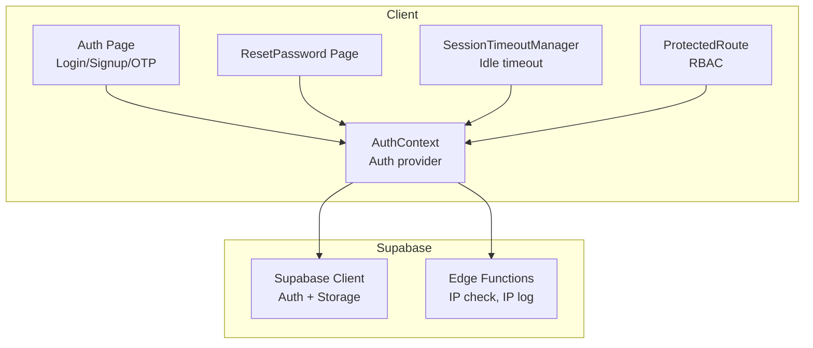
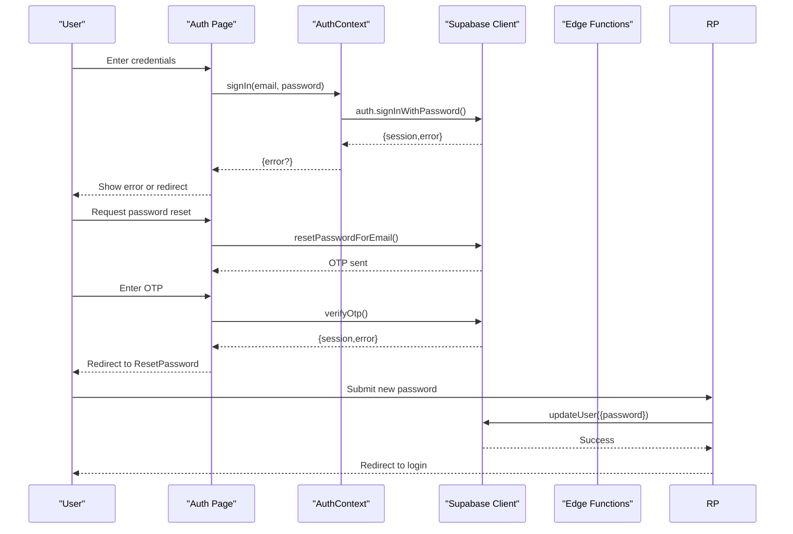
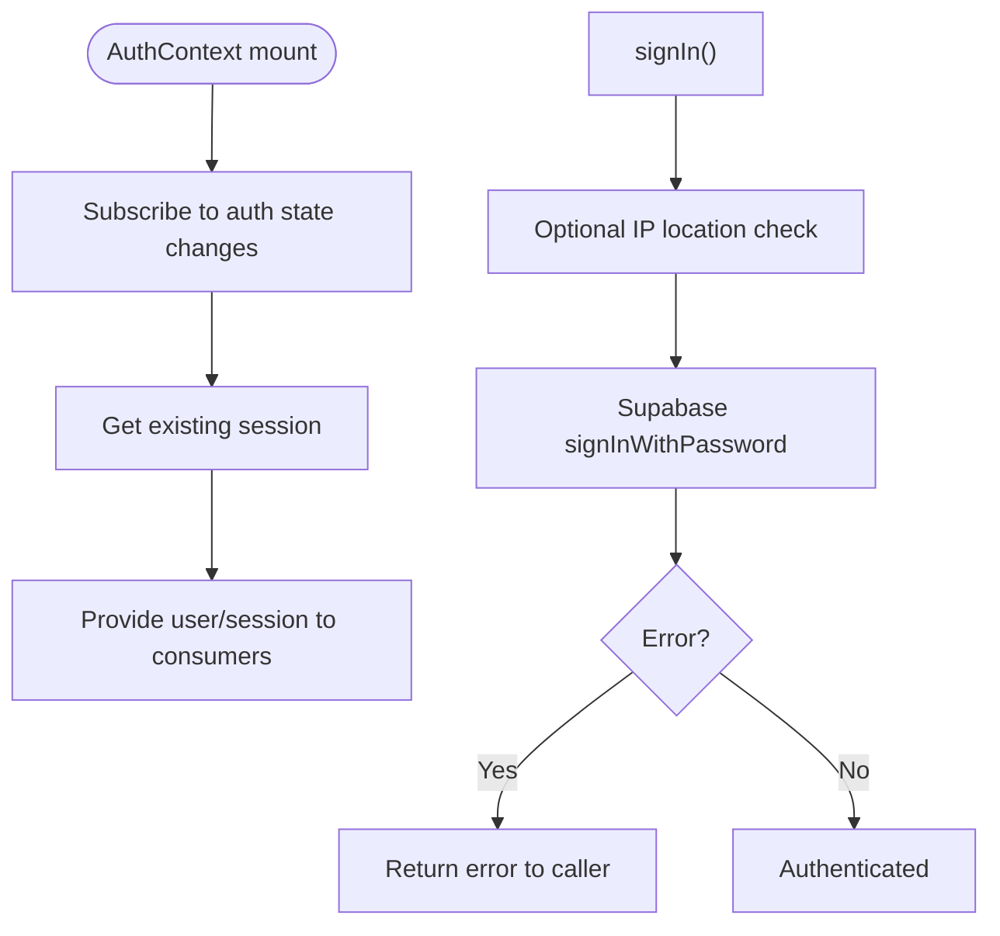
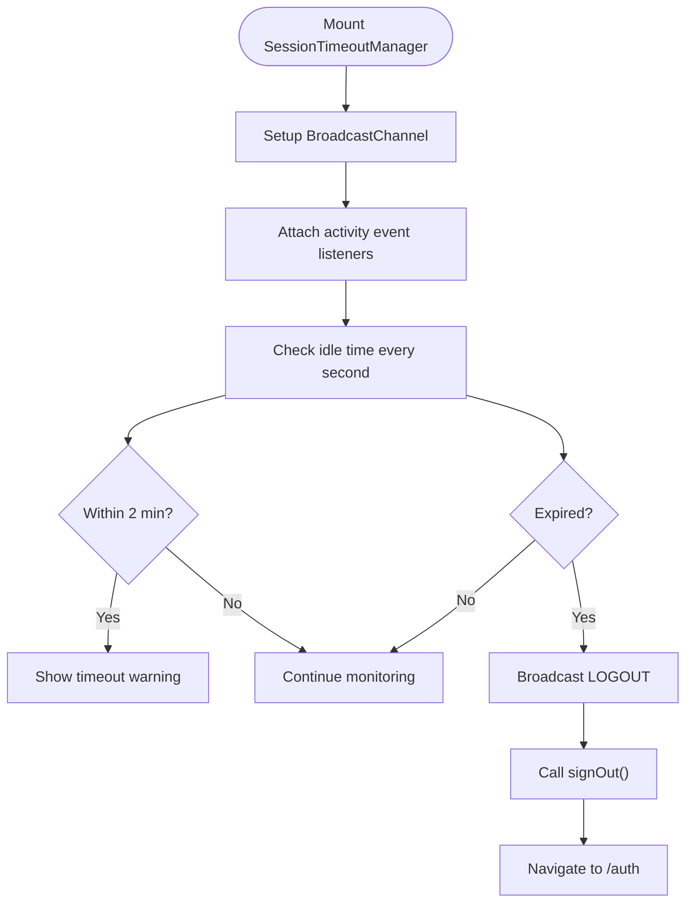
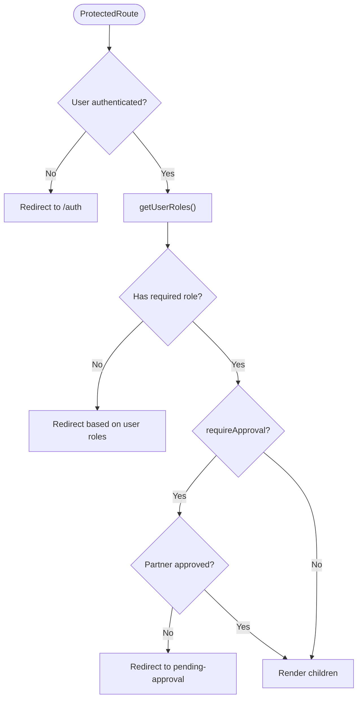
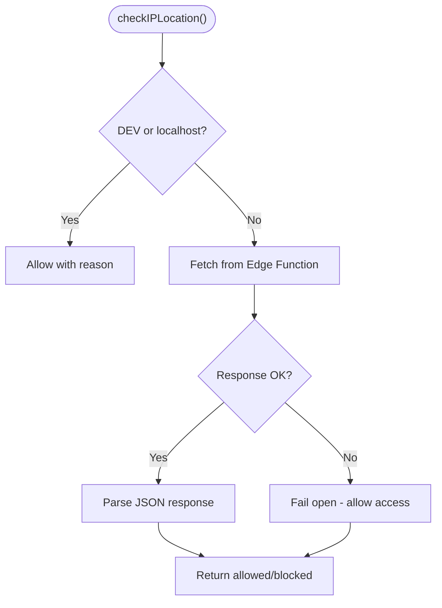
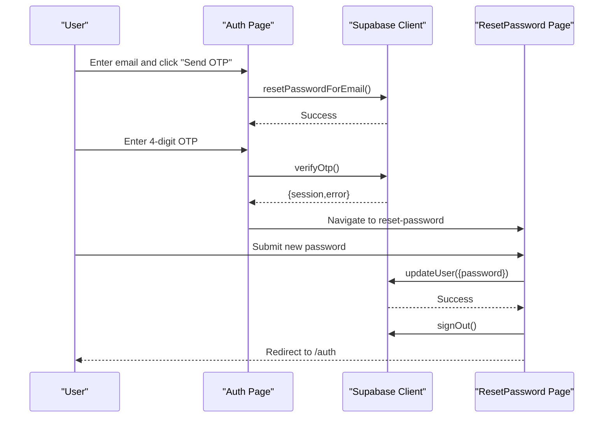
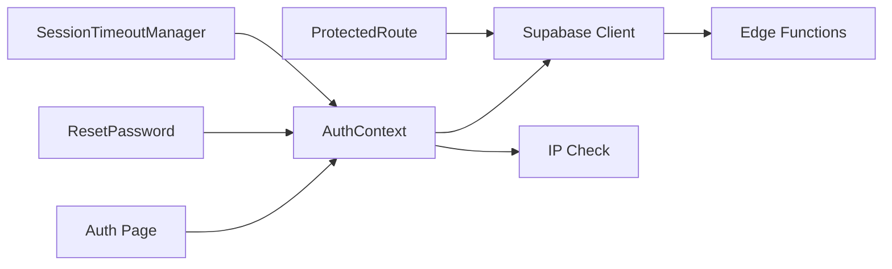

# Authentication Issues

<cite>
**Referenced Files in This Document**
- [AuthContext.tsx](file://src/contexts/AuthContext.tsx)
- [Auth.tsx](file://src/pages/Auth.tsx)
- [client.ts](file://src/integrations/supabase/client.ts)
- [SessionTimeoutManager.tsx](file://src/components/SessionTimeoutManager.tsx)
- [ProtectedRoute.tsx](file://src/components/ProtectedRoute.tsx)
- [ipCheck.ts](file://src/lib/ipCheck.ts)
- [ResetPassword.tsx](file://src/pages/ResetPassword.tsx)
- [auth.spec.ts](file://e2e/customer/auth.spec.ts)
- [auth-fixed.spec.ts](file://e2e/customer/auth-fixed.spec.ts)
- [config.toml](file://supabase/config.toml)
- [ci-cd.yml](file://.github/workflows/ci-cd.yml)
- [AGENTS.md](file://AGENTS.md)
- [INTEGRATIONS.md](file://.planning/codebase/INTEGRATIONS.md)
</cite>

## Table of Contents
1. [Introduction](#introduction)
2. [Project Structure](#project-structure)
3. [Core Components](#core-components)
4. [Architecture Overview](#architecture-overview)
5. [Detailed Component Analysis](#detailed-component-analysis)
6. [Dependency Analysis](#dependency-analysis)
7. [Performance Considerations](#performance-considerations)
8. [Troubleshooting Guide](#troubleshooting-guide)
9. [Conclusion](#conclusion)

## Introduction
This document provides comprehensive guidance for diagnosing and resolving authentication issues in the Nutrio application. It covers login failures (invalid credentials, account lockouts, rate limiting), session persistence (automatic logout, timeouts, token expiration), role-based access control (unauthorized portal access, permission denials), and password reset/email verification/two-factor authentication problems. It also documents environment-specific authentication behaviors across development, staging, and production.

## Project Structure
Authentication in Nutrio is implemented using Supabase Auth with a React context provider, custom hooks, and route protection. Key areas:
- Authentication context and provider manage user/session state and expose sign-in/sign-out functions
- Supabase client integrates with Capacitor preferences for native sessions
- Session timeout manager enforces idle timeouts and warns users
- ProtectedRoute enforces role-based access control and approval checks
- IP-based restrictions are enforced via a helper that can be toggled per environment
- Password reset flow includes OTP verification and secure password updates

**Diagram sources**
- [AuthContext.tsx:31-130](file://src/contexts/AuthContext.tsx#L31-L130)
- [client.ts:47-57](file://src/integrations/supabase/client.ts#L47-L57)
- [SessionTimeoutManager.tsx:47-317](file://src/components/SessionTimeoutManager.tsx#L47-L317)
- [ProtectedRoute.tsx:139-230](file://src/components/ProtectedRoute.tsx#L139-L230)
- [Auth.tsx:19-203](file://src/pages/Auth.tsx#L19-L203)
- [ResetPassword.tsx:19-73](file://src/pages/ResetPassword.tsx#L19-L73)
- [config.toml:30-34](file://supabase/config.toml#L30-L34)

**Section sources**
- [AuthContext.tsx:1-131](file://src/contexts/AuthContext.tsx#L1-L131)
- [client.ts:1-57](file://src/integrations/supabase/client.ts#L1-L57)
- [SessionTimeoutManager.tsx:1-344](file://src/components/SessionTimeoutManager.tsx#L1-L344)
- [ProtectedRoute.tsx:1-264](file://src/components/ProtectedRoute.tsx#L1-L264)
- [Auth.tsx:1-890](file://src/pages/Auth.tsx#L1-L890)
- [ResetPassword.tsx:1-272](file://src/pages/ResetPassword.tsx#L1-L272)
- [INTEGRATIONS.md:62-75](file://.planning/codebase/INTEGRATIONS.md#L62-L75)

## Core Components
- AuthContext: Centralizes authentication state, exposes sign-in/sign-up/sign-out, and listens to Supabase auth state changes. It also integrates IP location checks and initializes push notifications on native platforms.
- Supabase Client: Creates a Supabase client with Capacitor Preferences storage for native sessions and persistent auth state.
- SessionTimeoutManager: Enforces 30-minute idle timeout with a 2-minute warning, broadcasts activity/logout across tabs, and extends timeout during long operations.
- ProtectedRoute: Implements role-based access control with caching, approval checks for partner routes, and intelligent redirection based on user roles.
- IP Check Utility: Provides IP-based geo-restrictions with configurable behavior per environment.
- Auth Page: Handles login/signup, form validation, biometric login, forgot password, OTP entry, and redirects based on user roles.
- ResetPassword Page: Validates session, enforces password policies, and securely updates user passwords.

**Section sources**
- [AuthContext.tsx:31-130](file://src/contexts/AuthContext.tsx#L31-L130)
- [client.ts:18-57](file://src/integrations/supabase/client.ts#L18-L57)
- [SessionTimeoutManager.tsx:17-217](file://src/components/SessionTimeoutManager.tsx#L17-L217)
- [ProtectedRoute.tsx:33-230](file://src/components/ProtectedRoute.tsx#L33-L230)
- [ipCheck.ts:12-80](file://src/lib/ipCheck.ts#L12-L80)
- [Auth.tsx:117-203](file://src/pages/Auth.tsx#L117-L203)
- [ResetPassword.tsx:12-73](file://src/pages/ResetPassword.tsx#L12-L73)

## Architecture Overview
The authentication architecture combines client-side React components with Supabase Auth and Edge Functions for IP checks and logging.

**Diagram sources**
- [Auth.tsx:169-203](file://src/pages/Auth.tsx#L169-L203)
- [Auth.tsx:216-276](file://src/pages/Auth.tsx#L216-L276)
- [ResetPassword.tsx:57-73](file://src/pages/ResetPassword.tsx#L57-L73)
- [AuthContext.tsx:87-112](file://src/contexts/AuthContext.tsx#L87-L112)
- [client.ts:47-57](file://src/integrations/supabase/client.ts#L47-L57)

## Detailed Component Analysis

### Authentication Context and Provider
- Sets up Supabase auth state listener and retrieves existing session
- Exposes sign-up with redirect-to-dashboard and sign-in with optional IP blocking
- Clears remembered email on logout and initializes native push notifications

**Diagram sources**
- [AuthContext.tsx:36-112](file://src/contexts/AuthContext.tsx#L36-L112)

**Section sources**
- [AuthContext.tsx:31-130](file://src/contexts/AuthContext.tsx#L31-L130)

### Session Timeout Manager
- Enforces 30-minute idle timeout with a 2-minute warning
- Broadcasts activity/logout across browser tabs using BroadcastChannel
- Extends timeout during long operations via exposed control functions

**Diagram sources**
- [SessionTimeoutManager.tsx:17-217](file://src/components/SessionTimeoutManager.tsx#L17-L217)

**Section sources**
- [SessionTimeoutManager.tsx:1-344](file://src/components/SessionTimeoutManager.tsx#L1-L344)

### Protected Route and RBAC
- Fetches user roles from multiple sources and caches them
- Supports role hierarchy and approval checks for partner routes
- Redirects unauthorized users to appropriate portals or dashboard

**Diagram sources**
- [ProtectedRoute.tsx:139-230](file://src/components/ProtectedRoute.tsx#L139-L230)

**Section sources**
- [ProtectedRoute.tsx:1-264](file://src/components/ProtectedRoute.tsx#L1-L264)

### IP-Based Restrictions
- Provides IP location check with configurable behavior per environment
- Currently bypassed for E2E testing but can be re-enabled

**Diagram sources**
- [ipCheck.ts:19-80](file://src/lib/ipCheck.ts#L19-L80)
- [config.toml:30-34](file://supabase/config.toml#L30-L34)

**Section sources**
- [ipCheck.ts:12-80](file://src/lib/ipCheck.ts#L12-L80)
- [config.toml:30-34](file://supabase/config.toml#L30-L34)

### Password Reset and OTP Flow
- Sends OTP to registered email and validates 4-digit code
- Verifies OTP and redirects to reset password page
- Updates password securely and logs out user

**Diagram sources**
- [Auth.tsx:216-276](file://src/pages/Auth.tsx#L216-L276)
- [ResetPassword.tsx:57-73](file://src/pages/ResetPassword.tsx#L57-L73)

**Section sources**
- [Auth.tsx:216-292](file://src/pages/Auth.tsx#L216-L292)
- [ResetPassword.tsx:19-73](file://src/pages/ResetPassword.tsx#L19-L73)

## Dependency Analysis
- AuthContext depends on Supabase client and IP check utility
- Auth page depends on AuthContext and Supabase client for auth operations
- ProtectedRoute depends on Supabase client for role and approval checks
- SessionTimeoutManager depends on AuthContext for sign-out and navigation
- Edge functions (IP check, IP log) are configured in Supabase config

**Diagram sources**
- [AuthContext.tsx:1-131](file://src/contexts/AuthContext.tsx#L1-L131)
- [client.ts:1-57](file://src/integrations/supabase/client.ts#L1-L57)
- [ProtectedRoute.tsx:1-264](file://src/components/ProtectedRoute.tsx#L1-L264)
- [SessionTimeoutManager.tsx:1-344](file://src/components/SessionTimeoutManager.tsx#L1-L344)
- [config.toml:30-34](file://supabase/config.toml#L30-L34)

**Section sources**
- [AuthContext.tsx:1-131](file://src/contexts/AuthContext.tsx#L1-L131)
- [client.ts:1-57](file://src/integrations/supabase/client.ts#L1-L57)
- [ProtectedRoute.tsx:1-264](file://src/components/ProtectedRoute.tsx#L1-L264)
- [SessionTimeoutManager.tsx:1-344](file://src/components/SessionTimeoutManager.tsx#L1-L344)
- [config.toml:30-34](file://supabase/config.toml#L30-L34)

## Performance Considerations
- Role caching reduces repeated database queries in ProtectedRoute
- Session persistence and auto-refresh minimize redundant auth requests
- BroadcastChannel synchronization avoids redundant timers across tabs
- IP check failure is handled gracefully to prevent blocking legitimate users

[No sources needed since this section provides general guidance]

## Troubleshooting Guide

### Common Login Failures
- Invalid credentials
  - Symptoms: Error message indicating invalid login credentials
  - Causes: Incorrect email/password combination
  - Resolution: Verify credentials; ensure CAPS LOCK is off; check for typos
  - Evidence: Error handling in sign-in flow
  - Section sources
    - [Auth.tsx:174-183](file://src/pages/Auth.tsx#L174-L183)
    - [AuthContext.tsx:87-112](file://src/contexts/AuthContext.tsx#L87-L112)

- Account lockouts
  - Symptoms: Blocked access with message indicating IP has been blocked
  - Causes: IP-based restrictions or excessive failed attempts
  - Resolution: Check IP restriction configuration; wait for lockout to expire; contact support
  - Evidence: IP check logic and blocking behavior
  - Section sources
    - [AuthContext.tsx:89-100](file://src/contexts/AuthContext.tsx#L89-L100)
    - [ipCheck.ts:19-80](file://src/lib/ipCheck.ts#L19-L80)

- Rate limiting errors
  - Symptoms: Rate limit message in response body
  - Causes: Too many login attempts in a short period
  - Resolution: Wait for cooldown; reduce frequency of attempts; check network stability
  - Evidence: E2E test detection of rate limit messaging
  - Section sources
    - [auth-fixed.spec.ts:42-67](file://e2e/customer/auth-fixed.spec.ts#L42-L67)
    - [auth.spec.ts:159-162](file://e2e/customer/auth.spec.ts#L159-L162)

### Session Persistence Problems
- Automatic logout
  - Symptoms: Redirected to login after inactivity
  - Causes: 30-minute idle timeout reached
  - Resolution: Click "Stay Logged In" to extend; avoid long-running operations without extending
  - Evidence: Session timeout manager behavior
  - Section sources
    - [SessionTimeoutManager.tsx:18-217](file://src/components/SessionTimeoutManager.tsx#L18-L217)

- Session timeout warnings
  - Symptoms: Warning dialog appears 2 minutes before logout
  - Resolution: Interact with the app to reset idle timer; extend session when prompted
  - Evidence: Warning dialog and countdown logic
  - Section sources
    - [SessionTimeoutManager.tsx:260-314](file://src/components/SessionTimeoutManager.tsx#L260-L314)

- Token expiration
  - Symptoms: Auth state changes trigger re-authentication
  - Causes: Token refresh disabled or storage cleared
  - Resolution: Ensure persistSession and autoRefreshToken are enabled; check Capacitor storage on native
  - Evidence: Supabase client configuration
  - Section sources
    - [client.ts:50-57](file://src/integrations/supabase/client.ts#L50-L57)

### Role-Based Access Control Issues
- Unauthorized portal access
  - Symptoms: Redirected to incorrect portal or dashboard
  - Causes: Insufficient or mismatched roles
  - Resolution: Check user roles; ensure correct approval status for partner routes
  - Evidence: Role hierarchy and redirection logic
  - Section sources
    - [ProtectedRoute.tsx:139-230](file://src/components/ProtectedRoute.tsx#L139-L230)

- Permission denials
  - Symptoms: Access denied to protected routes
  - Causes: Required role not met or insufficient role level
  - Resolution: Verify user roles; use higher-level roles for broader access
  - Evidence: Role comparison and hierarchy
  - Section sources
    - [ProtectedRoute.tsx:103-119](file://src/components/ProtectedRoute.tsx#L103-L119)

### Password Reset, Email Verification, and Two-Factor Issues
- Password reset failures
  - Symptoms: Invalid/expired link or error during reset
  - Causes: Expired session or invalid reset link
  - Resolution: Request a new reset link; ensure OTP is entered correctly; verify email delivery
  - Evidence: ResetPassword page session validation and error handling
  - Section sources
    - [ResetPassword.tsx:31-43](file://src/pages/ResetPassword.tsx#L31-L43)
    - [ResetPassword.tsx:65-73](file://src/pages/ResetPassword.tsx#L65-L73)

- Email verification problems
  - Symptoms: Verification email not received or link invalid
  - Causes: Incorrect email, spam filters, or expired links
  - Resolution: Check spam/junk; request resend; ensure correct email is used
  - Evidence: Auth page OTP flow and resend logic
  - Section sources
    - [Auth.tsx:216-292](file://src/pages/Auth.tsx#L216-L292)

- Two-factor authentication issues
  - Symptoms: OTP not accepted or resend blocked
  - Causes: Wrong OTP length, expired code, or rate limits
  - Resolution: Enter 4-digit code; wait for cooldown before resending; verify device time
  - Evidence: OTP entry and countdown logic
  - Section sources
    - [Auth.tsx:205-214](file://src/pages/Auth.tsx#L205-L214)
    - [Auth.tsx:242-276](file://src/pages/Auth.tsx#L242-L276)

### Environment-Specific Authentication Issues
- Development
  - IP restrictions are bypassed for E2E testing; ensure proper environment variables are set
  - Section sources
    - [ipCheck.ts:19-31](file://src/lib/ipCheck.ts#L19-L31)
    - [AGENTS.md:110-118](file://AGENTS.md#L110-L118)

- Staging
  - Ensure Supabase environment variables are configured in CI/CD pipeline
  - Section sources
    - [ci-cd.yml:96-101](file://.github/workflows/ci-cd.yml#L96-L101)

- Production
  - Edge functions must be deployed and verify_jwt=false for IP check and logging functions
  - Section sources
    - [config.toml:30-34](file://supabase/config.toml#L30-L34)

## Conclusion
Nutrio’s authentication system leverages Supabase Auth with robust client-side state management, role-based access control, and session timeout enforcement. By understanding the components and their interactions, teams can effectively troubleshoot login failures, session persistence issues, RBAC problems, and password reset flows. Environment-specific configurations and CI/CD pipelines must be carefully maintained to ensure consistent behavior across development, staging, and production.