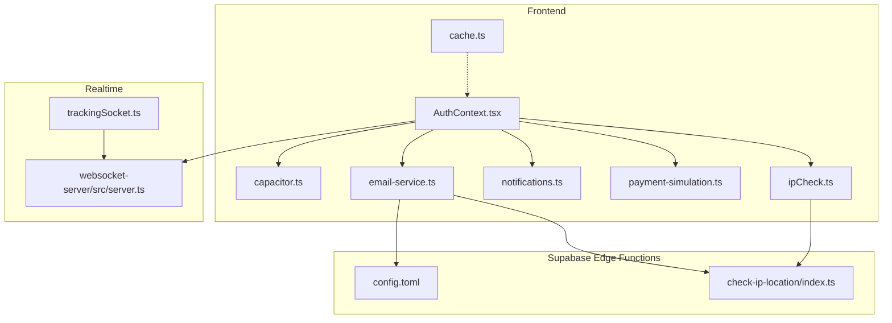
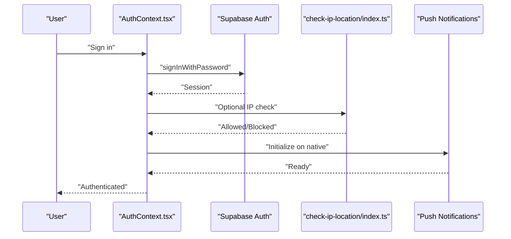
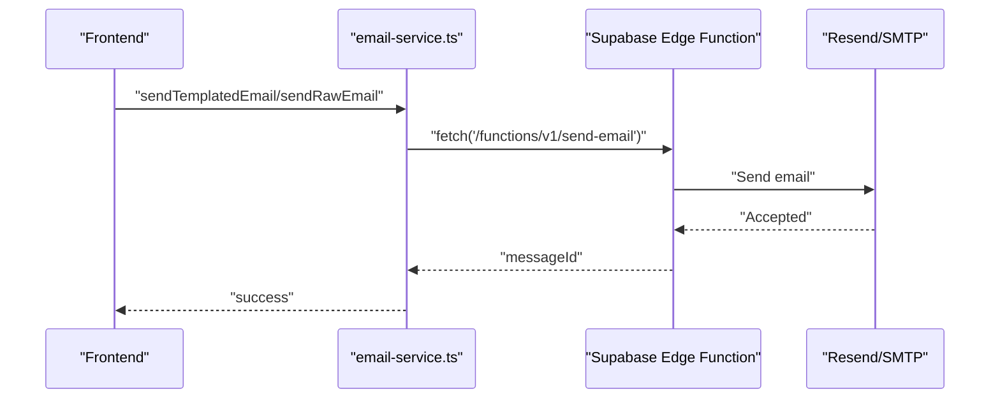
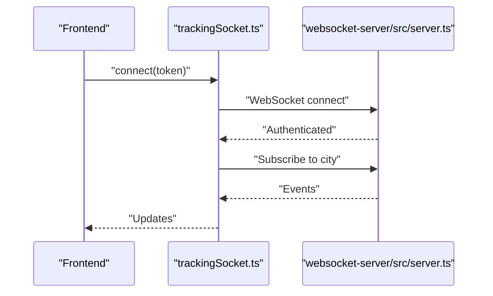
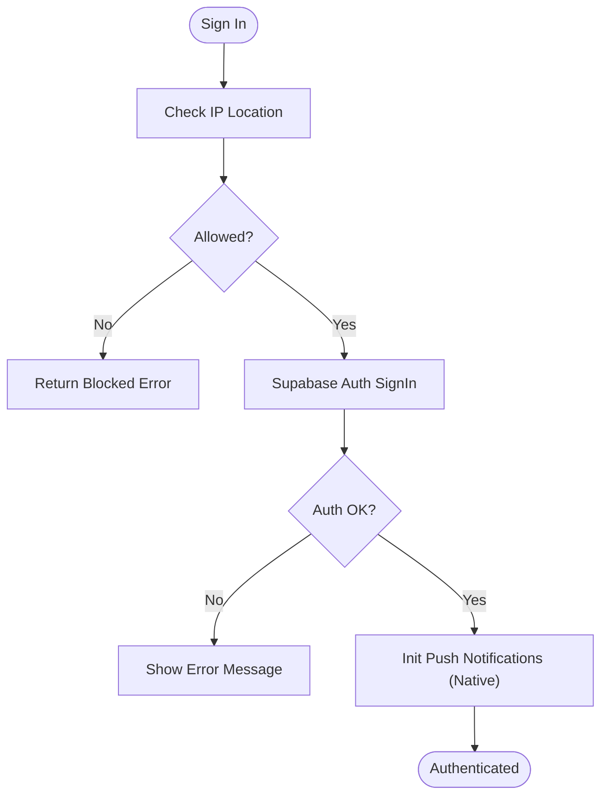
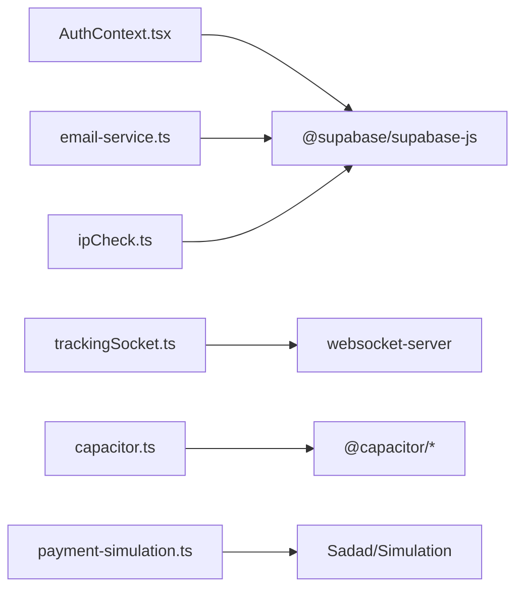

# Common Issues & Solutions

<cite>
**Referenced Files in This Document**
- [AuthContext.tsx](file://src/contexts/AuthContext.tsx)
- [capacitor.ts](file://src/lib/capacitor.ts)
- [email-service.ts](file://src/lib/email-service.ts)
- [notifications.ts](file://src/lib/notifications.ts)
- [payment-simulation.ts](file://src/lib/payment-simulation.ts)
- [ipCheck.ts](file://src/lib/ipCheck.ts)
- [check-ip-location/index.ts](file://supabase/functions/check-ip-location/index.ts)
- [config.toml](file://supabase/config.toml)
- [server.ts](file://websocket-server/src/server.ts)
- [trackingSocket.ts](file://src/fleet/services/trackingSocket.ts)
- [auth.spec.ts](file://e2e/admin/auth.spec.ts)
- [auth-fixed.spec.ts](file://e2e/customer/auth-fixed.spec.ts)
- [auth.spec.ts](file://e2e/customer/auth.spec.ts)
- [realtime.spec.ts](file://e2e/system/realtime.spec.ts)
- [cache.ts](file://src/lib/cache.ts)
- [package.json](file://package.json)
- [check-env.js](file://check-env.js)
- [check-env.mjs](file://check-env.mjs)
- [deploy.mjs](file://deploy.mjs)
</cite>

## Table of Contents
1. [Introduction](#introduction)
2. [Project Structure](#project-structure)
3. [Core Components](#core-components)
4. [Architecture Overview](#architecture-overview)
5. [Detailed Component Analysis](#detailed-component-analysis)
6. [Dependency Analysis](#dependency-analysis)
7. [Performance Considerations](#performance-considerations)
8. [Troubleshooting Guide](#troubleshooting-guide)
9. [Conclusion](#conclusion)

## Introduction
This document consolidates common issues and their solutions for the Nutrio application across authentication, database connectivity, mobile app stability, payment processing, notifications, and real-time features. It includes specific error symptoms, probable causes, and step-by-step resolutions, with environment-specific guidance for development, staging, and production.

## Project Structure
The application follows a React frontend with Capacitor for native capabilities, Supabase for authentication and edge functions, and a separate WebSocket server for real-time features. Key areas relevant to troubleshooting:
- Authentication and session management in the frontend AuthContext
- Mobile native feature wrappers and platform detection
- Email delivery via Supabase Edge Functions
- Notification persistence and delivery helpers
- Payment simulation service for testing
- IP geoblocking and logging edge functions
- WebSocket server and client-side tracking socket
- E2E tests covering auth, session timeout, and real-time behavior
- Environment configuration and deployment scripts

**Diagram sources**
- [AuthContext.tsx:1-131](file://src/contexts/AuthContext.tsx#L1-L131)
- [capacitor.ts:1-244](file://src/lib/capacitor.ts#L1-L244)
- [email-service.ts:1-173](file://src/lib/email-service.ts#L1-L173)
- [notifications.ts:1-114](file://src/lib/notifications.ts#L1-L114)
- [payment-simulation.ts:1-200](file://src/lib/payment-simulation.ts#L1-L200)
- [ipCheck.ts:1-107](file://src/lib/ipCheck.ts#L1-L107)
- [check-ip-location/index.ts:1-107](file://supabase/functions/check-ip-location/index.ts#L1-L107)
- [config.toml:1-59](file://supabase/config.toml#L1-L59)
- [server.ts:27-76](file://websocket-server/src/server.ts#L27-L76)
- [trackingSocket.ts:36-214](file://src/fleet/services/trackingSocket.ts#L36-L214)
- [cache.ts:47-99](file://src/lib/cache.ts#L47-L99)

**Section sources**
- [AuthContext.tsx:1-131](file://src/contexts/AuthContext.tsx#L1-L131)
- [capacitor.ts:1-244](file://src/lib/capacitor.ts#L1-L244)
- [email-service.ts:1-173](file://src/lib/email-service.ts#L1-L173)
- [notifications.ts:1-114](file://src/lib/notifications.ts#L1-L114)
- [payment-simulation.ts:1-200](file://src/lib/payment-simulation.ts#L1-L200)
- [ipCheck.ts:1-107](file://src/lib/ipCheck.ts#L1-L107)
- [check-ip-location/index.ts:1-107](file://supabase/functions/check-ip-location/index.ts#L1-L107)
- [config.toml:1-59](file://supabase/config.toml#L1-L59)
- [server.ts:27-76](file://websocket-server/src/server.ts#L27-L76)
- [trackingSocket.ts:36-214](file://src/fleet/services/trackingSocket.ts#L36-L214)
- [cache.ts:47-99](file://src/lib/cache.ts#L47-L99)

## Core Components
- Authentication and session lifecycle: centralized in AuthContext with Supabase auth state listener, IP geoblocking checks, and push notification initialization on native platforms.
- Mobile native integration: Capacitor wrapper with platform detection and graceful fallbacks for web.
- Email delivery: Edge function invocation via fetch with bearer token and JSON payload.
- Notifications: Supabase insert helper and convenience functions for order/driver delivery events.
- Payment simulation: Configurable service simulating payment creation, 3D Secure, and outcomes.
- IP geoblocking: Edge function checks and client-side bypass for testing, with fail-open/fail-close policies.
- Real-time: WebSocket server with JWT auth, Redis adapter, and client-side reconnect logic.
- Caching: Redis-backed cache with memory fallback and pattern invalidation.

**Section sources**
- [AuthContext.tsx:31-130](file://src/contexts/AuthContext.tsx#L31-L130)
- [capacitor.ts:27-43](file://src/lib/capacitor.ts#L27-L43)
- [email-service.ts:50-84](file://src/lib/email-service.ts#L50-L84)
- [notifications.ts:18-114](file://src/lib/notifications.ts#L18-L114)
- [payment-simulation.ts:25-200](file://src/lib/payment-simulation.ts#L25-L200)
- [ipCheck.ts:19-107](file://src/lib/ipCheck.ts#L19-L107)
- [check-ip-location/index.ts:7-107](file://supabase/functions/check-ip-location/index.ts#L7-L107)
- [server.ts:37-76](file://websocket-server/src/server.ts#L37-L76)
- [trackingSocket.ts:36-214](file://src/fleet/services/trackingSocket.ts#L36-L214)
- [cache.ts:47-99](file://src/lib/cache.ts#L47-L99)

## Architecture Overview
High-level flows for authentication, email, notifications, payments, IP checks, and real-time features.

**Diagram sources**
- [AuthContext.tsx:87-112](file://src/contexts/AuthContext.tsx#L87-L112)
- [check-ip-location/index.ts:20-107](file://supabase/functions/check-ip-location/index.ts#L20-L107)

**Diagram sources**
- [email-service.ts:50-84](file://src/lib/email-service.ts#L50-L84)

**Diagram sources**
- [trackingSocket.ts:36-80](file://src/fleet/services/trackingSocket.ts#L36-L80)
- [server.ts:65-76](file://websocket-server/src/server.ts#L65-L76)

## Detailed Component Analysis

### Authentication and Session Management
Common issues:
- Login failures due to IP geoblocking or edge function errors
- Session expiration and redirects
- Role-based access control (RBAC) mismatches

Symptoms and causes:
- Login returns an error indicating blocked IP or edge function failure
- After inactivity, navigation to protected routes triggers redirect to auth
- Access to admin/partner routes denied due to mismatched roles

Resolution steps:
- Verify IP geoblocking is configured correctly and not blocking legitimate users
- Confirm Supabase auth state listener is initialized and session retrieval succeeds
- Ensure JWT secrets and roles are correctly set in edge functions
- Validate RBAC logic in frontend routes and backend policies

**Diagram sources**
- [AuthContext.tsx:87-112](file://src/contexts/AuthContext.tsx#L87-L112)
- [ipCheck.ts:19-80](file://src/lib/ipCheck.ts#L19-L80)
- [check-ip-location/index.ts:20-107](file://supabase/functions/check-ip-location/index.ts#L20-L107)

**Section sources**
- [AuthContext.tsx:36-118](file://src/contexts/AuthContext.tsx#L36-L118)
- [ipCheck.ts:19-107](file://src/lib/ipCheck.ts#L19-L107)
- [check-ip-location/index.ts:20-107](file://supabase/functions/check-ip-location/index.ts#L20-L107)
- [auth.spec.ts:156-169](file://e2e/admin/auth.spec.ts#L156-L169)
- [auth-fixed.spec.ts:40-67](file://e2e/customer/auth-fixed.spec.ts#L40-L67)

### Database Connectivity and Edge Functions
Common issues:
- Edge function timeouts and intermittent failures
- Row-level security (RLS) violations
- Data synchronization inconsistencies

Symptoms and causes:
- Edge function requests fail with timeouts or non-200 responses
- Supabase queries return permission errors due to RLS policies
- Real-time subscriptions not receiving updates

Resolution steps:
- Review Supabase config for JWT verification toggles and adjust as needed
- Validate RLS policies and test with dedicated test users
- Monitor edge function execution logs and optimize slow queries
- Ensure WebSocket server is reachable and Redis adapter is configured

**Section sources**
- [config.toml:1-59](file://supabase/config.toml#L1-L59)
- [server.ts:37-76](file://websocket-server/src/server.ts#L37-L76)
- [test-results-full.json:562-589](file://test-results-full.json#L562-L589)

### Mobile App Crashes and Capacitor Plugins
Common issues:
- Crashes when accessing native features in web browser
- Plugin initialization failures on iOS/Android
- Offline storage and preferences migration issues

Symptoms and causes:
- Errors when calling native plugin APIs from web context
- Platform detection not working as expected
- Storage migration leaving orphaned keys

Resolution steps:
- Guard all native plugin calls with platform checks
- Initialize plugins only on native platforms
- Use Capacitor’s Preferences and Storage safely with proper fallbacks
- Run storage migration once and clean old keys

**Section sources**
- [capacitor.ts:27-43](file://src/lib/capacitor.ts#L27-L43)
- [capacitor.ts:49-244](file://src/lib/capacitor.ts#L49-L244)

### Payment Processing Failures
Common issues:
- Payment simulation timeouts and random failures
- 3D Secure verification errors
- Payment status inconsistencies

Symptoms and causes:
- Payment creation returns pending but never progresses
- 3D Secure OTP validation fails unexpectedly
- Payment outcomes not persisted consistently

Resolution steps:
- Adjust simulation config for success rate and delays
- Validate 3D Secure OTP format and timing
- Use forced outcomes for testing and ensure completion timestamps
- Subscribe to payment updates and handle retries gracefully

**Section sources**
- [payment-simulation.ts:25-200](file://src/lib/payment-simulation.ts#L25-L200)

### Notification Delivery Issues
Common issues:
- Email delivery failures via edge function
- Notification persistence errors
- Push/local notification initialization failures

Symptoms and causes:
- Email send returns error or non-200 status
- Notification inserts fail with database errors
- Push notifications not registering on native devices

Resolution steps:
- Verify Supabase function endpoint and bearer token
- Check function logs for runtime errors
- Ensure notification metadata is valid and not exceeding limits
- Initialize push notifications only on native platforms

**Section sources**
- [email-service.ts:50-84](file://src/lib/email-service.ts#L50-L84)
- [notifications.ts:18-35](file://src/lib/notifications.ts#L18-L35)
- [AuthContext.tsx:44-50](file://src/contexts/AuthContext.tsx#L44-L50)

### Real-Time Feature Problems
Common issues:
- WebSocket connection drops and reconnect loops
- City subscription not receiving updates
- Authentication token validation failures

Symptoms and causes:
- Frequent onclose events and exponential backoff
- Subscriptions not applied after reconnect
- JWT verification errors on handshake

Resolution steps:
- Validate JWT secret and token format
- Configure Redis adapter and connection limits
- Implement client-side reconnection with jitter and max attempts
- Ensure subscriptions are flushed after reconnect

**Section sources**
- [server.ts:65-76](file://websocket-server/src/server.ts#L65-L76)
- [trackingSocket.ts:36-214](file://src/fleet/services/trackingSocket.ts#L36-L214)

## Dependency Analysis
Key dependencies and their roles in troubleshooting:
- Supabase client and edge functions for auth, IP checks, and email
- Capacitor plugins for native features with web fallbacks
- WebSocket server with Redis adapter for real-time updates
- Sentry and PostHog for observability (environment-dependent)

**Diagram sources**
- [AuthContext.tsx:1-131](file://src/contexts/AuthContext.tsx#L1-L131)
- [email-service.ts:1-173](file://src/lib/email-service.ts#L1-L173)
- [ipCheck.ts:1-107](file://src/lib/ipCheck.ts#L1-L107)
- [trackingSocket.ts:36-214](file://src/fleet/services/trackingSocket.ts#L36-L214)
- [capacitor.ts:1-244](file://src/lib/capacitor.ts#L1-L244)
- [payment-simulation.ts:1-200](file://src/lib/payment-simulation.ts#L1-L200)

**Section sources**
- [package.json:44-126](file://package.json#L44-L126)

## Performance Considerations
- Database and edge function performance: monitor execution times and optimize queries; ensure indexes and connection pooling are configured
- Real-time scalability: use Redis adapter, horizontal scaling, and sticky sessions; tune ping intervals and buffer sizes
- Mobile app responsiveness: avoid synchronous operations in native bridges; batch plugin calls
- Caching strategy: leverage Redis with TTL and memory fallback; invalidate patterns carefully

[No sources needed since this section provides general guidance]

## Troubleshooting Guide

### Authentication and Session
- Symptom: Login fails with IP blocked message
  - Cause: IP geoblocking edge function denies access
  - Resolution: Check IP function configuration and bypass only for testing; verify Supabase auth state listener initialization
  - References: [AuthContext.tsx:87-112](file://src/contexts/AuthContext.tsx#L87-L112), [check-ip-location/index.ts:20-107](file://supabase/functions/check-ip-location/index.ts#L20-L107)

- Symptom: Redirect to login after inactivity
  - Cause: Session timeout or missing auth state
  - Resolution: Implement session timeout handling and ensure auth listener runs before session retrieval
  - References: [auth.spec.ts:156-169](file://e2e/admin/auth.spec.ts#L156-L169), [auth-fixed.spec.ts:40-67](file://e2e/customer/auth-fixed.spec.ts#L40-L67)

- Symptom: Role-based access denied
  - Cause: JWT role mismatch or policy violation
  - Resolution: Verify JWT claims and Supabase RLS policies; test with appropriate user roles
  - References: [server.ts:65-76](file://websocket-server/src/server.ts#L65-L76)

### Database and Edge Functions
- Symptom: Edge function timeouts
  - Cause: Slow queries or cold starts
  - Resolution: Optimize queries, add indexes, enable connection pooling, and monitor function logs
  - References: [config.toml:1-59](file://supabase/config.toml#L1-L59)

- Symptom: Row-level security violations
  - Cause: Policy mismatch or incorrect user context
  - Resolution: Validate RLS policies and test with dedicated users; review test results for failures
  - References: [test-results-full.json:562-589](file://test-results-full.json#L562-L589)

### Mobile App and Capacitor
- Symptom: Crashes when calling native plugins in browser
  - Cause: Calling native APIs from web context
  - Resolution: Guard with platform checks and use web-safe fallbacks
  - References: [capacitor.ts:27-43](file://src/lib/capacitor.ts#L27-L43)

- Symptom: Storage migration issues
  - Cause: Orphaned keys after migration
  - Resolution: Run migration once and clean old keys; verify prefix handling
  - References: [capacitor.ts:27-43](file://src/lib/capacitor.ts#L27-L43)

### Payment Processing
- Symptom: Payment simulation timeouts or random failures
  - Cause: Artificial delays and randomized outcomes
  - Resolution: Adjust simulation config; use forced outcomes for testing; subscribe to updates
  - References: [payment-simulation.ts:25-200](file://src/lib/payment-simulation.ts#L25-L200)

### Notifications and Emails
- Symptom: Email delivery fails
  - Cause: Edge function error or invalid token
  - Resolution: Verify endpoint, bearer token, and function logs; retry on non-200 responses
  - References: [email-service.ts:50-84](file://src/lib/email-service.ts#L50-L84)

- Symptom: Notification persistence errors
  - Cause: Database insert errors or invalid metadata
  - Resolution: Validate notification data and handle errors gracefully
  - References: [notifications.ts:18-35](file://src/lib/notifications.ts#L18-L35)

### Real-Time Features
- Symptom: WebSocket disconnects and reconnect loops
  - Cause: Authentication errors or network instability
  - Resolution: Validate JWT, configure Redis adapter, and implement robust reconnection
  - References: [server.ts:65-76](file://websocket-server/src/server.ts#L65-L76), [trackingSocket.ts:36-214](file://src/fleet/services/trackingSocket.ts#L36-L214)

### Environment-Specific Fixes
- Development
  - Ensure local environment variables are present; run tests before building
  - References: [check-env.js:1-53](file://check-env.js#L1-L53), [check-env.mjs:1-51](file://check-env.mjs#L1-L51)

- Staging
  - Validate optional variables (Sentry, PostHog) and run pre-deployment checks
  - References: [deploy.mjs:1-90](file://deploy.mjs#L1-L90)

- Production
  - Critical variables must be set; run tests and build successfully
  - References: [deploy.mjs:17-33](file://deploy.mjs#L17-L33), [check-env.js:31-49](file://check-env.js#L31-L49)

**Section sources**
- [AuthContext.tsx:87-118](file://src/contexts/AuthContext.tsx#L87-L118)
- [check-ip-location/index.ts:20-107](file://supabase/functions/check-ip-location/index.ts#L20-L107)
- [auth.spec.ts:156-169](file://e2e/admin/auth.spec.ts#L156-L169)
- [auth-fixed.spec.ts:40-67](file://e2e/customer/auth-fixed.spec.ts#L40-L67)
- [config.toml:1-59](file://supabase/config.toml#L1-L59)
- [test-results-full.json:562-589](file://test-results-full.json#L562-L589)
- [capacitor.ts:27-43](file://src/lib/capacitor.ts#L27-L43)
- [payment-simulation.ts:25-200](file://src/lib/payment-simulation.ts#L25-L200)
- [email-service.ts:50-84](file://src/lib/email-service.ts#L50-L84)
- [notifications.ts:18-35](file://src/lib/notifications.ts#L18-L35)
- [server.ts:65-76](file://websocket-server/src/server.ts#L65-L76)
- [trackingSocket.ts:36-214](file://src/fleet/services/trackingSocket.ts#L36-L214)
- [check-env.js:31-49](file://check-env.js#L31-L49)
- [check-env.mjs:29-51](file://check-env.mjs#L29-L51)
- [deploy.mjs:17-33](file://deploy.mjs#L17-L33)

## Conclusion
This guide consolidates actionable steps to resolve common issues across authentication, database connectivity, mobile app stability, payment processing, notifications, and real-time features. Use the referenced files and sections to validate configurations, implement safeguards, and follow environment-specific deployment and verification procedures.