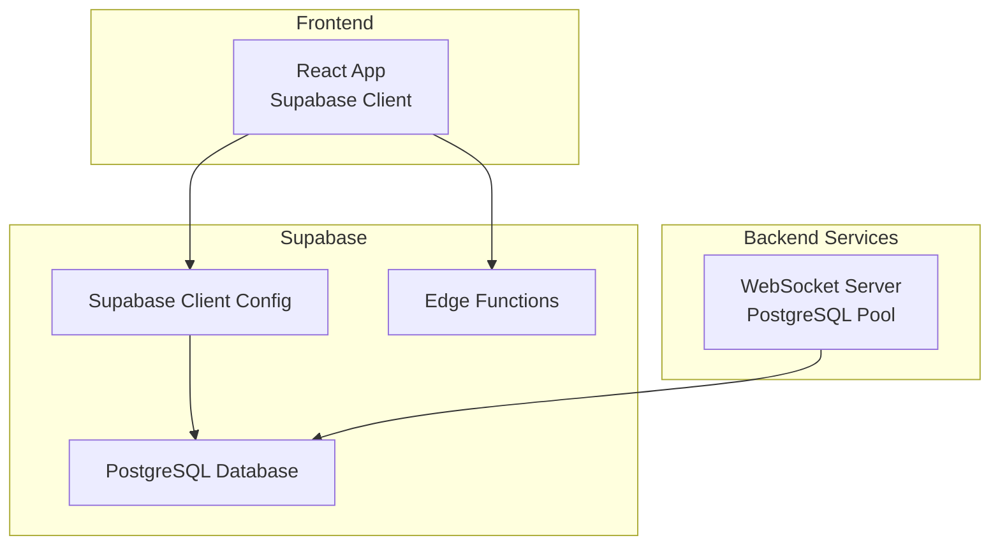
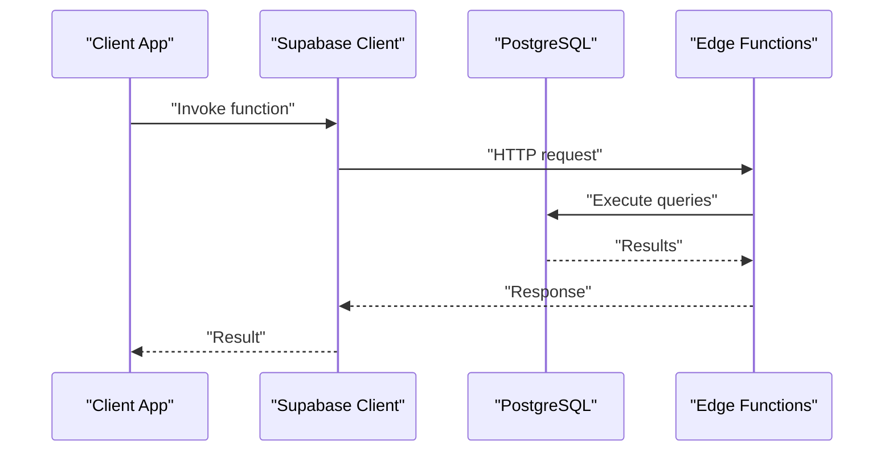
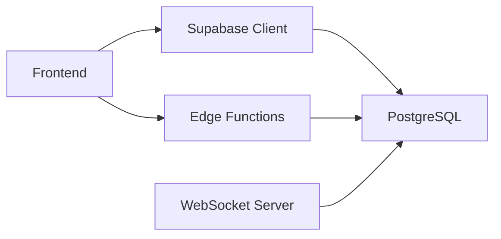

# Database & Edge Function Issues

<cite>
**Referenced Files in This Document**
- [client.ts](file://src/integrations/supabase/client.ts)
- [delivery.ts](file://src/integrations/supabase/delivery.ts)
- [types.ts](file://src/integrations/supabase/types.ts)
- [PHASE2_EDGE_FUNCTIONS.md](file://supabase/functions/PHASE2_EDGE_FUNCTIONS.md)
- [20260226000008_fix_rls_and_security_issues.sql](file://supabase/migrations/20260226000008_fix_rls_and_security_issues.sql)
- [20260226_create_whatsapp_processor_trigger.sql](file://supabase/migrations/20260226_create_whatsapp_processor_trigger.sql)
- [edge.spec.ts](file://e2e/system/edge.spec.ts)
- [errors.spec.ts](file://e2e/system/errors.spec.ts)
- [load-test-config.yml](file://tests/load-test-config.yml)
- [performance-benchmark.ts](file://scripts/performance-benchmark.ts)
- [dbHelper.ts](file://websocket-server/src/handlers/dbHelper.ts)
</cite>

## Table of Contents
1. [Introduction](#introduction)
2. [Project Structure](#project-structure)
3. [Core Components](#core-components)
4. [Architecture Overview](#architecture-overview)
5. [Detailed Component Analysis](#detailed-component-analysis)
6. [Dependency Analysis](#dependency-analysis)
7. [Performance Considerations](#performance-considerations)
8. [Troubleshooting Guide](#troubleshooting-guide)
9. [Conclusion](#conclusion)

## Introduction
This document focuses on database connectivity and edge function issues in the Nutrio application. It covers edge function timeouts, cold start delays, and execution errors; row-level security violations and permission errors; database connection problems including SSL and network timeouts; and query performance bottlenecks. It also provides troubleshooting steps for migration failures, schema inconsistencies, and data synchronization issues, along with monitoring and debugging approaches for both edge functions and database operations.

## Project Structure
The database and edge function concerns span several areas:
- Supabase client configuration and typed database access
- Delivery system API integration using Supabase
- Supabase edge functions documentation and deployment
- Database migrations addressing security and scheduling
- End-to-end system tests for edge and error handling
- Load testing and performance benchmarking configurations
- WebSocket server database helpers for PostgreSQL connections

**Diagram sources**
- [client.ts:1-57](file://src/integrations/supabase/client.ts#L1-L57)
- [delivery.ts:1-735](file://src/integrations/supabase/delivery.ts#L1-L735)
- [PHASE2_EDGE_FUNCTIONS.md:1-411](file://supabase/functions/PHASE2_EDGE_FUNCTIONS.md#L1-L411)

**Section sources**
- [client.ts:1-57](file://src/integrations/supabase/client.ts#L1-L57)
- [delivery.ts:1-735](file://src/integrations/supabase/delivery.ts#L1-L735)
- [PHASE2_EDGE_FUNCTIONS.md:1-411](file://supabase/functions/PHASE2_EDGE_FUNCTIONS.md#L1-L411)

## Core Components
- Supabase client initialization with environment validation and session persistence
- Delivery system API functions interacting with multiple tables and real-time channels
- Edge functions for auto-assignment and invoice email automation
- Database migrations enforcing row-level security and scheduling triggers
- WebSocket server database helpers managing connection pooling and transactions
- System tests validating edge function behavior and error handling

**Section sources**
- [client.ts:1-57](file://src/integrations/supabase/client.ts#L1-L57)
- [delivery.ts:1-735](file://src/integrations/supabase/delivery.ts#L1-L735)
- [PHASE2_EDGE_FUNCTIONS.md:1-411](file://supabase/functions/PHASE2_EDGE_FUNCTIONS.md#L1-L411)
- [20260226000008_fix_rls_and_security_issues.sql:232-251](file://supabase/migrations/20260226000008_fix_rls_and_security_issues.sql#L232-L251)
- [20260226_create_whatsapp_processor_trigger.sql:34-46](file://supabase/migrations/20260226_create_whatsapp_processor_trigger.sql#L34-L46)
- [dbHelper.ts:49-203](file://websocket-server/src/handlers/dbHelper.ts#L49-L203)

## Architecture Overview
The system integrates a React frontend with Supabase for authentication, database access, and edge functions. The delivery system uses Supabase queries and real-time channels. The WebSocket server maintains a PostgreSQL connection pool for driver location persistence. Edge functions automate tasks like driver assignment and invoice emails, with scheduled triggers and logging.

**Diagram sources**
- [PHASE2_EDGE_FUNCTIONS.md:224-254](file://supabase/functions/PHASE2_EDGE_FUNCTIONS.md#L224-L254)
- [delivery.ts:695-734](file://src/integrations/supabase/delivery.ts#L695-L734)

## Detailed Component Analysis

### Supabase Client and Database Access
- Environment validation prevents crashes when configuration is missing
- Session persistence and token refresh improve reliability
- Typed database access ensures compile-time safety for table operations

Key behaviors:
- Missing environment variables are logged and the client is initialized with placeholders
- Capacitor storage adapter persists sessions on native platforms
- Supabase client is reused across delivery API functions

**Section sources**
- [client.ts:7-16](file://src/integrations/supabase/client.ts#L7-L16)
- [client.ts:18-42](file://src/integrations/supabase/client.ts#L18-L42)
- [client.ts:47-57](file://src/integrations/supabase/client.ts#L47-L57)

### Delivery System API Integration
- Driver online/offline status updates
- Location tracking with history insertion
- Job assignment logic with distance/rating prioritization
- Real-time subscriptions for delivery and driver location updates

Common error patterns:
- PGRST116: "No rows affected" when querying single records that do not exist
- Thrown errors bubble up for immediate handling

**Section sources**
- [delivery.ts:11-25](file://src/integrations/supabase/delivery.ts#L11-L25)
- [delivery.ts:50-82](file://src/integrations/supabase/delivery.ts#L50-L82)
- [delivery.ts:174-235](file://src/integrations/supabase/delivery.ts#L174-L235)
- [delivery.ts:418-419](file://src/integrations/supabase/delivery.ts#L418-L419)
- [delivery.ts:695-734](file://src/integrations/supabase/delivery.ts#L695-L734)

### Edge Functions: Auto-Assign Driver and Invoice Email
- Environment variables required for Supabase URL, service role key, and Resend API key
- Comprehensive error handling: missing credentials, validation, not found, service unavailable, rate limiting
- Deployment via Supabase CLI with individual or bulk deployment
- Monitoring through function logs and database logging tables

Operational triggers:
- Database triggers using pg_net to call functions on delivery creation
- Scheduled cron jobs to periodically process pending deliveries

**Section sources**
- [PHASE2_EDGE_FUNCTIONS.md:10-21](file://supabase/functions/PHASE2_EDGE_FUNCTIONS.md#L10-L21)
- [PHASE2_EDGE_FUNCTIONS.md:325-334](file://supabase/functions/PHASE2_EDGE_FUNCTIONS.md#L325-L334)
- [PHASE2_EDGE_FUNCTIONS.md:258-302](file://supabase/functions/PHASE2_EDGE_FUNCTIONS.md#L258-L302)
- [PHASE2_EDGE_FUNCTIONS.md:337-351](file://supabase/functions/PHASE2_EDGE_FUNCTIONS.md#L337-L351)

### Database Migrations and Security
- Row-level security policies refined for admin-only access to sensitive tables
- Scheduling infrastructure for edge functions when pg_cron is unavailable
- Audit trails and comments for compliance and maintainability

**Section sources**
- [20260226000008_fix_rls_and_security_issues.sql:232-251](file://supabase/migrations/20260226000008_fix_rls_and_security_issues.sql#L232-L251)
- [20260226_create_whatsapp_processor_trigger.sql:34-46](file://supabase/migrations/20260226_create_whatsapp_processor_trigger.sql#L34-L46)

### WebSocket Server Database Helpers
- Connection pooling with acquire/release lifecycle
- Transaction boundaries for atomic writes
- Structured error logging and resource cleanup

**Section sources**
- [dbHelper.ts:49-203](file://websocket-server/src/handlers/dbHelper.ts#L49-L203)

### System Tests: Edge and Error Handling
- Edge function behavior tests (auto-assign, reminders, IP check, health score, image analysis)
- Error handling tests (404/500 pages, network disconnection)

**Section sources**
- [edge.spec.ts:1-83](file://e2e/system/edge.spec.ts#L1-L83)
- [errors.spec.ts:1-98](file://e2e/system/errors.spec.ts#L1-L98)

## Dependency Analysis
The system exhibits clear separation of concerns:
- Frontend depends on Supabase client for authentication and data access
- Delivery APIs encapsulate database operations and real-time subscriptions
- Edge functions depend on Supabase service role keys and external services
- WebSocket server manages its own PostgreSQL pool independently
- Migrations enforce security and operational scheduling

**Diagram sources**
- [client.ts:1-57](file://src/integrations/supabase/client.ts#L1-L57)
- [delivery.ts:1-735](file://src/integrations/supabase/delivery.ts#L1-L735)
- [PHASE2_EDGE_FUNCTIONS.md:1-411](file://supabase/functions/PHASE2_EDGE_FUNCTIONS.md#L1-L411)
- [dbHelper.ts:49-203](file://websocket-server/src/handlers/dbHelper.ts#L49-L203)

## Performance Considerations
- Response time targets and error rate thresholds defined in load tests
- Connection pooling and indexing prerequisites for sustained load
- Edge function execution time monitoring and scaling expectations
- Database transaction boundaries and batch operations for throughput

Practical guidance:
- Ensure database indexes exist before load testing
- Configure connection pooling and monitor pool utilization
- Monitor edge function execution times and memory usage
- Use transaction boundaries to reduce contention

**Section sources**
- [load-test-config.yml:117-172](file://tests/load-test-config.yml#L117-L172)
- [performance-benchmark.ts:131-187](file://scripts/performance-benchmark.ts#L131-L187)

## Troubleshooting Guide

### Edge Function Timeouts and Cold Starts
Symptoms:
- Function invocation returns slow responses or timeouts under load
- Initial requests experience higher latency due to cold start

Resolution steps:
- Confirm environment variables are set and accessible to functions
- Verify function deployment and availability
- Monitor function logs for runtime errors and cold start indicators
- Scale edge functions and adjust runtime settings as needed

**Section sources**
- [PHASE2_EDGE_FUNCTIONS.md:325-334](file://supabase/functions/PHASE2_EDGE_FUNCTIONS.md#L325-L334)
- [PHASE2_EDGE_FUNCTIONS.md:337-351](file://supabase/functions/PHASE2_EDGE_FUNCTIONS.md#L337-L351)

### Function Execution Errors
Common causes:
- Missing credentials or invalid JWT
- Missing required input fields
- Not found errors for records
- External service failures (e.g., email provider)

Resolution steps:
- Validate environment variables and service role keys
- Ensure input validation passes before processing
- Check external service quotas and limits
- Inspect function logs for detailed error messages

**Section sources**
- [PHASE2_EDGE_FUNCTIONS.md:325-334](file://supabase/functions/PHASE2_EDGE_FUNCTIONS.md#L325-L334)
- [PHASE2_EDGE_FUNCTIONS.md:380-401](file://supabase/functions/PHASE2_EDGE_FUNCTIONS.md#L380-L401)

### Row-Level Security Violations and Permission Denied Errors
Symptoms:
- Queries return empty results or "No rows affected" errors
- Access attempts fail with insufficient privileges

Resolution steps:
- Review RLS policies for applicable tables
- Verify user roles and session context
- Confirm service role key usage for bypassing RLS in functions
- Check admin-only access policies for sensitive tables

**Section sources**
- [delivery.ts:418-419](file://src/integrations/supabase/delivery.ts#L418-L419)
- [20260226000008_fix_rls_and_security_issues.sql:232-251](file://supabase/migrations/20260226000008_fix_rls_and_security_issues.sql#L232-L251)

### Database Connection Problems
Symptoms:
- SSL certificate issues preventing connection
- Network timeouts or connection pool exhaustion
- Query performance bottlenecks

Resolution steps:
- Verify database URL and SSL/TLS configuration
- Check network connectivity and firewall rules
- Monitor connection pool usage and adjust pool size
- Optimize queries with appropriate indexes and transaction boundaries

**Section sources**
- [client.ts:7-16](file://src/integrations/supabase/client.ts#L7-L16)
- [dbHelper.ts:49-203](file://websocket-server/src/handlers/dbHelper.ts#L49-L203)

### Migration Failures and Schema Inconsistencies
Symptoms:
- Migration scripts fail mid-execution
- Data inconsistencies after migration
- Missing columns or incorrect types

Resolution steps:
- Review migration logs for failing statements
- Validate preconditions (e.g., column existence/type checks)
- Apply incremental migrations and verify intermediate states
- Use audit logs and comments to track migration outcomes

**Section sources**
- [20260226000008_fix_rls_and_security_issues.sql:232-251](file://supabase/migrations/20260226000008_fix_rls_and_security_issues.sql#L232-L251)
- [20260226_create_whatsapp_processor_trigger.sql:34-46](file://supabase/migrations/20260226_create_whatsapp_processor_trigger.sql#L34-L46)

### Data Synchronization Issues
Symptoms:
- Discrepancies between real-time updates and persisted data
- Lost or delayed updates in WebSocket server

Resolution steps:
- Ensure transaction boundaries around writes
- Verify connection release after operations
- Monitor error logs and retry failed operations
- Validate real-time channel filters and subscriptions

**Section sources**
- [dbHelper.ts:83-163](file://websocket-server/src/handlers/dbHelper.ts#L83-L163)
- [delivery.ts:695-734](file://src/integrations/supabase/delivery.ts#L695-L734)

### Monitoring and Debugging Approaches
- Edge functions: Use function logs and database logging tables
- Database: Monitor connection pool, query performance, and transaction durations
- Frontend: Validate environment variables and session persistence
- System tests: Execute edge and error handling tests to validate behavior

**Section sources**
- [PHASE2_EDGE_FUNCTIONS.md:337-351](file://supabase/functions/PHASE2_EDGE_FUNCTIONS.md#L337-L351)
- [load-test-config.yml:154-172](file://tests/load-test-config.yml#L154-L172)
- [performance-benchmark.ts:131-187](file://scripts/performance-benchmark.ts#L131-L187)

## Conclusion
This document outlined practical strategies for diagnosing and resolving database connectivity and edge function issues in the Nutrio application. By validating environment configuration, enforcing robust error handling, maintaining secure row-level policies, optimizing database performance, and leveraging comprehensive monitoring, teams can ensure reliable operation of both edge functions and database-backed features.