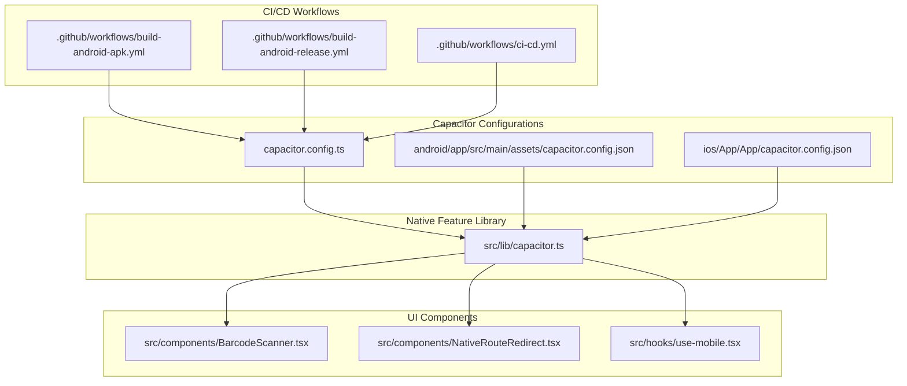
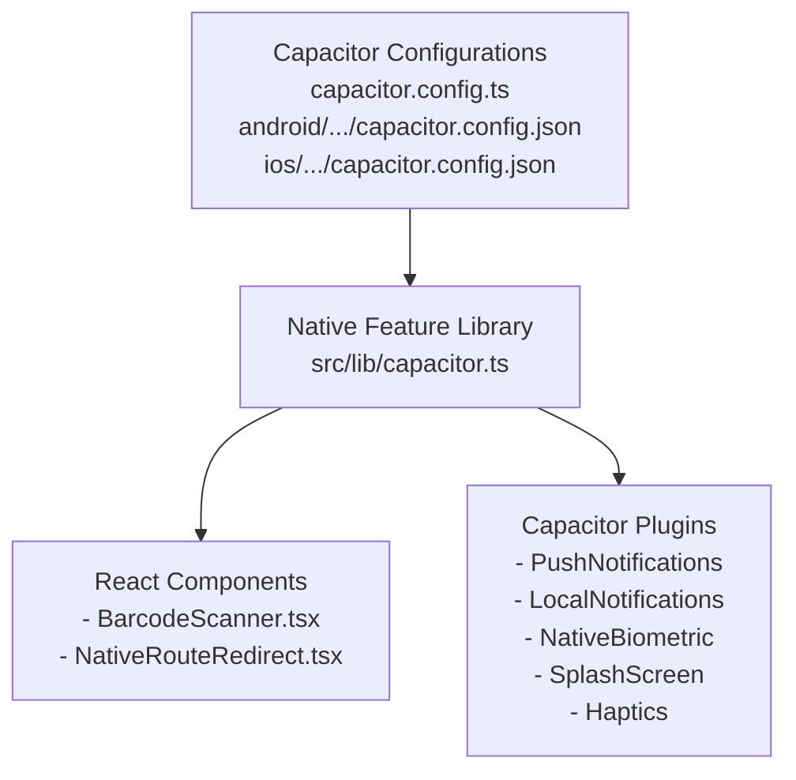
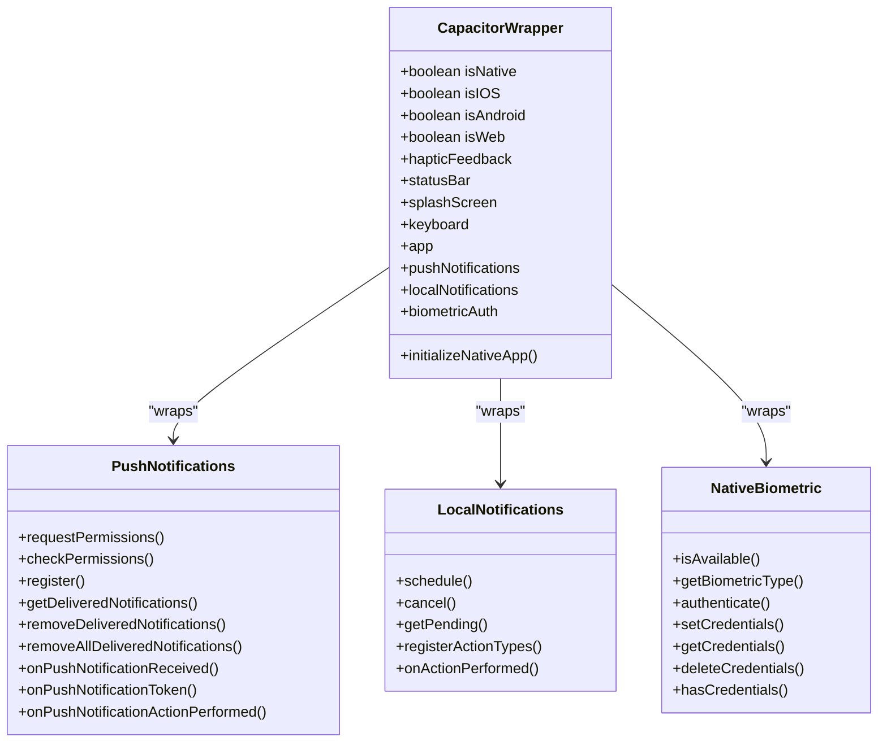
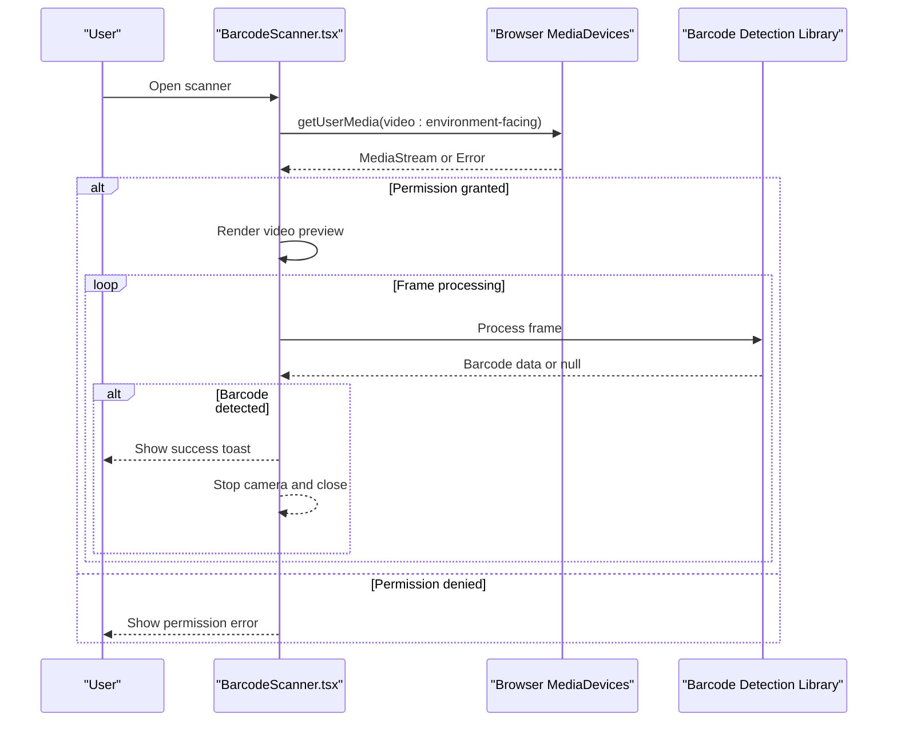
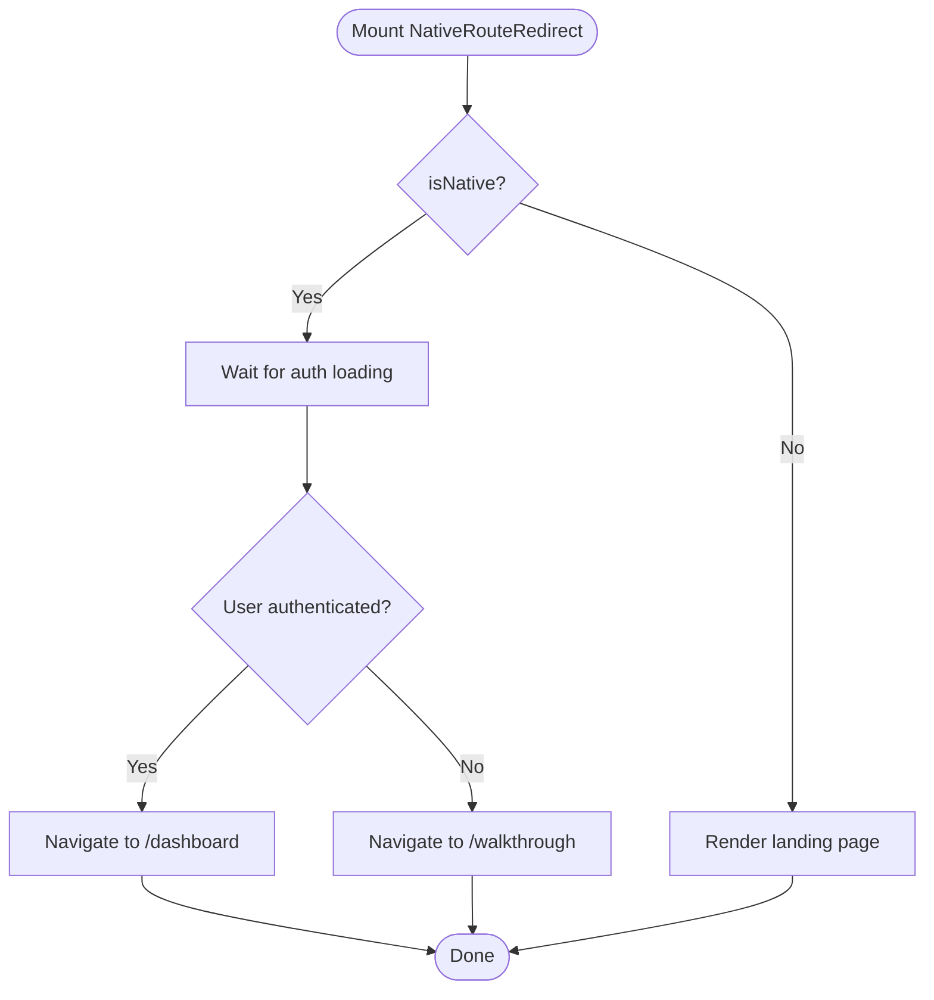
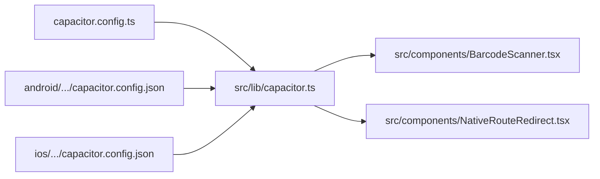

# Mobile App Issues

<cite>
**Referenced Files in This Document**
- [capacitor.config.ts](file://capacitor.config.ts)
- [capacitor.config.json](file://android/app/src/main/assets/capacitor.config.json)
- [capacitor.config.json](file://ios/App/App/capacitor.config.json)
- [capacitor.ts](file://src/lib/capacitor.ts)
- [BarcodeScanner.tsx](file://src/components/BarcodeScanner.tsx)
- [NativeRouteRedirect.tsx](file://src/components/NativeRouteRedirect.tsx)
- [use-mobile.tsx](file://src/hooks/use-mobile.tsx)
- [build-android-apk.yml](file://.github/workflows/build-android-apk.yml)
- [build-android-release.yml](file://.github/workflows/build-android-release.yml)
- [ci-cd.yml](file://.github/workflows/ci-cd.yml)
- [DEPLOYMENT.md](file://DEPLOYMENT.md)
- [DEPLOYMENT_SUMMARY.md](file://DEPLOYMENT_SUMMARY.md)
- [NATIVE_MOBILE_ANALYSIS_REPORT.md](file://NATIVE_MOBILE_ANALYSIS_REPORT.md)
</cite>

## Table of Contents
1. [Introduction](#introduction)
2. [Project Structure](#project-structure)
3. [Core Components](#core-components)
4. [Architecture Overview](#architecture-overview)
5. [Detailed Component Analysis](#detailed-component-analysis)
6. [Dependency Analysis](#dependency-analysis)
7. [Performance Considerations](#performance-considerations)
8. [Troubleshooting Guide](#troubleshooting-guide)
9. [Conclusion](#conclusion)
10. [Appendices](#appendices)

## Introduction
This document addresses mobile application issues in the Nutrio app with a focus on Capacitor plugin integration and platform-specific challenges. It covers camera access, geolocation services, push notification failures, QR code/barcode scanning, offline functionality, iOS-specific issues (App Store submission, background app refresh, permission dialogs), Android-specific issues (Google Play Store compliance, runtime permissions, hardware compatibility), and provides troubleshooting steps for crashes, memory leaks, performance optimization, build failures, deployment issues, and platform-specific debugging techniques.

## Project Structure
The mobile application is built with Capacitor and React, with platform-specific configurations under Android and iOS directories. The central Capacitor configuration defines app metadata, server settings, and plugin configurations. A dedicated library module wraps native features with safe access patterns and graceful fallbacks for web environments. UI components implement native-aware routing and barcode scanning capabilities.

**Diagram sources**
- [capacitor.config.ts:1-45](file://capacitor.config.ts#L1-L45)
- [capacitor.config.json:1-41](file://android/app/src/main/assets/capacitor.config.json#L1-L41)
- [capacitor.config.json:1-41](file://ios/App/App/capacitor.config.json#L1-L41)
- [capacitor.ts:1-640](file://src/lib/capacitor.ts#L1-L640)
- [BarcodeScanner.tsx:1-257](file://src/components/BarcodeScanner.tsx#L1-L257)
- [NativeRouteRedirect.tsx:1-43](file://src/components/NativeRouteRedirect.tsx#L1-L43)
- [use-mobile.tsx:1-20](file://src/hooks/use-mobile.tsx#L1-L20)
- [build-android-apk.yml](file://.github/workflows/build-android-apk.yml)
- [build-android-release.yml](file://.github/workflows/build-android-release.yml)
- [ci-cd.yml](file://.github/workflows/ci-cd.yml)

**Section sources**
- [capacitor.config.ts:1-45](file://capacitor.config.ts#L1-L45)
- [capacitor.config.json:1-41](file://android/app/src/main/assets/capacitor.config.json#L1-L41)
- [capacitor.config.json:1-41](file://ios/App/App/capacitor.config.json#L1-L41)
- [capacitor.ts:1-640](file://src/lib/capacitor.ts#L1-L640)

## Core Components
- Capacitor configuration: Defines app identifiers, web directory, server settings, and plugin configurations for splash screen, push notifications, local notifications, and native biometric authentication.
- Native feature wrapper: Provides platform detection, safe access to native APIs, and graceful fallbacks for web browsers.
- Barcode scanner component: Implements camera access with environment-facing camera preference, permission handling, and simulated barcode detection UI.
- Native route redirect: Handles platform-specific routing behavior for native builds versus web.
- Mobile breakpoint hook: Detects mobile viewport sizes for responsive UI adjustments.

**Section sources**
- [capacitor.config.ts:3-42](file://capacitor.config.ts#L3-L42)
- [capacitor.ts:27-43](file://src/lib/capacitor.ts#L27-L43)
- [BarcodeScanner.tsx:24-45](file://src/components/BarcodeScanner.tsx#L24-L45)
- [NativeRouteRedirect.tsx:15-33](file://src/components/NativeRouteRedirect.tsx#L15-L33)
- [use-mobile.tsx:5-18](file://src/hooks/use-mobile.tsx#L5-L18)

## Architecture Overview
The mobile architecture integrates Capacitor plugins with React components. Platform detection determines whether to invoke native APIs or fall back to web equivalents. The configuration files define plugin behavior and server policies, while the library module encapsulates initialization and event listeners.

**Diagram sources**
- [capacitor.ts:1-640](file://src/lib/capacitor.ts#L1-L640)
- [capacitor.config.ts:1-45](file://capacitor.config.ts#L1-L45)
- [capacitor.config.json:1-41](file://android/app/src/main/assets/capacitor.config.json#L1-L41)
- [capacitor.config.json:1-41](file://ios/App/App/capacitor.config.json#L1-L41)

## Detailed Component Analysis

### Capacitor Plugin Integration
The configuration files establish plugin settings for splash screen, push notifications, local notifications, and native biometric authentication. The library module exposes wrappers around these plugins with platform checks and event listeners.

**Diagram sources**
- [capacitor.ts:321-405](file://src/lib/capacitor.ts#L321-L405)
- [capacitor.ts:411-462](file://src/lib/capacitor.ts#L411-L462)
- [capacitor.ts:468-581](file://src/lib/capacitor.ts#L468-L581)

**Section sources**
- [capacitor.config.ts:19-41](file://capacitor.config.ts#L19-L41)
- [capacitor.ts:321-405](file://src/lib/capacitor.ts#L321-L405)
- [capacitor.ts:411-462](file://src/lib/capacitor.ts#L411-L462)
- [capacitor.ts:468-581](file://src/lib/capacitor.ts#L468-L581)

### Camera Access and Barcode Scanning
The barcode scanner component requests camera permissions via the browser's media devices API, uses an environment-facing camera, and provides a manual entry fallback. In production, integrate a barcode detection library to process frames and extract codes.

**Diagram sources**
- [BarcodeScanner.tsx:24-45](file://src/components/BarcodeScanner.tsx#L24-L45)
- [BarcodeScanner.tsx:74-83](file://src/components/BarcodeScanner.tsx#L74-L83)

**Section sources**
- [BarcodeScanner.tsx:14-204](file://src/components/BarcodeScanner.tsx#L14-L204)

### Native Route Redirect
On native platforms, the redirect component navigates users directly to the dashboard if authenticated or to the walkthrough otherwise, while on web, it renders the landing page normally.

**Diagram sources**
- [NativeRouteRedirect.tsx:15-33](file://src/components/NativeRouteRedirect.tsx#L15-L33)

**Section sources**
- [NativeRouteRedirect.tsx:15-43](file://src/components/NativeRouteRedirect.tsx#L15-L43)

### Offline Functionality
Offline capability depends on the service worker configuration and caching strategies defined in the build pipeline and deployment documentation. Review the deployment guides for precache manifests and runtime caching behavior.

**Section sources**
- [DEPLOYMENT.md](file://DEPLOYMENT.md)
- [DEPLOYMENT_SUMMARY.md](file://DEPLOYMENT_SUMMARY.md)

## Dependency Analysis
The native feature library depends on Capacitor core and plugin packages, while UI components depend on the library for platform detection and native operations. Configuration files influence plugin behavior and server policies.

**Diagram sources**
- [capacitor.ts:1-640](file://src/lib/capacitor.ts#L1-L640)
- [BarcodeScanner.tsx:1-257](file://src/components/BarcodeScanner.tsx#L1-L257)
- [NativeRouteRedirect.tsx:1-43](file://src/components/NativeRouteRedirect.tsx#L1-L43)
- [capacitor.config.ts:1-45](file://capacitor.config.ts#L1-L45)
- [capacitor.config.json:1-41](file://android/app/src/main/assets/capacitor.config.json#L1-L41)
- [capacitor.config.json:1-41](file://ios/App/App/capacitor.config.json#L1-L41)

**Section sources**
- [capacitor.ts:1-640](file://src/lib/capacitor.ts#L1-L640)
- [capacitor.config.ts:1-45](file://capacitor.config.ts#L1-L45)
- [capacitor.config.json:1-41](file://android/app/src/main/assets/capacitor.config.json#L1-L41)
- [capacitor.config.json:1-41](file://ios/App/App/capacitor.config.json#L1-L41)

## Performance Considerations
- Camera resource management: Ensure camera streams are stopped when components unmount to prevent resource leaks.
- Event listener cleanup: Remove Capacitor event listeners on component unmount to avoid memory leaks.
- Platform checks: Use isNative checks to avoid unnecessary work on web platforms.
- Responsive breakpoints: Use the mobile hook to optimize rendering for smaller screens.

**Section sources**
- [BarcodeScanner.tsx:48-59](file://src/components/BarcodeScanner.tsx#L48-L59)
- [capacitor.ts:248-261](file://src/lib/capacitor.ts#L248-L261)
- [use-mobile.tsx:5-18](file://src/hooks/use-mobile.tsx#L5-L18)

## Troubleshooting Guide

### Capacitor Plugin Integration Problems
- Push notification registration fails: Verify plugin configuration and platform-specific setup. Check permission requests and event listener registration.
- Local notifications not scheduling: Confirm schedule payload format and pending notification retrieval.
- Biometric authentication unavailable: Validate plugin availability and credential storage.

**Section sources**
- [capacitor.ts:321-405](file://src/lib/capacitor.ts#L321-L405)
- [capacitor.ts:411-462](file://src/lib/capacitor.ts#L411-L462)
- [capacitor.ts:468-581](file://src/lib/capacitor.ts#L468-L581)

### Camera Access Issues
- Camera permission denied: Ensure environment-facing camera constraints and proper error handling. Provide manual entry fallback.
- Camera stream not stopping: Verify cleanup of media tracks on unmount.

**Section sources**
- [BarcodeScanner.tsx:24-45](file://src/components/BarcodeScanner.tsx#L24-L45)
- [BarcodeScanner.tsx:48-59](file://src/components/BarcodeScanner.tsx#L48-L59)

### QR Code and Barcode Reading
- No barcode detection: Integrate a detection library and process frames from the video element.
- Limited format support: Extend supported formats according to library capabilities.

**Section sources**
- [BarcodeScanner.tsx:74-83](file://src/components/BarcodeScanner.tsx#L74-L83)
- [BarcodeScanner.tsx:192-199](file://src/components/BarcodeScanner.tsx#L192-L199)

### iOS-Specific Problems
- App Store submission issues: Review Info.plist entries, entitlements, and privacy manifests. Ensure background modes and permissions are configured per Apple guidelines.
- Background app refresh: Configure background modes and ensure proper lifecycle handling.
- iOS permission dialogs: Test permission flows and handle denials gracefully.

**Section sources**
- [capacitor.config.json:1-41](file://ios/App/App/capacitor.config.json#L1-L41)
- [capacitor.ts:321-405](file://src/lib/capacitor.ts#L321-L405)

### Android-Specific Issues
- Google Play Store compliance: Verify privacy policy links, data collection declarations, and runtime permissions handling.
- Runtime permissions: Implement proper permission requests and rationale handling.
- Hardware compatibility: Test on various device configurations and handle camera availability differences.

**Section sources**
- [capacitor.config.json:1-41](file://android/app/src/main/assets/capacitor.config.json#L1-L41)
- [capacitor.ts:321-405](file://src/lib/capacitor.ts#L321-L405)

### Build Failures and Deployment
- Build failures: Check CI/CD workflow configurations and dependency versions. Validate Capacitor configuration files.
- Deployment issues: Follow deployment documentation for service worker caching and asset precaching.

**Section sources**
- [build-android-apk.yml](file://.github/workflows/build-android-apk.yml)
- [build-android-release.yml](file://.github/workflows/build-android-release.yml)
- [ci-cd.yml](file://.github/workflows/ci-cd.yml)
- [DEPLOYMENT.md](file://DEPLOYMENT.md)
- [DEPLOYMENT_SUMMARY.md](file://DEPLOYMENT_SUMMARY.md)

### Platform-Specific Debugging
- iOS debugging: Use Xcode debugger and device logs to inspect plugin behavior and permission dialogs.
- Android debugging: Use Android Studio and adb logs to diagnose plugin issues and runtime permissions.

**Section sources**
- [capacitor.ts:590-608](file://src/lib/capacitor.ts#L590-L608)

## Conclusion
The Nutrio mobile application leverages Capacitor for native feature integration, with a centralized configuration and a robust library wrapper for safe native access. Camera and barcode scanning functionality is present but requires integration of a detection library for production. Platform-specific configurations and CI/CD workflows support Android and iOS deployments. Addressing the outlined issues will improve reliability, user experience, and platform compliance.

## Appendices

### Additional Resources
- Native mobile analysis report for deeper insights into platform-specific considerations.

**Section sources**
- [NATIVE_MOBILE_ANALYSIS_REPORT.md](file://NATIVE_MOBILE_ANALYSIS_REPORT.md)