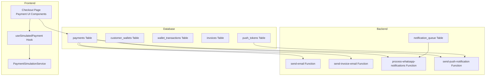
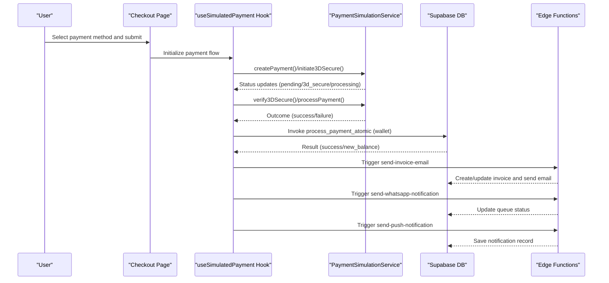
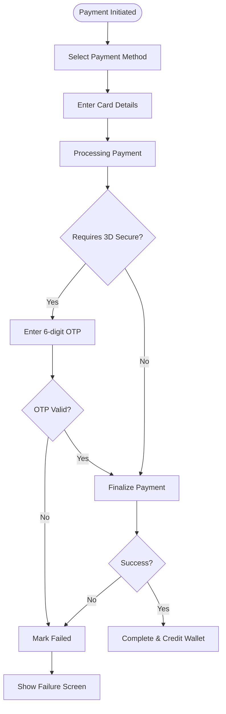
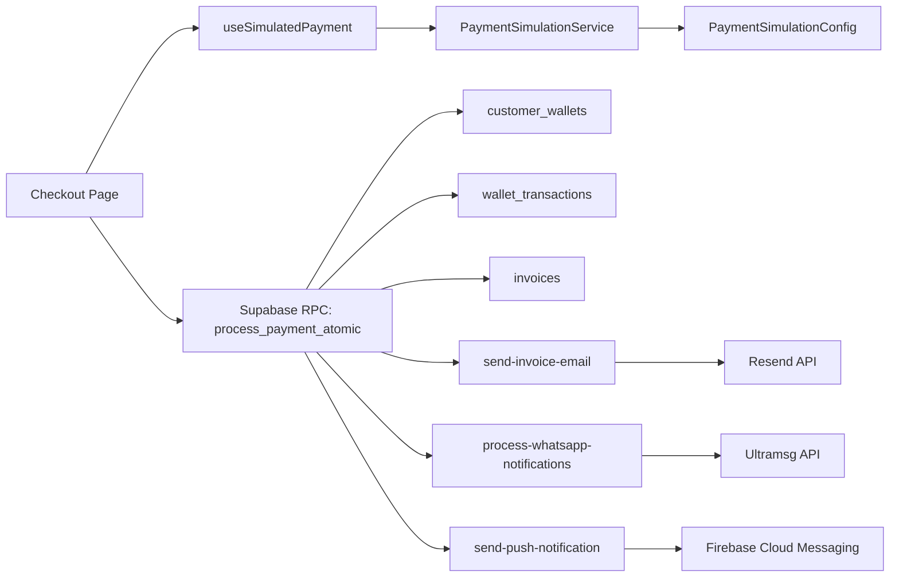

# Payment & Notification Issues

<cite>
**Referenced Files in This Document**
- [payment-simulation.ts](file://src/lib/payment-simulation.ts)
- [payment-simulation-config.ts](file://src/lib/payment-simulation-config.ts)
- [useSimulatedPayment.ts](file://src/hooks/useSimulatedPayment.ts)
- [Checkout.tsx](file://src/pages/Checkout.tsx)
- [PaymentFailureScreen.tsx](file://src/components/payment/PaymentFailureScreen.tsx)
- [email-service.ts](file://src/lib/email-service.ts)
- [resend.ts](file://src/lib/resend.ts)
- [send-email/index.ts](file://supabase/functions/send-email/index.ts)
- [send-invoice-email/index.ts](file://supabase/functions/send-invoice-email/index.ts)
- [whatsapp.ts](file://src/lib/whatsapp.ts)
- [process-whatsapp-notifications/index.ts](file://supabase/functions/process-whatsapp-notifications/index.ts)
- [push.ts](file://src/lib/notifications/push.ts)
- [push.ts](file://src/lib/notifications/push.test.ts)
- [walletService.ts](file://src/services/walletService.ts)
- [useWallet.ts](file://src/hooks/useWallet.ts)
- [20260225211305_add_atomic_wallet_payment.sql](file://supabase/migrations/20260225211305_add_atomic_wallet_payment.sql)
- [20260224000002_add_payment_verification_to_rollover.sql](file://supabase/migrations/20260224000002_add_payment_verification_to_rollover.sql)
- [simulate-payment/index.ts](file://supabase/functions/simulate-payment/index.ts)
- [payments.spec.ts](file://e2e/system/payments.spec.ts)
- [notifications.spec.ts](file://e2e/system/notifications.spec.ts)
- [sentry.ts](file://src/lib/sentry.ts)
- [analytics.ts](file://src/lib/analytics.ts)
</cite>

## Table of Contents
1. [Introduction](#introduction)
2. [Project Structure](#project-structure)
3. [Core Components](#core-components)
4. [Architecture Overview](#architecture-overview)
5. [Detailed Component Analysis](#detailed-component-analysis)
6. [Dependency Analysis](#dependency-analysis)
7. [Performance Considerations](#performance-considerations)
8. [Troubleshooting Guide](#troubleshooting-guide)
9. [Conclusion](#conclusion)

## Introduction
This document focuses on payment processing and notification delivery issues in the Nutrio application. It covers payment gateway failures (declined transactions, insufficient funds, timeouts), notification system problems (email, SMS/WhatsApp, push), and wallet payment issues (insufficient balance, processing errors, refund failures). It also provides troubleshooting steps for payment simulation failures, webhook processing errors, and real-time payment status updates, along with monitoring approaches for success rates and delivery metrics.

## Project Structure
The payment and notification systems span frontend React components, Supabase Edge Functions, PostgreSQL migrations, and analytics/logging integrations:
- Frontend simulation and UI: payment simulation service, hooks, and checkout page
- Backend automation: email, invoice, WhatsApp, and push notification functions
- Database: atomic wallet payment migration and supporting tables
- Observability: Sentry error reporting and PostHog analytics

**Diagram sources**
- [Checkout.tsx:17-288](file://src/pages/Checkout.tsx#L17-L288)
- [useSimulatedPayment.ts:1-80](file://src/hooks/useSimulatedPayment.ts#L1-L80)
- [payment-simulation.ts:25-223](file://src/lib/payment-simulation.ts#L25-L223)
- [send-email/index.ts:19-120](file://supabase/functions/send-email/index.ts#L19-L120)
- [send-invoice-email/index.ts:326-473](file://supabase/functions/send-invoice-email/index.ts#L326-L473)
- [process-whatsapp-notifications/index.ts:88-162](file://supabase/functions/process-whatsapp-notifications/index.ts#L88-L162)
- [send-push-notification/index.ts:206-299](file://supabase/functions/send-push-notification/index.ts#L206-L299)

**Section sources**
- [Checkout.tsx:17-288](file://src/pages/Checkout.tsx#L17-L288)
- [payment-simulation.ts:25-223](file://src/lib/payment-simulation.ts#L25-L223)
- [useSimulatedPayment.ts:1-80](file://src/hooks/useSimulatedPayment.ts#L1-L80)

## Core Components
- Payment simulation service: simulates payment lifecycle, 3D Secure verification, and outcomes with configurable success rates and delays.
- Payment UI: checkout flow with method selection, card form simulation, processing modal, and 3D Secure overlay.
- Notification services: email via Resend, invoice generation, WhatsApp messaging via Ultramsg, and push notifications via Firebase Cloud Messaging.
- Wallet processing: atomic wallet top-up with rollback and reconciliation functions.
- Monitoring and observability: Sentry error capture and PostHog analytics event tracking.

**Section sources**
- [payment-simulation.ts:11-223](file://src/lib/payment-simulation.ts#L11-L223)
- [Checkout.tsx:17-288](file://src/pages/Checkout.tsx#L17-L288)
- [email-service.ts:23-84](file://src/lib/email-service.ts#L23-L84)
- [resend.ts:34-66](file://src/lib/resend.ts#L34-L66)
- [whatsapp.ts:26-60](file://src/lib/whatsapp.ts#L26-L60)
- [walletService.ts:13-137](file://src/services/walletService.ts#L13-L137)
- [20260225211305_add_atomic_wallet_payment.sql:16-350](file://supabase/migrations/20260225211305_add_atomic_wallet_payment.sql#L16-L350)

## Architecture Overview
End-to-end payment and notification flow:
- User selects payment method and submits card details in the checkout page.
- The payment simulation service orchestrates 3D Secure verification and final processing.
- On completion, backend functions handle email invoice, WhatsApp notifications, and push notifications.
- Wallet top-ups leverage atomic database functions to ensure consistency.

**Diagram sources**
- [Checkout.tsx:32-78](file://src/pages/Checkout.tsx#L32-L78)
- [useSimulatedPayment.ts:22-58](file://src/hooks/useSimulatedPayment.ts#L22-L58)
- [payment-simulation.ts:38-140](file://src/lib/payment-simulation.ts#L38-L140)
- [20260225211305_add_atomic_wallet_payment.sql:16-112](file://supabase/migrations/20260225211305_add_atomic_wallet_payment.sql#L16-L112)
- [send-invoice-email/index.ts:326-473](file://supabase/functions/send-invoice-email/index.ts#L326-L473)
- [process-whatsapp-notifications/index.ts:88-162](file://supabase/functions/process-whatsapp-notifications/index.ts#L88-L162)
- [send-push-notification/index.ts:206-299](file://supabase/functions/send-push-notification/index.ts#L206-L299)

## Detailed Component Analysis

### Payment Simulation and Failure Handling
- Simulation modes and outcomes: configurable success rate, artificial delays, and failure reasons including insufficient funds, expired cards, bank declines, invalid CVV, and transaction timeouts.
- Real-time status updates via subscription callbacks to the UI.
- Failure screen displays error messages and provides retry/back/support actions.

**Diagram sources**
- [payment-simulation.ts:38-140](file://src/lib/payment-simulation.ts#L38-L140)
- [useSimulatedPayment.ts:22-58](file://src/hooks/useSimulatedPayment.ts#L22-L58)
- [PaymentFailureScreen.tsx:14-79](file://src/components/payment/PaymentFailureScreen.tsx#L14-L79)

**Section sources**
- [payment-simulation.ts:129-140](file://src/lib/payment-simulation.ts#L129-L140)
- [useSimulatedPayment.ts:36-58](file://src/hooks/useSimulatedPayment.ts#L36-L58)
- [PaymentFailureScreen.tsx:14-79](file://src/components/payment/PaymentFailureScreen.tsx#L14-L79)

### Email Delivery Failures
- Frontend email service: templated and raw email sending via a Supabase Edge Function.
- Edge function validates inputs, checks API keys, and calls Resend; returns structured errors.
- Invoice email automation generates HTML and sends via Resend, logs email activity.

Common issues and resolutions:
- Missing API keys or invalid configuration: ensure RESEND_API_KEY is set; verify function deployment.
- Invalid email format or missing fields: validate recipients and payload before invoking.
- Resend API errors: inspect returned error details and retry with exponential backoff.

**Section sources**
- [email-service.ts:23-84](file://src/lib/email-service.ts#L23-L84)
- [send-email/index.ts:25-107](file://supabase/functions/send-email/index.ts#L25-L107)
- [send-invoice-email/index.ts:423-443](file://supabase/functions/send-invoice-email/index.ts#L423-L443)

### SMS/WhatsApp Issues
- WhatsApp service: sends messages via Ultramsg API with phone number validation and error logging.
- Edge function processes queued notifications from the database, updates statuses, and handles failures.

Common issues and resolutions:
- Missing credentials: ensure ULTRAMSG_INSTANCE_ID and ULTRAMSG_TOKEN are configured.
- Invalid phone numbers: normalize numbers and validate length/format.
- API errors: capture error messages and mark queue items as failed with details.

**Section sources**
- [whatsapp.ts:26-60](file://src/lib/whatsapp.ts#L26-L60)
- [process-whatsapp-notifications/index.ts:31-86](file://supabase/functions/process-whatsapp-notifications/index.ts#L31-L86)
- [process-whatsapp-notifications/index.ts:117-161](file://supabase/functions/process-whatsapp-notifications/index.ts#L117-L161)

### Push Notification Delivery Problems
- Push service: manages FCM tokens, initializes permissions, saves tokens to the database, and navigates on notification tap.
- Edge function sends push notifications to multiple tokens, deactivates inactive tokens, and records results.

Common issues and resolutions:
- Permission denied: request permission and handle denial gracefully.
- Missing tokens: ensure token registration and database upsert succeed.
- UNREGISTERED/NOT_FOUND tokens: deactivate tokens and clean up stale entries.

**Section sources**
- [push.ts:13-136](file://src/lib/notifications/push.ts#L13-L136)
- [send-push-notification/index.ts:213-299](file://supabase/functions/send-push-notification/index.ts#L213-L299)

### Wallet Payment Issues
- Atomic wallet processing: ensures payment completion and wallet credit occur in a single transaction, preventing partial states.
- Reconciliation function identifies payments that completed without crediting the wallet and retries.
- Wallet top-up service: credits wallet, creates invoices, generates PDFs, and emails invoices via Resend.

Common issues and resolutions:
- Non-atomic credits: resolved by using atomic RPC functions.
- Insufficient balance: validate wallet balance before debits; prevent negative balances.
- Refund failures: use atomic functions and reconciliation to ensure consistency.

**Section sources**
- [20260225211305_add_atomic_wallet_payment.sql:16-112](file://supabase/migrations/20260225211305_add_atomic_wallet_payment.sql#L16-L112)
- [20260225211305_add_atomic_wallet_payment.sql:289-350](file://supabase/migrations/20260225211305_add_atomic_wallet_payment.sql#L289-L350)
- [walletService.ts:13-137](file://src/services/walletService.ts#L13-L137)
- [useWallet.ts:137-167](file://src/hooks/useWallet.ts#L137-L167)

### Webhook Processing Errors
- Payment webhooks: simulation function demonstrates webhook-like behavior and error handling.
- Notification processing: edge function processes queued notifications and updates statuses.

Resolution steps:
- Validate webhook signatures and payloads.
- Implement idempotent processing and deduplication.
- Capture and log errors; use dead-letter queues for retries.

**Section sources**
- [simulate-payment/index.ts:46-118](file://supabase/functions/simulate-payment/index.ts#L46-L118)
- [process-whatsapp-notifications/index.ts:88-162](file://supabase/functions/process-whatsapp-notifications/index.ts#L88-L162)

## Dependency Analysis
Payment and notification components depend on Supabase for data persistence and Edge Functions for external service integrations.

**Diagram sources**
- [payment-simulation.ts:25-36](file://src/lib/payment-simulation.ts#L25-L36)
- [useSimulatedPayment.ts:22-58](file://src/hooks/useSimulatedPayment.ts#L22-L58)
- [Checkout.tsx:32-56](file://src/pages/Checkout.tsx#L32-L56)
- [20260225211305_add_atomic_wallet_payment.sql:16-112](file://supabase/migrations/20260225211305_add_atomic_wallet_payment.sql#L16-L112)
- [send-invoice-email/index.ts:423-443](file://supabase/functions/send-invoice-email/index.ts#L423-L443)
- [process-whatsapp-notifications/index.ts:31-86](file://supabase/functions/process-whatsapp-notifications/index.ts#L31-L86)
- [send-push-notification/index.ts:241-271](file://supabase/functions/send-push-notification/index.ts#L241-L271)

**Section sources**
- [payment-simulation-config.ts:4-38](file://src/lib/payment-simulation-config.ts#L4-L38)
- [Checkout.tsx:32-56](file://src/pages/Checkout.tsx#L32-L56)
- [20260225211305_add_atomic_wallet_payment.sql:16-112](file://supabase/migrations/20260225211305_add_atomic_wallet_payment.sql#L16-L112)

## Performance Considerations
- Payment simulation: adjust artificial delays and success rates for realistic load testing without impacting production.
- Notification throughput: batch and limit concurrent external API calls; implement backpressure and retry policies.
- Database writes: use atomic functions and indexes to minimize contention and improve reconciliation performance.

## Troubleshooting Guide

### Payment Simulation Failures
- Symptom: Payments stuck in pending or processing.
- Actions:
  - Verify simulation mode is enabled and success rate is configured appropriately.
  - Check 3D Secure OTP validation and ensure valid 6-digit input.
  - Review failure reasons logged in the simulation service.

**Section sources**
- [payment-simulation.ts:38-140](file://src/lib/payment-simulation.ts#L38-L140)
- [useSimulatedPayment.ts:36-58](file://src/hooks/useSimulatedPayment.ts#L36-L58)

### Payment Gateway Failures
- Declined transactions: insufficient funds, expired cards, invalid CVV, bank declines.
- Timeout errors: increase artificial delays in simulation or reduce network latency.
- Resolution: reattempt with corrected details; implement retry with exponential backoff.

**Section sources**
- [payment-simulation.ts:129-140](file://src/lib/payment-simulation.ts#L129-L140)

### Email Delivery Failures
- Missing API key or invalid configuration: check RESEND_API_KEY and function environment.
- Validation errors: ensure recipient email format and required fields.
- API errors: inspect returned error messages and retry with backoff.

**Section sources**
- [send-email/index.ts:25-107](file://supabase/functions/send-email/index.ts#L25-L107)
- [email-service.ts:79-83](file://src/lib/email-service.ts#L79-L83)

### SMS/WhatsApp Issues
- Missing credentials: configure ULTRAMSG_INSTANCE_ID and ULTRAMSG_TOKEN.
- Invalid phone numbers: normalize and validate numbers.
- API errors: capture and log error messages; update queue item status with details.

**Section sources**
- [process-whatsapp-notifications/index.ts:31-86](file://supabase/functions/process-whatsapp-notifications/index.ts#L31-L86)
- [process-whatsapp-notifications/index.ts:117-161](file://supabase/functions/process-whatsapp-notifications/index.ts#L117-L161)

### Push Notification Delivery Problems
- Permission denied: request permission and handle denial; avoid repeated prompts.
- Missing tokens: ensure token registration and database upsert succeed.
- UNREGISTERED/NOT_FOUND tokens: deactivate tokens and clean up stale entries.

**Section sources**
- [push.ts:36-44](file://src/lib/notifications/push.ts#L36-L44)
- [send-push-notification/index.ts:259-271](file://supabase/functions/send-push-notification/index.ts#L259-L271)

### Wallet Payment Issues
- Non-atomic credits: use atomic RPC functions to ensure consistency.
- Insufficient balance: validate wallet balance before debits.
- Refund failures: use reconciliation functions to identify and retry missed credits.

**Section sources**
- [20260225211305_add_atomic_wallet_payment.sql:16-112](file://supabase/migrations/20260225211305_add_atomic_wallet_payment.sql#L16-L112)
- [20260225211305_add_atomic_wallet_payment.sql:289-350](file://supabase/migrations/20260225211305_add_atomic_wallet_payment.sql#L289-L350)

### Webhook Processing Errors
- Validate webhook signatures and payloads; implement idempotent processing.
- Capture and log errors; use dead-letter queues for retries.

**Section sources**
- [simulate-payment/index.ts:46-118](file://supabase/functions/simulate-payment/index.ts#L46-L118)
- [process-whatsapp-notifications/index.ts:88-162](file://supabase/functions/process-whatsapp-notifications/index.ts#L88-L162)

### Monitoring Approaches
- Payment success rates: track payment outcomes via analytics events and Sentry error reporting.
- Notification delivery metrics: monitor email, WhatsApp, and push delivery results; track deactivation of invalid tokens.
- Wallet reconciliation: run reconciliation functions periodically to identify and fix missed credits.

**Section sources**
- [analytics.ts:56-144](file://src/lib/analytics.ts#L56-L144)
- [sentry.ts:39-48](file://src/lib/sentry.ts#L39-L48)
- [send-push-notification/index.ts:259-271](file://supabase/functions/send-push-notification/index.ts#L259-L271)
- [20260225211305_add_atomic_wallet_payment.sql:325-349](file://supabase/migrations/20260225211305_add_atomic_wallet_payment.sql#L325-L349)

## Conclusion
The Nutrio payment and notification stack combines frontend simulation, robust backend functions, and atomic database operations to handle payment processing and delivery reliably. By leveraging configuration-driven simulation, comprehensive error handling, and observability tools, teams can troubleshoot issues efficiently and maintain high delivery rates across channels.