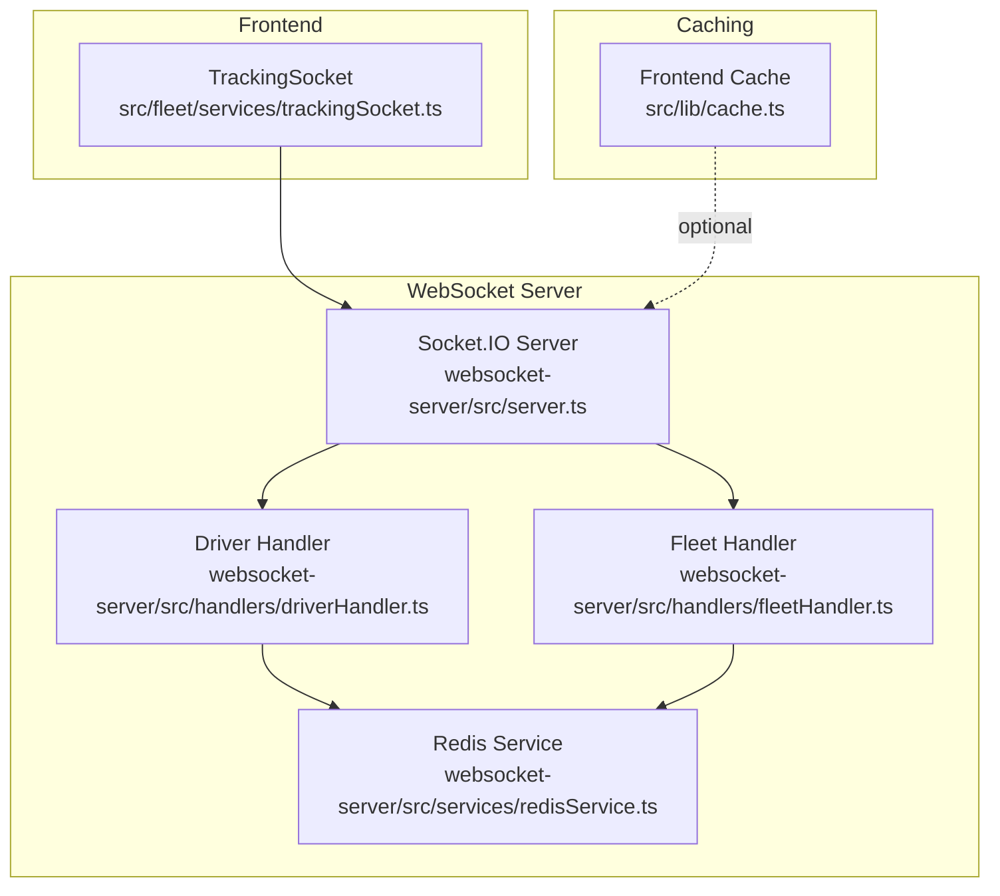
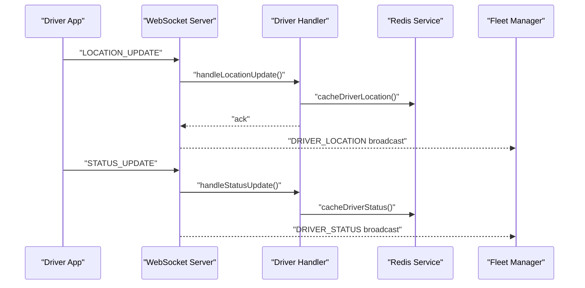
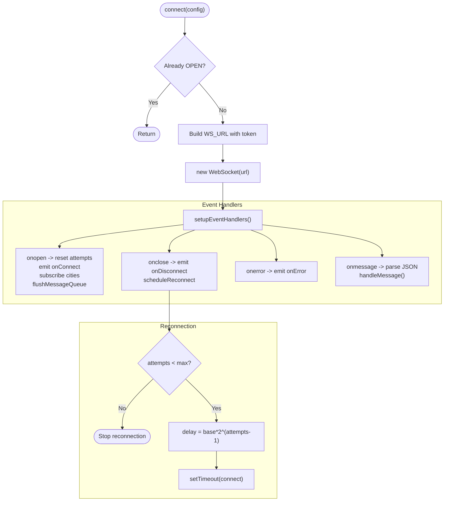
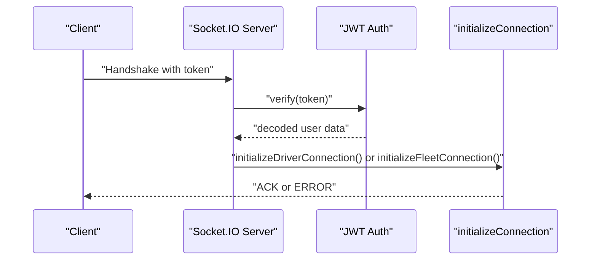
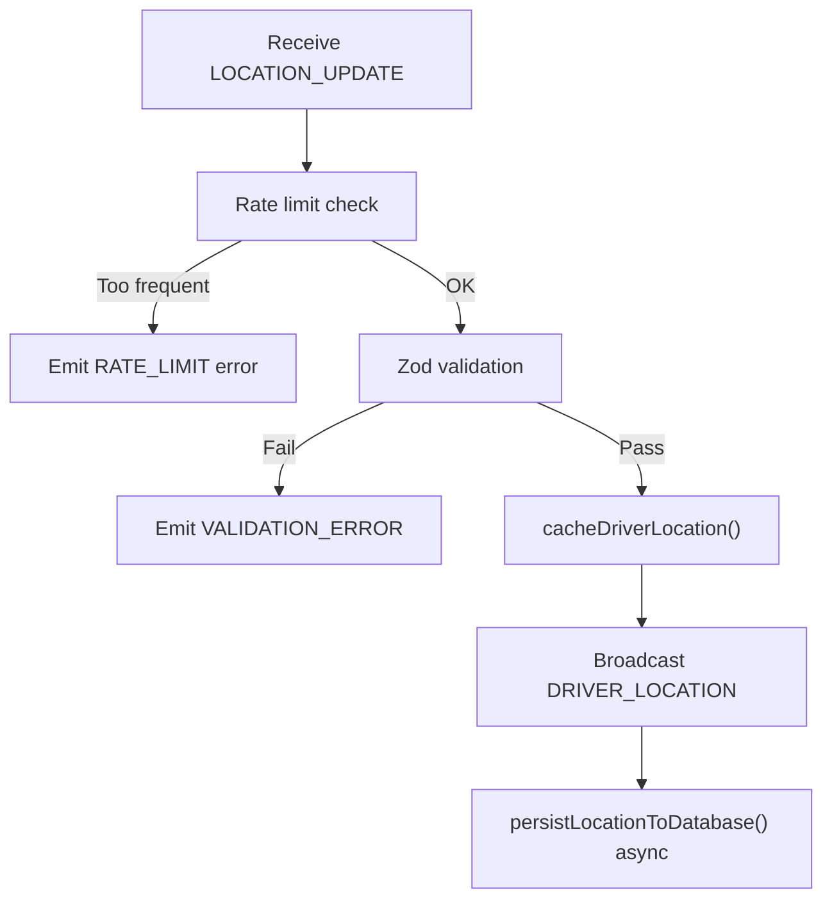
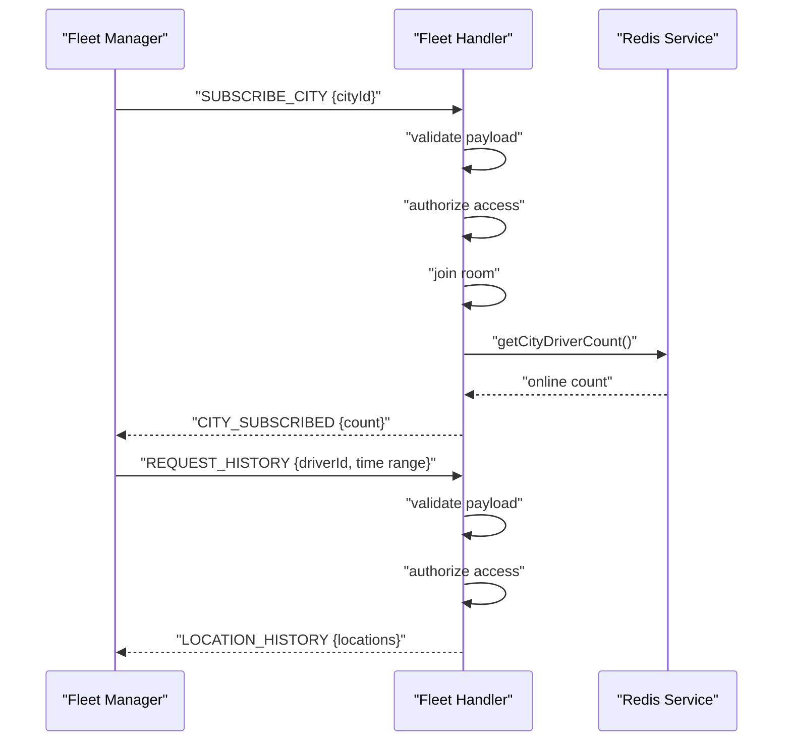
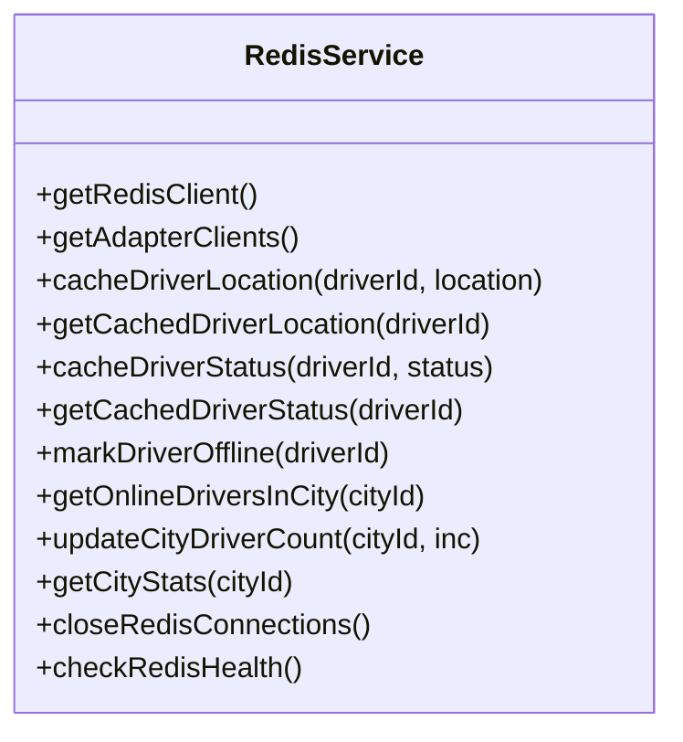
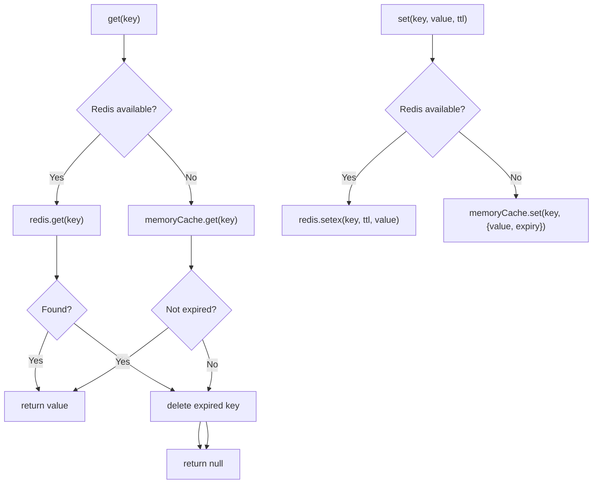
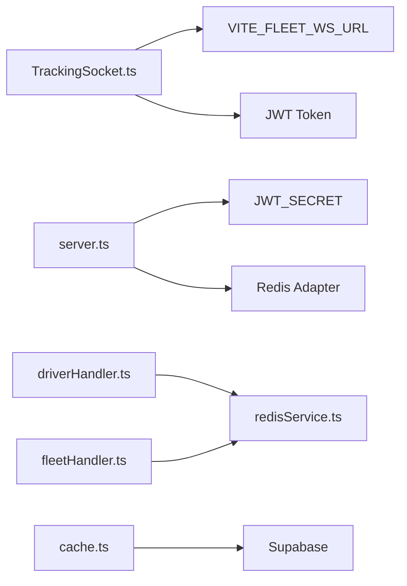

# Real-time & Performance Issues

<cite>
**Referenced Files in This Document**
- [trackingSocket.ts](file://src/fleet/services/trackingSocket.ts)
- [server.ts](file://websocket-server/src/server.ts)
- [driverHandler.ts](file://websocket-server/src/handlers/driverHandler.ts)
- [fleetHandler.ts](file://websocket-server/src/handlers/fleetHandler.ts)
- [redisService.ts](file://websocket-server/src/services/redisService.ts)
- [cache.ts](file://src/lib/cache.ts)
- [realtime.spec.ts](file://e2e/system/realtime.spec.ts)
- [performance-benchmark.ts](file://scripts/performance-benchmark.ts)
- [performance.spec.ts](file://e2e/system/performance.spec.ts)
- [load-test-k6.js](file://scripts/load-test-k6.js)
- [load-test-config.yml](file://tests/load-test-config.yml)
- [SentryErrorBoundary.tsx](file://src/components/SentryErrorBoundary.tsx)
- [AdminAIEngineMonitor.tsx](file://src/pages/admin/AdminAIEngineMonitor.tsx)
- [AdminRetentionAnalytics.tsx](file://src/pages/admin/AdminRetentionAnalytics.tsx)
- [fleet-management-portal-design.md](file://docs/fleet-management-portal-design.md)
</cite>

## Table of Contents
1. [Introduction](#introduction)
2. [Project Structure](#project-structure)
3. [Core Components](#core-components)
4. [Architecture Overview](#architecture-overview)
5. [Detailed Component Analysis](#detailed-component-analysis)
6. [Dependency Analysis](#dependency-analysis)
7. [Performance Considerations](#performance-considerations)
8. [Troubleshooting Guide](#troubleshooting-guide)
9. [Conclusion](#conclusion)
10. [Appendices](#appendices)

## Introduction
This document focuses on real-time communication and performance issues in the Nutrio application. It covers WebSocket connection stability, reconnection strategies, message delivery guarantees, real-time data synchronization (stale data, missed updates, conflict resolution), performance bottlenecks (slow API responses, memory/CPU spikes), and operational concerns (cache invalidation, data consistency, concurrent access). It also provides monitoring approaches, optimization strategies, and troubleshooting procedures tailored to the current codebase.

## Project Structure
The real-time system spans:
- Frontend WebSocket client for fleet tracking
- WebSocket server with Socket.IO, Redis adapter, and JWT authentication
- Handlers for drivers and fleet managers
- Redis-backed caching and pub/sub for scalability
- End-to-end tests for real-time behavior
- Performance benchmarking and load testing scripts
- Monitoring surfaces in admin dashboards

**Diagram sources**
- [trackingSocket.ts:1-287](file://src/fleet/services/trackingSocket.ts#L1-L287)
- [server.ts:1-256](file://websocket-server/src/server.ts#L1-L256)
- [driverHandler.ts:1-318](file://websocket-server/src/handlers/driverHandler.ts#L1-L318)
- [fleetHandler.ts:1-247](file://websocket-server/src/handlers/fleetHandler.ts#L1-L247)
- [redisService.ts:1-264](file://websocket-server/src/services/redisService.ts#L1-L264)
- [cache.ts:1-199](file://src/lib/cache.ts#L1-L199)

**Section sources**
- [trackingSocket.ts:1-287](file://src/fleet/services/trackingSocket.ts#L1-L287)
- [server.ts:1-256](file://websocket-server/src/server.ts#L1-L256)
- [driverHandler.ts:1-318](file://websocket-server/src/handlers/driverHandler.ts#L1-L318)
- [fleetHandler.ts:1-247](file://websocket-server/src/handlers/fleetHandler.ts#L1-L247)
- [redisService.ts:1-264](file://websocket-server/src/services/redisService.ts#L1-L264)
- [cache.ts:1-199](file://src/lib/cache.ts#L1-L199)

## Core Components
- TrackingSocket: Client-side WebSocket service with exponential backoff, message queuing, and event routing for driver location, status, and stats.
- WebSocket Server: Socket.IO server with Redis adapter, JWT auth, connection limits, and health endpoints.
- Driver Handler: Validates and caches driver location/status, persists asynchronously, and broadcasts to fleet managers.
- Fleet Handler: Manages city subscriptions, access control, and location history requests.
- Redis Service: Centralized caching and pub/sub for multi-instance scaling.
- Frontend Cache: Optional Redis-backed cache with in-memory fallback and pattern-based invalidation.

**Section sources**
- [trackingSocket.ts:25-287](file://src/fleet/services/trackingSocket.ts#L25-L287)
- [server.ts:34-150](file://websocket-server/src/server.ts#L34-L150)
- [driverHandler.ts:48-207](file://websocket-server/src/handlers/driverHandler.ts#L48-L207)
- [fleetHandler.ts:36-212](file://websocket-server/src/handlers/fleetHandler.ts#L36-L212)
- [redisService.ts:22-207](file://websocket-server/src/services/redisService.ts#L22-L207)
- [cache.ts:16-106](file://src/lib/cache.ts#L16-L106)

## Architecture Overview
The system uses Socket.IO with Redis adapter for horizontal scaling. Drivers publish location/status updates; the server validates, caches, persists asynchronously, and broadcasts to subscribed fleet managers. Redis stores driver metadata and city stats for low-latency reads.

**Diagram sources**
- [server.ts:108-150](file://websocket-server/src/server.ts#L108-L150)
- [driverHandler.ts:105-207](file://websocket-server/src/handlers/driverHandler.ts#L105-L207)
- [redisService.ts:87-146](file://websocket-server/src/services/redisService.ts#L87-L146)

**Section sources**
- [server.ts:38-51](file://websocket-server/src/server.ts#L38-L51)
- [driverHandler.ts:105-207](file://websocket-server/src/handlers/driverHandler.ts#L105-L207)
- [redisService.ts:87-146](file://websocket-server/src/services/redisService.ts#L87-L146)

## Detailed Component Analysis

### WebSocket Client: TrackingSocket
Responsibilities:
- Establish WebSocket connection with token query param.
- Manage exponential backoff reconnection with capped attempts.
- Queue outgoing messages until connected; flush on open.
- Parse incoming events and route to callbacks.
- Subscribe/unsubscribe to city rooms based on role.

Key behaviors:
- Reconnection uses exponential backoff with jitter-like progression.
- Message queue prevents data loss during transient disconnects.
- Role-based subscription ensures fleet managers receive only permitted updates.

**Diagram sources**
- [trackingSocket.ts:34-85](file://src/fleet/services/trackingSocket.ts#L34-L85)
- [trackingSocket.ts:162-178](file://src/fleet/services/trackingSocket.ts#L162-L178)

**Section sources**
- [trackingSocket.ts:34-85](file://src/fleet/services/trackingSocket.ts#L34-L85)
- [trackingSocket.ts:162-178](file://src/fleet/services/trackingSocket.ts#L162-L178)

### WebSocket Server: Authentication, Rooms, and Health
Responsibilities:
- JWT-based authentication with role extraction.
- Connection limits and graceful shutdown.
- Redis adapter for multi-instance pub/sub.
- Health and readiness endpoints.

Security and reliability:
- Enforces JWT presence and validity.
- Limits concurrent connections and emits capacity errors.
- Provides /health and /ready endpoints for monitoring.

**Diagram sources**
- [server.ts:65-103](file://websocket-server/src/server.ts#L65-L103)
- [server.ts:108-150](file://websocket-server/src/server.ts#L108-L150)

**Section sources**
- [server.ts:65-103](file://websocket-server/src/server.ts#L65-L103)
- [server.ts:108-150](file://websocket-server/src/server.ts#L108-L150)

### Driver Handler: Validation, Caching, Persistence, Broadcasting
Responsibilities:
- Validate location/status payloads with Zod.
- Rate-limit location updates.
- Cache driver location/status in Redis.
- Persist asynchronously to database.
- Broadcast updates to fleet managers in the same city and super admins.

**Diagram sources**
- [driverHandler.ts:105-207](file://websocket-server/src/handlers/driverHandler.ts#L105-L207)
- [redisService.ts:87-96](file://websocket-server/src/services/redisService.ts#L87-L96)

**Section sources**
- [driverHandler.ts:105-207](file://websocket-server/src/handlers/driverHandler.ts#L105-L207)
- [redisService.ts:87-96](file://websocket-server/src/services/redisService.ts#L87-L96)

### Fleet Handler: Subscriptions and History
Responsibilities:
- Enforce access control for city subscriptions and history requests.
- Join appropriate rooms based on role and assigned cities.
- Respond with initial stats and requested history.

**Diagram sources**
- [fleetHandler.ts:87-140](file://websocket-server/src/handlers/fleetHandler.ts#L87-L140)
- [fleetHandler.ts:145-212](file://websocket-server/src/handlers/fleetHandler.ts#L145-L212)

**Section sources**
- [fleetHandler.ts:87-140](file://websocket-server/src/handlers/fleetHandler.ts#L87-L140)
- [fleetHandler.ts:145-212](file://websocket-server/src/handlers/fleetHandler.ts#L145-L212)

### Redis Service: Caching and Pub/Sub
Responsibilities:
- Centralized caching for driver location/status.
- Multi-instance pub/sub via Redis adapter.
- Online driver discovery and city stats.

**Diagram sources**
- [redisService.ts:22-264](file://websocket-server/src/services/redisService.ts#L22-L264)

**Section sources**
- [redisService.ts:87-207](file://websocket-server/src/services/redisService.ts#L87-L207)

### Frontend Cache: In-memory and Redis Fallback
Responsibilities:
- Optional Redis-backed cache with in-memory fallback.
- Pattern-based invalidation for bulk cache removal.
- Helpers for restaurant, meal, and challenge data.

**Diagram sources**
- [cache.ts:37-106](file://src/lib/cache.ts#L37-L106)

**Section sources**
- [cache.ts:37-106](file://src/lib/cache.ts#L37-L106)

## Dependency Analysis
- Client depends on environment variable for WebSocket URL and token-based auth.
- Server depends on Redis adapter for multi-instance pub/sub and JWT secret for auth.
- Driver/Fleet handlers depend on Redis for caching and city stats.
- Frontend cache is optional and falls back to in-memory storage.

**Diagram sources**
- [trackingSocket.ts:6-10](file://src/fleet/services/trackingSocket.ts#L6-L10)
- [server.ts:26-55](file://websocket-server/src/server.ts#L26-L55)
- [driverHandler.ts:16-21](file://websocket-server/src/handlers/driverHandler.ts#L16-L21)
- [fleetHandler.ts:14-16](file://websocket-server/src/handlers/fleetHandler.ts#L14-L16)
- [cache.ts:6-35](file://src/lib/cache.ts#L6-L35)

**Section sources**
- [trackingSocket.ts:6-10](file://src/fleet/services/trackingSocket.ts#L6-L10)
- [server.ts:26-55](file://websocket-server/src/server.ts#L26-L55)
- [driverHandler.ts:16-21](file://websocket-server/src/handlers/driverHandler.ts#L16-L21)
- [fleetHandler.ts:14-16](file://websocket-server/src/handlers/fleetHandler.ts#L14-L16)
- [cache.ts:6-35](file://src/lib/cache.ts#L6-L35)

## Performance Considerations
- WebSocket server configuration includes ping intervals, timeouts, compression, and buffer sizes suitable for real-time updates.
- Driver location updates are rate-limited to reduce load.
- Redis caching reduces database pressure for frequent reads.
- Frontend cache reduces redundant API calls.
- Load testing scripts and benchmark utilities are available for performance validation.

Recommendations:
- Tune ping intervals and timeouts for network conditions.
- Optimize rate limits and payload sizes for location/status.
- Use Redis cluster mode for high-throughput scenarios.
- Implement frontend cache invalidation on mutation events.
- Monitor p95/p99 latencies and error rates during load tests.

**Section sources**
- [server.ts:38-51](file://websocket-server/src/server.ts#L38-L51)
- [driverHandler.ts:24-26](file://websocket-server/src/handlers/driverHandler.ts#L24-L26)
- [redisService.ts:22-58](file://websocket-server/src/services/redisService.ts#L22-L58)
- [cache.ts:59-75](file://src/lib/cache.ts#L59-L75)
- [load-test-k6.js:21-35](file://scripts/load-test-k6.js#L21-L35)
- [performance-benchmark.ts:181-279](file://scripts/performance-benchmark.ts#L181-L279)

## Troubleshooting Guide

### WebSocket Connection Problems
Symptoms:
- Connection drops frequently
- Reconnection attempts exhausted
- Messages queued but not delivered

Actions:
- Verify environment variable for WebSocket URL and token.
- Check server logs for authentication failures and capacity errors.
- Confirm exponential backoff is functioning and message queue flush occurs on open.
- Validate client-side subscription events after reconnect.

**Section sources**
- [trackingSocket.ts:34-85](file://src/fleet/services/trackingSocket.ts#L34-L85)
- [trackingSocket.ts:162-178](file://src/fleet/services/trackingSocket.ts#L162-L178)
- [server.ts:110-117](file://websocket-server/src/server.ts#L110-L117)

### Real-time Data Synchronization
Symptoms:
- Stale driver location/status
- Missed updates during reconnection
- Conflicts when multiple clients update concurrently

Actions:
- Ensure Redis caching is enabled and healthy.
- Verify driver status is marked offline on disconnect.
- Implement state reconciliation on reconnect (request recent history).
- Apply optimistic updates with conflict resolution on the client.

**Section sources**
- [driverHandler.ts:280-317](file://websocket-server/src/handlers/driverHandler.ts#L280-L317)
- [redisService.ts:151-160](file://websocket-server/src/services/redisService.ts#L151-L160)
- [trackingSocket.ts:228-269](file://src/fleet/services/trackingSocket.ts#L228-L269)

### Performance Bottlenecks
Symptoms:
- Slow API responses
- Memory/CPU spikes
- Database timeouts under load

Actions:
- Run performance benchmarks and load tests to identify hotspots.
- Adjust WebSocket ping/timeout and compression settings.
- Scale Redis and consider clustering.
- Optimize frontend cache TTLs and invalidation patterns.

**Section sources**
- [performance-benchmark.ts:181-279](file://scripts/performance-benchmark.ts#L181-L279)
- [load-test-k6.js:21-35](file://scripts/load-test-k6.js#L21-L35)
- [server.ts:38-51](file://websocket-server/src/server.ts#L38-L51)

### Cache Invalidation and Data Consistency
Symptoms:
- Out-of-date UI after backend updates
- Inconsistent counts or stats

Actions:
- Use pattern-based invalidation for affected keys.
- Invalidate on mutations (e.g., driver status change).
- Ensure Redis availability and health checks.

**Section sources**
- [cache.ts:88-106](file://src/lib/cache.ts#L88-L106)
- [redisService.ts:229-249](file://websocket-server/src/services/redisService.ts#L229-L249)

### Concurrent Access Conflicts
Symptoms:
- Race conditions in updates
- Lost updates

Actions:
- Use atomic Redis operations for counters and status.
- Implement optimistic locking or server-side validation.
- Ensure single writer per entity where necessary.

**Section sources**
- [redisService.ts:192-207](file://websocket-server/src/services/redisService.ts#L192-L207)
- [driverHandler.ts:115-121](file://websocket-server/src/handlers/driverHandler.ts#L115-L121)

### Monitoring and Observability
- Use admin dashboards to monitor AI engine performance and averages.
- Implement health and readiness endpoints for the WebSocket server.
- Capture and report errors with Sentry boundary.

**Section sources**
- [AdminAIEngineMonitor.tsx:440-464](file://src/pages/admin/AdminAIEngineMonitor.tsx#L440-L464)
- [server.ts:162-192](file://websocket-server/src/server.ts#L162-L192)
- [SentryErrorBoundary.tsx:48-76](file://src/components/SentryErrorBoundary.tsx#L48-L76)

## Conclusion
The Nutrio real-time system leverages Socket.IO with Redis for scalable, low-latency updates. Robust client-side reconnection, message queuing, and server-side validation help mitigate connection and synchronization issues. Performance can be further improved through tuning, caching, and load testing. Monitoring and error capture provide visibility into real-time and performance health.

## Appendices

### End-to-End Real-time Testing
- Real-time tests exist for WebSocket connectivity and status updates; they currently use placeholders and should be expanded to assert connection, reconnection, and message delivery.

**Section sources**
- [realtime.spec.ts:8-37](file://e2e/system/realtime.spec.ts#L8-L37)

### Performance and Load Testing Scripts
- k6 script defines thresholds for response times and error rates.
- Artillery YAML configures sustained load phases for concurrency testing.

**Section sources**
- [load-test-k6.js:21-35](file://scripts/load-test-k6.js#L21-L35)
- [tests/load-test-config.yml:9-46](file://tests/load-test-config.yml#L9-L46)

### Scaling and Capacity Planning
- Horizontal scaling via sticky sessions and Redis pub/sub.
- Kubernetes deployment recommendations and autoscaling targets.

**Section sources**
- [fleet-management-portal-design.md:2511-2584](file://docs/fleet-management-portal-design.md#L2511-L2584)
- [fleet-management-portal-design.md:2601-2675](file://docs/fleet-management-portal-design.md#L2601-L2675)