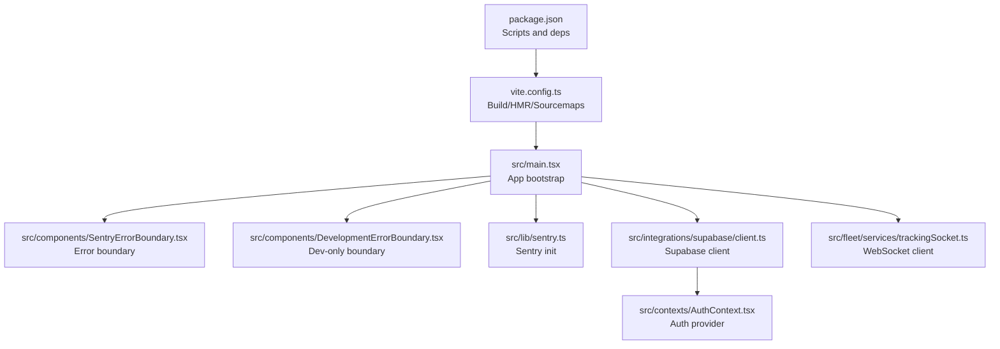
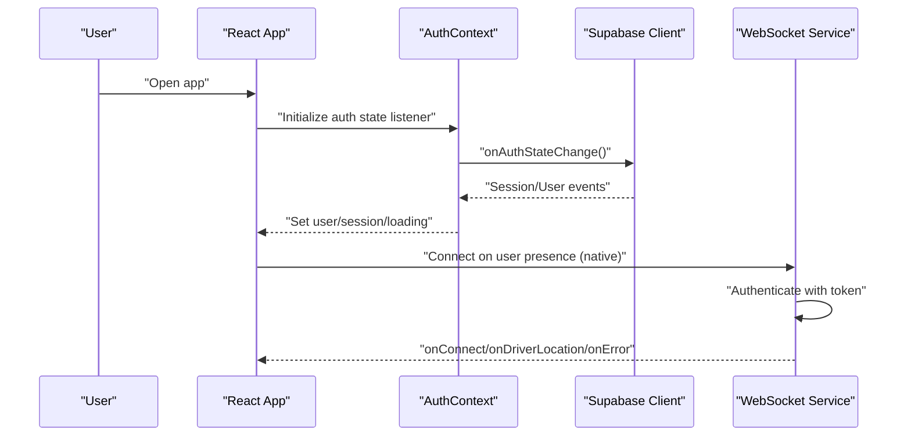
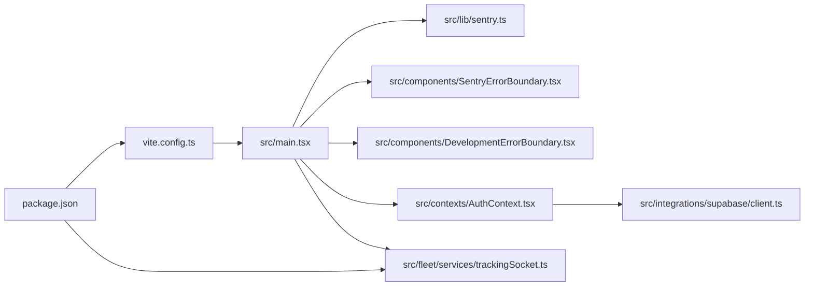

# Browser Development Tools

<cite>
**Referenced Files in This Document**
- [src/main.tsx](file://src/main.tsx)
- [src/components/SentryErrorBoundary.tsx](file://src/components/SentryErrorBoundary.tsx)
- [src/components/DevelopmentErrorBoundary.tsx](file://src/components/DevelopmentErrorBoundary.tsx)
- [src/lib/sentry.ts](file://src/lib/sentry.ts)
- [src/integrations/supabase/client.ts](file://src/integrations/supabase/client.ts)
- [src/contexts/AuthContext.tsx](file://src/contexts/AuthContext.tsx)
- [src/fleet/services/trackingSocket.ts](file://src/fleet/services/trackingSocket.ts)
- [vite.config.ts](file://vite.config.ts)
- [package.json](file://package.json)
- [websocket-server/package.json](file://websocket-server/package.json)
- [e2e/system/realtime.spec.ts](file://e2e/system/realtime.spec.ts)
- [scripts/performance-benchmark.ts](file://scripts/performance-benchmark.ts)
</cite>

## Table of Contents
1. [Introduction](#introduction)
2. [Project Structure](#project-structure)
3. [Core Components](#core-components)
4. [Architecture Overview](#architecture-overview)
5. [Detailed Component Analysis](#detailed-component-analysis)
6. [Dependency Analysis](#dependency-analysis)
7. [Performance Considerations](#performance-considerations)
8. [Troubleshooting Guide](#troubleshooting-guide)
9. [Conclusion](#conclusion)

## Introduction
This document explains how to use browser development tools to debug the Nutrio application effectively. It focuses on Chrome DevTools usage for DOM inspection, JavaScript debugging, breakpoint debugging, performance profiling, and network analysis. It also covers React Developer Tools integration for component inspection and state tracking, and provides guidance for debugging Supabase authentication, API connectivity, and WebSocket real-time data flows. Practical examples demonstrate how to diagnose common issues such as authentication failures, API connectivity problems, and component rendering issues.

## Project Structure
The application is a React 18 app built with Vite and deployed via Vercel or packaged for Capacitor mobile platforms. Key runtime concerns for debugging include:
- Application bootstrap and error boundaries
- Supabase authentication and session persistence
- Real-time WebSocket connections for fleet tracking
- Monitoring and analytics initialization
- Build configuration affecting source maps and HMR behavior

**Diagram sources**
- [src/main.tsx:1-50](file://src/main.tsx#L1-L50)
- [src/components/SentryErrorBoundary.tsx:1-77](file://src/components/SentryErrorBoundary.tsx#L1-L77)
- [src/components/DevelopmentErrorBoundary.tsx:70-96](file://src/components/DevelopmentErrorBoundary.tsx#L70-L96)
- [src/lib/sentry.ts:1-73](file://src/lib/sentry.ts#L1-L73)
- [src/integrations/supabase/client.ts:1-57](file://src/integrations/supabase/client.ts#L1-L57)
- [src/contexts/AuthContext.tsx:1-131](file://src/contexts/AuthContext.tsx#L1-L131)
- [src/fleet/services/trackingSocket.ts:36-124](file://src/fleet/services/trackingSocket.ts#L36-L124)
- [vite.config.ts:1-77](file://vite.config.ts#L1-L77)
- [package.json:1-159](file://package.json#L1-L159)

**Section sources**
- [src/main.tsx:1-50](file://src/main.tsx#L1-L50)
- [vite.config.ts:1-77](file://vite.config.ts#L1-L77)
- [package.json:1-159](file://package.json#L1-L159)

## Core Components
- Application bootstrap and error boundaries:
  - The root renders a language provider and wraps the app with Sentry and development error boundaries in development mode.
  - Sentry captures unhandled errors and optionally displays a friendly fallback.
  - DevelopmentErrorBoundary provides a developer-friendly UI when React errors occur during development.
- Supabase integration:
  - A custom storage adapter persists sessions in Capacitor Preferences for native builds and localStorage for web.
  - Authentication state changes are observed and used to manage user session and push notification initialization.
- WebSocket real-time service:
  - A WebSocket client connects with token authentication, logs lifecycle events, and handles driver location/status updates.
- Build and monitoring:
  - Vite configuration enables HMR, sourcemaps, and Sentry source map upload in production.
  - Scripts support development, building, previewing, testing, and E2E workflows.

**Section sources**
- [src/main.tsx:13-47](file://src/main.tsx#L13-L47)
- [src/components/SentryErrorBoundary.tsx:14-62](file://src/components/SentryErrorBoundary.tsx#L14-L62)
- [src/components/DevelopmentErrorBoundary.tsx:70-96](file://src/components/DevelopmentErrorBoundary.tsx#L70-L96)
- [src/lib/sentry.ts:3-37](file://src/lib/sentry.ts#L3-L37)
- [src/integrations/supabase/client.ts:18-57](file://src/integrations/supabase/client.ts#L18-L57)
- [src/contexts/AuthContext.tsx:36-61](file://src/contexts/AuthContext.tsx#L36-L61)
- [src/fleet/services/trackingSocket.ts:36-95](file://src/fleet/services/trackingSocket.ts#L36-L95)
- [vite.config.ts:8-40](file://vite.config.ts#L8-L40)
- [package.json:7-43](file://package.json#L7-L43)

## Architecture Overview
The following diagram maps the runtime flow for authentication and real-time updates, highlighting where to focus DevTools attention.

**Diagram sources**
- [src/contexts/AuthContext.tsx:36-61](file://src/contexts/AuthContext.tsx#L36-L61)
- [src/integrations/supabase/client.ts:47-57](file://src/integrations/supabase/client.ts#L47-L57)
- [src/fleet/services/trackingSocket.ts:36-95](file://src/fleet/services/trackingSocket.ts#L36-L95)

## Detailed Component Analysis

### Chrome DevTools: Elements Panel
- Purpose: Inspect DOM structure, styles, and attributes.
- When to use:
  - Investigating layout issues, missing elements, or unexpected styling.
  - Verifying dynamic class toggles or conditional rendering.
- Tips:
  - Use the “Event Listeners” panel to see bound handlers on nodes.
  - Toggle responsive mode to test mobile layouts.
  - Use the “Accessibility” tab to verify ARIA attributes and contrast.

[No sources needed since this section provides general guidance]

### Chrome DevTools: Console Tab
- Purpose: View logs, errors, and warnings; evaluate expressions; run commands.
- When to use:
  - Diagnosing runtime exceptions, missing environment variables, or failed API calls.
  - Inspecting Supabase client initialization messages and WebSocket lifecycle logs.
- Practical checks:
  - Look for Supabase configuration warnings indicating missing environment variables.
  - Search for “Connected”, “Disconnected”, or “Failed to parse message” in WebSocket logs.
  - Filter console by error/warning to quickly spot issues.

**Section sources**
- [src/integrations/supabase/client.ts:10-16](file://src/integrations/supabase/client.ts#L10-L16)
- [src/fleet/services/trackingSocket.ts:58-94](file://src/fleet/services/trackingSocket.ts#L58-L94)

### Chrome DevTools: Sources Tab (Breakpoint Debugging)
- Purpose: Pause execution, inspect variables, and step through code.
- When to use:
  - Tracing React error origins using error boundaries.
  - Stepping into Supabase auth flows and session handling.
  - Debugging WebSocket message parsing and event routing.
- Tips:
  - Enable “Pause on caught exceptions” for unhandled promise rejections.
  - Use conditional breakpoints on frequent events (e.g., onAuthStateChange).
  - Leverage “Async call stack” to follow promise chains.

**Section sources**
- [src/components/SentryErrorBoundary.tsx:19-33](file://src/components/SentryErrorBoundary.tsx#L19-L33)
- [src/contexts/AuthContext.tsx:36-61](file://src/contexts/AuthContext.tsx#L36-L61)
- [src/fleet/services/trackingSocket.ts:87-94](file://src/fleet/services/trackingSocket.ts#L87-L94)

### Chrome DevTools: Performance Tab (Profiling)
- Purpose: Capture CPU profiles, JS heap snapshots, and long task analysis.
- When to use:
  - Identifying performance bottlenecks in rendering or data fetching.
  - Analyzing memory growth during extended sessions.
- Tips:
  - Record a profile while reproducing slow actions (e.g., opening modals, switching tabs).
  - Use “Main” and “CPU” tracks to correlate long tasks with rendering or network work.
  - Take heap snapshots before and after actions to detect leaks.

[No sources needed since this section provides general guidance]

### React Developer Tools Integration
- Purpose: Inspect component tree, props, state, and hooks.
- When to use:
  - Verifying prop drilling issues, excessive re-renders, or incorrect state transitions.
  - Validating authentication state propagation through AuthContext.
- Tips:
  - Use the Profiler tab to record renders and identify hot components.
  - Toggle “Highlight updates” to visually track re-renders.
  - Inspect Suspense boundaries and lazy-loaded components.

[No sources needed since this section provides general guidance]

### Network Tab Analysis
- Purpose: Monitor API requests, WebSocket connections, and real-time data flow.
- When to use:
  - Debugging authentication failures, CORS errors, or missing tokens.
  - Validating WebSocket handshake, reconnection behavior, and message payloads.
- Practical checks:
  - Filter by XHR/Fetch to see REST-like calls; sort by domain to isolate Supabase traffic.
  - Observe WebSocket frames for subscribe messages and event payloads.
  - Check response bodies and headers for error details (e.g., invalid token).

**Section sources**
- [src/integrations/supabase/client.ts:47-57](file://src/integrations/supabase/client.ts#L47-L57)
- [src/fleet/services/trackingSocket.ts:36-95](file://src/fleet/services/trackingSocket.ts#L36-L95)

### Memory Profiling and Execution Analysis
- Purpose: Detect memory leaks, analyze garbage collection, and review JS execution.
- When to use:
  - Investigating increasing memory usage over time.
  - Reviewing long-running scripts and their impact on UI responsiveness.
- Tips:
  - Take allocation timelines and compare before/after navigation.
  - Use “Heap Snapshot” to locate retained objects and their retention paths.
  - Use Performance tab’s “Bottom-Up” and “Call Tree” views to find heavy functions.

[No sources needed since this section provides general guidance]

### Practical Debugging Scenarios

#### Authentication Failures
- Symptoms:
  - Login/signup does not complete; redirected without session.
  - Console shows IP-blocked messages or Supabase errors.
- DevTools steps:
  - Console: Search for Supabase-related errors and IP check warnings.
  - Network: Confirm auth endpoints succeed and cookies/localStorage entries are written.
  - Sources: Set breakpoints in sign-in/sign-up flows to inspect returned errors.
  - AuthContext: Verify onAuthStateChange emits expected events and session is persisted.

**Section sources**
- [src/contexts/AuthContext.tsx:63-112](file://src/contexts/AuthContext.tsx#L63-L112)
- [src/integrations/supabase/client.ts:10-16](file://src/integrations/supabase/client.ts#L10-L16)

#### API Connectivity Problems
- Symptoms:
  - Components hang on loading; no data appears.
  - Network tab shows failed requests or timeouts.
- DevTools steps:
  - Network: Filter by XHR/Fetch; check status codes and response bodies.
  - Console: Look for Supabase client warnings or missing environment variables.
  - Sources: Add breakpoints around data-fetching code to inspect thrown errors.
  - Vite/HMR: Ensure dev server is reachable and HMR overlay is not hiding errors.

**Section sources**
- [src/integrations/supabase/client.ts:10-16](file://src/integrations/supabase/client.ts#L10-L16)
- [vite.config.ts:12-27](file://vite.config.ts#L12-L27)

#### Component Rendering Issues
- Symptoms:
  - Unexpected blank screens, repeated reloads, or React errors.
  - Development vs production differences.
- DevTools steps:
  - React DevTools: Inspect component tree, props, and state; look for missing providers.
  - Console: Check for handled/unhandled errors captured by error boundaries.
  - Sources: Use error boundaries’ componentDidCatch to step into error-producing code.
  - DevelopmentErrorBoundary: In development, use the reload button to reset after fixes.

**Section sources**
- [src/components/SentryErrorBoundary.tsx:19-33](file://src/components/SentryErrorBoundary.tsx#L19-L33)
- [src/components/DevelopmentErrorBoundary.tsx:70-96](file://src/components/DevelopmentErrorBoundary.tsx#L70-L96)
- [src/main.tsx:25-37](file://src/main.tsx#L25-L37)

#### WebSocket Real-Time Data Flow
- Symptoms:
  - No live updates; connection drops or reconnects frequently.
  - Messages not parsed or routed.
- DevTools steps:
  - Network: Filter by WebSockets; verify handshake and subprotocols.
  - Console: Watch connection open/close/error logs and message parsing errors.
  - Sources: Add breakpoints in message handlers and event listeners.
  - E2E: Use Playwright tests to automate WebSocket verification scenarios.

**Section sources**
- [src/fleet/services/trackingSocket.ts:36-95](file://src/fleet/services/trackingSocket.ts#L36-L95)
- [e2e/system/realtime.spec.ts:1-37](file://e2e/system/realtime.spec.ts#L1-L37)

## Dependency Analysis
The following diagram highlights how runtime components depend on each other during startup and operation.

**Diagram sources**
- [vite.config.ts:1-77](file://vite.config.ts#L1-L77)
- [src/main.tsx:1-50](file://src/main.tsx#L1-L50)
- [src/lib/sentry.ts:1-73](file://src/lib/sentry.ts#L1-L73)
- [src/components/SentryErrorBoundary.tsx:1-77](file://src/components/SentryErrorBoundary.tsx#L1-L77)
- [src/components/DevelopmentErrorBoundary.tsx:70-96](file://src/components/DevelopmentErrorBoundary.tsx#L70-L96)
- [src/contexts/AuthContext.tsx:1-131](file://src/contexts/AuthContext.tsx#L1-L131)
- [src/integrations/supabase/client.ts:1-57](file://src/integrations/supabase/client.ts#L1-L57)
- [src/fleet/services/trackingSocket.ts:36-124](file://src/fleet/services/trackingSocket.ts#L36-L124)
- [package.json:1-159](file://package.json#L1-L159)

**Section sources**
- [vite.config.ts:1-77](file://vite.config.ts#L1-L77)
- [package.json:1-159](file://package.json#L1-L159)

## Performance Considerations
- Build and sourcemaps:
  - Production builds enable sourcemaps for error tracking; development disables console logging of captured errors.
  - HMR overlay is disabled to reduce interference during debugging.
- Monitoring:
  - Sentry is initialized in production with tracing and replay integrations; development disables Sentry to avoid noise.
- Benchmarks:
  - A performance benchmark utility computes averages, percentiles, and pass/fail criteria for targeted functions.

**Section sources**
- [vite.config.ts:52-64](file://vite.config.ts#L52-L64)
- [src/lib/sentry.ts:3-37](file://src/lib/sentry.ts#L3-L37)
- [scripts/performance-benchmark.ts:181-279](file://scripts/performance-benchmark.ts#L181-L279)

## Troubleshooting Guide
- Missing environment variables:
  - Supabase client logs warnings when URL or publishable key are missing; ensure environment variables are set in the build environment.
- Authentication issues:
  - Verify onAuthStateChange subscriptions and session persistence in localStorage/Capacitor Preferences.
  - Check IP location checks and their fallback behavior.
- WebSocket problems:
  - Confirm token-based authentication, subscribe messages, and message parsing.
  - Use console logs to trace connect/close/error events and scheduled reconnections.
- Error boundaries:
  - In development, DevelopmentErrorBoundary provides a reload option; in production, SentryErrorBoundary captures and displays a friendly fallback.

**Section sources**
- [src/integrations/supabase/client.ts:10-16](file://src/integrations/supabase/client.ts#L10-L16)
- [src/contexts/AuthContext.tsx:36-61](file://src/contexts/AuthContext.tsx#L36-L61)
- [src/fleet/services/trackingSocket.ts:36-95](file://src/fleet/services/trackingSocket.ts#L36-L95)
- [src/components/DevelopmentErrorBoundary.tsx:70-96](file://src/components/DevelopmentErrorBoundary.tsx#L70-L96)
- [src/components/SentryErrorBoundary.tsx:19-33](file://src/components/SentryErrorBoundary.tsx#L19-L33)

## Conclusion
Using Chrome DevTools alongside React Developer Tools and the application’s error boundaries and monitoring stack provides a robust debugging workflow. Focus on the Console for immediate feedback, Network for API/WebSocket diagnostics, Sources for stepping into problematic code, and Performance for identifying bottlenecks. For Supabase and WebSocket flows, combine DevTools observations with the provided integration points to isolate and resolve issues efficiently.