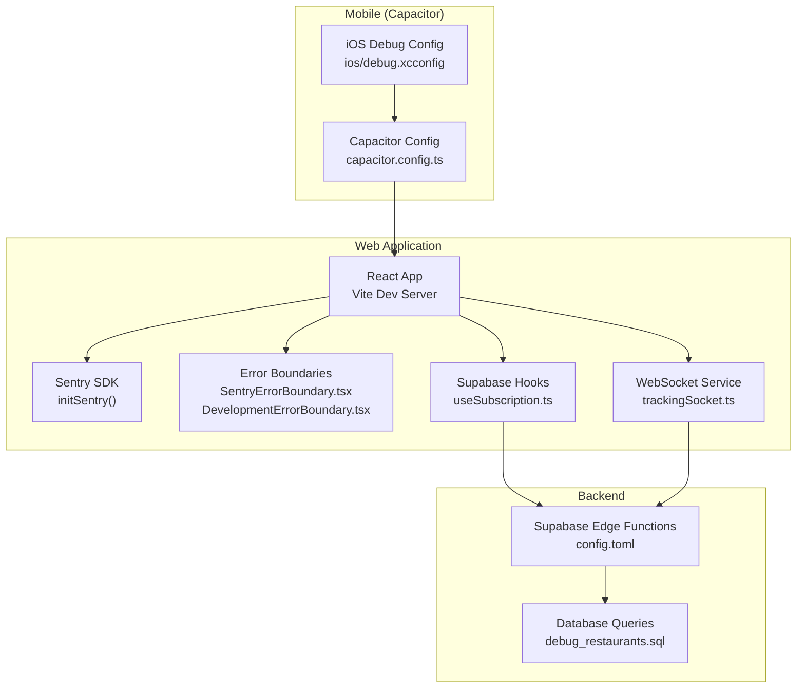
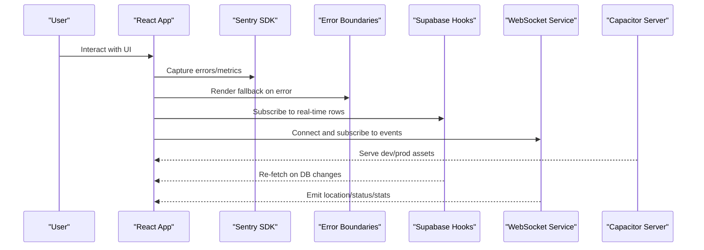
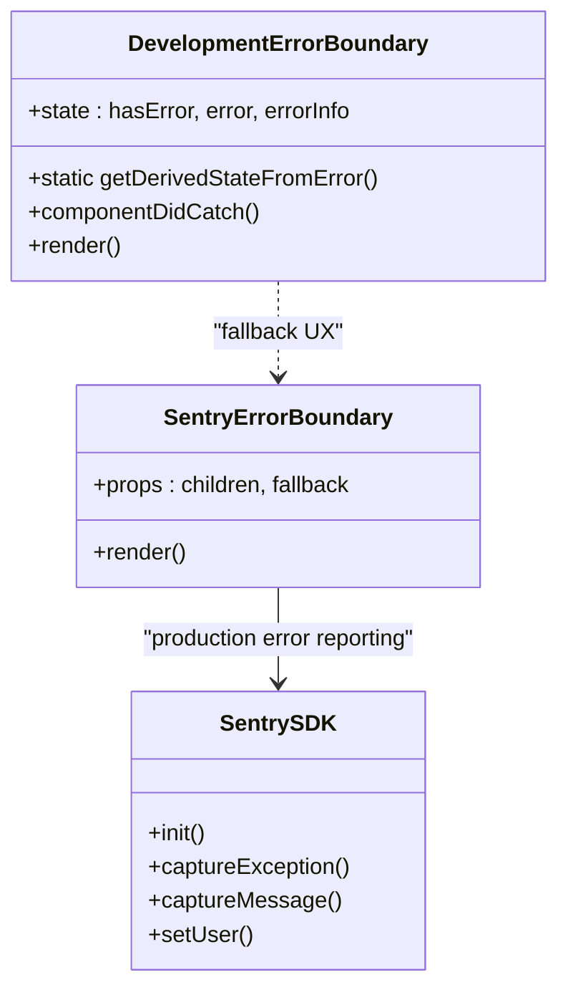
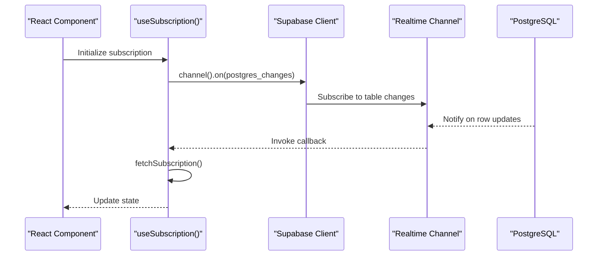
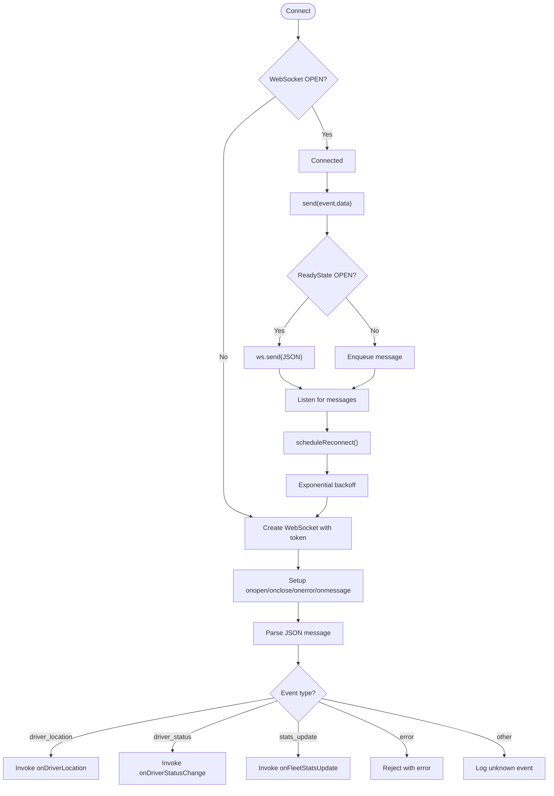
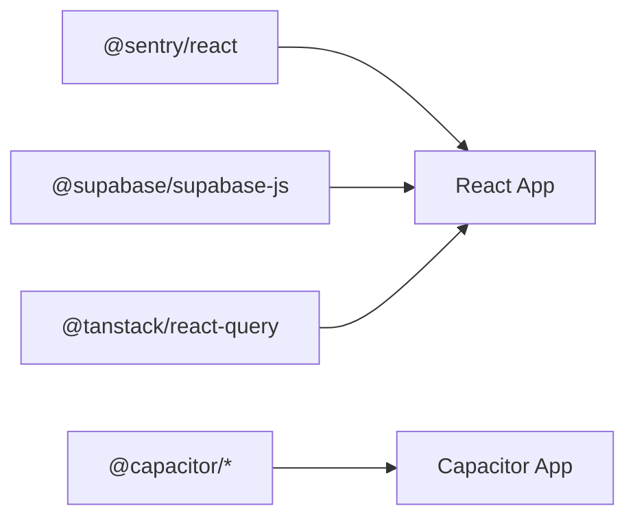

# Debugging Tools & Techniques

<cite>
**Referenced Files in This Document**
- [package.json](file://package.json)
- [capacitor.config.ts](file://capacitor.config.ts)
- [ios/debug.xcconfig](file://ios/debug.xcconfig)
- [src/lib/sentry.ts](file://src/lib/sentry.ts)
- [src/components/SentryErrorBoundary.tsx](file://src/components/SentryErrorBoundary.tsx)
- [src/components/DevelopmentErrorBoundary.tsx](file://src/components/DevelopmentErrorBoundary.tsx)
- [src/hooks/useSubscription.ts](file://src/hooks/useSubscription.ts)
- [src/fleet/services/trackingSocket.ts](file://src/fleet/services/trackingSocket.ts)
- [supabase/config.toml](file://supabase/config.toml)
- [debug_restaurants.sql](file://debug_restaurants.sql)
- [scripts/performance-benchmark.ts](file://scripts/performance-benchmark.ts)
- [e2e/system/performance.spec.ts](file://e2e/system/performance.spec.ts)
- [src/test/setup.ts](file://src/test/setup.ts)
</cite>

## Table of Contents
1. [Introduction](#introduction)
2. [Project Structure](#project-structure)
3. [Core Components](#core-components)
4. [Architecture Overview](#architecture-overview)
5. [Detailed Component Analysis](#detailed-component-analysis)
6. [Dependency Analysis](#dependency-analysis)
7. [Performance Considerations](#performance-considerations)
8. [Troubleshooting Guide](#troubleshooting-guide)
9. [Conclusion](#conclusion)
10. [Appendices](#appendices)

## Introduction
This document provides a comprehensive guide to debugging tools and techniques used in the Nutrio application. It covers browser developer tools usage, React-specific debugging, Supabase edge function and database debugging, mobile debugging for iOS and Android via Capacitor, network troubleshooting for API and WebSocket connections, and performance profiling methods for JavaScript, database queries, and mobile app performance.

## Project Structure
The project integrates several debugging and observability mechanisms:
- Browser-side error reporting and replay via Sentry
- React error boundaries for graceful degradation
- Supabase real-time subscriptions and edge functions
- Capacitor-based mobile app with debugging configuration
- End-to-end testing and performance benchmarking scripts



**Diagram sources**
- [src/lib/sentry.ts:1-73](file://src/lib/sentry.ts#L1-L73)
- [src/components/SentryErrorBoundary.tsx:48-76](file://src/components/SentryErrorBoundary.tsx#L48-L76)
- [src/components/DevelopmentErrorBoundary.tsx:1-96](file://src/components/DevelopmentErrorBoundary.tsx#L1-L96)
- [src/hooks/useSubscription.ts:100-134](file://src/hooks/useSubscription.ts#L100-L134)
- [src/fleet/services/trackingSocket.ts:36-214](file://src/fleet/services/trackingSocket.ts#L36-L214)
- [capacitor.config.ts:1-45](file://capacitor.config.ts#L1-L45)
- [ios/debug.xcconfig:1-2](file://ios/debug.xcconfig#L1-L2)
- [supabase/config.toml:1-59](file://supabase/config.toml#L1-L59)
- [debug_restaurants.sql:1-50](file://debug_restaurants.sql#L1-L50)

**Section sources**
- [package.json:1-159](file://package.json#L1-L159)
- [capacitor.config.ts:1-45](file://capacitor.config.ts#L1-L45)
- [ios/debug.xcconfig:1-2](file://ios/debug.xcconfig#L1-L2)
- [src/lib/sentry.ts:1-73](file://src/lib/sentry.ts#L1-L73)
- [src/components/SentryErrorBoundary.tsx:48-76](file://src/components/SentryErrorBoundary.tsx#L48-L76)
- [src/components/DevelopmentErrorBoundary.tsx:1-96](file://src/components/DevelopmentErrorBoundary.tsx#L1-L96)
- [src/hooks/useSubscription.ts:100-134](file://src/hooks/useSubscription.ts#L100-L134)
- [src/fleet/services/trackingSocket.ts:36-214](file://src/fleet/services/trackingSocket.ts#L36-L214)
- [supabase/config.toml:1-59](file://supabase/config.toml#L1-L59)
- [debug_restaurants.sql:1-50](file://debug_restaurants.sql#L1-L50)

## Core Components
- Sentry initialization and error capture for production environments
- React error boundaries for user-friendly error handling
- Supabase real-time subscriptions and visibility-based refetch
- WebSocket service for fleet tracking with reconnect logic
- Capacitor server configuration and iOS debug flag
- Supabase edge function configuration and database diagnostics

**Section sources**
- [src/lib/sentry.ts:1-73](file://src/lib/sentry.ts#L1-L73)
- [src/components/SentryErrorBoundary.tsx:48-76](file://src/components/SentryErrorBoundary.tsx#L48-L76)
- [src/components/DevelopmentErrorBoundary.tsx:1-96](file://src/components/DevelopmentErrorBoundary.tsx#L1-L96)
- [src/hooks/useSubscription.ts:100-134](file://src/hooks/useSubscription.ts#L100-L134)
- [src/fleet/services/trackingSocket.ts:36-214](file://src/fleet/services/trackingSocket.ts#L36-L214)
- [capacitor.config.ts:1-45](file://capacitor.config.ts#L1-L45)
- [ios/debug.xcconfig:1-2](file://ios/debug.xcconfig#L1-L2)
- [supabase/config.toml:1-59](file://supabase/config.toml#L1-L59)
- [debug_restaurants.sql:1-50](file://debug_restaurants.sql#L1-L50)

## Architecture Overview
The debugging architecture spans three layers:
- Frontend: React app with Sentry, error boundaries, Supabase hooks, and WebSocket service
- Backend: Supabase edge functions and database with real-time subscriptions
- Mobile: Capacitor configuration enabling development and debugging



**Diagram sources**
- [src/lib/sentry.ts:1-73](file://src/lib/sentry.ts#L1-L73)
- [src/components/SentryErrorBoundary.tsx:48-76](file://src/components/SentryErrorBoundary.tsx#L48-L76)
- [src/hooks/useSubscription.ts:100-134](file://src/hooks/useSubscription.ts#L100-L134)
- [src/fleet/services/trackingSocket.ts:36-214](file://src/fleet/services/trackingSocket.ts#L36-L214)
- [capacitor.config.ts:1-45](file://capacitor.config.ts#L1-L45)

## Detailed Component Analysis

### Browser Developer Tools and React DevTools
- Use React DevTools to inspect component trees, props, and state. Enable profiling to identify expensive renders.
- Network tab analysis:
  - Filter by XHR/Fetch to isolate API calls.
  - Inspect request/response payloads and timing.
  - Check for failed requests and CORS issues.
- Console debugging:
  - Use breakpoints and watch expressions.
  - Filter console output to focus on warnings and errors.
  - Leverage source maps for readable stack traces.

### React Error Boundaries and Sentry Integration
SentryErrorBoundary captures exceptions and forwards them to Sentry in production, while DevelopmentErrorBoundary provides a user-friendly fallback during development and hot reloading scenarios.



**Diagram sources**
- [src/components/SentryErrorBoundary.tsx:48-76](file://src/components/SentryErrorBoundary.tsx#L48-L76)
- [src/components/DevelopmentErrorBoundary.tsx:1-96](file://src/components/DevelopmentErrorBoundary.tsx#L1-L96)
- [src/lib/sentry.ts:1-73](file://src/lib/sentry.ts#L1-L73)

**Section sources**
- [src/components/SentryErrorBoundary.tsx:48-76](file://src/components/SentryErrorBoundary.tsx#L48-L76)
- [src/components/DevelopmentErrorBoundary.tsx:1-96](file://src/components/DevelopmentErrorBoundary.tsx#L1-L96)
- [src/lib/sentry.ts:1-73](file://src/lib/sentry.ts#L1-L73)

### Supabase Real-Time Subscriptions and Edge Functions
- Real-time subscriptions automatically re-fetch data when database rows change, ensuring UI stays synchronized.
- Visibility-based refetch ensures fresh data when the app returns to the foreground.
- Edge functions are configured in Supabase with JWT verification toggled per function.



**Diagram sources**
- [src/hooks/useSubscription.ts:100-134](file://src/hooks/useSubscription.ts#L100-L134)

**Section sources**
- [src/hooks/useSubscription.ts:100-134](file://src/hooks/useSubscription.ts#L100-L134)
- [supabase/config.toml:1-59](file://supabase/config.toml#L1-L59)

### WebSocket Service for Fleet Tracking
The WebSocket service manages connection lifecycle, message parsing, and reconnection logic. It emits events for driver locations, statuses, and fleet statistics.



**Diagram sources**
- [src/fleet/services/trackingSocket.ts:36-214](file://src/fleet/services/trackingSocket.ts#L36-L214)
- [src/fleet/services/trackingSocket.ts:251-286](file://src/fleet/services/trackingSocket.ts#L251-L286)

**Section sources**
- [src/fleet/services/trackingSocket.ts:36-214](file://src/fleet/services/trackingSocket.ts#L36-L214)
- [src/fleet/services/trackingSocket.ts:251-286](file://src/fleet/services/trackingSocket.ts#L251-L286)

### Mobile Debugging (iOS and Android via Capacitor)
- Capacitor server configuration allows development navigation and HTTPS scheme for Android.
- iOS debug flag enables Capacitor debug mode for native bridge communication inspection.
- Use Capacitor CLI commands to sync and open platforms for device testing.

```mermaid
sequenceDiagram
participant Dev as "Developer"
participant CLI as "Capacitor CLI"
participant Web as "Web Build"
participant IOS as "iOS Simulator"
participant AND as "Android Emulator"
Dev->>CLI : cap sync / cap open
CLI->>Web : Build assets
CLI->>IOS : Deploy to simulator
CLI->>AND : Deploy to emulator
IOS-->>Dev : Debug bridge logs
AND-->>Dev : Debug bridge logs
```

**Diagram sources**
- [capacitor.config.ts:1-45](file://capacitor.config.ts#L1-L45)
- [ios/debug.xcconfig:1-2](file://ios/debug.xcconfig#L1-L2)
- [package.json:20-26](file://package.json#L20-L26)

**Section sources**
- [capacitor.config.ts:1-45](file://capacitor.config.ts#L1-L45)
- [ios/debug.xcconfig:1-2](file://ios/debug.xcconfig#L1-L2)
- [package.json:20-26](file://package.json#L20-L26)

### Network Troubleshooting (API Connectivity, WebSocket, Real-time)
- API connectivity:
  - Use the Network tab to verify endpoint reachability and response codes.
  - Inspect request headers and cookies for authentication.
- WebSocket connections:
  - Confirm token inclusion and URL correctness.
  - Monitor onopen/onerror/onclose events and message parsing.
- Real-time data synchronization:
  - Validate Supabase channel filters and event triggers.
  - Ensure visibility-based refetch does not cause excessive polling.

**Section sources**
- [src/fleet/services/trackingSocket.ts:36-214](file://src/fleet/services/trackingSocket.ts#L36-L214)
- [src/hooks/useSubscription.ts:100-134](file://src/hooks/useSubscription.ts#L100-L134)

### Performance Profiling Methods
- JavaScript performance:
  - Use React DevTools Profiler to detect slow components.
  - Measure API response times and hydration durations.
- Database query analysis:
  - Use the provided diagnostic SQL to check table counts, roles, and RLS policies.
- Mobile performance:
  - Use Capacitor debug builds and platform profilers.
  - Benchmark critical paths with the performance benchmark script.

**Section sources**
- [debug_restaurants.sql:1-50](file://debug_restaurants.sql#L1-L50)
- [scripts/performance-benchmark.ts:181-279](file://scripts/performance-benchmark.ts#L181-L279)
- [e2e/system/performance.spec.ts:114-127](file://e2e/system/performance.spec.ts#L114-L127)

## Dependency Analysis
Key dependencies and their roles in debugging:
- Sentry SDK for error reporting and session replay
- Supabase client for real-time subscriptions
- React Query for caching and invalidation
- Capacitor for mobile bridging and debugging



**Diagram sources**
- [package.json:44-126](file://package.json#L44-L126)

**Section sources**
- [package.json:44-126](file://package.json#L44-L126)

## Performance Considerations
- Minimize unnecessary re-renders by isolating state and using memoization.
- Debounce or throttle frequent network requests.
- Use Supabase’s real-time channels judiciously to avoid over-subscription.
- Profile mobile app startup and navigation transitions using Capacitor debug builds.

## Troubleshooting Guide
- React errors:
  - Use DevelopmentErrorBoundary to recover from hot module replacement errors.
  - Capture and report production errors via SentryErrorBoundary and Sentry SDK.
- Supabase issues:
  - Verify edge function JWT verification settings.
  - Run diagnostic queries to confirm table data and RLS policies.
- WebSocket problems:
  - Inspect connection logs and message parsing errors.
  - Confirm reconnection attempts and exponential backoff behavior.
- Console noise in tests:
  - Filter expected warnings during test runs to focus on actionable errors.

**Section sources**
- [src/components/DevelopmentErrorBoundary.tsx:1-96](file://src/components/DevelopmentErrorBoundary.tsx#L1-L96)
- [src/components/SentryErrorBoundary.tsx:48-76](file://src/components/SentryErrorBoundary.tsx#L48-L76)
- [src/lib/sentry.ts:1-73](file://src/lib/sentry.ts#L1-L73)
- [supabase/config.toml:1-59](file://supabase/config.toml#L1-L59)
- [debug_restaurants.sql:1-50](file://debug_restaurants.sql#L1-L50)
- [src/fleet/services/trackingSocket.ts:36-214](file://src/fleet/services/trackingSocket.ts#L36-L214)
- [src/test/setup.ts:52-69](file://src/test/setup.ts#L52-L69)

## Conclusion
The Nutrio application leverages a robust set of debugging and observability tools spanning the browser, backend, and mobile layers. By combining React DevTools, Sentry, Supabase real-time subscriptions, and Capacitor debugging, developers can efficiently diagnose and resolve issues across the stack. Use the provided scripts and configurations to profile performance and maintain high-quality user experiences.

## Appendices
- Useful scripts and commands:
  - Development and build: [package.json:7-18](file://package.json#L7-L18)
  - Capacitor commands: [package.json:20-26](file://package.json#L20-L26)
  - E2E test commands: [package.json:27-42](file://package.json#L27-L42)
- Diagnostics:
  - Supabase edge function settings: [supabase/config.toml:1-59](file://supabase/config.toml#L1-L59)
  - Database diagnostics: [debug_restaurants.sql:1-50](file://debug_restaurants.sql#L1-L50)
  - Performance benchmarking: [scripts/performance-benchmark.ts:181-279](file://scripts/performance-benchmark.ts#L181-L279)
  - E2E performance spec: [e2e/system/performance.spec.ts:114-127](file://e2e/system/performance.spec.ts#L114-L127)