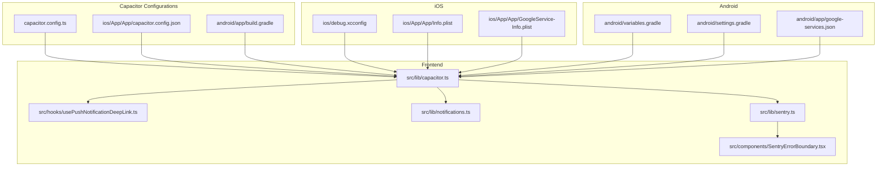
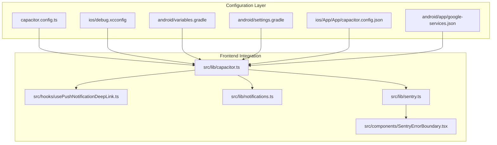
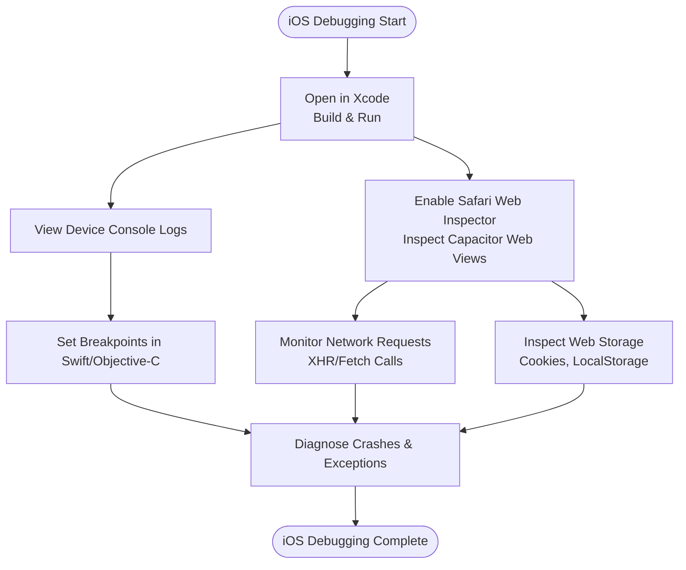
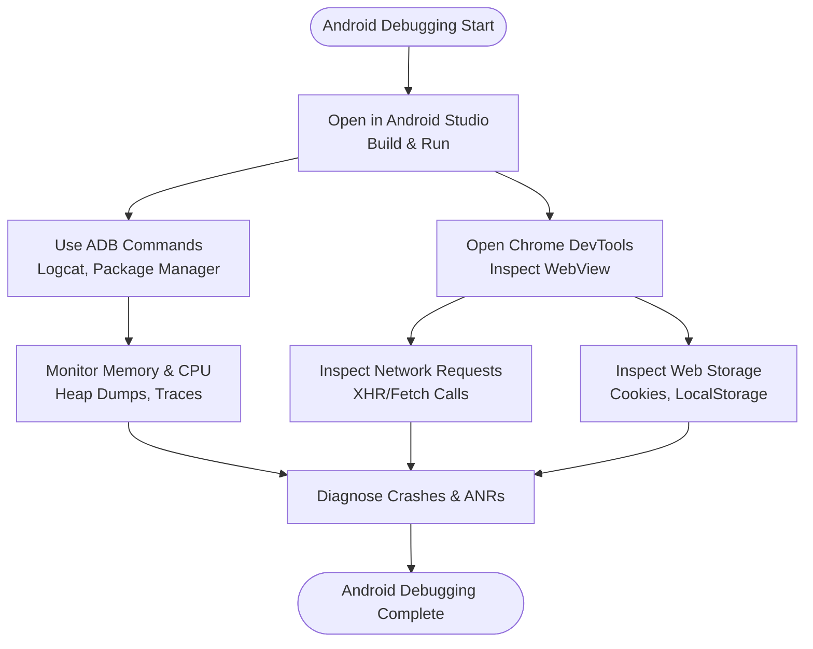
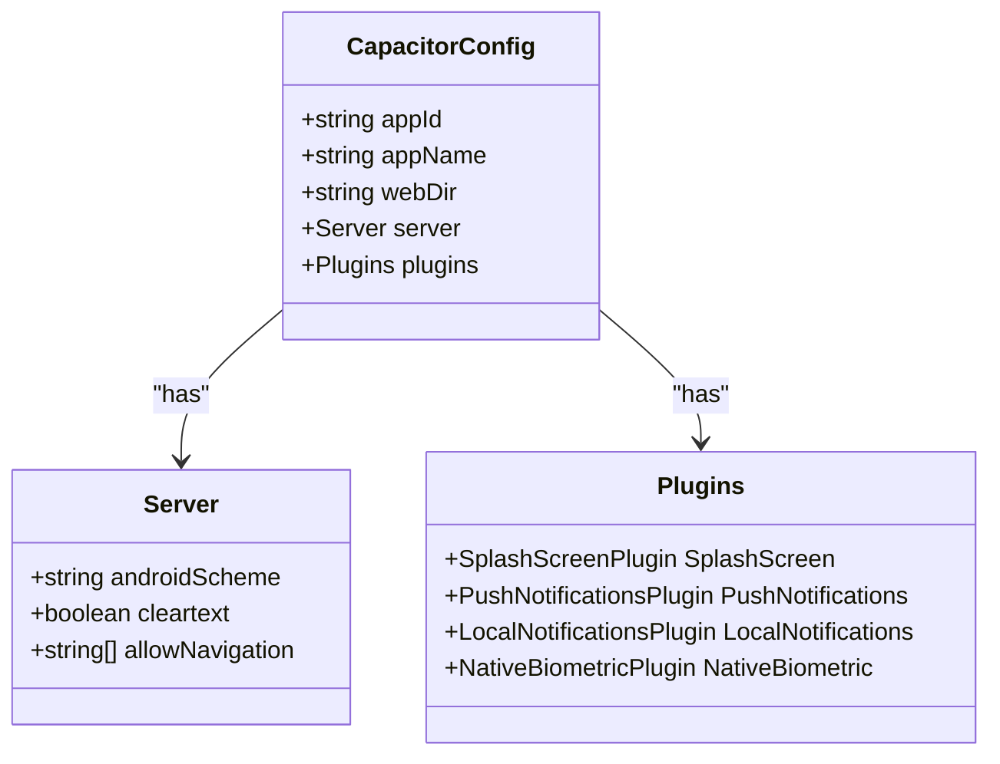
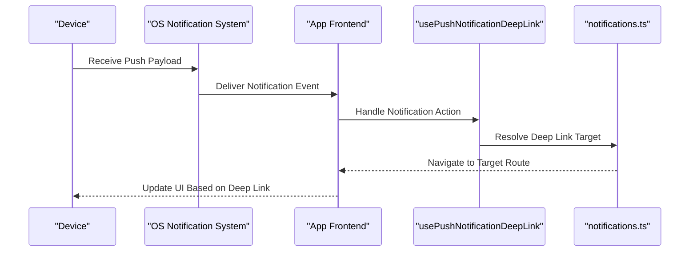
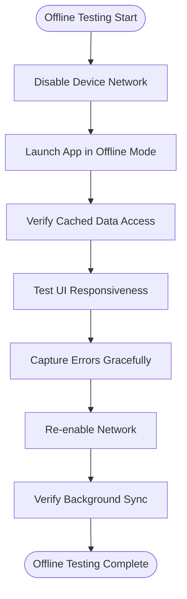
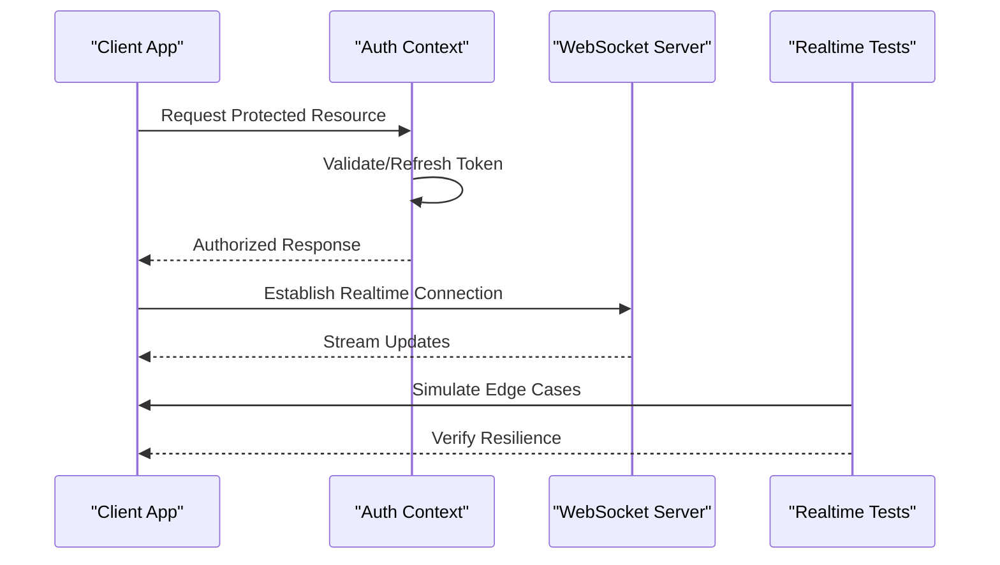
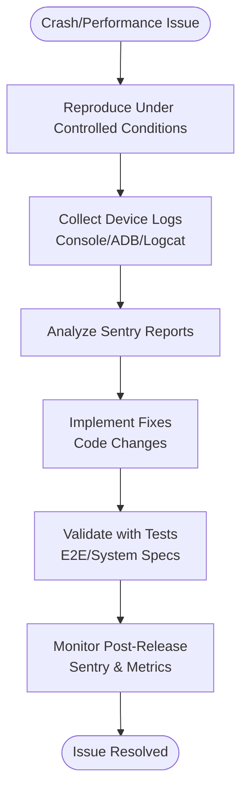
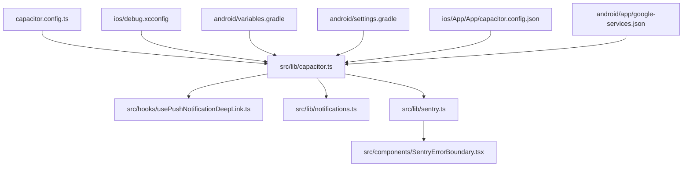

# Mobile Debugging

<cite>
**Referenced Files in This Document**
- [capacitor.config.ts](file://capacitor.config.ts)
- [ios/debug.xcconfig](file://ios/debug.xcconfig)
- [android/app/build.gradle](file://android/app/build.gradle)
- [android/variables.gradle](file://android/variables.gradle)
- [android/settings.gradle](file://android/settings.gradle)
- [android/app/google-services.json](file://android/app/google-services.json)
- [ios/App/App/capacitor.config.json](file://ios/App/App/capacitor.config.json)
- [ios/App/App/Info.plist](file://ios/App/App/Info.plist)
- [ios/App/App/GoogleService-Info.plist](file://ios/App/App/GoogleService-Info.plist)
- [src/lib/capacitor.ts](file://src/lib/capacitor.ts)
- [src/hooks/usePushNotificationDeepLink.ts](file://src/hooks/usePushNotificationDeepLink.ts)
- [src/lib/notifications.ts](file://src/lib/notifications.ts)
- [src/lib/sentry.ts](file://src/lib/sentry.ts)
- [src/components/SentryErrorBoundary.tsx](file://src/components/SentryErrorBoundary.tsx)
- [src/components/DevelopmentErrorBoundary.tsx](file://src/components/DevelopmentErrorBoundary.tsx)
- [e2e/system/mobile.spec.ts](file://e2e/system/mobile.spec.ts)
- [e2e/customer/mobile.spec.ts](file://e2e/customer/mobile.spec.ts)
- [e2e/system/realtime.spec.ts](file://e2e/system/realtime.spec.ts)
- [e2e/system/performance.spec.ts](file://e2e/system/performance.spec.ts)
- [e2e/system/integration.spec.ts](file://e2e/system/integration.spec.ts)
- [playwright.config.ts](file://playwright.config.ts)
</cite>

## Table of Contents
1. [Introduction](#introduction)
2. [Project Structure](#project-structure)
3. [Core Components](#core-components)
4. [Architecture Overview](#architecture-overview)
5. [Detailed Component Analysis](#detailed-component-analysis)
6. [Dependency Analysis](#dependency-analysis)
7. [Performance Considerations](#performance-considerations)
8. [Troubleshooting Guide](#troubleshooting-guide)
9. [Conclusion](#conclusion)

## Introduction
This document provides comprehensive mobile debugging guidance for the Nutrio iOS and Android applications. It covers platform-specific debugging techniques, Capacitor plugin debugging, push notification and background sync diagnostics, offline functionality testing, crash and performance troubleshooting, and practical examples for authentication and real-time updates. The content is grounded in the repository's configuration files and source code to ensure accuracy and actionable steps.

## Project Structure
The mobile application is built with Capacitor, serving a web-based frontend while integrating native capabilities. The key configuration and debugging-related files are organized as follows:
- Capacitor configuration defines app identity, server behavior, and plugin settings for both platforms.
- iOS configuration includes debug flags and Firebase/GCM integration via plist files.
- Android configuration includes build variants, SDK versions, and Google Services integration for push notifications.
- Frontend libraries and hooks manage Capacitor integration, push notifications, and error reporting.

**Diagram sources**
- [capacitor.config.ts:1-45](file://capacitor.config.ts#L1-L45)
- [ios/App/App/capacitor.config.json](file://ios/App/App/capacitor.config.json)
- [android/app/build.gradle:1-75](file://android/app/build.gradle#L1-L75)
- [ios/debug.xcconfig:1-2](file://ios/debug.xcconfig#L1-L2)
- [ios/App/App/Info.plist](file://ios/App/App/Info.plist)
- [ios/App/App/GoogleService-Info.plist](file://ios/App/App/GoogleService-Info.plist)
- [android/variables.gradle:1-16](file://android/variables.gradle#L1-L16)
- [android/settings.gradle:1-5](file://android/settings.gradle#L1-L5)
- [android/app/google-services.json:1-29](file://android/app/google-services.json#L1-L29)
- [src/lib/capacitor.ts](file://src/lib/capacitor.ts)
- [src/hooks/usePushNotificationDeepLink.ts](file://src/hooks/usePushNotificationDeepLink.ts)
- [src/lib/notifications.ts](file://src/lib/notifications.ts)
- [src/lib/sentry.ts](file://src/lib/sentry.ts)
- [src/components/SentryErrorBoundary.tsx](file://src/components/SentryErrorBoundary.tsx)

**Section sources**
- [capacitor.config.ts:1-45](file://capacitor.config.ts#L1-L45)
- [ios/debug.xcconfig:1-2](file://ios/debug.xcconfig#L1-L2)
- [android/app/build.gradle:1-75](file://android/app/build.gradle#L1-L75)
- [android/variables.gradle:1-16](file://android/variables.gradle#L1-L16)
- [android/settings.gradle:1-5](file://android/settings.gradle#L1-L5)
- [android/app/google-services.json:1-29](file://android/app/google-services.json#L1-L29)
- [ios/App/App/capacitor.config.json](file://ios/App/App/capacitor.config.json)
- [ios/App/App/Info.plist](file://ios/App/App/Info.plist)
- [ios/App/App/GoogleService-Info.plist](file://ios/App/App/GoogleService-Info.plist)

## Core Components
This section outlines the primary components involved in mobile debugging and their roles:
- Capacitor configuration: Defines app identifiers, server settings, and plugin configurations for iOS and Android.
- iOS debug configuration: Enables Capacitor debug mode for development builds.
- Android build configuration: Manages SDK versions, build types, and Google Services integration.
- Frontend integration libraries: Provide Capacitor initialization, push notification deep linking, notification utilities, and error reporting.

Key responsibilities:
- Capacitor configuration controls network policies, plugin behavior, and splash screen settings.
- iOS debug flag enables developer tools integration during development.
- Android build variants and Google Services JSON enable push notifications and Firebase integration.
- Frontend libraries centralize Capacitor usage, push handling, and error boundary reporting.

**Section sources**
- [capacitor.config.ts:1-45](file://capacitor.config.ts#L1-L45)
- [ios/debug.xcconfig:1-2](file://ios/debug.xcconfig#L1-L2)
- [android/app/build.gradle:1-75](file://android/app/build.gradle#L1-L75)
- [android/variables.gradle:1-16](file://android/variables.gradle#L1-L16)
- [android/settings.gradle:1-5](file://android/settings.gradle#L1-L5)
- [android/app/google-services.json:1-29](file://android/app/google-services.json#L1-L29)
- [src/lib/capacitor.ts](file://src/lib/capacitor.ts)
- [src/hooks/usePushNotificationDeepLink.ts](file://src/hooks/usePushNotificationDeepLink.ts)
- [src/lib/notifications.ts](file://src/lib/notifications.ts)
- [src/lib/sentry.ts](file://src/lib/sentry.ts)
- [src/components/SentryErrorBoundary.tsx](file://src/components/SentryErrorBoundary.tsx)

## Architecture Overview
The mobile architecture integrates a web-based frontend with native platform capabilities through Capacitor. The following diagram illustrates the relationship between configuration files, platform-specific settings, and frontend libraries.

**Diagram sources**
- [capacitor.config.ts:1-45](file://capacitor.config.ts#L1-L45)
- [ios/debug.xcconfig:1-2](file://ios/debug.xcconfig#L1-L2)
- [android/variables.gradle:1-16](file://android/variables.gradle#L1-L16)
- [android/settings.gradle:1-5](file://android/settings.gradle#L1-L5)
- [ios/App/App/capacitor.config.json](file://ios/App/App/capacitor.config.json)
- [android/app/google-services.json:1-29](file://android/app/google-services.json#L1-L29)
- [src/lib/capacitor.ts](file://src/lib/capacitor.ts)
- [src/hooks/usePushNotificationDeepLink.ts](file://src/hooks/usePushNotificationDeepLink.ts)
- [src/lib/notifications.ts](file://src/lib/notifications.ts)
- [src/lib/sentry.ts](file://src/lib/sentry.ts)
- [src/components/SentryErrorBoundary.tsx](file://src/components/SentryErrorBoundary.tsx)

## Detailed Component Analysis

### iOS Debugging Setup
iOS debugging leverages Xcode, Safari Web Inspector for Capacitor web views, and device console logs. The debug configuration enables Capacitor debug mode for development builds.

Practical steps:
- Build and run the iOS project in Xcode to enable breakpoints and live debugging.
- Use Safari's Develop menu to inspect Capacitor web views and monitor network activity.
- Capture device console logs for runtime exceptions and warnings.
- Verify Capacitor debug mode via the iOS debug configuration file.

**Section sources**
- [ios/debug.xcconfig:1-2](file://ios/debug.xcconfig#L1-L2)
- [ios/App/App/Info.plist](file://ios/App/App/Info.plist)
- [ios/App/App/GoogleService-Info.plist](file://ios/App/App/GoogleService-Info.plist)

### Android Debugging Setup
Android debugging utilizes Android Studio, ADB commands, and Chrome DevTools for WebView inspection. The build configuration supports debug and release variants with Google Services integration.

Practical steps:
- Build and run the Android project in Android Studio for debugging.
- Use ADB logcat to capture device logs and diagnose runtime issues.
- Open Chrome DevTools to inspect Capacitor WebView and monitor network/storage.
- Enable verbose logging for memory and performance profiling.

**Section sources**
- [android/app/build.gradle:1-75](file://android/app/build.gradle#L1-L75)
- [android/variables.gradle:1-16](file://android/variables.gradle#L1-L16)
- [android/settings.gradle:1-5](file://android/settings.gradle#L1-L5)
- [android/app/google-services.json:1-29](file://android/app/google-services.json#L1-L29)

### Capacitor Plugin Debugging
Capacitor plugin configuration affects native feature integration and WebView behavior. The configuration includes splash screen, push notifications, local notifications, and native biometric settings.

Debugging tips:
- Validate plugin configurations in the Capacitor config file.
- Test native feature integration (biometrics, notifications) in isolation.
- Confirm WebView navigation policies and server settings for development/proxy scenarios.
- Use platform-specific debug flags and logging to trace plugin behavior.

**Diagram sources**
- [capacitor.config.ts:1-45](file://capacitor.config.ts#L1-L45)

**Section sources**
- [capacitor.config.ts:1-45](file://capacitor.config.ts#L1-L45)
- [ios/App/App/capacitor.config.json](file://ios/App/App/capacitor.config.json)

### Push Notification Debugging
Push notifications rely on Google Services configuration on Android and platform-specific settings on iOS. The frontend handles deep links and notification lifecycle.

Practical steps:
- Verify Google Services JSON and Firebase configuration on Android.
- Confirm iOS push certificate and entitlements for APNs.
- Test notification delivery and deep link resolution in the frontend hook.
- Monitor notification lifecycle and error handling in the notifications library.

**Diagram sources**
- [android/app/google-services.json:1-29](file://android/app/google-services.json#L1-L29)
- [ios/App/App/GoogleService-Info.plist](file://ios/App/App/GoogleService-Info.plist)
- [src/hooks/usePushNotificationDeepLink.ts](file://src/hooks/usePushNotificationDeepLink.ts)
- [src/lib/notifications.ts](file://src/lib/notifications.ts)

**Section sources**
- [android/app/google-services.json:1-29](file://android/app/google-services.json#L1-L29)
- [ios/App/App/GoogleService-Info.plist](file://ios/App/App/GoogleService-Info.plist)
- [src/hooks/usePushNotificationDeepLink.ts](file://src/hooks/usePushNotificationDeepLink.ts)
- [src/lib/notifications.ts](file://src/lib/notifications.ts)

### Offline Functionality Testing
Offline testing ensures the app behaves correctly when network connectivity is unavailable. The testing suite includes dedicated mobile and system tests.

Practical steps:
- Use device airplane mode or network toggles to simulate offline scenarios.
- Verify cached data retrieval and UI behavior without network.
- Confirm graceful error handling and retry mechanisms.
- After re-enabling network, validate background sync and data reconciliation.

**Section sources**
- [e2e/system/mobile.spec.ts](file://e2e/system/mobile.spec.ts)
- [e2e/customer/mobile.spec.ts](file://e2e/customer/mobile.spec.ts)

### Authentication and Real-Time Updates Debugging
Authentication and real-time updates require careful debugging of session handling, token refresh, and WebSocket connections. The testing suite includes dedicated specs for these areas.

Practical steps:
- Verify token validation and refresh logic in the authentication context.
- Inspect WebSocket connection establishment and message handling.
- Use Playwright tests to simulate edge cases and measure resilience.
- Monitor network conditions and connection recovery behavior.

**Section sources**
- [e2e/system/realtime.spec.ts](file://e2e/system/realtime.spec.ts)
- [playwright.config.ts](file://playwright.config.ts)

### Crash and Performance Troubleshooting
Crash and performance issues are mitigated through error boundaries, Sentry integration, and performance monitoring. The frontend includes dedicated components and libraries for robust error handling.

Practical steps:
- Use device logs and ADB/logcat to capture stack traces and performance metrics.
- Review Sentry reports for crash patterns and error frequencies.
- Implement fixes and validate with E2E and system tests.
- Monitor post-release stability and performance regressions.

**Section sources**
- [src/lib/sentry.ts](file://src/lib/sentry.ts)
- [src/components/SentryErrorBoundary.tsx](file://src/components/SentryErrorBoundary.tsx)
- [src/components/DevelopmentErrorBoundary.tsx](file://src/components/DevelopmentErrorBoundary.tsx)
- [e2e/system/performance.spec.ts](file://e2e/system/performance.spec.ts)

## Dependency Analysis
The following diagram shows the relationships among configuration files, platform settings, and frontend libraries that impact mobile debugging.

**Diagram sources**
- [capacitor.config.ts:1-45](file://capacitor.config.ts#L1-L45)
- [ios/debug.xcconfig:1-2](file://ios/debug.xcconfig#L1-L2)
- [android/variables.gradle:1-16](file://android/variables.gradle#L1-L16)
- [android/settings.gradle:1-5](file://android/settings.gradle#L1-L5)
- [ios/App/App/capacitor.config.json](file://ios/App/App/capacitor.config.json)
- [android/app/google-services.json:1-29](file://android/app/google-services.json#L1-L29)
- [src/lib/capacitor.ts](file://src/lib/capacitor.ts)
- [src/hooks/usePushNotificationDeepLink.ts](file://src/hooks/usePushNotificationDeepLink.ts)
- [src/lib/notifications.ts](file://src/lib/notifications.ts)
- [src/lib/sentry.ts](file://src/lib/sentry.ts)
- [src/components/SentryErrorBoundary.tsx](file://src/components/SentryErrorBoundary.tsx)

**Section sources**
- [capacitor.config.ts:1-45](file://capacitor.config.ts#L1-L45)
- [ios/debug.xcconfig:1-2](file://ios/debug.xcconfig#L1-L2)
- [android/variables.gradle:1-16](file://android/variables.gradle#L1-L16)
- [android/settings.gradle:1-5](file://android/settings.gradle#L1-L5)
- [ios/App/App/capacitor.config.json](file://ios/App/App/capacitor.config.json)
- [android/app/google-services.json:1-29](file://android/app/google-services.json#L1-L29)
- [src/lib/capacitor.ts](file://src/lib/capacitor.ts)
- [src/hooks/usePushNotificationDeepLink.ts](file://src/hooks/usePushNotificationDeepLink.ts)
- [src/lib/notifications.ts](file://src/lib/notifications.ts)
- [src/lib/sentry.ts](file://src/lib/sentry.ts)
- [src/components/SentryErrorBoundary.tsx](file://src/components/SentryErrorBoundary.tsx)

## Performance Considerations
- Enable debug builds with logging for development and disable excessive logging in production.
- Use WebView inspection to identify slow network requests and large payloads.
- Monitor memory usage with ADB/Chrome DevTools and optimize resource-heavy operations.
- Validate background sync and offline caching strategies under realistic network conditions.
- Leverage performance tests to detect regressions after feature updates.

## Troubleshooting Guide
Common issues and resolutions:
- App crashes: Collect device logs, review Sentry reports, and reproduce with minimal test cases.
- Memory leaks: Use heap dumps and memory profilers to identify retained references.
- Performance bottlenecks: Profile CPU and memory usage, optimize rendering, and reduce unnecessary network calls.
- Authentication failures: Verify token handling, network connectivity, and backend service availability.
- Real-time updates: Check WebSocket connectivity, message parsing, and error handling.
- Push notifications: Validate Google Services configuration on Android and APNs settings on iOS.

**Section sources**
- [src/lib/sentry.ts](file://src/lib/sentry.ts)
- [src/components/SentryErrorBoundary.tsx](file://src/components/SentryErrorBoundary.tsx)
- [e2e/system/performance.spec.ts](file://e2e/system/performance.spec.ts)
- [e2e/system/realtime.spec.ts](file://e2e/system/realtime.spec.ts)
- [e2e/system/integration.spec.ts](file://e2e/system/integration.spec.ts)

## Conclusion
This guide consolidates practical debugging techniques for the Nutrio iOS and Android applications. By leveraging platform-specific tools, validating Capacitor configurations, and utilizing frontend libraries for error reporting and push handling, teams can efficiently diagnose and resolve mobile-specific issues. The included diagrams and references to repository files provide a clear roadmap for effective debugging workflows.