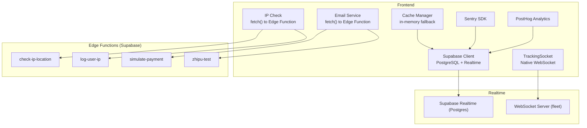
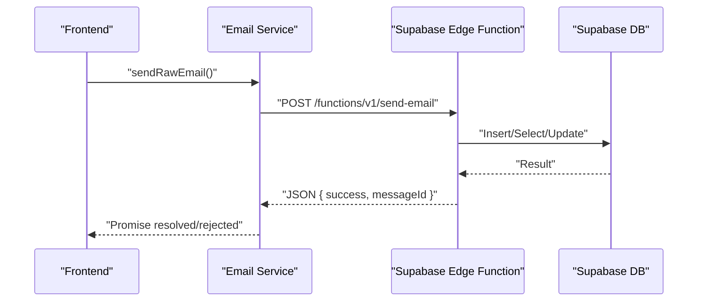
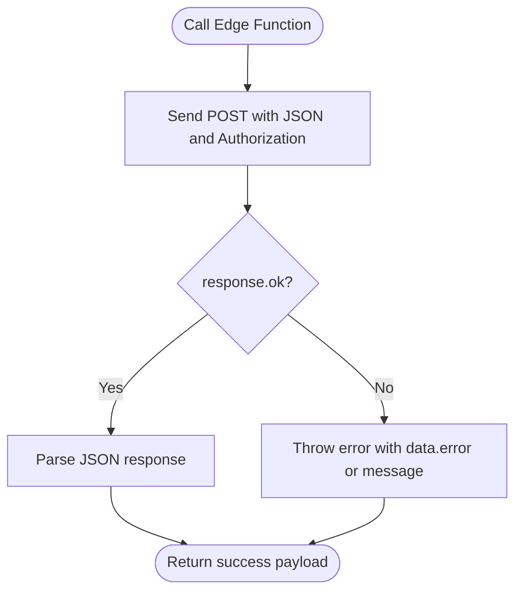
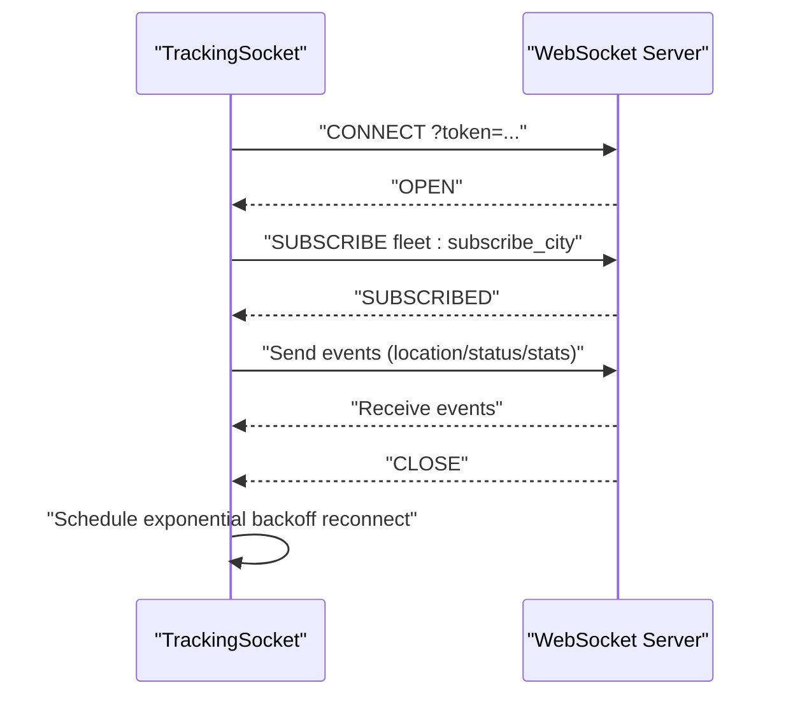
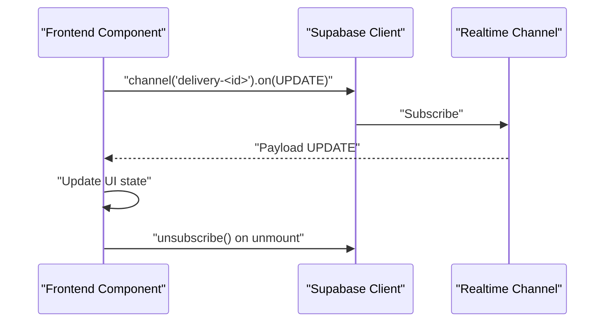
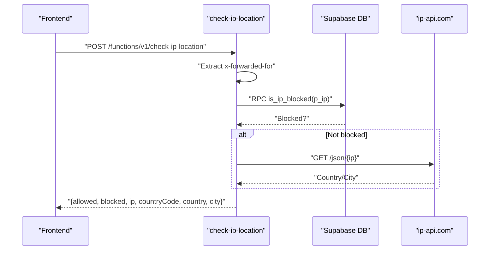
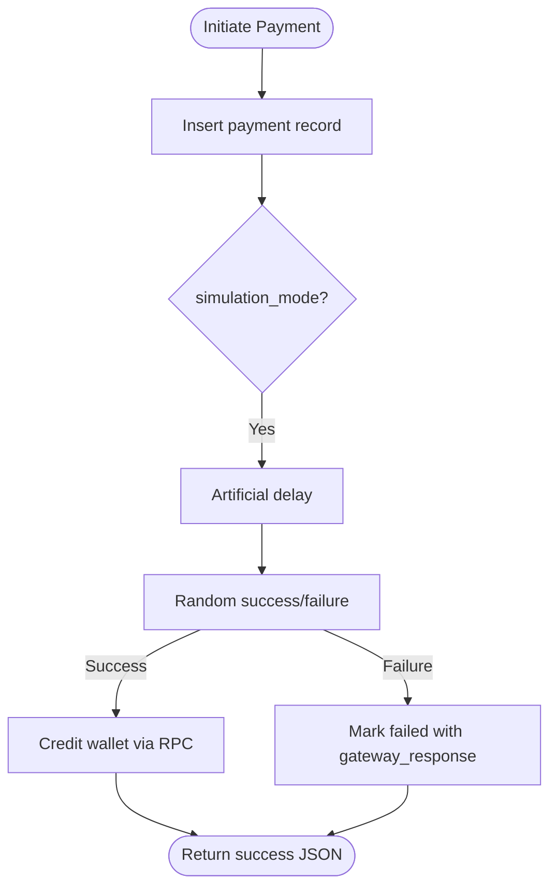
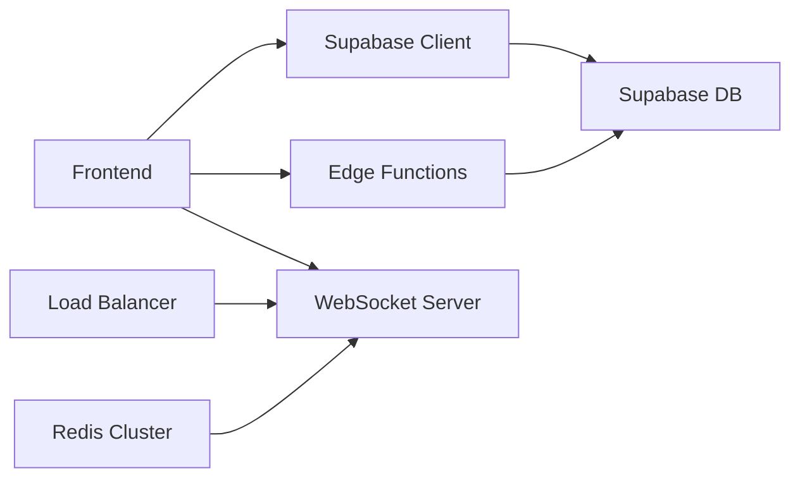

# Network Troubleshooting

<cite>
**Referenced Files in This Document**
- [email-service.ts](file://src/lib/email-service.ts)
- [payment-simulation.ts](file://src/lib/payment-simulation.ts)
- [ipCheck.ts](file://src/lib/ipCheck.ts)
- [cache.ts](file://src/lib/cache.ts)
- [sentry.ts](file://src/lib/sentry.ts)
- [analytics.ts](file://src/lib/analytics.ts)
- [capacitor.ts](file://src/lib/capacitor.ts)
- [client.ts](file://src/integrations/supabase/client.ts)
- [useDeliveryNotifications.ts](file://src/hooks/useDeliveryNotifications.ts)
- [delivery.ts](file://src/integrations/supabase/delivery.ts)
- [CustomerDeliveryTracker.tsx](file://src/components/customer/CustomerDeliveryTracker.tsx)
- [trackingSocket.ts](file://src/fleet/services/trackingSocket.ts)
- [index.ts](file://supabase/functions/check-ip-location/index.ts)
- [index.ts](file://supabase/functions/log-user-ip/index.ts)
- [index.ts](file://supabase/functions/simulate-payment/index.ts)
- [index.ts](file://supabase/functions/zhipu-test/index.ts)
- [realtime.spec.ts](file://e2e/system/realtime.spec.ts)
- [errors.spec.ts](file://e2e/system/errors.spec.ts)
- [performance-benchmark.ts](file://scripts/performance-benchmark.ts)
- [Dockerfile](file://websocket-server/Dockerfile)
- [NUTRIOFUEL_PRINT_READY.html](file://NUTRIOFUEL_PRINT_READY.html)
</cite>

## Table of Contents
1. [Introduction](#introduction)
2. [Project Structure](#project-structure)
3. [Core Components](#core-components)
4. [Architecture Overview](#architecture-overview)
5. [Detailed Component Analysis](#detailed-component-analysis)
6. [Dependency Analysis](#dependency-analysis)
7. [Performance Considerations](#performance-considerations)
8. [Troubleshooting Guide](#troubleshooting-guide)
9. [Conclusion](#conclusion)

## Introduction
This document provides a comprehensive guide to network troubleshooting in the Nutrio application. It focuses on:
- API connectivity debugging (HTTP status codes, request/response inspection, CORS)
- WebSocket connection debugging (establishment, message formatting, reconnection)
- Network performance analysis (latency, bandwidth, connection pooling)
- Proxy/firewall/SSL/DNS issues
- Offline functionality and synchronization
- Real-time notifications
- Practical examples for payment failures, order tracking, and multi-portal communication

## Project Structure
The network stack spans frontend services, Supabase Edge Functions, and a dedicated WebSocket server. Key areas include:
- Frontend HTTP clients and integrations (Supabase, email, analytics, Sentry)
- Edge Functions for IP checks, user IP logging, payment simulation, and auxiliary tests
- WebSocket service for real-time fleet tracking
- E2E tests validating real-time and error handling

**Diagram sources**
- [email-service.ts:50-84](file://src/lib/email-service.ts#L50-L84)
- [ipCheck.ts:47-80](file://src/lib/ipCheck.ts#L47-L80)
- [client.ts:47-57](file://src/integrations/supabase/client.ts#L47-L57)
- [trackingSocket.ts:34-95](file://src/fleet/services/trackingSocket.ts#L34-L95)
- [index.ts:1-107](file://supabase/functions/check-ip-location/index.ts#L1-L107)
- [index.ts:1-65](file://supabase/functions/log-user-ip/index.ts#L1-L65)
- [index.ts:1-119](file://supabase/functions/simulate-payment/index.ts#L1-L119)
- [index.ts:42-57](file://supabase/functions/zhipu-test/index.ts#L42-L57)

**Section sources**
- [email-service.ts:50-84](file://src/lib/email-service.ts#L50-L84)
- [ipCheck.ts:47-80](file://src/lib/ipCheck.ts#L47-L80)
- [client.ts:47-57](file://src/integrations/supabase/client.ts#L47-L57)
- [trackingSocket.ts:34-95](file://src/fleet/services/trackingSocket.ts#L34-L95)
- [index.ts:1-107](file://supabase/functions/check-ip-location/index.ts#L1-L107)
- [index.ts:1-65](file://supabase/functions/log-user-ip/index.ts#L1-L65)
- [index.ts:1-119](file://supabase/functions/simulate-payment/index.ts#L1-L119)
- [index.ts:42-57](file://supabase/functions/zhipu-test/index.ts#L42-L57)

## Core Components
- HTTP clients and integrations:
  - Email service posts to Edge Functions with bearer tokens and JSON payloads.
  - IP check and user IP logging call Supabase Edge Functions with proper headers.
  - Supabase client uses Capacitor preferences for native sessions.
- Edge Functions:
  - IP location and user IP logging implement CORS headers and error handling.
  - Payment simulation and zhipu test demonstrate request/response patterns and CORS.
- Realtime:
  - Supabase Realtime channels for delivery updates and driver location.
  - Native WebSocket service for fleet tracking with reconnection and message queue.
- Observability:
  - Sentry captures errors and PII-filtered context.
  - PostHog tracks events and page views with sanitization.
- Caching:
  - Cache manager provides TTL-based caching with in-memory fallback.

**Section sources**
- [email-service.ts:50-84](file://src/lib/email-service.ts#L50-L84)
- [ipCheck.ts:47-80](file://src/lib/ipCheck.ts#L47-L80)
- [client.ts:47-57](file://src/integrations/supabase/client.ts#L47-L57)
- [useDeliveryNotifications.ts:31-44](file://src/hooks/useDeliveryNotifications.ts#L31-L44)
- [delivery.ts:695-734](file://src/integrations/supabase/delivery.ts#L695-L734)
- [CustomerDeliveryTracker.tsx:198-216](file://src/components/customer/CustomerDeliveryTracker.tsx#L198-L216)
- [trackingSocket.ts:34-95](file://src/fleet/services/trackingSocket.ts#L34-L95)
- [sentry.ts:39-57](file://src/lib/sentry.ts#L39-L57)
- [analytics.ts:56-68](file://src/lib/analytics.ts#L56-L68)
- [cache.ts:37-86](file://src/lib/cache.ts#L37-L86)

## Architecture Overview
The application integrates HTTP and WebSocket pathways for real-time features, with Edge Functions bridging frontend requests to backend services.

**Diagram sources**
- [email-service.ts:50-84](file://src/lib/email-service.ts#L50-L84)
- [index.ts:42-57](file://supabase/functions/zhipu-test/index.ts#L42-L57)

**Section sources**
- [email-service.ts:50-84](file://src/lib/email-service.ts#L50-L84)
- [index.ts:42-57](file://supabase/functions/zhipu-test/index.ts#L42-L57)

## Detailed Component Analysis

### API Connectivity Debugging
- HTTP status code analysis:
  - Inspect response.ok and return appropriate error handling.
  - For Edge Functions, verify CORS headers and status codes in function responses.
- Request/response inspection:
  - Log request URLs, headers, and bodies before sending.
  - Capture function responses and surface meaningful error messages.
- CORS issue resolution:
  - Ensure Access-Control-Allow-Origin and required headers are present.
  - Handle preflight OPTIONS requests.

**Diagram sources**
- [email-service.ts:50-84](file://src/lib/email-service.ts#L50-L84)
- [index.ts:10-12](file://supabase/functions/simulate-payment/index.ts#L10-L12)

**Section sources**
- [email-service.ts:50-84](file://src/lib/email-service.ts#L50-L84)
- [index.ts:10-12](file://supabase/functions/simulate-payment/index.ts#L10-L12)
- [index.ts:42-57](file://supabase/functions/zhipu-test/index.ts#L42-L57)

### WebSocket Connection Debugging
- Connection establishment:
  - Use native WebSocket with token query parameter.
  - Subscribe to city channels upon connect.
- Message formatting:
  - Enforce event/data shape and validate incoming messages.
- Reconnection strategies:
  - Exponential backoff with capped attempts.
  - Queue messages until connected; flush on open.

**Diagram sources**
- [trackingSocket.ts:34-95](file://src/fleet/services/trackingSocket.ts#L34-L95)
- [trackingSocket.ts:162-178](file://src/fleet/services/trackingSocket.ts#L162-L178)

**Section sources**
- [trackingSocket.ts:34-95](file://src/fleet/services/trackingSocket.ts#L34-L95)
- [trackingSocket.ts:162-178](file://src/fleet/services/trackingSocket.ts#L162-L178)

### Real-Time Delivery Updates
- Supabase Realtime channels:
  - Subscribe to delivery updates and driver location changes.
  - Unsubscribe on component unmount to prevent leaks.
- Delivery tracker:
  - Fetch delivery job and manage channel lifecycle.

**Diagram sources**
- [delivery.ts:695-734](file://src/integrations/supabase/delivery.ts#L695-L734)
- [useDeliveryNotifications.ts:31-44](file://src/hooks/useDeliveryNotifications.ts#L31-L44)
- [CustomerDeliveryTracker.tsx:198-216](file://src/components/customer/CustomerDeliveryTracker.tsx#L198-L216)

**Section sources**
- [delivery.ts:695-734](file://src/integrations/supabase/delivery.ts#L695-L734)
- [useDeliveryNotifications.ts:31-44](file://src/hooks/useDeliveryNotifications.ts#L31-L44)
- [CustomerDeliveryTracker.tsx:198-216](file://src/components/customer/CustomerDeliveryTracker.tsx#L198-L216)

### IP Restrictions and Location Checks
- IP geolocation and blocking:
  - Edge Function validates forwarded IP, checks database, and calls ip-api.com.
  - Implements CORS and graceful failure modes.
- Frontend IP check:
  - Calls Edge Function and handles non-blocking failures.

**Diagram sources**
- [index.ts:26-94](file://supabase/functions/check-ip-location/index.ts#L26-L94)
- [ipCheck.ts:47-80](file://src/lib/ipCheck.ts#L47-L80)

**Section sources**
- [index.ts:26-94](file://supabase/functions/check-ip-location/index.ts#L26-L94)
- [ipCheck.ts:47-80](file://src/lib/ipCheck.ts#L47-L80)

### Payment Simulation and Edge Function Patterns
- Payment simulation:
  - Demonstrates request/response, artificial delays, and outcomes.
- Edge Function structure:
  - Handles OPTIONS, sets CORS headers, and returns structured JSON.

**Diagram sources**
- [index.ts:28-110](file://supabase/functions/simulate-payment/index.ts#L28-L110)
- [payment-simulation.ts:38-140](file://src/lib/payment-simulation.ts#L38-L140)

**Section sources**
- [index.ts:28-110](file://supabase/functions/simulate-payment/index.ts#L28-L110)
- [payment-simulation.ts:38-140](file://src/lib/payment-simulation.ts#L38-L140)

### Observability and Logging
- Sentry:
  - Initializes in production, filters PII, captures exceptions and messages.
- PostHog:
  - Tracks events and page views with sanitization and opt-out in dev.
- Frontend analytics:
  - Centralized event tracking helpers.

**Section sources**
- [sentry.ts:39-57](file://src/lib/sentry.ts#L39-L57)
- [analytics.ts:56-68](file://src/lib/analytics.ts#L56-L68)

### Caching and Offline Behavior
- Cache manager:
  - TTL-based caching with in-memory fallback.
  - Provides helpers to fetch and invalidate cached data.

**Section sources**
- [cache.ts:37-86](file://src/lib/cache.ts#L37-L86)

## Dependency Analysis
- Frontend depends on Supabase client for HTTP and Realtime.
- Edge Functions depend on Supabase client and external APIs (ip-api.com).
- WebSocket server is separate and horizontally scalable behind a load balancer.

**Diagram sources**
- [client.ts:47-57](file://src/integrations/supabase/client.ts#L47-L57)
- [index.ts:1-107](file://supabase/functions/check-ip-location/index.ts#L1-L107)
- [Dockerfile:1-52](file://websocket-server/Dockerfile#L1-L52)
- [NUTRIOFUEL_PRINT_READY.html:3802-3816](file://NUTRIOFUEL_PRINT_READY.html#L3802-L3816)

**Section sources**
- [client.ts:47-57](file://src/integrations/supabase/client.ts#L47-L57)
- [index.ts:1-107](file://supabase/functions/check-ip-location/index.ts#L1-L107)
- [Dockerfile:1-52](file://websocket-server/Dockerfile#L1-L52)
- [NUTRIOFUEL_PRINT_READY.html:3802-3816](file://NUTRIOFUEL_PRINT_READY.html#L3802-L3816)

## Performance Considerations
- Latency measurement:
  - Use performance.now() around critical fetch calls and Edge Function invocations.
- Bandwidth optimization:
  - Minimize payload sizes; leverage Supabase RPCs and efficient queries.
- Connection pooling:
  - Supabase client manages auth persistence; avoid redundant client creation.
- Benchmarking:
  - Use performance-benchmark script to measure query latencies and detect regressions.

**Section sources**
- [performance-benchmark.ts:133-267](file://scripts/performance-benchmark.ts#L133-L267)
- [client.ts:47-57](file://src/integrations/supabase/client.ts#L47-L57)

## Troubleshooting Guide

### API Connectivity Issues
- HTTP status code analysis:
  - Log response.status and response.statusText.
  - Surface data.error or default messages when response.ok is false.
- Request/response inspection:
  - Verify Authorization header and Content-Type.
  - Inspect function logs for CORS mismatches.
- CORS resolution:
  - Confirm Access-Control-Allow-Origin and required headers in function responses.
  - Handle OPTIONS preflights explicitly.

**Section sources**
- [email-service.ts:74-84](file://src/lib/email-service.ts#L74-L84)
- [index.ts:10-12](file://supabase/functions/simulate-payment/index.ts#L10-L12)
- [index.ts:42-57](file://supabase/functions/zhipu-test/index.ts#L42-L57)

### WebSocket Connection Problems
- Establish connection:
  - Ensure WS_URL is reachable and token is attached as query parameter.
- Message formatting:
  - Validate event/data shapes; log unknown events.
- Reconnection:
  - Monitor exponential backoff attempts and stop on max retries.
  - Verify message queue flush after reconnect.

**Section sources**
- [trackingSocket.ts:34-95](file://src/fleet/services/trackingSocket.ts#L34-L95)
- [trackingSocket.ts:162-178](file://src/fleet/services/trackingSocket.ts#L162-L178)

### Real-Time Delivery Updates
- Subscription lifecycle:
  - Subscribe on mount and unsubscribe on unmount to prevent leaks.
- Delivery job retrieval:
  - Fetch without embedding foreign keys to avoid PostgREST issues.

**Section sources**
- [useDeliveryNotifications.ts:31-44](file://src/hooks/useDeliveryNotifications.ts#L31-L44)
- [delivery.ts:695-734](file://src/integrations/supabase/delivery.ts#L695-L734)
- [CustomerDeliveryTracker.tsx:198-216](file://src/components/customer/CustomerDeliveryTracker.tsx#L198-L216)

### Proxy, Firewall, SSL, and DNS
- Proxy/firewall:
  - Verify outbound access to ip-api.com and Supabase endpoints.
- SSL/TLS:
  - Ensure HTTPS endpoints and valid certificates for Edge Functions and WebSocket server.
- DNS:
  - Confirm resolution of Supabase and external domains; test with curl/nslookup.

[No sources needed since this section provides general guidance]

### Offline Functionality and Synchronization
- Session persistence:
  - Capacitor Preferences storage for native apps; localStorage for web.
- Caching:
  - Use cache manager for frequent reads; invalidate on mutations.
- Graceful degradation:
  - Fail-open/fail-closed strategies for IP checks and non-critical operations.

**Section sources**
- [client.ts:18-45](file://src/integrations/supabase/client.ts#L18-L45)
- [cache.ts:37-86](file://src/lib/cache.ts#L37-L86)
- [ipCheck.ts:57-80](file://src/lib/ipCheck.ts#L57-L80)

### Real-Time Notifications Delivery
- Browser notifications:
  - Request permission and send notifications on delivery updates.
- Supabase Realtime:
  - Subscribe to user-specific channels for timely updates.

**Section sources**
- [useDeliveryNotifications.ts:13-29](file://src/hooks/useDeliveryNotifications.ts#L13-L29)
- [useDeliveryNotifications.ts:31-44](file://src/hooks/useDeliveryNotifications.ts#L31-L44)

### Practical Examples

#### Payment Processing Failures
- Symptom: Payments fail with simulated declines.
- Steps:
  - Verify simulate-payment Edge Function response and gateway_response.
  - Check payment-simulation service outcomes and artificial delays.
  - Review Sentry logs for underlying errors.

**Section sources**
- [index.ts:83-100](file://supabase/functions/simulate-payment/index.ts#L83-L100)
- [payment-simulation.ts:108-140](file://src/lib/payment-simulation.ts#L108-L140)
- [sentry.ts:39-57](file://src/lib/sentry.ts#L39-L57)

#### Order Tracking Issues
- Symptom: No real-time updates for delivery status.
- Steps:
  - Confirm Supabase Realtime channel subscription and unsubscription.
  - Validate delivery job retrieval and payload handling.
  - Check browser notification permissions and delivery notifications hook.

**Section sources**
- [delivery.ts:695-734](file://src/integrations/supabase/delivery.ts#L695-L734)
- [CustomerDeliveryTracker.tsx:198-216](file://src/components/customer/CustomerDeliveryTracker.tsx#L198-L216)
- [useDeliveryNotifications.ts:31-44](file://src/hooks/useDeliveryNotifications.ts#L31-L44)

#### Multi-Portal Communication
- Symptom: Inconsistent status across portals.
- Steps:
  - Review system integration flow and status transitions.
  - Ensure WebSocket fallback polling is active when needed.
  - Validate horizontal scaling configuration and sticky sessions.

**Section sources**
- [trackingSocket.ts:162-178](file://src/fleet/services/trackingSocket.ts#L162-L178)
- [Dockerfile:1-52](file://websocket-server/Dockerfile#L1-L52)

### E2E Test Coverage
- Realtime tests:
  - Validate WebSocket connection and status update expectations.
- Error handling:
  - Verify 404 and 500 page handling and offline state behavior.

**Section sources**
- [realtime.spec.ts:8-37](file://e2e/system/realtime.spec.ts#L8-L37)
- [errors.spec.ts:8-42](file://e2e/system/errors.spec.ts#L8-L42)

## Conclusion
This guide consolidates practical techniques for diagnosing and resolving network issues across HTTP, WebSocket, Edge Functions, and real-time channels. By leveraging structured request/response inspection, CORS verification, robust reconnection strategies, and observability tools, teams can maintain reliable connectivity and real-time experiences across all portals.