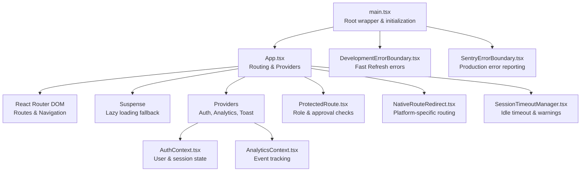
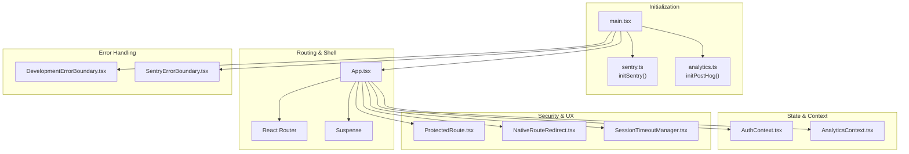
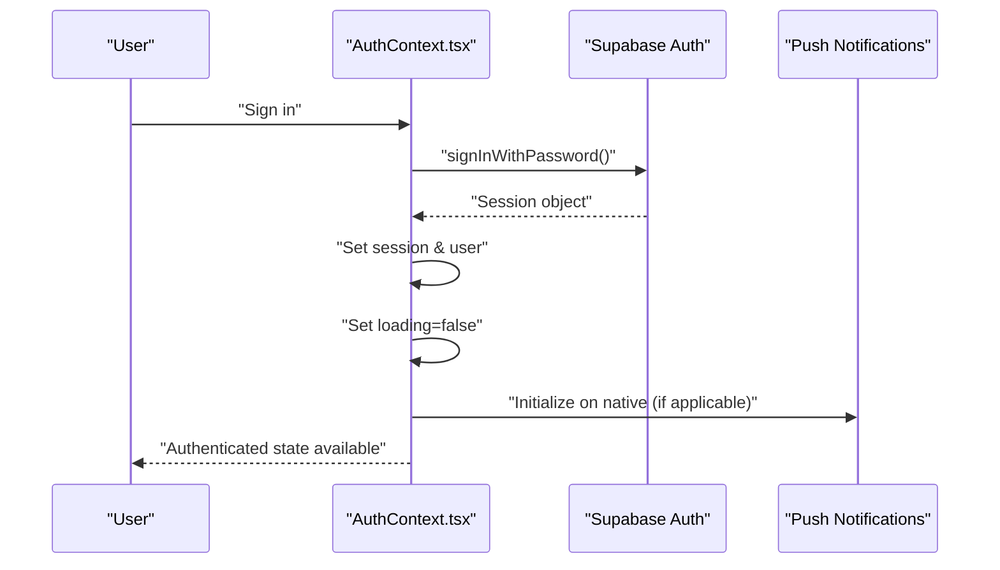
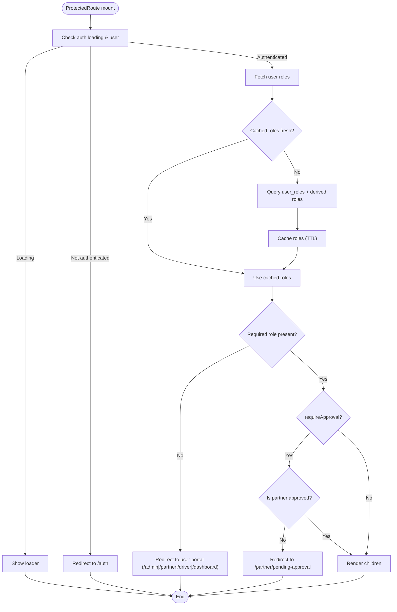
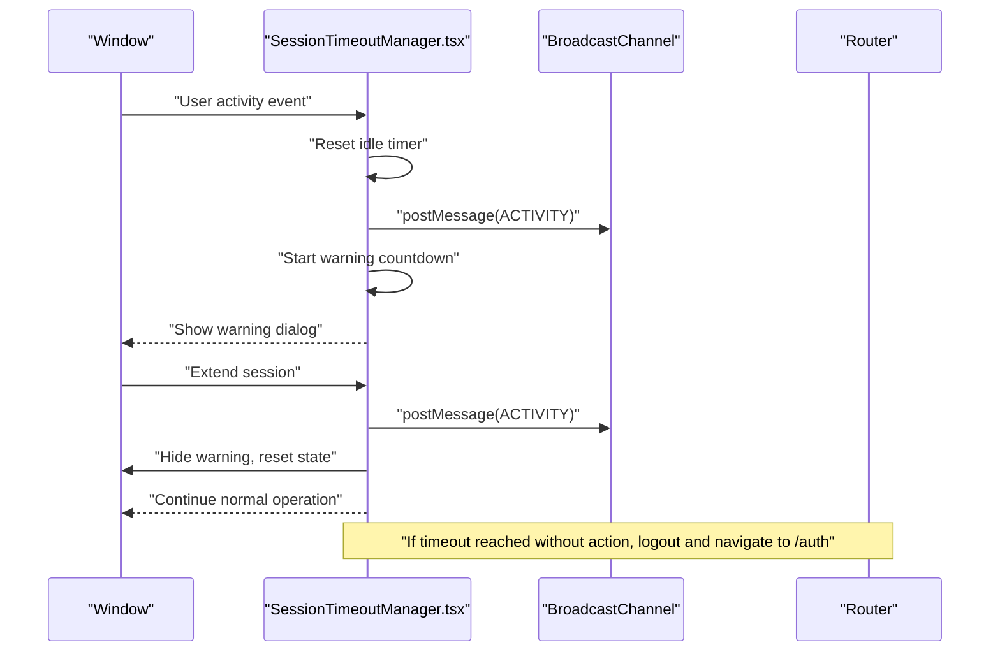
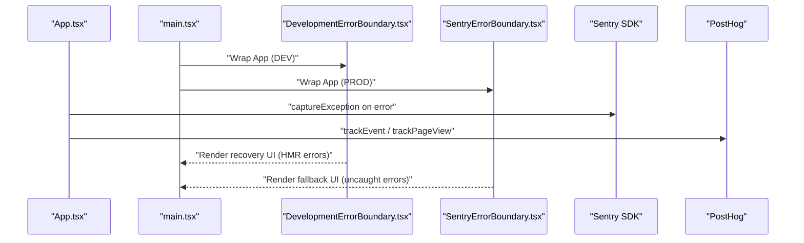
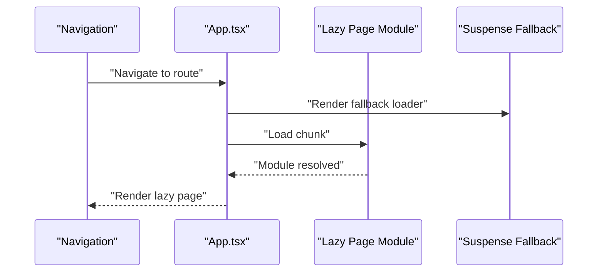
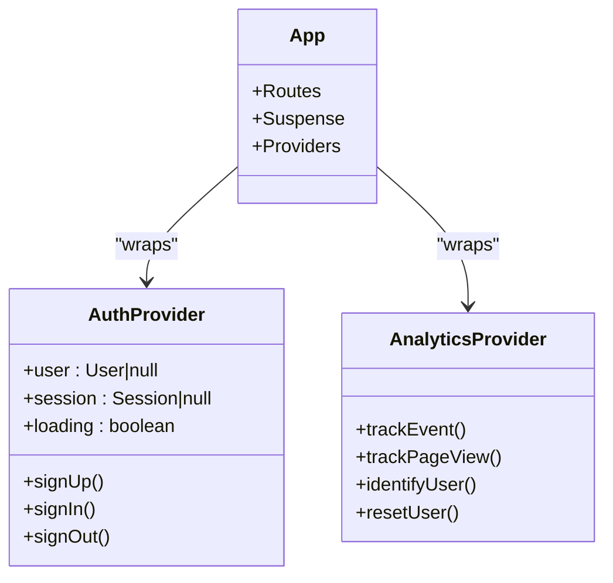
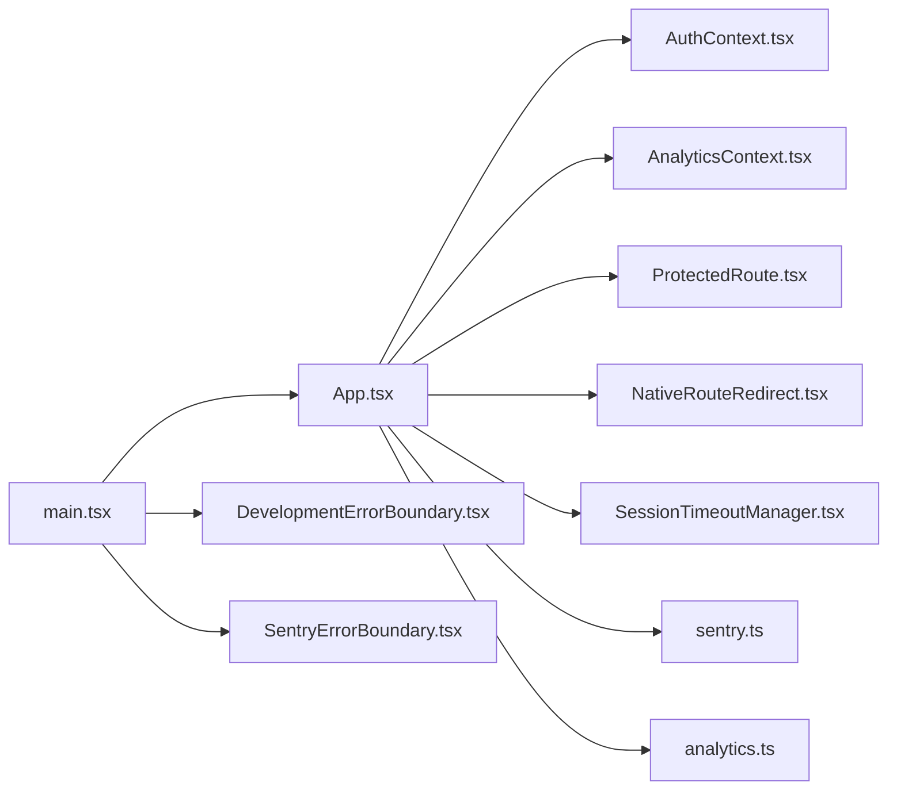

# React Debugging Techniques

<cite>
**Referenced Files in This Document**
- [App.tsx](file://src/App.tsx)
- [main.tsx](file://src/main.tsx)
- [AuthContext.tsx](file://src/contexts/AuthContext.tsx)
- [AnalyticsContext.tsx](file://src/contexts/AnalyticsContext.tsx)
- [DevelopmentErrorBoundary.tsx](file://src/components/DevelopmentErrorBoundary.tsx)
- [SentryErrorBoundary.tsx](file://src/components/SentryErrorBoundary.tsx)
- [ProtectedRoute.tsx](file://src/components/ProtectedRoute.tsx)
- [SessionTimeoutManager.tsx](file://src/components/SessionTimeoutManager.tsx)
- [NativeRouteRedirect.tsx](file://src/components/NativeRouteRedirect.tsx)
- [sentry.ts](file://src/lib/sentry.ts)
- [analytics.ts](file://src/lib/analytics.ts)
</cite>

## Table of Contents
1. [Introduction](#introduction)
2. [Project Structure](#project-structure)
3. [Core Components](#core-components)
4. [Architecture Overview](#architecture-overview)
5. [Detailed Component Analysis](#detailed-component-analysis)
6. [Dependency Analysis](#dependency-analysis)
7. [Performance Considerations](#performance-considerations)
8. [Troubleshooting Guide](#troubleshooting-guide)
9. [Conclusion](#conclusion)

## Introduction
This document provides comprehensive React debugging techniques tailored to the Nutrio application. It focuses on practical, code-backed strategies for inspecting component hierarchies, state and props, lifecycle behavior, hooks, context providers, error boundaries, routing, Suspense and lazy loading, concurrent features, and analytics/error monitoring. The guidance leverages the actual application’s architecture, including React Router, React Query, Supabase authentication, and integrated observability tools.

## Project Structure
The application bootstraps via a root wrapper that initializes analytics, error boundaries, and native app features, then renders the main App shell. The App sets up routing, lazy-loading, Suspense, providers, and protected routes. Contexts manage authentication and analytics, while dedicated components implement session timeout handling, native route redirection, and error boundaries.

**Diagram sources**
- [main.tsx:20-47](file://src/main.tsx#L20-L47)
- [App.tsx:139-736](file://src/App.tsx#L139-L736)
- [AuthContext.tsx:31-130](file://src/contexts/AuthContext.tsx#L31-L130)
- [AnalyticsContext.tsx:22-38](file://src/contexts/AnalyticsContext.tsx#L22-L38)
- [ProtectedRoute.tsx:139-230](file://src/components/ProtectedRoute.tsx#L139-L230)
- [NativeRouteRedirect.tsx:15-42](file://src/components/NativeRouteRedirect.tsx#L15-L42)
- [SessionTimeoutManager.tsx:47-317](file://src/components/SessionTimeoutManager.tsx#L47-L317)
- [DevelopmentErrorBoundary.tsx:20-93](file://src/components/DevelopmentErrorBoundary.tsx#L20-L93)
- [SentryErrorBoundary.tsx:14-62](file://src/components/SentryErrorBoundary.tsx#L14-L62)

**Section sources**
- [main.tsx:13-49](file://src/main.tsx#L13-L49)
- [App.tsx:139-736](file://src/App.tsx#L139-L736)

## Core Components
- Root initialization and error boundaries: Initializes Sentry and PostHog, wraps the app with error boundaries, and conditionally shows a splash video on native platforms.
- Application shell: Configures React Router, lazy-loads feature pages, applies Suspense fallbacks, and enforces protected routes.
- Authentication context: Manages user/session state, listens to Supabase auth changes, and exposes sign-up/sign-in/sign-out.
- Analytics context: Initializes PostHog and exposes tracking APIs for events and page views.
- Protected route guard: Enforces authentication, role checks, and approval status for partner routes.
- Native route redirect: Handles platform-specific routing for native vs web.
- Session timeout manager: Monitors user activity, warns before logout, and supports extending sessions.
- Error boundaries: Development boundary for Fast Refresh issues and Sentry-powered production boundary.

**Section sources**
- [main.tsx:13-49](file://src/main.tsx#L13-L49)
- [App.tsx:139-736](file://src/App.tsx#L139-L736)
- [AuthContext.tsx:31-130](file://src/contexts/AuthContext.tsx#L31-L130)
- [AnalyticsContext.tsx:22-38](file://src/contexts/AnalyticsContext.tsx#L22-L38)
- [ProtectedRoute.tsx:139-230](file://src/components/ProtectedRoute.tsx#L139-L230)
- [NativeRouteRedirect.tsx:15-42](file://src/components/NativeRouteRedirect.tsx#L15-L42)
- [SessionTimeoutManager.tsx:47-317](file://src/components/SessionTimeoutManager.tsx#L47-L317)
- [DevelopmentErrorBoundary.tsx:20-93](file://src/components/DevelopmentErrorBoundary.tsx#L20-L93)
- [SentryErrorBoundary.tsx:14-62](file://src/components/SentryErrorBoundary.tsx#L14-L62)

## Architecture Overview
The runtime architecture integrates routing, state management, lazy loading, and observability. The diagram below maps the actual components and their relationships.

**Diagram sources**
- [main.tsx:13-49](file://src/main/tsx#L13-L49)
- [App.tsx:139-736](file://src/App.tsx#L139-L736)
- [AuthContext.tsx:31-130](file://src/contexts/AuthContext.tsx#L31-L130)
- [AnalyticsContext.tsx:22-38](file://src/contexts/AnalyticsContext.tsx#L22-L38)
- [ProtectedRoute.tsx:139-230](file://src/components/ProtectedRoute.tsx#L139-L230)
- [NativeRouteRedirect.tsx:15-42](file://src/components/NativeRouteRedirect.tsx#L15-L42)
- [SessionTimeoutManager.tsx:47-317](file://src/components/SessionTimeoutManager.tsx#L47-L317)
- [DevelopmentErrorBoundary.tsx:20-93](file://src/components/DevelopmentErrorBoundary.tsx#L20-L93)
- [SentryErrorBoundary.tsx:14-62](file://src/components/SentryErrorBoundary.tsx#L14-L62)

## Detailed Component Analysis

### Authentication State Debugging
- Symptom patterns to investigate:
  - Auth state not updating after login/logout.
  - Hook misuse causing “Invalid hook call” errors during hot reload.
  - IP-based login restrictions interfering with legitimate sign-ins.
- Practical debugging steps:
  - Inspect AuthContext state transitions by adding logs around onAuthStateChange and getSession callbacks.
  - Verify Supabase client initialization and environment variables for redirect URLs.
  - Confirm that push notification initialization is gated behind native platform detection.
  - Use the development error boundary to recover from Fast Refresh issues without full reload.
  - Validate IP check integration and error handling paths.

**Diagram sources**
- [AuthContext.tsx:36-61](file://src/contexts/AuthContext.tsx#L36-L61)
- [AuthContext.tsx:87-112](file://src/contexts/AuthContext.tsx#L87-L112)

**Section sources**
- [AuthContext.tsx:31-130](file://src/contexts/AuthContext.tsx#L31-L130)
- [DevelopmentErrorBoundary.tsx:20-93](file://src/components/DevelopmentErrorBoundary.tsx#L20-L93)

### Protected Route and Role-Based Access Debugging
- Symptom patterns to investigate:
  - Users redirected to unexpected portals after login.
  - Partner routes inaccessible despite having the role.
  - Approval status blocking access to partner routes.
- Practical debugging steps:
  - Add logs in ProtectedRoute to trace role retrieval and caching behavior.
  - Verify role hierarchy comparisons and cache TTL.
  - Confirm approval checks for partner routes and fallback navigation logic.
  - Use the role helper hooks to assert permissions in components.

**Diagram sources**
- [ProtectedRoute.tsx:152-189](file://src/components/ProtectedRoute.tsx#L152-L189)
- [ProtectedRoute.tsx:103-137](file://src/components/ProtectedRoute.tsx#L103-L137)
- [ProtectedRoute.tsx:232-263](file://src/components/ProtectedRoute.tsx#L232-L263)

**Section sources**
- [ProtectedRoute.tsx:139-230](file://src/components/ProtectedRoute.tsx#L139-L230)

### Session Timeout and Idle Detection Debugging
- Symptom patterns to investigate:
  - Unexpected logout during long operations.
  - Warning dialog not appearing or timing out incorrectly.
  - Cross-tab synchronization issues.
- Practical debugging steps:
  - Monitor BroadcastChannel messages for activity and logout signals.
  - Temporarily pause timeout during long operations using the exported control hook.
  - Inspect idle timers and countdown intervals; verify passive event listeners.
  - Confirm native platform gating for BroadcastChannel usage.

**Diagram sources**
- [SessionTimeoutManager.tsx:115-150](file://src/components/SessionTimeoutManager.tsx#L115-L150)
- [SessionTimeoutManager.tsx:170-217](file://src/components/SessionTimeoutManager.tsx#L170-L217)
- [SessionTimeoutManager.tsx:229-248](file://src/components/SessionTimeoutManager.tsx#L229-L248)

**Section sources**
- [SessionTimeoutManager.tsx:47-317](file://src/components/SessionTimeoutManager.tsx#L47-L317)

### Error Boundaries and Observability Debugging
- Symptom patterns to investigate:
  - Production crashes without reporting.
  - Development Fast Refresh errors requiring full reload.
  - Analytics not capturing user actions or page views.
- Practical debugging steps:
  - Use SentryErrorBoundary to capture exceptions in production and optionally provide a fallback UI.
  - Use DevelopmentErrorBoundary to recover from HMR-related hook errors without reload.
  - Initialize Sentry and PostHog early in main.tsx and verify environment variables.
  - Confirm beforeSend and sanitize logic for privacy in analytics and Sentry.

**Diagram sources**
- [main.tsx:20-47](file://src/main.tsx#L20-L47)
- [SentryErrorBoundary.tsx:23-33](file://src/components/SentryErrorBoundary.tsx#L23-L33)
- [DevelopmentErrorBoundary.tsx:31-34](file://src/components/DevelopmentErrorBoundary.tsx#L31-L34)
- [sentry.ts:9-37](file://src/lib/sentry.ts#L9-L37)
- [analytics.ts:3-35](file://src/lib/analytics.ts#L3-L35)

**Section sources**
- [SentryErrorBoundary.tsx:14-62](file://src/components/SentryErrorBoundary.tsx#L14-L62)
- [DevelopmentErrorBoundary.tsx:20-93](file://src/components/DevelopmentErrorBoundary.tsx#L20-L93)
- [sentry.ts:3-73](file://src/lib/sentry.ts#L3-L73)
- [analytics.ts:3-170](file://src/lib/analytics.ts#L3-L170)

### Routing, Lazy Loading, and Suspense Debugging
- Symptom patterns to investigate:
  - Blank screen during initial navigation.
  - Long load times for feature pages.
  - Route parameter mismatches or missing lazy chunks.
- Practical debugging steps:
  - Confirm lazy imports resolve and fallback loader renders during Suspense.
  - Verify route guards and layout wrappers are applied correctly.
  - Check native vs web routing differences via NativeRouteRedirect.
  - Use React Developer Tools to inspect Suspense boundaries and loading states.

**Diagram sources**
- [App.tsx:149-149](file://src/App.tsx#L149-L149)
- [App.tsx:21-117](file://src/App.tsx#L21-L117)

**Section sources**
- [App.tsx:139-736](file://src/App.tsx#L139-L736)
- [NativeRouteRedirect.tsx:15-42](file://src/components/NativeRouteRedirect.tsx#L15-L42)

### Context Provider Debugging
- Symptom patterns to investigate:
  - useAuth/useAnalytics throwing “used outside provider” errors.
  - Analytics not identifying users or capturing events.
  - Auth state not shared across nested components.
- Practical debugging steps:
  - Ensure AuthProvider and AnalyticsProvider wrap the application root.
  - Verify provider initialization order and environment gating.
  - Confirm context consumers receive expected values and update accordingly.

**Diagram sources**
- [AuthContext.tsx:31-130](file://src/contexts/AuthContext.tsx#L31-L130)
- [AnalyticsContext.tsx:22-38](file://src/contexts/AnalyticsContext.tsx#L22-L38)
- [App.tsx:139-736](file://src/App.tsx#L139-L736)

**Section sources**
- [AuthContext.tsx:19-25](file://src/contexts/AuthContext.tsx#L19-L25)
- [AnalyticsContext.tsx:41-47](file://src/contexts/AnalyticsContext.tsx#L41-L47)

### Real-Time Data and Concurrent Features
- Symptom patterns to investigate:
  - Stale data after navigation or background focus.
  - React Query invalidation not triggering updates.
  - Concurrency issues with multiple simultaneous requests.
- Practical debugging steps:
  - Use React Developer Tools Profiler to inspect component re-renders and effects.
  - Verify React Query client configuration and stale times.
  - Confirm background fetch policies and refetch behaviors align with user expectations.

[No sources needed since this section provides general guidance]

## Dependency Analysis
The following diagram highlights key dependencies among core debugging components.

**Diagram sources**
- [main.tsx:13-49](file://src/main.tsx#L13-L49)
- [App.tsx:139-736](file://src/App.tsx#L139-L736)
- [AuthContext.tsx:31-130](file://src/contexts/AuthContext.tsx#L31-L130)
- [AnalyticsContext.tsx:22-38](file://src/contexts/AnalyticsContext.tsx#L22-L38)
- [ProtectedRoute.tsx:139-230](file://src/components/ProtectedRoute.tsx#L139-L230)
- [NativeRouteRedirect.tsx:15-42](file://src/components/NativeRouteRedirect.tsx#L15-L42)
- [SessionTimeoutManager.tsx:47-317](file://src/components/SessionTimeoutManager.tsx#L47-L317)
- [DevelopmentErrorBoundary.tsx:20-93](file://src/components/DevelopmentErrorBoundary.tsx#L20-L93)
- [SentryErrorBoundary.tsx:14-62](file://src/components/SentryErrorBoundary.tsx#L14-L62)
- [sentry.ts:3-73](file://src/lib/sentry.ts#L3-L73)
- [analytics.ts:3-170](file://src/lib/analytics.ts#L3-L170)

**Section sources**
- [main.tsx:13-49](file://src/main.tsx#L13-L49)
- [App.tsx:139-736](file://src/App.tsx#L139-L736)

## Performance Considerations
- Use React Developer Tools Profiler to identify expensive components and excessive re-renders.
- Leverage Suspense boundaries to progressively reveal content and avoid blank screens.
- Apply React Query efficiently with appropriate cache times and background refetch policies.
- Minimize heavy computations inside effects; memoize where possible.
- Monitor network requests and optimize lazy-loaded chunks.

[No sources needed since this section provides general guidance]

## Troubleshooting Guide
- Authentication state problems:
  - Verify Supabase auth state listener and session retrieval.
  - Check IP location checks and error handling paths.
  - Ensure push notification initialization is gated for native platforms.

- Subscription management issues:
  - Confirm role and approval checks for partner routes.
  - Validate redirect logic when roles or approvals change.

- Real-time data synchronization:
  - Inspect BroadcastChannel usage for cross-tab synchronization.
  - Use the session timeout control hook to temporarily pause timeouts during long operations.

- Error state debugging:
  - Use SentryErrorBoundary for production crash reporting.
  - Use DevelopmentErrorBoundary to recover from Fast Refresh errors.

**Section sources**
- [AuthContext.tsx:36-61](file://src/contexts/AuthContext.tsx#L36-L61)
- [ProtectedRoute.tsx:152-189](file://src/components/ProtectedRoute.tsx#L152-L189)
- [SessionTimeoutManager.tsx:229-248](file://src/components/SessionTimeoutManager.tsx#L229-L248)
- [SentryErrorBoundary.tsx:23-33](file://src/components/SentryErrorBoundary.tsx#L23-L33)
- [DevelopmentErrorBoundary.tsx:31-34](file://src/components/DevelopmentErrorBoundary.tsx#L31-L34)

## Conclusion
By leveraging the application’s structured providers, guards, and observability layers, you can systematically debug React issues across authentication, routing, state, and performance. Use React Developer Tools for component inspection, Suspense for graceful loading, and the integrated error boundaries for robust error handling. Align analytics and Sentry configurations to capture meaningful telemetry for production stability.