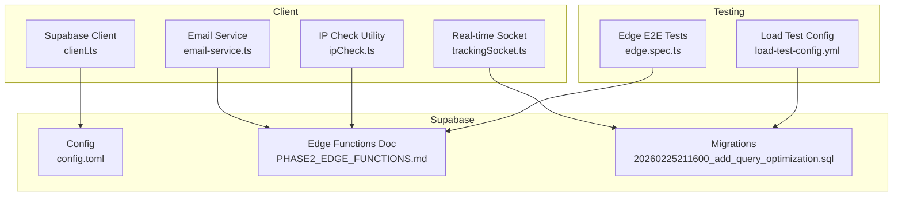
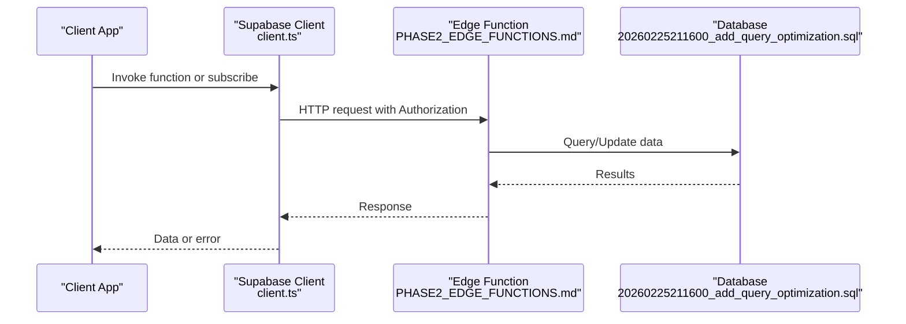
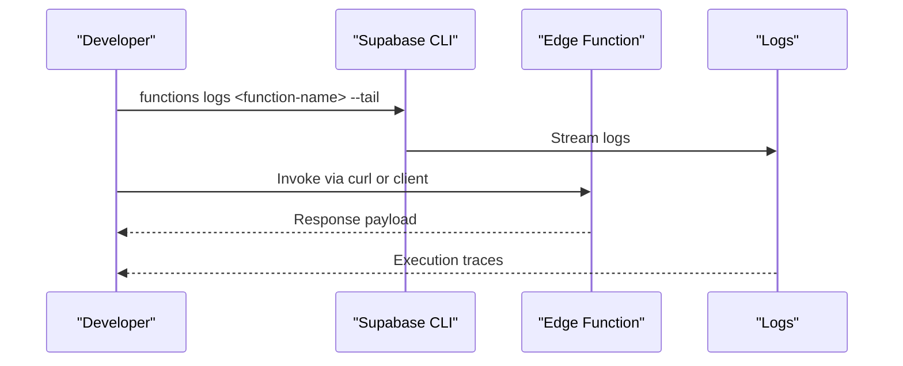
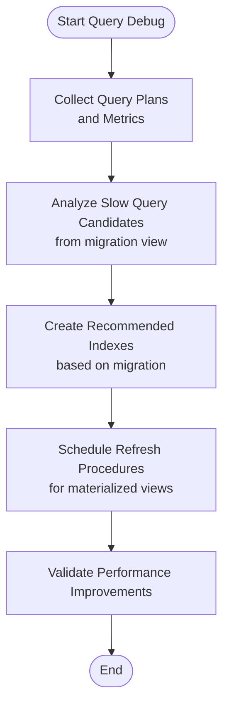
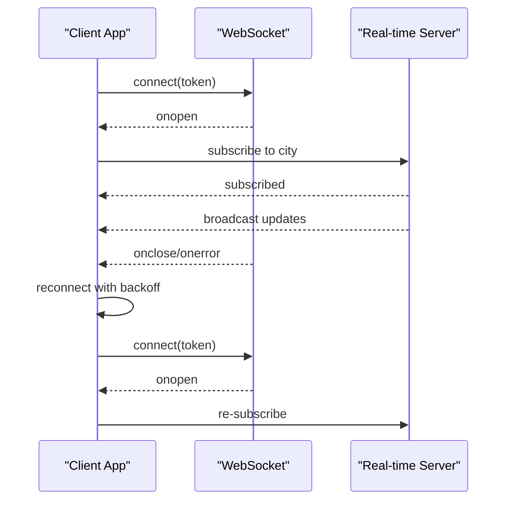
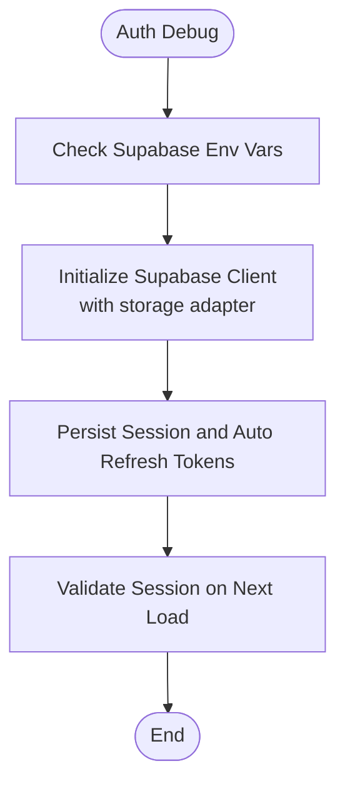
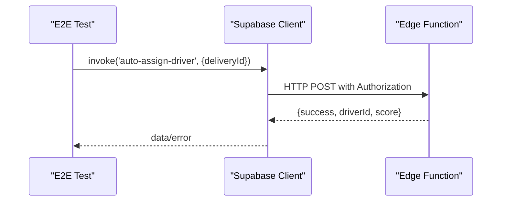
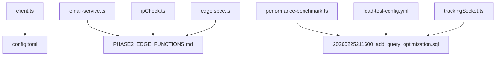

# Supabase Debugging

<cite>
**Referenced Files in This Document**
- [config.toml](file://supabase/config.toml)
- [client.ts](file://src/integrations/supabase/client.ts)
- [PHASE2_EDGE_FUNCTIONS.md](file://supabase/functions/PHASE2_EDGE_FUNCTIONS.md)
- [email-service.ts](file://src/lib/email-service.ts)
- [ipCheck.ts](file://src/lib/ipCheck.ts)
- [performance-benchmark.ts](file://scripts/performance-benchmark.ts)
- [20260225211600_add_query_optimization.sql](file://supabase/migrations/20260225211600_add_query_optimization.sql)
- [trackingSocket.ts](file://src/fleet/services/trackingSocket.ts)
- [edge.spec.ts](file://e2e/system/edge.spec.ts)
- [load-test-config.yml](file://tests/load-test-config.yml)
- [README.md](file://README.md)
</cite>

## Table of Contents
1. [Introduction](#introduction)
2. [Project Structure](#project-structure)
3. [Core Components](#core-components)
4. [Architecture Overview](#architecture-overview)
5. [Detailed Component Analysis](#detailed-component-analysis)
6. [Dependency Analysis](#dependency-analysis)
7. [Performance Considerations](#performance-considerations)
8. [Troubleshooting Guide](#troubleshooting-guide)
9. [Conclusion](#conclusion)
10. [Appendices](#appendices)

## Introduction
This document provides comprehensive debugging guidance for Supabase-powered systems, focusing on:
- Edge function logging and testing
- Database query analysis and optimization
- Real-time subscription debugging for WebSocket connections, presence channels, and broadcast messages
- Authentication debugging including session validation, JWT inspection, and row-level security policy testing
- Database performance debugging, query optimization analysis, and connection pool monitoring
- Practical examples for authentication failures, data synchronization issues, and edge function execution problems

## Project Structure
The repository integrates Supabase across client SDK configuration, edge functions, database migrations, and end-to-end tests. Key areas relevant to debugging include:
- Supabase configuration and function security settings
- Supabase client initialization with storage adapters
- Edge functions documentation and invocation patterns
- Email and IP logging utilities invoking Supabase functions
- Real-time WebSocket client for fleet tracking
- Database migration scripts for analytics and performance tuning
- Load testing and performance benchmarking scripts
- End-to-end test suites covering edge and real-time flows

**Diagram sources**
- [client.ts:1-57](file://src/integrations/supabase/client.ts#L1-L57)
- [email-service.ts:1-53](file://src/lib/email-service.ts#L1-L53)
- [ipCheck.ts:86-107](file://src/lib/ipCheck.ts#L86-L107)
- [trackingSocket.ts:36-214](file://src/fleet/services/trackingSocket.ts#L36-L214)
- [config.toml:1-59](file://supabase/config.toml#L1-L59)
- [PHASE2_EDGE_FUNCTIONS.md:1-411](file://supabase/functions/PHASE2_EDGE_FUNCTIONS.md#L1-L411)
- [20260225211600_add_query_optimization.sql:36-78](file://supabase/migrations/20260225211600_add_query_optimization.sql#L36-L78)
- [load-test-config.yml:154-172](file://tests/load-test-config.yml#L154-L172)
- [edge.spec.ts:1-43](file://e2e/system/edge.spec.ts#L1-L43)

**Section sources**
- [client.ts:1-57](file://src/integrations/supabase/client.ts#L1-L57)
- [config.toml:1-59](file://supabase/config.toml#L1-L59)
- [PHASE2_EDGE_FUNCTIONS.md:1-411](file://supabase/functions/PHASE2_EDGE_FUNCTIONS.md#L1-L411)
- [email-service.ts:1-53](file://src/lib/email-service.ts#L1-L53)
- [ipCheck.ts:86-107](file://src/lib/ipCheck.ts#L86-L107)
- [trackingSocket.ts:36-214](file://src/fleet/services/trackingSocket.ts#L36-L214)
- [20260225211600_add_query_optimization.sql:36-78](file://supabase/migrations/20260225211600_add_query_optimization.sql#L36-L78)
- [load-test-config.yml:154-172](file://tests/load-test-config.yml#L154-L172)
- [edge.spec.ts:1-43](file://e2e/system/edge.spec.ts#L1-L43)

## Core Components
- Supabase client configuration with custom storage adapter for sessions and persistence
- Edge functions documentation and invocation patterns for automated workflows
- Email and IP logging utilities that call Supabase functions
- Real-time WebSocket client for tracking and subscription management
- Database migrations supporting analytics and performance tuning
- Load testing and performance benchmarking scripts

Key debugging touchpoints:
- Client-side session and auth storage behavior
- Edge function deployment, environment variables, and logs
- Real-time subscription events and reconnection logic
- Database query performance and indexing strategies
- Load testing and connection pool monitoring

**Section sources**
- [client.ts:1-57](file://src/integrations/supabase/client.ts#L1-L57)
- [PHASE2_EDGE_FUNCTIONS.md:337-351](file://supabase/functions/PHASE2_EDGE_FUNCTIONS.md#L337-L351)
- [email-service.ts:50-53](file://src/lib/email-service.ts#L50-L53)
- [ipCheck.ts:86-107](file://src/lib/ipCheck.ts#L86-L107)
- [trackingSocket.ts:36-214](file://src/fleet/services/trackingSocket.ts#L36-L214)
- [20260225211600_add_query_optimization.sql:36-78](file://supabase/migrations/20260225211600_add_query_optimization.sql#L36-L78)
- [load-test-config.yml:154-172](file://tests/load-test-config.yml#L154-L172)

## Architecture Overview
The system integrates client-side Supabase SDK, Supabase Edge Functions, and real-time WebSocket subscriptions. Edge functions are invoked via HTTP or the Supabase client, and real-time updates are handled through a WebSocket client.

**Diagram sources**
- [client.ts:47-57](file://src/integrations/supabase/client.ts#L47-L57)
- [PHASE2_EDGE_FUNCTIONS.md:224-254](file://supabase/functions/PHASE2_EDGE_FUNCTIONS.md#L224-L254)
- [20260225211600_add_query_optimization.sql:36-78](file://supabase/migrations/20260225211600_add_query_optimization.sql#L36-L78)

## Detailed Component Analysis

### Edge Function Logging and Testing
- Logging: Use the Supabase CLI to view real-time logs for specific functions.
- Testing: Invoke functions via curl or the Supabase client; verify inputs and outputs as documented.
- Environment variables: Ensure required secrets are set and match expected names.
- Error handling: Functions return structured errors; validate inputs and external service availability.

**Diagram sources**
- [PHASE2_EDGE_FUNCTIONS.md:337-351](file://supabase/functions/PHASE2_EDGE_FUNCTIONS.md#L337-L351)
- [PHASE2_EDGE_FUNCTIONS.md:380-403](file://supabase/functions/PHASE2_EDGE_FUNCTIONS.md#L380-L403)

Practical debugging steps:
- Confirm function deployment and URL resolution.
- Validate environment variables and restart functions after secret changes.
- Inspect function logs for stack traces and error messages.

**Section sources**
- [PHASE2_EDGE_FUNCTIONS.md:337-351](file://supabase/functions/PHASE2_EDGE_FUNCTIONS.md#L337-L351)
- [PHASE2_EDGE_FUNCTIONS.md:380-403](file://supabase/functions/PHASE2_EDGE_FUNCTIONS.md#L380-L403)

### Database Query Analysis and Optimization
- Materialized views and helper views for analytics and slow query candidates.
- Index recommendations for performance tuning.
- Refresh procedures for maintaining analytics accuracy.

**Diagram sources**
- [20260225211600_add_query_optimization.sql:36-78](file://supabase/migrations/20260225211600_add_query_optimization.sql#L36-L78)

Practical debugging steps:
- Use the migration-provided view to identify low-cardinality columns needing indexes.
- Create composite and partial indexes as recommended.
- Schedule and monitor refresh procedures for materialized views.

**Section sources**
- [20260225211600_add_query_optimization.sql:36-78](file://supabase/migrations/20260225211600_add_query_optimization.sql#L36-L78)

### Real-Time Subscription Debugging
- WebSocket connection lifecycle: open, close, error, and message handling.
- Subscription events: per-city subscriptions based on user roles.
- Reconnection strategy with exponential backoff.
- Message queuing until connection is established.

**Diagram sources**
- [trackingSocket.ts:36-95](file://src/fleet/services/trackingSocket.ts#L36-L95)
- [trackingSocket.ts:164-178](file://src/fleet/services/trackingSocket.ts#L164-L178)

Practical debugging steps:
- Verify token transmission via query parameter and server acceptance.
- Confirm subscription events and re-subscription on reconnect.
- Inspect message parsing and error logs for malformed payloads.

**Section sources**
- [trackingSocket.ts:36-95](file://src/fleet/services/trackingSocket.ts#L36-L95)
- [trackingSocket.ts:164-178](file://src/fleet/services/trackingSocket.ts#L164-L178)

### Authentication Debugging
- Session storage: custom storage adapter for Capacitor and localStorage fallback.
- Persistence and token refresh: automatic token refresh and persisted sessions.
- Environment validation: guard against missing Supabase configuration.

**Diagram sources**
- [client.ts:10-16](file://src/integrations/supabase/client.ts#L10-L16)
- [client.ts:47-57](file://src/integrations/supabase/client.ts#L47-L57)

Practical debugging steps:
- Ensure VITE_SUPABASE_URL and VITE_SUPABASE_PUBLISHABLE_KEY are present.
- Verify session persistence across app restarts.
- Confirm token refresh behavior and error handling for storage failures.

**Section sources**
- [client.ts:10-16](file://src/integrations/supabase/client.ts#L10-L16)
- [client.ts:47-57](file://src/integrations/supabase/client.ts#L47-L57)

### Edge Function Testing Methodologies
- Invocation via Supabase client or HTTP requests.
- Input validation and expected outputs documented for each function.
- End-to-end tests for edge workflows.

**Diagram sources**
- [PHASE2_EDGE_FUNCTIONS.md:224-254](file://supabase/functions/PHASE2_EDGE_FUNCTIONS.md#L224-L254)
- [edge.spec.ts:8-21](file://e2e/system/edge.spec.ts#L8-L21)

Practical debugging steps:
- Use documented input schemas and Authorization headers.
- Validate function responses and error conditions.
- Integrate with E2E tests to automate edge function verification.

**Section sources**
- [PHASE2_EDGE_FUNCTIONS.md:224-254](file://supabase/functions/PHASE2_EDGE_FUNCTIONS.md#L224-L254)
- [edge.spec.ts:8-21](file://e2e/system/edge.spec.ts#L8-L21)

### Database Schema Inspection
- Database schema overview and Row Level Security enabled on tables.
- Migration scripts provide schema evolution and performance tuning artifacts.

Practical debugging steps:
- Review migration scripts for recent schema changes.
- Confirm RLS policies and service role permissions for edge functions.
- Use analytics and slow-query views to identify problematic queries.

**Section sources**
- [20260225211600_add_query_optimization.sql:36-78](file://supabase/migrations/20260225211600_add_query_optimization.sql#L36-L78)

### Supabase CLI Debugging Commands
- Install and run the Supabase CLI as documented.
- Bootstrap and manage local environments.
- Use CLI commands for functions deployment, listing, and logs.

Practical debugging steps:
- Install CLI per platform-specific instructions.
- Use bootstrap and project linking commands.
- Tail function logs for real-time visibility.

**Section sources**
- [README.md:1-178](file://README.md#L1-L178)

## Dependency Analysis
The following diagram shows key dependencies among debugging-relevant components.

**Diagram sources**
- [client.ts:1-57](file://src/integrations/supabase/client.ts#L1-L57)
- [config.toml:1-59](file://supabase/config.toml#L1-L59)
- [email-service.ts:1-53](file://src/lib/email-service.ts#L1-L53)
- [ipCheck.ts:86-107](file://src/lib/ipCheck.ts#L86-L107)
- [PHASE2_EDGE_FUNCTIONS.md:1-411](file://supabase/functions/PHASE2_EDGE_FUNCTIONS.md#L1-L411)
- [performance-benchmark.ts:131-232](file://scripts/performance-benchmark.ts#L131-L232)
- [20260225211600_add_query_optimization.sql:36-78](file://supabase/migrations/20260225211600_add_query_optimization.sql#L36-L78)
- [load-test-config.yml:154-172](file://tests/load-test-config.yml#L154-L172)
- [edge.spec.ts:1-43](file://e2e/system/edge.spec.ts#L1-L43)
- [trackingSocket.ts:36-214](file://src/fleet/services/trackingSocket.ts#L36-L214)

**Section sources**
- [client.ts:1-57](file://src/integrations/supabase/client.ts#L1-L57)
- [PHASE2_EDGE_FUNCTIONS.md:1-411](file://supabase/functions/PHASE2_EDGE_FUNCTIONS.md#L1-L411)
- [email-service.ts:1-53](file://src/lib/email-service.ts#L1-L53)
- [ipCheck.ts:86-107](file://src/lib/ipCheck.ts#L86-L107)
- [performance-benchmark.ts:131-232](file://scripts/performance-benchmark.ts#L131-L232)
- [20260225211600_add_query_optimization.sql:36-78](file://supabase/migrations/20260225211600_add_query_optimization.sql#L36-L78)
- [load-test-config.yml:154-172](file://tests/load-test-config.yml#L154-L172)
- [edge.spec.ts:1-43](file://e2e/system/edge.spec.ts#L1-L43)
- [trackingSocket.ts:36-214](file://src/fleet/services/trackingSocket.ts#L36-L214)

## Performance Considerations
- Benchmark queries with iteration counts and statistical metrics (avg, min, max, p95, p99).
- Validate expected vs. unexpected errors to avoid skewing results.
- Monitor database connection pools and edge function scaling during load tests.

Practical guidance:
- Use the performance benchmark script to measure query latency distributions.
- Apply index recommendations from migration scripts to reduce query times.
- Track error rates and response times during load tests to ensure stability.

**Section sources**
- [performance-benchmark.ts:131-232](file://scripts/performance-benchmark.ts#L131-L232)
- [load-test-config.yml:154-172](file://tests/load-test-config.yml#L154-L172)
- [20260225211600_add_query_optimization.sql:36-78](file://supabase/migrations/20260225211600_add_query_optimization.sql#L36-L78)

## Troubleshooting Guide
Common issues and resolutions:
- Authentication failures
  - Missing or invalid Supabase configuration environment variables.
  - Session persistence and token refresh failures.
  - Resolution: verify environment variables and inspect client initialization logs.

- Edge function execution problems
  - Function deployment or URL resolution issues.
  - Missing environment variables or incorrect names.
  - Resolution: check CLI deployment status, list functions, and view logs.

- Data synchronization issues
  - Real-time subscription not receiving updates.
  - Resolution: verify token-based authentication, subscription events, and reconnection behavior.

- Database performance issues
  - Slow queries and missing indexes.
  - Resolution: apply recommended indexes and refresh analytics views.

**Section sources**
- [client.ts:10-16](file://src/integrations/supabase/client.ts#L10-L16)
- [PHASE2_EDGE_FUNCTIONS.md:337-351](file://supabase/functions/PHASE2_EDGE_FUNCTIONS.md#L337-L351)
- [PHASE2_EDGE_FUNCTIONS.md:380-403](file://supabase/functions/PHASE2_EDGE_FUNCTIONS.md#L380-L403)
- [trackingSocket.ts:36-95](file://src/fleet/services/trackingSocket.ts#L36-L95)
- [20260225211600_add_query_optimization.sql:36-78](file://supabase/migrations/20260225211600_add_query_optimization.sql#L36-L78)

## Conclusion
This guide consolidates practical debugging techniques for Supabase across edge functions, database performance, real-time subscriptions, and authentication. Use the referenced files and commands to validate deployments, inspect logs, optimize queries, and troubleshoot connectivity and session issues.

## Appendices
- Supabase CLI installation and usage instructions are available in the project’s README.
- Edge function invocation patterns and testing examples are documented in the edge functions documentation.
- Real-time WebSocket client behavior and subscription logic are implemented in the tracking socket module.
- Database performance tuning and analytics are supported by migration scripts and load testing configurations.

**Section sources**
- [README.md:1-178](file://README.md#L1-L178)
- [PHASE2_EDGE_FUNCTIONS.md:1-411](file://supabase/functions/PHASE2_EDGE_FUNCTIONS.md#L1-L411)
- [trackingSocket.ts:36-214](file://src/fleet/services/trackingSocket.ts#L36-L214)
- [20260225211600_add_query_optimization.sql:36-78](file://supabase/migrations/20260225211600_add_query_optimization.sql#L36-L78)
- [load-test-config.yml:154-172](file://tests/load-test-config.yml#L154-L172)