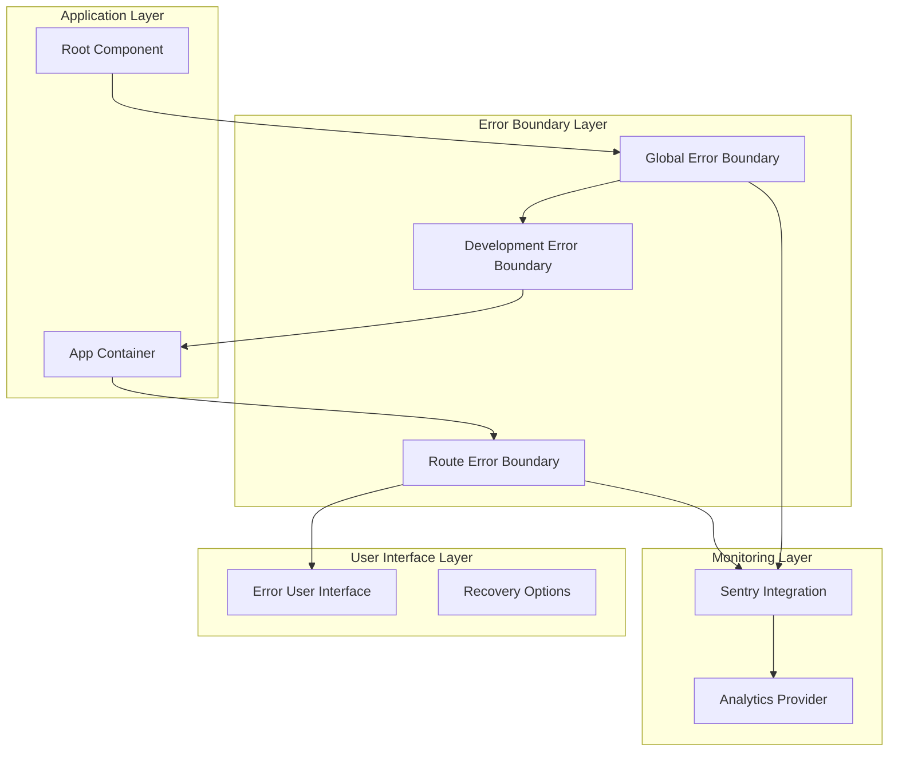
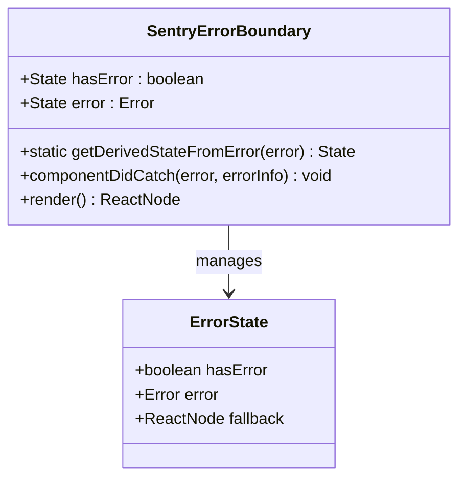
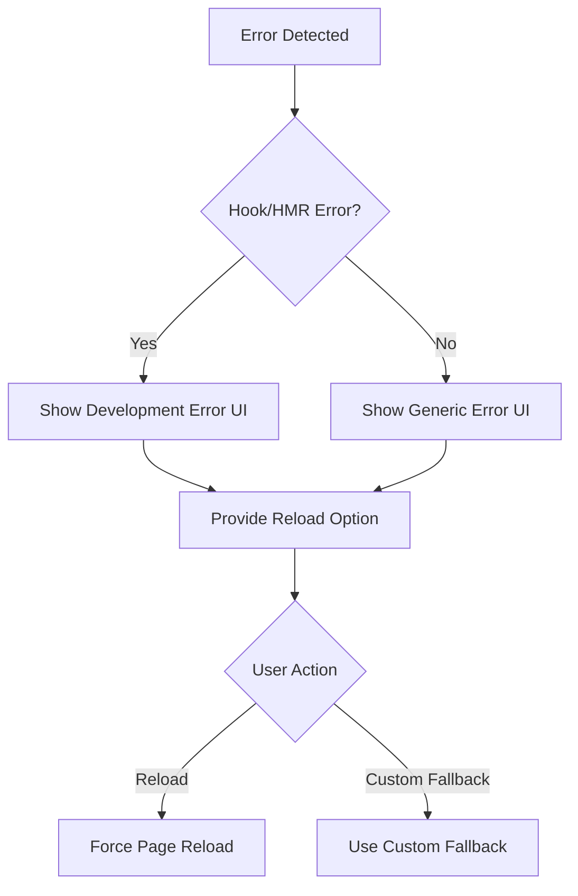
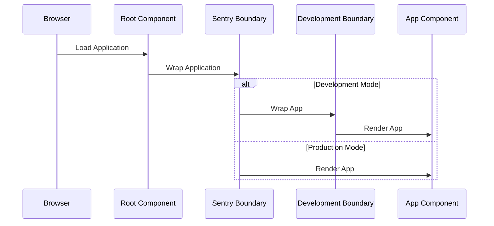
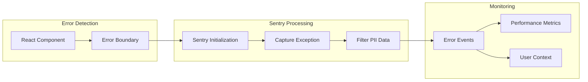
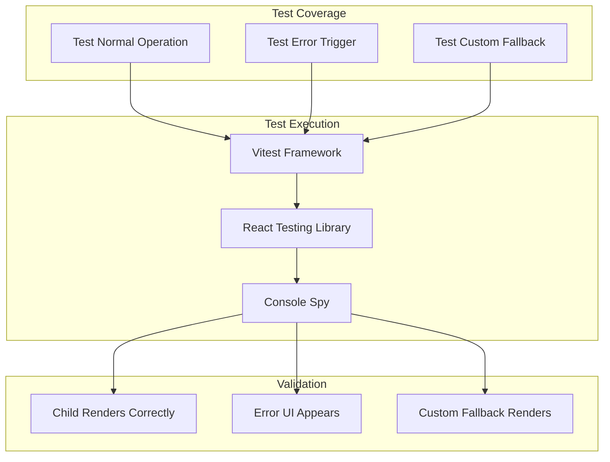
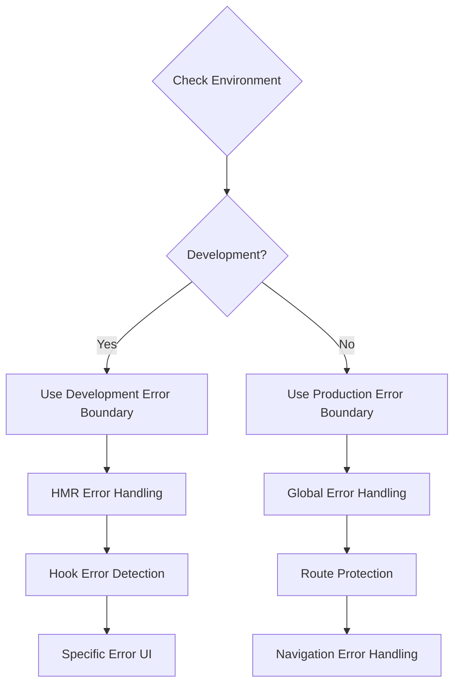

# Error Boundary System

<cite>
**Referenced Files in This Document**
- [main.tsx](file://src/main.tsx)
- [App.tsx](file://src/App.tsx)
- [DevelopmentErrorBoundary.tsx](file://src/components/DevelopmentErrorBoundary.tsx)
- [SentryErrorBoundary.tsx](file://src/components/SentryErrorBoundary.tsx)
- [RouteErrorBoundary.tsx](file://src/components/RouteErrorBoundary.tsx)
- [sentry.ts](file://src/lib/sentry.ts)
- [SentryErrorBoundary.test.tsx](file://src/components/SentryErrorBoundary.test.tsx)
</cite>

## Table of Contents
1. [Introduction](#introduction)
2. [System Architecture](#system-architecture)
3. [Core Components](#core-components)
4. [Error Boundary Types](#error-boundary-types)
5. [Integration Patterns](#integration-patterns)
6. [Error Reporting and Monitoring](#error-reporting-and-monitoring)
7. [Testing Strategy](#testing-strategy)
8. [Development vs Production Handling](#development-vs-production-handling)
9. [Performance Considerations](#performance-considerations)
10. [Troubleshooting Guide](#troubleshooting-guide)
11. [Best Practices](#best-practices)

## Introduction

The Error Boundary System in the Nutrio application provides comprehensive error handling and recovery mechanisms across the entire React application. This system implements multiple layers of error protection, from development-time hot module replacement (HMR) errors to production-level route navigation failures and global application crashes.

The system leverages React's error boundary pattern combined with advanced monitoring through Sentry to provide users with graceful error recovery while ensuring developers receive detailed error information for debugging and improvement.

## System Architecture

The error boundary system follows a hierarchical architecture that protects different layers of the application:

**Diagram sources**
- [main.tsx:30-55](file://src/main.tsx#L30-L55)
- [App.tsx:146-753](file://src/App.tsx#L146-L753)

## Core Components

The error boundary system consists of three primary components working together to provide comprehensive error handling:

### Global Error Boundary (`SentryErrorBoundary`)
The global error boundary serves as the primary protection layer for the entire application, catching unhandled errors that propagate through the component tree.

### Development Error Boundary (`DevelopmentErrorBoundary`)
Specifically designed to handle hot module replacement errors during development, providing targeted solutions for React Fast Refresh issues.

### Route Error Boundary (`RouteErrorBoundary`)
Protects individual routes and provides context-specific error handling for navigation failures.

**Section sources**
- [SentryErrorBoundary.tsx:14-63](file://src/components/SentryErrorBoundary.tsx#L14-L63)
- [DevelopmentErrorBoundary.tsx:20-94](file://src/components/DevelopmentErrorBoundary.tsx#L20-L94)
- [RouteErrorBoundary.tsx:16-42](file://src/components/RouteErrorBoundary.tsx#L16-L42)

## Error Boundary Types

### 1. Global Application Error Boundary

The global error boundary wraps the entire application and handles catastrophic failures that would otherwise crash the entire interface.

**Diagram sources**
- [SentryErrorBoundary.tsx:9-63](file://src/components/SentryErrorBoundary.tsx#L9-L63)

### 2. Development-Specific Error Boundary

Handles hot module replacement errors that occur during development when React Fast Refresh detects hook mismatches or component updates.

**Diagram sources**
- [DevelopmentErrorBoundary.tsx:44-75](file://src/components/DevelopmentErrorBoundary.tsx#L44-L75)

### 3. Route-Level Error Boundary

Provides error handling for individual routes, allowing navigation errors to be contained within specific sections of the application.

**Section sources**
- [RouteErrorBoundary.tsx:16-92](file://src/components/RouteErrorBoundary.tsx#L16-L92)

## Integration Patterns

### Application Root Integration

The error boundaries are integrated at the application root level with conditional logic for development and production environments:

**Diagram sources**
- [main.tsx:43-55](file://src/main.tsx#L43-L55)

### Route-Level Integration

Individual routes are wrapped with the RouteErrorBoundary to provide isolated error handling:

**Section sources**
- [App.tsx:156-157](file://src/App.tsx#L156-L157)
- [App.tsx:744-745](file://src/App.tsx#L744-L745)

## Error Reporting and Monitoring

### Sentry Integration

The system integrates with Sentry for comprehensive error tracking and reporting:

**Diagram sources**
- [sentry.ts:3-37](file://src/lib/sentry.ts#L3-L37)
- [SentryErrorBoundary.tsx:23-33](file://src/components/SentryErrorBoundary.tsx#L23-L33)

### Error Context Management

The system provides sophisticated error context management including user identification and data filtering:

**Section sources**
- [sentry.ts:59-72](file://src/lib/sentry.ts#L59-L72)
- [sentry.ts:28-35](file://src/lib/sentry.ts#L28-L35)

## Testing Strategy

### Unit Testing Approach

The error boundary system includes comprehensive unit testing to ensure reliable error handling:

**Diagram sources**
- [SentryErrorBoundary.test.tsx:10-53](file://src/components/SentryErrorBoundary.test.tsx#L10-L53)

**Section sources**
- [SentryErrorBoundary.test.tsx:1-54](file://src/components/SentryErrorBoundary.test.tsx#L1-L54)

## Development vs Production Handling

### Conditional Error Boundary Selection

The system intelligently selects appropriate error boundaries based on the environment:

**Diagram sources**
- [main.tsx:46-52](file://src/main.tsx#L46-L52)

### Environment-Specific Features

Different error boundaries provide environment-appropriate functionality:

**Section sources**
- [DevelopmentErrorBoundary.tsx:44-75](file://src/components/DevelopmentErrorBoundary.tsx#L44-L75)
- [SentryErrorBoundary.tsx:26-32](file://src/components/SentryErrorBoundary.tsx#L26-L32)

## Performance Considerations

### Error Boundary Overhead

The error boundary system is designed with minimal performance impact:

- **Lightweight Implementation**: Error boundaries have negligible overhead when no errors occur
- **Selective Monitoring**: Sentry integration is disabled in development to avoid unnecessary network requests
- **Conditional Rendering**: Error UI only renders when actual errors are detected

### Memory Management

The system properly manages memory and state:

- **State Cleanup**: Error state is cleared when components successfully render
- **Event Listener Management**: No persistent event listeners are maintained
- **Component Lifecycle**: Proper cleanup during component unmounting

## Troubleshooting Guide

### Common Error Scenarios

#### Development Hot Module Replacement Errors
- **Symptoms**: React Fast Refresh failures during component updates
- **Solution**: Use the development error boundary's reload functionality
- **Prevention**: Ensure proper React hook usage and component structure

#### Route Navigation Errors
- **Symptoms**: Individual route failures without affecting other application sections
- **Solution**: Route error boundary provides isolated recovery options
- **Debugging**: Check Sentry for detailed error context and component stacks

#### Global Application Crashes
- **Symptoms**: Complete application failure requiring full page reload
- **Solution**: Global error boundary displays recovery options
- **Monitoring**: Comprehensive error reporting through Sentry integration

### Debugging Steps

1. **Check Error Boundaries**: Verify error boundary wrapping at appropriate levels
2. **Review Sentry Integration**: Confirm proper initialization and configuration
3. **Examine Error Context**: Review user context and error metadata
4. **Test Recovery**: Verify error recovery mechanisms work correctly

**Section sources**
- [DevelopmentErrorBoundary.tsx:31-34](file://src/components/DevelopmentErrorBoundary.tsx#L31-L34)
- [RouteErrorBoundary.tsx:26-33](file://src/components/RouteErrorBoundary.tsx#L26-L33)

## Best Practices

### Error Boundary Placement

- **Application Root**: Always wrap the main application with the global error boundary
- **Route Level**: Use route error boundaries for complex, error-prone sections
- **Component Level**: Consider component-specific error boundaries for critical functionality

### Error Handling Patterns

- **Graceful Degradation**: Provide meaningful error messages and recovery options
- **User Experience**: Maintain application usability even during error conditions
- **Developer Experience**: Ensure comprehensive error reporting for debugging

### Monitoring and Maintenance

- **Regular Review**: Periodically review error reports and trends
- **Performance Monitoring**: Monitor error rates and their impact on user experience
- **Documentation**: Keep error handling documentation up to date with system changes

### Security Considerations

- **PII Filtering**: Ensure personal identifiable information is filtered from error reports
- **Environment Separation**: Maintain separate error reporting for development and production
- **Access Control**: Limit access to detailed error information to authorized personnel only